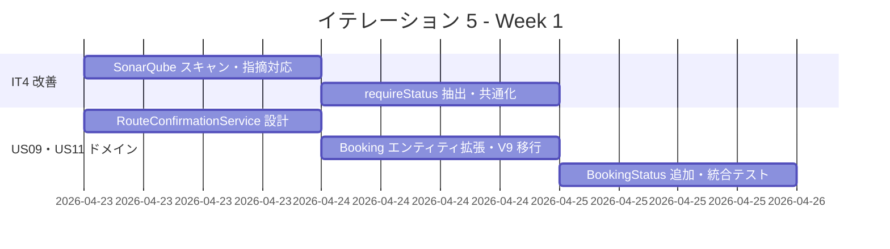
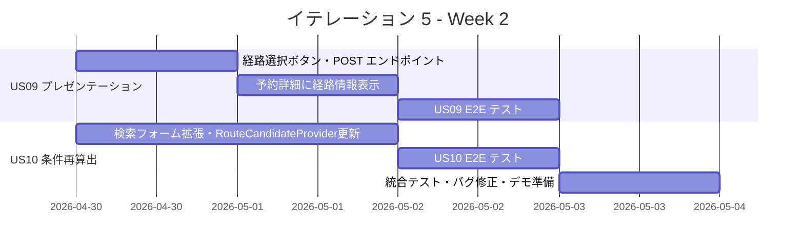
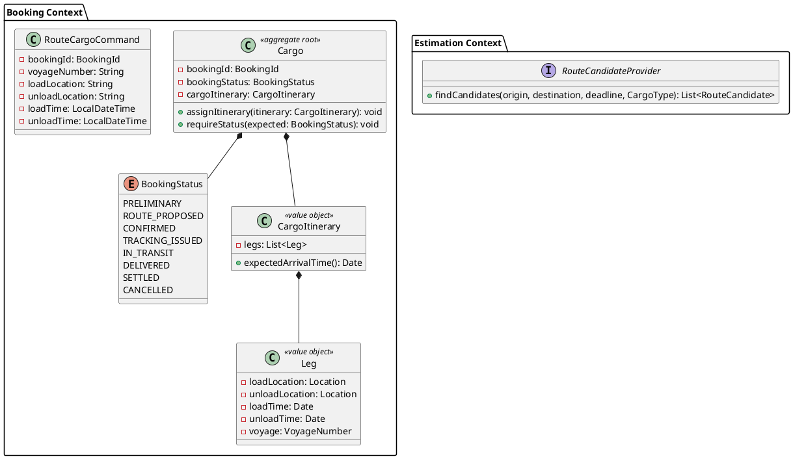
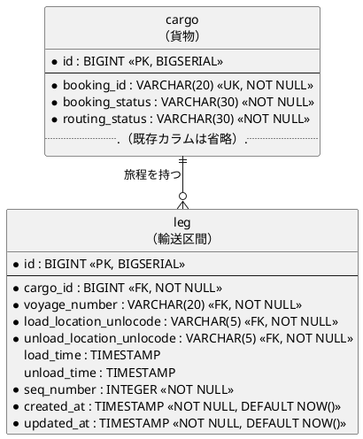
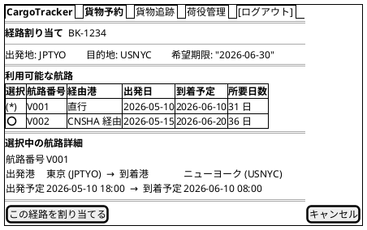
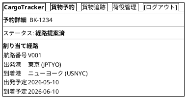
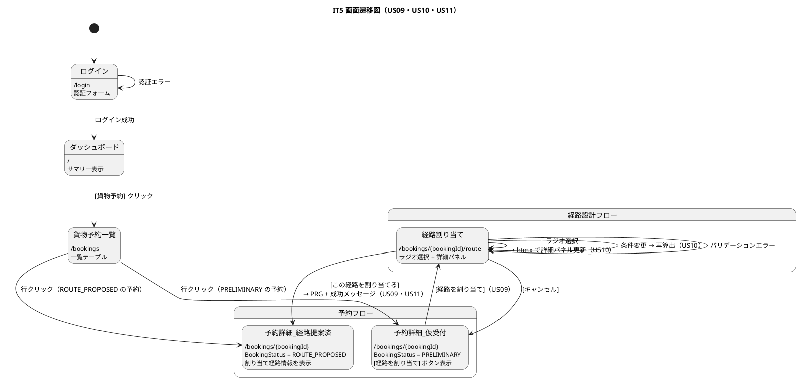

# イテレーション 5 計画

## 概要

| 項目 | 内容 |
|------|------|
| **イテレーション** | 5 |
| **期間** | Week 9-10（2026-04-23 〜 2026-05-06） |
| **ゴール** | 経路選択・確定・条件再算出・予約紐付けを完成させ、Phase 2 の経路設計フローを完結させる。SonarQube Quality Gate をセッション冒頭で必ず確認する |
| **目標 SP** | 10 |

---

## ゴール

### イテレーション終了時の達成状態

1. **品質基盤の確立**: SonarQube Quality Gate PASS（4 イテレーション越しの未確認を解消）・カバレッジ 80% 以上・`Cargo.requireStatus()` 抽出による状態遷移ガードの一元化が完了している
2. **US09 完了**: 経路設計者が経路候補一覧から最適な経路を選択・確定でき、予約に経路が紐付く
3. **US10 完了**: 経路条件（期限・制約等）を変更して経路候補を再算出できる
4. **US11 完了**: 確定した経路（`CargoItinerary` + `Leg`）が `Cargo` 集約に永続化され、`BookingStatus` が `ROUTE_PROPOSED` に遷移する

### 成功基準

- [ ] SonarQube ローカルスキャンを実行し Quality Gate PASS を確認できる
- [ ] `Cargo.requireStatus()` が抽出され、状態遷移ガードが 1 箇所に集約されている
- [ ] ナビゲーション順序が業務フロー順（見積管理→予約管理→荷主管理）に変更されている
- [ ] 経路候補一覧から「選択」ボタンをクリックすると予約に経路が紐付き、詳細画面で確認できる
- [ ] 経路条件（期限・出発地・目的地）を変更すると候補が再算出されて表示される
- [ ] `BookingStatus` が `ROUTE_PROPOSED`（経路提案済）に遷移し、予約詳細画面に経路情報が表示される
- [ ] Java テスト全パス・E2E テスト全パス
- [ ] テストカバレッジ 80% 以上（Routing コンテキスト含む）

---

## ユーザーストーリー

### 対象ストーリー

| ID | ユーザーストーリー | SP | 優先度 |
|----|-------------------|----|--------|
| IT4-改善 | IT4 申し送り改善（SonarQube・状態ガード抽出・ナビ順序） | 2 | 必須 |
| US09 | 経路を選択・確定する | 3 | 必須 |
| US10 | 経路条件を調整して再算出する | 3 | 必須 |
| US11 | 経路情報を予約に紐付ける | 2 | 必須 |
| **合計** | | **10** | |

### ストーリー詳細

#### IT4-改善: IT4 申し送り改善

**内容**:

- SonarQube ローカルスキャン実行・Quality Gate 確認・指摘対応（高優先度 #1）
- `Cargo.requireStatus()` メソッドへ状態遷移ガード抽出（DRY 原則、中優先度 #4）
- `BookingThymeleafController` の try-catch パターンを共通メソッドへ抽出（中優先度 #5）
- ナビゲーション順序を業務フロー順に変更（中優先度 #6）

#### US09: 経路を選択・確定する

**ストーリー**:

> 経路設計者として、算出された経路候補から最適なものを選択し、経路を確定したい。なぜなら、最適経路を正式に確定し、予約への紐付けに進めるからだ。

**受入条件**（`user_story.md` 準拠）:

1. 経路候補一覧（経由港・所要日数・費用・航海番号）を確認できる
2. 最適な経路候補を 1 件選択できる
3. 選択後、経路状態が「確定」になる
4. 最適な候補がない場合、経路条件調整（US10）に進める

#### US10: 経路条件を調整して再算出する

**ストーリー**:

> 経路設計者として、経路算出の条件（期限・出発日範囲・経由地等）を変更して経路候補を再算出したい。なぜなら、初回算出で満足できる候補がない場合に条件を緩和・変更して最適解を探れるからだ。

**受入条件**:

1. 経路割り当て画面で検索条件（期限・出発地・目的地）を変更して再検索できる
2. 変更後の条件で経路候補が再算出されて表示される
3. 条件変更後も推奨順（直行便優先・所要日数昇順）で候補が表示される
4. 条件を満たす候補がない場合、その旨が表示される

#### US11: 経路情報を予約に紐付ける

**ストーリー**:

> 経路設計者として、確定した経路情報を貨物予約に紐付けたい。なぜなら、予約と経路の関連を確立し、営業担当者が荷主にルート提案できるようにするからだ。

**受入条件**（`user_story.md` 準拠）:

1. 確定経路と予約番号を確認できる
2. 経路情報を予約に紐付ける操作を実行できる
3. 紐付け後、予約状態が「経路提案中」（`ROUTE_PROPOSED`）に更新される

---

## タスク

### 1. IT4 申し送り改善（2 SP）

| # | タスク | 見積もり | 担当 | 状態 |
|---|--------|---------|------|------|
| 1.1 | SonarQube ローカルスキャン実行・Quality Gate 確認・指摘対応 | 3h | - | [ ] |
| 1.2 | `Cargo.requireStatus()` メソッド抽出・既存 status チェック箇所をリファクタリング | 2h | - | [ ] |
| 1.3 | `BookingThymeleafController` の try-catch 共通化 | 1h | - | [ ] |
| 1.4 | ナビゲーション順序変更（見積管理→予約管理→荷主管理） | 1h | - | [ ] |

**小計**: 7h（理想時間）

### 2. US09: 経路を選択・確定する（3 SP）

| # | タスク | 見積もり | 担当 | 状態 |
|---|--------|---------|------|------|
| 2.1 | `RouteCargoCommand` / `RouteCargoService` 設計・ユニットテスト作成（TDD） | 3h | - | [ ] |
| 2.2 | 経路割り当て画面をラジオ選択 + 詳細パネル形式に更新（ui_design.md 準拠） | 3h | - | [ ] |
| 2.3 | `POST /bookings/{bookingId}/route` エンドポイント実装（PRG パターン） | 3h | - | [ ] |
| 2.4 | 予約詳細画面に「割り当て経路」セクション追加（`ROUTE_PROPOSED` 時に表示） | 2h | - | [ ] |
| 2.5 | E2E テスト作成（経路選択 → 割り当て → 詳細で「経路提案済」バッジ確認） | 2h | - | [ ] |

**小計**: 13h（理想時間）

### 3. US10: 経路条件を調整して再算出する（3 SP）

| # | タスク | 見積もり | 担当 | 状態 |
|---|--------|---------|------|------|
| 3.1 | 経路割り当て画面の検索フォームに期限・条件変更フィールド追加 | 3h | - | [ ] |
| 3.2 | `GET /bookings/{bookingId}/route/detail` エンドポイント追加（htmx 部分更新用） | 2h | - | [ ] |
| 3.3 | `RouteCandidateProvider.findCandidates()` の条件パラメータ拡張 | 2h | - | [ ] |
| 3.4 | E2E テスト作成（期限変更 → 再算出 → 候補更新確認、候補なし時のメッセージ確認） | 2h | - | [ ] |

**小計**: 9h（理想時間）

### 4. US11: 経路情報を予約に紐付ける（2 SP）

| # | タスク | 見積もり | 担当 | 状態 |
|---|--------|---------|------|------|
| 4.1 | `CargoItinerary`・`Leg` 値オブジェクト実装（domain-model.md 準拠） | 2h | - | [ ] |
| 4.2 | `Cargo.assignItinerary()` 実装（`BookingStatus` を `ROUTE_PROPOSED` に遷移） | 2h | - | [ ] |
| 4.3 | V9 DB マイグレーション（`leg` テーブル新規作成） | 1h | - | [ ] |
| 4.4 | `MyBatisLegRepository` 実装・統合テスト追加 | 2h | - | [ ] |
| 4.5 | E2E テスト: 経路割り当て後に `ROUTE_PROPOSED`（経路提案済）バッジを確認 | 1h | - | [ ] |

**小計**: 8h（理想時間）

### タスク合計

| カテゴリ | SP | 理想時間 | 状態 |
|---------|----|---------|------|
| IT4 申し送り改善 | 2 | 7h | [ ] |
| US09: 経路を選択・確定する | 3 | 13h | [ ] |
| US10: 経路条件を調整して再算出する | 3 | 9h | [ ] |
| US11: 経路情報を予約に紐付ける | 2 | 8h | [ ] |
| **合計** | **10** | **37h** | |

**1 SP あたり**: 約 3.7h（IT4 実績: 3.8h）
**進捗率**: 0% (0/10 SP)

---

## スケジュール

### Week 1（Day 1-5）



| 日 | タスク |
|----|--------|
| Day 1 | IT4 改善: SonarQube スキャン実行・Quality Gate 確認・指摘対応 |
| Day 2 | IT4 改善: `requireStatus()` 抽出・try-catch 共通化・ナビ順序変更 |
| Day 3 | US11: `Booking` エンティティ経路フィールド追加・V9 マイグレーション |
| Day 4 | US11: `ROUTE_CONFIRMED` ステータス追加・`BookingRepository` 更新 |
| Day 5 | US09: `RouteConfirmationService` 設計・ユニットテスト作成 |

### Week 2（Day 6-10）



| 日 | タスク |
|----|--------|
| Day 6 | US09: 経路割り当て画面に選択ボタン追加・POST エンドポイント実装 |
| Day 7 | US09: 予約詳細に確定経路情報セクション追加 |
| Day 8 | US09: E2E テスト作成（経路選択 → 確定 → 詳細確認）・US10: 検索フォーム拡張 |
| Day 9 | US10: `VoyageQueryService` / `RouteCandidateProvider` 更新・E2E テスト |
| Day 10 | 統合テスト全パス確認・カバレッジ計測・バグ修正・デモ準備 |

---

## 設計

### ドメインモデル

> **注**: `domain-model.md` Section 1「Booking Context」の構造に準拠。`CargoItinerary`（⏳ IT5 実装予定）+ `Leg` を `Cargo` 集約に追加する。`ROUTE_CONFIRMED` は存在せず、経路紐付け後の状態は `ROUTE_PROPOSED` を使用する。



### データモデル

> **注**: `data-model.md` Section「Booking Context」に準拠。経路情報は `booking` テーブルへのカラム追加ではなく、`leg` テーブル（IT5 で新規作成）に格納する。`cargo` テーブルの `routing_status` カラムが `ROUTED` に更新される。



### ユーザーインターフェース

#### 経路割り当て画面（`/bookings/{bookingId}/route`）

> **注**: `ui_design.md` 「経路割り当て (/bookings/{bookingId}/route)」の仕様に準拠。ラジオ選択 + 選択中詳細パネル形式。US10（条件変更再算出）では検索フォームの期限フィールドを追加する。



#### 予約詳細画面（`/bookings/{bookingId}`）— 経路紐付け後表示

> **注**: `ui_design.md` 予約詳細仕様に準拠。`BookingStatus = ROUTE_PROPOSED` 時は「経路提案済」バッジを表示。



#### 画面遷移

> **注**: `ui_design.md` 画面遷移仕様に準拠。PRG パターンで割り当て成功後は `/bookings/{bookingId}` にリダイレクト。`ROUTE_PROPOSED`（経路提案済）が紐付け後の正式ステータス。



#### htmx パターン

| 操作 | htmx 属性 | ターゲット |
|------|----------|-----------|
| ラジオ選択（航路詳細更新） | `hx-get="/bookings/{bookingId}/route/detail?voyage={voyageNumber}" hx-trigger="change"` | `#route-detail` |
| 割り当てフォーム送信 | `POST /bookings/{bookingId}/route`（通常フォーム → PRG） | - |

#### フィードバックメッセージ

| イベント | メッセージ | スタイル |
|---------|-----------|---------|
| 経路割り当て成功 | 「経路 {voyageNumber} を割り当てました」 | `alert-success` |
| 既に経路が割り当て済み | 「この予約にはすでに経路が割り当てられています」 | `alert-warning` |

### ディレクトリ構成

> **注**: 集約ルートは `Cargo`（`domain-model.md` に準拠）。`BookingStatus.ROUTE_CONFIRMED` は存在しない。経路紐付けコマンドは `RouteCargoCommand`（`domain-model.md` 定義済み）。

```
apps/cargo-tracker/src/main/java/com/example/cargotracker/
└── booking/
    ├── domain/
    │   ├── model/
    │   │   ├── Cargo.java                 ← assignItinerary() 追加・requireStatus() 抽出
    │   │   ├── CargoItinerary.java        ← 新規（値オブジェクト、Leg リスト保持）
    │   │   └── Leg.java                   ← 新規（値オブジェクト、輸送区間）
    │   └── service/
    │       └── RouteCargoService.java     ← 新規（経路割り当てサービス）
    ├── application/
    │   └── command/
    │       └── RouteCargoCommand.java     ← 新規（航路番号・積込/荷降 場所・日時）
    ├── infrastructure/
    │   └── persistence/
    │       └── MyBatisLegRepository.java  ← 新規（Leg 永続化）
    └── presentation/
        └── web/
            └── BookingThymeleafController.java ← POST /route・GET /route/detail 追加
```

### API 設計

| メソッド | エンドポイント | 説明 |
|---------|---------------|------|
| GET | `/bookings/{bookingId}/route` | 経路割り当て画面（候補表示・条件変更）|
| GET | `/bookings/{bookingId}/route/detail` | 選択航路の詳細パネル（htmx 部分更新用） |
| POST | `/bookings/{bookingId}/route` | 経路割り当て（選択した航路を予約に紐付け → PRG） |

### データベーススキーマ

> **注**: `data-model.md` Booking Context に準拠。経路情報は `leg` テーブルに格納（新規作成）。`cargo` テーブルの `booking_status` が `ROUTE_PROPOSED` に更新される。`booking` テーブルは存在しない（正しいテーブル名は `cargo`）。

```sql
-- V9__create_leg_table.sql
CREATE TABLE leg (
    id                         BIGSERIAL PRIMARY KEY,
    cargo_id                   BIGINT NOT NULL REFERENCES cargo(id),
    voyage_number              VARCHAR(20) NOT NULL,
    load_location_unlocode     VARCHAR(5) NOT NULL,
    unload_location_unlocode   VARCHAR(5) NOT NULL,
    load_time                  TIMESTAMP,
    unload_time                TIMESTAMP,
    seq_number                 INTEGER NOT NULL,
    created_at                 TIMESTAMP NOT NULL DEFAULT NOW(),
    updated_at                 TIMESTAMP NOT NULL DEFAULT NOW()
);
```

---

## リスクと対策

| リスク | 影響度 | 対策 |
|--------|--------|------|
| SonarQube Quality Gate が大量の指摘を検出する | 高 | 4 イテレーション分の指摘を優先度別に分類し、High 指摘のみ IT5 で対応 |
| `CargoItinerary`・`Leg` 実装による既存テストのリグレッション | 高 | TDD で `CargoItinerary`・`Leg` を先に実装し、全テストパスを確認してから `Cargo.assignItinerary()` を追加 |
| `leg` テーブル作成時の FK 制約エラー（H2 テスト環境） | 中 | H2 と PostgreSQL の DDL 方言差に注意。Testcontainers で PostgreSQL を使う統合テストを先に書く |
| US10 の条件変更が US09 のルート確定フローと競合 | 中 | US11 → US09 → US10 の順で実装し、後続ストーリーへの影響を最小化 |

---

## 完了条件

### Definition of Done

- [ ] コードレビュー完了（`developing-review` 実施）
- [ ] ユニットテスト全パス（Java テスト 217 件 → 240 件以上目安）
- [ ] E2E テスト全パス（40 件 → 46 件以上目安）
- [ ] SonarQube Quality Gate PASS（今イテレーション内で初回達成）
- [ ] テストカバレッジ 80% 以上（命令・ブランチ両方）
- [ ] SpotBugs・CheckStyle エラーなし
- [ ] 機能がローカル環境で動作確認済み
- [ ] ドキュメント更新完了（domain-model.md・data-model.md・ui_design.md）

### デモ項目

1. SonarQube ダッシュボードで Quality Gate の PASS を確認する
2. 予約詳細画面から「経路を割り当て」→ 経路候補一覧で「この経路を選択」をクリックして確定する
3. 予約詳細画面でステータスが「経路確定済み」に変わり、経路情報（航海番号・出発日・到着日）が表示されることを確認する
4. 経路割り当て画面で期限を変更して「条件変更して再算出」をクリックし、候補が更新されることを確認する

---

## 更新履歴

| 日付 | 更新内容 | 更新者 |
|------|---------|--------|
| 2026-04-09 | 初版作成（IT4 ふりかえりを反映） | - |
| 2026-04-09 | 整合性検証により 14 件の不整合を修正: `ROUTE_CONFIRMED`→`ROUTE_PROPOSED`、`RouteInfo`→`CargoItinerary`+`Leg`、`Booking`→`Cargo`、`booking` テーブル拡張→`leg` テーブル新規作成、UI ワイヤーフレームを ui_design.md 準拠に修正、htmx パターン・フィードバック定義追加 | - |

---

## 関連ドキュメント

- [イテレーション 4 ふりかえり](./retrospective-4.md)
- [リリース計画](./release_plan.md)
