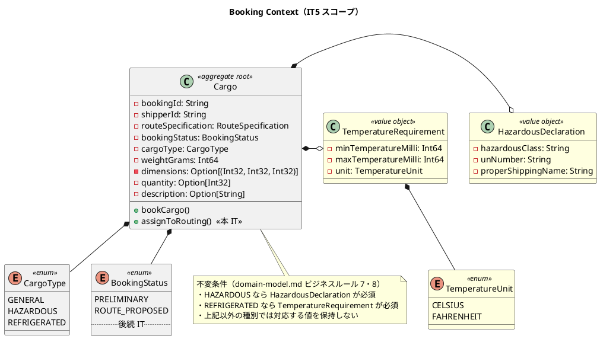
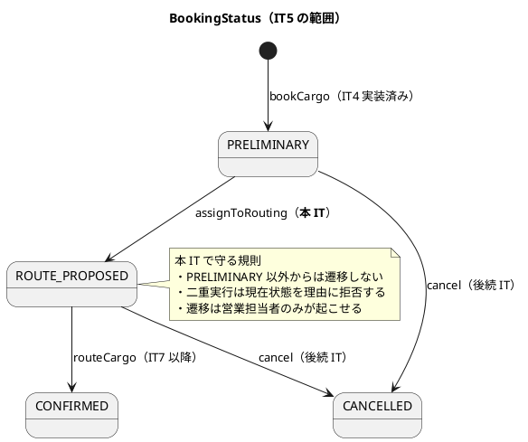
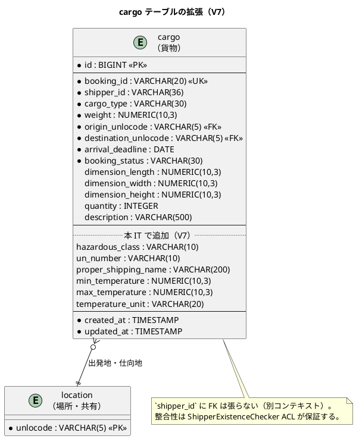
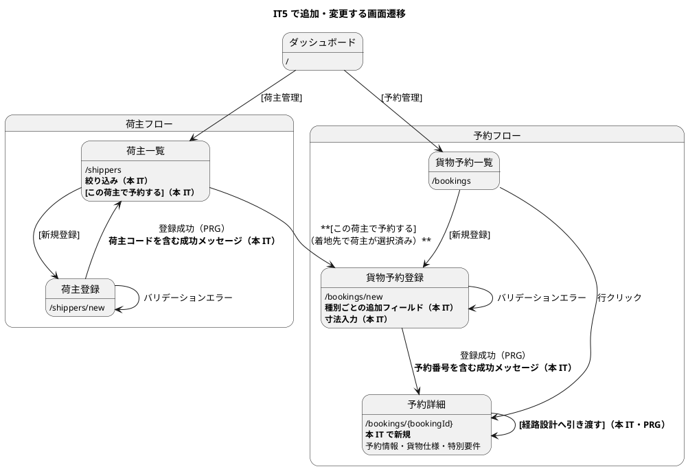

# イテレーション 5 計画

## 概要

| 項目 | 内容 |
|------|------|
| イテレーション | 5 |
| 期間 | 2026-09-28 〜 2026-10-09（2 週間） |
| 計画 SP | 11 |
| 局面 | 中盤（インサイドアウト）の 2 回目 |
| 前提 | IT4 で Shipper・Booking の書き込み経路が通っている |

---

## ゴール

### イテレーション終了時の達成状態

貨物種別ごとの特別要件（危険物申告・温度管理条件）を予約に載せ、
仮受付から経路設計への引き渡しまでを通す。
あわせて **IT4 で「動くが使えない」と判定された経路を、使える状態に戻す**。

IT4 のレビューで、受入基準を満たしながら業務では使えない状態が 4 件見つかった
（発行番号を確認できない・荷主コードを探せない・導線の着地先で絞り込まれない・寸法欄がない）。
これらは新機能より先に返す。**使えない機能の上に機能を積むと、後で全部やり直しになる**ためである。

### 成功基準（IT5 クローズ時の評価）

| # | 基準 | 測り方 |
|:--:|------|-------|
| 1 | 登録・更新の結果が**次の画面で利用者に見える** | フラッシュメッセージの HTTP 統合テスト。US02-3・US04-4 の受入基準を充足 |
| 2 | 荷主コードを**画面から探して予約に持ち込める** | 荷主一覧の絞り込みと「この荷主で予約する」導線の受入テスト（着地先で絞り込まれることまで） |
| 3 | 危険物・冷凍貨物の予約が**申告なしでは登録できない** | ドメイン単体テスト（必須性）+ HTTP 統合テスト（エラーが画面に出る） |
| 4 | 予約を経路設計へ引き渡すと**状態が変わり、戻せない遷移が守られる** | 状態遷移の単体テスト（不正遷移の拒否を含む） |
| 5 | E2E シナリオが CI で動く | `flix-ci.yml` に E2E ジョブが追加され緑 |
| 6 | 間欠 403 の**原因が特定されている**（解消または「起こり得ない」の証明） | 並行スモークの結果と結論の記録 |
| 7 | 見積もりが 40h に収まる | 実績時間の記録（4 回連続超過を止める） |

### 前イテレーションの Try の反映

IT4 ふりかえりの Try を、本計画のどこで消化するかを明示する。**「余力次第」とはしない**。

| Try | 反映先 |
|:---:|-------|
| T1 壊れ方を洗い出す観点表を作る | タスク 0.1 で観点表を作り、US05・US06 の受入基準に機械的に当てる。**着手前に作る**（後回しにすると今回も「思いついた壊れ方」しか書けない） |
| T2 同じ形の処理を 2 回書いたら共有へ寄せる | 温度の小数変換は IT4 で作った `Decimal.parseScaled` を使う。**新規に書かない** |
| T3 コメントがテスト名を引用するときは存在を確認 | タスク 5.1 で `trace-lint` に「コメントが引用するテスト名の実在」検査を追加し、規律を自動化する |
| T4 受入基準に「利用者が結果を確認できるか」を必ず入れる | TS09-1（フラッシュメッセージ）。US05・US06 の受入基準にも入れる |
| T5 導線は着地先まで通してテストする | TS09-3（「この荷主で予約する」の着地先で絞り込まれること） |
| T6 繰り返し現れる型・集合は定義を 1 箇所に | タスク 1.1 で効果集合を型別名へ寄せる（IT4 のレビュー H20 の残り） |
| T7 並行スモークを主要な公開経路に置く | TS10 |
| T8 見積もりに 1.9 の係数を掛けて計画する | 「見積もりの収め方」節。**11 SP に絞った根拠がこれ** |
| T9 SonarQube を実行するか定義から外すか決める | タスク 5.2。**IT5 で決着させる**（3 回連続の未実施にしない） |
| T10 品質ゲートのジョブは赤の原因が一意か | E2E ジョブの追加時に適用（タスク 4.2） |

---

## ユーザーストーリー

### 対象ストーリー

| ID | ストーリー | SP | 優先度 | 状態 |
|:--:|-----------|:--:|:---:|------|
| TS09 | 利用者が結果を確認できる状態に戻す（IT4 レビューの返済） | 3 | **最高** | **完了** |
| US05 | 危険物・冷凍貨物の予約を登録する | 3 | 高 | **完了**（本 IT の範囲） |
| US06 | 予約情報を経路設計者に引き渡す | 2 | 高 | **完了**（本 IT の範囲） |
| TS05b | E2E シナリオと CI ジョブ（IT3 からの持ち越し） | 2 | 高 | **完了** |
| TS10 | 間欠 403 の原因特定（並行スモークの拡張） | 1 | 中 | **完了**（再現せず・観測手段を確保） |

**目標 SP**: 11

### スコープの変更（US01・US07 を IT6 以降へ）

リリース計画の暫定配分は IT5 を `US05, US06, US01, US07`（13 SP + 繰越 2）としていた。
**US01（輸送見積）と US07（航海スケジュール検索）を IT6 以降へ送る**。理由は 2 つある。

**1. 依存の順序が逆転している。**
US07 の受入基準は「利用可能な航海スケジュールが表示される」だが、
航海スケジュールを**登録する機能（US24・US25）は IT6 の配分**である。
登録できないものは検索できない。US01 も「航海スケジュール情報をもとにルート概算候補が表示される」を
要求しており、同じ前提に立つ。**IT5 で作っても、検証できるのは空の検索結果だけになる**。

**2. IT4 の負債を返す枠が要る。**
レビューの高優先度指摘のうち、業務が成立しないもの（H16・H17・H18）は
「次の余力で」ではなく独立したストーリー（TS09）として先着手枠に置く。
返済枠を余力扱いにすると繰り越され続けることは、他プロジェクトで実証済みである。

**影響**: 残 89 SP に対し IT5 で 11 SP を消化すると、IT6-IT10 の 5 イテレーションで 78 SP。
実効ベロシティ 12-13 SP では **65 SP 程度**しか入らない。
**Phase 5（精算・13 SP）はスコープに入らない見込みが確定に近づく**。
リリース計画は「IT6 終了時に判断」としているが、ふりかえりの指摘どおり
**IT5 のクローズ時に一度確認する**（本計画の DoD に含める）。

### ストーリー詳細

#### TS09: 利用者が結果を確認できる状態に戻す（3 SP）

**として**: 営業担当者

**したい**: 登録した結果を画面で確認し、登録済みの荷主を画面から探して予約に使いたい

**なぜなら**: 発行された番号が見えず荷主コードも探せない現状では、
別途 Excel の台帳を作ることになり、**一元管理という US02 の目的そのものが崩れる**からだ

**出典**: IT4 レビュー H16・H17・H18、M8（`docs/review/IT4実装_review_20260925.md`）

**受け入れ基準**:

- [ ] 荷主登録に成功すると、次の画面に**発行された荷主コードを含む**成功メッセージが表示される
- [ ] 貨物予約に成功すると、次の画面に**発行された予約番号を含む**成功メッセージが表示される
- [ ] 荷主一覧で氏名/社名・荷主コード・メールアドレスによる絞り込みができる
- [ ] 荷主一覧の各行から「この荷主で予約する」で予約フォームへ遷移でき、**遷移先で当該荷主が選択済みになっている**
- [ ] 予約フォームに寸法（長さ・幅・高さ）を入力でき、保存される（US04-2 の未充足分）
- [ ] メッセージは PRG の遷移先で 1 回だけ表示され、再読み込みで消える

#### US05: 危険物・冷凍貨物の予約を登録する（3 SP）

**として**: 営業担当者

**したい**: 危険物や冷凍・冷蔵貨物の場合に、特別な追加情報（危険物申告・温度管理条件）を含めて予約を登録したい

**なぜなら**: 貨物種別に応じた法的要件と取扱い条件を正確に管理し、安全な輸送を保証できるからだ

**対応 UC**: UC03

**受け入れ基準**（`user_story.md` の 3 項目のうち、本 IT の範囲）:

- [ ] 貨物種別「危険物」を選択すると、危険物申告情報の入力フィールドが表示され入力が必須となる
- [ ] 貨物種別「冷凍・冷蔵貨物」を選択すると、温度管理条件の入力フィールドが表示され入力が必須となる
- [ ] 特別情報が登録された予約は、経路設計時に対応可能な航海・ルートのみが候補として表示される
  → **本 IT では対象外**。航海スケジュール（US24・US25）と経路候補算出（US08）が前提のため、
  IT7 以降で充足する。本 IT では**特別情報が欠落なく永続化され、予約詳細で確認できる**ところまでとする

**ビジネスルール対応表（`business_rule_traceability.md`）との対応**:

| # | ルール | 本 IT での扱い |
|:--:|-------|--------------|
| BK-7 | `HAZARDOUS` の場合 `HazardousDeclaration` は必須 | **本 IT で実装**（タスク 2.3） |
| BK-8 | `REFRIGERATED` の場合 `TemperatureRequirement` は必須 | **本 IT で実装**（タスク 2.3） |
| BK-6 | `HAZARDOUS` / `REFRIGERATED` は指定港のみ取扱可能 | **IT7 へ移す**（下記の注を参照） |

> **注（対応表の更新が必要）**: 対応表は BK-6 を IT5 に割り当てているが、**本 IT では実装しない**。
> `location` テーブルに「取扱可能な貨物種別」を表す列も関連テーブルも存在せず、
> 設計から起こす必要がある。しかもこの情報は US05 の受入基準 3（対応可能な航海・ルートのみを候補に）と
> **同じ関心**であり、航海側の取扱可否（IT6）・経路候補算出（IT7）と切り離して設計すると
> **港と航海で取扱能力を二重管理する**ことになる。
>
> よって BK-6 は経路候補算出と同じ IT（IT7）で、港と航海の取扱能力をまとめて設計する。
> 対応表の IT 列を IT5 → IT7 に更新する（タスク 5.4）。
> **「IT5 と書いてあるが誰も見ていない」状態にしない**ことが、対応表を正典として保つ条件である。

**壊れ方の観点**（Try T1 の観点表を当てた結果）:

| 軸 | 想定する壊れ方 | 対応 |
|----|--------------|------|
| 入力の境界 | 温度が負（`-25.5`）・0・上下限の逆転（最低 > 最高）・全角数字・単位付き（`-25℃`） | すべてテストで固定する。IT4 の符号消失バグの再発を防ぐ |
| 入力の境界 | UN 番号が 4 桁でない・英字混じり・空 | 形式を検証しエラーを返す |
| 外部システム | `NUMERIC(10,3)` の往復で桁が落ちる | JDBC 往復テスト（レビュー M10 の繰越と統合） |
| 外部システム | 貨物種別を後から変更したとき、旧種別の列が残る | 種別変更時に無関係な列を NULL にする。テストで固定 |
| 表示経路 | 必須エラーが**画面に出ない**（IT4 で実際に起きた） | エラー表示の HTTP 統合テストを受入基準ごとに置く |
| 並行 | 同一予約の同時登録 | 本 IT の範囲外（予約番号は採番済みのため衝突しない） |

#### US06: 予約情報を経路設計者に引き渡す（2 SP）

**として**: 営業担当者

**したい**: 仮受付された予約の出発地・目的地・期限・貨物仕様を確認し、経路設計者に引き渡したい

**なぜなら**: 経路設計者が正確な情報をもとに最適な経路設計を開始できるからだ

**対応 UC**: UC04

**受け入れ基準**:

- [ ] 予約番号を指定して予約情報（出発地・目的地・期限・貨物仕様）を確認できる
- [ ] 経路設計依頼を実行すると、予約状態が「経路設計中」に更新される
- [ ] 経路設計者に経路設計依頼の通知が送信される
  → **本 IT では対象外**。通知基盤は未着手であり、IT4 でも US04-5 を同じ理由で対象外としている。
  本 IT では**状態遷移をドメインイベントとして記録する**ところまでとし、配信は後続 IT で足す
- [ ] 予約情報に不備がある場合、修正してから引き渡せる
  → **本 IT では「引き渡せない条件を提示する」まで**とする。予約の編集機能は未計画のため、
  不備がある予約は引き渡しボタンが無効化され、理由が表示される

**壊れ方の観点**:

| 軸 | 想定する壊れ方 | 対応 |
|----|--------------|------|
| 状態 | `Preliminary` 以外から引き渡せてしまう | 遷移元を限定し、不正遷移のテストを置く |
| 状態 | 二重に引き渡してしまう（連打） | 2 回目は現在状態を理由に拒否する |
| 表示経路 | 引き渡し後も画面が旧状態のまま | PRG 後の表示をテストで固定 |
| 認可 | 経路設計者ロールが引き渡せてしまう | 営業担当者のみ。403 の端テストを置く |

#### TS05b: E2E シナリオと CI ジョブ（2 SP）

IT3 から持ち越し、IT4 でも縮退順序 1 として落とした項目。**3 回目の持ち越しにしない**。

SP を 1 から **2 へ再見積もり**する。IT4 の計画時点では「Playwright を足すだけ」と見ていたが、
実際にはログイン・CSRF・PRG を通す土台が要る。1 SP のままでは今回も落ちる。

**受け入れ基準**:

- [ ] ログイン → 荷主登録 → 予約登録 → 予約詳細 の 1 本が E2E で通る
- [ ] CI に E2E ジョブが追加され、緑である
- [ ] ジョブが赤になる原因が「シナリオの失敗」に限定されている（Try T10）

#### TS10: 間欠 403 の原因特定（1 SP）

IT4 で公開追跡の GET が 1 度だけ 403 を返した。`Anonymous` のルートで 403 に至る経路は
論理上存在しないため、**応答の取り違えが疑われる**。認証済み画面が別の利用者へ返る可能性を含み、
放置すると情報漏洩になる。

**受け入れ基準**:

- [ ] 認証あり・なしを混在させた並行スモークが追加されている
- [ ] 再現するなら原因を特定し修正する。再現しないなら**「起こり得ない」ことを構造で示す**か、
      観測手段（応答へのリクエスト ID 付与など）を残して ADR-0005 の未解決項目を更新する

---

## タスク

### 0. 着手前の準備（返済枠・0 SP）

| # | タスク | 見積 |
|:--:|-------|:---:|
| 0.1 | **壊れ方の観点表を作る**（入力の境界・外部システム・表示経路・並行の 4 軸）。`docs/reference/` に置き、受入基準を書くときに当てる | 1h |
| 0.2 | IT4 レビューの中優先度 20 件を「本 IT で返す / IT6 以降 / 対応しない」に仕分けし、本計画に明記する | 1h |

### 1. TS09: 利用者が結果を確認できる状態に戻す（3 SP）

| # | タスク | 見積 |
|:--:|-------|:---:|
| 1.1 | 効果集合を型別名へ寄せる（Try T6・レビュー H20 の残り）。**TS09 の実装前に済ませる**（この後の全タスクが触るため） | 2h |
| 1.2 | フラッシュメッセージの仕組み（セッションに 1 回だけ保持し、表示時に消す）。単体テスト先行 | 3h |
| 1.3 | 荷主登録・予約登録の成功時に発行番号を含むメッセージを出す。HTTP 統合テスト | 2h |
| 1.4 | 荷主一覧の絞り込み（氏名/社名・コード・メール）。SQL で絞る（アプリ側で全件取得しない） | 3h |
| 1.5 | 「この荷主で予約する」導線と、**着地先で当該荷主が選択済みになること**の受入テスト | 3h |
| 1.6 | 予約フォームへの寸法入力（ドメインは実装済み。フォームと永続化を繋ぐ） | 2h |

### 2. US05: 危険物・冷凍貨物の予約（3 SP）

**インサイドアウト**（中盤の局面のアプローチ）。
集約・値オブジェクトの単体テスト → ポート → 永続化の統合テスト → ルーティング・画面 の順に進める。

> **TS09 を先に置くことについて**: TS09（タスク 1）は画面側から入るため、一見アプローチと逆に見える。
> しかし TS09 は**新しいドメインルールを作らない**（フラッシュ・絞り込み・既存フィールドの配線）。
> インサイドアウトは「ビジネスルールを外部依存なしで組み上げる」ための順序であり、
> ルールを含まない返済作業には適用対象がない。局面のアプローチと矛盾しない。

| # | タスク | 見積 |
|:--:|-------|:---:|
| 2.0 | **`business_rule_traceability.md` に BK-7・BK-8 の行を先に埋める**（中盤の規律「実装を書く前に対応表へ行を追加」）。BK-6 の IT 列を IT7 へ更新し、BK-4 を本 IT の遷移で埋める | 1h |
| 2.1 | `HazardousDeclaration` 値オブジェクト（危険物クラス・UN 番号・正式輸送品名）。スマートコンストラクタと単体テスト | 3h |
| 2.2 | `TemperatureRequirement` 値オブジェクト（最低/最高温度・単位）。`Decimal.parseScaled` を再利用（Try T2）。上下限逆転を拒否 | 3h |
| 2.3 | `Cargo` に両者を `Option` で追加し、**種別ごとの必須性を集約で守る**（ビジネスルール 7・8） | 2h |
| 2.4 | マイグレーション `V7__add_cargo_special_requirements.sql`（`data-model.md` の定義どおり） | 1h |
| 2.5 | `JdbcCargoRepo` の読み書き。`NUMERIC` 往復と部分 NULL の統合テスト（レビュー M10 を統合） | 3h |
| 2.6 | 種別選択に応じたフィールド表示（htmx の既存 `cargo-type-fields` を拡張）。**エラーが画面に出ることをテストで固定** | 3h |

### 3. US06: 経路設計への引き渡し（2 SP）

| # | タスク | 見積 |
|:--:|-------|:---:|
| 3.1 | 予約詳細画面 `/bookings/{bookingId}`（レビュー M7 の繰越を統合） | 3h |
| 3.2 | `assignToRouting`（`Preliminary` → `RouteProposed`）。不正遷移・二重実行の拒否を単体テストで固定 | 3h |
| 3.3 | 引き渡し操作と PRG。営業担当者のみ（403 の端テスト） | 2h |
| 3.4 | 状態遷移をドメインイベントとして記録する（配信はしない）。**`afterCommit` が例外時に失われる性質を記録**（IT4 引き継ぎ） | 2h |

### 4. TS05b: E2E と CI（2 SP）

| # | タスク | 見積 |
|:--:|-------|:---:|
| 4.1 | Playwright の土台（ログイン・CSRF・PRG を通すヘルパ） | 3h |
| 4.2 | シナリオ 1 本（ログイン → 荷主登録 → 予約登録 → 予約詳細）と CI ジョブ。**赤の原因を一意にする**（Try T10） | 3h |

### 5. 規律の自動化とドキュメント（1 SP 相当・返済枠）

| # | タスク | 見積 |
|:--:|-------|:---:|
| 5.1 | `trace-lint` に「コメントが引用するテスト名の実在」検査を追加（Try T3 の自動化） | 2h |
| 5.2 | **SonarQube を実行するか品質ゲートの定義から外すかを決める**（Try T9）。決めた内容をテスト戦略に反映 | 1h |
| 5.3 | `R__seed_dev.sql` の改名（マスタとして分離。IT4 のコメント内の約束） | 1h |
| 5.4 | `domain-model.md` / `data-model.md` / `ui_design.md` への反映（実装と同時） | 2h |

### 6. TS10: 間欠 403（1 SP）

| # | タスク | 見積 |
|:--:|-------|:---:|
| 6.1 | 認証あり・なし混在の並行スモーク | 2h |
| 6.2 | 結論の記録（修正 / 構造での証明 / 観測手段の追加）と ADR-0005 の更新 | 2h |

### タスク合計

| ストーリー | SP | 理想時間 |
|-----------|:--:|:---:|
| 0. 着手前の準備 | 0 | 2h |
| 1. TS09 | 3 | 15h |
| 2. US05 | 3 | 16h |
| 3. US06 | 2 | 10h |
| 4. TS05b | 2 | 6h |
| 5. 規律とドキュメント | 0 | 6h |
| 6. TS10 | 1 | 4h |
| **合計** | **11** | **59h** |

### 見積もりの収め方（Try T8）

IT1-IT4 の「計画時間 ÷ 実時間」は 1.55 → 1.75 → 1.88 → **1.93** と単調に悪化した。
4 点の実績が揃っており、**「今回は収まる」と考える根拠がない**。

| 項目 | 値 |
|------|---|
| 理想時間の合計 | 59h |
| 過去 4 回の平均超過率 | 1.78（直近は 1.93） |
| 実効の稼働時間 | 40h |
| 59h ÷ 1.93 | **31h** |

直近の係数で割り戻すと 31h となり、40h の枠に収まる。
IT4 は 77h で計画して 40h しか稼働できず 2 SP を落とした。**今回は最初から 59h で切っている**。

**縮退順序**（枠を超えた場合に落とす順。着手前に確定させる）:

| 順 | 落とすもの | 理由 |
|:--:|-----------|------|
| 1 | TS10（間欠 403） | 観測手段だけ残せば次 IT でも追える |
| 2 | タスク 5.3（`R__seed_dev.sql` の改名） | 動作に影響しない |
| 3 | US06 のドメインイベント記録（3.4） | 記録だけ残し実装は IT6 へ |
| 4 | TS05b（E2E） | **ただし 3 回目の持ち越しになる**。落とすなら「IT6 で必ずやる」ではなく、なぜ 3 回落ちたのかを分析する |

**TS09 と US05 は落とさない**。TS09 は落とすと IT4 の負債が固定化し、US05 は本 IT のゴールそのものである。

---

### 実績（開発完了時）

| ストーリー | 計画 SP | 実績 SP | 状態 |
|-----------|:---:|:---:|------|
| TS09 | 3 | 3 | 完了 |
| US05 | 3 | 3 | 完了（受入基準 3 は IT7 へ・計画時に明記） |
| US06 | 2 | 2 | 完了（通知送信・予約編集は対象外・計画時に明記） |
| TS05b | 2 | 2 | 完了（5 シナリオ・CI ジョブ） |
| TS10 | 1 | 1 | 完了（**再現せず**。観測手段と再現手段を残した） |
| **合計** | **11** | **11** | |

テスト件数 348 → **472**（+124）。

**縮退は 1 件も行わなかった。** 計画時に 59h（直近の超過率で割り戻して 31h）へ
絞ったことが効いている。4 イテレーション連続の時間超過を止めるという成功基準 7 に
対しては、クローズ時に実績時間で評価する。

#### 計画になかった対応

| 内容 | きっかけ |
| :--- | :--- |
| `arch-lint` 規約 8 を「状態を変える form」に限定 | 検索の GET フォームが CSRF 規約に引っかかった。要らない防御を足すと要る防御と区別が付かなくなる |
| 温度の文字列解釈をドメインから境界へ移動 | `arch-lint` 規約 1（domain → infrastructure）違反を着手直後に検出 |
| 状態ラベル「経路提案済」→「経路設計中」 | US06 の受入基準と食い違っていた。IT4 レビュー H14 が定義表を正として解消したが、上流の要件と突合していなかった |
| `SharedDecimal.parseSignedScaled` の追加 | 温度は負を取る。`parseScaled`（非負）に両方の意味を持たせない |
| `htmlWithStatus` の追加 | 404 でも画面を返すため（本文が空の 404 は導線を示せない） |

#### 見つかった不具合・乖離

| # | 内容 | 見つけた手段 |
| :--: | :--- | :--- |
| 1 | fat JAR が作業ディレクトリに依存（別の場所から起動すると「適用 0 件」でテーブルなし） | **E2E**（統合テストは同一 JVM のため原理的に気付けない） |
| 2 | `button[type="submit"]` がナビバーのログアウトに一致し、意図せずログアウト | **E2E** |
| 3 | 「経路提案済」ラベルが遷移の意味と食い違う | US06 の受入テスト |
| 4 | 温度解釈がドメイン層から infrastructure を参照 | `arch-lint` |
| 5 | ヘルプ文のバックティックによる構文エラー | **ESLint**（テストでは捕まらない種類） |
| 6 | 対応表が参照するテストのモジュール名の誤り | `trace-lint` |

---

## スケジュール

### Week 1（Day 1-5）

| Day | 内容 |
|:---:|------|
| 1 | タスク 0（観点表・レビュー指摘の仕分け）、1.1（効果集合の型別名化） |
| 2 | 1.2-1.3（フラッシュメッセージと発行番号表示） |
| 3 | 1.4-1.6（荷主一覧の絞り込み・導線・寸法） |
| 4 | 2.1-2.3（危険物・温度の値オブジェクトと集約の必須性） |
| 5 | 2.4-2.5（マイグレーションと永続化） |

### Week 2（Day 6-10）

| Day | 内容 |
|:---:|------|
| 6 | 2.6（種別ごとのフィールド表示とエラー表示） |
| 7 | 3.1-3.2（予約詳細と状態遷移） |
| 8 | 3.3-3.4（引き渡し操作とイベント記録） |
| 9 | 4.1-4.2（E2E と CI） |
| 10 | 5（規律とドキュメント）、6（TS10）、クローズ準備 |

---

## 設計

### ドメインモデル（Booking Context の IT5 スコープ）

IT4 で実装済みの要素は実線、本 IT で追加する要素を強調する。



> **注 1（設計への反映が必要）**: `domain-model.md` は `TemperatureRequirement` の温度を
> `BigDecimal` としているが、Flix に `BigDecimal` の値オブジェクトを置く理由がない。
> IT4 で割引率・重量に採った**固定小数点整数**（ここでは千分の一度 = `Int64`）に統一する。
> 浮動小数点誤差を持ち込まない方針は IT4 で確立済みであり、ここで崩さない。
> DB 側は `NUMERIC(10,3)`（度）のままで、境界で変換する（重量と同じ形）。
>
> **注 2（設計への反映が必要）**: `TemperatureUnit` が `domain-model.md` の要素表にない
> （クラス図には現れる）。本 IT で要素表に追加する。
> **新規 enum の要素表への登録漏れは IT1-IT3 で 3 回反復したドリフト**であり、
> `validating-design` の軸 B が明示的に検査する項目である。
>
> **注 3（設計と実装の乖離。実装が正）**: `domain-model.md` は `Dimensions` を独立した値オブジェクトと
> しているが、IT4 の実装は `Option[(Int32, Int32, Int32)]`（ミリメートル）のタプルである。
> 同様に `Quantity`・`Description` も専用の値オブジェクトになっていない。
> **本 IT では実装形を変えない**（TS09-1.6 はフォームと永続化を繋ぐだけで、型は触らない）。
> 値オブジェクト化は独立した変更として扱うべきで、US05 と混ぜると失敗の切り分けができなくなる。
> `domain-model.md` に「実装形はタプル」と注記し、乖離を可視化する。

### 状態遷移（BookingStatus のうち本 IT の範囲）



### ER 図（本 IT で追加・変更するテーブル）



> **注**: 列定義は `data-model.md` の `cargo` 節に既に記載がある（IT4 で「スコープ外として作らなかった」列）。
> 本 IT はその定義どおりに追加するため、`data-model.md` への新規追加はない。
> 実装状況の注記（「IT4 のスコープに必要なカラムのみ」）を更新する。
>
> **寸法列**（`length_cm` 等）は IT4 で作成済みだがフォームから入力できていない。TS09-1.6 で繋ぐ。

### 画面遷移図（本 IT スコープ）



### インタラクション（htmx・PRG・フィードバック）

| 項目 | 方式 |
|------|------|
| 種別ごとの追加フィールド | 既存の `GET /bookings/new/cargo-type-fields` を拡張。`hx-get` + `hx-target` で差し替え |
| 荷主一覧の絞り込み | `hx-get` で一覧部分のみ差し替え。**SQL で絞る**（全件取得してアプリ側で絞らない） |
| この荷主で予約する | `GET /bookings/new?shipperCode=...`。着地先で選択済みにする |
| 登録成功 | PRG。セッションのフラッシュを遷移先で 1 回だけ表示し、表示時に消す |
| 経路設計へ引き渡す | `POST /bookings/{bookingId}/assign-to-routing` → PRG で予約詳細へ |
| メッセージのスタイル | 成功 `alert-success` / 警告 `alert-warning` / エラー `alert-danger`（`ui_design.md` の規約） |

> **注（設計への反映が必要）**: `ui_design.md` の画面一覧で予約詳細は「US05, US06」と対応づけられている。
> 本 IT で実装するため、ワイヤーフレーム未作成の一覧から予約詳細・荷主一覧を外し、図を追加する。
> ナビゲーション構成表に変更はない（予約詳細は一覧からの遷移で、navbar には出さない）。

### ディレクトリ構成（本 IT で追加するモジュール）

```text
apps/cargo-tracker/src/
  booking/
    domain/model/
      HazardousDeclaration.flix   # 新規
      TemperatureRequirement.flix # 新規
      Cargo.flix                  # 変更（特別要件と assignToRouting）
    application/commandservices/
      AssignToRouting.flix        # 新規
    interfaces/web/
      BookingPages.flix           # 変更（予約詳細・寸法・種別フィールド）
  shared/
    infrastructure/http/
      Flash.flix                  # 新規（フラッシュメッセージ）
resources/db/migration/
  V7__add_cargo_special_requirements.sql  # 新規
```

### ADR

| # | 判断 | 起票 |
|:--:|------|------|
| ADR-0006 | 温度を固定小数点整数（千分の一度）で保持する | 本 IT で起票。`domain-model.md` の `BigDecimal` からの逸脱を記録する |
| ADR-0005 補遺 | 間欠 403 の結論（TS10 の成果） | 本 IT で更新 |

> **注**: `arch-lint` の規約は本 IT では追加しない（規約 11 は IT6 へ）。
> ただし新規ポートを追加する場合は**フルテスト**（`sbt test` 相当）で構造的検証を通す。

---

## リスクと対策

| リスク | 影響度 | 発生確率 | 対策 |
|--------|:---:|:---:|------|
| TS09 の返済が膨らみ US05 を圧迫する | 高 | 中 | TS09 は 3 SP・15h で切る。超えたら 1.4（絞り込み）を SQL の単純な LIKE に縮退させる |
| フラッシュメッセージがセッションの並行性と干渉する | 中 | 中 | ADR-0003（セッション並行性）の方式に従う。並行スモーク（TS10）で確認する |
| `NUMERIC(10,3)` の往復で H2 と PostgreSQL が食い違う | 中 | 中 | IT4 と同じ失敗を繰り返さない。**日次ジョブの実 PostgreSQL でも往復テストを回す** |
| E2E が 3 回目の持ち越しになる | 中 | 中 | 縮退順序 4 に置き、落とす場合は理由の分析を必須とする |
| 間欠 403 が再現せず結論が出ない | 中 | 高 | 「再現しない」で終わらせず、観測手段を残すことを受入基準に含める |

---

## 完了条件

### Definition of Done

- [ ] TS09 の受入基準 6 項目がテストで確認されている
- [ ] US05 の受入基準（本 IT の範囲 2 項目）がテストで確認されている
- [ ] US06 の受入基準（本 IT の範囲 2 項目）がテストで確認されている
- [ ] 対象外とした受入基準に**理由と充足予定の IT** が明記されている
- [ ] 全テストが green（単体・統合・HTTP フロー・E2E）
- [ ] `arch-lint` / `trace-lint` の違反が 0 件
- [ ] CI が緑（全ジョブ）
- [ ] SonarQube の扱いが**決着している**（実行するか、ゲートの定義から外すか）
- [ ] `domain-model.md` / `data-model.md` / `ui_design.md` に本 IT の変更が反映されている
- [ ] ADR-0006 が作成され、ADR-0005 の未解決項目が更新されている
- [ ] **Phase 5（精算）の扱いを確認している**（リリース計画の再配分要否）
- [ ] 実績時間が記録され、40h との差が分析されている

### デモ項目

| # | シナリオ | 対応 |
|:--:|---------|------|
| 1 | 荷主を登録し、**発行された荷主コードが画面に出る** | TS09 |
| 2 | 荷主一覧で絞り込み、「この荷主で予約する」で予約フォームへ入る（荷主が選択済み） | TS09 |
| 3 | 危険物を選び、申告なしで登録しようとしてエラーが**画面に出る** | US05 |
| 4 | 冷凍貨物を温度条件つきで登録し、予約詳細で確認する | US05 |
| 5 | 予約を経路設計へ引き渡し、状態が変わる。2 回目は拒否される | US06 |
| 6 | E2E シナリオが CI で緑 | TS05b |

---

## 前イテレーションからの引き継ぎ

IT4 レビューの中優先度指摘の仕分け（タスク 0.2 で確定させる）。

| 項目 | 本計画での扱い |
|------|--------------|
| 予約詳細画面（M7） | **本 IT**（タスク 3.1） |
| `JdbcCargoRepoTest`（M10） | **本 IT**（タスク 2.5 に統合） |
| 寸法入力（M8） | **本 IT**（タスク 1.6） |
| `R__seed_dev.sql` の改名 | **本 IT**（タスク 5.3） |
| `afterCommit` の性質の記録 | **本 IT**（タスク 3.4） |
| `runWithoutDb` の分割（H19） | IT6。ルート数が増える前でよい |
| `arch-lint` 規約 11（M1） | IT6 |
| `NoTx` の意味と `bug!`（M2・M3） | IT6 |
| `readOnly` の状態復元（M4） | IT6 |
| 予約一覧の荷主名・検索・ページング（M5・M6） | IT6 以降 |
| 到着期限の過去日判定（M9） | **本 IT**（US05 のテストと同時に入れる） |
| `withApp` の資源解放・`csrfTokenOf`（M12・M13） | IT6 |
| 荷役作業員のフィクスチャ（M14） | IT6 |
| ROLE_SHIPPER に 403 のボタンが見える（M15） | **本 IT**（US06 の認可テストと同時） |
| `decode` の黙殺（M16） | IT6 以降 |
| セキュリティ回帰テストの `trace-lint` 突合 | IT6（タスク 5.1 の後） |
| US01・US07 | **IT6 以降**（本計画の「スコープの変更」を参照） |

---

## 更新履歴

| 日付 | 更新内容 |
|------|---------|
| 2026-08-03 | 初版作成 |

---

## 関連ドキュメント

- [リリース計画](release_plan.md)
- [開発戦略](development_strategy.md)
- [IT4 計画](iteration_plan-4.md) / [IT4 ふりかえり](retrospective-4.md) / [IT4 完了報告書](iteration_report-4.md)
- [IT4 実装レビュー](../review/IT4実装_review_20260925.md)
- [ドメインモデル設計](../design/domain-model.md)
- [データモデル設計](../design/data-model.md)
- [UI 設計](../design/ui_design.md)
- [テスト戦略](../design/test_strategy.md)
- [ADR-0005 ルーティング表の単一化](../adr/ADR-0005-single-routing-table.md)
