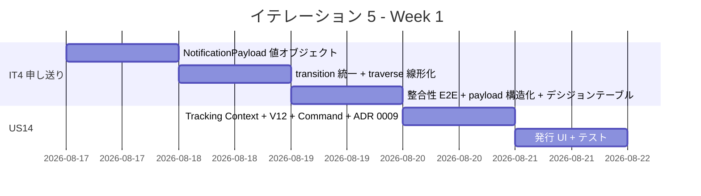
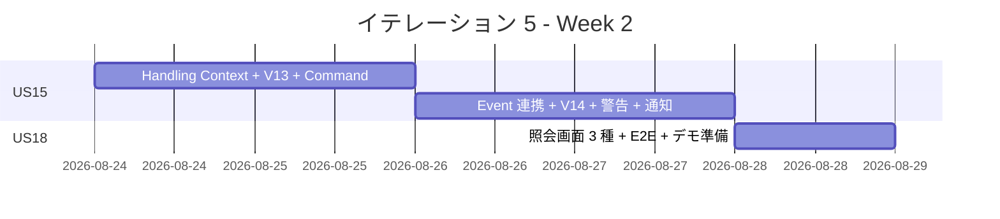
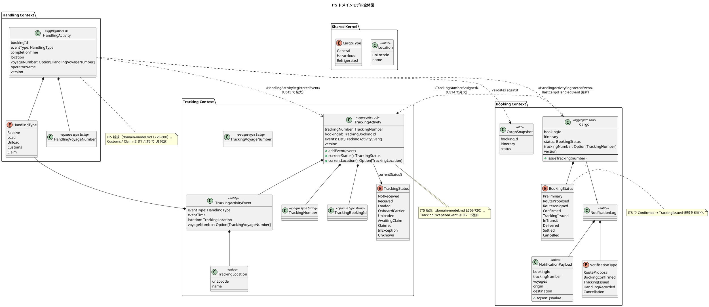
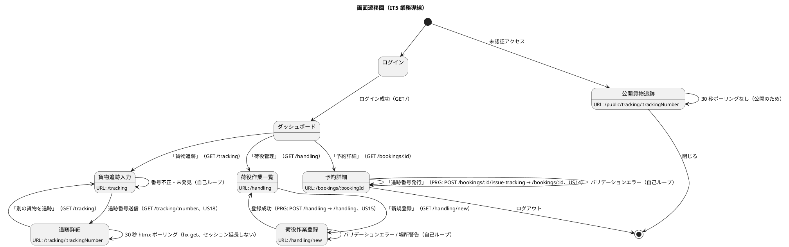

# イテレーション 5 計画

## 概要

| 項目 | 内容 |
|------|------|
| **イテレーション** | 5 |
| **期間** | Week 9-10（2026-08-17 〜 2026-08-30、2 週間） |
| **ゴール** | Tracking Context + Handling Context を新設し、追跡番号発行（US14）・荷役作業記録（US15）・追跡情報照会（US18）を一気通貫で実装し、荷主中核体験（予約 → 経路確定 → 追跡番号取得 → 公開照会）を完成させる |
| **目標 SP** | 11（US14: 2 + US15: 6 + US18: 3） |

---

## ゴール

### イテレーション終了時の達成状態

1. **追跡番号発行（US14）**: 「予約確定」状態（`Confirmed`）の貨物に一意の追跡番号を採番し、`Cargo` を `TrackingIssued` へ遷移させ、`TrackingActivity` 集約を初期化する
2. **荷役作業記録（US15）**: 荷役作業員が `HandlingActivity`（Handling Context 集約）を登録し、`HandlingActivityRegisteredEvent` 経由で Tracking Context が `TrackingActivityEvent` を追記する
3. **追跡情報照会（US18）**: 認証不要の公開 URL `/public/tracking/:trackingNumber` から追跡番号で現在状態・位置・イベント履歴・推定到着日を確認できる
4. **Tracking / Handling Context 確立**: `TrackingActivity` 集約 + `TrackingActivityEvent` / `TrackingExceptionEvent` 子エンティティ、`HandlingActivity` 集約、ACL（`CargoSnapshot`）が稼働し、Booking との連携が確立する
5. **荷主中核体験 E2E**: 予約確定 → 追跡番号発行 → 荷役記録 → 公開追跡照会の業務導線 E2E が緑になる
6. **IT4 申し送り解消**: IT4 マルチパースペクティブセルフレビュー高優先度 6 件（H1-H6）を解消する

### 成功基準

- [ ] US14 / US15 / US18 の受入条件をすべて満たす
- [ ] 業務導線 E2E（予約確定 → 追跡番号発行 → 荷役記録 → 公開追跡照会）が緑
- [ ] 公開追跡照会 URL（`/public/tracking/:trackingNumber`）が未認証で 200 を返す
- [ ] new_coverage 80% 以上、Quality Gate PASS
- [ ] `NotificationPayload` 値オブジェクトが導入され、JSON ハードコーディングが解消（H1）
- [ ] `BookingCommandService` の `transition` ヘルパ統一・`CargoErrorMessages` 抽出が完了（H2）
- [ ] `RoutingCommandService.parseVoyages` が `traverse` 相当の線形化に書き換え（H3）
- [ ] 経路紐付け整合性 E2E / 状態遷移デシジョンテーブル網羅が追加（H4, H6）

---

## ユーザーストーリー

### 対象ストーリー

| ID | ユーザーストーリー | SP | 優先度 |
|----|-------------------|----|----|
| US14 | 追跡番号を発行する | 2 | 必須 |
| US15 | 荷役作業を記録する | 6 | 必須 |
| US18 | 追跡情報を照会する | 3 | 必須 |
| **合計** | | **11** | |

### ストーリー詳細

#### US14: 追跡番号を発行する

> 経路設計者として、確定した予約に対して一意の追跡番号を発行し荷主に通知したい。なぜなら、荷主が追跡番号を使って輸送状況をいつでも確認できるようになるからだ。

**受入条件**:

1. 「予約確定」状態（`BookingStatus.Confirmed`）の予約に対して追跡番号を発行できる
2. 追跡番号は一意に採番される（採番ポリシーは ADR 0009 で確定。`VARCHAR(20)` 制約に整合）
3. 発行後、貨物状態が `TrackingIssued` に遷移し、`TrackingActivity` 集約（初期 `TrackingStatus.NotReceived`）が作成される
4. 荷主に追跡番号と追跡 URL を `NotificationLog`（`NotificationType.TrackingIssued` 追加）経由で通知する

#### US15: 荷役作業を記録する

> 荷役作業員として、追跡番号を入力して貨物を特定し作業種別・日時・場所を登録したい。なぜなら、荷役作業完了が即座に貨物状態に反映され荷主がリアルタイムで確認できるからだ。

**受入条件**:

1. 追跡番号入力（または貨物 ID）で貨物を特定できる
2. 作業種別（`HandlingType`: `Receive` / `Load` / `Unload` / `Customs` / `Claim`）を選択できる。IT5 では `Receive` / `Load` / `Unload` のみ画面に表示し、`Customs` / `Claim` は IT7 / IT6 で開放（enum 定義は 5 値）
3. 作業日時と作業場所（UN/LOCODE）を入力できる
4. 記録後、`HandlingActivityRegisteredEvent` 経由で Tracking Context が `TrackingActivityEvent` を追記し、`TrackingStatus` が `currentStatus()` で導出される
5. 記録後、荷主に状態変更通知が `NotificationLog`（`NotificationType.HandlingRecorded`）経由で送信される
6. 追跡番号が存在しない場合、エラーメッセージが表示される
7. 作業場所が予定ルート（`Itinerary.legs`）と異なる場合、警告が表示される（記録は許可）

#### US18: 追跡情報を照会する

> 荷主（または荷受人）として、追跡番号を入力して貨物の現在位置・状態・追跡イベント履歴・推定到着日を確認したい。なぜなら、輸送状況をいつでも自分で確認でき到着準備や業務計画に役立てるからだ。

**受入条件**:

1. 追跡番号を入力して貨物情報を照会できる（認証ユーザー向け `/tracking/:trackingNumber` + 公開 `/public/tracking/:trackingNumber`）
2. 現在の状態（`TrackingStatus`）・位置（港湾名）・推定到着日が表示される
3. 追跡イベント履歴（日時・場所・作業種別）が時系列で表示される
4. 追跡番号が存在しない場合、「追跡番号が見つかりません」と表示される
5. **ログインなし**で `/public/tracking/:trackingNumber` から追跡番号があれば照会できる

### タスク

#### 0. IT4 申し送り（マルチパースペクティブセルフレビュー高優先度残）

| # | タスク | 見積もり | 状態 |
|---|--------|---------|------|
| 0.1 | `NotificationPayload` 値オブジェクトを `booking/domain/model/valueobjects/` に新設し（ドメインは ADT のみ）、Play JSON シリアライズは application 層 `NotificationPayloadJson` に隔離（ArchUnit ルール 1 整合）。`BookingCommandService.logNotification` と `NotifyRouteCommandService.buildPayload` を一本化（H1 解消） | 4h | [x] |
| 0.2 | `BookingCommandService` の `assignToRouting` / `assignItinerary` を `transition` ヘルパ経由に統一 + `Cargo.Error → メッセージ` 変換を `CargoErrorMessages` に抽出（H2 解消） | 3h | [x] |
| 0.3 | `RoutingCommandService.parseVoyages` を `raw.traverse(VoyageNumber(_).left.map(...))` 相当に書き換え、`persistConfirmed` を 25 行 → 10 行に短縮（H3 解消） | 3h | [x] |
| 0.4 | 経路紐付け整合性 E2E 追加（confirm voyages と assign itinerary voyages の一致を E2E で検証 / 不一致拒否ケース）（H4 解消） | 3h | [x] |
| 0.5 | 通知 payload を Play JSON でパースして `voyages` / `origin` / `destination` を構造的にアサートする `NotifyRouteCommandServiceSpec` のテスト再構築（H5 解消） | 3h | [ ] |
| 0.6 | 状態 × 操作デシジョンテーブル（現在状態 5 × 操作 5 = 25 セル）を `forAll` でパラメタライズ化、`cancel` の 4 状態網羅 / `notify` のべき等性仕様を確定（H6 解消） | 3h | [ ] |

**小計**: 19h

> **IT5 スコープ外で IT6 以降に申し送り**:
>
> - 中以下観察「`notification_log.payload` の jsonb 化 ADR 追補」: 検索要件が現れた時点で再評価
> - 中期 H2 派生「`LifecycleCommandService`（confirm / repropose / cancel）の別クラス分離」: IT6 で `BookingCommandService` 行数が再増加した場合に判断

#### 1. US14 追跡番号発行（2 SP）

| # | タスク | 見積もり | 状態 |
|---|--------|---------|------|
| 1.1 | Tracking Context 新設: `TrackingActivity` 集約（`addEvent` / `currentStatus` / `currentLocation`）+ `TrackingNumber`（`opaque type String`、`VARCHAR(20)` 整合）+ `TrackingBookingId`（`opaque type String`）+ `TrackingActivityRepository` ポート | 4h | [ ] |
| 1.2 | Flyway V12: `tracking_activity` テーブル追加（data-model.md L782 準拠：`id BIGSERIAL` / `tracking_number VARCHAR(20) UK` / `booking_id VARCHAR(20)` / `transport_status VARCHAR(30)` / 監査） | 1h | [ ] |
| 1.3 | `AssignTrackingNumberCommand` + `TrackingCommandService.assign(bookingId)` 実装。`Confirmed` 状態の `Cargo.issueTracking(number)` 呼出 → `BookingStatus.TrackingIssued` 遷移 → `TrackingActivity` 新規作成 → `NotificationLog`（`NotificationType.TrackingIssued`）登録の一トランザクション | 3h | [ ] |
| 1.4 | 予約詳細画面（IT4 拡張）に `Confirmed` 状態時のみ「追跡番号発行」ボタン追加。POST `/bookings/:bookingId/issue-tracking`（PRG → 予約詳細）。発行結果に追跡 URL を flash 表示 | 2h | [ ] |
| 1.5 | テスト（採番一意性 / `Confirmed` 以外からの拒否 / 再発行禁止 / `TrackingActivity` 初期 `TrackingStatus.NotReceived` 検証 / `NotificationLog` 登録） | 2h | [ ] |

**小計**: 12h

#### 2. US15 荷役作業記録（6 SP）

| # | タスク | 見積もり | 状態 |
|---|--------|---------|------|
| 2.1 | Handling Context 新設: `HandlingActivity` 集約（`bookingId` / `eventType` / `completionTime` / `location` / `voyageNumber` / `operatorName`）+ `HandlingType` enum（5 値: `Receive` / `Load` / `Unload` / `Customs` / `Claim`）+ `HandlingVoyageNumber`（`opaque type String`）+ `HandlingActivityRepository` ポート | 4h | [ ] |
| 2.2 | Flyway V13: `handling_activity` テーブル追加（data-model.md L827 準拠：`id BIGSERIAL` / `booking_id VARCHAR(20)` / `event_type VARCHAR(30)` / `event_completion_time TIMESTAMP` / `location_unlocode VARCHAR(5)` / `voyage_number VARCHAR(20)` / `operator_name VARCHAR(200)` / 監査） | 1h | [ ] |
| 2.3 | Tracking Context 拡張: `TrackingActivityEvent` 子エンティティ（`eventType` / `eventTime` / `location` / `voyageNumber`）+ `TrackingActivity.addEvent` で時系列順序検証（最終イベントより過去の時刻を拒否） | 3h | [ ] |
| 2.4 | Flyway V14: `tracking_handling_event` テーブル追加（data-model.md L795 準拠：`id BIGSERIAL` / `tracking_id BIGINT FK` / `event_type VARCHAR(30)` / `event_time TIMESTAMP` / `location_unlocode VARCHAR(5)` / `voyage_number VARCHAR(20)` / 監査） | 1h | [ ] |
| 2.5 | `RegisterHandlingActivityCommand` + `HandlingCommandService.register(...)` 実装。`CargoSnapshot`（ACL）で Cargo 状態・Itinerary との妥当性検証 → `HandlingActivity` 永続化 → `HandlingActivityRegisteredEvent` 発火 | 4h | [ ] |
| 2.6 | Tracking 側 `HandlingActivityRegisteredEvent` ハンドラ実装: `TrackingActivity.addEvent(TrackingActivityEvent)` → `currentStatus()` 更新を永続化。同一トランザクションで実行 | 3h | [ ] |
| 2.7 | ルート逸脱警告ロジック: `Itinerary.legs` の `to` / `from` 港湾と作業場所（`location_unlocode`）を突合し、不一致なら警告フラグを返す（記録は許可） | 2h | [ ] |
| 2.8 | 荷役通知: `NotificationLog`（`NotificationType.HandlingRecorded` 追加）を発行（payload は H1 解消の `NotificationPayload` を再利用） | 2h | [ ] |
| 2.9 | 荷役作業登録画面 `/handling/new`（追跡番号入力 / 種別ラジオ 3 値 / 日時 / 場所 / 操作者名 → 確認 → 登録）+ 荷役作業一覧画面 `/handling`（検索 + ページング）。htmx で追跡番号入力後に貨物情報を非同期取得 | 5h | [ ] |
| 2.10 | テスト（正常記録 / 存在しない追跡番号 / ルート逸脱警告 / TrackingStatus 自動更新 / 通知発行）+ E2E（追跡番号発行 → 荷役記録 → 状態遷移 → 通知ログ確認の一気通貫） | 4h | [ ] |

**小計**: 29h

#### 3. US18 追跡情報照会（3 SP）

| # | タスク | 見積もり | 状態 |
|---|--------|---------|------|
| 3.1 | `TrackingQueryService.findByTrackingNumber(number)` + `TrackingView` Read Model（現在 `TrackingStatus` / 現在 `TrackingLocation` / 推定到着日 / `TrackingActivityEvent` 履歴） | 3h | [ ] |
| 3.2 | 認証ユーザー向け追跡入力画面 `/tracking`（追跡番号入力フォーム） + 追跡詳細画面 `/tracking/:trackingNumber`（ステータスタイムライン、30 秒 htmx ポーリング） | 4h | [ ] |
| 3.3 | 公開照会画面 `/public/tracking/:trackingNumber`（未認証 GET 許可、CSRF 例外、Twirl 共通テンプレート使用）+ Play Security 例外パス定義 | 4h | [ ] |
| 3.4 | テスト（未認証 200 / 存在しない番号「追跡番号が見つかりません」表示 / 履歴時系列順 / 30 秒ポーリングはセッション延長しない確認） + E2E | 3h | [ ] |

**小計**: 14h

#### タスク合計

| カテゴリ | SP | 理想時間 |
|---------|----|----|
| IT4 申し送り（0.x） | - | 19h |
| US14 追跡番号発行 | 2 | 12h |
| US15 荷役作業記録 | 6 | 29h |
| US18 追跡情報照会 | 3 | 14h |
| **合計** | **11** | **74h** |

**1 SP あたり**: 約 6.7h（IT4 申し送り含む / 機能タスクのみなら 5.0h）
**進捗率**: 0% (0/11 SP)

---

## スケジュール

### Week 1（Day 1-5）



| 日 | タスク |
|----|--------|
| Day 1 | 0.1 NotificationPayload 導入（H1） |
| Day 2 | 0.2 transition 統一（H2）/ 0.3 parseVoyages 線形化（H3） |
| Day 3 | 0.4 整合性 E2E（H4）/ 0.5 payload 構造化（H5）/ 0.6 デシジョンテーブル（H6） |
| Day 4 | 1.1-1.3 US14 Tracking Context 立上げ + ADR 0009 起案 |
| Day 5 | 1.4-1.5 US14 UI + テスト |

### Week 2（Day 6-10）



| 日 | タスク |
|----|--------|
| Day 6 | 2.1-2.2 US15 Handling Context 集約 + V13 |
| Day 7 | 2.3-2.4 TrackingActivityEvent + V14 + 2.5 Command |
| Day 8 | 2.6-2.8 イベント連携 + ルート逸脱警告 + 通知 |
| Day 9 | 2.9-2.10 US15 UI + テスト + E2E |
| Day 10 | 3.1-3.4 US18 Read Model + 3 画面 + 公開パス + E2E + デモ準備 |

---

## 設計

### ドメインモデル

IT4 までで確立した Booking / Routing / Notification の各構成に、IT5 で **Tracking Context** と **Handling Context** を新設する。`TrackingActivity` 集約ルートが `TrackingActivityEvent` / `TrackingExceptionEvent`（IT5 では `TrackingActivityEvent` のみ実装、`TrackingExceptionEvent` は IT7 例外処理で着手）を集約配下に持つ。`HandlingActivity` 集約は Handling Context の独立集約として荷役作業記録を担い、`HandlingActivityRegisteredEvent` 経由で Tracking Context に連携する。Booking Context との結合は `CargoSnapshot`（ACL）+ ドメインイベントに留め、相互参照しない（domain-model.md L200-234 準拠）。



#### 不変条件（IT5 追加分）

1. `TrackingNumber` は `opaque type String` で `VARCHAR(20)` 制約に整合する形式のみ受理する（ADR 0009）。採番後の変更は不可
2. `TrackingActivity.addEvent` は `eventTime` の単調増加性を検証する（最終イベントより過去の時刻を拒否、domain-model.md L760-761 準拠）
3. `TrackingActivity.currentStatus()` はイベント履歴から導出する（永続化しない、domain-model.md L752）
4. 同一 `bookingId` に対する `AssignTrackingNumberCommand` は冪等（再発行禁止、`Cargo.trackingNumber.isDefined` で判定）
5. `BookingStatus.Confirmed` でない `Cargo` への `issueTracking` は `DomainError.InvalidStatusTransition` で拒否
6. `HandlingActivity` の登録は `CargoSnapshot` を経由した妥当性検証（存在確認 / `Itinerary` との突合）を必須とする
7. `HandlingActivityRegisteredEvent` の処理は同一トランザクション内で `HandlingActivity` 永続化 → `TrackingActivity.addEvent` → `NotificationLog` 登録まで完遂する
8. ルート逸脱（`location_unlocode` が `Itinerary.legs` に存在しない）は警告のみで記録は許可する（US15 受入条件 7）
9. 公開追跡照会 `/public/tracking/:trackingNumber` は GET のみ許可。POST / PUT / DELETE は認証ユーザーのみ
10. `HandlingType` のうち `Load` / `Unload` は `voyageNumber` 必須、`Receive` / `Customs` / `Claim` は `voyageNumber` 不要（domain-model.md L871）

#### BookingStatus 状態遷移マトリクス（IT5 拡張版）

| from \ to | Preliminary | RouteProposed | RouteAssigned | Confirmed | **TrackingIssued** | InTransit | Delivered | Settled | Cancelled |
|-----------|:-----------:|:-------------:|:-------------:|:---------:|:------------------:|:---------:|:---------:|:-------:|:---------:|
| **Preliminary**   | - | ✓（US06、IT2）| - | - | - | - | - | - | ✓（IT2 既存）|
| **RouteProposed** | - | - | ✓（US11、IT4）| - | - | - | - | - | ✓（IT2 既存）|
| **RouteAssigned** | - | ✓（US13、IT4）| - | ✓（US13、IT4）| - | - | - | - | ✓（US13、IT4）|
| **Confirmed**     | - | - | - | - | **✓（US14、IT5）** | - | - | - | ✓（IT2 既存）|
| **TrackingIssued** | - | - | - | - | - | ✓（IT6 以降）| - | - | - |

太字は IT5 で新規追加する遷移（`Confirmed → TrackingIssued`）。

#### TrackingStatus 導出マトリクス（IT5）

| 現在 TrackingStatus | 受信イベント `HandlingType` | 遷移後 TrackingStatus |
|---|---|---|
| `NotReceived` | `Receive` | `Received` |
| `Received` | `Load` | `Loaded` |
| `Loaded` | `Unload` | `Unloaded` |
| `Unloaded` | `Load` | `Loaded`（次区間） |
| `Unloaded` | `Claim` | `Claimed`（IT6 で UI 開放） |
| - | `Customs` | `InException` 相当（IT7 で確定） |
| 任意 | （イベント無し）| `Unknown` |

導出は `TrackingActivity.currentStatus()` 内で実装する。本マトリクスは US15 / 受入条件 4 のテスト基準となる。

### データモデル

IT4 までに作成した Flyway V1〜V11 に加えて、IT5 で **V12 / V13 / V14** を追加する。命名規約（単数形テーブル / `id BIGSERIAL PK + 業務キー UK` / `version INT`（更新系のみ）/ `created_at` `updated_at` 監査カラム / FK は `id` 参照、コンテキスト間は FK を貼らず書き込み側保証）は data-model.md L1209, L1241 に準拠する。

#### V12: tracking_activity（US14）

```sql
-- 追跡レコード（Tracking Context 集約ルート、data-model.md L782 準拠）
CREATE TABLE tracking_activity (
  id BIGSERIAL PRIMARY KEY,
  tracking_number VARCHAR(20) NOT NULL,
  booking_id VARCHAR(20) NOT NULL,
  transport_status VARCHAR(30) NOT NULL,
  version INT NOT NULL DEFAULT 0,
  created_at TIMESTAMP NOT NULL DEFAULT CURRENT_TIMESTAMP,
  updated_at TIMESTAMP NOT NULL DEFAULT CURRENT_TIMESTAMP,
  CONSTRAINT uk_tracking_activity_tracking_number UNIQUE (tracking_number),
  CONSTRAINT uk_tracking_activity_booking UNIQUE (booking_id)
);
CREATE INDEX idx_tracking_activity_booking ON tracking_activity (booking_id);
CREATE INDEX idx_tracking_activity_transport_status ON tracking_activity (transport_status);

-- cargo に tracking_number カラムを追加（US14、data-model.md L732）
ALTER TABLE cargo ADD COLUMN tracking_number VARCHAR(20);
CREATE INDEX idx_cargo_tracking_number ON cargo (tracking_number);
```

#### V13: handling_activity（US15、Handling Context）

```sql
-- 荷役作業記録（Handling Context 集約ルート、data-model.md L827 準拠）
CREATE TABLE handling_activity (
  id BIGSERIAL PRIMARY KEY,
  booking_id VARCHAR(20) NOT NULL,
  event_type VARCHAR(30) NOT NULL
    CHECK (event_type IN ('Receive', 'Load', 'Unload', 'Customs', 'Claim')),
  event_completion_time TIMESTAMP NOT NULL,
  location_unlocode VARCHAR(5) NOT NULL,
  voyage_number VARCHAR(20),
  operator_name VARCHAR(200),
  version INT NOT NULL DEFAULT 0,
  created_at TIMESTAMP NOT NULL DEFAULT CURRENT_TIMESTAMP,
  updated_at TIMESTAMP NOT NULL DEFAULT CURRENT_TIMESTAMP
);
CREATE INDEX idx_handling_activity_booking ON handling_activity (booking_id);
CREATE INDEX idx_handling_activity_completion ON handling_activity (event_completion_time DESC);
CREATE INDEX idx_handling_activity_voyage ON handling_activity (voyage_number);
```

#### V14: tracking_handling_event（US15、Tracking Context 連携）

```sql
-- 追跡イベント（Tracking Context 集約内エンティティ、data-model.md L795 準拠）
CREATE TABLE tracking_handling_event (
  id BIGSERIAL PRIMARY KEY,
  tracking_id BIGINT NOT NULL REFERENCES tracking_activity (id) ON DELETE CASCADE,
  event_type VARCHAR(30) NOT NULL
    CHECK (event_type IN ('Receive', 'Load', 'Unload', 'Customs', 'Claim')),
  event_time TIMESTAMP NOT NULL,
  location_unlocode VARCHAR(5) NOT NULL,
  voyage_number VARCHAR(20),
  route_deviation BOOLEAN NOT NULL DEFAULT FALSE,
  created_at TIMESTAMP NOT NULL DEFAULT CURRENT_TIMESTAMP,
  updated_at TIMESTAMP NOT NULL DEFAULT CURRENT_TIMESTAMP
);
CREATE INDEX idx_tracking_handling_event_tracking ON tracking_handling_event (tracking_id, event_time);

-- notification_log の notification_type CHECK 制約を拡張（V11 に対する ALTER）
ALTER TABLE notification_log DROP CONSTRAINT notification_log_notification_type_check;
ALTER TABLE notification_log ADD CONSTRAINT notification_log_notification_type_check
  CHECK (notification_type IN ('RouteProposal', 'BookingConfirmed', 'TrackingIssued',
                                'HandlingRecorded', 'TrackingRequest', 'Cancellation'));
```

#### 既存テーブル一覧（参考）

| テーブル | バージョン | IT |
|---------|----------|-----|
| user, shipper, cargo, voyage, carrier_movement, voyage_supported_cargo_type, estimate, route_candidate | V1-V8 | IT1-IT3 |
| route_candidate_selection / route_candidate_selection_leg | V9 | IT4 |
| cargo_itinerary_leg | V10 | IT4 |
| notification_log | V11 | IT4 |
| **tracking_activity（+ cargo.tracking_number）** | **V12** | **IT5** |
| **handling_activity** | **V13** | **IT5** |
| **tracking_handling_event（+ notification_log type 拡張）** | **V14** | **IT5** |

### ユーザーインターフェース

#### ビュー

ui_design.md（line 71-130）の画面一覧に IT5 で追加する 4 画面（貨物追跡入力 / 追跡詳細 / 公開貨物追跡 / 荷役作業登録 / 荷役作業一覧）を反映する。ナビバーは IT2 から継続するが、ログインロールに応じて「貨物追跡」「荷役管理」メニューを追加する。

```plantuml
@startsalt
{+
  予約詳細画面（拡張 / `/bookings/:bookingId`、US14）
  {+
    {/ <b>CargoTracker</b> | ダッシュボード | 貨物予約 | 貨物追跡 | 荷役管理 | [ログアウト] }
    {
      予約番号             | "BK-1001 "
      状態                | "<b>Confirmed</b>"
      出発地 - 目的地       | "JPTYO - USLAX"
    }
    ---
    {
      <b>選択経路（Itinerary）</b>
      |# | 航海番号 | 出発 | 到着 |
      | 1 | VY-001 | JPTYO | USLAX |
    }
    ---
    [追跡番号発行] | [キャンセル]
  }
}
----------------
{+
  貨物追跡入力画面（新規 / `/tracking`、US18）
  {+
    {/ <b>CargoTracker</b> | ダッシュボード | 貨物予約 | 貨物追跡 | 荷役管理 | [ログアウト] }
    {
      <b>追跡番号で照会</b>
      ---------------------
      追跡番号 | "TN-000001"
      [照会]
    }
  }
}
----------------
{+
  追跡詳細画面（新規 / `/tracking/:trackingNumber`、US18）
  {+
    {/ <b>CargoTracker</b> | ダッシュボード | 貨物予約 | 貨物追跡 | 荷役管理 | [ログアウト] }
    {
      追跡番号 | "TN-000001"
      現在状態 | "<b>Loaded</b>"
      現在位置 | "JPTYO（東京）"
      推定到着日 | "2099-07-10"
    }
    ---
    {
      <b>追跡イベント履歴</b>
      |発生時刻 | 種別 | 場所 | 航海番号 |
      | 2099-07-01 10:00 | Receive | JPTYO | - |
      | 2099-07-01 14:00 | Load | JPTYO | VY-001 |
    }
    ---
    [別の貨物を追跡]
  }
}
----------------
{+
  公開貨物追跡画面（新規 / `/public/tracking/:trackingNumber`、US18・未認証）
  {+
    {/ <b>CargoTracker</b> | （ナビ簡素化）}
    {
      追跡番号 | "TN-000001"
      現在状態 | "<b>Loaded</b>"
      現在位置 | "JPTYO（東京）"
      推定到着日 | "2099-07-10"
    }
    ---
    {
      |発生時刻 | 種別 | 場所 |
      | 2099-07-01 10:00 | Receive | JPTYO |
      | 2099-07-01 14:00 | Load | JPTYO |
    }
  }
}
----------------
{+
  荷役作業登録画面（新規 / `/handling/new`、US15）
  {+
    {/ <b>CargoTracker</b> | ダッシュボード | 貨物予約 | 貨物追跡 | 荷役管理 | [ログアウト] }
    {
      追跡番号       | "TN-000001"
      [(.) Receive  () Load  () Unload]
      作業完了日時 | "2099-07-01 10:00"
      作業場所     | "JPTYO"
      航海番号     | "VY-001 "
      作業員名     | "山田太郎 "
    }
    ---
    [登録] | [一覧に戻る]
  }
}
----------------
{+
  荷役作業一覧画面（新規 / `/handling`、US15）
  {+
    {/ <b>CargoTracker</b> | ダッシュボード | 貨物予約 | 貨物追跡 | 荷役管理 | [ログアウト] }
    {
      予約番号で検索 | "BK-1001"  | [検索]
    }
    ---
    {
      |# | 完了時刻 | 種別 | 場所 | 航海番号 | 作業員 |
      | 1 | 2099-07-01 10:00 | Receive | JPTYO | - | 山田太郎 |
      | 2 | 2099-07-01 14:00 | Load    | JPTYO | VY-001 | 鈴木花子 |
    }
    ---
    [新規登録]
  }
}
@endsalt
```



#### 画面一覧（IT5 追加・拡張）

| 画面名 | URL | 説明 | アクセスロール | 関連 US |
|--------|-----|------|---------------|---------|
| 予約詳細（拡張）| `/bookings/:bookingId` | `Confirmed` 状態時のみ「追跡番号発行」ボタン追加 | RouteDesigner, Sales | **US14** |
| 貨物追跡入力（新規）| `/tracking` | 追跡番号入力フォーム | Shipper, Tracker, RouteDesigner | **US18** |
| 追跡詳細（新規）| `/tracking/:trackingNumber` | ステータスタイムライン / 30 秒 htmx ポーリング / イベント履歴 | Shipper, Tracker | **US18** |
| 公開貨物追跡（新規）| `/public/tracking/:trackingNumber` | 認証不要の照会ページ | 未認証ユーザー | **US18** |
| 荷役作業登録（新規）| `/handling/new` | 荷役イベント登録フォーム | Handler | **US15** |
| 荷役作業一覧（新規）| `/handling` | 荷役履歴一覧・検索 | Handler, Tracker | **US15** |

#### インタラクション



#### htmx パターン

| パターン | 採用箇所 | 実装 |
|---------|---------|------|
| 確認モーダル | 「追跡番号発行」 | Bootstrap modal + `data-bs-toggle` 後に通常 POST フォーム送信 |
| 通常 POST + PRG | 追跡番号発行 / 荷役作業登録 | フォーム送信 → SEE_OTHER → 詳細・一覧画面に flash success/error |
| htmx 部分更新（ポーリング）| 追跡詳細の自動更新 | `hx-get="/tracking/:number/timeline" hx-trigger="every 30s" hx-target="#timeline" hx-swap="outerHTML"`（セッション延長しない、ui_design.md L172 準拠） |
| htmx 部分更新（フォーム）| 荷役作業登録の追跡番号入力後 | `hx-get="/handling/cargo-info?trackingNumber=" hx-trigger="change delay:300ms" hx-target="#cargo-info"` で貨物情報を非同期取得 |
| htmx エラー処理 | 追跡照会失敗 | `htmx:responseError` を listener で受け `#flash-area` に `alert-danger` 挿入 |
| 入力値退避 | 荷役作業登録のタイムアウト | sessionStorage に下書き保存（ui_design.md L173 準拠、IT5 初期リリース対象） |

#### フィードバックメッセージ

| トリガー | スタイル | メッセージ例 |
|---------|---------|------------|
| US14 発行成功 | `alert-success` | 「追跡番号 TN-000001 を発行しました。荷主に通知済みです（追跡 URL: /public/tracking/TN-000001）」 |
| US14 状態不正 | `alert-danger` | 「予約確定状態（Confirmed）でない予約には追跡番号を発行できません」 |
| US14 再発行禁止 | `alert-warning` | 「この予約には既に追跡番号が発行されています（TN-000001）」 |
| US15 登録成功 | `alert-success` | 「荷役作業を登録しました（TN-000001 / Load / JPTYO）」 |
| US15 ルート逸脱警告 | `alert-warning` | 「作業場所 JPNGO は予定ルート（JPTYO → USLAX）に含まれません。記録は保存されました」 |
| US15 追跡番号未発見 | `alert-danger` | 「追跡番号 TN-000099 が見つかりません」 |
| US18 番号未発見 | `alert-danger` | 「追跡番号が見つかりません」 |
| 楽観ロック衝突 | `alert-danger` | 「他のユーザーが先に更新しました。画面を再読み込みしてください」 |

### ディレクトリ構成

IT4 までの構成に対し、IT5 で以下を追加する。

```text
apps/cargo-tracker/
├── app/
│   ├── cargotracker/
│   │   ├── booking/
│   │   │   ├── domain/model/
│   │   │   │   └── aggregates/
│   │   │   │       ├── Cargo.scala                       # IT5 拡張: issueTracking(number)
│   │   │   │       └── BookingStatus.scala               # IT5 拡張: Confirmed→TrackingIssued 遷移有効化
│   │   │   ├── application/
│   │   │   │   └── eventhandlers/
│   │   │   │       └── HandlingActivityRegisteredHandler.scala # IT5 新規（Booking 側、lastCargoHandledEvent 更新）
│   │   │   └── interfaces/web/
│   │   │       └── BookingController.scala               # IT5 拡張: issue-tracking POST
│   │   ├── tracking/                                     # IT5 新規 Context
│   │   │   ├── domain/model/
│   │   │   │   ├── aggregates/
│   │   │   │   │   └── TrackingActivity.scala
│   │   │   │   ├── entities/
│   │   │   │   │   └── TrackingActivityEvent.scala
│   │   │   │   ├── valueobjects/
│   │   │   │   │   ├── TrackingNumber.scala              # opaque type String
│   │   │   │   │   ├── TrackingBookingId.scala
│   │   │   │   │   ├── TrackingLocation.scala
│   │   │   │   │   └── TrackingVoyageNumber.scala
│   │   │   │   ├── enums/
│   │   │   │   │   └── TrackingStatus.scala
│   │   │   │   └── repositories/
│   │   │   │       └── TrackingActivityRepository.scala  # ポート
│   │   │   ├── application/
│   │   │   │   ├── commandservices/
│   │   │   │   │   ├── TrackingCommandService.scala
│   │   │   │   │   └── AssignTrackingNumberCommand.scala
│   │   │   │   ├── queryservices/
│   │   │   │   │   └── TrackingQueryService.scala
│   │   │   │   └── eventhandlers/
│   │   │   │       └── HandlingActivityRegisteredHandler.scala # Tracking 側、addEvent
│   │   │   ├── infrastructure/repositories/
│   │   │   │   └── ScalikeJdbcTrackingActivityRepository.scala
│   │   │   └── interfaces/web/
│   │   │       ├── TrackingController.scala              # /tracking, /tracking/:number
│   │   │       └── PublicTrackingController.scala        # /public/tracking/:number（未認証）
│   │   ├── handling/                                     # IT5 新規 Context
│   │   │   ├── domain/model/
│   │   │   │   ├── aggregates/
│   │   │   │   │   └── HandlingActivity.scala
│   │   │   │   ├── valueobjects/
│   │   │   │   │   └── HandlingVoyageNumber.scala
│   │   │   │   ├── enums/
│   │   │   │   │   └── HandlingType.scala                # 5 値: Receive/Load/Unload/Customs/Claim
│   │   │   │   ├── events/
│   │   │   │   │   └── HandlingActivityRegisteredEvent.scala
│   │   │   │   └── repositories/
│   │   │   │       └── HandlingActivityRepository.scala
│   │   │   ├── application/
│   │   │   │   └── commandservices/
│   │   │   │       ├── HandlingCommandService.scala
│   │   │   │       └── RegisterHandlingActivityCommand.scala
│   │   │   ├── infrastructure/repositories/
│   │   │   │   └── ScalikeJdbcHandlingActivityRepository.scala
│   │   │   └── interfaces/web/
│   │   │       └── HandlingController.scala              # /handling, /handling/new
│   │   └── shared/
│   │       └── domain/model/acl/
│   │           └── CargoSnapshot.scala                   # IT5 新規（Handling → Booking ACL）
│   └── views/
│       ├── booking/
│       │   └── detail.scala.html                         # IT5 拡張: 追跡番号発行ボタン
│       ├── tracking/                                     # IT5 新規
│       │   ├── input.scala.html                          # /tracking
│       │   ├── detail.scala.html                         # /tracking/:number
│       │   └── _timeline.scala.html                      # htmx ポーリング用パーシャル
│       ├── public/                                       # IT5 新規
│       │   └── tracking.scala.html                       # /public/tracking/:number
│       └── handling/                                     # IT5 新規
│           ├── list.scala.html                           # /handling
│           └── new.scala.html                            # /handling/new
├── conf/
│   ├── routes                                            # IT5 拡張: 7 エンドポイント追加
│   ├── application.conf                                  # IT5 拡張: CSRF 例外パスに /public/tracking/* を追加
│   └── db/migration/default/
│       ├── V12__create_tracking_activity.sql             # IT5 新規
│       ├── V13__create_handling_activity.sql             # IT5 新規
│       └── V14__create_tracking_handling_event.sql       # IT5 新規
└── test/
    └── cargotracker/
        ├── tracking/                                     # IT5 新規テスト
        ├── handling/                                     # IT5 新規テスト
        └── e2e/
            └── EndToEndTrackingFlowSpec.scala            # IT5 新規（業務導線 E2E）
```

### API 設計

| メソッド | エンドポイント | 説明 | 関連 US | 認証 |
|---------|---------------|------|---------|------|
| POST | `/bookings/:bookingId/issue-tracking` | 追跡番号発行（PRG → 予約詳細） | US14 | RouteDesigner |
| GET | `/tracking` | 貨物追跡入力フォーム | US18 | Shipper, Tracker |
| GET | `/tracking/:trackingNumber` | 追跡詳細（30 秒 htmx ポーリング） | US18 | Shipper, Tracker |
| GET | `/tracking/:trackingNumber/timeline` | 追跡イベント履歴パーシャル（htmx） | US18 | Shipper, Tracker |
| GET | `/public/tracking/:trackingNumber` | 公開追跡照会 | US18 | **不要** |
| GET | `/handling` | 荷役作業一覧 | US15 | Handler, Tracker |
| GET | `/handling/new` | 荷役作業登録フォーム | US15 | Handler |
| POST | `/handling` | 荷役作業登録（PRG → /handling） | US15 | Handler |
| GET | `/handling/cargo-info` | 追跡番号 → 貨物情報非同期取得（htmx） | US15 | Handler |

### ADR

| ADR | タイトル | ステータス | 関連タスク |
|-----|---------|-----------|------|
| [ADR 0009](../adr/0009-tracking-number-policy.md) | 追跡番号の採番ポリシー（`VARCHAR(20)` 制約に整合するプレフィクス + 連番方式を採用、UUID v4 36 文字は不採用）と Tracking / Handling Context の集約境界定義 | 提案（IT5 Day 4 起案） | 1.1, 2.1 |

---

## リスクと対策

| リスク | 影響度 | 対策 |
|--------|--------|------|
| Tracking / Handling 2 つの Context 同時新設で境界判断が IT5 内で揺れる | 高 | Day 4 朝に ADR 0009 で意思決定し以降変更しない。`CargoSnapshot`（ACL）を Day 6 までに先行実装 |
| 公開 URL `/public/tracking/*`（未認証）導入による CSRF / アクセス制御の取りこぼし | 高 | 3.3 で `application.conf` に CSRF 例外パスを明示定義 + 公開ルートは GET のみ。`PublicTrackingController` は専用パッケージに隔離し認証必要画面と物理分離 |
| `HandlingActivityRegisteredEvent` 同期処理（Handling → Tracking → Booking）の整合性 | 中 | 同一トランザクション内で完遂（domain-model.md 準拠）。失敗時はトランザクションロールバックでイベントを破棄し、リポジトリレベルで一貫性保証 |
| `TrackingActivity.currentStatus()` のイベント履歴依存が読取コストに影響 | 中 | Read Model（`TrackingView`）に `transport_status` をキャッシュ。書込時の `tracking_activity.transport_status` 列更新で読取 O(1) を維持 |
| IT4 申し送り 19h が機能タスクを圧迫 | 中 | Day 1-3 で集中消化、圧迫時は 0.6 デシジョンテーブルを IT6 に申し送り |
| US15 が 6 SP + 29h と最大規模、テスト工数の見積もり不足の可能性 | 中 | 2.10 を独立タスク化、テスト不足検出時は 2.7 ルート逸脱警告の高度化を IT6 に申し送り |

---

## 完了条件

### Definition of Done

- [ ] 全タスクのコード変更が完了
- [ ] ユニット / 統合 / E2E テストがパス（new_coverage 80% 以上）
- [ ] **荷主中核体験 E2E**（予約確定 → 追跡番号発行 → 荷役記録 → 公開照会）が緑
- [ ] **公開照会 URL** `/public/tracking/:trackingNumber` が未認証で 200 を返す + 存在しない番号で「追跡番号が見つかりません」表示
- [ ] **CSRF 例外パスの明示定義**: `/public/tracking/*` のみが除外され他は CSRF 有効
- [ ] scalafmt / scalafix エラーなし
- [ ] SonarQube Quality Gate PASS（Bug 0 / Vulnerability 0 / Code Smell 0 / 重複 < 3%）
- [ ] ドキュメント更新完了（domain-model.md に Tracking / Handling Context 実装反映、data-model.md に V12/V13/V14 追記、ui_design.md に追跡 / 荷役画面追加、release_plan.md の進捗更新）
- [ ] **validating-iteration-plan 検証で不整合 0 件**
- [ ] Java 版実績との比較分析を IT5 完了時に実施（release_plan.md L156）

### デモ項目

1. 経路設計者が予約詳細から「追跡番号発行」を押すと貨物が `TrackingIssued` に遷移し追跡 URL が通知される
2. 荷役作業員が `/handling/new` で追跡番号を入力 → 受領作業（`Receive`）を登録 → `TrackingStatus` が `Received` に自動更新される
3. 続けて積込作業（`Load`）を登録 → `TrackingStatus` が `Loaded` に更新される
4. 作業場所がルート外の場合、警告メッセージが表示されつつ記録される
5. ログイン状態で `/tracking` から追跡番号で照会 → タイムラインが 30 秒ポーリングで自動更新される
6. ログアウト状態から `/public/tracking/:trackingNumber` にアクセスし、現在状態・位置・履歴・推定到着日が表示される
7. 存在しない追跡番号を照会して「追跡番号が見つかりません」が表示される

---

## 更新履歴

| 日付 | 更新内容 | 更新者 |
|------|---------|--------|
| 2026-06-22 | 初版作成（IT4 ふりかえり Try 6 件 + IT4 セルフレビュー高 6 件を IT4 申し送り 0.x に取り込み、US14/US15/US18 を機能タスクとして計画、Tracking Context 新設） | AI Agent |
| 2026-06-22 | validating-iteration-plan 検証反映: (a) US15 を **Handling Context（`HandlingActivity`）と Tracking Context（`TrackingActivityEvent`）に分離**（domain-model.md L150, L775 準拠）、(b) `TrackingHandlingEvent` → `TrackingActivityEvent` に改名、(c) `HandlingType` を 5 値（`Receive` / `Load` / `Unload` / `Customs` / `Claim`）に拡張、(d) `TrackingStatus` を 9 値に修正、(e) `TrackingNumber` を `opaque type String` で表記、(f) コマンド名を `AssignTrackingNumberCommand` に統一（domain-model.md L449 準拠）、(g) URL 修正：`/public/tracking/:trackingNumber` / `/handling/new` / `/handling` / `/tracking` / `/tracking/:trackingNumber`（ui_design.md L81-92 準拠）、(h) Flyway を V12 / V13 / V14 の 3 マイグレーションに分割、(i) ADR 0009 採番候補から UUID v4 を除外（`VARCHAR(20)` 制約）、(j) 設計セクションを iteration_plan-4.md と同レベルに拡充（ドメインモデル全体図 + 不変条件 10 件 + BookingStatus 遷移マトリクス + TrackingStatus 導出マトリクス、V12-V14 完全 SQL DDL、salt ワイヤーフレーム 6 画面 + 画面一覧 + 画面遷移図 + htmx パターン表 + フィードバックメッセージ表、ディレクトリ構成、API 9 エンドポイント表、ADR 表）。合計 74h | AI Agent |

---

## 関連ドキュメント

- [リリース計画](./release_plan.md)
- [IT4 計画](./iteration_plan-4.md)
- [IT4 完了報告書](./iteration_report-4.md)
- [IT4 ふりかえり](./retrospective-4.md)
- [IT4 セルフレビュー](../review/it4_self_review_20260621.md)
- [ドメインモデル設計](../design/domain-model.md)
- [データモデル設計](../design/data-model.md)
- [UI 設計](../design/ui_design.md)
