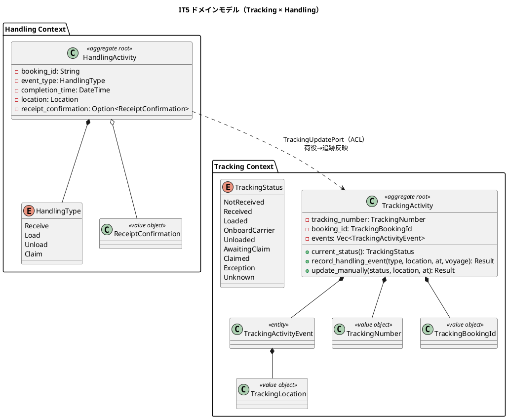
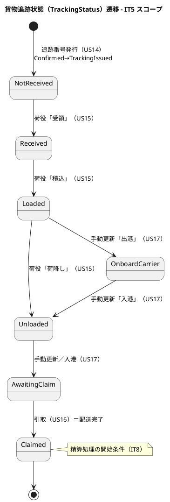
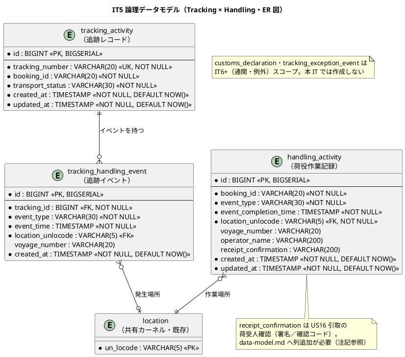
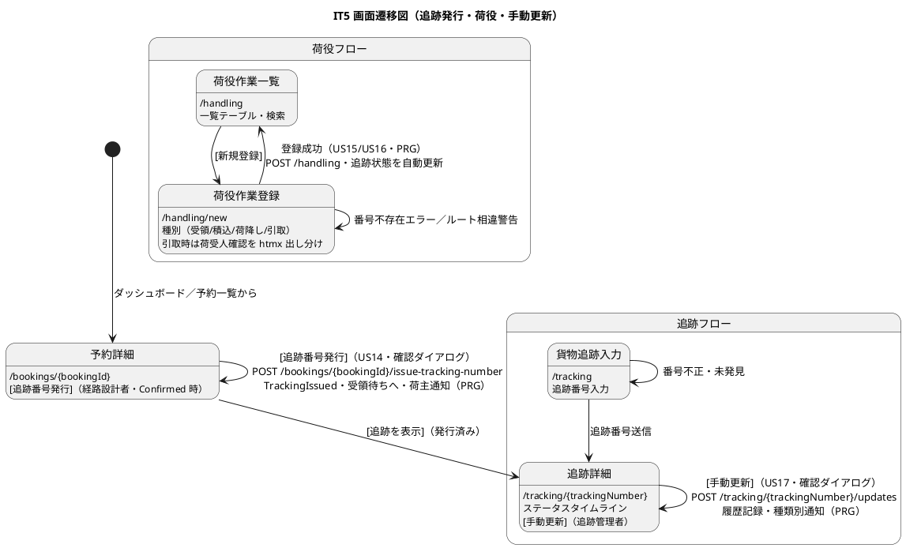
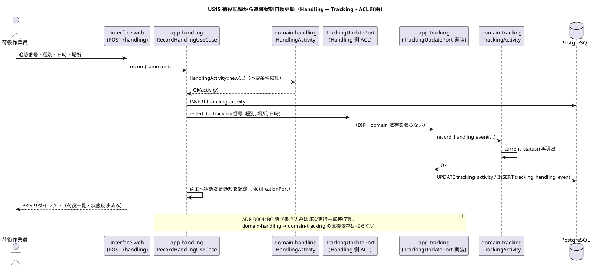

# イテレーション 5 計画

## 概要

| 項目 | 内容 |
|------|------|
| **イテレーション** | 5 |
| **期間** | Week 9-10（2 週間・2026-09-02 〜 2026-09-15） |
| **局面** | 中盤（インサイドアウト） |
| **ゴール** | スケルトンの Tracking Context・Handling Context を本格実装し、確定予約への追跡番号発行（US14）・荷役／引取作業の記録（US15/US16）・貨物状態の手動更新（US17）を成立させる。荷役・手動更新が追跡状態へリアルタイムに反映される一貫フローを実 PostgreSQL 上で通し、**Release 1.0 MVP を完成**させる |
| **目標 SP** | 14（US14 3・US15 5・US16 3・US17 3） |

---

## ゴール

### イテレーション終了時の達成状態

1. **追跡集約の確立（US14）**: `domain-tracking` に `TrackingActivity` 集約（`TrackingNumber`・`TrackingBookingId`・`TrackingActivityEvent`・`current_status()` 導出）をインサイドアウトで実装する。経路設計者が「予約確定（Confirmed）」の予約に対し一意な追跡番号を発行すると、予約状態が `TrackingIssued` に遷移し、`TrackingActivity` が生成され（初期状態 `NotReceived`＝受領待ち）、荷主へ追跡番号・追跡方法の通知が記録される。
2. **荷役集約の確立（US15）**: `domain-handling` に `HandlingActivity` 集約を実装する。荷役作業員が追跡番号で貨物を特定し、作業種別（受領・積込・荷降し）・作業日時・作業場所（UN/LOCODE）を登録すると、荷役記録が保存され、対応する追跡イベントが `TrackingActivity` に追記されて追跡状態が自動更新（受領済・積込済・荷降し済）される。荷主へ状態変更通知が記録される。
3. **引取記録（US16）**: 作業種別「引取」選択時に荷受人確認（署名または確認コード）を取得して引取作業を記録すると、追跡状態が `Claimed`（引取済＝配送完了）へ更新される。引取済は後続 IT の精算処理開始条件となる（本 IT では状態確立まで）。
4. **貨物状態の手動更新（US17）**: 追跡管理者が追跡番号を指定して現在の貨物情報を確認し、新しい状態・位置・日時で追跡情報を更新できる。更新は追跡イベント履歴に記録され、状態変更の種類に応じた荷主通知が記録される。
5. **BC 独立の維持**: Booking→Tracking（追跡発行）・Handling→Tracking（荷役反映）の連携を、ドメイン層のクレート依存を張らずに ACL／読み取りビュー・アプリケーション層のオーケストレーションで実現する（IT3 `CargoSpecProvider`・IT4 `SelectedRouteView` パターンの踏襲）。

### 成功基準

- US14〜US17 の全受入基準に 1:1 対応するテストが存在し green（Try#1 の対応表 × 実テスト grep 突合をクローズ時に実施）。
- `domain-tracking`・`domain-handling` がスケルトン（`context_name()` プレースホルダ）から集約・値オブジェクト・リポジトリポートを備えた実装へ昇格。
- 追跡状態遷移（`TrackingStatus`）が荷役記録・手動更新から確定的に導出され、貧血ドメインモデルに陥っていない（`current_status()` は保持イベントからの純粋関数）。
- 状態を確定的に変える操作（追跡発行・荷役記録・引取・手動更新）に確認ダイアログを付与（Try#2）し、期限超過・誤操作を UI で防ぐ。
- ワークスペース clippy `-D warnings` クリーン・fmt 準拠・domain/app カバレッジ CI ゲート 85% 維持。

---

## ユーザーストーリー

### 対象ストーリー

| ID | ユーザーストーリー | SP | 対応 UC | アクター |
|----|-------------------|----|--------|--------|
| US14 | 追跡番号を発行する | 3 | UC12 | 経路設計者 |
| US15 | 荷役作業を記録する | 5 | UC13 | 荷役作業員 |
| US16 | 引取作業を記録する | 3 | UC13 | 荷役作業員 |
| US17 | 貨物状態を手動更新する | 3 | UC14 | 追跡管理者 |
| **合計** | | **14** | | |

### ストーリー詳細

#### US14: 追跡番号を発行する（3 SP）

**として** 経路設計者 **したい** 確定した予約に対して一意の追跡番号を発行し荷主に通知したい **なぜなら** 荷主が追跡番号で輸送状況をいつでも確認できるからだ。

**受け入れ基準**:

- [ ] 「予約確定（Confirmed）」状態の予約に対して追跡番号を発行できる（他状態は 422 で拒否）
- [ ] 追跡番号は一意に採番される
- [ ] 発行後、貨物状態（`TrackingStatus`）が「受領待ち（NotReceived）」に設定される
- [ ] 荷主に追跡番号と追跡方法をメール通知（記録）する

#### US15: 荷役作業を記録する（5 SP）

**として** 荷役作業員 **したい** 追跡番号で貨物を特定し作業種別・日時・場所を登録したい **なぜなら** 荷役完了が即座に貨物状態に反映され荷主がリアルタイムで確認できるからだ。

**受け入れ基準**:

- [ ] 追跡番号の入力で貨物を特定できる
- [ ] 作業種別（受領・積込・荷降し）を選択できる
- [ ] 作業日時と作業場所（UN/LOCODE 形式）を入力できる
- [ ] 記録後、貨物状態が対応する状態（受領済・積込済・荷降し済）に自動更新される
- [ ] 記録後、荷主に状態変更通知が送信（記録）される
- [ ] 追跡番号が存在しない場合、エラーメッセージが表示される
- [ ] 作業場所が予定ルートと異なる場合、警告が表示される

#### US16: 引取作業を記録する（3 SP）

**として** 荷役作業員 **したい** 荷受人確認（署名または確認コード）を取得して引取作業を記録したい **なぜなら** 荷受人への正式な引き渡しを証明し配送完了を記録できるからだ。

**受け入れ基準**:

- [ ] 作業種別「引取」を選択すると荷受人確認フィールド（署名または確認コード）が表示される
- [ ] 荷受人確認が取得されると引取作業が記録される
- [ ] 記録後、貨物状態が「引取済（Claimed）」に更新される
- [ ] 「引取済」は配送完了を意味し精算処理の開始条件となる（本 IT では状態確立まで）

#### US17: 貨物状態を手動更新する（3 SP）

**として** 追跡管理者 **したい** 追跡番号を指定して貨物の状態・位置・更新日時を手動更新したい **なぜなら** 荷役記録だけでは捕捉できない状態変化（出港・入港等）を反映できるからだ。

**受け入れ基準**:

- [ ] 追跡番号を指定して現在の貨物情報を確認できる
- [ ] 新しい状態・位置・日時を入力して追跡情報を更新できる
- [ ] 更新後、追跡イベントが履歴に記録される
- [ ] 状態変更の種類に応じて荷主への通知が送信（記録）される

### タスク

#### 0. IT4 ふりかえり Try 返済枠（技術的負債返済・SP 外）

- [x] **Try#1**: 本計画の対応表に想定テスト名を記載済み（クローズ時に grep 突合を実施）。
- [x] **Try#2**: 状態を確定的に変える操作（追跡発行・荷役記録・引取・手動更新）に確認ダイアログ（`confirm()`）を付与。
- [x] **Try#3**: 経路 0 件時の「荷主との条件協議依頼」を通知記録付きの実導線化（`POST /bookings/{id}/consult-shipper`）。
- [x] **Try#4**: 期限超過候補（⚠）のラジオを `disabled` 化し app 層 422 をユーザーに見せない。
- [x] **Try#5**: TOCTOU の `expected_voyages_list` を `expected_voyages` モジュールに集約し round-trip テスト 4 件を追加。
- [x] **Try#6**: `BookingStatus` に `label()`・述語メソッド（`is_confirmed()` 等）を追加し web の文字列比較を排除。

#### 1. 追跡ドメイン（US14 の基盤・インサイドアウト起点）（US14 3 SP）

- [x] `domain-tracking` を昇格: `TrackingActivity` 集約・値オブジェクト・`TrackingStatus` enum（9値）・`current_status()` 純粋関数・`TrackingActivityRepository` ポートを実装（9 テスト green）。
- [x] 追跡番号採番ポート（`TrackingNumberGenerator`／`UuidTrackingNumberGenerator`）を定義。

#### 2. 荷役ドメイン（US15/US16）（US15 の一部）

- [x] `domain-handling` を昇格: `HandlingActivity` 集約・`HandlingType`・`ReceiptConfirmation` 値オブジェクト・`HandlingActivityRepository` ポートを実装（9 テスト green）。
- [x] 引取（Claim）は荷受人確認必須の不変条件をドメインに閉じ込め（`ReceiptConfirmationRequired`）。

#### 3. アプリケーション層・BC 連携（US14/US15/US16/US17）（US15 残 ＋ US16 ＋ US17）

- [x] `app-tracking` 新設: `IssueTrackingService`（US14）・`ManualTrackingUpdateService`（US17）。`ConfirmedBookingIssuer` ACL で `Confirmed → TrackingIssued` を先行確定（ADR-0004）。mockall 4 テスト。
- [x] `app-handling` 新設: `RecordHandlingService`（US15/US16）。`TrackingReflectionPort`（Handling 側 ACL）で追跡反映、`RouteCheckPort` で相違警告（非ブロッキング）。mockall 5 テスト。
- [x] 通知は tracking 由来の `TRACKING_NUMBER_ISSUED`／`CARGO_STATUS_CHANGED` を notification テーブルへ記録（送信＝記録）。

#### 4. インターフェース（画面・htmx／PRG）（US14/US15/US16/US17 の画面）

- [x] 予約詳細（`/bookings/{bookingId}`）に「追跡番号発行」導線（US14・確認ダイアログ付・経路設計者のみ）。
- [x] 荷役作業登録（`/handling/new`）・荷役作業一覧（`/handling`）（US15/US16・`RoleGuard<HandlerUser>`）。引取選択時に荷受人確認フィールドを JS で出し分け。
- [x] 貨物追跡入力（`/tracking`）・追跡詳細（`/tracking/{trackingNumber}`・タイムライン）・手動更新導線（US17・`RoleGuard<TrackerUser>`）。ACL アダプター 4 種を `tracking_acl` に実装。
- [x] HTTP フロー統合テスト 5 件（testcontainers）で US14-17 の一貫フローを検証。
- [x] ナビゲーション整合: navbar はロール別に `/tracking`・`/handling` を出力（IT1 実装）。ROLE_HANDLER／ROLE_TRACKER のナビ表示検証テストを追加（auth_flow_test）。dashboard 最新荷役一覧の拡充は後続 IT。

#### タスク合計

見積 14 SP（US14 3・US15 5・US16 3・US17 3）＋ Try 返済枠（SP 外）。

---

## スケジュール

### Week 1（Day 1-5）

- Day 1: Try#5/#6 返済（既存 Booking/Routing の負債整理）＋ `domain-tracking` 集約 TDD（US14 ドメイン）
- Day 2: 追跡番号採番・`app-tracking` 追跡発行ユースケース＋ `ConfirmedBookingView` ACL・`Confirmed → TrackingIssued` 連携
- Day 3: US14 画面（予約詳細の発行導線・確認ダイアログ Try#2）＋ HTTP フローテスト
- Day 4: `domain-handling` 集約 TDD（US15 受領・積込・荷降し）
- Day 5: `app-handling` 荷役記録＋ `TrackingUpdatePort` で追跡状態自動更新・状態変更通知

### Week 2（Day 6-10）

- Day 6: US15 画面（荷役登録・一覧）＋ 追跡番号不存在エラー・ルート相違警告
- Day 7: US16 引取記録（荷受人確認不変条件・`Claimed` 遷移）＋ 画面出し分け（htmx）
- Day 8: US17 手動状態更新（`app-tracking`・追跡詳細タイムライン・履歴記録・通知）
- Day 9: Try#3（US10 協議依頼の実導線化）・Try#4（期限超過候補のラジオ不可化）返済＋ E2E（追跡・荷役デモ項目）
- Day 10: 受入基準×テスト対応表突合（Try#1）・カバレッジ確認・developing-review 反映・クローズ準備

---

## 設計

> 本 IT の対象スコープに絞り、設計の各トピックに PlantUML 図を掲載する。US14〜US17 はいずれも状態を持つ追跡・荷役の中核であり、ドメインモデル図・状態遷移図・ER 図（データモデル）・画面遷移図（UI）・シーケンス図（API・BC 跨ぎ連携）をすべて掲載する。

### ドメインモデル（Tracking Context ＋ Handling Context・IT5 追加分）

> **BC 独立**: `domain-handling → domain-tracking` の依存は張らない。荷役記録の追跡反映は app 層が `TrackingUpdatePort`（Handling 側 ACL）経由で行う。Booking→Tracking（追跡発行）も同様に `ConfirmedBookingView`（Tracking 側 ACL）で参照する。

### 状態遷移図（TrackingStatus・IT5 中核）

### データモデル（Tracking Context ＋ Handling Context・IT5）

マイグレーション: `20260902000001_it5_tracking_handling.sql`（`data-model.md` の論理データモデルに準拠）。`handling_activity.receipt_confirmation` 列は US16 のため新設し、`data-model.md` へ反映する。

### ユーザーインターフェース

| 画面 | パス | ロール | US |
|------|------|--------|----|
| 予約詳細（追跡番号発行導線） | `/bookings/{bookingId}` | 経路設計者 | US14 |
| 荷役作業登録 | `/handling/new` | 荷役作業員 | US15, US16 |
| 荷役作業一覧 | `/handling` | 荷役作業員・追跡管理者 | US15 |
| 貨物追跡入力 | `/tracking` | 荷主・荷受人・追跡管理者 | US18 照会（IT6）。IT5 では手動更新のため追跡詳細への入口として利用 |
| 追跡詳細（タイムライン・手動更新導線） | `/tracking/{trackingNumber}` | 追跡管理者（手動更新）・荷主・荷受人（照会） | US17（照会 US18 は IT6） |

> **注（ui_design.md 画面一覧との整合）**: `ui_design.md` の画面一覧では `/tracking`＝US18（照会）・`/tracking/{trackingNumber}`＝US17,US18 と割り当てられている。US17（手動更新）の主導線は追跡詳細画面に集約し、`/tracking` 入力画面自体は US18（照会・IT6）の入口である。IT5 では追跡詳細に「手動更新」導線（追跡管理者ロール条件）を追加する。

#### 画面遷移図（IT5 スコープ）

#### インタラクション

- PRG（Post-Redirect-Get）パターンを踏襲。追跡発行・荷役記録・引取・手動更新はすべて POST → リダイレクト。
- 確認ダイアログ（Try#2）を状態確定操作に付与。
- 引取選択時の荷受人確認フィールドは htmx で動的に出し分け。

### API 設計

- `POST /bookings/{bookingId}/issue-tracking-number`（追跡番号発行・US14。ui_design.md L626 の予約詳細ワイヤーフレーム仕様に一致）
- `POST /handling`（荷役／引取記録・US15/US16）
- `POST /tracking/{trackingNumber}/updates`（手動状態更新・US17）
  - **注（設計への反映が必要）**: `ui_design.md`／`architecture_frontend.md` では `GET /tracking/{id}/status` が htmx の 30 秒自動更新（部分描画）に割当済みで、POST の手動更新パスは未定義。用途衝突を避けるため手動更新は `POST /tracking/{trackingNumber}/updates` を新設し、当該 IT で `ui_design.md`（追跡詳細画面のアクション）へ反映する。
- 認可は `RoleGuard<R>`（`RouteDesignerUser`／`HandlerUser`／`TrackerUser`）でコンパイラ保証（IT1 パターン踏襲）。

#### シーケンス図（US15 荷役記録 → 追跡反映・BC 跨ぎ連携）

### ADR

- **ADR 候補（追跡状態の導出方式）**: `TrackingStatus` を保持イベントからの純粋関数 `current_status()` で導出し状態を二重管理しない設計を ADR 化検討（domain-model の根拠に対応）。
- **既存 ADR 踏襲**: ADR-0004（BC 跨ぎ書き込み一貫性・逐次＋冪等収束）を Booking→Tracking／Handling→Tracking 連携に適用。ADR-0005（状態機械）パターンを Tracking 集約に展開。

### docs/design への反映が必要な設計要素（当該 IT で反映）

実装と同一 IT で `docs/design/` を更新し先行乖離を残さない（IT2〜IT4 で確立した規律）。

1. **`ReceiptConfirmation`（荷受人確認 VO・US16）を `domain-model.md` の Handling Context 要素表に定義行として追加**（現状未定義）。署名または確認コードを保持し、引取（Claim）の不変条件に用いる。
2. **`ui_design.md` の荷役作業登録ワイヤーフレーム（salt）本体・仕様に荷受人確認フィールド（署名／確認コード）を追記**（引取選択時の htmx 出し分け・現状 salt 未同期）。
3. **`ui_design.md` の追跡詳細画面（salt）のアクションに「手動更新」導線（追跡管理者ロール条件）を追記**（現状 `[別の貨物を追跡]／[予約詳細を表示]／[例外を登録]` のみ）。
4. **荷役イベント種別（Receive/Load/Unload/Claim の 4 種）と `TrackingStatus` 9 状態（`OnboardCarrier`／`AwaitingClaim` は手動更新由来）の対応表を `domain-model.md` に明示**し、`current_status()` 導出の根拠を残す。

---

## 受入基準 × テストケース対応表（Try #1）

### US14: 追跡番号を発行する

| 受入基準 | 想定テスト（クレート::テスト名） |
|---------|--------------------------------|
| 確定予約に追跡番号を発行できる | domain-tracking::追跡番号発行で受領待ち状態の追跡が生成される / app-tracking::確定予約に追跡番号を発行できる |
| 他状態は拒否 | app-tracking::未確定予約への追跡発行は拒否される（422）|
| 一意採番 | domain-tracking::追跡番号は一意に採番される |
| 発行後 NotReceived | domain-tracking::発行直後の状態は受領待ち |
| 荷主通知記録 | app-tracking::発行時に荷主へ追跡番号通知が記録される / interface-web::tracking_flow 追跡発行 HTTP |

### US15: 荷役作業を記録する

| 受入基準 | 想定テスト |
|---------|-----------|
| 追跡番号で貨物特定 | app-handling::追跡番号で貨物を特定して荷役を記録できる |
| 作業種別選択 | domain-handling::受領・積込・荷降しを記録できる |
| 日時・場所入力 | domain-handling::作業場所はUN_LOCODE形式で検証される |
| 状態自動更新 | app-handling::荷役記録で追跡状態が自動更新される（受領済・積込済・荷降し済）|
| 状態変更通知 | app-handling::荷役記録で荷主へ状態変更通知が記録される |
| 番号不存在エラー | app-handling::存在しない追跡番号はエラー / interface-web::handling_flow 不存在 |
| ルート相違警告 | app-handling::予定ルートと異なる場所は警告を返す |

### US16: 引取作業を記録する

| 受入基準 | 想定テスト |
|---------|-----------|
| 引取選択で確認フィールド表示 | interface-web::handling_flow 引取選択で荷受人確認フィールド表示 |
| 荷受人確認で記録 | domain-handling::荷受人確認なしの引取は拒否される / app-handling::引取を記録できる |
| Claimed 更新 | app-handling::引取記録で追跡状態が引取済になる |
| 配送完了＝精算開始条件 | domain-tracking::引取済は配送完了を表す |

### US17: 貨物状態を手動更新する

| 受入基準 | 想定テスト |
|---------|-----------|
| 現在情報確認 | interface-web::tracking_flow 追跡詳細で現在状態を表示 |
| 手動更新 | app-tracking::状態・位置・日時を手動更新できる |
| 履歴記録 | domain-tracking::手動更新で追跡イベントが履歴に追記される |
| 種類別通知 | app-tracking::状態変更種類に応じて荷主通知が記録される |

---

## リスクと対策

| リスク | 影響 | 対策 |
|--------|------|------|
| Tracking/Handling がスケルトンからの新規実装で作業量が大きい | 14 SP 未達 | インサイドアウトでドメインを先に固め、共通の集約パターン（IT4 状態機械）を再利用。app/interface は薄く |
| Booking→Tracking・Handling→Tracking の BC 跨ぎ書き込みで中間状態 | 部分失敗で不整合 | ADR-0004 の逐次＋冪等収束を踏襲。app 層でオーケストレーション・ドメイン依存は張らない |
| 「予定ルートと異なる場所」警告の判定に Routing 参照が必要 | BC 依存混入 | 本 IT では簡易判定（予約の RouteSpecification 経由地との照合）に留め、詳細照合は後続。ACL 経由で読取 |
| infra-eventbus のイベント化スコープ肥大 | 計画超過 | 本 IT は同期オーケストレーションに限定。ドメインイベント＋アウトボックス化は IT6 で検討（IT4 引き継ぎ） |

---

## 完了条件

### Definition of Done

- [x] US14〜US17 の全受入基準に対応するテストが存在し green（通知系は HTTP フローで notification テーブルをアサート・IT5 レビュー H1 対応）
- [x] `domain-tracking`・`domain-handling` が集約・値オブジェクト・リポジトリポートを備え実装昇格
- [x] `app-tracking`・`app-handling` クレートを workspace members に追加
- [x] マイグレーション `20260902000001_it5_tracking_handling.sql` 適用・infra 統合テスト green
- [x] ナビゲーション整合（navbar／ロール別メニュー／検証テスト）。dashboard 最新荷役一覧の拡充は後続 IT
- [x] ワークスペース clippy `-D warnings` クリーン・fmt 準拠・IT5 新規クレートカバレッジ 78-95%（domain-tracking value_objects/ports は未使用便利メソッド・trait 定義で低め）
- [x] IT4 Try#1〜#6 の返済完了
- [x] developing-review（5 エージェント並列）実施・高優先度 4 件クローズ前対応（[レビュー](../review/it5_development_review_20260723.md)）

### デモ項目

1. 経路設計者が確定予約に追跡番号を発行 → 予約が TrackingIssued・追跡が受領待ちに・荷主へ通知記録（US14）
2. 荷役作業員が追跡番号で受領→積込→荷降しを記録 → 追跡状態が自動更新・荷主へ状態変更通知（US15）
3. 荷役作業員が引取を荷受人確認付きで記録 → 追跡状態が引取済（配送完了）に（US16）
4. 追跡管理者が追跡詳細で手動更新（出港/入港）→ 履歴記録・種類別通知（US17）
5. **Release 1.0 MVP の一貫フロー**（予約→経路→確定→追跡発行→荷役→引取）を通しデモ

---

## 更新履歴

| 日付 | 内容 |
|------|------|
| 2026-07-23 | IT5 計画初版作成（opening-iteration・IT4 ふりかえり Try 反映） |

---

## 関連ドキュメント

- [リリース計画](./release_plan.md)
- [開発戦略](./development_strategy.md)
- [イテレーション 4 ふりかえり](./retrospective-4.md)
- [ドメインモデル設計](../design/domain-model.md)
- [データモデル設計](../design/data-model.md)
- [UI 設計](../design/ui_design.md)
- [ユーザーストーリー](../requirements/user_story.md)
- [ADR-0004 BC 跨ぎ書き込み一貫性](../adr/0004-cross-context-write-consistency.md)
- [ADR-0005 予約状態機械](../adr/0005-booking-status-state-machine.md)
