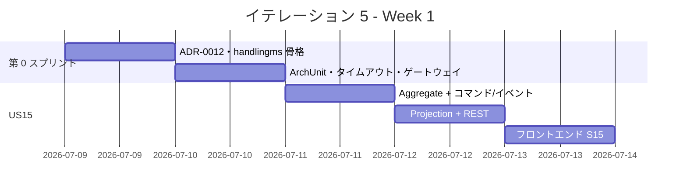
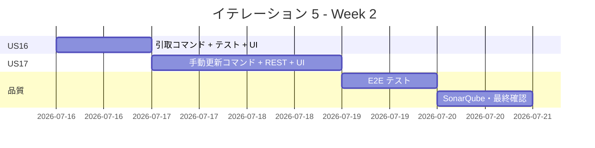
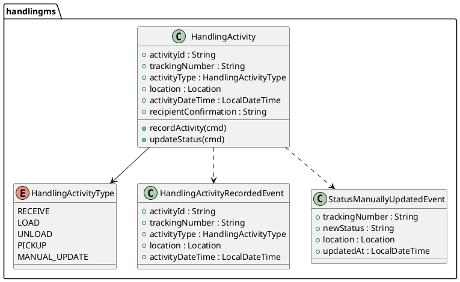
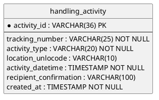

# イテレーション 5 計画

## 概要

| 項目 | 内容 |
|------|------|
| **イテレーション** | 5 |
| **期間** | Week 9-10（2026-07-09 〜 2026-07-22） |
| **ゴール** | `handlingms` を新設し、荷役作業記録（US15/US16）と貨物状態手動更新（US17）を実装することで Phase 2 追跡基盤を確立する |
| **目標 SP** | 11（新規 11 SP） |
| **基準ベロシティ** | 14.7 SP（IT1〜IT3 平均）／ IT4 は特例スコープのため除外 |

---

## ゴール

### イテレーション終了時の達成状態

1. **handlingms 稼働**: Axon Event Sourcing による `HandlingActivity` Aggregate が起動し、荷役作業コマンドを受け付ける
2. **荷役作業記録（US15/US16）**: 追跡番号を使って受領・積込・荷降し・引取の 4 作業種別が記録でき、貨物状態に反映される
3. **状態手動更新（US17）**: 追跡管理者が追跡番号を指定して貨物状態・位置を手動更新でき、イベント履歴に追記される

### 成功基準

- [ ] `POST /api/v1/handling/activities` が作業記録を受け付けて `HandlingActivityRecordedEvent` を発行する
- [ ] `PUT /api/v1/handling/activities/{trackingNumber}/status` が状態手動更新を実行する
- [ ] handlingms の全ユニット/統合テストがパス
- [ ] フロントエンドの荷役作業記録画面（S15）・状態更新画面（S17）が動作する
- [ ] Playwright E2E テストが追加・全通過する
- [ ] SonarQube Quality Gate PASS（new_coverage ≥ 80%・violations 0）
- [ ] IT4 コードレビュー指摘の高優先度 3 件を対応済みにする（H1 ArchUnit・H2 タイムアウト・H3 テスト更新）

---

## ユーザーストーリー

### 対象ストーリー

| ID | ユーザーストーリー | SP | 優先度 | 区分 |
|----|------------------|----|----|------|
| TI04 | IT5 第 0 スプリント（handlingms 骨格・ADR-0012・IT4 レビュー H1-H3 対応） | 2 | 必須 | 技術タスク |
| US15 | 荷役作業を記録する | 5 | 必須 | 新規 |
| US16 | 引取作業を記録する | 2 | 必須 | 新規（US15 拡張） |
| US17 | 貨物状態を手動更新する | 2 | 必須 | 新規 |
| **合計** | | **11** | | |

> **フィーチャバッファ**: US16 引取確認フィールド（1 SP）は US15 が先行完了した場合に実装。US17 通知送信（1 SP）は IT6 以降に繰越し可能。

### ストーリー詳細

#### TI04: IT5 第 0 スプリント

**目的**: handlingms の Axon Event Sourcing 骨格を確立し、IT4 コードレビュー指摘（H1〜H3）を解消する。

**受入条件**:

1. handlingms に `HandlingActivity` Aggregate クラスが存在し Spring Boot が起動できる
2. ADR-0012「handlingms と trackingms の責務分離方針」が承認済み
3. ArchUnit で `@TargetEntityId` 欠落コマンドを検出するアーキテクチャテストが bookingms に追加されている
4. `sendAndWait()` のタイムアウトが `BookingController` 全 3 箇所に明示指定されている（例: 30 秒）
5. `confirm`・`issue-tracking` の統合テストが `sendAndWait` に更新されている

#### US15: 荷役作業を記録する

**ストーリー**:
> 荷役作業員として、追跡番号を入力して貨物を特定し、作業種別・日時・場所を登録したい。なぜなら、荷役作業完了が即座に貨物状態に反映され、荷主がリアルタイムで確認できるからだ。

**受入条件**:

1. 追跡番号の入力で貨物を特定できる
2. 作業種別（受領・積込・荷降し）を選択できる
3. 作業日時と作業場所（UN/LOCODE 形式）を入力できる
4. 記録後、貨物状態が対応する状態（受領済・積込済・荷降し済）に自動更新される
5. `HandlingActivityRecordedEvent` が Axon Event Store に記録される

#### US16: 引取作業を記録する

**ストーリー**:
> 荷役作業員として、荷受人が貨物を引き取る際に確認コードを取得して引取作業を記録したい。なぜなら、配送完了を記録し精算処理の開始条件を満たせるからだ。

**受入条件**:

1. 作業種別「引取」を選択すると荷受人確認フィールドが表示される
2. 確認コードが取得されると引取作業が記録される
3. 記録後、貨物状態が「引取済」に更新される
4. 「引取済」は精算処理の開始条件となる

#### US17: 貨物状態を手動更新する

**ストーリー**:
> 追跡管理者として、追跡番号を指定して貨物の状態・位置・更新日時を手動で更新したい。なぜなら、荷役作業員では捕捉できない状態変化を追跡情報に反映できるからだ。

**受入条件**:

1. 追跡番号を指定して現在の貨物情報を確認できる
2. 新しい状態・位置・日時を入力して追跡情報を更新できる
3. 更新後、追跡イベントが履歴に記録される
4. 状態変更の種類に応じた通知ログが出力される（IT5 はログのみ、実送信は IT6+）

---

## タスク

### 1. TI04: IT5 第 0 スプリント（2 SP）

| # | タスク | 見積もり | 担当 | 状態 |
|---|--------|---------|------|------|
| 1.1 | ADR-0012 起票（handlingms / trackingms 責務分離・Saga 方針） | 2h | - | [ ] |
| 1.2 | handlingms 骨格作成（Spring Boot + Axon + MyBatis + Flyway 設定） | 3h | - | [ ] |
| 1.3 | ArchUnit テスト追加（`@TargetEntityId` 強制） | 2h | - | [ ] |
| 1.4 | `BookingController` `sendAndWait` タイムアウト明示指定（30s） | 1h | - | [ ] |
| 1.5 | `BookingControllerIntegrationTest` confirm/issue-tracking を sendAndWait に更新 | 1h | - | [ ] |
| 1.6 | gatewayms に `/api/v1/handling/**` ルーティング追加 | 1h | - | [ ] |

**小計**: 10h

### 2. US15: 荷役作業を記録する（5 SP）

| # | タスク | 見積もり | 担当 | 状態 |
|---|--------|---------|------|------|
| 2.1 | `HandlingActivity` Aggregate（受領・積込・荷降し コマンド/イベント定義） | 3h | - | [ ] |
| 2.2 | `RecordHandlingActivityCommand` + `HandlingActivityRecordedEvent` | 2h | - | [ ] |
| 2.3 | `HandlingProjectionsEventHandler`（handling_activity テーブル投影） | 2h | - | [ ] |
| 2.4 | `HandlingController` POST `/api/v1/handling/activities` | 2h | - | [ ] |
| 2.5 | Flyway V001（handlingms）: `handling_activity` テーブル作成 | 1h | - | [ ] |
| 2.6 | ユニットテスト（Aggregate）+ 統合テスト（REST） | 3h | - | [ ] |
| 2.7 | フロントエンド S15 荷役作業記録フォーム | 3h | - | [ ] |

**小計**: 16h

### 3. US16: 引取作業を記録する（2 SP）

| # | タスク | 見積もり | 担当 | 状態 |
|---|--------|---------|------|------|
| 3.1 | 引取コマンド（`RecordPickupCommand`）と確認コードフィールド追加 | 2h | - | [ ] |
| 3.2 | 「引取済」状態遷移テスト | 2h | - | [ ] |
| 3.3 | フロントエンド 引取確認フィールド表示条件 | 1h | - | [ ] |

**小計**: 5h

### 4. US17: 貨物状態を手動更新する（2 SP）

| # | タスク | 見積もり | 担当 | 状態 |
|---|--------|---------|------|------|
| 4.1 | `ManualStatusUpdateCommand` + `StatusManuallyUpdatedEvent` | 2h | - | [ ] |
| 4.2 | `HandlingController` PUT `/api/v1/handling/activities/{trackingNumber}/status` | 2h | - | [ ] |
| 4.3 | ユニットテスト + 統合テスト | 2h | - | [ ] |
| 4.4 | フロントエンド S17 状態手動更新フォーム | 2h | - | [ ] |

**小計**: 8h

### 5. E2E テスト + SonarQube（バッファ）

| # | タスク | 見積もり | 担当 | 状態 |
|---|--------|---------|------|------|
| 5.1 | Playwright E2E: US15/US17 フルフロー | 3h | - | [ ] |
| 5.2 | SonarQube スキャン・violations 修正 | 2h | - | [ ] |

**小計**: 5h

### タスク合計

| カテゴリ | SP | 理想時間 | 状態 |
|---------|----|----|------|
| TI04 第 0 スプリント | 2 | 10h | [ ] |
| US15 荷役作業記録 | 5 | 16h | [ ] |
| US16 引取作業記録 | 2 | 5h | [ ] |
| US17 状態手動更新 | 2 | 8h | [ ] |
| E2E・品質 | — | 5h | [ ] |
| **合計** | **11** | **44h** | |

**1 SP あたり**: 約 4h（実装 + テスト）
**進捗率**: 0%（0/11 SP）

---

## スケジュール

### Week 1（Day 1-5）: 骨格確立・US15 実装



| 日 | タスク |
|----|--------|
| Day 1 | ADR-0012 起票・handlingms 骨格作成・gateway 追加 |
| Day 2 | ArchUnit テスト・sendAndWait タイムアウト・統合テスト更新 |
| Day 3 | HandlingActivity Aggregate + RecordHandlingActivityCommand/Event |
| Day 4 | HandlingProjectionsEventHandler + HandlingController + Flyway V001 |
| Day 5 | フロントエンド S15 荷役作業記録フォーム |

### Week 2（Day 6-10）: US16/US17・E2E・品質



| 日 | タスク |
|----|--------|
| Day 6 | US16 引取コマンド・確認フィールド UI |
| Day 7 | US17 ManualStatusUpdateCommand・PUT エンドポイント |
| Day 8 | US17 フロントエンド S17・統合テスト |
| Day 9 | Playwright E2E US15/US17 フルフロー |
| Day 10 | SonarQube スキャン・violations 修正・デモ準備 |

---

## 設計

### ドメインモデル



### データモデル



### API 設計

| メソッド | エンドポイント | 説明 | ロール |
|---------|---------------|------|--------|
| `POST` | `/api/v1/handling/activities` | 荷役作業を記録する | `ROLE_HANDLER` |
| `PUT` | `/api/v1/handling/activities/{trackingNumber}/status` | 貨物状態を手動更新する | `ROLE_TRACKER` |
| `GET` | `/api/v1/handling/activities/{trackingNumber}` | 作業履歴を照会する | `ROLE_HANDLER`, `ROLE_TRACKER` |

#### POST /api/v1/handling/activities リクエスト例

```json
{
  "trackingNumber": "TRK-20260718-ABC12345",
  "activityType": "RECEIVE",
  "location": "JPTYO",
  "activityDateTime": "2026-07-18T09:00:00",
  "recipientConfirmation": null
}
```

### ADR

| ADR | タイトル | ステータス |
|-----|---------|-----------|
| ADR-0012（新規） | handlingms と trackingms の責務分離・Saga 方針 | 提案 |

> **ADR-0012 要点**: US15〜US17 は `handlingms` で実装し `HandlingActivityRecordedEvent` を発行。将来の追跡照会（US18）は `trackingms` が当該イベントをサブスクライブして Read Model を構築する。IT5 では `trackingms` は作成せず、handlingms 内の projection で代替する。

### ディレクトリ構成（新規）

```
apps/backend/handlingms/
├── src/main/java/com/example/cargotracker/handlingms/
│   ├── HandlingApplication.java
│   ├── domain/model/
│   │   ├── aggregates/HandlingActivity.java
│   │   ├── commands/RecordHandlingActivityCommand.java
│   │   ├── commands/RecordPickupCommand.java
│   │   ├── commands/ManualStatusUpdateCommand.java
│   │   └── events/HandlingActivityRecordedEvent.java
│   ├── infrastructure/persistence/
│   │   ├── HandlingActivityMapper.java
│   │   └── HandlingActivityRecord.java
│   └── interfaces/rest/
│       ├── HandlingController.java
│       └── dto/RecordActivityRequest.java
└── src/main/resources/
    ├── application.yml
    └── db/migration/V001__create_handling_activity.sql
```

---

## リスクと対策

| リスク | 影響度 | 対策 |
|--------|--------|------|
| handlingms 新設の設定コスト超過 | 中 | 第 0 スプリント（Day 1-2）で骨格を確立してから機能実装に移行。bookingms の設定を参考にして短縮 |
| Axon コマンドルーティング再発（@TargetEntityId 欠落） | 高 | TI04 で ArchUnit テストを追加。CI で自動検出 |
| `sendAndWait()` タイムアウト超過 | 中 | タイムアウト 30 秒を明示指定。異常系レスポンスを統合テストで検証 |
| US16 引取確認フィールドの業務未合意 | 低 | 確認コード形式（UUID / 署名画像 / 4 桁 PIN）を IT5 計画前にユーザー代表と合意 |

---

## 完了条件

### Definition of Done

- [ ] コードレビュー（`developing-review`）完了、または SonarQube Quality Gate PASS で代替
- [ ] 全ユニットテストがパス（バックエンド・フロントエンド）
- [ ] Playwright E2E テストがパス（US15/US17 フルフロー含む）
- [ ] SonarQube Quality Gate PASS（new_coverage ≥ 80%・new_violations 0）
- [ ] ArchUnit テストがパス（`@TargetEntityId` 強制）
- [ ] ADR-0012 承認済み
- [ ] gateway に `/api/v1/handling/**` が登録済み
- [ ] IT4 コードレビュー指摘 H1〜H3 対応済み

### デモ項目

1. 荷役作業記録フォーム（S15）で追跡番号を入力し「受領」作業を記録 → 成功
2. 「引取」を選択すると確認コードフィールドが表示される
3. 追跡番号を指定して貨物状態を「積込済」に手動更新 → 履歴に追記される

---

## 更新履歴

| 日付 | 更新内容 | 更新者 |
|------|---------|--------|
| 2026-05-18 | 初版作成（IT4 完了後・IT4 コードレビュー指摘反映） | AI Agent（XP PM） |

---

## 関連ドキュメント

- [リリース計画](./release_plan.md)
- [イテレーション 4 計画](./iteration_plan-4.md)
- [イテレーション 4 完了報告書](./iteration_report-4.md)
- [IT4 バグ修正コードレビュー](../review/IT4_bugfix_review_20260518.md)
