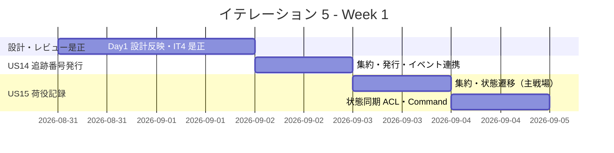
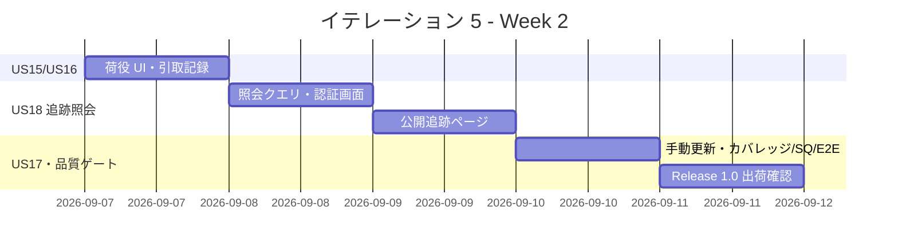
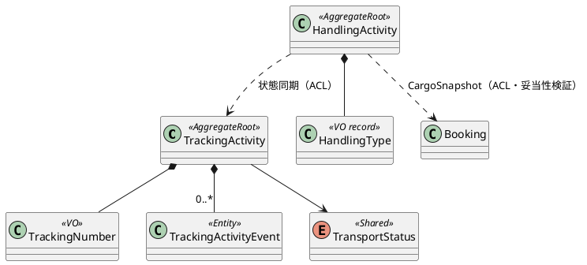

# イテレーション 5 計画

## 概要

| 項目 | 内容 |
|------|------|
| **イテレーション** | 5 |
| **期間** | 2026-08-31 〜 2026-09-11（2 週間） |
| **ゴール** | 追跡番号発行・荷役/引取記録・貨物状態更新・追跡照会（公開ページ含む）が動作し、Release 1.0（MVP）を出荷する |
| **目標 SP** | 17（US14 / US15 / US16 / US17 / US18）※ 超過分はフィーチャバッファで US17 を調整候補 |

---

## ゴール

### イテレーション終了時の達成状態

1. **追跡の開始**: 予約確定後、経路設計者が追跡番号を発行し、貨物状態が追跡ライフサイクル（`TransportStatus`：NotReceived → Received → Loaded → OnboardCarrier → Unloaded → Claimed）に入る（US14）。IT4 で宙吊りだった `BookingConfirmedEvent` を追跡番号発行の起点として消費する。
2. **荷役の記録と状態同期**: 荷役作業員が受領・積込・荷降し・引取を記録し、貨物状態（`TransportStatus`）と予約状態（`BookingStatus`）を同期する（US15/US16）。追跡管理者が状態を手動更新できる（US17）。
3. **追跡照会**: 荷主・荷受人・追跡管理者が追跡番号から現在地・状態・イベント履歴・推定到着日を照会でき、公開ページ（認証不要）でも照会できる（US18）。
4. **Release 1.0 出荷**: IT1-5 の予約〜追跡フローが一気通貫で動作し、MVP のリリース条件を満たす。

### 成功基準

- [ ] US14・US15・US16・US17・US18 の受入条件をすべて満たす
- [ ] `BookingConfirmedEvent` の post-commit ハンドラで追跡番号発行を起動（IT4 レビュー H3 の解消）
- [ ] `TransportStatus`（共有カーネル）と `BookingStatus` の同期が荷役記録で正しく動作し単体テストで網羅される
- [ ] 公開追跡ページ（`/public/tracking/{trackingId}`）が未認証で到達でき、追跡番号を検証して履歴を表示する
- [ ] ArchUnit で Tracking/Handling BC の依存方向（ACL 経由のみ）を継続検証する
- [ ] **IT4 レビュー高優先の是正を消化**：H1（真実の源泉明文化）・H2（経路選択の堅牢化）・H4（selectedIndex テスト）・H5（通知重複抑止）・H6/H7（予約詳細に確定経路表示・アクション順提示）
- [ ] **繰り越し品質ゲートの決着**：ドメイン層 85% カバレッジハードゲート（T2/SQ-1）・SonarQube SQ-2〜5（T3）・Playwright E2E（T4）・外部経路サービス契約 ADR（T6）

### アプローチ（開発戦略: 中盤インサイドアウトの最終イテレーション）

[開発戦略](./development_strategy.md#中盤-インサイドアウトit3-5) に従い、IT5 は**中盤・インサイドアウトの最終イテレーション**。データ層 → ドメイン層 → アプリ → プレゼンの順で Tracking/Handling BC を作り込み、IT6（終盤・アウトサイドイン）への移行に備える。

- 追跡・荷役はドメインロジック（状態遷移・イベント時系列・状態同期）が中核のため、ドメイン層に凝集させる（中盤の主戦場の締め）。
- BC 連携（Booking→Tracking の追跡番号発行、Handling→Tracking/Booking の状態同期）は IT4 で確立した ACL パターン（`ISelectedRouteLookup` 型の SQL 直接参照・プリミティブ DTO）を踏襲し BC 独立を維持する。
- **IT4 レビュー・ふりかえりの是正を Week 1 前半に先行消化**してから US14-18 を積む（技術的負債を持ち越さない）。
- 局面移行（IT5→IT6）に向けて Release 1.0 リリース条件（[release_plan.md](./release_plan.md)）の充足を Day 10 に確認する。

---

## ユーザーストーリー

### 対象ストーリー

| ID | ユーザーストーリー | SP | 優先度 |
|----|-------------------|----|----|
| US14 | 追跡番号を発行する | 2 | 必須 |
| US15 | 荷役作業を記録する | 5 | 必須 |
| US16 | 引取作業を記録する | 3 | 必須 |
| US17 | 貨物状態を手動更新する | 2 | 必須（調整候補） |
| US18 | 追跡情報を照会する | 5 | 必須 |
| **合計** | | **17** | |

### ストーリー詳細

#### US14: 追跡番号を発行する（UC12）

**ストーリー**:
> 経路設計者として、確定した予約に一意の追跡番号を発行したい。なぜなら、追跡番号を起点に荷役・追跡のライフサイクルを開始し、荷主が貨物を追跡できるようにするためだ。

**受入条件**:

1. 「予約確定」（`Confirmed`）状態の予約に対して追跡番号を発行できる
2. 追跡番号は一意に採番される
3. 発行後、貨物状態が「受領待ち」（`TransportStatus` = `NotReceived`・初期値）に設定される
4. 予約状態が `Confirmed → TrackingIssued` に遷移する
5. 荷主に追跡番号と追跡方法をメール通知する（AC）。※メール送信基盤が未整備のため本 IT では通知記録で代替し、実送信は後続 IT（IT4 の通知記録と同方針）

#### US15: 荷役作業を記録する（UC13）

**ストーリー**:
> 荷役作業員として、受領・積込・荷降しの荷役作業を記録したい。なぜなら、作業記録に応じて貨物状態を更新し、荷主・追跡管理者が最新の輸送状況を把握できるようにするためだ。

**受入条件**:

1. 追跡番号の入力（またはスキャン）で貨物を特定できる（存在しない場合はエラーメッセージ）
2. 作業種別（受領・積込・荷降し＝`HandlingType` の RECEIVE/LOAD/UNLOAD）を選択できる（引取＝CLAIM は US16、通関＝CUSTOMS は本リリース対象外）
3. 作業日時・作業場所（UN/LOCODE 形式の港湾コード）を入力できる
4. 記録後、貨物状態が対応する状態（受領済・積込済・荷降し済）に自動更新される
5. 記録後、荷主に状態変更通知が送信される（AC。本 IT では通知記録で代替）
6. 作業場所が予定ルートと異なる場合、警告が表示される（LOAD/UNLOAD の不一致は `MISROUTED`、RECEIVE の不一致は警告＝domain-model の場所判定ルール）

#### US16: 引取作業を記録する（UC13 拡張）

**ストーリー**:
> 荷役作業員として、荷受人による引取作業を記録したい。なぜなら、引取をもって配送完了とし、精算・追跡のクローズに進めるためだ。

**受入条件**:

1. 作業種別「引取」を選択すると荷受人情報の確認と署名または確認コードの入力を要求される
2. 引取記録が登録され、貨物状態が「引取済」（`TransportStatus` = `Claimed`）に更新される
3. 予約状態が `Delivered`（配送完了）に同期され、精算処理の開始条件となる
4. 引取完了の記録が残る

#### US17: 貨物状態を手動更新する（UC14）

**ストーリー**:
> 追跡管理者として、荷役記録に現れない状態変化を手動で更新したい。なぜなら、システム外の事象（積替・保管等）を追跡情報に反映し、荷主に正確な状況を示すためだ。

**受入条件**:

1. 追跡番号を指定して現在の貨物情報を確認できる
2. 新しい状態・位置・更新日時を入力できる
3. 追跡情報が更新され、追跡イベントが記録される
4. 状態変更に応じた通知記録が残る

#### US18: 追跡情報を照会する（UC15）

**ストーリー**:
> 荷主として、追跡番号から貨物の現在地・状態・イベント履歴・推定到着日を照会したい。なぜなら、輸送の進捗を自分で確認し、到着に備えられるからだ。

**受入条件**:

1. 追跡番号を入力できる
2. 追跡番号が検証される（存在しない場合は「追跡番号が見つかりません」を表示）
3. 現在の貨物位置・状態・追跡イベント履歴（時系列タイムライン）・推定到着日が表示される
4. 認証不要の公開ページ（`/public/tracking/{trackingId}`）でも照会できる（荷主が URL 共有可）

### タスク

> 進め方はインサイドアウト（データ → ドメイン → アプリ → プレゼン）。Week 1 前半に IT4 レビュー是正を先行消化する。

#### 0. Day 1 設計反映・局面継続チェック・IT4 レビュー是正（先行）

| # | タスク | 見積もり | 担当 | 状態 |
|---|--------|---------|------|------|
| 0.1 | 【Day 1・着手前】設計反映：(a) Tracking/Handling コンテキストの集約（TrackingActivity・TrackingActivityEvent・HandlingActivity）・`TransportStatus` 同期・追跡番号発行フローを domain-model に確定、(b) tracking/handling テーブル（0011 以降・二方言）を data-model に定義、(c) 対象画面（下記）を ui_design 画面一覧と整合。局面継続チェック（縦切り・ArchUnit グリーン・UoW 基盤動作） | 4h | - | [ ] |
| 0.2 | IT4 レビュー H1：確定経路の真実の源泉（Routing=源泉／Booking=US11 時点の読取スナップショット）と差し戻し時の再同期方針を domain-model に明記 | 2h | - | [x] |
| 0.3 | IT4 レビュー H2/T5：経路選択のインデックス依存を是正（候補キー＝航海番号列で確定対象を照合）＋決定性の前提テスト。もしくは ADR で決定性前提を固定 | 4h | - | [x]（routeKey＝航海番号列で照合。候補順が変わっても誤選択しない。正常系・不一致 400 の Web テスト追加。既存テストも routeKey 方式へ移行） |
| 0.4 | IT4 レビュー H4：selectedIndex 範囲外・負値の Web テストを追加 | 1h | - | [x] |
| 0.5 | IT4 レビュー H5：荷主通知の多重送信可否を確定し、抑止する場合はロジック＋テスト追加（US12） | 2h | - | [x]（再通知は正当な業務操作＝追記型を正式方針として確定・コメント明記＋追記テスト追加） |
| 0.6 | IT4 レビュー H6/H7：予約詳細に確定経路サマリを表示し、状態別の推奨アクション順・実行ロールを明示（developing-uiux-review と合流） | 3h | - | [x]（予約詳細に確定経路（旅程）テーブル＋推奨手順を表示。副次的に潜在バグ＝BookingStatus 永続化の SCREAMING_SNAKE 不一致「ROUTEPROPOSED≠ROUTE_PROPOSED」を是正） |

**小計**: 16h（理想時間）

> **IT4 レビュー中優先（M1〜M5）の対応方針**: M1（`ToDatabaseTimestamp` 重複の Shared 集約）は本 IT の Tracking/Handling 実装で同変換を再利用する前に 0.x の合間に一括抽出（機会対応）。M3（leg/selected_route_leg の列命名不一致）・M4（cost 型の二方言非対称）・M5（楽観ロック規約の非対称）は**保留**（機能影響なし・IT6 の負債返済枠で対応）。M2（通知が記録のみである旨の UI 明示）は 0.5/0.6 の通知 UI 対応と合流。詳細は [開発成果物レビュー（IT4）](../review/開発成果物_IT4_review_20260713.md)。

#### 1. US14 追跡番号を発行する（2 SP）

| # | タスク | 見積もり | 担当 | 状態 |
|---|--------|---------|------|------|
| 1.1 | tracking_activity / tracking_handling_event テーブル（追跡番号・予約 ID・TransportStatus・イベント時系列。0011 以降・二方言）＋モデル定義 | 3h | - | [x] |
| 1.2 | TrackingActivity 集約（TrackingNumber 採番・受領待ち初期化）＋ドメインユニットテスト | 4h | - | [x] |
| 1.3 | AssignTrackingNumberCommand / CommandService（`Confirmed → TrackingIssued` 同期）＋`BookingConfirmedEvent` ハンドラで発行起動（IT4 H3 解消）＋統合テスト | 4h | - | [x]（IssueTrackingOnBookingConfirmedHandler で自動発行・Cargo.IssueTracking で状態遷移。UnitOfWork を post-commit ハンドラが新 UoW を開けるよう修正） |
| 1.4 | 追跡番号発行 UI（予約詳細から発行）＋E2E | 2h | - | [x]（予約確定で自動発行のため予約詳細に発行済み追跡番号・追跡照会リンクを表示。Web テストで担保） |

**小計**: 13h（理想時間）

#### 2. US15 荷役作業を記録する（5 SP）

| # | タスク | 見積もり | 担当 | 状態 |
|---|--------|---------|------|------|
| 2.1 | handling_activity テーブル（追跡番号・作業種別・場所・日時・0012・二方言）＋モデル定義 | 3h | - | [x] |
| 2.2 | HandlingActivity 集約・`HandlingType`（RECEIVE/LOAD/UNLOAD/CLAIM。CUSTOMS は対象外）・`TransportStatus` 遷移ルール・場所判定（LOAD/UNLOAD 不一致で MISROUTED）＋ユニットテスト（中盤の主戦場） | 6h | - | [x]（デシジョンテーブルをドメイン凝集・6 ユニットテスト） |
| 2.3 | Handling→Booking/Tracking の CargoSnapshot ACL（追跡番号から予約情報＝出発港/旅程/目的港を取得し妥当性検証・状態同期。domain-model の CargoSnapshot）＋契約テスト | 5h | - | [x]（CargoSnapshotProvider・追跡番号解決 ACL・HandlingActivityRegisteredEvent→Tracking 同期ハンドラ） |
| 2.4 | HandlingActivityRegistrationCommand / CommandService（CargoSnapshot で妥当性検証・予定外場所の警告判定含む）＋統合テスト | 5h | - | [x]（RegisterHandlingActivityCommandService・統合 4 件緑） |
| 2.5 | 荷役作業登録 UI（追跡番号特定・種別選択・予定外警告）＋一覧＋E2E | 5h | - | [x]（HandlingController・登録/一覧ビュー・追跡番号解決 ACL・予定外警告。Web テスト緑。ナビは IT1 で ROLE_HANDLER 導線済み） |

**小計**: 24h（理想時間）

#### 3. US16 引取作業を記録する（3 SP）

| # | タスク | 見積もり | 担当 | 状態 |
|---|--------|---------|------|------|
| 3.1 | 引取作業（`HandlingType` CLAIM）のドメインロジック（荷受人確認・署名/確認コード・「引取済」＝`Delivered` 遷移・BookingStatus 同期）＋ユニットテスト。※domain-model の「CustomsDeclaration Cleared まで CLAIM 不可」ルールは通関（CUSTOMS）が本リリース対象外のため適用しない旨を明記 | 5h | - | [x]（CLAIM 妥当性＝目的港・荷受人確認必須・Cargo.MarkDelivered。CUSTOMS ルールは対象外で非適用） |
| 3.2 | 引取記録の永続化＋統合テスト | 3h | - | [x]（handling_activity に CLAIM 保存・統合 2 件） |
| 3.3 | 引取登録 UI（荷受人確認・確認コード入力）＋E2E | 3h | - | [x]（荷役フォームに引取・荷受人確認欄。Web テスト） |

**小計**: 11h（理想時間）

#### 4. US17 貨物状態を手動更新する（2 SP）

| # | タスク | 見積もり | 担当 | 状態 |
|---|--------|---------|------|------|
| 4.1 | 手動状態更新ドメイン（状態・位置・日時を TrackingActivityEvent として時系列記録）＋ユニットテスト | 4h | - | [x]（TrackingActivity.AddEvent 再利用） |
| 4.2 | AddTrackingEventCommand / CommandService（追跡管理者・domain-model 準拠）＋統合テスト | 3h | - | [x]（統合 2 件緑） |
| 4.3 | 手動更新 UI（追跡管理者）＋E2E | 3h | - | [x]（追跡詳細に手動更新フォーム・ROLE_TRACKER） |

**小計**: 10h（理想時間）

#### 5. US18 追跡情報を照会する（5 SP）

| # | タスク | 見積もり | 担当 | 状態 |
|---|--------|---------|------|------|
| 5.1 | 追跡照会クエリサービス（現在地・状態・イベント履歴タイムライン・推定到着日。Read Model） | 4h | - | [x]（TrackingQueryService） |
| 5.2 | 追跡番号検証（存在しない場合の該当なし表示） | 2h | - | [x] |
| 5.3 | 認証済み追跡画面（`/tracking`・`/tracking/{trackingNumber}`）＋E2E | 4h | - | [x]（TrackingController・タイムライン・IT1 プレースホルダ撤去） |
| 5.4 | 公開追跡ページ（`/public/tracking/{trackingId}`・認証不要・URL 共有）＋到達性 E2E | 4h | - | [x]（PublicTrackingController 実画面化・未認証到達 Web テスト） |

**小計**: 14h（理想時間）

#### 6. 繰り越し品質ゲート・技術的負債（IT4 繰り越し）

| # | タスク | 見積もり | 担当 | 状態 |
|---|--------|---------|------|------|
| 6.1 | T2/SQ-1：ドメイン層カバレッジ実測（reportgenerator）→ 85%/全体 80% ハードゲートを CI に段階導入 | 4h | - | [ ] |
| 6.2 | T3/SQ-2〜5：SonarQube スキャン（operating-qt）実行 → ModelState 精査・アクセシビリティ・未使用メンバー・GeneratedRegex を消化 | 5h | - | [ ] |
| 6.3 | T4：Playwright E2E を予約フロー＋追跡フローに拡張（以降の繰り越し禁止） | 4h | - | [ ] |
| 6.4 | T6：外部経路サービス契約方針を ADR 化（ローカル算出正式化 or WireMock 契約） | 3h | - | [x]（ADR-0008 起票：ローカル算出を正式方針・実連携時に WireMock 契約） |
| 6.5 | T1：US10 の調整条件記録の要否を確定（UC08 整合。記録不要ならユースケース修正） | 2h | - | [x]（記録不要と確定。UC08 最低保証を「再算出結果の提示」に修正し、確定経路のみ SelectedRoute で記録する旨を明記） |

**小計**: 18h（理想時間）

#### タスク合計

| カテゴリ | SP | 理想時間 | 状態 |
|---------|----|----|------|
| Day 1 設計反映・IT4 レビュー是正 | - | 16h | [ ] |
| US14 追跡番号を発行する | 2 | 13h | [ ] |
| US15 荷役作業を記録する | 5 | 24h | [ ] |
| US16 引取作業を記録する | 3 | 11h | [ ] |
| US17 貨物状態を手動更新する | 2 | 10h | [ ] |
| US18 追跡情報を照会する | 5 | 14h | [ ] |
| 繰り越し品質ゲート・技術的負債 | - | 18h | [ ] |
| **合計** | **17** | **106h** | |

**1 SP あたり**: 約 4.2h（ストーリータスクのみ 72h ÷ 17 SP）
**進捗率**: 100% (17/17 SP)（US14-18 機能実装完了。品質ゲート 6.x は繰り越し）

> **注（超過リスク）**: 17 SP は平均ベロシティ（12.25 SP/IT）を超える。フィーチャバッファ消費ルールに従い、超過時は **US17（手動状態更新）を最初の調整候補**とする（release_plan バッファ戦略）。IT4 レビュー是正・繰り越し品質ゲート（0.x/6.x）も工数が大きいため、US14→US15→US18→US16→US17 の順で価値の高い追跡コアを優先する。

---

## スケジュール

### Week 1（Day 1-5）

| 日 | タスク |
|----|--------|
| Day 1 | 0.1 設計反映・局面チェック、0.2/0.3 H1/H2 是正 |
| Day 2 | 0.4/0.5/0.6 H4/H5/H6/H7 是正、1.1 tracking マイグレーション |
| Day 3 | 1.2 TrackingActivity 集約、1.3 追跡番号発行＋BookingConfirmedEvent ハンドラ |
| Day 4 | 2.1 handling マイグレーション、2.2 HandlingActivity 集約・状態遷移（主戦場） |
| Day 5 | 2.3 状態同期 ACL、2.4 RegisterHandlingActivityCommand |

### Week 2（Day 6-10）

| 日 | タスク |
|----|--------|
| Day 6 | 2.5 荷役登録 UI・一覧、3.1 引取ドメイン |
| Day 7 | 3.2/3.3 引取永続化・UI、5.1 追跡照会クエリ |
| Day 8 | 5.2/5.3 追跡番号検証・認証画面、5.4 公開追跡ページ |
| Day 9 | 4.1-4.3 手動状態更新、6.1/6.2 カバレッジゲート・SonarQube |
| Day 10 | 6.3/6.4/6.5 Playwright E2E・ADR・US10 確定、統合テスト、Release 1.0 出荷確認、デモ準備 |

---

## 設計

Tracking/Handling コンテキストを本イテレーションで新規に立ち上げる（IT1 で全ルートのプレースホルダは作成済み）。詳細は
[ドメインモデル設計 - Tracking Context / Handling Context](../design/domain-model.md) を SoT とする。

### ドメインモデル（本 IT スコープ）

- 集約: TrackingActivity（追跡・TrackingNumber 一意・TrackingActivityEvent 時系列）、HandlingActivity（荷役作業記録）。domain-model の集約・エンティティ・VO 名に準拠。
- `HandlingType` は VO（record）で RECEIVE/LOAD/UNLOAD/CUSTOMS/CLAIM を持つ（VoyageNumber 必須判定を内包）。本 IT では RECEIVE/LOAD/UNLOAD（US15）・CLAIM（US16）を扱い、**CUSTOMS（通関）は本リリース対象外**（税関はスコープ外・release_plan #14）。
- 共有カーネル: `TransportStatus`（domain-model の 9 段階：`NotReceived`（受領待ち）→ `Received`（受領済）→ `Loaded`（積込済）→ `OnboardCarrier`（輸送中）→ `Unloaded`（荷降し済）→ `AwaitingClaim`（引取待ち）→ `Claimed`（引取済）、ほか `Exception`/`Unknown`）を Tracking/Handling/Booking で共有。荷役種別（RECEIVE/LOAD/UNLOAD/CLAIM）と対応する状態遷移を集約に凝集させる。
- BC 連携（ACL・BC 独立）: (1) Booking→Tracking の追跡番号発行（`BookingConfirmedEvent` 起点・`AssignTrackingNumberCommand`）、(2) Handling→Booking の `CargoSnapshot` ACL（追跡番号で予約情報＝出発港/旅程/目的港を取得し場所妥当性を検証）、(3) Handling→Tracking/Booking の状態同期（`TransportStatus`/`BookingStatus` 更新）。IT4 の ACL パターン（SQL 直接参照・プリミティブ DTO）を踏襲。

### データモデル

[data-model.md - Tracking / Handling Context](../design/data-model.md) を SoT とする。data-model 既定のテーブル：`tracking_activity`（追跡レコード）・`tracking_handling_event`（追跡イベント）・`handling_activity`（荷役作業記録）を使用（`tracking_exception_event`・`customs_declaration` は IT6/対象外）。マイグレーション番号は 0011 以降を Day1 0.1 で確定する（IT4 の 0010 に続く）。Day1 0.1 で data-model.md を更新してから実装する。

### ユーザーインターフェース

[UI 設計](../design/ui_design.md) を SoT とする。ナビバーは全画面共通形式。追跡は荷主/荷受人/追跡管理者、荷役は荷役作業員/追跡管理者。IT1 のプレースホルダ（追跡・荷役・公開追跡）を実画面化する。

**対象画面**（ui_design 画面一覧より）:

| 画面 | URL | 説明 | 対象ロール | US |
|------|-----|------|-----------|-----|
| 貨物追跡入力 | `/tracking` | 追跡番号入力フォーム | ROLE_TRACKER（荷主/荷受人） | US18 |
| 追跡詳細 | `/tracking/{trackingNumber}` | 輸送ステータス履歴タイムライン | ROLE_TRACKER（荷主/荷受人） | US18 |
| 荷役作業登録 | `/handling/new` | 荷役イベント登録フォーム | ROLE_HANDLER | US15/US16 |
| 荷役作業一覧 | `/handling` | 荷役履歴一覧・検索 | ROLE_HANDLER, ROLE_TRACKER | US15/US17 |
| 公開貨物追跡 | `/public/tracking/{trackingId}` | 認証不要の貨物状態照会 | 認証不要 | US18 |
| 予約詳細（拡張） | `/bookings/{bookingId}` | 追跡番号発行導線 | ROLE_SALES/ROLE_ROUTE_DESIGNER | US14 |

**インタラクション**（htmx / PRG パターン）:

- 追跡番号発行（US14）: 予約詳細（`Confirmed`）から `[追跡番号を発行]`（PRG）→ `TrackingIssued` へ遷移。
- 荷役登録（US15/US16）: 追跡番号入力で貨物特定（該当なしはエラー）→ 種別選択 → 予定外場所は `alert-warning` で続行/中断。引取は荷受人確認・確認コード入力。
- 手動更新（US17）: 追跡管理者が状態・位置・日時を入力し `hx-post`。
- 追跡照会（US18）: 追跡番号を入力し履歴タイムラインを表示。該当なしは `alert-warning`。公開ページは未認証で到達可能。

> **ナビゲーション整合性（絶対項目）**: 追跡（`/tracking`）・荷役（`/handling`）は IT1 のウォーキングスケルトンで navbar・ダッシュボードに実装済み。本 IT はスタブの実画面化のため、navbar/ダッシュボードのロール表示条件（ROLE_TRACKER/ROLE_HANDLER）と `WalkingSkeletonTest` のロール別到達アサートを Day1 0.1 で確認する（ui_design ナビ表 → navbar → dashboard → テストの 4 点一致）。公開追跡ページは認証不要ルートとして未認証到達を検証。

### API 設計

| メソッド | エンドポイント | 説明 |
|---------|---------------|------|
| POST | /bookings/{bookingId}/tracking-number | 追跡番号発行（US14） |
| GET | /handling | 荷役作業一覧（US15/US17） |
| GET | /handling/new | 荷役作業登録フォーム（US15/US16） |
| POST | /handling | 荷役作業登録（US15/US16） |
| GET | /tracking | 追跡番号入力（US18） |
| GET | /tracking/{trackingNumber} | 追跡詳細（US18） |
| POST | /tracking/{trackingNumber}/events | 貨物状態手動更新＝追跡イベント追加（US17・AddTrackingEventCommand） |
| GET | /public/tracking/{trackingId} | 公開追跡ページ（US18・認証不要） |

### ADR

| ADR | タイトル | ステータス |
|-----|---------|-----------|
| [ADR-0006](../adr/0006-AmbientTransactionによるトランザクション伝播.md) | Ambient Transaction によるトランザクション伝播 | 承認済（荷役の状態同期で適用） |
| [ADR-0007](../adr/0007-貨物種別と経路候補のBC独立定義.md) | 貨物種別・経路候補の BC 独立定義 | 承認済（ACL パターンの前提） |
| ADR-00XX（新規・6.4） | 外部経路サービスの契約方針 | 起票予定（IT4 繰り越し） |

---

## リスクと対策

| リスク | 影響度 | 対策 |
|--------|--------|------|
| 17 SP がベロシティ（12.25 SP/IT）を超過 | 高 | US17 を最初の調整候補（バッファ消費ルール）。追跡コア（US14/15/18）を優先。品質ゲート（6.x）は Day 9-10 に配置し超過時は IT6 へ再繰り越し |
| 荷役の状態同期（TransportStatus↔BookingStatus）が複雑 | 高 | 2.2/2.3 を Day 4-5 に単独配置し中盤の主戦場として厚くテスト。ACL は追跡番号で特定する単一責務に絞る |
| IT4 レビュー是正と新規実装の同時進行で工数逼迫 | 中 | 是正（0.2-0.6）を Week 1 前半に先行消化し新規実装と分離。H1/H2 は設計・小改修で完結 |
| 品質ゲート（カバレッジ/SonarQube/E2E）が 3 IT 連続繰り越し | 中 | Day 9-10 に集約配置し、operating-qt スキャン → ゲート化を確実に実施。繰り越し禁止を DoD 化 |
| 公開追跡ページの認証除外設定漏れ | 中 | 未認証到達の E2E を必須化。既存の公開ルート設定（ウォーキングスケルトン）を踏襲 |

---

## 完了条件

### Definition of Done

- [ ] コードレビュー完了（self-review：中間 / developing-review：正式）
- [ ] ユニットテストがパス（ドメイン層 85% 以上・状態遷移/状態同期網羅）
- [ ] E2E テストがパス（予約→追跡番号発行→荷役→引取→追跡照会の一気通貫。Playwright 拡張）
- [ ] ArchUnit テストがパス（Tracking/Handling BC の ACL 経由依存）
- [ ] 公開追跡ページが未認証で到達できる
- [ ] カバレッジ 85% ハードゲートを CI に段階導入（繰り越し決着）
- [ ] SonarQube Quality Gate OK（SQ-1〜SQ-5 消化）
- [ ] `dotnet format` / Lint エラーなし
- [ ] domain-model / data-model / ui_design / release_plan の横断更新完了
- [ ] IT4 レビュー高優先（H1/H2/H4/H5/H6/H7）を消化
- [ ] ADR（外部経路サービス契約方針）起票完了
- [ ] **Release 1.0（MVP）のリリース条件を満たす**

### デモ項目

1. 予約確定 → 追跡番号発行 → 荷役記録（受領→積込→荷降し）で状態が輸送中に更新
2. 引取記録で配送完了、追跡照会（認証／公開ページ）で履歴タイムライン・推定到着日を表示
3. 追跡管理者による手動状態更新、荷役の予定外場所警告
4. Release 1.0（予約〜追跡の一気通貫フロー）のデモ

---

## 更新履歴

| 日付 | 更新内容 | 更新者 |
|------|---------|--------|
| 2026-07-13 | 初版作成（US14-18・目標 17 SP・中盤インサイドアウト最終・Release 1.0 出荷。IT4 レビュー高優先 H1/H2/H4/H5/H6/H7 とふりかえり Try T1-T6・繰り越し品質ゲートを先行タスク化） | - |
| 2026-07-13 | validating-iteration-plan 反映（8 ステップ）。ステップ 2：US14 メール通知 AC・US15 作業種別を user_story に整合（引取は US16、通関は対象外）。ステップ 3：コマンド名を domain-model 準拠に修正（HandlingActivityRegistrationCommand・AddTrackingEventCommand・AssignTrackingNumberCommand）、HandlingType を record（RECEIVE/LOAD/UNLOAD/CUSTOMS/CLAIM）とし CUSTOMS 対象外・CargoSnapshot ACL・LOAD/UNLOAD の MISROUTED を明記。ステップ 4：追跡イベントテーブルを tracking_handling_event に是正・マイグレーション番号を 0011 以降に。ステップ 8：IT4 レビュー中優先 M1-M5 の対応方針（対応/保留）を追記 | - |
| 2026-07-13 | validating-design 反映（軸 A/B/C）。軸 A：局面（中盤・IT3-5 インサイドアウト最終）・アプローチ・US 割り当てが開発戦略と一致。軸 B：`TransportStatus` を domain-model の 9 段階（NotReceived〜Claimed/Exception/Unknown）に是正、US14/US16 の状態呼称を enum 値に整合、CargoSnapshot/LegSnapshot の存在を確認。軸 C：追跡番号・BookingConfirmedEvent 消費・AmbientTransaction・楽観ロック・post-commit・二方言 SQL・ACL パターンの連続性と IT4 レビュー/ふりかえり繰り越しの反映を確認（一致） | - |

---

## 関連ドキュメント

- [イテレーション 5 ふりかえり](./retrospective-5.md)
- [開発戦略](./development_strategy.md)
- [リリース計画](./release_plan.md)
- [イテレーション 4 計画](./iteration_plan-4.md)
- [イテレーション 4 ふりかえり](./retrospective-4.md)
- [開発成果物レビュー（IT4）](../review/開発成果物_IT4_review_20260713.md)
- [ドメインモデル設計](../design/domain-model.md)
- [システムユースケース](../requirements/system_usecase.md)
- [ユーザーストーリー](../requirements/user_story.md)
