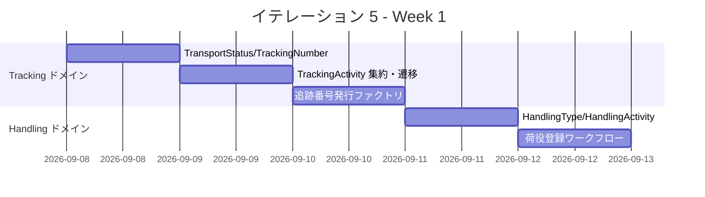
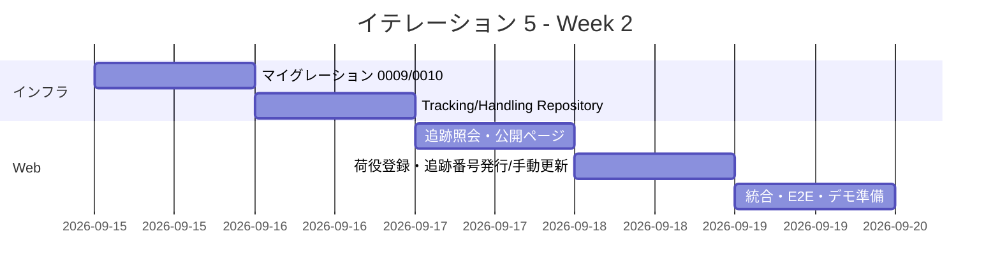
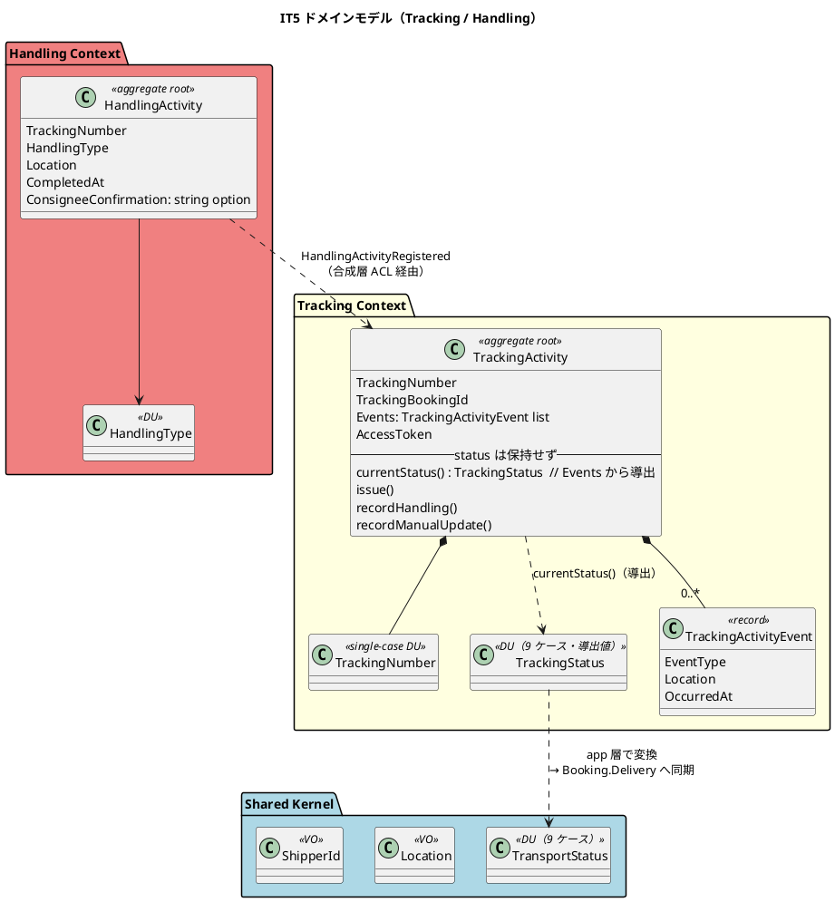
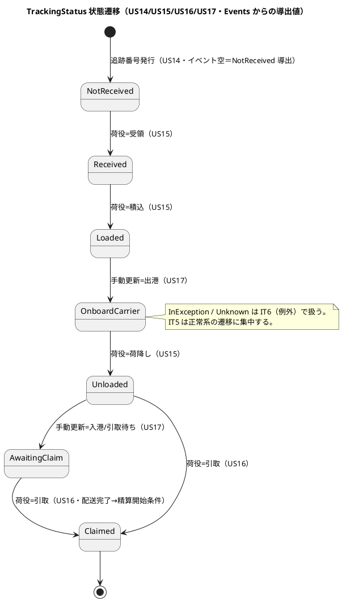
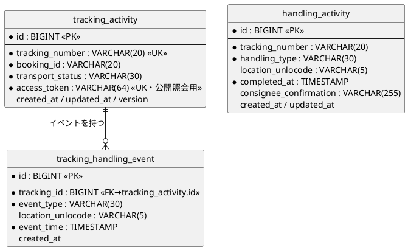
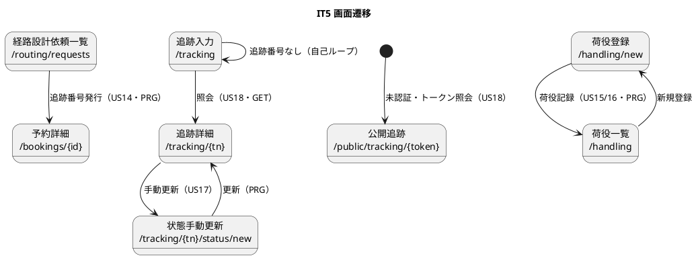

# イテレーション 5 計画

## 概要

| 項目 | 内容 |
|------|------|
| **イテレーション** | 5 |
| **期間** | Week 9-10（2 週間・2026-09-08 〜 2026-09-19 計画） |
| **ゴール** | 予約確定から追跡番号発行・荷役記録・引取・追跡照会までを一気通貫させ、Release 1.0 MVP の業務フローを完成させる（Tracking・Handling コンテキストをドメイン層から堅牢に立ち上げる） |
| **目標 SP** | 17（US14/US15/US16/US17/US18）※ 超過分はフィーチャバッファで **US17（手動更新）** を調整候補とする |

---

## ゴール

### イテレーション終了時の達成状態

1. **追跡番号の発行と受領待ち化（US14）**: 予約確定（`Confirmed`）を契機に追跡番号を一意発行し、貨物状態を `NotReceived`（受領待ち）に設定、荷主へ通知する。
2. **荷役・引取の記録と状態自動遷移（US15/US16）**: 荷役作業員が追跡番号で貨物を特定し、受領・積込・荷降し・引取を記録すると、`TrackingStatus`（イベント履歴から導出）が対応状態へ自動遷移する。
3. **追跡照会（US18・公開ページ含む）**: 荷主・荷受人が追跡番号で現在状態・位置・イベント履歴・推定到着日を照会できる。認証なしの公開追跡ページも提供する。
4. **BC 間イベント駆動の完成（retro-4 Try#1）**: `BookingEventDispatcher` の実消費（`BookingConfirmed` → 追跡番号発行、`HandlingActivityRegistered` → 追跡状態更新）を結線し、ADR-0002 の post-commit を実消費で実証する。

### 成功基準

- [ ] Tracking の `TrackingStatus`（イベント履歴からの導出値）遷移（NotReceived→Received→Loaded→OnboardCarrier→Unloaded→AwaitingClaim→Claimed）が FsCheck を含むユニットで網羅検証される
- [ ] `TrackingActivity` 集約（追跡番号一意・イベント時系列・状態導出）が `create`/遷移で保証される
- [ ] 予約確定イベントから追跡番号が自動発行され、荷役記録から状態が自動更新される（BC 間連携が統合テストでパスする）
- [ ] 「予約確定→追跡番号発行→荷役記録→追跡照会」が受け入れテストで一気通貫（Release 1.0 の E2E: US13・US15・US18）
- [ ] 公開追跡ページ（`/public/tracking/{accessToken}`）が未認証で照会でき、推測困難なトークンで保護される
- [ ] ドメイン被覆 85%／全体 80% のカバレッジゲート・ArchUnit（Tracking/Handling の BC 分離）が緑
- [ ] テストカバレッジ 80% 以上

> **アプローチ（中盤インサイドアウト IT3-IT5・最終）**: [開発戦略](./development_strategy.md#中盤-インサイドアウトit3-it5)に従い、Tracking の `TrackingStatus`（導出値）・`TrackingActivity` と Handling の `HandlingActivity` をドメイン層で FsCheck 込みに固めてから、BC 間イベント連携・永続化・Web へ展開する。IT2/IT3/IT4 で確立した ACL＝関数レコード・合成層連携・post-commit dispatch（IT4 の `RouteAssignment.applyCommand` 方式）・カバレッジゲート・ArchUnit の規律を踏襲する。IT5 完了で中盤を終え、Release 1.0 MVP を出荷する。

---

## ユーザーストーリー

### 対象ストーリー

| ID | ユーザーストーリー | SP | 優先度 |
|----|-------------------|----|----|
| US14 | 追跡番号を発行する | 2 | 必須 |
| US15 | 荷役作業を記録する | 5 | 必須 |
| US16 | 引取作業を記録する | 3 | 必須 |
| US17 | 貨物状態を手動更新する | 2 | 必須（バッファ調整候補） |
| US18 | 追跡情報を照会する | 5 | 必須 |
| **合計** | | **17** | |

### ストーリー詳細

#### US14: 追跡番号を発行する

**ストーリー**:
> 経路設計者として、確定した予約に対して一意の追跡番号を発行し、荷主に通知したい。なぜなら、荷主が追跡番号を使って輸送状況をいつでも確認できるようになるからだ。

**対応 UC**: UC12

**受入条件**:

1. 「予約確定」状態の予約に対して追跡番号を発行できる
2. 追跡番号は一意に採番される
3. 発行後、貨物状態が「受領待ち」（NotReceived）に設定される
4. 荷主に追跡番号と追跡方法をメール通知する

#### US15: 荷役作業を記録する

**ストーリー**:
> 荷役作業員として、追跡番号を入力して貨物を特定し、作業種別・日時・場所を登録したい。なぜなら、荷役作業完了が即座に貨物状態に反映され、荷主がリアルタイムで確認できるからだ。

**対応 UC**: UC13

**受入条件**:

1. 追跡番号の入力で貨物を特定できる
2. 作業種別（受領・積込・荷降し）を選択できる
3. 作業日時と作業場所（UN/LOCODE）を入力できる
4. 記録後、貨物状態が対応する状態（受領済・積込済・荷降し済）に自動更新される
5. 記録後、荷主に状態変更通知が送信される
6. 追跡番号が存在しない場合、エラーメッセージが表示される
7. 作業場所が予定ルートと異なる場合、警告が表示される

#### US16: 引取作業を記録する

**ストーリー**:
> 荷役作業員として、荷受人が貨物を引き取る際に、荷受人の確認（署名または確認コード）を取得して引取作業を記録したい。なぜなら、荷受人への正式な引き渡しを証明し、配送完了を記録できるからだ。

**対応 UC**: UC13

**受入条件**:

1. 作業種別「引取」を選択すると、荷受人確認フィールド（署名または確認コード）が表示される
2. 荷受人確認が取得されると引取作業が記録される
3. 記録後、貨物状態が「引取済」（Claimed）に更新される
4. 貨物状態「引取済」は配送完了を意味し、精算処理の開始条件となる

#### US17: 貨物状態を手動更新する（バッファ調整候補）

**ストーリー**:
> 追跡管理者として、追跡番号を指定して貨物の状態・位置・更新日時を手動で更新したい。なぜなら、荷役作業員の記録だけでは捕捉できない状態変化（出港・入港等）を追跡情報に反映できるからだ。

**対応 UC**: UC14

**受入条件**:

1. 追跡番号を指定して現在の貨物情報を確認できる
2. 新しい状態・位置・日時を入力して追跡情報を更新できる
3. 更新後、追跡イベントが履歴に記録される
4. 状態変更の種類に応じて荷主への通知が送信される

#### US18: 追跡情報を照会する

**ストーリー**:
> 荷主（または荷受人）として、追跡番号を入力して貨物の現在位置・状態・追跡イベント履歴・推定到着日を確認したい。なぜなら、輸送状況をいつでも自分で確認でき、到着準備や業務計画に役立てるからだ。

**対応 UC**: UC15

**受入条件**:

1. 追跡番号を入力して貨物情報を照会できる
2. 現在の状態・位置（港湾名）・推定到着日が表示される
3. 追跡イベント履歴（日時・場所・作業種別）が時系列で表示される
4. 追跡番号が存在しない場合、「追跡番号が見つかりません」と表示される
5. ログインなしでも追跡番号があれば照会できる

### タスク

#### 1. Tracking ドメイン拡張（インサイドアウト先行・US14/US17/US18 の中核）

| # | タスク | 見積もり | 担当 | 状態 |
|---|--------|---------|------|------|
| 1.1 | `TransportStatus`（9 ケース DU）を Shared へ配置（`toString`/`ofString`・網羅 + Error フォールバック）+ FsCheck。Tracking 固有 `TrackingStatus`（同一 9 ケース・別型）と `TrackingEventType.toStatus` を実装。`TrackingNumber`（単一ケース DU・一意採番） | 3h | - | [x] |
| 1.2 | `TrackingActivity` 集約（`TrackingNumber`・`TrackingBookingId`・`TrackingActivityEvent list`〔時系列新しい順〕）と、**状態は保持せず `currentStatus` 関数でイベント履歴から導出**。イベント追加遷移（`recordHandling`/`recordManualUpdate`）を `execute` で保証 + FsCheck（導出状態の網羅） | 4h | - | [x] |
| 1.3 | 追跡番号発行ファクトリ（`issue`・Confirmed 予約から生成・イベント空＝`NotReceived` 導出・`TrackingNumberIssued` イベント）+ ユニット | 2h | - | [x] |

**小計**: 9h（理想時間）

> **注（TrackingStatus は導出値・domain-model 準拠）**: domain-model では Tracking の状態を**保持フィールドにせず** `currentStatus` 関数で `Events` から導出する（状態の二重管理・復帰バグを構造的に排除）。Shared `TransportStatus` と Tracking 固有 `TrackingStatus` は同一 9 ケースだが**意図的に別型**とし、変換（`TrackingStatus -> TransportStatus` の網羅パターンマッチ）は**Tracking のアプリケーション層**が担い、`HandlingActivityRegistered` 処理時に Booking の `Delivery.TransportStatus` へ写像・同期する（各ドメイン層は他 BC 型を参照しない）。永続化テーブルの `transport_status` カラムはクエリ用の非正規化であり、復元時は Events から導出し直す。Booking の `BookingState` DU（IT4）とも別概念。状態遷移図は「設計」節に掲載する。

#### 2. Handling ドメイン（US15/US16）

| # | タスク | 見積もり | 担当 | 状態 |
|---|--------|---------|------|------|
| 2.1 | `HandlingType`（domain-model 準拠: `Receive` / `Load of VoyageNumber` / `Unload of VoyageNumber` / `Customs` / `Claim`。IT5 は Receive/Load/Unload/Claim を対象、Customs は次 IT）・`HandlingActivity` 集約（追跡番号・種別・場所〔Location〕・実施日時・荷受人確認〔Claim 時〕）を `create` で検証 + FsCheck | 4h | - | [x] |
| 2.2 | 荷役登録ワークフロー（`validateFor` デシジョンテーブル→`HandlingActivity.register`→`HandlingActivityRegistered` イベント）。引取（CLAIM）は荷受人確認必須。予定ルート外は Misrouted/Warning（US15 受入7）。※追跡番号での特定・永続化はタスク 3/4 で結線 | 3h | - | [x] |

**小計**: 7h（理想時間）

#### 3. BC 間イベント連携（retro-4 Try#1・ADR-0002 決着）

| # | タスク | 見積もり | 担当 | 状態 |
|---|--------|---------|------|------|
| 3.1 | **`BookingEventDispatcher` の実消費結線**: `BookingConfirmed` → Tracking の追跡番号発行（US14）を合成層で結線。dispatch 失敗のログ出力を追加（IT4 レビュー M8） | 3h | - | [x] |
| 3.2 | `HandlingActivityRegistered` → Tracking の状態自動更新（US15 受入4）を合成層 ACL で結線。BC 分離（Handling は Tracking を直接参照しない）を維持 | 3h | - | [x] |
| 3.3 | **ADR-0002 の決着**: 実装実態（Application 層 post-commit ＋ BC ローカル DU）と ADR-0002（UnitOfWork.execute ＋ Shared Payload）の三重不整合を decision で解消（案 a: ADR 改訂 + UnitOfWork.fs 整理／案 b: 実装寄せ）。ADR 起票または改訂 | 3h | - | [x] |

**小計**: 9h（理想時間）

#### 4. インフラ（追跡・荷役の永続化）

| # | タスク | 見積もり | 担当 | 状態 |
|---|--------|---------|------|------|
| 4.1 | マイグレーション 0009（`tracking_activity`〔access_token 含む〕・`tracking_handling_event`）両方言 + data-model 反映 | 3h | - | [x] |
| 4.2 | マイグレーション 0010（`handling_activity`）両方言 + data-model 反映 | 2h | - | [x] |
| 4.3 | TrackingRepository・HandlingRepository（Donald 手書き SQL・親子トランザクション・状態/イベント往復）統合テスト | 4h | - | [x] |

**小計**: 9h（理想時間）

#### 5. Web（US14/US15/US16/US17/US18・公開ページ）

| # | タスク | 見積もり | 担当 | 状態 |
|---|--------|---------|------|------|
| 5.1 | 追跡照会 `/tracking`（入力）・`/tracking/{trackingNumber}`（履歴タイムライン）+ **公開 `/public/tracking/{accessToken}`（未認証）**（US18）+ 受入テスト | 4h | - | [x] |
| 5.2 | 荷役作業登録 `/handling/new`・一覧 `/handling`（US15/US16・引取は荷受人確認欄）+ 受入テスト | 4h | - | [x] |
| 5.3 | 追跡番号発行導線（US14・経路設計依頼一覧 `/routing/requests` または予約詳細）+ 貨物状態手動更新 `/tracking/{trackingNumber}/status/new`（US17）+ 受入テスト | 3h | - | [x] |

**小計**: 11h（理想時間）

#### 6. レビュー引き継ぎの小リファクタ（任意・IT4 レビュー）

| # | タスク | 見積もり | 担当 | 状態 |
|---|--------|---------|------|------|
| 6.1 | IT4 M4: Web の「ワークフロー実行→PRG」共通ハンドラへ集約（`routingPropose`/`bookingNotify`/`bookingStateAction`）。IT4 M3: 不正遷移マトリクスの `[<Theory>]` 化 | 3h | - | [ ] |

**小計**: 3h（理想時間）

#### タスク合計

| カテゴリ | SP | 理想時間 | 状態 |
|---------|----|----|------|
| Tracking ドメイン | 4 | 9h | [x] |
| Handling ドメイン | 5 | 7h | [x] |
| BC 間イベント連携・ADR 決着 | — | 9h | [x] |
| インフラ（追跡・荷役永続化）| — | 9h | [x] |
| Web（US14-18・公開ページ）| 8 | 11h | [x] |
| 小リファクタ（IT4 M3/M4・任意）| — | 3h | [ ] |
| **合計** | **17** | **48h** | |

**1 SP あたり**: 約 2.8h（ストーリー分 48h / 17 SP）
**進捗率**: 100% (17/17 SP・US14-18 完了。task6 リファクタは任意)

> **スコープ注記（過積載）**: 17 SP は直近ベロシティ（12-14 SP）を上回る。フィーチャバッファ消費ルール（release_plan）に従い、**US17（手動更新・2 SP）を最初の切り出し候補**とする。US14/US15/US18 は Release 1.0 の E2E（US13・US15・US18）に必須のため死守。US16（引取）は精算開始条件のため次点で保持。

---

## スケジュール

### Week 1（Day 1-5）: Tracking/Handling ドメイン → 連携

| 日 | タスク |
|----|--------|
| Day 1 | 1.1 TransportStatus/TrackingNumber + FsCheck |
| Day 2 | 1.2 TrackingActivity 集約・状態遷移 |
| Day 3 | 1.3 追跡番号発行ファクトリ / 3.3 ADR-0002 決着起票 |
| Day 4 | 2.1 HandlingType/HandlingActivity |
| Day 5 | 2.2 荷役登録ワークフロー / 3.1 BookingConfirmed→発行 結線 |

### Week 2（Day 6-10）: インフラ → Web → 統合

| 日 | タスク |
|----|--------|
| Day 6 | 4.1/4.2 マイグレーション + 3.2 HandlingActivityRegistered→状態更新 |
| Day 7 | 4.3 Tracking/Handling Repository 統合テスト |
| Day 8 | 5.1 追跡照会・公開ページ（US18） |
| Day 9 | 5.2/5.3 荷役登録・追跡番号発行・手動更新（US14/15/16/17） |
| Day 10 | 統合テスト、E2E（US13・US15・US18）、バグ修正、デモ準備 |

---

## 設計

### ドメインモデル（IT5 スコープ: Tracking + Handling）

> **注（domain-model 反映・要）**: Tracking/Handling は現状プレースホルダー。実装時に `TransportStatus`（Shared）・`TrackingStatus`（Tracking 固有・導出値）を配置し、`TrackingActivity`（`currentStatus` 導出）/`HandlingActivity` の要素・遷移を domain-model の要素表へ反映する。集約フィールドは domain-model の `TrackingBookingId`・`Exceptions`（IT6）に整合させ、IT5 は Exceptions を空リストで扱う。`TrackingActivityEvent list` は `list` + 不変条件保証で実装する（`CargoItinerary` と同方針）。

### 状態遷移（IT5 スコープ: TransportStatus）

### データモデル（IT5 スコープ: tracking_activity + tracking_handling_event + handling_activity）

> **注**: `tracking_activity`・`tracking_handling_event`・`handling_activity` は data-model に定義済み。`access_token`（公開照会・推測困難）は US18 の公開ページ要件のため IT5 で追加し data-model へ反映する。BC をまたぐ参照（`booking_id`・`tracking_number`）は物理 FK を張らず業務キー保持（IT4 の leg/notification_log と同方針）。

### 画面遷移（IT5 スコープ: 追跡照会・荷役・追跡番号発行）

### ナビゲーション整合性

`/tracking`（ROLE_SHIPPER/CONSIGNEE/TRACKER）・`/handling`（ROLE_HANDLER/TRACKER）は navbar の既存プレースホルダを実画面化する。`_Layout` 相当（`Views.navMenu`）とダッシュボード（`Views.dashboard`）へロール条件付きで反映済みかを確認し、ナビ表示の検証テストを追加する。公開追跡 `/public/tracking/{accessToken}` は navbar 非掲載（未認証・URL 共有前提）。

### API 設計

| メソッド | エンドポイント | 説明 | US |
|---------|---------------|------|----|
| GET | `/tracking` | 追跡番号入力 | US18 |
| GET | `/tracking/{trackingNumber}` | 追跡詳細（履歴タイムライン） | US18 |
| GET | `/public/tracking/{accessToken}` | 公開追跡（未認証） | US18 |
| GET/POST | `/handling/new` | 荷役作業登録 | US15/US16 |
| GET | `/handling` | 荷役一覧 | US15/US17 |
| POST | `/routing/requests/{bookingId}/issue-tracking` | 追跡番号発行 | US14 |
| GET/POST | `/tracking/{trackingNumber}/status/new` | 貨物状態手動更新 | US17 |

### ADR

| ADR | タイトル | ステータス |
|-----|---------|-----------|
| ADR-0011（候補）| 予約確定→追跡番号発行の BC 連携（`BookingConfirmed` 消費・合成層 ACL） | 提案 |
| ADR-0002（改訂 or 決着）| post-commit ディスパッチの実装実態への整合（UnitOfWork.execute vs Application 層 post-commit） | 決着（タスク 3.3） |

前提とする既存 ADR: ADR-0001/0002/0003/0004/0006/0010。

---

## リスクと対策

| リスク | 影響度 | 対策 |
|--------|--------|------|
| 17 SP の過積載（ベロシティ 12-14 超過） | 高 | US17（手動更新・2 SP）をフィーチャバッファ調整候補として明示。E2E 必須の US14/15/18 を死守 |
| BC 間イベント連携の複雑化（Booking→Tracking→通知） | 高 | 合成層 ACL に連携を閉じ、各 BC は他 BC を直接参照しない。ArchUnit で BC 分離を常時緑に維持 |
| ADR-0002 の 3 IT 越し負債の一括返済 | 中 | タスク 3.3 で decision を明示（改訂 or 寄せ）。UnitOfWork.fs のデッドコード整理を含める |
| 公開追跡トークンの推測攻撃 | 中 | 十分なエントロピー（64 桁）のランダムトークン・列挙不可。認証情報は載せない |
| Tracking と Booking の状態二重管理 | 中 | `TransportStatus`（Tracking）と `BookingState`（Booking）を型で分離。Booking の `Delivery` は Tracking イベントの射影とし、正は Tracking 側 |

---

## 完了条件

### Definition of Done

- [ ] コードレビュー完了（self-review: xp-programmer / xp-tester、正式 developing-review は staging 完了後）
- [ ] ユニット・統合・アーキテクチャテストがパス
- [ ] TrackingStatus（導出値）遷移・TrackingActivity/HandlingActivity が FsCheck 含めて網羅検証
- [ ] 「予約確定→追跡番号発行→荷役記録→追跡照会」の E2E（US13・US15・US18）がパス
- [ ] BookingConfirmed→追跡番号発行、HandlingActivityRegistered→状態更新の BC 連携が統合テストでパス
- [ ] 公開追跡ページが未認証で照会でき、トークンで保護される
- [ ] カバレッジゲート（ドメイン 85%／全体 80%）が緑
- [ ] ナビゲーション整合性（/tracking・/handling の navbar/ダッシュボード反映・検証テスト）
- [ ] Fantomas クリーン・FSharpLint 警告なし・ビルド警告 0
- [ ] ドキュメント更新完了（release_plan 進捗・ADR-0011/0002・data-model 0009/0010＋access_token 反映・domain-model の Tracking/Handling 実装反映・TransportStatus/TrackingStatus を Shared/Tracking へ）
- [ ] **Release 1.0 MVP のリリース判定**（IT5 完了時出荷）

### デモ項目

1. 予約確定 → 追跡番号自動発行 → 荷主通知（US13→US14）
2. 荷役作業員による受領・積込・荷降し・引取記録と状態自動遷移（US15/US16）
3. 荷主による追跡照会（認証あり `/tracking` + 未認証 `/public/tracking/{token}`）（US18）
4. 追跡管理者による貨物状態の手動更新（US17）

---

## 更新履歴

| 日付 | 更新内容 | 更新者 |
|------|---------|--------|
| 2026-07-15 | 初版作成（US14-18・17 SP）。中盤インサイドアウト最終。Tracking/Handling 立ち上げ・BC 間イベント連携（retro-4 Try#1）・ADR-0002 決着・Release 1.0 出荷 | - |

---

## 関連ドキュメント

- [イテレーション 5 ふりかえり](./retrospective-5.md)（イテレーション完了後に作成）
- [イテレーション 4 計画](./iteration_plan-4.md) / [IT4 ふりかえり](./retrospective-4.md) / [IT4 レビュー](../review/開発成果物_IT4_review_20260715.md)
- [開発戦略](./development_strategy.md)（中盤インサイドアウト・IT3-5）
- [リリース計画](./release_plan.md)
