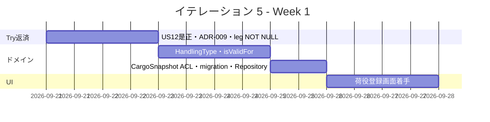
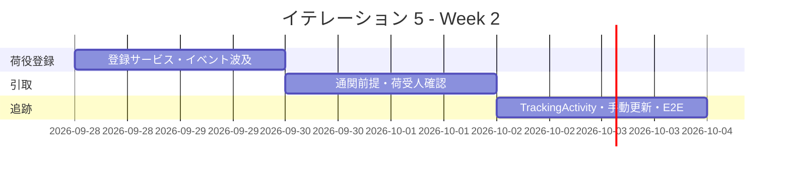
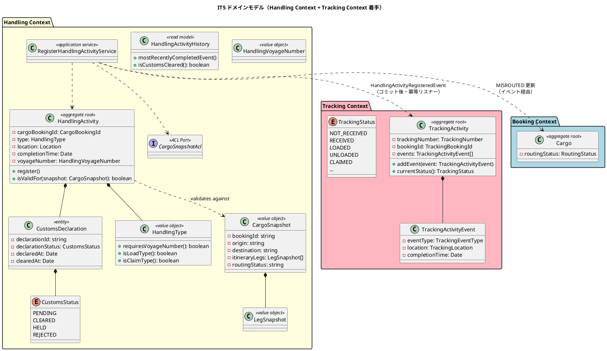
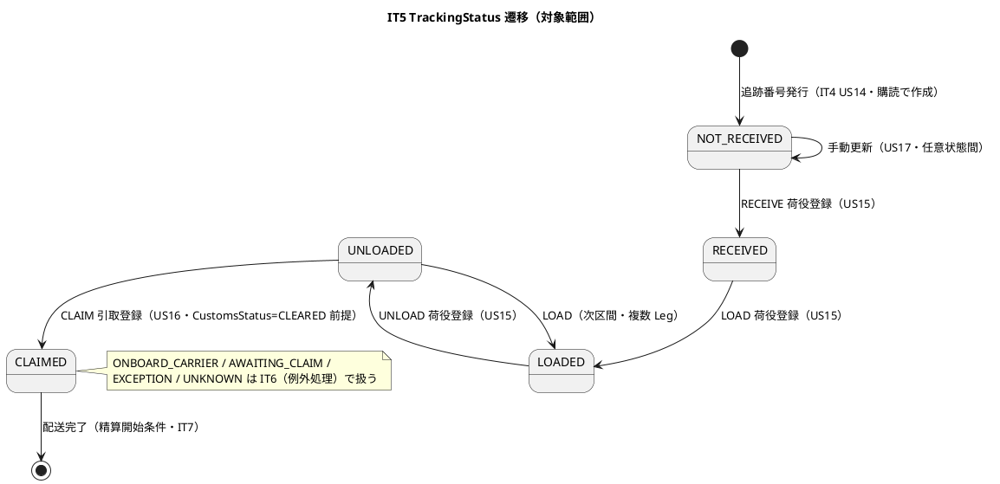
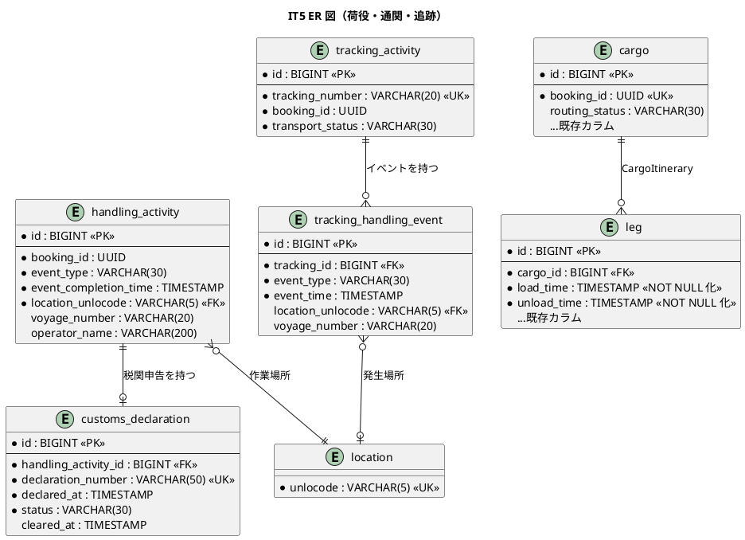
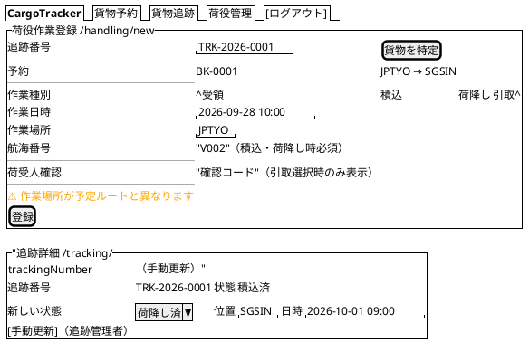
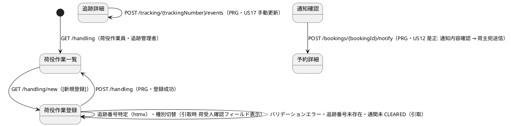

# イテレーション 5 計画

## 概要

| 項目 | 内容 |
|------|------|
| **イテレーション** | 5 |
| **期間** | 2026-09-21 〜 2026-10-04（計画 Week 9-10） |
| **局面** | 中盤（インサイドアウト） |
| **ゴール** | Handling Context の荷役妥当性検証（`isValidFor` デシジョンテーブル）をドメイン層から固め、荷役登録がイベント連携で Tracking の貨物状態と Booking の経路状態（MISROUTED）へ波及する基幹連携を完成させる |
| **目標 SP** | 10 |

---

## ゴール

### イテレーション終了時の達成状態

1. **荷役作業記録**: 荷役作業員が追跡番号で貨物を特定し、作業種別（受領・積込・荷降し）・日時・場所（UN/LOCODE）を登録できる。登録は `CargoSnapshot`（ACL 経由の貨物情報）に対する `isValidFor` デシジョンテーブルで妥当性検証され、場所不一致時は警告（RECEIVE/CLAIM）または MISROUTED 判定（LOAD/UNLOAD）となる。
2. **引取作業記録**: 作業種別「引取（CLAIM）」で荷受人確認（署名または確認コード）を取得して記録できる。通関申告が CLEARED になるまで引取は拒否される。
3. **状態波及**: 荷役登録がコミット後の `HandlingActivityRegisteredEvent` で Tracking の貨物状態（RECEIVED / LOADED / UNLOADED / CLAIMED）を自動更新し、MISROUTED 確定時は Booking の `RoutingStatus` を更新する。リスナーは冪等で、副作用の失敗はコマンド失敗として扱わない（IT4 Try T2 方針）。
4. **貨物状態手動更新**: 追跡管理者が追跡番号を指定して貨物の状態・位置・日時を手動更新でき、追跡イベントが履歴に記録され、荷主へ通知される。
5. **Tracking Context 着手**: `TrackingActivity` 集約を実装し、追跡番号発行（IT4 の `CargoRoutedEvent` 系列）に応じて `NOT_RECEIVED`（受領待ち）の追跡レコードが作成される（IT4 Try T6・ADR-008 の採番主体再配置の前段）。
6. **IT4 引き継ぎ返済**: US12 通知先の荷主（shipper）是正・通知内容確認画面、コミット後副作用の共通方針確立、`leg` 時刻 NOT NULL 化を完了する。

### 成功基準

- [ ] `US15` / `US16` / `US17` の受入基準をテストで 1:1 に確認する。
- [ ] `isValidFor` デシジョンテーブル（荷役タイプ × VoyageNumber 必須 × 場所チェック × MISROUTED 判定）を test.each の境界値テストで網羅する。
- [ ] コンテキスト間連携（`HandlingActivityRegisteredEvent`）はコミット後発行・冪等リスナーを統合テストで検証する（ADR-005・開発戦略の中盤要点）。
- [ ] 画面を伴う US は対象ロール（荷役作業員・追跡管理者）が画面操作で完結できることを E2E で確認する。
- [ ] US12 の通知先を荷主（shipper）へ是正し、通知内容確認画面を実装する（IT4 Try T1）。
- [ ] `leg.load_time` / `unload_time` の NOT NULL 化 migration を追加し、reconstruct のフォールバックを削除する（IT4 Try T3）。
- [ ] `npm run verify` が green である。
- [ ] ドメイン層カバレッジ 85% 以上、全体カバレッジ 80% 以上を維持する。

---

## ユーザーストーリー

### 対象ストーリー

| ID | ユーザーストーリー | SP | 優先度 | 対応 UC |
|----|-------------------|----|--------|---------|
| US15 | 荷役作業を記録する | 5 | 必須 | UC13 |
| US16 | 引取作業を記録する | 3 | 必須 | UC13 |
| US17 | 貨物状態を手動更新する | 2 | 中 | UC14 |
| **合計** | | **10** | | |

### ストーリー詳細

#### US15: 荷役作業を記録する

**ストーリー**:
> 荷役作業員として、追跡番号を入力して貨物を特定し、作業種別・日時・場所を登録したい。なぜなら、荷役作業完了が即座に貨物状態に反映され、荷主がリアルタイムで確認できるからだ。

**受入条件**:

1. 追跡番号の入力（またはスキャン）で貨物を特定できる。
2. 作業種別（受領・積込・荷降し）を選択できる。
3. 作業日時と作業場所（UN/LOCODE 形式の港湾コード）を入力できる。
4. 記録後、貨物状態が対応する状態（受領済・積込済・荷降し済）に自動更新される。
5. 記録後、荷主に状態変更通知が送信される。
6. 追跡番号が存在しない場合、エラーメッセージが表示される。
7. 作業場所が予定ルートと異なる場合、警告が表示される。

#### US16: 引取作業を記録する

**ストーリー**:
> 荷役作業員として、荷受人が貨物を引き取る際に、荷受人の確認（署名または確認コード）を取得して引取作業を記録したい。なぜなら、荷受人への正式な引き渡しを証明し、配送完了を記録できるからだ。

**受入条件**:

1. 作業種別「引取」を選択すると、荷受人確認フィールド（署名または確認コード）が表示される。
2. 荷受人確認が取得されると引取作業が記録される。
3. 記録後、貨物状態が「引取済」に更新される。
4. 貨物状態「引取済」は配送完了を意味し、精算処理の開始条件となる。

#### US17: 貨物状態を手動更新する

**ストーリー**:
> 追跡管理者として、追跡番号を指定して貨物の状態・位置・更新日時を手動で更新したい。なぜなら、荷役作業員の記録だけでは捕捉できない状態変化（出港・入港等）を追跡情報に反映できるからだ。

**受入条件**:

1. 追跡番号を指定して現在の貨物情報を確認できる。
2. 新しい状態・位置・日時を入力して追跡情報を更新できる。
3. 更新後、追跡イベントが履歴に記録される。
4. 状態変更の種類に応じて荷主への通知が送信される。

### タスク

#### 1. IT4 Try 返済・基盤調整（0 SP）

| # | タスク | 見積もり | 担当 | 状態 |
|---|--------|---------|------|------|
| 1.1 | US12 通知先を荷主（shipper）へ是正: 荷主メール取得 ACL（`shipper` テーブル参照）を追加し、`NotificationPort` の宛先を変更（Try T1 前半） | 4h | - | [ ] |
| 1.2 | 通知内容確認画面（経由港・所要日数・到着予定日・料金概算）を `/bookings/{bookingId}/notify` に実装（Try T1 後半） | 6h | - | [ ] |
| 1.3 | ADR-009: コミット後副作用（通知・イベント）を「コマンド失敗として扱わない」共通方針（冪等リスナー・at-least-once・アウトボックスの採否）を ADR-005 と整合させて起票・決定（Try T2。Tracking 購読着手前に完了） | 6h | - | [ ] |
| 1.4 | migration 005（先行分）: `leg.load_time` / `unload_time` の NOT NULL 化と reconstruct フォールバック削除（Try T3） | 4h | - | [ ] |

**小計**: 20h（理想時間）

#### 2. Handling ドメイン: HandlingActivity・isValidFor・DB（US15/US16 の基盤、3 SP）

| # | タスク | 見積もり | 担当 | 状態 |
|---|--------|---------|------|------|
| 2.1 | `HandlingType` 値オブジェクト（RECEIVE / LOAD / UNLOAD / CUSTOMS / CLAIM、`requiresVoyageNumber()` / `isLoadType()` / `isClaimType()`）の単体テスト | 4h | - | [ ] |
| 2.2 | `HandlingActivity` 集約（航海番号は Handling 固有型 `HandlingVoyageNumber`）と `isValidFor(snapshot)` デシジョンテーブル（受領=出発港一致/警告、積込=Leg.loadLocation 一致/MISROUTED、荷降し=Leg.unloadLocation 一致/MISROUTED、引取=目的港一致/警告）を test.each で Red-Green | 8h | - | [ ] |
| 2.3 | `CargoSnapshot` / `LegSnapshot` 値オブジェクトと Booking 参照 ACL（`CargoSnapshotAcl`: 追跡番号 → 予約・旅程スナップショット取得。Booking ドメイン型を import しない） | 6h | - | [ ] |
| 2.4 | migration 006: `handling_activity`・`customs_declaration` テーブルと `cargo.routing_status` カラム追加（注 2） | 4h | - | [ ] |
| 2.5 | HandlingActivity Repository（Testcontainers 統合テスト）と `HandlingActivityHistory` Read Model（`mostRecentlyCompletedEvent()` / `isCustomsCleared()`） | 6h | - | [ ] |

**小計**: 28h（理想時間）

#### 3. 荷役作業登録・状態波及（US15、3 SP 相当）

| # | タスク | 見積もり | 担当 | 状態 |
|---|--------|---------|------|------|
| 3.1 | `RegisterHandlingActivityService`: 追跡番号で貨物特定（未存在エラー）→ `isValidFor` 検証（警告/MISROUTED）→ 登録 → コミット後 `HandlingActivityRegisteredEvent` 発行 | 8h | - | [ ] |
| 3.2 | イベント購読（Tracking 側）: 荷役種別に応じ貨物状態を RECEIVED / LOADED / UNLOADED へ自動更新する冪等リスナー + 統合テスト（重複配信・失敗時非波及） | 8h | - | [ ] |
| 3.3 | イベント購読（Booking 側）: LOAD / UNLOAD の MISROUTED 確定時に `cargo.routing_status` を MISROUTED へ更新する冪等リスナー + 統合テスト | 4h | - | [ ] |
| 3.4 | 荷主への状態変更通知（`NotificationPort`、荷主宛先。タスク 1.1 の是正を利用） | 3h | - | [ ] |
| 3.5 | `/handling/new` 登録フォーム（作業種別・日時・UN/LOCODE・警告表示）と `/handling` 荷役履歴一覧・検索、ロール完結 E2E（荷役作業員） | 8h | - | [ ] |

**小計**: 31h（理想時間）

#### 4. 引取作業記録（US16、3 SP）

| # | タスク | 見積もり | 担当 | 状態 |
|---|--------|---------|------|------|
| 4.1 | `CustomsDeclaration` エンティティ（PENDING / CLEARED / HELD / REJECTED）と「CLEARED まで CLAIM 不可」ルールの単体テスト。`RegisterCustomsDeclarationCommand` / `UpdateCustomsStatusCommand`（スタブ ACL 経由） | 6h | - | [ ] |
| 4.2 | CLAIM 登録フロー: 作業種別「引取」選択時の荷受人確認フィールド（署名または確認コード）表示（htmx）・記録・貨物状態 CLAIMED 更新 | 6h | - | [ ] |
| 4.3 | 引取完了の精算開始条件化: CLAIMED を Billing 連携の開始点として記録（イベント発行のみ。Billing 購読は IT7） + 引取 E2E | 4h | - | [ ] |

**小計**: 16h（理想時間）

#### 5. Tracking Context 着手・手動更新（US17 + Try T6、2 SP + 基盤）

| # | タスク | 見積もり | 担当 | 状態 |
|---|--------|---------|------|------|
| 5.1 | `TrackingActivity` 集約（`TrackingNumber` / `TrackingBookingId` / `TrackingActivityEvent` / `currentStatus()`、NOT_RECEIVED 初期状態）の単体テスト、migration 007: `tracking_activity`・`tracking_handling_event` | 8h | - | [ ] |
| 5.2 | 追跡番号発行イベント購読: IT4 の追跡番号発行時に `TrackingActivity` を NOT_RECEIVED で作成する冪等リスナー（Try T6 前半。採番主体の Tracking 移行判断は注 4） | 6h | - | [ ] |
| 5.3 | `AddTrackingEventCommand`: `/tracking/{trackingNumber}` の手動更新フォーム（状態・位置・日時）・履歴記録・荷主通知・ロール完結 E2E（追跡管理者がナビ「貨物追跡」→ 追跡詳細 → 手動更新で完結）（US17） | 8h | - | [ ] |

**小計**: 22h（理想時間）

#### タスク合計

| カテゴリ | SP | 理想時間 | 状態 |
|---------|----|----------|------|
| IT4 Try 返済・基盤調整 | 0 | 20h | [ ] |
| Handling ドメイン・DB | 3 | 28h | [ ] |
| 荷役作業登録・状態波及 | 2 | 31h | [ ] |
| 引取作業記録 | 3 | 16h | [ ] |
| Tracking 着手・手動更新 | 2 | 22h | [ ] |
| **合計** | **10** | **117h** | [ ] |

**1 SP あたり**: 約 11.7h（Try 返済 20h と Tracking 基盤を含むため IT4 実績 6.9h/SP より重め。ストーリー分のみでは 97h ≒ 9.7h/SP）

---

## スケジュール

### Week 1（2026-09-21 〜 2026-09-27）

| 日 | タスク |
|----|--------|
| Day 1 | US12 荷主宛先是正・通知確認画面（Try T1） |
| Day 2 | ADR-009 決定（Try T2）、`leg` NOT NULL 化（Try T3） |
| Day 3 | `HandlingType`・`isValidFor` デシジョンテーブルの Red-Green |
| Day 4 | `isValidFor` 境界値網羅、`CargoSnapshot` ACL |
| Day 5 | migration 006・Repository / Read Model 統合テスト、荷役登録画面着手 |

### Week 2（2026-09-28 〜 2026-10-04）

| 日 | タスク |
|----|--------|
| Day 6 | `RegisterHandlingActivityService` と `/handling/new` の縦貫通（US15） |
| Day 7 | イベント購読（Tracking 状態更新・Booking MISROUTED）冪等統合テスト |
| Day 8 | `CustomsDeclaration`・CLAIM フロー（US16） |
| Day 9 | `TrackingActivity` 集約・NOT_RECEIVED 作成購読（Try T6） |
| Day 10 | 手動更新（US17）、ロール完結 E2E、`npm run verify`、設計同期 |

---

## 設計

### ドメインモデル

出典: [domain-model.md](../design/domain-model.md) Handling Context（集約・値オブジェクト・Read Model・ビジネスルール・コマンド一覧）、Tracking Context（TrackingActivity / TrackingStatus / AddTrackingEventCommand）、[development_strategy.md](development_strategy.md) 中盤 IT5 方針（isValidFor デシジョンテーブル・MISROUTED 判定・CustomsStatus 前提条件）。Handling → Booking / Tracking はイベントとスナップショット DTO を境界とし、ドメイン層のコンテキスト間直接依存は作らない（IT4 の ACL パターン踏襲）。

### 状態遷移図

出典: [domain-model.md](../design/domain-model.md) TrackingStatus（9 段階）。IT5 は荷役由来の 5 状態 + 手動更新を対象とし、例外系（EXCEPTION）は IT6。あわせて Booking Context の `RoutingStatus`（NOT_ROUTED / ROUTED / MISROUTED）が LOAD / UNLOAD の場所不一致で MISROUTED へ遷移する（domain-model.md Handling ビジネスルール 1）。

### データモデル

出典: [data-model.md](../design/data-model.md) `handling_activity`・`customs_declaration`・`tracking_activity`・`tracking_handling_event` テーブル定義。`booking_id` の BC 間参照は DB FK を張らず書き込み側で保証する方針に従う。`cargo.routing_status` は data-model.md で「将来追加予定（Routing Context 実装時）」とされているカラムを本 IT の MISROUTED 判定要件で追加する（注 2）。`leg` 時刻の NOT NULL 化は IT4 Try T3（注 3）。`tracking_exception_event` は IT6 スコープのため本 IT では作成しない。

### ユーザーインターフェース

#### ビュー

#### 画面遷移図

出典: [ui_design.md](../design/ui_design.md) 画面一覧（荷役作業登録 `/handling/new`・荷役作業一覧 `/handling`・追跡詳細 `/tracking/{trackingNumber}`）・荷役フロー遷移・PRG / htmx ガイドライン。手動更新 POST の URL と引取時の荷受人確認フィールドは ui_design.md に未定義のため本 IT で追補する（注 5）。

---

## リスクと対策

| リスク | 影響 | 対策 |
| :--- | :--- | :--- |
| Handling が Booking のドメイン型を直接参照し BC 独立性が崩れる | 高 | `CargoSnapshot` / `LegSnapshot` を Handling 固有 DTO とし ACL 経由で取得。dependency-cruiser の allowlist 更新を同一コミットで行い回帰確認する |
| イベント購読の重複配信・失敗でクロスコンテキスト状態が不整合になる | 高 | ADR-009 を Week 1 で確立してから購読実装に入る（Try T2）。冪等リスナー（処理済み判定）と「副作用失敗はコマンド失敗にしない」を統合テストで検証する |
| `isValidFor` の分岐（4 種別 × 場所一致/不一致 × Voyage 有無）でテスト漏れ | 高 | デシジョンテーブルを test.each で全行網羅し、警告と MISROUTED の区別を明示的にアサートする |
| 追跡番号発行済み貨物（IT4 以前のデータ）に TrackingActivity がなく US15 が始められない | 中 | 購読作成に加え、荷役登録時に TrackingActivity 未存在なら booking 情報から遅延作成するフォールバックを検討（Week 1 に判断） |
| 通関 ACL（税関システム）が存在せず US16 の CLEARED 前提を満たせない | 中 | `UpdateCustomsStatusCommand` はスタブ ACL（ADR-007 パターン）で駆動し、画面またはテストフィクスチャから状態変更できるようにする |
| 画面導線はあるが対象ロールで完結しない（IT3/IT4 で再発防止済みの観点） | 中 | 荷役作業員・追跡管理者それぞれ「ナビ → 一覧 → 登録/更新 → 完了確認」の E2E を DoD に含める |

---

## 注（設計への反映が必要）

1. **Handling / Tracking 実装状況注記**: domain-model.md で「IT5+ 実装予定」とされている `HandlingActivity`・`CargoHandlingActivity`（参照用）・`TrackingActivity` を本 IT で実装するため、実装状況注記を更新する。IT5 で実装しない要素（`TrackingExceptionEvent`・`Delivery`・`Money`）は IT6-7 予定として残す。あわせて新規 ACL Port `CargoSnapshotAcl` を domain-model.md の「外部システム ACL Ports」表へ追加し（IT4 の `RouteCandidateAcl` と同じ扱い）、Handling の航海番号型について domain-model.md 内の図（`VoyageNumber`）と VoyageNumber 分離設計表（`HandlingVoyageNumber`）の表記不一致を `HandlingVoyageNumber` へ統一する。
2. **cargo.routing_status**: data-model.md では「将来追加予定（Routing Context 実装時）」だが、US15 の MISROUTED 判定の書き込み先として本 IT の migration で追加する（NOT_ROUTED / ROUTED / MISROUTED、既存データは経路紐付け済みなら ROUTED で埋める）。data-model.md の表を「実装済み」へ同期する。
3. **leg 時刻 NOT NULL 化**: IT4 Try T3。data-model.md の `leg` 表の制約も NOT NULL へ同期する。
4. **追跡番号採番主体**: ADR-008 の暫定判断（Booking 側採番）は本 IT では維持し、Tracking は発行イベントの購読で `TrackingActivity` を作成する。採番主体の Tracking 移行は IT6（例外処理と合わせて）で再判断し、結論を ADR-008 の追補または ADR-009 に記録する。
5. **画面定義の追補**: 手動更新 POST（`/tracking/{trackingNumber}/events`）、引取時の荷受人確認フィールド、荷役登録の追跡番号特定（htmx）は ui_design.md に未定義のため、実装と同時に画面一覧・画面遷移図へ追補する。US12 通知確認画面（IT4 注 3 で追補済みの `/bookings/{bookingId}/notify`)は通知内容（経由港・所要日数・到着予定日・料金概算）の表示要素を追記する。
6. **共有 DB 直読の契約テスト（IT4 Try T4）**: `KyselyRouteCandidateReader` のスキーマ契約テストは本 IT のストーリーと直接関係しないため、Handling の `CargoSnapshotAcl` 実装時に同型の課題が生じた場合に合わせて対応判断する。単独では IT6 以降へ後置（スコープ外を明示）。
7. **SonarQube ローカル整備（IT4 Try T5）**: `operating-qt` によるローカル SonarQube セットアップは開発着手前（opening 期間）に実施する。完了しない場合も IT5 クローズの品質ゲートは CI（lint/typecheck/arch/test/E2E）で代替し、その旨を正直に記録する。
8. **US15 通知と HandlingActivityRegisteredEvent の関係**: 荷主への状態変更通知は Tracking 状態更新リスナーの後続処理とし、`notification_record`（IT4 新設）へ記録する。通知種別の列挙値追加を data-model.md へ同期する。
9. **優先度の典拠**: 対象ストーリー表の優先度（US17 = 中、他 = 必須）は release_plan.md の優先順位マトリックスに従う（user_story.md の「高」表記とは体系が異なる。上流 2 文書の優先度尺度統一は別途課題）。
10. **US10 経由地追加の再算出（IT4 引き継ぎ）**: 条件調整の経由地追加対応（user M2 / tester H2）は業務価値の評価が未了のため本 IT スコープ外とし、IT6 以降で判断する。
11. **通関ステータス画面との棲み分け**: IT5 の通関状態変更（`UpdateCustomsStatusCommand`）はスタブ ACL / テストフィクスチャ経由で駆動し、通関ステータス画面 `/tracking/{trackingNumber}/customs`（US19/US20）は IT6 スコープのまま実装しない。

---

## 完了条件

### Definition of Done

- [ ] `US15` / `US16` / `US17` の受入基準が単体・統合・E2E のいずれかで確認されている。
- [ ] `isValidFor` デシジョンテーブルが test.each で全行網羅されている。
- [ ] `HandlingActivityRegisteredEvent` のコミット後発行・冪等リスナー・失敗時非波及が統合テストで検証されている（ADR-009 準拠）。
- [ ] 画面を伴う US は対象ロール（荷役作業員・追跡管理者）が画面操作で完結できることを E2E で確認している（「荷役管理」「貨物追跡」メニューのロール別表示検証テストを含む）。
- [ ] 中盤最終 IT として、終盤（IT6 アウトサイドイン）移行前に `HandlingActivity` / `TrackingActivity` の完成度とベロシティをふりかえりで確認し、リリース計画の残イテレーションを再調整する（development_strategy.md 局面移行時ルール）。
- [ ] IT4 Try T1（US12 荷主宛先・通知確認画面）・T2（ADR-009）・T3（leg NOT NULL 化）が返済されている。
- [ ] `npm run verify` がパスしている。
- [ ] dependency-cruiser が green で、Handling / Tracking / Booking の BC 独立性が保たれている（新 BC の allowlist 更新を含む）。
- [ ] `data-model.md` / `domain-model.md` / `ui_design.md` の IT5 差分が実装と同期している。
- [ ] GitHub Project の IT5 Issue が開発着手時に In Progress へ更新できる状態になっている。

### デモ項目

- [ ] 荷役作業員が追跡番号で貨物を特定し、受領・積込・荷降しを登録できる。場所が予定ルートと異なる場合、警告（受領）または MISROUTED（積込・荷降し）が表示される。
- [ ] 荷役登録後、追跡詳細の貨物状態が対応する状態（受領済・積込済・荷降し済）へ自動更新され、荷主への通知記録が残る。
- [ ] 通関申告が CLEARED でない貨物の引取は拒否され、CLEARED 後に荷受人確認（確認コード）を取得して引取を記録すると貨物状態が「引取済」になる。
- [ ] 追跡管理者が追跡番号を指定して状態・位置・日時を手動更新でき、追跡イベント履歴に記録される。
- [ ] 営業担当者が通知内容（経由港・所要日数・到着予定日・料金概算）を確認してから荷主（shipper）宛に経路通知を送信できる（US12 是正）。

---

## 更新履歴

| 日付 | 変更内容 | 作成者 |
|------|----------|--------|
| 2026-07-30 | IT5 開始準備として初版作成 | Claude |
| 2026-07-30 | 詳細・横断整合性検証の指摘を反映（ナビバー標準化・`HandlingVoyageNumber` 統一・`CargoSnapshotAcl` の設計登録・注 10/11 追加・局面移行 DoD） | Claude |

## 関連ドキュメント

- [リリース計画](release_plan.md)
- [開発戦略](development_strategy.md)
- [イテレーション 4 ふりかえり](retrospective-4.md)
- [ユーザーストーリー](../requirements/user_story.md)
- [システムユースケース](../requirements/system_usecase.md)
- [ドメインモデル](../design/domain-model.md)
- [データモデル](../design/data-model.md)
- [UI 設計](../design/ui_design.md)
- [IT4 実装レビュー](../review/IT4実装_review_20260729.md)
- [ADR-005 イベント連携](../adr/005-event-emitter-context-integration.md)
- [ADR-008 経路候補 Port 境界](../adr/008-routing-candidate-port-boundary.md)
