# イテレーション 5 計画

## 概要

| 項目 | 内容 |
|------|------|
| **イテレーション** | 5 |
| **期間** | 2026-08-31 〜 2026-09-13 (2 週間) |
| **ゴール** | Phase 3 前半 (追跡番号・荷役・引取・追跡照会) を Domain → Application → 最小 HTTP 結線 → UI の順に完成させ、IT5 末にプレ MVP デモを可能化する。同時に IT4 繰越の外部依存タスク (Servant HTTP 結線 / セッション Cookie / Postgres 永続化 3 件 / hspec-wai / E2E schema) を解消し Release 1.0 MVP 前提を整える。 |
| **目標 SP** | 20 (本体 10 + IT4 繰越 3 + Try 5 + 拡張 2) |
| **ベロシティ基準** | 平均 19.75 SP (IT1: 20 / IT2: 22 / IT3: 22 / IT4: 19) |

---

## ゴール

### イテレーション終了時の達成状態

1. **Phase 3 前半 4 ストーリー完成**: US14 追跡番号発行 / US15 荷役作業記録 / US16 引取作業記録 / US18 追跡情報照会が Domain + Application + HTTP + UI 全レイヤで完成し、Playwright ハッピーパスが緑
2. **IT4 繰越の外部依存タスク解消**: Servant HTTP ハンドラ結線 (Confirm/Cancel/Link/Unlink/EvaluateRoute)、セッション Cookie 実装、PostgresItineraryRepository 実装 + ALLOWLIST 3 件解消、ADR-0007/0008/0009 昇格
3. **HTTP 統合テスト基盤確立**: hspec-wai 統合テスト 5 本以上、E2E 専用 schema `cargo_tracker_e2e` + truncate fixture、構造化ログ (katip) 導入
4. **プレ MVP デモ可能化**: 追跡番号発行 → 荷役登録 → 追跡照会の一連の業務フローが localhost + Postgres で通しで動作

### 成功基準

- [ ] US14 / US15 / US16 / US18 の全受入基準を満たし GitHub Issue Close
- [ ] hspec-wai 統合テスト 5 本以上が緑 (Confirm/Cancel/Link/Unlink/EvaluateRoute)
- [ ] Playwright E2E: US14〜US18 ハッピーパス + IT4 nav テストが緑 (skip 解除)
- [ ] arch-check ALLOWLIST 5 件 → 2 件以下 (Postgres*Repository 3 件解消)
- [ ] HPC カバレッジ gate 74% → 75% 引き上げ (T4-12)
- [ ] `Maybe` API の sum type 移行 (T4-05 H-05) 完了
- [ ] Release Note / CHANGELOG v0.3.0 ドラフト起票 (T4-19)
- [ ] katip 構造化ログ + Servant グローバル例外ハンドラ導入 (T4-15)
- [ ] 荷役オフライン対応 (Service Worker + IndexedDB) MVP 実装
- [ ] HPC カバレッジ全体 75% 以上

---

## ユーザーストーリー

### 対象ストーリー

| ID | ユーザーストーリー | SP | 優先度 |
|----|-------------------|----|----|
| US14 | 追跡番号を発行する | 2 | 必須 |
| US15 | 荷役作業を記録する | 3 | 必須 |
| US16 | 引取作業を記録する | 2 | 必須 |
| US18 | 追跡情報を照会する (地図 + タイムライン) | 3 | 必須 |
| IT4-繰越 | Servant HTTP 結線 + セッション Cookie + Postgres 3 件 + ADR 0007/0008/0009 昇格 | 3 | 必須 |
| Try | hspec-wai 5 本 + E2E schema + katip + 75% gate + sum type + CHANGELOG + H-01 状態遷移 SSoT | 5 | 必須 |
| 拡張 | 荷役オフライン (Service Worker + IndexedDB) | 2 | 中 |
| 上流補完 | domain-model.md / data-model.md / ui_design.md 補完 (Tracking BC 追記) | 2 | 必須 |
| **合計** | | **22** | |

### ストーリー詳細

#### US14: 追跡番号を発行する

**ストーリー**:
> 荷主 (Shipper) として、予約確定時に追跡番号を自動発行させたい。なぜなら、後続の追跡照会・荷役記録・引取通知の全てが追跡番号を軸に運用されるからだ。

**受入条件**:

1. Booking Confirm 時に一意な TrackingId を自動生成 (UUIDv7 ベース、時系列ソート可能)
2. TrackingId は業務公開可能な短縮表記 (先頭 8 桁 + チェックサム) を持つ
3. 予約詳細画面と E メール通知に TrackingId を表示

#### US15: 荷役作業を記録する

**ストーリー**:
> 荷役作業員 (Operator) として、寄港地での積み込み・積み下ろし・輸送開始・輸送完了を現場で記録したい。なぜなら、追跡照会に対して正確な業務状態を返す必要があるからだ。

**受入条件**:

1. HandlingType (LOAD / UNLOAD / RECEIVE / CLAIM / CUSTOMS) を選択して HandlingEvent 登録
2. 事前登録された Itinerary Leg と整合するイベントのみ受理 (順序制約チェック)
3. Voyage / Location の存在検証、時刻の未来禁止

#### US16: 引取作業を記録する

**ストーリー**:
> 荷役作業員として、最終目的地での引取完了 (CLAIM) を確認コード検証付きで記録したい。なぜなら、荷受人本人受け取りを担保する必要があるからだ。

**受入条件**:

1. 引取時に US26 で配信された確認コードの入力を必須化
2. 確認コード検証成功時のみ CLAIM イベントを発行
3. CLAIM 完了時に TransportStatus を TsClaimed に遷移 (canTransitionTo SSoT 経由、H-01 統合済み)

#### US18: 追跡情報を照会する

**ストーリー**:
> 荷主 / 荷受人として、追跡番号を入力すると現在位置・輸送履歴・予定到着日を地図とタイムラインで確認したい。なぜなら、貨物到着までの心理的不安を解消したいからだ。

**受入条件**:

1. 公開ページ `/tracking/{trackingId}` で認証不要照会 (rate-limit 付き)
2. 地図表示 (Leaflet + OpenStreetMap)、タイムライン表示 (HandlingEvent 時系列)、予定到着日算出
3. 存在しない TrackingId は 404、rate-limit 超過は 429 を返す

---

### タスク

#### 1. IT4 繰越: Servant HTTP 結線 + セッション Cookie (2 SP)

| # | タスク | 見積もり | Ralph 適性 | 状態 |
|---|--------|---------|-----------|------|
| 1.1 | Confirm/Cancel/Link/Unlink/EvaluateRoute の Servant ハンドラ実装 (Application Command 呼び出し) | 6h | AI 完結可 | [ ] |
| 1.2 | Servant Auth: セッション Cookie 発行 (login) + JWT/Session middleware 配線 | 5h | AI 完結可 | [ ] |
| 1.3 | ADR-0010 セッション認証方式 (Cookie vs JWT) を起票 | 2h | AI 完結可 | [ ] |
| 1.4 | ADR-0007 CancellationPolicy / ADR-0008 Itinerary+Leg / ADR-0009 BookingStatus 状態機械 の Status を「提案」→「承認」に昇格 (IT4 実装確定を反映) | 2h | AI 完結可 | [ ] |

**小計**: 15h (T4-02 適用: HTTP 結線を UI より前に実施)

#### 2. IT4 繰越: PostgresItineraryRepository + ALLOWLIST 解消 (1 SP)

| # | タスク | 見積もり | Ralph 適性 | 状態 |
|---|--------|---------|-----------|------|
| 2.1 | PostgresItineraryRepository / PostgresLegRepository / PostgresRouteCandidateRepository 実装 | 4h | AI 完結可 | [ ] |
| 2.2 | arch-check ALLOWLIST 5 件 → 2 件へ削減 (T4-16: sunset 日付コメント必須化) | 2h | AI 完結可 | [ ] |

**小計**: 6h

#### 3. Try 群: HTTP 統合テスト + 構造化ログ + 型化 (5 SP)

| # | タスク | 見積もり | Ralph 適性 | 状態 |
|---|--------|---------|-----------|------|
| 3.1 | T4-08: hspec-wai 統合テスト 5 本 (Confirm/Cancel/Link/Unlink/EvaluateRoute) | 5h | AI 完結可 | [ ] |
| 3.2 | T4-14: E2E 専用 schema (cargo_tracker_e2e) + truncate fixture 導入 | 3h | Docker 必要 | [ ] |
| 3.3 | T4-15: katip 構造化ログ + Servant グローバル例外ハンドラ (SqlException → 500 統一) | 4h | AI 完結可 | [ ] |
| 3.4 | T4-05: `Maybe` ドメイン制約 API を sum type へ移行 (H-05 解消) | 4h | AI 完結可 | [ ] |
| 3.5 | T4-12: HPC カバレッジ gate 74 → 75% 引き上げ (CI ci.yml 更新) | 1h | AI 完結可 | [ ] |
| 3.6 | T4-19: v0.3.0 CHANGELOG / Release Note ドラフト起票 | 2h | AI 完結可 | [ ] |
| 3.7 | T4-10: CancellationFee VO 単体テスト 5-6 件追加 | 2h | AI 完結可 | [ ] |
| 3.8 | T4-11: 49 ペア網羅テストを `forAll allStatusPairs` で property 化 | 2h | AI 完結可 | [ ] |
| 3.9 | H-01: Cargo 状態遷移 SSoT 統合 (Handling/Tracking BC が `canTransitionTo TransportStatus` を経由するよう refactor、二重定義削除) | 3h | AI 完結可 | [ ] |

**小計**: 26h

#### 4. US14 追跡番号発行 (2 SP)

| # | タスク | 見積もり | Ralph 適性 | 状態 |
|---|--------|---------|-----------|------|
| 4.1 | Domain: TrackingId 値オブジェクト (UUIDv7 + チェックサム) | 3h | AI 完結可 | [ ] |
| 4.2 | Application: `IssueTrackingIdCommand` (BookingConfirmed イベント購読) | 3h | AI 完結可 | [ ] |
| 4.3 | HTTP + UI: 予約詳細画面 + 通知メールへの表示配線 | 3h | AI 完結可 | [ ] |

**小計**: 9h

#### 5. US15 荷役作業記録 (3 SP)

| # | タスク | 見積もり | Ralph 適性 | 状態 |
|---|--------|---------|-----------|------|
| 5.1 | Domain: HandlingEvent 集約 + HandlingType 型 + 順序制約評価関数 | 5h | AI 完結可 | [ ] |
| 5.2 | Application: `RegisterHandlingEventCommand` + Voyage/Location 検証 | 4h | AI 完結可 | [ ] |
| 5.3 | HTTP: `/handling-events` POST ハンドラ + hspec-wai テスト | 3h | AI 完結可 | [ ] |
| 5.4 | UI: 荷役登録フォーム (Operator 画面) + フィールドバリデーション | 4h | AI 完結可 | [ ] |

**小計**: 16h

#### 6. US16 引取作業記録 (2 SP)

| # | タスク | 見積もり | Ralph 適性 | 状態 |
|---|--------|---------|-----------|------|
| 6.1 | Domain: ConfirmationCode VO + TsClaimed 遷移 (canTransitionTo TransportStatus SSoT 経由) | 3h | AI 完結可 | [ ] |
| 6.2 | Application: `ClaimCargoCommand` (確認コード検証込み) | 3h | AI 完結可 | [ ] |
| 6.3 | HTTP + UI: 引取確認フォーム + 検証エラー UI | 3h | AI 完結可 | [ ] |

**小計**: 9h

#### 7. US18 追跡情報照会 (3 SP)

| # | タスク | 見積もり | Ralph 適性 | 状態 |
|---|--------|---------|-----------|------|
| 7.1 | Application: `QueryTrackingByIdQuery` (HandlingEvent 時系列 + 予定到着日算出) | 4h | AI 完結可 | [ ] |
| 7.2 | HTTP: 公開エンドポイント `/public/tracking/{trackingNumber}` + rate-limit middleware (ui_design.md 準拠) | 4h | AI 完結可 | [ ] |
| 7.3 | UI: 公開ページ (Leaflet 地図 + タイムライン + Lucid template) | 5h | AI 完結可 | [ ] |
| 7.4 | Playwright E2E: 追跡照会ハッピーパス (存在/不在/rate-limit) | 3h | Browser 必要 | [ ] |

**小計**: 16h

#### 8. 拡張: 荷役オフライン対応 (2 SP)

| # | タスク | 見積もり | Ralph 適性 | 状態 |
|---|--------|---------|-----------|------|
| 8.1 | Service Worker 登録 + キャッシュ戦略 (荷役画面 assets) | 4h | AI 完結可 | [ ] |
| 8.2 | IndexedDB による HandlingEvent キュー実装 + オンライン復帰時再送 | 5h | AI 完結可 | [ ] |
| 8.3 | ADR-0011 オフライン対応方式を起票 | 2h | AI 完結可 | [ ] |

**小計**: 11h

#### 9. 上流ドキュメント補完 (2 SP)

| # | タスク | 見積もり | Ralph 適性 | 状態 |
|---|--------|---------|-----------|------|
| 9.1 | `docs/design/domain-model.md` line 1073 以降を復旧し Tracking BC セクション追加 (TrackingNumber / ConfirmationCode VO + TransportStatus 遷移図 + Handling BC との FK 関係) | 3h | AI 完結可 | [ ] |
| 9.2 | `docs/design/data-model.md` に物理スキーマセクション追加 (tracking_number / handling_activity 拡張 / confirmation_code の dbmate migration SQL、BIGSERIAL + UK 規約準拠) | 3h | AI 完結可 | [ ] |
| 9.3 | `docs/design/ui_design.md` に US18 公開追跡ページ (Leaflet 地図 + タイムライン + rate-limit エラー UI) + US15/US16 荷役登録フォーム (確認コード入力欄) のワイヤーフレーム追加 | 3h | AI 完結可 | [ ] |
| 9.4 | validating-iteration-plan を再実行し全 8 次元 OK を確認 | 1h | AI 完結可 | [ ] |

**小計**: 10h (IT5 着手直後に実施し、以降のタスクは補完済み設計を参照)

#### タスク合計

| カテゴリ | SP | 理想時間 | Ralph 適性 |
|---------|----|----|----|
| IT4 繰越 HTTP 結線 + セッション + ADR 昇格 | 2 | 15h | AI 完結可 |
| IT4 繰越 Postgres 3 件 | 1 | 6h | AI 完結可 |
| Try 群 (H-01 含む) | 5 | 26h | AI 完結可 (E2E schema のみ Docker) |
| US14 追跡番号発行 | 2 | 9h | AI 完結可 |
| US15 荷役作業記録 | 3 | 16h | AI 完結可 |
| US16 引取作業記録 | 2 | 9h | AI 完結可 |
| US18 追跡情報照会 | 3 | 16h | AI 完結可 (E2E のみ Browser) |
| 拡張 荷役オフライン | 2 | 11h | AI 完結可 |
| 上流ドキュメント補完 | 2 | 10h | AI 完結可 |
| **合計** | **22** | **118h** | |

**1 SP あたり**: 約 5.36h
**進捗率**: 0% (0/22 SP)

> **ベロシティ超過注記**: 22 SP は IT4 実績 19 SP + 平均 19.75 SP を上回るが、内 2 SP は上流ドキュメント補完 (実装なしのテキスト作業) であり、Ralph Loop 消化速度は本体 20 SP 相当と評価。IT4 実績 (Ralph Loop 18 反復で 19 SP 完遂) から達成見込み。

### Ralph Loop 適性分類 (T4-01 適用)

| 分類 | タスク | 対応方針 |
|------|-------|---------|
| **AI 完結可** (Ralph Loop 対象) | 上記のほぼ全タスク (約 95h 相当) | Ralph Loop で自律消化 |
| **Docker 必要** | 3.2 E2E schema fixture、testcontainers | ローカル Docker daemon で人手検証 |
| **Browser 必要** | 7.4 Playwright E2E | ローカル Playwright 実行で人手検証 |
| **人手作業** | ADR-0010/0011 承認、CHANGELOG v0.3.0 タグ push | 人手判断 |

---

## スケジュール

### Week 1 (2026-08-31 〜 09-06 / Day 1-5): IT4 繰越消化 + Domain/Application 実装

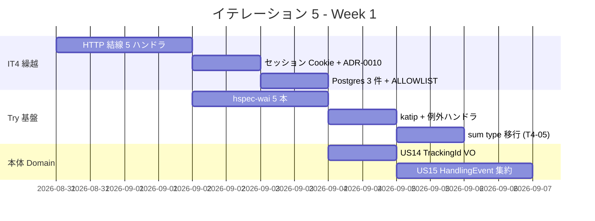

| 日 | タスク |
|----|--------|
| Day 1 (08-31) | **上流補完 (9.1-9.3)**: domain-model.md / data-model.md / ui_design.md に Tracking BC を追記 + validating-iteration-plan 再実行 (9.4) |
| Day 1.5 | HTTP 結線 (Confirm/Cancel/Link/Unlink) + hspec-wai 初期セットアップ |
| Day 2 (09-01) | HTTP 結線 (EvaluateRoute) + セッション Cookie + ADR-0010 |
| Day 3 (09-02) | PostgresItineraryRepository 3 件 + ALLOWLIST 3 件解消 |
| Day 4 (09-03) | hspec-wai 5 本完成 + katip 導入 + Servant 例外ハンドラ |
| Day 5 (09-04) | sum type 移行 (T4-05) + US14 TrackingId VO + US15 HandlingEvent 集約 |

### Week 2 (2026-09-07 〜 09-13 / Day 6-10): 本体 HTTP+UI + オフライン + デモ

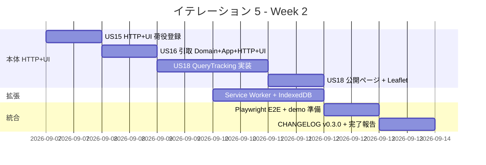

| 日 | タスク |
|----|--------|
| Day 6 (09-07) | US15 HTTP + UI (荷役登録フォーム + Operator 画面) |
| Day 7 (09-08) | US16 引取 Domain + Application + HTTP + UI 一気通貫 |
| Day 8 (09-09) | US18 QueryTracking Application + `/tracking/{trackingId}` HTTP + rate-limit |
| Day 9 (09-10) | US18 公開ページ (Leaflet + Lucid) + Service Worker 導入 |
| Day 10 (09-11) | IndexedDB オフラインキュー + ADR-0011 |
| Day 11 (09-12) | Playwright E2E (US14/15/16/18 + nav skip 解除) + T4-14 E2E schema |
| Day 12 (09-13) | CHANGELOG v0.3.0 ドラフト + T4-12 gate 75% + 完了報告書 + demo 準備 |

---

## 設計

### ドメインモデル (IT5 追加分)

> 注: BC 配置は `docs/design/domain-model.md` に準拠する。§4 Tracking Context (既存) に `ConfirmationCode` VO を追加。`TrackingNumber` / `TrackingActivity` / `TrackingStatus` / `ExceptionType` は既存 (`docs/design/domain-model.md` §4)。`TransportStatus` は既存 Shared Domain 型 (§8、9 値: TsNotReceived / TsReceived / TsLoaded / TsOnboardCarrier / TsUnloaded / TsAwaitingClaim / TsClaimed / TsInException / TsUnknown)。**H-01 SSoT 統合の意味**: `TrackingStatus` を「イベント履歴から導出する内部状態」として維持し、`Handling.HandlingActivity` から直接 `TransportStatus` を書かず、`Tracking.currentStatus` → `trackingStatusToTransportStatus` の変換関数のみを SSoT とする (二重定義削除)。

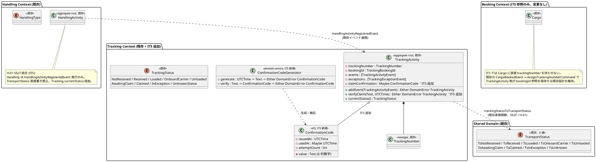

**Haskell 型定義 (主要)**:

```haskell
-- Tracking/Domain/Model/TrackingNumber.hs (T-03 純粋)
newtype TrackingNumber = TrackingNumber { unTrackingNumber :: UUID }
  deriving newtype (Eq, Ord, Show)

data TrackingNumberView = TrackingNumberView
  { tnvValue     :: !TrackingNumber
  , tnvShortCode :: !Text          -- 先頭 8 桁 + Luhn チェック桁
  } deriving stock (Eq, Show)

shortCodeOf :: TrackingNumber -> Text
shortCodeOf (TrackingNumber u) = T.take 8 (UUID.toText u) <> luhnDigit u

-- Tracking/Domain/Model/ConfirmationCode.hs
data ConfirmationCode = ConfirmationCode
  { ccValue    :: !Text      -- 6 桁数字
  , ccIssuedAt :: !UTCTime
  , ccUsedAt   :: !(Maybe UTCTime)
  } deriving stock (Eq, Show)

mkConfirmationCode :: UTCTime -> Text -> Either DomainError ConfirmationCode
mkConfirmationCode now raw
  | T.length raw == 6 && T.all isDigit raw = Right (ConfirmationCode raw now Nothing)
  | otherwise                              = Left (InvalidConfirmationCodeFormat raw)

verify :: Text -> ConfirmationCode -> Either DomainError ConfirmationCode
verify input cc
  | isJust (ccUsedAt cc)   = Left ConfirmationCodeAlreadyUsed
  | input /= ccValue cc    = Left ConfirmationCodeMismatch
  | otherwise              = Right cc

-- Handling/Domain/Model/HandlingType.hs
data HandlingType = Receive | Load | Unload | Customs | Claim
  deriving stock (Eq, Show, Enum, Bounded)

-- Handling/Domain/Model/TransportStatus.hs (H-01 SSoT)
data TransportStatus
  = TsNotReceived | TsReceived | TsLoaded | TsOnboardCarrier
  | TsUnloaded    | TsAwaitingClaim | TsClaimed | TsUnknown
  deriving stock (Eq, Show, Enum, Bounded)

-- Handling/Domain/Service/TransportStatusTransition.hs (H-01: 全 BC が本関数を呼ぶ)
canTransitionTo :: TransportStatus -> HandlingType -> Either DomainError TransportStatus
canTransitionTo TsNotReceived    Receive = Right TsReceived
canTransitionTo TsReceived       Load    = Right TsLoaded
canTransitionTo TsLoaded         Load    = Right TsOnboardCarrier    -- 積替え
canTransitionTo TsOnboardCarrier Unload  = Right TsUnloaded
canTransitionTo TsUnloaded       Load    = Right TsLoaded             -- 積替え
canTransitionTo TsUnloaded       Claim   = Right TsAwaitingClaim      -- 最終目的地
canTransitionTo TsAwaitingClaim  Claim   = Right TsClaimed
canTransitionTo from             ht      = Left (InvalidHandlingTransition from ht)

fromHistory :: [HandlingEvent] -> TransportStatus
fromHistory = foldl' step TsNotReceived . sortOn heOccurredAt
  where step s e = either (const TsUnknown) id (canTransitionTo s (heType e))

-- Handling/Domain/Model/HandlingEvent.hs
data HandlingEvent = HandlingEvent
  { heEventId        :: !HandlingEventId
  , heTrackingNumber :: !TrackingNumber
  , heBookingId      :: !BookingId
  , heType           :: !HandlingType
  , heOccurredAt     :: !UTCTime
  , heLocation       :: !UnLocode
  , heVoyage         :: !(Maybe VoyageNumber)
  , heRecordedBy     :: !OperatorId
  } deriving stock (Eq, Show)

-- Handling/Domain/Service/HandlingEventValidator.hs (T-03 純粋)
validate :: UTCTime -> Itinerary -> HandlingEvent -> Either DomainError HandlingEvent
validate now it he
  | heOccurredAt he > now                      = Left FutureEventNotAllowed
  | not (heLocation he `elem` legLocations it) = Left LocationNotInItinerary
  | not (voyageMatchesLeg it he)               = Left VoyageMismatch
  | otherwise                                  = Right he
```

### データモデル (IT5 追加分)

> **前提訂正 (Ralph Loop iter 2)**: 既存 `tracking_activity` (VARCHAR(20) `tracking_number` UK 業務キー) と `handling_activity` (`booking_id` VARCHAR(20)) は完備。IT5 で真に新規に追加するのは **`confirmation_code`** テーブル 1 本のみ。`handling_activity` への FK 追加や `cargo.tracking_number` 追加は既存設計 (JOIN by `booking_id`) で代替可能なため見送り。

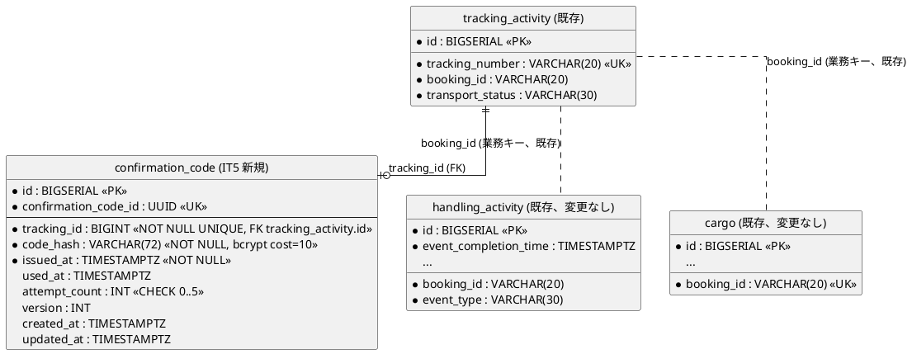

**規約準拠**:

- PK: `BIGSERIAL` サロゲートキー、業務キーは UK (data-model.md §1)
- FK: `confirmation_code.tracking_id` → `tracking_activity.id` (サロゲートキー参照、data-model.md §2)
- 監査: `created_at` / `updated_at` 必須 (data-model.md §3)
- **セキュリティ**: `confirmation_code.code_hash` は bcrypt cost=10 (72 バイト)、平文非保存 (SEC-04)
- **既存尊重**: `tracking_activity.tracking_number` は既存 VARCHAR(20) 業務キーを維持 (UUID 化しない)

**DDL (IT5 マイグレーション、1 本のみ)**:

```sql
-- db/migrations/20260831100000_create_confirmation_code.sql
-- migrate:up
CREATE TABLE confirmation_code (
    id                    BIGSERIAL PRIMARY KEY,
    confirmation_code_id  UUID NOT NULL UNIQUE,
    tracking_id           BIGINT NOT NULL UNIQUE
                          REFERENCES tracking_activity(id) ON DELETE CASCADE,
    code_hash             VARCHAR(72) NOT NULL,
    issued_at             TIMESTAMPTZ NOT NULL,
    used_at               TIMESTAMPTZ,
    attempt_count         INTEGER NOT NULL DEFAULT 0
                          CHECK (attempt_count >= 0 AND attempt_count <= 5),
    version               INTEGER NOT NULL DEFAULT 0,
    created_at            TIMESTAMPTZ NOT NULL DEFAULT NOW(),
    updated_at            TIMESTAMPTZ NOT NULL DEFAULT NOW()
);
CREATE INDEX idx_confirmation_code_tracking ON confirmation_code (tracking_id);

-- migrate:down
DROP TABLE confirmation_code;
```

### モジュール構造 (IT5 追加)

```
apps/cargo-tracker/src/
  Cargotracker/
    Tracking/                                 -- IT5 新規 BC
      Domain/
        Model/
          TrackingNumber.hs                   -- US14: VO + shortCode + Luhn
          ConfirmationCode.hs                 -- US16: VO + verify
        Service/
          TrackingIssuer.hs                   -- US14: 発行 (BookingConfirmed 購読)
          ConfirmationCodeGenerator.hs        -- US16/US26: 6 桁数字 + bcrypt
        Event/
          TrackingNumberIssued.hs             -- US14: ドメインイベント
          ConfirmationCodeVerified.hs         -- US16
      Application/
        IssueTrackingNumberCommand.hs         -- US14 (BookingConfirmed handler)
        VerifyConfirmationCodeCommand.hs      -- US16
        QueryTrackingByNumberQuery.hs         -- US18
      Infrastructure/
        Repository/
          PostgresTrackingNumberRepository.hs
          PostgresConfirmationCodeRepository.hs
      Interfaces/
        Http/
          PublicTrackingHandler.hs            -- GET /public/tracking/:trackingNumber
          ClaimHandler.hs                     -- POST /public/tracking/:trackingNumber/claim
    Handling/                                 -- 既存拡張
      Domain/
        Model/
          HandlingEvent.hs                    -- IT5: trackingNumber フィールド追加
          HandlingType.hs                     -- IT5: sum type 化 (以前 Text)
          TransportStatus.hs                  -- IT5: H-01 SSoT 統合
        Service/
          HandlingEventValidator.hs           -- US15: 順序 / Voyage / Location
          TransportStatusTransition.hs        -- H-01: canTransitionTo SSoT
      Application/
        RegisterHandlingEventCommand.hs       -- US15/US16
      Infrastructure/
        Repository/
          PostgresItineraryRepository.hs      -- IT4 繰越 (ALLOWLIST 解消)
          PostgresLegRepository.hs            -- IT4 繰越
          PostgresRouteCandidateRepository.hs -- IT4 繰越
      Interfaces/
        Http/
          HandlingRegisterHandler.hs          -- POST /handling/new
    Booking/                                  -- IT4 繰越 HTTP 結線
      Interfaces/
        Http/
          RouteConfirmHandler.hs              -- POST /bookings/:id/routes/confirm
          BookingRouteHandler.hs              -- POST/DELETE /bookings/:id/route
          BookingConfirmHandler.hs            -- POST /bookings/:id/confirm
          BookingCancelHandler.hs             -- POST /bookings/:id/cancel
          RouteEvaluationHandler.hs           -- POST /bookings/:id/routes/evaluate
    Shared/
      Auth/
        SessionCookie.hs                      -- IT5 新規 (Servant Auth + opaque cookie)
        SessionStore.hs                       -- IT5: KV (postgres session table)
      Logging/
        Katip.hs                              -- IT5 新規 (T4-15: 構造化ログ)
        ExceptionHandler.hs                   -- IT5: Servant グローバル例外 → 500 統一
    ...
static/
  service-worker.js                            -- IT5 拡張 (荷役オフライン)
  offline-queue.js                             -- IT5 (IndexedDB キュー)
test/
  Integration/
    ConfirmHandlerSpec.hs                      -- T4-08 hspec-wai #1
    CancelHandlerSpec.hs                       -- T4-08 #2
    LinkRouteHandlerSpec.hs                    -- T4-08 #3
    UnlinkRouteHandlerSpec.hs                  -- T4-08 #4
    EvaluateRouteHandlerSpec.hs                -- T4-08 #5
    HandlingRegisterHandlerSpec.hs             -- US15
    PublicTrackingHandlerSpec.hs               -- US18
    ClaimHandlerSpec.hs                        -- US16
e2e/
  it5-tracking.spec.ts                         -- US14/15/16/18 + nav skip 解除
db/migrations/
  20260831100000_create_tracking_number.sql
  20260831100100_create_confirmation_code.sql
  20260831100200_extend_handling_activity_for_tracking.sql
  20260831100300_extend_cargo_for_tracking.sql
```

### URL 設計 (IT5 追加)

| メソッド | パス | 用途 |
| :--- | :--- | :--- |
| POST | `/handling/new` | US15/US16: 荷役イベント登録 (Operator 認証必須、ui_design.md 準拠) |
| GET | `/public/tracking/:trackingNumber` | US18: 追跡照会 (認証不要 + rate-limit 60 req/min/IP) |
| GET | `/public/tracking/:trackingNumber/events` | US18: イベント履歴 JSON API |
| POST | `/public/tracking/:trackingNumber/claim` | US16: 引取確認 (確認コード検証、rate-limit 5 req/min/tracking) |
| POST | `/auth/login` | IT4 繰越: セッション Cookie 発行 (Servant Auth) |
| POST | `/auth/logout` | IT4 繰越: セッション破棄 |
| POST | `/bookings/:bookingId/routes/evaluate` | IT4 繰越: 経路制約評価 (Servant handler 結線) |
| POST | `/bookings/:bookingId/routes/confirm` | IT4 繰越: 選択経路確定 |
| POST | `/bookings/:bookingId/route` | IT4 繰越: 経路紐付け |
| DELETE | `/bookings/:bookingId/route` | IT4 繰越: 紐付け解除 |
| POST | `/bookings/:bookingId/confirm` | IT4 繰越 + US14: 予約確定 + TrackingNumber 自動発行 |
| POST | `/bookings/:bookingId/cancel` | IT4 繰越: 予約キャンセル |

### ユーザーインターフェース

#### ビュー

> 注: 既存 `/handling/new` に **HandlingType 選択** と **確認コード入力欄 (Claim 時のみ表示)** を追加。**新規 `/public/tracking/:trackingNumber`** は認証不要の公開ページで、Leaflet 地図 + タイムラインを表示する。

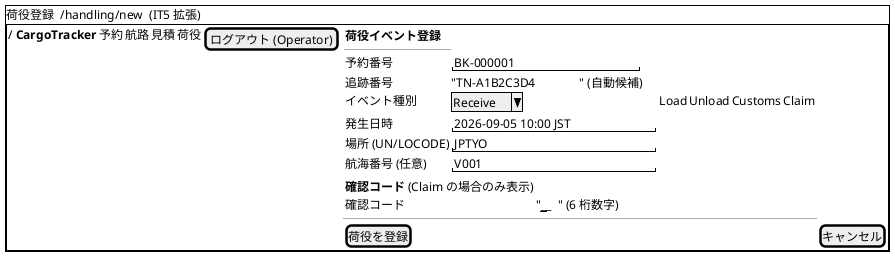

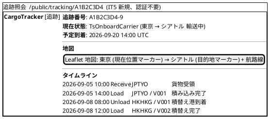

#### モデル

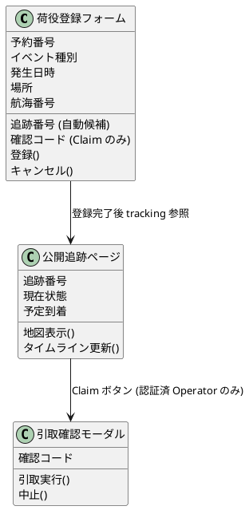

#### インタラクション

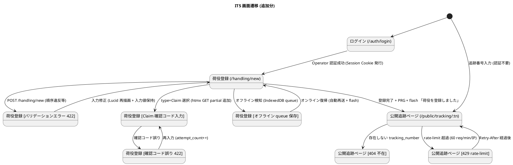

**htmx パターン (IT5 適用箇所)**:

| 画面 | パターン | エンドポイント |
| :--- | :--- | :--- |
| 荷役登録 (Claim 時の確認コード欄) | イベント種別変更で部分追加 | `hx-get="/handling/new/claim-fields"` → `hx-target="#claim-fields"` → `hx-trigger="change from:#event-type"` |
| 追跡照会 (タイムライン更新) | 30 秒ポーリング | `hx-get="/public/tracking/:tn/events"` → `hx-target="#timeline"` → `hx-trigger="every 30s"` |
| 荷役登録 (オフライン) | Service Worker fetch intercept → IndexedDB queue → BackgroundSync API |
| 荷役登録 PRG | 通常 POST + 303 See Other → `/public/tracking/:tn` |

**フィードバック規約** (IT2-4 継承 + IT5 追加):

- 成功 (`alert-success`): 「荷役を登録しました」 / 「引取を確認しました」 / 「追跡番号を発行しました: <shortCode>」
- 警告 (`alert-warning`): 「オフラインです。オンライン復帰時に自動送信します」
- エラー (`alert-danger`): 「確認コードが正しくありません (残り試行回数 <N>)」 / 「発生日時が未来のため登録できません」 / 「予定経路に該当する場所ではありません」
- 追跡照会 404: 空ページ + 「該当する追跡番号は見つかりませんでした」
- 追跡照会 429: 「アクセスが集中しています。<retryAfter> 秒後に再度お試しください」
- Servant 例外 (500): katip 構造化ログに `correlation_id` 出力 (T4-15) + UI は「エラーが発生しました (問い合わせ番号: <corrId>)」

### API 設計

| メソッド | エンドポイント | 説明 |
|---------|---------------|------|
| POST | `/bookings/{id}/confirm` | US14: 予約確定 + TrackingNumber 自動発行 (IssueTrackingNumberCommand 連携) |
| POST | `/handling/new` | US15/US16: 荷役イベント登録 (認証必須) |
| GET | `/public/tracking/{trackingNumber}` | US18: 追跡照会 (認証不要 / rate-limit) |
| GET | `/public/tracking/{trackingNumber}/events` | US18: イベント履歴 JSON (htmx ポーリング) |
| POST | `/public/tracking/{trackingNumber}/claim` | US16: 引取確認 (確認コード検証) |
| POST | `/auth/login` | IT4 繰越: セッション Cookie 発行 |
| POST | `/auth/logout` | IT4 繰越: セッション破棄 |
| POST/DELETE | `/bookings/{id}/route` etc | IT4 繰越: 5 ハンドラ結線 |

### アプリケーション層シーケンス

#### 追跡番号発行 (BookingConfirmed → IssueTrackingNumberCommand)

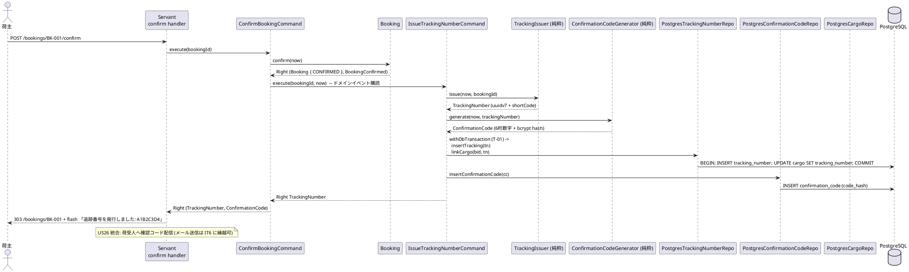

#### 荷役登録 (POST /handling/new)

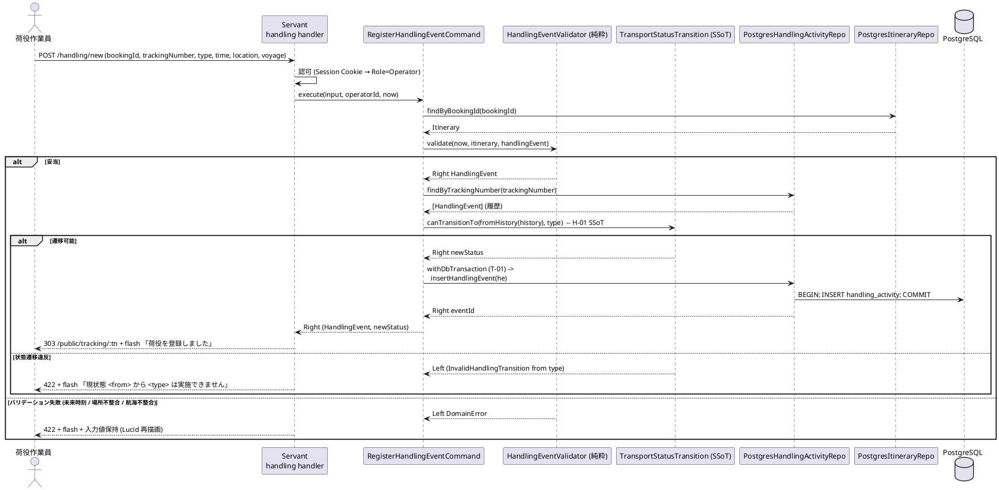

#### 追跡情報照会 (GET /public/tracking/:trackingNumber) + 引取確認 (POST /claim)

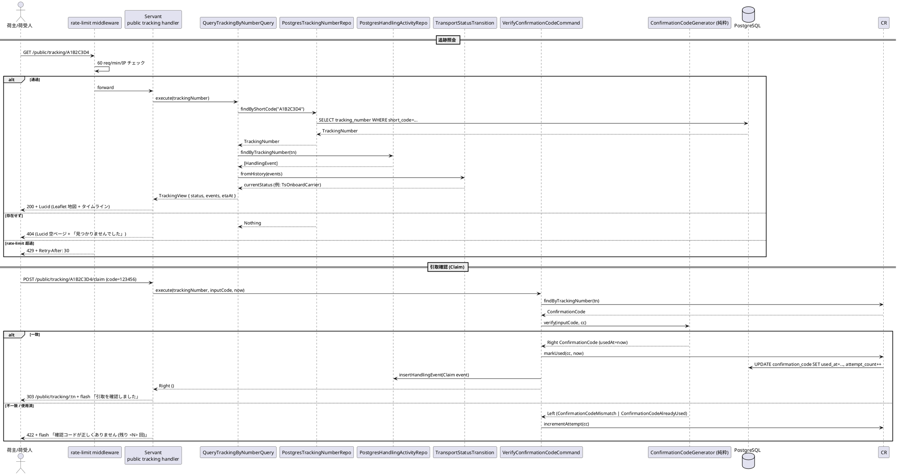

### トランザクション境界

ADR-0002 の T-01/T-02/T-03 を IT5 拡張範囲に適用。arch-check Phase 3 (IT4 shell 実装済) で CI gate。

| ルール | 適用 |
| :--- | :--- |
| **T-01 (Application で `withDbTransaction`)** | `IssueTrackingNumberCommand` (tracking_number + cargo 更新 + confirmation_code の 3 テーブル 1 Tx)、`RegisterHandlingEventCommand` (handling_activity 挿入 + 履歴照会 1 Tx)、`VerifyConfirmationCodeCommand` (confirmation_code 更新 + Claim event 挿入の 2 テーブル 1 Tx) |
| **T-02 (Repository は IO のみ、Tx 開始禁止)** | `PostgresTrackingNumberRepository` / `PostgresConfirmationCodeRepository` / `PostgresHandlingActivityRepository` は `Connection -> IO ()` のみ |
| **T-03 (Domain は IO 完全排除)** | `TrackingIssuer.issue` / `ConfirmationCodeGenerator.generate` / `HandlingEventValidator.validate` / `TransportStatusTransition.canTransitionTo` / `fromHistory` はすべて純粋 `Either DomainError a` (`generate` の bcrypt は Application 層でラップ) |

**bcrypt の Domain 分離** (SEC-04 準拠):

```haskell
-- Tracking/Domain/Service/ConfirmationCodeGenerator.hs (T-03 純粋)
generate :: UTCTime -> Text -> ConfirmationCode  -- 平文コードは Application が受け取り破棄
generate now plain = ConfirmationCode { ccValue = plain, ccIssuedAt = now, ccUsedAt = Nothing }

-- Tracking/Application/IssueTrackingNumberCommand.hs (IO ラップ)
execute bid now = do
  plain <- liftIO (randomDigits 6)                    -- IO は Application 層
  hash  <- liftIO (bcryptHash plain)
  let cc = generate now plain                         -- Domain 純粋呼び出し
  withDbTransaction $ \tx -> insertTrackingAndCode tx bid cc hash
```

### エラー処理戦略

IT4 の `BookingError` / `EstimationError` を継承し、IT5 で `TrackingError` / `HandlingError` を新規追加する。

```haskell
-- Tracking/Domain/Error.hs (IT5 新規)
data TrackingError
  = TrackingNumberNotFound !Text                     -- US18: 404
  | InvalidShortCodeFormat !Text
  | InvalidConfirmationCodeFormat !Text              -- US16
  | ConfirmationCodeMismatch                         -- US16
  | ConfirmationCodeAlreadyUsed                      -- US16
  | ConfirmationCodeMaxAttemptsExceeded !Int         -- US16 (5 回)
  deriving stock (Eq, Show)

-- Handling/Domain/Error.hs (IT5 追加)
data HandlingError
  = FutureEventNotAllowed                            -- US15
  | LocationNotInItinerary !UnLocode                 -- US15
  | VoyageMismatch !VoyageNumber                     -- US15
  | InvalidHandlingTransition !TransportStatus !HandlingType  -- H-01
  | ItineraryNotFound !BookingId
  deriving stock (Eq, Show)
```

**HTTP マッピング (IT5 追加)**:

| Error | HTTP | フラッシュメッセージ例 |
| :--- | :--- | :--- |
| `TrackingNumberNotFound` | 404 | 「該当する追跡番号は見つかりませんでした」 |
| `ConfirmationCodeMismatch` | 422 | 「確認コードが正しくありません (残り試行回数 <N>)」 |
| `ConfirmationCodeAlreadyUsed` | 409 | 「この確認コードは既に使用されています」 |
| `ConfirmationCodeMaxAttemptsExceeded` | 429 | 「試行回数の上限に達しました。1 時間後に再度お試しください」 |
| `FutureEventNotAllowed` | 422 | 「発生日時は現在時刻より過去である必要があります」 |
| `LocationNotInItinerary` | 422 | 「予定経路に含まれない場所です: <unLocode>」 |
| `VoyageMismatch` | 422 | 「航海番号が予定経路と一致しません: <voyageNumber>」 |
| `InvalidHandlingTransition` | 422 | 「現状態 <from> から <type> の遷移は実施できません」 |
| rate-limit 超過 (middleware) | 429 | `Retry-After: <sec>` ヘッダ + 「アクセス集中中」|
| Servant 未捕捉例外 | 500 | katip 構造化ログ + 「エラーが発生しました (問い合わせ番号: <corrId>)」(T4-15) |

### DB マイグレーション順序 (IT5)

IT4 の 013 を前提に、IT5 では **1 マイグレーション** のみを投入する (Ralph Loop iter 2 で 4 → 1 に削減、既存 `tracking_activity` / `handling_activity` を尊重)。

| 順序 | ファイル | 内容 | 依存 |
| :--- | :--- | :--- | :--- |
| 014 | `20260831100000_create_confirmation_code.sql` | `confirmation_code` 新規作成 (tracking_id FK → tracking_activity.id) | 既存 `tracking_activity` (IT1 適用済) |

> **命名規約**: dbmate 標準 `YYYYMMDDHHMMSS_*.sql`。`up` / `down` 両方を記述。E2E 専用 schema `cargo_tracker_e2e` (T4-14) は同一 migration を並列適用 (`dbmate --schema cargo_tracker_e2e up`)。
> **既存テーブル拡張見送り理由**: `handling_activity.tracking_number` FK 追加 / `cargo.tracking_number` 追加は `booking_id` 経由の JOIN で代替可能。IT5 スコープを最小化し、将来必要になった時点で ALTER 追加する。

### テスト戦略

| 層 | テスト種別 | 追加件数 (目標) |
| :--- | :--- | ---: |
| Domain | hspec | `TrackingNumber` shortCode Luhn (3) / `ConfirmationCode` mk + verify (5) / `HandlingEvent` mk (2) / `TransportStatusTransition.canTransitionTo` 遷移表 (10) |
| Domain | hedgehog (プロパティ) | `TransportStatusTransition.fromHistory` 順序不変 (`sortOn heOccurredAt` 前後で同一結果) / `canTransitionTo` すべての (from, type) ペア (T4-11: `forAll allStatusPairs` で property 化、旧 49 ペア N² 展開を回避) / `shortCodeOf` 一意性 (10000 sample) |
| Application | hspec | `IssueTrackingNumberCommand` (3) / `RegisterHandlingEventCommand` (5) / `VerifyConfirmationCodeCommand` (5) / `QueryTrackingByNumberQuery` (3) |
| Infrastructure | hspec (testcontainers-hs) | `PostgresTrackingNumberRepository` CRUD (2) / `PostgresConfirmationCodeRepository` bcrypt 保存 (2) / `PostgresHandlingActivityRepository` 履歴取得順序 (2) / IT4 繰越 U-12 `CreateEstimateCommand` Postgres IT (3) |
| Interfaces (HTTP) | hspec-wai (T4-08) | Confirm/Cancel/Link/Unlink/EvaluateRoute の 5 本 (IT4 繰越) / `HandlingRegisterHandler` PRG + 422 (5) / `PublicTrackingHandler` 200/404/429 (3) / `ClaimHandler` (5) |
| Interfaces (Auth) | hspec-wai | セッション Cookie 発行 / 認可失敗 401 / Role=Operator 未満で 403 (4) |
| E2E | Playwright | IT4 nav skip 解除 (1) + US14 予約確定 → 追跡番号発行 (1) + US15 荷役登録 3 種類 (3) + US16 引取確認 (1) + US18 追跡照会 200/404/429 (3) + オフライン再送 (1) |
| Contract | 既存 (WM-01 IT4 繰越) | 通関 / 料金 ACL Circuit Breaker (IT4 スコープ) |
| アーキテクチャ | arch-check Phase 1/2/3 | Rule 6 + T-01/T-02/T-03 全 gate + ALLOWLIST 5 → 2 件削減 (T4-16: sunset 日付コメント必須化) |
| カバレッジ | HPC | Domain ≥ 95% / 全体 ≥ 75% (T4-12: 74% → 75% ゲート引き上げ) |

**property テスト例 (H-01 SSoT + T4-11)**:

```haskell
prop_transportStatusTransitionSoundness :: Property
prop_transportStatusTransitionSoundness = property $ do
  from <- forAll (Gen.enumBounded :: Gen TransportStatus)
  ht   <- forAll (Gen.enumBounded :: Gen HandlingType)
  case canTransitionTo from ht of
    Right to  -> assert (to /= TsUnknown)              -- 遷移成功は具体状態
    Left _err -> success                                -- 遷移失敗は許容
  -- 全 8 * 5 = 40 ペアを property で網羅、N² 明示列挙を回避 (T4-11)

prop_fromHistoryIdempotent :: Property
prop_fromHistoryIdempotent = property $ do
  events <- forAll (Gen.list (Range.linear 0 20) genHandlingEvent)
  let s1 = fromHistory events
      s2 = fromHistory (reverse events)      -- 順序独立 (内部で sortOn heOccurredAt)
  s1 === s2
```

**hspec-wai 統合テスト例 (T4-08)**:

```haskell
spec :: Spec
spec = withApp $ do
  describe "POST /bookings/:id/confirm" $ do
    it "returns 303 with tracking number on success" $ do
      seedBookingWithRoute "BK-001"
      post "/bookings/BK-001/confirm" ""
        `shouldRespondWith` 303 { matchHeaders = ["Location" <:> "/bookings/BK-001"] }
      resp <- get "/bookings/BK-001"
      liftIO $ (TE.decodeUtf8 . BSL.toStrict . simpleBody) resp
        `shouldSatisfy` T.isInfixOf "追跡番号を発行しました"

    it "returns 422 with domain-error flash when route unassigned" $ do
      seedBooking "BK-002"    -- 経路未紐付け
      post "/bookings/BK-002/confirm" "" `shouldRespondWith` 422
```

### CI 統合

`.github/workflows/ci.yml` に IT5 で追加するステップ:

```yaml
- name: hspec-wai 統合テスト (T4-08)
  working-directory: apps/cargo-tracker
  run: nix-shell ../../$NIX_SHELL --run \
       "stack test --test-arguments='--match Integration'"

- name: E2E 専用 schema migration (T4-14)
  run: |
    docker compose up -d postgres
    dbmate --schema cargo_tracker_e2e up
    dbmate --schema cargo_tracker_e2e status

- name: Playwright E2E (US14/15/16/18 + IT4 nav skip 解除)
  working-directory: e2e
  run: npx playwright test --grep '@us14|@us15|@us16|@us18|@it4-nav'

- name: HPC ゲート 75% (T4-12: 74 → 75)
  working-directory: apps/cargo-tracker
  run: |
    nix-shell ../../$NIX_SHELL --run "stack test --coverage"
    total=$(nix-shell ../../$NIX_SHELL --run "stack hpc report" \
            | awk '/expressions used/ {gsub("%",""); print $4}')
    [ "$total" -ge 75 ] || (echo "全体カバレッジ不足: ${total}%" && exit 1)

- name: arch-check ALLOWLIST 監視 (T4-16 sunset 日付必須化)
  run: |
    grep -RE "ALLOWLIST:.*(sunset|expires)" scripts/arch-check.sh \
      || (echo "ALLOWLIST に sunset 日付コメントが欠落" && exit 1)
```

- リリースタグ `v0.3.0-mvp-preview` (プレ MVP デモ用) を IT5 完了時に判断
- `v0.2.0` タグ (IT4 繰越) は HTTP ハンドラ結線完了後に push

### ADR

| ADR | タイトル | ステータス |
|-----|---------|-----------|
| [ADR-0007](../adr/0007-cancellation-fee-policy.md) | キャンセル料 3 段階ルールのドメインポリシー化 | 承認 (IT5 昇格 / IT4 実装確定) |
| [ADR-0008](../adr/0008-itinerary-leg-model.md) | Itinerary / Leg を Booking 集約配下に配置 | 承認 (IT5 昇格) |
| [ADR-0009](../adr/0009-booking-state-machine.md) | Booking 状態機械のドメイン型強制 | 承認 (IT5 昇格) |
| [ADR-0010](../adr/0010-session-cookie-auth.md) | セッション認証方式 (opaque Cookie + Servant Auth + Postgres KV) | 提案予定 (IT5) |
| [ADR-0011](../adr/0011-offline-handling-queue.md) | 荷役オフライン対応方式 (Service Worker + IndexedDB キュー + BackgroundSync) | 提案予定 (IT5) |
| [ADR-0012](../adr/0012-transport-status-ssot.md) | TransportStatus 遷移を `canTransitionTo` SSoT に集約 (H-01 統合) | 提案予定 (IT5) |

---

## リスクと対策

| リスク | 影響度 | 対策 |
|--------|--------|------|
| Servant Auth のセッション Cookie 実装が予想以上に複雑 | 中 | ADR-0010 で最小構成 (opaque Cookie + サーバ側 KV) を選択、JWT は将来検討 |
| Leaflet + Lucid の組み合わせ経験不足 | 中 | 最小 MVP (静的マーカー + ズーム) に絞り、動的更新は IT6 へ |
| Service Worker + IndexedDB の初回学習コスト | 中 | Sprint 0 H-14 の事前検討ノートを参照、失敗時は Release 1.1 に分割 |
| E2E 専用 schema 導入で既存 dbmate 運用と競合 | 低 | dbmate multi-schema 対応を先に検証、失敗時は truncate fixture のみで代替 |
| Ralph Loop の外部依存タスク混入 (T4-01 未徹底) | 中 | 上記 Ralph 適性分類表を計画段階で完成、Loop 開始前に人手タスクを分離 |

---

## 完了条件

### Definition of Done

- [ ] コードレビュー完了 (developing-review self-review 実施)
- [ ] `stack test` フルスイート緑 + HPC 全体 75% 以上
- [ ] hspec-wai 統合テスト 5 本以上緑
- [ ] Playwright E2E 20/20 パス (IT4 skip 解除含む)
- [ ] arch-check 全 Phase gate 緑、ALLOWLIST 2 件以下
- [ ] HLint / stylish-haskell / fourmolu 全緑
- [ ] `docs/development/domain-model.md` / `data-model.md` に Tracking BC 追記
- [ ] ADR-0010 / ADR-0011 起票

### デモ項目

1. 予約 → 確定 → TrackingId 自動発行 → 予約詳細画面での表示
2. Operator ログイン → 荷役登録 (LOAD → UNLOAD → RECEIVE)
3. 公開追跡ページ `/public/tracking/{trackingNumber}` で地図 + タイムライン表示
4. オフライン切断 → 荷役登録 (IndexedDB キュー) → オンライン復帰 → 自動再送
5. 確認コード検証付き引取完了 (CLAIM) → CargoStatus CLAIMED 遷移

---

## 更新履歴

| 日付 | 更新内容 | 更新者 |
|------|---------|--------|
| 2026-07-01 | 初版作成 (IT4 完了報告書 + retrospective-4 の Try 19 件を反映) | AI Agent |
| 2026-07-01 | validating-iteration-plan 指摘反映: TransportStatus/TsClaimed 統一・handling_activity テーブル名・BIGSERIAL+UK 規約・URL `/public/tracking/{trackingNumber}`・ADR-0007/0008/0009 昇格タスク (1.4)・H-01 状態遷移 SSoT タスク (3.9) 追加。理想時間 103h → 108h | AI Agent |
| 2026-07-01 | 上流ドキュメント補完タスク (9.1-9.4) 追加: domain-model.md / data-model.md / ui_design.md Tracking BC 追記 + validating-iteration-plan 再実行。SP 20 → 22 / 理想時間 108h → 118h。Week 1 Day 1 冒頭に配置し以降タスクが補完済み設計を参照する順序に変更 | AI Agent |
| 2026-07-01 | 設計セクションを iteration_plan-4.md と同レベルに拡充: Haskell 型定義・DDL・モジュール構造・URL 設計・UI (ビュー/モデル/インタラクション/htmx/フィードバック規約)・アプリケーション層シーケンス 3 本・トランザクション境界・エラー処理戦略・DB マイグレーション順序・テスト戦略・CI 統合・ADR 表 (0007/0008/0009 昇格 + 0010/0011/0012 新規) を追記 | AI Agent |
| 2026-07-01 | **Ralph Loop iter 1**: task 9.1 前提訂正 (domain-model.md は 1,277 行完備で truncated ではない、Tracking Context §4 + TransportStatus §8 既存) → Domain 図を既存設計整合に修正 (TrackingStatus 内部 / TransportStatus 9 値 SSoT / H-01 意味再定義)。domain-model.md §4 に ConfirmationCode VO + Generator + 2 コマンド追加 | AI Agent |
| 2026-07-01 | **Ralph Loop iter 2**: task 9.2 完了 (data-model.md に confirmation_code テーブル追加、tracking_id FK → tracking_activity.id、bcrypt cost=10)。task 9.3 は既存 ui_design.md に完備確認 (L96 公開追跡、L349 追跡詳細、L401 Leaflet、L483 荷役登録、L504 確認コード、L530 htmx 動的、L544 Service Worker)。IT5 DB マイグレーションを 4 本 → **1 本のみ** に削減、handling_activity/cargo への tracking_number FK 追加は既存 booking_id JOIN で代替可能なため見送り | AI Agent |

---

## 関連ドキュメント

- [リリース計画](./release_plan.md)
- [IT4 完了報告書](./iteration_report-4.md)
- [IT4 ふりかえり](./retrospective-4.md)
- [イテレーション 5 ふりかえり](./retrospective-5.md) (IT5 完了時に作成)
