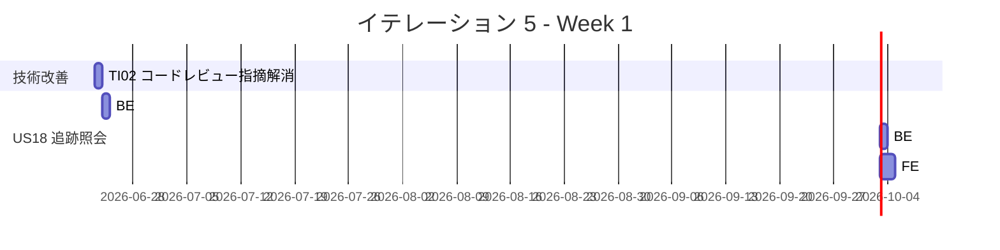
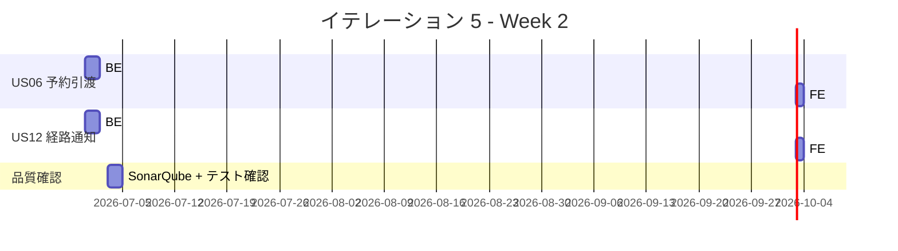
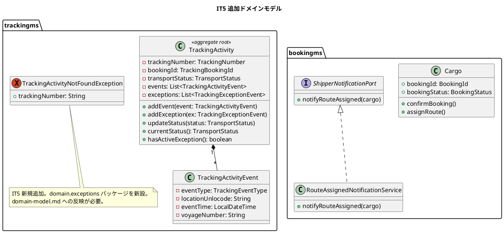
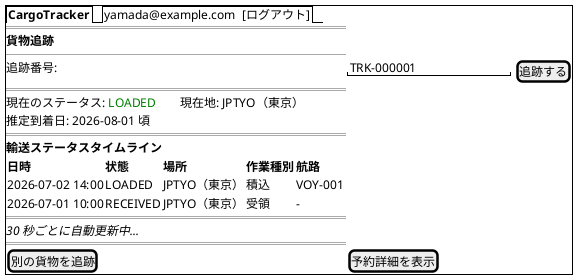
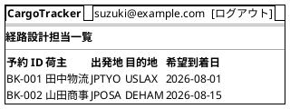
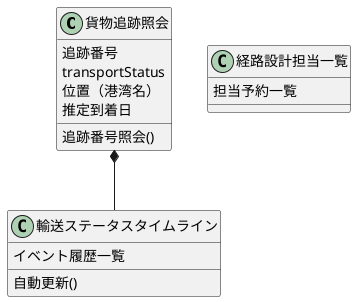
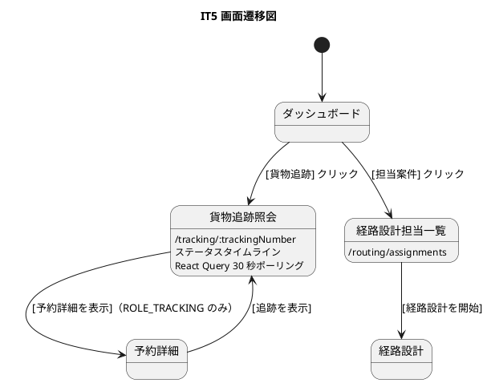

# イテレーション 5 計画

## 概要

| 項目 | 内容 |
|------|------|
| **イテレーション** | 5 |
| **期間** | Week 9-10（2026-06-23〜2026-07-04） |
| **ゴール** | 追跡照会・予約引渡・経路通知の API + 画面を実装し、IT4 コードレビュー高優先度指摘（追跡番号生成・例外クラス導入）を解消する |
| **目標 SP** | 22（US: 20 SP + 技術改善: 2 SP） |

---

## ゴール

### イテレーション終了時の達成状態

1. **追跡情報照会（US18）**: 荷主が追跡番号を入力すると現在の貨物状態とイベント履歴を確認できる API + 画面が動作する
2. **予約引渡（US06）**: bookingms が予約確定時に経路設計者へ引渡しイベントを発行し、経路設計者が担当一覧を確認できる画面が動作する
3. **経路通知（US12）**: 経路確定時に荷主へ確定経路をメール通知する stub 実装が動作する
4. **IT4 コードレビュー指摘解消（TI02）**: 追跡番号生成の一意性確保・専用例外クラス導入・エラーレスポンス統一が完了する

### 成功基準

- [ ] US18: 追跡番号で貨物の現在状態・イベント履歴を照会できる API が動作する
- [ ] US18: 荷主向け追跡照会画面が動作する
- [ ] US06: bookingms 経由で予約情報が経路設計者に引き渡される（RabbitMQ イベント or API 連携）
- [ ] US12: 経路確定時に荷主メール通知が stub 実装で動作する
- [ ] TI02: `TrackingNumber` 生成を DB SEQUENCE ベースに変更し、一意性が保証される
- [ ] TI02: `TrackingActivityNotFoundException` を導入し、文字列比較による分岐を排除する
- [ ] TI02: `TrackingNumberController` のエラー時レスポンスに `ErrorResponse` を付与する
- [ ] テストカバレッジ 80% 以上（trackingms、JaCoCo / Vitest）
- [ ] SonarQube Quality Gate PASS

---

## ユーザーストーリー

### 対象ストーリー

| ID | ユーザーストーリー | BE | FE | SP | 優先度 |
|----|-------------------|----|-----|-----|--------|
| US18 | 追跡情報を照会する | 5 | 5 | 10 | 必須 |
| US06 | 予約情報を経路設計者に引き渡す | 3 | 2 | 5 | 必須 |
| US12 | 確定経路を荷主に通知する | 3 | 2 | 5 | 必須 |
| TI02 | IT4 コードレビュー高優先度指摘解消 | 2 | 0 | 2 | 必須 |
| **合計** | | **13** | **9** | **22** | |

> **注**: 目標 SP を 22 に調整（IT4 実績 21 SP を踏まえベロシティ維持可能と判断）

### ストーリー詳細

#### US18: 追跡情報を照会する

**ストーリー**:

> 荷主（または荷受人）として、追跡番号を入力して貨物の現在位置・状態・追跡イベント履歴・推定到着日を確認したい。なぜなら、輸送状況をいつでも自分で確認でき、到着準備や業務計画に役立てるからだ。

**受入条件**:

1. 追跡番号を入力して貨物情報を照会できる
2. 現在の状態・位置（港湾名）・推定到着日が表示される
3. 追跡イベント履歴（日時・場所・作業種別）が時系列で表示される
4. 追跡番号が存在しない場合、「追跡番号が見つかりません」と表示される
5. 認証なしのリクエストは 401 エラーを返す（IT5 で実装）
6. 照会は読み取り専用であり、状態を変更しない
7. 30 秒ごとに自動更新される（`refetchInterval: 30000`）
8. 例外（ExceptionType）が存在する場合は赤色バッジで表示される

#### US06: 予約情報を経路設計者に引き渡す

**ストーリー**:

> 営業担当者として、仮受付された予約の出発地・目的地・期限・貨物仕様を確認し、経路設計者に引き渡したい。なぜなら、経路設計者が正確な情報をもとに最適な経路設計を開始できるからだ。

**受入条件**:

1. 予約番号を指定して予約情報（出発地・目的地・期限・貨物仕様）を確認できる
2. 経路設計依頼を実行すると、予約状態が「経路設計中」に更新される
3. 経路設計者に経路設計依頼の通知が送信される
4. 予約情報に不備がある場合、修正してから引き渡せる

#### US12: 確定経路を荷主に通知する

**ストーリー**:

> 営業担当者として、経路が予約に紐付けられた後、確定経路の詳細（経由港・所要日数・到着予定日）を荷主に通知したい。なぜなら、荷主が確定経路の内容を確認し、承認または変更依頼を行えるようにするからだ。

**受入条件**:

1. 予約番号を指定して紐付けられた経路情報を確認できる
2. 通知内容（経由港・所要日数・到着予定日・料金概算）を確認できる
3. 荷主への経路通知を送信できる（stub 実装：ログ出力のみ）
4. 通知送信記録が登録される

#### TI02: IT4 コードレビュー高優先度指摘解消

IT4 コードレビュー（`docs/review/it4_trackingms_review_20260509.md`）で指摘された高重要度 7 件のうち、IT5 で対応するもの:

**対応項目**:

- [H1] `TrackingNumber` 生成を DB SEQUENCE ベースに変更し一意性を保証する
- [H2] `TrackingNumber` バリデーションに `TRK-\d{6}` 正規表現チェックを追加する
- [H3] `TrackingActivityNotFoundException` を導入し文字列比較による分岐を排除する
- [H4] `TrackingNumberController` のエラー時に `ErrorResponse` を返す

**保留項目**（IT5 スコープ外、IT6 以降で対応）:

- [H5] 荷役記録成功後の追跡番号保持（フロントエンド UX 改善）
- [H6] API エラーレスポンスの具体的なメッセージ表示
- [H7] 手動状態更新の逆行遷移 UI 制限

### タスク

#### 1. TI02: IT4 コードレビュー高優先度指摘解消（2 SP）

| # | タスク | 見積もり | 担当 | 状態 |
|---|--------|---------|------|------|
| 1.1 | `TrackingActivityNotFoundException` を作成し `TrackingStatusController` の文字列分岐を置き換える | 1h | - | [ ] |
| 1.2 | `TrackingNumberService` の番号生成を DB SEQUENCE（Flyway migration）に変更する | 2h | - | [ ] |
| 1.3 | `TrackingNumber` バリデーションに正規表現チェック（`TRK-\d{6}`）を追加し、テストを更新する | 1h | - | [ ] |
| 1.4 | `TrackingNumberController` のエラー時レスポンスに `ErrorResponse` を付与する | 0.5h | - | [ ] |
| 1.5 | リグレッションテスト実施・SonarQube Quality Gate 確認 | 0.5h | - | [ ] |

**小計**: 5h（理想時間）

#### 2. US18: 追跡情報を照会する（10 SP）

| # | タスク | 見積もり | 担当 | 状態 |
|---|--------|---------|------|------|
| 2.1 | **[TDD]** `GET /api/tracking/v1/{trackingNumber}` クエリサービスを実装する（`TrackingQueryService`） | 2h | - | [ ] |
| 2.2 | **[TDD]** `TrackingStatusController` に GET エンドポイントのクエリ専用ハンドラを追加する | 1h | - | [ ] |
| 2.3 | **[TDD]** `TrackingQueryServiceTest` でドメインロジックのテストを書く | 2h | - | [ ] |
| 2.4 | **[TDD]** `TrackingStatusControllerTest` に GET テストを追加する | 1h | - | [ ] |
| 2.5 | FE: `TrackingPage.tsx` の照会画面を実装する（追跡番号入力 → 状態・履歴表示） | 3h | - | [ ] |
| 2.6 | FE: `useTracking` フックに照会用クエリを追加する（`refetchInterval: 30000`、TanStack Query） | 1h | - | [ ] |
| 2.7 | FE: 例外（ExceptionType）が存在する場合に赤色バッジを表示する | 0.5h | - | [ ] |
| 2.8 | FE: `TrackingPage.test.tsx` を作成する（正常・404・自動更新・例外バッジ） | 2h | - | [ ] |

**小計**: 12h（理想時間）

#### 3. US06: 予約情報を経路設計者に引き渡す（5 SP）

| # | タスク | 見積もり | 担当 | 状態 |
|---|--------|---------|------|------|
| 3.1 | **[TDD]** bookingms の `CargoCommandService.confirmBooking` で引渡しイベントを発行するロジックを追加する | 2h | - | [ ] |
| 3.2 | **[TDD]** 引渡しイベント用のドメインイベントクラスを作成する（`CargoAssignedForRoutingEvent`） | 1h | - | [ ] |
| 3.3 | routingms または bookingms に「経路設計担当一覧」クエリ API を追加する | 2h | - | [ ] |
| 3.4 | FE: `RoutingAssignmentPage.tsx` を作成する（担当案件一覧画面） | 2h | - | [ ] |
| 3.5 | FE: 一覧テストを追加する | 1h | - | [ ] |

**小計**: 8h（理想時間）

#### 4. US12: 確定経路を荷主に通知する（5 SP）

| # | タスク | 見積もり | 担当 | 状態 |
|---|--------|---------|------|------|
| 4.1 | **[TDD]** bookingms に通知サービスの stub インターフェース（`ShipperNotificationPort`）を作成する | 1h | - | [ ] |
| 4.2 | **[TDD]** `RouteAssignedNotificationService`（stub: ログ出力のみ）を実装する | 1h | - | [ ] |
| 4.3 | `CargoCommandService.assignRoute` で通知サービスを呼び出す | 1h | - | [ ] |
| 4.4 | 通知サービスのテストを作成する（stub 呼び出し確認） | 1h | - | [ ] |
| 4.5 | FE: `BookingDetailPage` に「通知送信済み」バッジを表示する（状態連動） | 1h | - | [ ] |
| 4.6 | FE: 通知バッジのテストを追加する | 0.5h | - | [ ] |

**小計**: 5.5h（理想時間）

#### タスク合計

| カテゴリ | SP | 理想時間 | 状態 |
|---------|----|----|------|
| TI02: IT4 コードレビュー指摘解消 | 2 | 5h | [ ] |
| US18: 追跡情報を照会する | 10 | 12h | [ ] |
| US06: 予約情報を経路設計者に引き渡す | 5 | 8h | [ ] |
| US12: 確定経路を荷主に通知する | 5 | 5.5h | [ ] |
| **合計** | **22** | **30.5h** | |

**1 SP あたり**: 約 1.4h

**進捗率**: 0% (0/22 SP)

---

## スケジュール

### Week 1（Day 1-5: 2026-06-23〜2026-06-27）



| 日 | タスク |
|----|--------|
| Day 1 | TI02: 例外クラス導入・番号生成改善・バリデーション強化（全 5 タスク） |
| Day 2 | US18 BE: `TrackingQueryService` TDD 実装 |
| Day 3 | US18 BE: コントローラー GET ハンドラ + テスト |
| Day 4 | US18 FE: `TrackingPage.tsx` + `useTracking` フック |
| Day 5 | US18 FE: `TrackingPage.test.tsx` + 動作確認 |

### Week 2（Day 6-10: 2026-06-30〜2026-07-04）



| 日 | タスク |
|----|--------|
| Day 6 | US06 BE: 引渡しイベント発行・US12 BE: 通知 stub（並行） |
| Day 7 | US06 BE: 担当一覧 API・US12 BE: テスト（並行） |
| Day 8 | US06 FE: `RoutingAssignmentPage.tsx`・US12 FE: 通知バッジ（並行） |
| Day 9 | 統合テスト・バグ修正・SonarQube 確認 |
| Day 10 | リグレッションテスト・デモ準備・IT5 完了確認 |

---

## 設計

### ドメインモデル



### データモデル（trackingms）

trackingms の DB SEQUENCE 追加（Flyway `V2__add_sequence.sql`）:

```sql
-- PostgreSQL: SEQUENCE による追跡番号の一意生成
CREATE SEQUENCE IF NOT EXISTS tracking_number_seq
    START WITH 1
    INCREMENT BY 1
    NO MAXVALUE
    CACHE 1;
```

### API 設計

#### trackingms（追加・変更）

| メソッド | エンドポイント | 説明 | 変更種別 |
|---------|---------------|------|---------|
| GET | `/api/tracking/v1/{trackingNumber}` | 追跡情報照会（状態・履歴） | 既存（クエリ専用ハンドラ追加） |
| POST | `/api/tracking/v1/numbers` | 追跡番号発行 | 既存（番号生成ロジック改善） |

#### bookingms（追加）

| メソッド | エンドポイント | 説明 | 変更種別 |
|---------|---------------|------|---------|
| GET | `/api/booking/v1/routing-assignments` | 経路設計担当一覧照会 | 新規 |

### ユーザーインターフェース

#### ビュー

##### 追跡照会画面（US18: `/tracking/:trackingNumber`）

ui-design.md 「貨物追跡照会」仕様に準拠。



##### 経路設計担当一覧画面（US06）



#### モデル



#### インタラクション



### ディレクトリ構成

```
apps/backend/trackingms/src/main/java/com/example/trackingms/
├── application/internal/
│   ├── commandservices/
│   │   └── ...（既存）
│   └── queryservices/
│       └── TrackingQueryService.java         ← 新規
├── domain/
│   ├── model/...（既存）
│   └── exceptions/
│       └── TrackingActivityNotFoundException.java  ← 新規（TI02）
└── interfaces/rest/
    └── TrackingStatusController.java         ← 変更（TI02 + US18）

apps/backend/bookingms/src/main/java/com/example/bookingms/
├── application/internal/commandservices/
│   └── CargoCommandService.java              ← 変更（US06/US12）
├── domain/ports/
│   └── ShipperNotificationPort.java          ← 新規（US12）
└── infrastructure/notifications/
    └── RouteAssignedNotificationService.java ← 新規（US12 stub）

apps/frontend/src/
├── pages/
│   ├── TrackingPage.tsx                      ← 新規（US18）
│   └── RoutingAssignmentPage.tsx             ← 新規（US06）
└── features/tracking/
    └── hooks/useTracking.ts                  ← 変更（US18 照会追加）
```

### ADR

| ADR | タイトル | ステータス |
|-----|---------|--------------|
| - | IT5 での設計変更は既存 ADR の範囲内（追加 ADR 不要） | - |

---

## リスクと対策

| リスク | 影響度 | 対策 |
|--------|--------|------|
| US06 の RabbitMQ イベント連携でマイクロサービス間通信が複雑化する | 中 | IT2 で確立した `CargoRoutedEvent` パターンを踏襲。bookingms → routingms の既存 MQ 疎通を参考にする |
| DB SEQUENCE への変更（TI02）で既存テストが失敗する可能性がある | 低 | H2 テスト用の `application.yml` で `H2` の SEQUENCE 構文を確認し、必要なら SQL を分岐する |
| US12 の通知 stub が将来の実装と乖離する | 低 | `ShipperNotificationPort` インターフェースを定義して実装を差し替え可能にする（Open/Closed 原則） |

---

## 完了条件

### Definition of Done

- [ ] 全ユニットテスト・統合テストがパス（Backend: JUnit 5, Frontend: Vitest）
- [ ] SonarQube Quality Gate PASS（new_violations: 0）
- [ ] テストカバレッジ 80% 以上（JaCoCo / Vitest）
- [ ] TI02 の高優先度指摘 4 件が解消されている（文字列比較分岐の排除・SEQUENCE ベース番号生成）
- [ ] US18 の追跡照会画面がローカルで動作確認済み
- [ ] US06 の引渡しイベントが bookingms 経由で発行・受信できる
- [ ] US12 の通知 stub が経路確定時に実行される

### デモ項目

1. 予約詳細画面から追跡番号を発行し、追跡照会画面で状態・履歴を確認できることを示す（US14→US18 シナリオ）
2. 荷役記録後に追跡照会で状態が更新されていることを確認する（US15→US18 シナリオ）
3. 経路設計担当一覧に予約が表示されることを確認する（US06）
4. 追跡番号生成が一意であることを確認する（TI02: TRK-000001, TRK-000002...）

---

## 更新履歴

| 日付 | 更新内容 | 更新者 |
|------|---------|--------|
| 2026-05-09 | 初版作成（IT5 計画） | - |
| 2026-05-09 | 整合性検証による修正: US18/US06/US12 ストーリー文・受入条件・アクターを user_story.md に合わせて修正。ドメインモデルを domain-model.md 準拠に修正（TransportStatus/exceptions）。UI にビュー・モデル・インタラクションを追加。関連ドキュメントを追加 | - |

---

## 関連ドキュメント

- [イテレーション 5 ふりかえり](./retrospective-5.md)
- [リリース計画](./release_plan.md)
- [IT4 コードレビュー結果](../review/it4_trackingms_review_20260509.md)
- [ユーザーストーリー](../requirements/user_story.md)
- [ドメインモデル設計](../design/domain-model.md)
- [データモデル設計](../design/data-model.md)
- [UI 設計](../design/ui-design.md)
