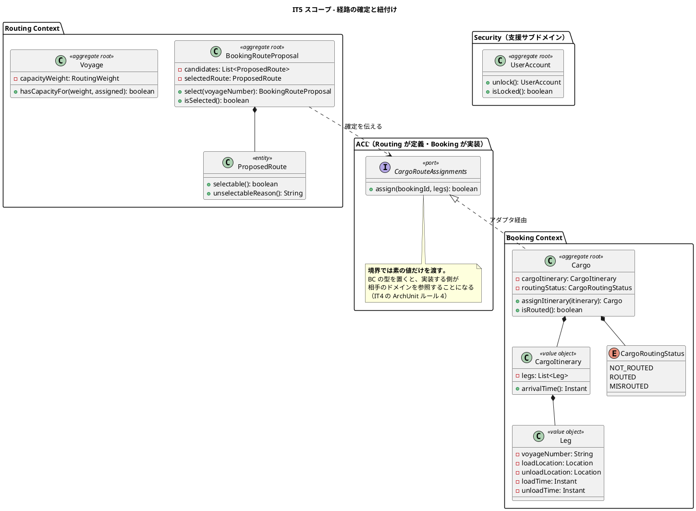
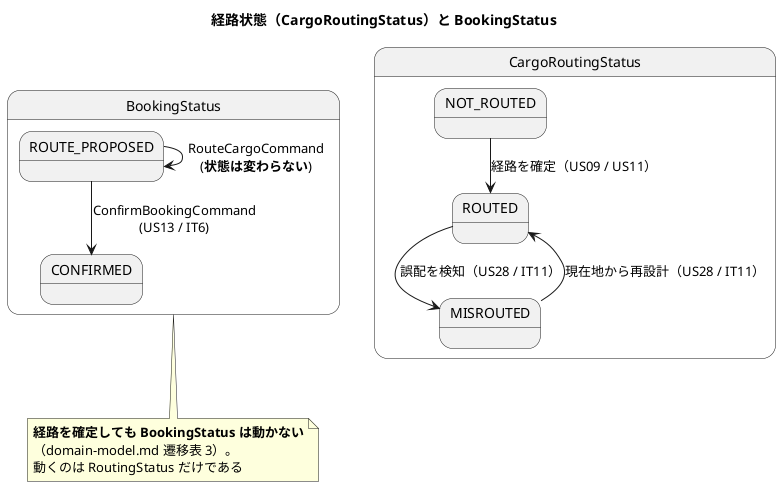
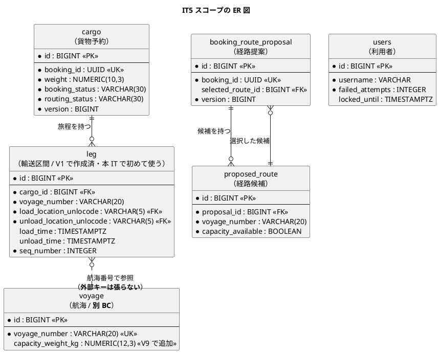
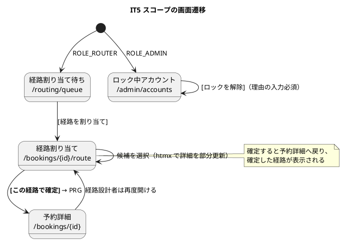

# イテレーション 5 計画

## ゴール

**算出した候補から経路を 1 件選んで確定し、予約に紐付けられるようにする。**
あわせて、ロックされたアカウントを管理者が解除できるようにする（US33 の期限）。

| 項目 | 内容 |
| :--- | :--- |
| リリース | Release 0.2（経路設計・予約確定） |
| 局面 | **中盤（インサイドアウト）** — `development_strategy.md` |
| 計画 SP | 7 |
| 前提 | IT4 完了（経路候補の算出。確定の入力が揃っている） |

**本 IT で Release 0.2 が完成する。** 予約 → 引き渡し → 候補算出 → 確定 → 紐付けが
一本つながり、IT6 の「予約確定・追跡番号・荷役」へ進める状態になる。

**確定は 2 つの BC にまたがる書き込みである。** 経路提案（Routing）が選択を記録し、
貨物予約（Booking）が旅程と経路状態を持つ。IT4 で ArchUnit に捕まった
「境界で BC の型を使わない」を、今度は**書き込み方向**で守る。

---

## 前イテレーションからの引き継ぎ

IT4 のふりかえり（[retrospective-4.md](retrospective-4.md)）の Try と持ち越しを、本計画の
タスク・成功基準・DoD に落とし込む。

### Try の反映

| Try | 本計画での扱い |
| :--- | :--- |
| T1 **新しい集約を作るときは、既存集約の同じ操作を先に読む** | **タスク 2-0 として明示。** `Cargo` に旅程を持たせる前に、`Shipper`・`Voyage`・`BookingRouteProposal` の保存・更新・読み戻しを読み、楽観的ロックと読み戻しで落ちる値を確認する |
| T2 **画面を追加ロールへ開放する変更では、テンプレートの `th:href` を数える** | **DoD に追加。** 本 IT は ROLE_ADMIN に新しい画面を開く。**元からあるボタンも数える** |
| T3 **「壊して赤」を読み戻しにも適用する** | **DoD に追加。** 旅程・経路状態・空き容量は、保存だけでなく**読み戻したときにも装置が働くか**を確認する |
| T4 **依存の更新をイテレーション開始時に置く** | **タスク 0-0 として先頭に置く**（`--write-locks` → Trivy）。クローズ直前に出ると CI が赤のままクローズに入りかける |
| T5 返済枠を最初から時間で確保する | **タスク 0 として 8 時間確保** |
| T6 **クローズ前に業務担当者の 1 日をなぞる** | **DoD に追加。** 経路設計者と管理者の 2 人分 |

### 持ち越しの返済枠

| # | 内容 | 本計画での扱い |
| :--- | :--- | :--- |
| C1 | **空き容量の判定**（`voyage` の容量と「満船の便は選べない」テスト） | **US09 のタスクに含める**（返済枠ではない）。**経路が確定して初めて容量が減る**ため、確定を実装する本 IT が初めて「壊して赤にできる」イテレーションである |
| C2 | 同じ港を 2 回通る航海での乗船地の選び方 | **タスク 0-1**（返済枠） |
| C3 | 経路候補を開いた時点で自動算出するか | **タスク 0-2 で判断のみ**（実装しない場合は理由を記録する） |
| C4 | US33（ロック解除） | **本 IT の対象**（期限） |
| C5 | 並行操作の画面レベル検証の方法を決める | **タスク 0-3**（方法の決定まで。実装は次 IT でよい） |
| C6 | US34（荷主セルフサービス） | 本 IT では対応しない。IT9 |

---

## ユーザーストーリー

### 対象ストーリー

| ID | ユーザーストーリー | SP | 優先度 | Issue |
| :--- | :--- | :--- | :--- | :--- |
| US09 | 経路を選択・確定する | 3 | 必須 | [#489](https://github.com/k2works/case-study-cargo-tracker/issues/489) |
| US11 | 経路情報を予約に紐付ける | 2 | 必須 | [#490](https://github.com/k2works/case-study-cargo-tracker/issues/490) |
| US33 | ロックされたアカウントを解除する | 2 | 必須 | [#507](https://github.com/k2works/case-study-cargo-tracker/issues/507) |
| | **合計** | **7** | | |

### 受入基準

受入基準の正典は [ユーザーストーリー](../requirements/user_story.md) である。**本計画に書き写さず引用する。**

- US09: [US09 の受入基準](../requirements/user_story.md#us09-経路を選択確定する)
- US11: [US11 の受入基準](../requirements/user_story.md#us11-経路情報を予約に紐付ける)
- US33: [US33 の受入基準](../requirements/user_story.md#us33-ロックされたアカウントを解除する)

### 受入基準のうち本 IT で満たさないもの

| 内容 | 扱い | 理由 |
| :--- | :--- | :--- |
| US09「最適な候補がない場合、経路条件調整（US10）に進める」 | **US10（IT8）へ。** 本 IT では候補ゼロ・期限超過の状態表示までとし、**「条件を変えて探し直す機能は今後の提供」と画面に明記**する（IT4 と同じ扱い） | 条件の緩和は US10 のスコープ。**出せない機能を空のボタンで匂わせない** |

---

## 設計への反映が必要（当該 IT で対応）

計画作成時の突合で見つかった、**設計ドキュメント・スキーマ側の欠落**である。

| # | 内容 | 対応 |
| :--- | :--- | :--- |
| 1 | **US33 に画面が無い。** `ui_design.md` の画面一覧・navbar に管理系の画面が 1 つも無く、**ロック中のアカウント一覧も解除フォームも定義されていない** | **タスク 4-1・5-1。** `/admin/accounts`（ロック中一覧）を新設し、画面一覧・navbar・画面遷移図に追加する |
| 2 | **`admin` の利用者が seed に存在しない。** `Role.ADMIN` は実装にあり `non_functional.md` の RBAC 表（正典）にも「全画面」とあるが、**ログインできる管理者が 1 人もいない** | **タスク 1-1。** `db/seed` に追加する。**IT3 の「港マスタが空」と同型**であり、機能を作っても誰も実行できない |
| 3 | **`RoutingStatus` の所有が矛盾している。** ADR-005 と `domain-model.md` は「Routing Context が所有」と書きながら、Booking の `Delivery` が `routingStatus` を持ち `cargo.routing_status` の列もある | **タスク 2-1 と 5-1。** Booking 側に**自前の列挙型**（`CargoRoutingStatus`）を置く。`RoutingCargoType` と同じ扱いであり、値は同じでも「経路提案の状態」と「貨物の経路状態」は別の事実である。`domain-model.md` に注記する |
| 4 | **`voyage` に容量が無い**（IT4 から持ち越し。レビュー M2） | **タスク 3-1。** `V9` で `capacity_weight_kg` を追加する。**確定済みの経路が積んだ重量の合計**と比べて空きを判定する |
| 5 | **確定は Routing と Booking の両方に書き込む。** 提案の `selected_route_id` は Routing、旅程と経路状態は Booking である | **タスク 2-3・3-3。** ACL ポートを Routing 側に定義し、アダプタを Booking 側に実装する。**境界では素の値だけを渡す**（IT4 で ArchUnit に捕まった形を繰り返さない） |
| 6 | `leg` テーブルは V1 で作成済みだが**未使用**である | 本 IT が最初の利用者になる（新規マイグレーション不要） |
| 7 | **`data-model.md` は `leg.voyage_number` を「`FK → voyage.voyage_number`」と書いているが、実 DDL に外部キーは無い。** しかも同じ文書が「BC をまたぐ参照に DB 外部キーを設けない」と定めており、`voyage` は Routing Context である | **タスク 5-1 で `data-model.md` を修正する。** 実装（DDL）が正しく、記述が誤っている。**IT4 の `cargo` とは逆で、こちらは外部キーを張ってはいけない** |

> **IT2 はカラム、IT3 はマスタデータ、IT4 は値の出どころ、IT5 は「実行できる人」の欠落**である。
> 4 回とも「作ったが使えない」型であり、**着手前の突合でしか見つからない。**

---

## 設計（IT5 スコープ）

### ドメインモデル図

> **`CargoRoutingStatus` を Booking 側に置く理由**は IT3 の `RoutingCargoType` と同じである
> （ADR-005・ArchUnit ルール 4）。値は同じ 3 つだが、**「経路提案の状態」と「貨物の経路状態」は
> 別の事実**である。提案が選択済みでも、貨物への反映が失敗すれば貨物は `NOT_ROUTED` のままである。

### 状態遷移図（IT5 スコープ）

### ER 図（IT5 スコープ）

> **BC をまたぐ参照に外部キーは張らない**（`data-model.md`）。`cargo` と
> `booking_route_proposal` の間、`leg` と `voyage` の間がこれにあたる。
> `leg.cargo_id` は BC 内の参照であり外部キーを張る（V1 の DDL どおり）。

### 画面遷移図（IT5 スコープ）

> **新設する画面は `/admin/accounts` の 1 つ。** 経路の確定は既存の経路割り当て画面に
> ボタンを足す。**ROLE_ADMIN の navbar 項目が無いため、あわせて追加する。**

---

## タスク分解

### 0. 先に片付ける（上限 8 時間。IT4 ふりかえり T4・T5）

| # | タスク | 見積 |
| :--- | :--- | :--- |
| 0-0 | **依存の更新を先に行う**（`gradlew dependencies --write-locks` → Trivy 0 件を確認） | 1h |
| 0-1 | 同じ港を 2 回通る航海での乗船地の選び方（C2） | 3h |
| 0-2 | 経路候補の自動算出の是非を判断し、結論を計画に記録する（C3。実装しない場合も理由を残す） | 1h |
| 0-3 | 並行操作の画面レベル検証の方法を決める（C5。方法の決定まで） | 2h |

### 1. 実行できる人を用意する（前提）

| # | タスク | 見積 |
| :--- | :--- | :--- |
| 1-1 | `db/seed` に管理者（`admin`）を追加し、`ROLE_ADMIN` を付与する | 1h |

### 2. ドメイン（インサイドから固める）

**画面はまだ触らない。**

| # | タスク | 見積 |
| :--- | :--- | :--- |
| 2-0 | **既存集約の保存・更新・読み戻しを読む**（T1）。楽観的ロックと、読み戻しで落ちる値を確認する | 1h |
| 2-1 | Booking: `Leg` / `CargoItinerary` / `CargoRoutingStatus`。**連結制約**（区間 n の荷降港 = 区間 n+1 の積込港） | 4h |
| 2-2 | Booking: `Cargo.assignItinerary`。**BookingStatus は変えず** `routingStatus` を `ROUTED` にする | 2h |
| 2-3 | Routing: `BookingRouteProposal.select`。**選べない候補は選択できない**（取扱不可・空き容量なし） | 3h |
| 2-4 | Routing: `Voyage` の容量と空き容量の判定（C1）。**確定済みの経路が積んだ重量の合計**と比べる | 3h |
| 2-5 | Security: `UserAccount.unlock`。**解除と同時に失敗回数をリセット**する | 2h |

### 3. 永続化

| # | タスク | 見積 |
| :--- | :--- | :--- |
| 3-1 | `V9__voyage_capacity.sql`（`capacity_weight_kg`） | 1h |
| 3-2 | `leg` の読み書き（`CargoRepository` の拡張）。**区間は `seq_number` 順に読み戻す** | 3h |
| 3-3 | ACL ポート `CargoRouteAssignments`（Routing 側）とアダプタ（Booking 側）。**境界は素の値** | 3h |
| 3-4 | 航海ごとの割当済み重量の集計クエリ。**航海ごとに引き直さない** | 2h |
| 3-5 | Testcontainers で往復を固定。**H2 方言スモークに新クエリを追加** | 2h |

### 4. アプリケーションと画面

| # | タスク | 見積 |
| :--- | :--- | :--- |
| 4-1 | `/admin/accounts`（ロック中一覧・解除フォーム・理由の入力必須・監査ログ） | 4h |
| 4-2 | 経路割り当て画面に `[この経路で確定]` を追加（選べない候補は選択させない） | 3h |
| 4-3 | 予約詳細に確定した経路（区間の表）を表示する | 3h |
| 4-4 | navbar に「管理」を追加。**認可**（ROLE_ADMIN のみ・URL 直打ちでも開けない） | 2h |

### 5. ドキュメント

| # | タスク | 見積 |
| :--- | :--- | :--- |
| 5-1 | `ui_design.md`（管理画面・navbar・遷移図）／`domain-model.md`（`CargoRoutingStatus` の所有）／`data-model.md`（`capacity_weight_kg`） | 3h |
| 5-2 | マニュアル: 「05. 航路管理」に経路の確定を追記、**管理者向けの章を新設**。キャプチャを再生成 | 4h |

**合計見積: 53 時間**（先に片付ける 8 時間を含む）

---

## リスク

| # | リスク | 影響 | 対応 |
| :--- | :--- | :--- | :--- |
| R1 | **確定が片方の BC だけ成功する。** 提案は選択済みなのに貨物は `NOT_ROUTED` のまま | 業務上あり得ない状態 | 1 つのトランザクションで両方を書く。**失敗したら両方とも書かない**ことをテストで固定する |
| R2 | **空き容量の判定が「確かめていない真」に戻る。** 容量カラムを入れても、割当済み重量の集計を誤ると常に空きありになる | IT4 で先送りにした意味が消える | **「満船の便は選べない」テストを先に赤にする。** 集計を外すと落ちることを実測する |
| R3 | 旅程の連結制約を DB で守れない | 貨物が途中で消える旅程 | `Schedule`（IT3）と同じく**行をまたぐため `CargoItinerary` が守る**。検証を外すと落ちることを実測する |
| R4 | **管理者を seed に足すと、本番でも既定のパスワードで入れる** | 重大な脆弱性 | `db/seed` は local / dev / test のみに適用される（IT1 の配置による制御）。**本番プロファイルに含まれないことをテストで確認する** |
| R5 | ロック解除の監査ログに理由が残らない | 「誰がなぜ解除したか」を追えない | 理由を必須にし、**監査ログに理由を含める**。空文字を通さないことをテストで固定する |
| R6 | 7SP に対し新規画面 1・ACL 1・スキーマ 1 と幅が広い | 未完了 | 先に片付ける枠は 8 時間を上限とし、超えたら C2・C3 を IT6 へ送る（**US09 / US11 / US33 を削らない**） |

---

## 完了の定義（DoD）

### 機能

- [ ] US09 / US11 / US33 の受入基準を満たす（**書き写さず引用する**）
- [ ] 「満たさないもの」に挙げた項目以外に、未達がない
- [ ] **経路を確定しても `BookingStatus` は変わらない**（遷移表 3）

### ドメイン（中盤の完了条件）

- [ ] 旅程の連結制約がユニットテストで固定されている
- [ ] **空き容量の判定を壊して赤を確認した**（IT4 で先送りにしたもの）
- [ ] 選べない候補を選択できないことを確認した
- [ ] **安全装置をすべて壊して赤を確認した**（連結制約・空き容量・選択可否・認可・楽観的ロック）。壊した装置と落ちた件数をふりかえりに記録する
- [ ] **読み戻しでも装置が働く**ことを確認した（T3）

### 品質

- [ ] `./gradlew check` が緑
- [ ] **`TZ=UTC ./gradlew test` が緑**
- [ ] CI が緑
- [ ] SonarQube Quality Gate が PASS（**解析の完了を待って読む**）
- [ ] Trivy HIGH / CRITICAL が 0 件（**イテレーション開始時にも確認済み**）
- [ ] ArchUnit 7 ルールが緑。**Booking が Routing を直接参照していない**（ACL ポート経由のみ）

### 到達性（T2・T6）

- [ ] `/admin/accounts` が ROLE_ADMIN で開け、**他ロールは URL 直打ちでも開けない**
- [ ] navbar・ダッシュボードから管理者が到達できる
- [ ] **変更した画面の `th:href` を数え、行き先ごとにロールを確かめた**（元からあるボタンも含む）
- [ ] **経路設計者と管理者の 1 日をなぞった**（ログインして、その人が押すボタンを順に押す）

### ドキュメント

- [ ] `ui_design.md` / `domain-model.md` / `data-model.md` を**実装と同じイテレーションで**更新した
- [ ] マニュアルを更新し、キャプチャを再生成した（**管理者向けの章を新設**）

---

## 参照

- [リリース計画](release_plan.md)
- [開発戦略](development_strategy.md)
- [IT4 ふりかえり](retrospective-4.md)
- [IT4 実装レビュー](../review/IT4実装_review_20260807.md)
- [ユーザーストーリー](../requirements/user_story.md)
- [ドメインモデル設計](../design/domain-model.md)
- [データモデル設計](../design/data-model.md)
- [UI 設計](../design/ui_design.md)
- [非機能要件](../design/non_functional.md)
