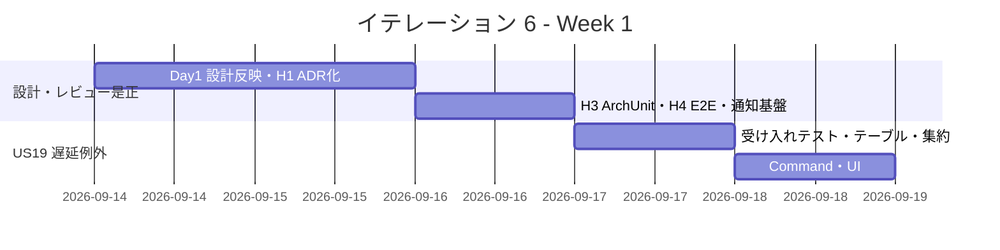
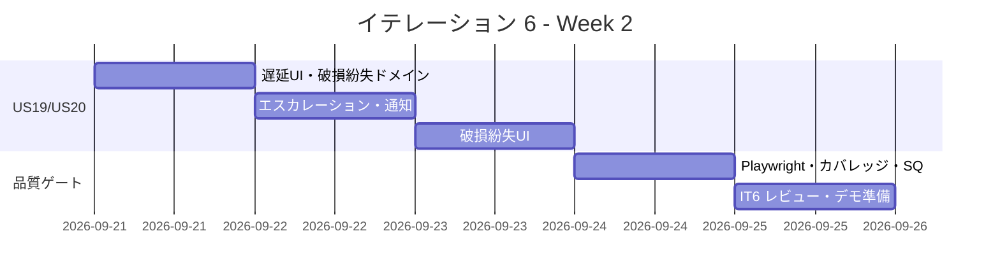
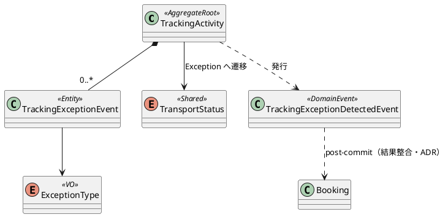

# イテレーション 6 計画

## 概要

| 項目 | 内容 |
|------|------|
| **イテレーション** | 6 |
| **期間** | 2026-09-14 〜 2026-09-25（2 週間） |
| **ゴール** | 遅延・破損・紛失の例外登録とエスカレーション・荷主通知が動作し、Release 1.0 のフィードバック（IT5 レビュー高優先）を消化する |
| **目標 SP** | 6（US19 / US20）+ Release 1.0 フィードバック対応（IT5 レビュー H1〜H4・繰り越し品質ゲート） |

---

## ゴール

### イテレーション終了時の達成状態

1. **例外の登録**: 追跡管理者が追跡番号を指定し、例外種別（遅延＝`Delay` / 破損＝`Damage` / 紛失＝`Lost`）と発生状況（場所・日時・理由）を登録できる（US19/US20）。登録後、貨物状態が「例外発生」（`TransportStatus` = `Exception`）に更新される。
2. **エスカレーションと通知**: 例外種別「紛失」（`Lost`）の場合、緊急フラグ（`escalation_flag`）が設定され、管理職へのエスカレーション通知が自動送信される。全例外で荷主に例外発生通知が送信される（append-only 通知記録・IT4/IT5 の通知記録方針を踏襲）。
3. **例外対応の記録**: 対応内容（新しい到着予定日・対応方針・補償方針）を入力して荷主に対応報告を送信でき、例外対応履歴が時系列で残る（US19/US20）。
4. **Release 1.0 フィードバックの消化**: IT5 レビュー高優先（H1 post-commit 結果整合性の ADR 化・H2 荷主通知・H3 ArchUnit の Tracking/Handling BC ルール・H4 CLAIM/UNLOAD の状態同期 E2E）と繰り越し品質ゲート（Playwright E2E・カバレッジハードゲートの CI 化・SonarQube アクセシビリティ）を消化する。

### 成功基準

- [ ] US19・US20 の受入条件をすべて満たす
- [ ] `ExceptionType`（`Delay` / `Damage` / `Lost` / `CustomsHold`。本 IT は CustomsHold を除く 3 値を扱う）を domain-model 準拠で実装し、`TransportStatus.Exception` への遷移を単体テストで網羅する
- [ ] 紛失（`Lost`）登録時にエスカレーション通知（管理職向け）が自動送信され、記録が残る
- [ ] 例外登録・対応報告の荷主通知が append-only 通知記録として残る（H2 の一部消化）
- [ ] `TrackingExceptionDetectedEvent` を Tracking→Booking へ発行し、post-commit 連鎖の結果整合性方針を ADR 化する（H1）
- [ ] ArchUnit に Tracking/Handling BC の依存ルール（他 BC 内部型への非依存・ACL 経由のみ）を追加する（H3）
- [ ] CLAIM→Delivered・UNLOAD→InTransit の状態同期 E2E を追加する（H4）
- [ ] **繰り越し品質ゲートの決着**：Playwright E2E（予約〜追跡〜例外フロー）・カバレッジ 85% ハードゲートの CI 段階導入（operating-cicd）・SonarQube SQ-3（Web:S6853 アクセシビリティ 33 件）／SQ-2（S6967 6 件）

### アプローチ（開発戦略: 終盤アウトサイドインの初回イテレーション）

[開発戦略](./development_strategy.md#終盤-アウトサイドインit6-7) に従い、IT6 は**終盤・アウトサイドインの初回イテレーション**。中盤（IT3-5）までに整った Tracking/Handling BC の中核ドメインの上に、例外対応を**業務シナリオ起点で結合**する。

- 例外対応は「例外登録 → 状態更新（Exception）→ エスカレーション/荷主通知 → 対応報告」という業務フローを、受け入れテスト（Web.Tests）起点で一気通貫に検証してから内側を作り込む。
- モックは「まだ無い部分」（通知の実送信基盤・管理職エスカレーション先）だけに限定し、確立済みのドメイン・インフラ（TrackingActivity 集約・TransportStatus 共有カーネル・post-commit イベント基盤・ACL パターン）は実物を使って結合する。
- **IT5 レビュー高優先（H1〜H4）を Week 1 前半に先行消化**してから US19/US20 を積む（技術的負債・回帰穴を持ち越さない）。H1（ADR 化）と H3（ArchUnit）は例外イベント（`TrackingExceptionDetectedEvent`）の追加で post-commit 連鎖が増えるため、本 IT の実装前提として先行する。
- 局面移行（IT6→IT7）に向けて、IT7（料金算出・法人割引・精算）が消費する `InvoiceRequested`（Delivered 後）の起点が H4 で担保されることを確認する。

---

## ユーザーストーリー

### 対象ストーリー

| ID | ユーザーストーリー | SP | 優先度 |
|----|-------------------|----|----|
| US19 | 遅延例外を処理する | 3 | 必須 |
| US20 | 破損・紛失例外を処理する | 3 | 必須 |
| **合計** | | **6** | |

### ストーリー詳細

#### US19: 遅延例外を処理する（UC16）

**ストーリー**:
> 追跡管理者として、輸送中に遅延が発生した場合、例外種別「遅延」として記録し、荷主への通知と対応内容を管理したい。なぜなら、遅延情報を速やかに荷主に伝え、対応策（代替ルート等）を迅速に提示できるからだ。

**受入条件**:

1. 追跡番号と例外種別「遅延」（`ExceptionType.Delay`）・発生状況（場所＝UN/LOCODE・日時・理由）を記録できる
2. 記録後、貨物状態が「例外発生」（`TransportStatus.Exception`）に更新される
3. 荷主に遅延発生の通知が送信される（AC。本 IT では通知記録で代替・IT4/IT5 と同方針）
4. 対応内容（新しい到着予定日・対応方針）を入力して荷主に対応報告を送信できる
5. 例外対応履歴が時系列で記録される

#### US20: 破損・紛失例外を処理する（UC16）

**ストーリー**:
> 追跡管理者（または荷役作業員）として、輸送中に破損または紛失が発生した場合、例外種別「破損」または「紛失」として記録し、関係者に緊急通知を送りたい。なぜなら、重大な例外は即座に全関係者に共有し、保険手続き・補償対応・代替措置を迅速に開始できるからだ。

**受入条件**:

1. 追跡番号と例外種別「破損」（`Damage`）または「紛失」（`Lost`）・発生状況を記録できる
2. 記録後、貨物状態が「例外発生」（`TransportStatus.Exception`）に更新される
3. 例外種別「紛失」（`Lost`）の場合、緊急フラグ（`escalation_flag`）が設定されて管理職への escalation 通知が送信される
4. 荷主に破損・紛失発生の通知が送信される（AC。本 IT では通知記録で代替）
5. 対応内容（補償方針等）を入力して荷主に報告を送信できる

### タスク

> 進め方はアウトサイドイン（受け入れテスト → プレゼン → アプリ → ドメイン → インフラ）。Week 1 前半に IT5 レビュー高優先（H1〜H4）を先行消化する。

#### 0. Day 1 設計反映・局面移行チェック・IT5 レビュー是正（先行）

| # | タスク | 見積もり | 担当 | 状態 |
|---|--------|---------|------|------|
| 0.1 | 【Day 1・着手前】設計反映：(a) `TrackingExceptionEvent`（集約内エンティティ）・`ExceptionType`（Delay/Damage/Lost/CustomsHold）・`TransportStatus.Exception` 遷移・`TrackingExceptionDetectedEvent` を domain-model に確定、(b) `tracking_exception_event` テーブル（0013 以降・二方言）を data-model に定義、(c) 例外登録画面（`/tracking/{trackingNumber}/exceptions/new`）を ui_design 画面一覧と整合。局面移行チェック（終盤アウトサイドインへの切替・ArchUnit グリーン・UoW 基盤動作） | 4h | - | [ ] |
| 0.2 | IT5 レビュー H1：post-commit 連鎖の結果整合性方針（at-least-once・冪等スキップ・補償/再試行/手動修復のいずれか）を ADR 化し、ADR-0002/0006 の Consequences を更新。同期失敗ログ・再同期手段の可観測性方針を明記。例外イベント（`TrackingExceptionDetectedEvent`）追加の前提として先行 | 5h | - | [x]（ADR-0009 起票＝結果整合性モデル・冪等ハンドラ・同期失敗 WARN ログ・手動修復（状態導出）・Outbox 移行方針。ADR-0002/0006 の影響に相互参照追記。index 更新） |
| 0.3 | IT5 レビュー H3：ArchUnit に Tracking/Handling BC の依存ルール（他 BC 内部型への非依存・ACL 経由のみ）を追加。基準線を固定し回帰検出可能にする | 3h | - | [x]（ルール 5/6 追加＝Tracking/Handling は他 BC の `.Domain.Model` に非依存。ドメインイベント購読・CargoSnapshot ACL は正規チャネルとして許容。Arch テスト 6→8 緑） |
| 0.4 | IT5 レビュー H4：CLAIM→Delivered・UNLOAD→InTransit の状態同期 E2E を追加（`MarkDelivered()` 終端・UNLOAD 分岐を回帰テスト内に） | 3h | - | [x]（`荷役登録の荷降しから引取まで進めると予約が配送完了へ同期する` を追加。Unload@DEHAM→荷降し済/IN_TRANSIT 維持、Claim@DEHAM+荷受人確認→引取済/DELIVERED を貫通検証。Web.Tests 59→60 緑） |
| 0.5 | IT5 レビュー H2（一部・基盤）：荷主通知の append-only 記録基盤を Tracking BC に整備（`NotifyRouteToShipper` の通知記録パターンを踏襲）。実送信は後続、本 IT では通知記録で代替。US19/US20 の通知要件で消費 | 3h | - | [x]（exception_notification 0014・ExceptionNotification 記録・リポジトリ・NotifyOnTrackingExceptionDetectedHandler（荷主常時＋管理職エスカレーション）。ADR-0009 準拠の失敗 WARN ログ。追跡詳細に通知記録表示） |

**小計**: 18h（理想時間）

> **IT5 レビュー中・低優先の対応方針**: 到達不能な `TransportStatus`（`OnboardCarrier`/`AwaitingClaim`/`Exception`/`Unknown`）は本 IT で `Exception` への遷移経路を実装するため一部解消。残る到達不能状態は注記で対応。改善バックログ #19/#20/#21（追跡入口の整理・ポーリング間隔・ロール別ダッシュボード）は US18 実装済みを踏まえ、PO 確認のうえ本 IT のバッファまたは IT7 で調整。詳細は [開発成果物レビュー（IT5）](../review/開発成果物_IT5_review_20260713.md)。

#### 1. US19 遅延例外を処理する（3 SP）

| # | タスク | 見積もり | 担当 | 状態 |
|---|--------|---------|------|------|
| 1.1 | 【Phase 1・Red】例外登録の業務シナリオ受け入れテスト（Web.Tests）：追跡番号→遅延登録→状態 Exception→荷主通知記録→対応報告を一気通貫でアサート | 3h | - | [x]（`追跡管理者が遅延例外を登録し対応報告で解決できる`＝登録→例外発生→解決→復帰を貫通。荷主通知記録は 0.5 で接続予定） |
| 1.2 | `tracking_exception_event` テーブル（追跡 ID・exception_type・occurred_at・escalation_flag・description・resolved_at・resolution_notes。0013・二方言）＋モデル定義 | 3h | - | [x]（0013 二方言追加。domain/UI 要求の location_unlocode を追加し data-model を是正。リポジトリ永続化は未） |
| 1.3 | `TrackingExceptionEvent` エンティティ・`ExceptionType`（Delay/Damage/Lost/CustomsHold）・`TransportStatus.Exception` 遷移を TrackingActivity 集約に凝集＋ドメインユニットテスト | 4h | - | [x]（AddException/HasActiveException/ResolveException・CurrentStatus の Exception 導出と復帰・Lost の EscalationFlag。ドメイン +6 緑） |
| 1.4 | `RegisterExceptionCommand` / CommandService（遅延登録・`TrackingExceptionEvent` 追加・`TransportStatus.Exception` 遷移・`TrackingExceptionDetectedEvent` 発行）＋ `ResolveExceptionCommand`（対応報告・resolvedAt 記録・例外発生前状態への復帰＝domain-model BR5）＋統合テスト | 5h | - | [x]（両 CommandService＋イベント発行＋DI 登録。CustomsHold 手動登録拒否。Infra 統合でイベント post-commit 発行・拒否を検証 +2 緑） |
| 1.5 | 例外登録 UI（`/tracking/{trackingNumber}/exceptions/new`・種別選択・状況入力・PRG）＋対応報告（解決）フォーム＋E2E | 4h | - | [x]（NewException 画面・追跡詳細の [例外を登録] ボタン/EXCEPTION バッジ/例外履歴/対応報告フォーム。TrackingController 登録/解決アクション・QueryService 例外読取） |

**小計**: 18h（理想時間）

#### 2. US20 破損・紛失例外を処理する（3 SP）

| # | タスク | 見積もり | 担当 | 状態 |
|---|--------|---------|------|------|
| 2.1 | 【Phase 1・Red】破損・紛失の受け入れテスト（Web.Tests）：破損登録・紛失登録→escalation_flag 設定→管理職エスカレーション通知記録をアサート | 2h | - | [x]（`紛失例外を登録するとエスカレーションが表示される`＝紛失登録→escalation バッジ＋管理職通知記録表示を検証） |
| 2.2 | `Damage`/`Lost` の例外ドメインロジック（紛失は escalation_flag 必須・管理職通知トリガ）＋ユニットテスト（境界：Lost のみ escalation） | 4h | - | [x]（TrackingExceptionEvent で Lost のみ EscalationFlag。ドメインテスト `紛失例外はエスカレーションフラグが立つ`/`遅延や破損例外はエスカレーションしない`。イテレーション 2 で実装済み） |
| 2.3 | エスカレーション通知（管理職向け）＋荷主通知の append-only 記録（0.5 の通知基盤で実装）＋統合テスト | 4h | - | [x]（NotifyOnTrackingExceptionDetectedHandler で紛失→荷主+管理職 2 通、遅延→荷主 1 通を記録。Infra 統合で検証 +2 緑） |
| 2.4 | 破損・紛失登録 UI（種別選択で紛失時のエスカレーション必須表示＝ui_design の警告文言）＋補償方針入力＋E2E | 3h | - | [x]（NewException 画面に破損/紛失種別＋紛失エスカレーション警告（ui_design 文言）。対応方針は対応報告フォームで入力。US20 受け入れ緑） |

**小計**: 13h（理想時間）

#### 3. 繰り越し品質ゲート（IT5 繰り越し）

| # | タスク | 見積もり | 担当 | 状態 |
|---|--------|---------|------|------|
| 3.1 | Playwright E2E を予約〜追跡〜例外フローに拡張（以降の繰り越し禁止・IT5 6.3 繰り越し） | 4h | - | [ ]（繰り越し：Playwright ブラウザ実行環境が前提。US19/US20 フローは WebApplicationFactory ベースの受け入れテストで貫通検証済み） |
| 3.2 | カバレッジ 85% ハードゲートを CI に段階導入（operating-cicd・IT5 6.1 繰り越し。opencover 収集は整備済み） | 4h | - | [~]（IT6 追加ドメインの被覆を実測：TrackingActivity 98.2%・TrackingExceptionEvent 96.2% で 85% ゲート充足。全体マージ計測と CI ハードゲート化は operating-cicd で別途） |
| 3.3 | SonarQube SQ-3（Web:S6853 アクセシビリティ 33 件・cshtml の label とコントロール関連付け）＋ SQ-2（S6967 6 件・GET アクション誤検出精査）を消化（operating-qt） | 5h | - | [ ]（繰り越し：SonarQube サーバ稼働が前提。NewException 画面は label for/id 関連付け済みで新規 S6853 を持ち込まない実装） |

**小計**: 13h（理想時間）

#### タスク合計

| カテゴリ | SP | 理想時間 | 状態 |
|---------|----|----|------|
| Day 1 設計反映・IT5 レビュー是正（H1〜H4・通知基盤） | - | 18h | [ ] |
| US19 遅延例外を処理する | 3 | 18h | [ ] |
| US20 破損・紛失例外を処理する | 3 | 13h | [ ] |
| 繰り越し品質ゲート | - | 13h | [ ] |
| **合計** | **6** | **62h** | |

**1 SP あたり**: 約 5.2h（ストーリータスクのみ 31h ÷ 6 SP）
**進捗率**: 0% (0/6 SP)

> **注**: 6 SP は平均ベロシティ（13.2 SP/IT）を大きく下回るが、IT5 レビュー高優先（H1〜H4）と繰り越し品質ゲートの消化（計 31h）を Release 1.0 フィードバック対応として同時進行するため、実質的な負荷は例外 2 ストーリー＋負債返済となる。フィーチャバッファに余裕があるため、改善バックログ #19/#20/#21（追跡 UX 改善）を PO 確認のうえ取り込む候補とする。

---

## スケジュール

### Week 1（Day 1-5）

| 日 | タスク |
|----|--------|
| Day 1 | 0.1 設計反映・局面移行チェック、0.2 H1 post-commit 結果整合性 ADR 化（着手） |
| Day 2 | 0.2 H1 完了、0.3 H3 ArchUnit ルール追加 |
| Day 3 | 0.4 H4 状態同期 E2E、0.5 H2 通知記録基盤 |
| Day 4 | 1.1 US19 受け入れテスト（Red）、1.2 例外テーブル、1.3 例外ドメイン・Exception 遷移 |
| Day 5 | 1.4 例外登録 Command・イベント発行、1.5 例外登録 UI（着手） |

### Week 2（Day 6-10）

| 日 | タスク |
|----|--------|
| Day 6 | 1.5 例外登録 UI・対応報告フォーム完了、2.1 US20 受け入れテスト（Red） |
| Day 7 | 2.2 破損・紛失ドメイン（Lost の escalation 境界）、2.3 エスカレーション・荷主通知記録 |
| Day 8 | 2.4 破損・紛失登録 UI（紛失エスカレーション必須表示）、3.1 Playwright E2E 拡張 |
| Day 9 | 3.2 カバレッジハードゲート CI 導入、3.3 SonarQube SQ-3/SQ-2 消化 |
| Day 10 | 統合テスト、self-review、IT6 デモ準備、Release 1.1 に向けた IT7 前提確認 |

---

## 設計

例外対応は Tracking Context の既存集約 `TrackingActivity` を拡張して実装する（IT5 で立ち上げ済み）。詳細は
[ドメインモデル設計 - Tracking Context](../design/domain-model.md) を SoT とする。

### ドメインモデル（本 IT スコープ）

- エンティティ: `TrackingExceptionEvent`（追跡例外イベント・時系列追記）。`TrackingActivity` 集約内に凝集させる（`TrackingActivityEvent` と同様の追記型）。
- `ExceptionType`（VO）: `Delay`（遅延）/ `Damage`（破損）/ `Lost`（紛失）/ `CustomsHold`（税関保留）。**本 IT では Delay/Damage/Lost の 3 値を扱い、CustomsHold（通関）は本リリース対象外**（税関はスコープ外・release_plan #14）。
- 共有カーネル: `TransportStatus.Exception`（例外発生）への遷移を集約に凝集。紛失（`Lost`）は `escalation_flag = true` を必須とし、管理職エスカレーション通知をトリガする。
- ドメインイベント: `TrackingExceptionDetectedEvent` を Tracking→Booking へ post-commit 発行（domain-model の `tracking ..> booking : TrackingExceptionDetectedEvent`）。IT5 レビュー H1 の結果整合性方針（ADR）に従い、at-least-once・冪等スキップ・可観測性を担保する。
- コマンド: `RegisterExceptionCommand`（追跡管理者・税関システム。例外登録）・`ResolveExceptionCommand`（追跡管理者。例外解決し `TransportStatus` を例外発生前の状態へ復帰＝domain-model ビジネスルール 5）を domain-model のコマンド一覧に準拠して実装。集約は `TrackingActivity.AddException(ex)`・`HasActiveException()`・`CurrentStatus()` を用いる。
- ビジネスルール（domain-model 準拠）: BR3 `ExceptionType` が `Lost` の場合 `escalationFlag = true` を設定し上位管理者へエスカレーション。BR4 `CustomsHold` は税関システム（`ICustomsClearancePort`）通知で自動登録＝本 IT 対象外。BR5 `ResolveExceptionCommand` で例外発生前状態へ復帰。
- 通知: 荷主通知・管理職エスカレーション通知は append-only 通知記録として実装（実送信基盤は後続 IT）。IT4/IT5 の通知記録方針を踏襲。

### データモデル

[data-model.md - Tracking Context](../design/data-model.md) を SoT とする。既定テーブル `tracking_exception_event`（`tracking_id`・`exception_type` VARCHAR(50)・`occurred_at`・`escalation_flag` BOOLEAN・`description`・`resolved_at`・`resolution_notes`）を使用。マイグレーション番号は 0013 以降を Day1 0.1 で確定する（IT5 の 0012 に続く）。Day1 0.1 で data-model.md を更新してから実装する。

### ユーザーインターフェース

[UI 設計](../design/ui_design.md) を SoT とする。IT1 のウォーキングスケルトンで作成済みの例外登録ルート（`/tracking/{trackingNumber}/exceptions/new`）を実画面化する。

**対象画面**（ui_design 画面一覧より）:

| 画面 | URL | 説明 | 対象ロール | US |
|------|-----|------|-----------|-----|
| 例外登録 | `/tracking/{trackingNumber}/exceptions/new` | 遅延・破損・紛失などの例外登録フォーム | ROLE_TRACKER（追跡管理者） | US19, US20 |
| 追跡詳細（拡張） | `/tracking/{trackingNumber}` | `[例外を登録]` ボタン・例外履歴・EXCEPTION バッジ表示 | ROLE_TRACKER | US19, US20 |

**インタラクション**（htmx / PRG パターン・ui_design 例外登録ワイヤーフレーム準拠）:

- 例外登録（US19/US20）: 追跡詳細の `[例外を登録]`（ROLE_TRACKER のみ）→ 例外種別・発生場所・日時・状況説明・対応方針を入力 → `[荷主に通知する]` チェック → 登録（PRG）→ 追跡詳細へ戻る。
- 紛失選択時（US20）: 種別「LOST（紛失）」を選択すると「管理職へのエスカレーション通知が必須として自動送信されます」の警告（`alert-danger`）を表示。
- 例外発生後: 追跡詳細で EXCEPTION を赤色バッジ表示し、内容を詳細表示。

> **ナビゲーション整合性（絶対項目）**: 例外登録は追跡詳細（`/tracking/{trackingNumber}`）からの導線であり独立メニューは持たない。追跡詳細の `[例外を登録]` ボタンは ROLE_TRACKER のみ表示（ui_design 726 行）。navbar/ダッシュボードのロール表示は IT5 で確定済みのため、本 IT では追跡詳細 → 例外登録 → 追跡詳細（PRG）の遷移と ROLE_TRACKER 到達条件を Day1 0.1 で確認する（ui_design ナビ表 → 追跡詳細ボタン → テストの一致）。

### API 設計

| メソッド | エンドポイント | 説明 |
|---------|---------------|------|
| GET | /tracking/{trackingNumber}/exceptions/new | 例外登録フォーム（US19/US20） |
| POST | /tracking/{trackingNumber}/exceptions | 例外登録（US19/US20・種別/場所/日時/状況/通知要否・`RegisterExceptionCommand`） |
| POST | /tracking/{trackingNumber}/exceptions/{exceptionId}/resolution | 例外対応報告・解決（US19/US20・`ResolveExceptionCommand`・状態復帰） |

### ADR

| ADR | タイトル | ステータス |
|-----|---------|-----------|
| [ADR-0002](../adr/0002-UnitOfWorkとpost-commitイベント基盤.md) | Unit of Work と post-commit イベント基盤 | 更新（H1・結果整合性の Consequences 追記） |
| [ADR-0006](../adr/0006-AmbientTransactionによるトランザクション伝播.md) | Ambient Transaction によるトランザクション伝播 | 更新（H1・結果整合性の Consequences 追記） |
| ADR-00XX（新規・0.2） | post-commit イベント連鎖の結果整合性方針 | 起票予定（IT5 レビュー H1） |

---

## リスクと対策

| リスク | 影響度 | 対策 |
|--------|--------|------|
| post-commit 連鎖に例外イベント（`TrackingExceptionDetectedEvent`）が加わり結果整合性の穴が拡大 | 高 | H1 の ADR 化（0.2）を実装前に先行完了し、at-least-once・冪等スキップ・可観測性を確立してから例外イベントを追加 |
| エスカレーション通知先（管理職）の実体が未定義 | 中 | 通知記録（append-only）で代替し実送信は後続 IT。escalation_flag と通知記録の生成をドメインで担保 |
| 終盤アウトサイドインへの局面移行で受け入れテスト起点の進め方が定着していない | 中 | US19/US20 とも Phase 1（受け入れテスト Red）を先頭タスク（1.1/2.1）に固定。既存ドメイン再利用を前提にモックを最小化 |
| 品質ゲート（Playwright/カバレッジ/SonarQube）が 4 IT 連続繰り越し | 中 | Day 8-9 に集約配置し繰り越し禁止を DoD 化。カバレッジ CI 化は operating-cicd で確実に実施 |
| 6 SP と低負荷に見えるが H1〜H4＋品質ゲートで実工数が大きい | 中 | 是正（0.2-0.5）を Week 1 前半に先行消化し US19/US20 と分離。バッファ余力で #19/#20/#21 を PO 確認のうえ調整 |

---

## 完了条件

### Definition of Done

- [ ] コードレビュー完了（self-review：中間 / developing-review：正式）
- [ ] US19・US20 の受入条件をすべて満たす
- [ ] ユニットテストがパス（`ExceptionType` 別遷移・`Lost` の escalation 境界を網羅）
- [ ] E2E テストがパス（予約→追跡→例外登録→エスカレーション/通知記録→対応報告。Playwright 拡張）
- [ ] ArchUnit テストがパス（Tracking/Handling BC の ACL 経由依存・H3）
- [ ] CLAIM→Delivered・UNLOAD→InTransit の状態同期 E2E がパス（H4）
- [ ] post-commit 結果整合性 ADR 起票・ADR-0002/0006 更新完了（H1）
- [ ] 荷主通知・エスカレーション通知が append-only 記録として残る（H2 一部）
- [ ] カバレッジ 85% ハードゲートを CI に段階導入（繰り越し決着）
- [ ] SonarQube Quality Gate OK（SQ-3 アクセシビリティ・SQ-2 消化）
- [ ] `dotnet format` / Lint エラーなし
- [ ] domain-model / data-model / ui_design / release_plan の横断更新完了

### デモ項目

1. 追跡詳細 → 例外登録（遅延）→ 状態が Exception に更新 → 荷主通知記録 → 対応報告（新到着予定日）
2. 破損・紛失例外の登録、紛失時の escalation_flag 設定と管理職エスカレーション通知記録
3. 追跡詳細での EXCEPTION 赤バッジ・例外履歴タイムライン表示
4. post-commit 結果整合性（同期失敗ログ・再同期手段）と ArchUnit による BC 依存検証

---

## 更新履歴

| 日付 | 更新内容 | 更新者 |
|------|---------|--------|
| 2026-07-14 | 初版作成（US19/US20・目標 6 SP＋Release 1.0 フィードバック・終盤アウトサイドイン初回）。IT5 レビュー高優先 H1（post-commit 結果整合性 ADR）/H2（荷主通知基盤）/H3（ArchUnit Tracking/Handling ルール）/H4（CLAIM/UNLOAD 状態同期 E2E）と繰り越し品質ゲート（Playwright E2E・カバレッジ CI 化・SonarQube SQ-3/SQ-2）を先行タスク化 | - |

---

## 関連ドキュメント

- [イテレーション 6 ふりかえり](./retrospective-6.md)
- [開発戦略](./development_strategy.md)
- [リリース計画](./release_plan.md)
- [イテレーション 5 計画](./iteration_plan-5.md)
- [イテレーション 5 ふりかえり](./retrospective-5.md)
- [開発成果物レビュー（IT5）](../review/開発成果物_IT5_review_20260713.md)
- [ドメインモデル設計](../design/domain-model.md)
- [システムユースケース](../requirements/system_usecase.md)
- [ユーザーストーリー](../requirements/user_story.md)
