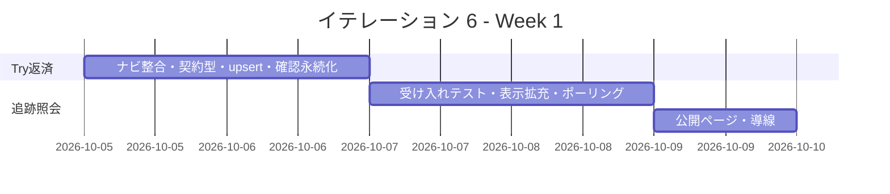
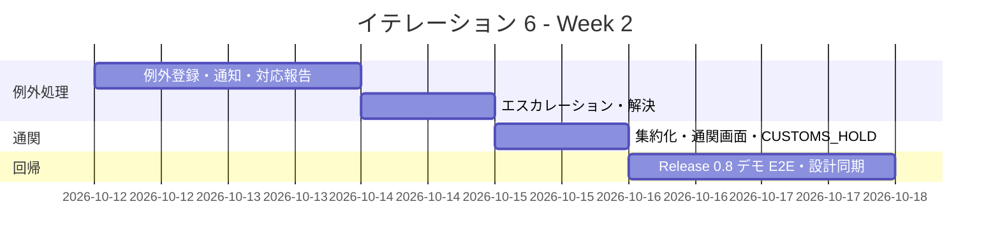
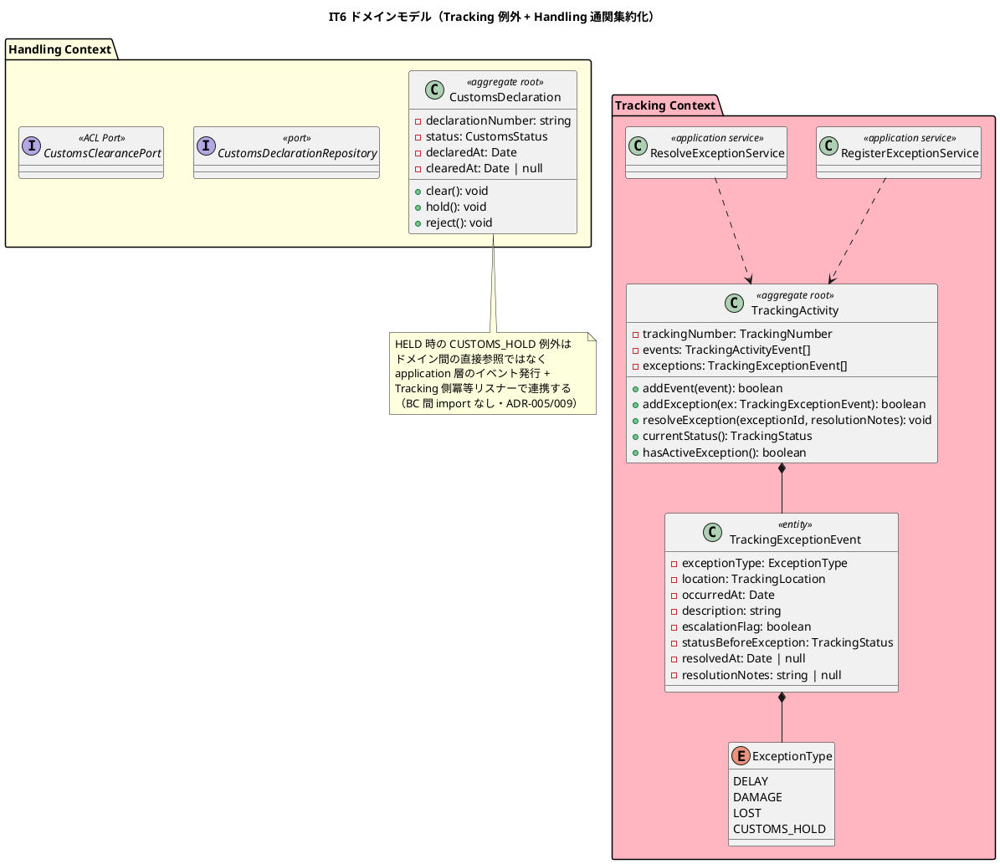
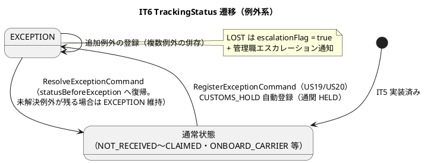
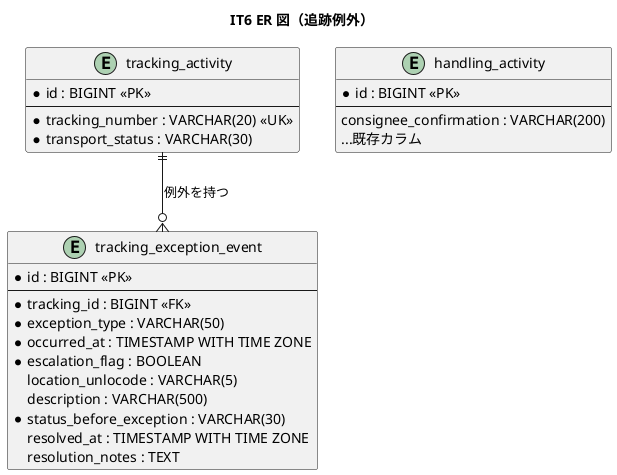
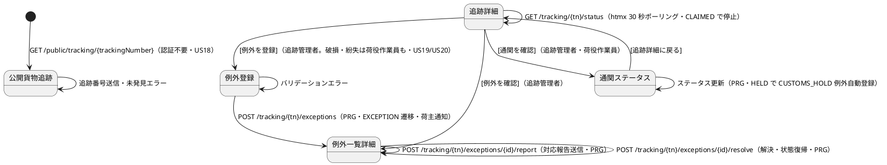

# イテレーション 6 計画

## 概要

| 項目 | 内容 |
|------|------|
| **イテレーション** | 6 |
| **期間** | 2026-10-05 〜 2026-10-18（計画 Week 11-12） |
| **局面** | **終盤（アウトサイドイン）**（IT5 で中盤完了・局面移行） |
| **ゴール** | 荷主・荷受人が認証なしでも貨物を追跡でき、遅延・破損・紛失の例外を記録 → 通知 → 対応報告 → 解決まで管理できる状態にし、Release 0.8（荷役・追跡）を完成させる |
| **目標 SP** | 11 |

---

## ゴール

### イテレーション終了時の達成状態

1. **追跡照会（US18）**: 荷主（または荷受人）が追跡番号で現在状態・位置（港湾名）・推定到着日・イベント履歴を照会できる。認証付き追跡詳細は htmx 30 秒ポーリングで自動更新され、終端状態（CLAIMED）で停止する。認証不要の公開ページ `/public/tracking/{trackingNumber}` から同様に照会できる。
2. **遅延例外（US19）**: 追跡管理者が例外種別「遅延」を発生状況（場所・日時・理由）付きで記録すると、貨物状態が EXCEPTION になり荷主へ通知される。対応内容（新到着予定日・対応方針）を入力して荷主へ対応報告を送信でき、対応履歴が残る。
3. **破損・紛失例外（US20）**: 追跡管理者（破損・紛失は荷役作業員も）が「破損」「紛失」を記録できる。「紛失」は escalationFlag が設定され管理職へエスカレーション通知が送信される。対応報告（補償方針等）を送信できる。
4. **例外解決**: `ResolveExceptionCommand` で例外を解決すると、TrackingStatus が例外発生前の状態に復帰する（domain-model ビジネスルール 5）。
5. **通関ステータス**: `/tracking/{trackingNumber}/customs` で通関申告を照会・更新でき、HELD 時に CUSTOMS_HOLD 例外が自動登録される（CustomsClearancePort スタブ経由・domain-model ビジネスルール 4）。あわせて通関申告をドメイン集約へ引き上げる（IT5 Try T3）。
6. **Release 0.8 デモ E2E**: 荷役登録 → 追跡照会（公開ページ含む）→ 例外登録 → エスカレーション → 対応報告 → 解決の業務シナリオ E2E が green である。

### 成功基準

- [ ] `US18` / `US19` / `US20` の受入基準をテストで 1:1 に確認する。
- [ ] 終盤方針どおり、業務シナリオの受け入れテスト（E2E / HTTP フロー）を先に書き、既存集約（TrackingActivity・HandlingActivity・Cargo）の結合で実装する（アウトサイドイン）。
- [ ] 例外の登録・解決は「状態を変更できる経路の一覧（経路×コマンドマトリクス）」を設計節に明記し、経路ごとの不変条件・冪等性をテストで確認する（IT5 Try T1）。
- [ ] ナビとコントローラのロール定義の整合を自動検証するテストを追加する（IT5 Try T2）。
- [ ] `CustomsDeclaration` を集約 + Repository ポートへ引き上げ、状態遷移規則（CLEARED 後の cleared_at 保持含む)を封じる（IT5 Try T3）。
- [ ] イベント契約型を 1 箇所に定義し発行・購読で共有する（IT5 Try T5）。
- [ ] 公開ページは認証不要だが、予約・荷主情報など照会範囲外の情報を露出しない（最小表示）。
- [ ] `npm run verify`・CI・SonarQube Quality Gate（PASS）が green である。
- [ ] ドメイン層カバレッジ 85% 以上、全体カバレッジ 80% 以上を維持する。

---

## ユーザーストーリー

### 対象ストーリー

| ID | ユーザーストーリー | SP | 優先度 | 対応 UC |
|----|-------------------|----|--------|---------|
| US18 | 追跡情報を照会する | 5 | 必須 | UC15 |
| US19 | 遅延例外を処理する | 3 | 必須 | UC16 |
| US20 | 破損・紛失例外を処理する | 3 | 必須 | UC16 |
| **合計** | | **11** | | |

### ストーリー詳細

#### US18: 追跡情報を照会する

**ストーリー**:
> 荷主（または荷受人）として、追跡番号を入力して貨物の現在位置・状態・追跡イベント履歴・推定到着日を確認したい。なぜなら、輸送状況をいつでも自分で確認でき、到着準備や業務計画に役立てるからだ。

**受入条件**:

1. 追跡番号を入力して貨物情報を照会できる。
2. 現在の状態・位置（港湾名）・推定到着日が表示される。
3. 追跡イベント履歴（日時・場所・作業種別）が時系列で表示される。
4. 追跡番号が存在しない場合、「追跡番号が見つかりません」と表示される。
5. ログインなしでも追跡番号があれば照会できる。

#### US19: 遅延例外を処理する

**ストーリー**:
> 追跡管理者として、輸送中に遅延が発生した場合、例外種別「遅延」として記録し、荷主への通知と対応内容を管理したい。なぜなら、遅延情報を速やかに荷主に伝え、対応策（代替ルート等）を迅速に提示できるからだ。

**受入条件**:

1. 追跡番号と例外種別「遅延」・発生状況（場所・日時・理由）を記録できる。
2. 記録後、貨物状態が「例外発生」に更新される。
3. 荷主に遅延発生の通知が送信される。
4. 対応内容（新しい到着予定日・対応方針）を入力して荷主に対応報告を送信できる。
5. 例外対応履歴が記録される。

#### US20: 破損・紛失例外を処理する

**ストーリー**:
> 追跡管理者（または荷役作業員）として、輸送中に破損または紛失が発生した場合、例外種別「破損」または「紛失」として記録し、関係者に緊急通知を送りたい。なぜなら、重大な例外は即座に全関係者に共有し、保険手続き・補償対応・代替措置を迅速に開始できるからだ。

**受入条件**:

1. 追跡番号と例外種別「破損」または「紛失」・発生状況を記録できる。
2. 記録後、貨物状態が「例外発生」に更新される。
3. 例外種別「紛失」の場合、緊急フラグが設定されて管理職への escalation 通知が送信される。
4. 荷主に破損・紛失発生の通知が送信される。
5. 対応内容（補償方針等）を入力して荷主に報告を送信できる。

### タスク

#### 1. IT5 Try 返済・基盤調整（0 SP）

| # | タスク | 見積もり | 担当 | 状態 |
|---|--------|---------|------|------|
| 1.1 | ナビ×コントローラのロール整合自動検証テスト（nav-items の roles と各コントローラ @Roles の突合）（Try T2） | 4h | - | [ ] |
| 1.2 | イベント契約型の共有: `handling.registered` 等のペイロード型を 1 箇所（shared の contract 定義）へ集約し、発行側・購読側の手書き重複を排除（Try T5） | 4h | - | [ ] |
| 1.3 | 追跡レコード遅延作成を upsert + 再読込のリトライ可能な冪等操作へ（競合時のイベント消失防止）（Try T6 前半。後半＝AFTER_COMMIT の `transaction()` 明示化は複数書き込みコマンドが現れる IT7 以降へ後置し、単発 insert の現状は機能的に等価であることを注記） | 4h | - | [ ] |
| 1.4 | 荷受人確認（consigneeConfirmation）の永続化: `handling_activity` へカラム追加し引き渡し証明として記録（IT5 レビュー tester M3） | 4h | - | [ ] |
| 1.5 | 荷主連絡先解決のポート統一: Handling / Tracking 通知アダプタの cargo × shipper 生 JOIN を連絡先解決ポート（`ShipperContactAcl` 同型）へ寄せる（Try T4 前半。例外・エスカレーション通知の実装前に完了） | 4h | - | [ ] |

**小計**: 20h（理想時間）

#### 2. 追跡照会（US18、5 SP）

| # | タスク | 見積もり | 担当 | 状態 |
|---|--------|---------|------|------|
| 2.1 | 受け入れテスト先行: 追跡照会シナリオ（認証あり/公開ページ・未存在エラー・履歴時系列）を HTTP フロー / E2E で記述（アウトサイドイン） | 6h | - | [ ] |
| 2.2 | 追跡詳細の表示拡充: 位置は港湾名（location JOIN）付き、推定到着日（旅程の最終 unload_time を Booking 側読み取り ACL 経由で取得。未確定は「未確定」表示） | 6h | - | [ ] |
| 2.3 | htmx 30 秒ポーリング: `GET /tracking/{tn}/status` フラグメント（StatusTimeline）・終端状態（CLAIMED）で停止し「輸送は完了しました」表示（ui_design ポーリング停止条件） | 6h | - | [ ] |
| 2.4 | 公開貨物追跡 `/public/tracking/{trackingNumber}`: 認証不要・最小表示（状態・現在地・イベント履歴のみ。予約・荷主情報は露出しない）。追跡番号フォームと未発見エラー | 6h | - | [ ] |
| 2.5 | ダッシュボード・ナビ導線の整合（荷主の「貨物追跡」から照会完結・公開 URL の案内表示） | 3h | - | [ ] |

**小計**: 27h（理想時間）

#### 3. 例外の記録・通知（US19/US20 共通基盤 + 遅延、3 SP）

| # | タスク | 見積もり | 担当 | 状態 |
|---|--------|---------|------|------|
| 3.1 | 受け入れテスト先行: 例外登録 → EXCEPTION → 通知 → 対応報告 → 解決の業務シナリオを記述 | 4h | - | [ ] |
| 3.2 | `TrackingExceptionEvent` 集約内エンティティ・`ExceptionType`（DELAY / DAMAGE / LOST / CUSTOMS_HOLD）・`RegisterExceptionCommand`: EXCEPTION 遷移・migration 008（`tracking_exception_event`） | 8h | - | [ ] |
| 3.3 | `ResolveExceptionCommand`: 例外解決で発生前状態へ復帰（時系列イベントから再導出。状態の再導出禁止の教訓に従い解決前状態は例外行に永続化） | 6h | - | [ ] |
| 3.4 | 例外登録画面 `/tracking/{tn}/exceptions/new`・例外一覧/詳細 `/tracking/{tn}/exceptions`（対応状況バッジ）・荷主への例外発生通知 | 8h | - | [ ] |
| 3.5 | 対応報告（US19-4/5）: 新到着予定日・対応方針を入力し `POST /tracking/{tn}/exceptions/{id}/report` で荷主へ送信・対応履歴記録 | 6h | - | [ ] |

**小計**: 32h（理想時間）

#### 4. 破損・紛失・エスカレーション（US20、3 SP）

| # | タスク | 見積もり | 担当 | 状態 |
|---|--------|---------|------|------|
| 4.1 | LOST の escalationFlag 設定 + 管理職へのエスカレーション通知（通知種別 ESCALATION。宛先解決は通知ポート経由） | 6h | - | [ ] |
| 4.2 | 破損・紛失は荷役作業員（ROLE_HANDLER）も登録可能にするロール制御と越権負テスト（例外種別×ロールのマトリクス）。あわせて荷役作業員の例外登録への到達導線（ナビ / ダッシュボード）を追加し、ロール別表示検証テストを含める（注 12） | 6h | - | [ ] |
| 4.3 | 補償方針の対応報告と Release 0.8 デモ E2E（荷役 → 追跡 → 例外 → エスカレーション → 対応報告 → 解決） | 6h | - | [ ] |

**小計**: 16h（理想時間）

#### 5. 通関ステータス・通関集約化（Try T3 + CUSTOMS_HOLD 連携）

| # | タスク | 見積もり | 担当 | 状態 |
|---|--------|---------|------|------|
| 5.1 | `CustomsDeclaration` を集約 + `CustomsDeclarationRepository` ポートへ引き上げ（PENDING → CLEARED / HELD / REJECTED の遷移規則・CLEARED 後の cleared_at 保持）（Try T3） | 8h | - | [ ] |
| 5.2 | 通関ステータス画面 `/tracking/{tn}/customs`（照会・更新・HELD 時の対応表示）と CustomsClearancePort スタブ | 6h | - | [ ] |
| 5.3 | HELD 更新時に CUSTOMS_HOLD 例外を自動登録するイベント連携（冪等リスナー・ADR-009 準拠） | 4h | - | [ ] |

**小計**: 18h（理想時間）

#### タスク合計

| カテゴリ | SP | 理想時間 | 状態 |
|---------|----|----------|------|
| IT5 Try 返済・基盤調整 | 0 | 20h | [ ] |
| 追跡照会（US18） | 5 | 27h | [ ] |
| 例外の記録・通知（US19） | 3 | 32h | [ ] |
| 破損・紛失・エスカレーション（US20） | 3 | 18h | [ ] |
| 通関ステータス・集約化 | 0 | 18h | [ ] |
| **合計** | **11** | **115h** | [ ] |

**1 SP あたり**: 約 10.5h（Try 返済 20h・通関 18h を含む。ストーリー分のみでは 75h ≒ 6.8h/SP で IT4 実績 6.9h/SP と同水準)

---

## スケジュール

### Week 1（2026-10-05 〜 2026-10-11）

| 日 | タスク |
|----|--------|
| Day 1 | ナビ整合自動検証（T2）・イベント契約型共有（T5） |
| Day 2 | 遅延作成 upsert 冪等化（T6）・荷受人確認の永続化 |
| Day 3 | US18 受け入れテスト先行 → 追跡詳細の表示拡充（港湾名・推定到着日） |
| Day 4 | htmx 30 秒ポーリングと停止条件 |
| Day 5 | 公開貨物追跡ページ・ダッシュボード導線 |

### Week 2（2026-10-12 〜 2026-10-18）

| 日 | タスク |
|----|--------|
| Day 6 | 例外シナリオ受け入れテスト先行 → `TrackingExceptionEvent`・`RegisterExceptionCommand`（US19） |
| Day 7 | 例外画面（登録・一覧/詳細）・荷主通知・対応報告 |
| Day 8 | LOST エスカレーション・荷役作業員ロール（US20）・`ResolveExceptionCommand` |
| Day 9 | 通関集約化（Try T3）・通関画面・CUSTOMS_HOLD 自動登録 |
| Day 10 | Release 0.8 デモ E2E、`npm run verify`・SonarQube、設計同期 |

---

## 設計

### 状態を変更できる経路の一覧（経路×コマンドマトリクス・IT5 Try T1）

| 状態 | 変更経路 | 不変条件 / 冪等性 |
|------|---------|------------------|
| TrackingStatus（通常） | ①荷役イベント購読 ②手動更新（US17） | ①②とも種別+時刻で冪等。CLAIM は①の荷役経路のみ（IT5 で担保済み） |
| TrackingStatus = EXCEPTION | ③`RegisterExceptionCommand`（画面・US19/US20） ④CUSTOMS_HOLD 自動登録（通関 HELD 購読） | ③④とも「未解決の同種例外が既に存在すれば追加しない」冪等。EXCEPTION 中の①②イベントは履歴には記録するが表示状態は EXCEPTION を維持 |
| EXCEPTION からの復帰 | ⑤`ResolveExceptionCommand`（例外詳細画面のみ） | 解決前状態を例外行に永続化した値へ復帰（履歴からの再導出はしない）。未解決例外が他に残る場合は EXCEPTION を維持 |
| CustomsStatus | ⑥通関画面の更新（`UpdateCustomsStatusCommand`・集約経由のみ） | 集約が許可遷移のみ受理（PENDING→CLEARED/HELD/REJECTED、CLEARED 後の cleared_at は不変） |

### ドメインモデル

出典: [domain-model.md](../design/domain-model.md) Tracking Context（TrackingExceptionEvent・ExceptionType・ビジネスルール 3〜5・コマンド一覧）、Handling Context（CustomsDeclaration・CustomsStatus）、[development_strategy.md](development_strategy.md) 終盤方針。`statusBeforeException` は「解決で発生前状態へ復帰」（ルール 5）を履歴再導出なしで実現するための永続化フィールド（注 2）。CustomsDeclaration の集約化は IT5 レビュー（architect H1）・Try T3。

### 状態遷移図

出典: [domain-model.md](../design/domain-model.md) TrackingStatus（EXCEPTION）・ビジネスルール 3〜5。UNKNOWN への遷移は本 IT では扱わない（明示スコープ外）。

### データモデル

出典: [data-model.md](../design/data-model.md) `tracking_exception_event`（exception_type・occurred_at・escalation_flag・description・resolved_at・resolution_notes）。`status_before_exception`（解決時の復帰先）と `location_unlocode`、`handling_activity.consignee_confirmation`（Try 返済 1.4）は data-model 未定義のため本 IT で追補する（注 2/3）。

### ユーザーインターフェース

#### 画面遷移図

出典: [ui_design.md](../design/ui_design.md) 追跡フロー・公開貨物追跡・例外登録/一覧・通関ステータスの画面定義・PRG / htmx ガイドライン。解決 POST（`/exceptions/{id}/resolve`）は ui_design に未定義のため本 IT で追補する（注 4）。

---

## リスクと対策

| リスク | 影響 | 対策 |
| :--- | :--- | :--- |
| 公開ページで認証不要のまま予約・荷主情報が露出する | 高 | 公開ビューは専用の最小 DTO（状態・現在地・イベント履歴のみ）とし、E2E で非表示項目（荷主名・予約 ID 等）の不在をアサートする |
| EXCEPTION 復帰の状態を履歴から再導出して誤復帰する | 高 | `status_before_exception` を例外行に永続化し、そこへ復帰する（状態の再導出禁止の過去教訓）。複数例外併存時は未解決が残る限り EXCEPTION 維持を test.each で網羅 |
| 例外登録の経路（画面・通関 HELD 購読）で冪等性・不変条件が片効きする | 高 | 経路×コマンドマトリクス（設計節）どおり、両経路に「未解決の同種例外があれば追加しない」を実装しそれぞれテストする（IT5 Try T1） |
| htmx ポーリングが終端状態でも継続しサーバー負荷・誤表示になる | 中 | ui_design の停止条件（CLAIMED で hx-trigger を返さない）を実装し、E2E で停止を検証 |
| 通関集約化のリファクタリングで IT5 の通関テストが壊れる | 中 | 既存テストを green に保ったままポート導入 → 実装差し替えの順でリファクタリングする（テストの安全網） |
| エスカレーション通知の宛先（管理職）が未定義 | 中 | 通知ポートに ESCALATION 種別で記録し、宛先は暫定固定（設定値）とする。実配信・宛先管理は運用フェーズ（注 5） |

---

## 注（設計への反映が必要）

1. **例外種別の語彙**: ui_design の例外登録画面は「MISSING（紛失）」表記だが、domain-model の ExceptionType は `LOST`。**domain-model を正**とし `LOST` で実装、ui_design の MISSING 表記は本 IT で `LOST` へ是正する。
2. **status_before_exception**: domain-model ビジネスルール 5「例外発生前の状態に復帰」を履歴再導出なしで実現するため、`tracking_exception_event`（migration 008）に `status_before_exception` を追加する（data-model 未定義 → 本 IT で追補）。発生前状態の永続化は過去教訓（状態の再導出禁止）に従う。
3. **consignee_confirmation カラム**: IT5 レビュー（tester M3）の荷受人確認の永続化。`handling_activity` へ追加し data-model を同期する（Try 返済 1.4）。例外テーブル（008）とは目的が異なるため別マイグレーション（009）とする。
4. **例外解決の URL**: `POST /tracking/{tn}/exceptions/{id}/resolve` は ui_design 未定義のため、実装と同時に画面遷移図・例外一覧詳細の仕様へ追補する。
5. **エスカレーション通知の宛先**: 管理職の宛先管理は要件・設計に未定義。通知記録（ESCALATION 種別）+ 設定値の暫定宛先とし、ui_design / operation への明文化を本 IT で行う。
6. **推定到着日の取得**: US18 の推定到着日は Booking の旅程（leg の最終 unload_time）に由来する。Tracking からは読み取り ACL（`CargoSnapshotAcl` 同型の Tracking 固有 ACL または leg 直読の読み取りポート）経由で取得し、Booking ドメイン型へは依存しない（BC 独立性）。ACL 追加時は domain-model の ACL Ports 表へ登録する（IT5 の教訓）。
7. **通知アダプタのポート統一（IT5 Try T4）**: 例外通知・エスカレーション通知の実装時に、荷主メール解決の生 JOIN をポート抽象へ寄せ、ADR-008 追記の方針（参照専用スナップショットに限る）に適合させる。notification_record の所有整理（Notification Context 分割の要否）は IT7 以降の ADR 判断とする。
8. **ポーリングのバージョニング**: `GET /tracking/{tn}/status` は htmx フラグメントエンドポイントのためバージョニングしない（architecture_frontend の方針に従う）。
9. **スコープ外の明示**: UNKNOWN 状態への遷移・ONBOARD_CARRIER / AWAITING_CLAIM の自動導出（スケジュール連携）・US10 経由地追加・共有 DB 直読の契約テスト（IT4 Try T4）・場所不一致の登録前確認 / 荷役一覧の追跡番号検索 / 未来日ガード（IT5 レビュー user M3/L7/L8。業務判断待ち）・US17 通知の種別分岐デシジョンテーブル化（IT5 レビュー tester L7。例外通知の種別追加とあわせて IT7 で判断）は本 IT では扱わない。notification_record の所有整理（Notification Context 分割の要否）は通知種別が出揃う IT7 の ADR 判断へ後置する（連絡先解決のポート統一＝タスク 1.5 は本 IT で実施）。
10. **通関集約境界の変更**: domain-model §5 は `CustomsDeclaration` を HandlingActivity 集約内エンティティと定義するが（「CLEARED まで CLAIM 不可」の不変条件根拠）、本 IT で独立集約ルート + `CustomsDeclarationRepository` へ昇格する（IT5 レビュー architect H1・Try T3）。集約境界の構造変更のため **ADR-010 として起票**し（通関申告の独立集約化と読みモデル例外の方針）、CLAIM 不変条件は引き続き `RegisterHandlingActivityService` が Read Model（`isCustomsCleared`）で判定するため担保は変わらないことを記録する。domain-model §5 のドメインモデル図・集約設計の判断（Handling の節）を本変更に合わせて IT6 で同期改訂する。あわせて domain-model のフィールド名を data-model 準拠（`declarationNumber` / `status`）へ統一し、`TrackingExceptionEvent` に `resolutionNotes` を追記、data-model の `escalation_flag` 説明の「US15」誤記を US20 へ是正する。Port 追加を伴うため、ADR 起票・Port 追加時は必ずフルの `npm run verify`（arch 検証含む）で裏取りする（過去教訓）。
11. **公開ページ URL の表記統一**: ui_design の `/public/tracking/{trackingId}` は他の tracking URL（`{trackingNumber}`）との表記揺れ。`{trackingNumber}` に統一して実装し、ui_design を本 IT で是正する。
12. **荷役作業員の例外登録導線**: ui_design のナビ構成では例外管理が ROLE_TRACKER のみで、破損・紛失を登録できる ROLE_HANDLER が例外登録画面へ到達する導線がない（IT5 の TRACKER 到達性欠落と同型）。荷役一覧（`/handling`）から対象貨物の例外登録への導線（またはナビ「貨物追跡」への HANDLER 追加）を ui_design ナビ構成・ダッシュボードへ追加し、ロール別表示検証テストとあわせて本 IT で実装・同期する（タスク 4.2）。

---

## 完了条件

### Definition of Done

- [ ] `US18` / `US19` / `US20` の受入基準が単体・統合・E2E のいずれかで確認されている。
- [ ] 業務シナリオ（荷役 → 追跡 → 例外 → エスカレーション → 対応報告 → 解決）の Release 0.8 デモ E2E が green である。
- [ ] 公開ページの情報露出範囲が最小であることをテストで確認している。
- [ ] 経路×コマンドマトリクスの全経路で不変条件・冪等性がテストされている（IT5 Try T1）。
- [ ] IT5 Try T2（ナビ整合自動検証）・T3（通関集約化）・T5（イベント契約型）・T6（遅延作成冪等化）が返済されている。
- [ ] `npm run verify`・CI・SonarQube Quality Gate が green / PASS である。
- [ ] dependency-cruiser が green で、Tracking / Handling / Booking の BC 独立性が保たれている。
- [ ] ADR-010（通関申告の独立集約化）が起票・承認されている（注 10）。
- [ ] `data-model.md` / `domain-model.md` / `ui_design.md` の IT6 差分（注 1〜12 含む）が実装と同期している。
- [ ] GitHub Project の IT6 Issue が開発着手時に In Progress へ更新できる状態になっている。

### デモ項目

- [ ] 未認証の荷受人が公開ページ `/public/tracking/{trackingNumber}` で貨物の状態・現在地・履歴を確認できる（存在しない番号はエラー表示）。
- [ ] 荷主が認証付き追跡詳細で港湾名・推定到着日を確認でき、30 秒ポーリングで自動更新される（引取済で停止）。
- [ ] 追跡管理者が遅延例外を登録すると貨物状態が「例外発生」になり、荷主への通知記録が残る。対応報告（新到着予定日・対応方針）を送信できる。
- [ ] 荷役作業員が紛失例外を登録すると緊急フラグが設定され、管理職へのエスカレーション通知記録が残る。
- [ ] 例外を解決すると貨物状態が発生前の状態に復帰する。
- [ ] 通関ステータスを HELD に更新すると CUSTOMS_HOLD 例外が自動登録される。
- [ ] 上記を通しで実行する Release 0.8 デモ E2E が green である。

---

## 更新履歴

| 日付 | 変更内容 | 作成者 |
|------|----------|--------|
| 2026-07-30 | IT6 開始準備として初版作成 | Claude |
| 2026-07-30 | 詳細・横断整合性検証の指摘を反映（通関集約化の ADR-010 起票と設計同期＝注 10、HANDLER 例外導線＝注 12、URL 表記統一＝注 11、連絡先ポート統一のタスク化＝1.5、migration 連番、図の BC 間連携表現） | Claude |

## 関連ドキュメント

- [リリース計画](release_plan.md)
- [開発戦略](development_strategy.md)
- [イテレーション 5 ふりかえり](retrospective-5.md)
- [ユーザーストーリー](../requirements/user_story.md)
- [ドメインモデル](../design/domain-model.md)
- [データモデル](../design/data-model.md)
- [UI 設計](../design/ui_design.md)
- [IT5 実装レビュー](../review/IT5実装_review_20260730.md)
- [ADR-008 経路候補 Port 境界・共有 DB 直読](../adr/008-routing-candidate-port-boundary.md)
- [ADR-009 コミット後副作用](../adr/009-post-commit-side-effects.md)
