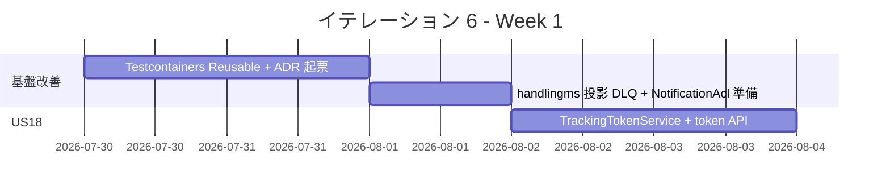
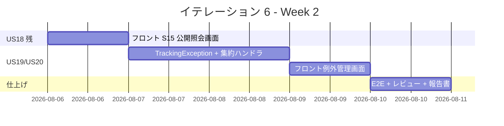
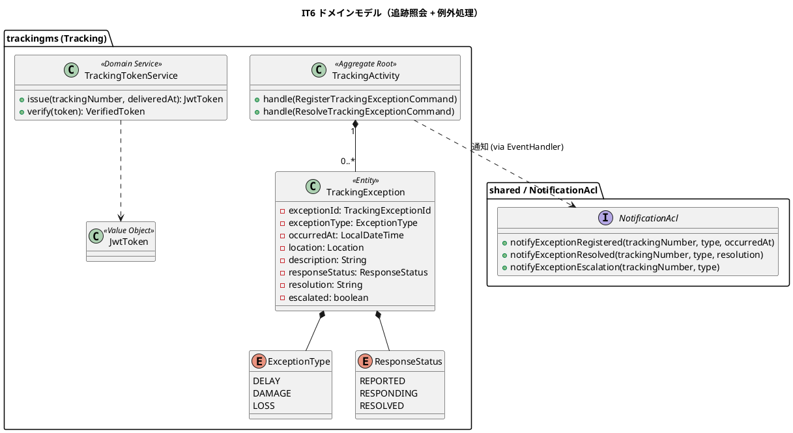

# イテレーション 6 計画（IT6・追跡照会 + 例外処理、Phase 2 / 2）

| 項目 | 内容 |
|------|------|
| **イテレーション** | IT6（追跡照会 + 例外処理） |
| **期間** | 2026-07-30 〜 2026-08-12（計画 2 週間） |
| **計画 SP** | 9（US18:5 / US19:2 / US20:2） |
| **想定ベロシティ** | 10 SP（IT5 実績ベース、IT6 は 9 SP のためバッファあり） |

## ゴール

1. 荷主・荷受人が **時限署名トークン（JWT）でログイン不要に追跡情報を照会** できる公開エンドポイント（US18）を実装し、Release 2.0 の中核機能を完成させる。
2. 追跡管理者が **遅延・破損・紛失の例外を記録し、対応履歴・荷主通知・管理職 escalation** を管理できる例外処理機能（US19/US20）を実装する。
3. IT5 ふりかえり Try（T1-T3, T5）を IT6 序盤に処理し、技術的負債の蓄積を防ぐ。

## 満足条件

### スコープ

- US18: 追跡情報の公開照会（時限署名トークン）
- US19: 遅延例外の記録・対応
- US20: 破損・紛失例外の記録・対応（紛失は管理職 escalation）
- IT5 持ち越し技術負債解消（Kafka 統合テストの構造化、ADR 起票、handlingms 投影改善）

### 受け入れ基準（ユーザーストーリー単位）

#### US18: 追跡情報を照会する（5 SP）

1. 追跡番号を入力して貨物情報を照会できる
2. 現在の状態・位置（港湾名）・推定到着日が表示される
3. 追跡イベント履歴（日時・場所・作業種別）が時系列で表示される
4. 追跡番号が存在しない場合、「追跡番号が見つかりません」と表示される
5. **ログインなしでも追跡番号があれば照会できる**（時限署名トークン / JWT、ADR-0013 採用）

#### US19: 遅延例外を処理する（2 SP）

1. 追跡番号と例外種別「遅延」・発生状況（場所・日時・理由）を記録できる
2. 記録後、貨物状態が「例外発生（EXCEPTION）」に更新される
3. 荷主に遅延発生の通知が送信される（NotificationAcl）
4. 対応内容（新しい到着予定日・対応方針）を入力して荷主に対応報告を送信できる
5. 例外対応履歴が記録される（REPORTED → RESPONDING → RESOLVED）

#### US20: 破損・紛失例外を処理する（2 SP）

1. 追跡番号と例外種別「破損」または「紛失」・発生状況を記録できる
2. 記録後、貨物状態が「例外発生（EXCEPTION）」に更新される
3. 例外種別「紛失」の場合、緊急フラグ（`escalated = TRUE`）が設定されて管理職への escalation 通知が送信される
4. 荷主に破損・紛失発生の通知が送信される
5. 対応内容（補償方針等）を入力して荷主に報告を送信できる

## タスク

### 0. 基盤改善（IT5 持ち越し Try、SP 外）

| # | タスク | 見積もり | 担当 | 状態 | 元 Try |
|---|--------|---------|------|------|--------|
| 0.1 | Testcontainers Reusable + 一意 topic prefix で Kafka container race を構造的解決し、@Tag("kafka-integration") 除外を解除して通常 `check` に戻す | 3h | - | [ ] | T1（最優先） |
| 0.2 | ADR-0012: cross-service 冪等性・トランザクション境界の方針（H3 + MEMORY 既出問題を統合） | 1h | - | [ ] | T2 |
| 0.3 | ADR-0013: 公開追跡照会の時限署名トークン（JWT）採用 | 1h | - | [ ] | US18 設計判断 |
| 0.4 | ADR-0014: @ProcessingGroup 命名規約（cross- / local- / outbound- prefix） | 1h | - | [ ] | T3 |
| 0.5 | handlingms フォールバック投影の根本対処（DLQ 風 `pending_handling_activity` 待避テーブル + CargoSnapshot 到着時 retro-update） | 4h | - | [ ] | T5 |
| 0.6 | NotificationAcl の実メール送信切替準備（ADR、現状スタブから JavaMailSender / SendGrid 等への移行方針） | 1h | - | [ ] | US19/US20 通知の本格化 |

**小計**: 11h（理想時間、SP 外）

### 1. US18 追跡情報照会（5 SP）

| # | タスク | 見積もり | 担当 | 状態 |
|---|--------|---------|------|------|
| 1.1 | trackingms: `TrackingTokenService` ドメインサービス（JWT 発行・検証、有効期限 = `delivered_at + 30 日`、ADR-0013） | 3h | - | [ ] |
| 1.2 | trackingms: `POST /api/v1/tracking/{tn}/token` 認証済みエンドポイント（追跡管理者が荷主向けトークンを発行）| 2h | - | [ ] |
| 1.3 | trackingms: `GET /api/v1/public/tracking/{tn}?token=<JWT>` 公開エンドポイント（Spring Security で permitAll、JwtTokenFilter） | 4h | - | [ ] |
| 1.4 | フロント S15 追跡照会画面（`/tracking/:tn?token=<JWT>`、公開ルート、未認証アクセス可、PrivateRoute 除外） | 4h | - | [ ] |
| 1.5 | フロント `TrackingPublicPage`：現在状態 / 位置 / 推定到着日 / 履歴時系列の表示。404 ハンドリング | 3h | - | [ ] |
| 1.6 | テスト（TrackingTokenService TDD、Controller 単体、@SpringBootTest 統合、フロント Vitest、E2E 公開アクセス） | 3h | - | [ ] |

**小計**: 19h（理想時間）

### 2. US19 遅延例外処理（2 SP）

| # | タスク | 見積もり | 担当 | 状態 |
|---|--------|---------|------|------|
| 2.1 | trackingms: `TrackingException` エンティティ + `ExceptionType` enum（DELAY / DAMAGE / LOSS）+ `ResponseStatus` enum（REPORTED / RESPONDING / RESOLVED）| 2h | - | [ ] |
| 2.2 | trackingms: `TrackingActivity` 集約に `RegisterTrackingExceptionCommand` + `ResolveTrackingExceptionCommand` ハンドラ追加。EXCEPTION 遷移と例外履歴管理 | 3h | - | [ ] |
| 2.3 | `tracking_exception` Read Model 投影（既存 V2 スキーマ利用）+ Mapper + Controller（POST /exceptions、PATCH /exceptions/{id}/resolve、GET /tracking/{tn}/exceptions）| 3h | - | [ ] |
| 2.4 | フロント S18 例外管理画面：例外登録フォーム（種別・場所・日時・理由）+ 一覧 + 対応内容入力 | 3h | - | [ ] |
| 2.5 | NotificationAcl 拡張：`notifyExceptionRegistered` / `notifyExceptionResolved` 追加。テスト | 1h | - | [ ] |

**小計**: 12h（理想時間）

### 3. US20 破損・紛失例外処理（2 SP）

| # | タスク | 見積もり | 担当 | 状態 |
|---|--------|---------|------|------|
| 3.1 | trackingms: `RegisterTrackingExceptionCommand` で DAMAGE / LOSS を受理。`ExceptionType = LOSS` のとき `escalated = TRUE` を集約で自動設定し `TrackingExceptionEscalatedEvent` を発行 | 2h | - | [ ] |
| 3.2 | NotificationAcl 拡張：`notifyExceptionEscalation`（管理職向け）。LoggingNotificationAcl で WARN ログ。実装は IT8 以降 | 1h | - | [ ] |
| 3.3 | フロント S18 で例外種別「破損」「紛失」を選択可能に。紛失の場合は赤色警告バッジで「管理職に escalation 通知済み」を表示 | 2h | - | [ ] |
| 3.4 | テスト（DAMAGE / LOSS 集約・escalation 自動設定・notifyExceptionEscalation 呼び出し検証）| 2h | - | [ ] |

**小計**: 7h（理想時間）

### 4. テスト / 仕上げ

| # | タスク | 見積もり | 担当 | 状態 |
|---|--------|---------|------|------|
| 4.1 | E2E（Playwright）：US18 公開照会フロー（ログイン不要、404 ハンドリング）+ US19/US20 例外登録 → 通知確認 | 3h | - | [ ] |
| 4.2 | SonarQube ライブスキャン + Quality Gate Backend/Frontend 両方 OK 維持。Code Smell 0、カバレッジ閾値達成 | 1h | - | [ ] |
| 4.3 | マルチパースペクティブレビュー実施（developing-review）→ 重要度「高」を IT 内で対応 | 2h | - | [ ] |
| 4.4 | ふりかえり + 完了報告書作成 | 1h | - | [ ] |

**小計**: 7h（理想時間）

### タスク合計

| カテゴリ | SP | 理想時間 | 状態 |
|---------|----|----|------|
| 基盤改善（IT5 Try 持ち越し、SP 外） | - | 11h | [ ] |
| US18 追跡情報照会 | 5 | 19h | [ ] |
| US19 遅延例外処理 | 2 | 12h | [ ] |
| US20 破損・紛失例外処理 | 2 | 7h | [ ] |
| テスト / 仕上げ | - | 7h | [ ] |
| **合計（コミット）** | **9** | **56h** | |

**1 SP あたり**: 約 6.2h（コミット分）。基盤改善 11h + テスト/仕上げ 7h を含めると 56h。

**進捗率**: 0%（0/9 SP）

> **注**: IT5（10 SP）が 2 日で完了している実績を踏まえ、9 SP の IT6 は計画どおり完了可能。基盤改善で技術負債を解消し、後続 IT7/IT8 のベロシティを安定化する。

---

## スケジュール

### Week 1（Day 1-5）

| 日 | タスク |
|----|--------|
| Day 1 | T1: Testcontainers Reusable 化、@Tag 除外解除、`./gradlew check` 安定確認 |
| Day 2 | T2/T3/T6 ADR-0012〜0014 起票 + handlingms フォールバック DLQ 設計 |
| Day 3 | US18 TrackingTokenService（TDD）、JWT 有効期限ロジック、ADR-0013 確定 |
| Day 4 | US18 POST /tracking/{tn}/token + GET /public/tracking/{tn} エンドポイント |
| Day 5 | US18 Spring Security 公開ルート設定 + 統合テスト |

### Week 2（Day 6-10）

| 日 | タスク |
|----|--------|
| Day 6 | US18 フロント `TrackingPublicPage`（S15）、公開ルート、404 ハンドリング |
| Day 7 | US19 / US20 集約・例外エンティティ・投影・Controller |
| Day 8 | US19 / US20 NotificationAcl 拡張、escalation 通知、フロント例外管理画面 |
| Day 9 | E2E（US18 公開照会 + US19/20 例外登録）、SonarQube QG 確認 |
| Day 10 | マルチパースペクティブレビュー + 重要度「高」対応 + ふりかえり + 完了報告書 |

---

## 設計

> **注**: domain-model.md（TrackingException / ExceptionType / ResponseStatus）・data-model.md（tracking_exception テーブル、IT5 で先行作成済み）・ui_design.md（S15 / S18）・ADR-0013（時限署名トークン）に準拠する。

### 主要設計方針

- **時限署名トークン（JWT、ADR-0013）**: 追跡番号 + 有効期限を含む JWT を、追跡管理者が `POST /tracking/{tn}/token` で発行。公開エンドポイント `GET /public/tracking/{tn}` は Spring Security で permitAll とし、JwtTokenFilter で検証する。有効期限は `delivered_at + 30 日`（配送完了から 30 日間照会可能）。
- **例外を集約内エンティティに**: TrackingException は `TrackingActivity` 集約内のエンティティ（domain-model.md）。集約 ID は trackingNumber、例外 ID は集約スコープの ID（IDENTITY）。
- **EXCEPTION 状態への遷移**: 既存 `TransportStatusTransition` で {NOT_RECEIVED, RECEIVED, LOADED, IN_TRANSIT, UNLOADED, AWAITING_CLAIM} → EXCEPTION の遷移は許可済み。例外登録時に自動で EXCEPTION 遷移し、`CargoMisroutedEvent` 相当の `TrackingExceptionRegisteredEvent` を発行。
- **escalation の自動判定**: 集約内で `ExceptionType = LOSS` のときに `escalated = TRUE` を自動設定し、`TrackingExceptionEscalatedEvent` を発行。NotificationAcl が管理職通知を呼び出す。
- **公開照会のセキュリティ**: 推測困難な追跡番号（TRK- + 大文字英数 10 桁）+ JWT 署名で二重防御。トークン共有による情報漏洩リスクは荷主の責任範囲。

### ドメインモデル（IT6 範囲、追加分）

#### 集約の不変条件（IT6 関連）

- **TrackingException**：`exceptionType = LOSS` のとき集約内で `escalated = true` を自動設定。`responseStatus` の遷移は `REPORTED → RESPONDING → RESOLVED` のみ受理し、逆行・スキップは拒否。`resolvedAt` は `responseStatus = RESOLVED` への遷移時のみ設定可能。
- **TrackingActivity（拡張）**：`RegisterTrackingExceptionCommand` 受理時に自動的に EXCEPTION へ遷移し、`exceptions` リストに追加。`ResolveTrackingExceptionCommand` の `exceptionId` が `exceptions` に存在する必要あり。

### ユーザーインターフェース

| 画面 ID | 画面 | パス | ロール | 対応 US |
|---------|------|------|--------|---------|
| S15 | 追跡照会（公開）| `/tracking/:trackingNumber?token=<JWT>` | 公開（ログイン不要）| US18 |
| S18 | 例外管理 | `/tracking/exceptions` | 追跡管理 | US19・US20 |
| S18-detail | 例外詳細・対応入力 | `/tracking/:tn/exceptions/:exId` | 追跡管理 | US19・US20 |

### REST API（IT6 追加分）

| Method | Path | 認証 | 内容 | US |
|--------|------|------|------|----|
| POST | `/api/v1/tracking/{tn}/token` | 追跡管理 | 公開照会用 JWT 発行 | US18 |
| GET | `/api/v1/public/tracking/{trackingNumber}?token=<JWT>` | **permitAll**（JWT 検証）| 公開追跡照会 | US18 |
| POST | `/api/v1/tracking/{trackingNumber}/exceptions` | 追跡管理 | 例外登録（DELAY/DAMAGE/LOSS）| US19/US20 |
| PATCH | `/api/v1/tracking/{trackingNumber}/exceptions/{exceptionId}/resolve` | 追跡管理 | 対応内容入力 + RESOLVED 遷移 | US19/US20 |
| GET | `/api/v1/tracking/{trackingNumber}/exceptions` | 追跡管理 / 公開（JWT）| 例外一覧 | US18/US19/US20 |

---

## リスク

| リスク | 影響 | 対策 |
|--------|------|------|
| 時限署名トークンの設計（鍵管理・有効期限・失効）| 高 | ADR-0013 で方針を明文化。鍵は Heroku Config Vars + jwt.secret-key。失効は MVP では未実装（有効期限切れで自動失効） |
| Testcontainers Reusable 化が技術的に困難（Spring Context キャッシュ互換問題）| 中 | T1 の代替として一意 topic prefix + @DirtiesContext 段階導入。完全解決を IT7 持ち越し可 |
| handlingms DLQ 設計（T5）が IT5 Try の中で最も重い | 中 | 0.5 で 4h 確保。事前到着 / 後追い update の 2 段戦略を ADR-0012 と統合 |
| 例外イベントの cross-service 配信が複数（NotificationAcl 拡張）| 中 | 既存 TrackingNotificationEventHandler に新ハンドラ追加で対応、ADR-0011 ホワイトリスト適用 |
| US18 の公開エンドポイントの SQL Injection / トークン漏洩 | 中 | Spring Security + JWT のベストプラクティス、Bouncy Castle 不使用、HS256 鍵長 32 バイト以上 |

---

## IT5 ふりかえり Try との対応

| Try ID | 内容 | IT6 対応 |
|--------|------|----------|
| **T1** | Testcontainers Reusable で Kafka container race 構造的解決 | **タスク 0.1（Day 1、最優先）** |
| **T2** | cross-service 冪等性・トランザクション境界 ADR | タスク 0.2（ADR-0012） |
| **T3** | @ProcessingGroup 命名規約 ADR | タスク 0.4（ADR-0014） |
| **T4** | 業務適合性向上（通知記録 UI / バーコード / 営業画面） | US19/US20 の NotificationAcl 拡張で部分対応、残りは IT7 |
| **T5** | handlingms フォールバック投影根本対処 | タスク 0.5（DLQ 風 pending_handling_activity）|
| **T6** | フロント型 OpenAPI 自動生成 | IT7 持ち越し（IT6 範囲外）|
| **T7** | マルチパースペクティブレビュー固定化 | タスク 4.3 で継続実施 |

## レビュー残バックログ（IT5 中・低指摘 22 件）

GitHub Issue 化を IT6 序盤で実施推奨。コードベース全体の改善として継続的に消化する。

- programmer 系：shared HandlingTypeCode 化（M1）/ Controller 非同期化（M2）/ Clock 注入（L1-L4）
- architect 系：BookingSagaManager itinerary 型を shared LegData に（M3）/ shared HandlingActivityRegisteredEvent 改名（L6）
- writer 系：architecture_backend API カタログ追記（M5）
- tester 系：Mock 暗黙前提（M10）/ E2E helper 抽出（L12）
- user 系：通知記録 UI（M7）/ EXCEPTION 補助（M8）/ 営業読み取り画面（L7）

## 参照

- [IT6 範囲：US18-US20 ユーザーストーリー](../requirements/user_story.md)
- [IT5 完了報告書](iteration_report-5.md)
- [IT5 ふりかえり](retrospective-5.md)
- [IT5 マルチパースペクティブレビュー](../review/IT5_review_20260529.md)
- [リリース計画](release_plan.md)
- [ドメインモデル設計（Tracking Context / TrackingException）](../design/domain-model.md)
- [データモデル設計（tracking_exception テーブル）](../design/data-model.md)
- [ADR-0009 cross-service イベント連携](../adr/0009-cross-service-event-coordination.md)
- [ADR-0011 Kafka tracking エラーハンドリング](../adr/0011-kafka-tracking-error-handling-policy.md)
