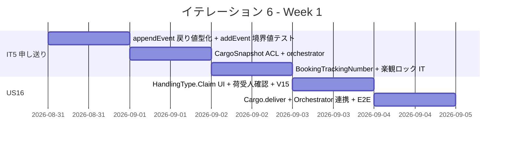
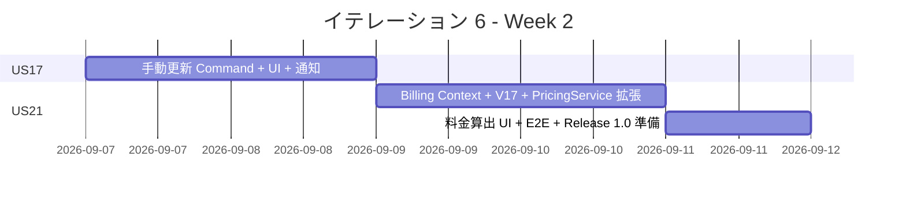
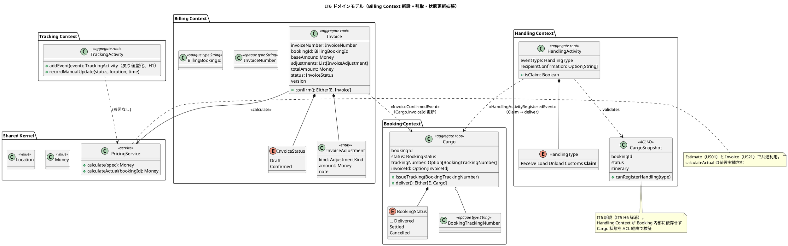
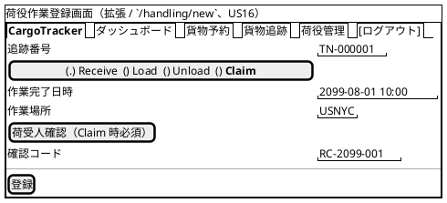

# イテレーション 6 計画

## 概要

| 項目 | 内容 |
|------|------|
| **イテレーション** | 6 |
| **期間** | Week 11-12（2026-08-31 〜 2026-09-13、2 週間） |
| **ゴール** | 引取作業記録（US16）・貨物状態手動更新（US17）・輸送料金算出（US21）を完成させ Release 1.0 MVP をリリースする。IT5 セルフレビュー高優先度 7 件（H1-H7）+ 中観察 3 件（O1-O3）を解消する |
| **目標 SP** | 12（US16: 3 + US17: 3 + US21: 6） |

---

## ゴール

### イテレーション終了時の達成状態

1. **引取作業記録（US16）**: 荷役作業員が引取作業を記録すると荷受人確認（署名 or 確認コード）と共に永続化され、貨物状態が「引取済」（Delivered 相当）に遷移する
2. **貨物状態手動更新（US17）**: 追跡管理者が追跡番号を指定して状態・位置・時刻を手動更新でき、楽観ロックで整合性を保証する
3. **輸送料金算出（US21）**: Billing Context を新設し、引取済予約に対して輸送実績ベースの料金を算出する。US01 見積ロジックと共通化（`PricingService` 経由）
4. **Release 1.0 MVP リリース**: 共通最低ゲート + 増分検証（追跡照会 P95 < 1 秒、E2E シナリオ、見積・料金整合性）を満たし v1.0.0 をリリースする
5. **IT5 申し送り解消**: H1-H7 + O1-O3 を全件解消

### 成功基準

- [ ] US16 / US17 / US21 の受入条件をすべて満たす
- [ ] Release 1.0 MVP 増分検証ゲート pass
- [ ] new_coverage 80% 以上、Quality Gate PASS
- [ ] `appendEvent` 戻り値型化（H1）/ `CargoSnapshot` ACL（H6）/ orchestration サービス分離（H3）が完了
- [ ] `OutOfOrder` 境界値テスト（H4）/ 楽観ロック integration test（H5）追加
- [ ] tracking_number 採番を PostgreSQL シーケンス化（O2）

---

## ユーザーストーリー

### 対象ストーリー

| ID | ユーザーストーリー | SP | 優先度 |
|----|-------------------|----|----|
| US16 | 引取作業を記録する | 3 | 必須 |
| US17 | 貨物状態を手動更新する | 3 | 必須 |
| US21 | 輸送料金を算出する | 6 | 必須 |
| **合計** | | **12** | |

### ストーリー詳細

#### US16: 引取作業を記録する

> 荷役作業員として、荷受人が貨物を引き取る際に荷受人確認を取得して引取作業を記録したい。なぜなら、荷受人への正式な引き渡しを証明し配送完了を記録できるからだ。

**受入条件**:

1. 作業種別「引取」（`HandlingType.Claim`）を選択すると荷受人確認フィールド（署名 or 確認コード）が表示される
2. 荷受人確認が取得されると引取作業が記録される
3. 記録後、貨物状態が「引取済」（`BookingStatus.Delivered`）に更新される
4. 貨物状態「引取済」は配送完了を意味し、精算処理（US21）の開始条件となる

#### US17: 貨物状態を手動更新する

> 追跡管理者として、追跡番号を指定して貨物の状態・位置・更新日時を手動で更新したい。なぜなら、荷役作業員の記録だけでは捕捉できない状態変化（出港・入港等）を追跡情報に反映できるからだ。

**受入条件**:

1. 追跡番号を指定して現在の貨物情報を確認できる
2. 新しい状態・位置・日時を入力して追跡情報を更新できる
3. 更新後、追跡イベントが履歴に記録される（`TrackingActivityEvent` 追記）
4. 楽観ロックで競合更新が拒否される（`OptimisticLockException`）
5. 状態変更の種類に応じて荷主への通知が送信される

#### US21: 輸送料金を算出する

> 経理担当者として、配送完了した予約に対して輸送実績をもとに輸送料金を算出したい。なぜなら、実際の輸送内容に基づく正確な料金を算出し精算に進めるからだ。

**受入条件**:

1. 「引取済」状態の予約に対して料金算出を開始できる
2. 輸送実績（経路・重量・貨物種別・荷役実績）が表示される
3. 基本料金が自動計算される
4. 算出結果を確認して確定操作ができる
5. 確定後、輸送料金が「確定」状態で登録される
6. 例外（遅延・破損等）対応の料金調整入力は IT7 申し送り（US19/US20 と同時実装）

### タスク

#### 0. IT5 申し送り（マルチパースペクティブセルフレビュー高優先度 + 中観察）

| # | タスク | 見積もり | 状態 |
|---|--------|---------|------|
| 0.1 | `TrackingActivityRepository.appendEvent` 戻り値を `Unit` → `TrackingActivity`（新バージョン付き）に変更し呼出側の再利用安全化（H1 解消） | 3h | [ ] |
| 0.2 | `CargoSnapshot` ACL VO を Handling Context に新設、`HandlingCommandService.register` に注入し Cargo 状態（`TrackingIssued`/`InTransit`/`Delivered` 直前まで）を検証（H6 解消） | 4h | [ ] |
| 0.3 | orchestration サービス `BookingHandlingOrchestrator` を application 層に新設し、HandlingActivity 登録 + TrackingActivity event 追記 + 通知ログを単一 `DB.localTx` 境界に統合（H3 解消） | 4h | [ ] |
| 0.4 | `TrackingActivitySpec` に `addEvent` の `OutOfOrder`（時系列逆順）境界値テスト + 同時刻イベント許容テストを追加（H4 解消） | 2h | [ ] |
| 0.5 | `ScalikeJdbcTrackingActivityRepositoryIntegrationSpec`（Testcontainers）に楽観ロック衝突 → `OptimisticLockException` テストを追加（H5 解消） | 3h | [ ] |
| 0.6 | `BookingTrackingNumber` opaque type を Booking Context に新設、`Cargo.issueTracking(BookingTrackingNumber)` でフォーマット検証（H2 解消） | 3h | [ ] |
| 0.7 | `transport_status` 整合性 assertion を `TrackingActivity` 不変条件に追加し、`addEvent` 結果と DB キャッシュの乖離を検出（H7 解消） | 2h | [ ] |
| 0.8 | tracking_number 採番を `MAX(id)+1` → PostgreSQL シーケンス（`DEFAULT nextval('tracking_number_seq')`）に変更（O2 解消） | 3h | [ ] |
| 0.9 | 公開ページ用 `layout/public.scala.html` を切り出し `publicDetail` / `publicNotFound` から呼出（O1 解消） | 2h | [ ] |
| 0.10 | `Itinerary` に leg 詳細（from/to 港湾）を追加し、`HandlingCommandService.register` のルート逸脱判定（`routeDeviation`）を正式実装（O3 解消） | 4h | [ ] |

**小計**: 30h

> **IT6 スコープ外で IT7 以降に申し送り**:
>
> - 例外対応の料金調整入力（US21 受入条件 6）: US19/US20（IT7）と同時実装

#### 1. US16 引取作業記録（3 SP）

| # | タスク | 見積もり | 状態 |
|---|--------|---------|------|
| 1.1 | `HandlingType.Claim` の UI 開放（荷役作業登録画面に「引取」ラジオボタン追加）+ 荷受人確認フィールド（署名 or 確認コード）の条件付き表示 | 3h | [ ] |
| 1.2 | `HandlingActivity` 集約に `recipientConfirmation: Option[String]` フィールド追加 + `Claim` 時必須化のドメイン不変条件 | 2h | [ ] |
| 1.3 | Flyway V15: `handling_activity.recipient_confirmation` カラム追加 | 1h | [ ] |
| 1.4 | `Cargo.deliver()` ドメインメソッド: `Claim` 記録後に `BookingStatus` を `Delivered` に遷移 + canTransitionTo 拡張 | 3h | [ ] |
| 1.5 | `BookingHandlingOrchestrator`（0.3 で新設）に `Claim` → `Cargo.deliver` 連携を追加 | 2h | [ ] |
| 1.6 | E2E（Claim 登録 → 貨物状態 Delivered + TrackingStatus Claimed + 配送完了通知）+ ユニットテスト（荷受人確認必須 / Delivered 遷移） | 3h | [ ] |

**小計**: 14h

#### 2. US17 貨物状態手動更新（3 SP）

| # | タスク | 見積もり | 状態 |
|---|--------|---------|------|
| 2.1 | `UpdateTrackingStatusCommand` + `TrackingCommandService.updateStatus(trackingNumber, status, location, occurredAt)` 実装。楽観ロック付き | 3h | [ ] |
| 2.2 | `TrackingActivity.recordManualUpdate(status, location, time)`: イベント履歴に `TrackingActivityEvent` を追記 + `transport_status` 同期 | 3h | [ ] |
| 2.3 | 追跡詳細画面（`/tracking/:trackingNumber`）に Tracker ロール限定で「状態を手動更新」ボタン + モーダルフォーム（状態セレクト / 港湾 / 日時） | 4h | [ ] |
| 2.4 | `NotificationType.ManualStatusUpdated` 追加 + Flyway V16（notification_log CHECK 拡張）+ payload | 2h | [ ] |
| 2.5 | E2E（Tracker ログイン → 手動更新 → 履歴反映 + 通知記録 + 競合時 OptimisticLockException）+ ユニットテスト | 3h | [ ] |

**小計**: 15h

#### 3. US21 輸送料金算出（6 SP）

| # | タスク | 見積もり | 状態 |
|---|--------|---------|------|
| 3.1 | Billing Context 新設: `Invoice` 集約（`invoiceNumber` / `bookingId` / `baseAmount` / `adjustments` / `totalAmount` / `status` / `version`）+ `InvoiceStatus` enum（Draft / Confirmed）+ `InvoiceRepository` ポート | 4h | [ ] |
| 3.2 | Flyway V17: `invoice` テーブル + `invoice_adjustment` 子テーブル + `cargo.invoice_id` 参照（Read Model 用） | 2h | [ ] |
| 3.3 | `PricingService` を `shared.domain.pricing` に拡張: 既存 `InMemoryPricingService` を Estimate 共通利用に保ち、`Invoice` 用 `calculateActual(bookingId)` メソッドを追加（US01 見積ロジックと共通化） | 3h | [ ] |
| 3.4 | `CalculateInvoiceCommand` + `BillingCommandService.calculate(bookingId)` 実装。Delivered 状態必須、輸送実績取得（経路 / 重量 / 貨物種別 / 荷役回数） | 4h | [ ] |
| 3.5 | `ConfirmInvoiceCommand` + `BillingCommandService.confirm(invoiceNumber)`: Draft → Confirmed 遷移 + 楽観ロック | 2h | [ ] |
| 3.6 | 料金算出画面 `/invoices/new`（予約番号入力 → 算出 → 確認）+ 料金一覧 `/invoices` + 詳細 `/invoices/:invoiceNumber`（経路 / 重量 / 荷役実績 + 基本料金内訳表示） | 5h | [ ] |
| 3.7 | Settlement ロール（または MasterAdmin）でダッシュボードに「料金算出」カード追加 | 2h | [ ] |
| 3.8 | E2E（引取済予約 → 料金算出 → 確定 → 一覧表示 + 見積金額との整合性確認）+ ユニットテスト（PricingService 共通化 / Delivered 必須 / 確定後の再計算禁止） | 4h | [ ] |

**小計**: 26h

#### タスク合計

| カテゴリ | SP | 理想時間 |
|---------|----|----|
| IT5 申し送り（0.x） | - | 30h |
| US16 引取作業記録 | 3 | 14h |
| US17 貨物状態手動更新 | 3 | 15h |
| US21 輸送料金算出 | 6 | 26h |
| **合計** | **12** | **85h** |

**1 SP あたり**: 約 7.1h（IT5 申し送り含む / 機能タスクのみなら 4.6h）
**進捗率**: 0% (0/12 SP)

---

## スケジュール

### Week 1（Day 1-5）



| 日 | タスク |
|----|--------|
| Day 1 | 0.1 appendEvent 戻り値化（H1）/ 0.4 OutOfOrder テスト（H4） |
| Day 2 | 0.2 CargoSnapshot（H6）/ 0.3 Orchestrator（H3） |
| Day 3 | 0.5 楽観ロック IT（H5）/ 0.6 BookingTrackingNumber（H2）/ 0.7 transport_status assertion（H7）/ 0.8 シーケンス採番（O2）/ 0.9 公開 layout（O1）/ 0.10 Itinerary leg + 逸脱判定（O3） |
| Day 4 | 1.1-1.3 US16 UI + ドメイン + V15 |
| Day 5 | 1.4-1.6 US16 deliver + Orchestrator + E2E |

### Week 2（Day 6-10）



| 日 | タスク |
|----|--------|
| Day 6 | 2.1-2.3 US17 Command + 集約メソッド + UI |
| Day 7 | 2.4-2.5 US17 通知 + V16 + E2E |
| Day 8 | 3.1-3.3 US21 Billing Context + V17 + PricingService 共通化 |
| Day 9 | 3.4-3.6 US21 Command + 確定 + UI |
| Day 10 | 3.7-3.8 ダッシュボード + E2E + 統合テスト + Release 1.0 MVP リリース準備 |

---

## 設計

### ドメインモデル

IT5 までで確立した Booking / Routing / Tracking / Handling Context に、IT6 で **Billing Context** を新設する。`Invoice` 集約ルートが `InvoiceAdjustment` 子エンティティを持ち、Booking との連携は `BillingBookingId` ACL + ドメインイベント（`InvoiceConfirmedEvent`）で実施する。`PricingService`（Shared Kernel 配下 `shared.domain.pricing`）を Estimate（US01）と Invoice（US21）で共通利用する。



#### 不変条件（IT6 追加分）

1. `HandlingActivity.recipientConfirmation` は `eventType == Claim` のとき必須（空 or 未指定なら `RecipientConfirmationRequired`）
2. `Cargo.deliver` は `Claim` 荷役記録経由（`HandlingActivityRegisteredEvent`）でのみ呼出可。直接呼出は `DomainError.InvalidOperation`
3. `Invoice` は `BookingStatus.Delivered` の予約に対してのみ作成可
4. `Invoice.confirm` は `Draft` 状態でのみ実行可、`Confirmed` への 1 方向遷移
5. `Confirmed` の `Invoice` は再計算不可（idempotent / 再計算したい場合は補正用 `InvoiceAdjustment` を追加）
6. `TrackingActivity.recordManualUpdate` の `occurredAt` は最終イベントより未来でなければならない（H4 と同様）
7. `BookingTrackingNumber` は `Cargo.issueTracking` 時に opaque type 検証通過のみ受理（H2）
8. `transport_status` カラムは書込トランザクション内で `deriveStatus(events)` と一致することを assertion（H7）

#### BookingStatus 遷移マトリクス（IT6 拡張版）

| from \ to | InTransit | **Delivered** | Settled | Cancelled |
|-----------|:---------:|:-------------:|:-------:|:---------:|
| **TrackingIssued** | ✓（IT5）| - | - | - |
| **InTransit** | - | **✓（US16 / IT6）** | - | - |
| **Delivered** | - | - | ✓（IT7 US23）| - |

太字は IT6 で新規追加する遷移（`InTransit → Delivered`）。

### データモデル

V14 まで適用済の IT5 状態に対し、IT6 で **V15 / V16 / V17** を追加する。

#### V15: handling_activity.recipient_confirmation（US16）

```sql
ALTER TABLE handling_activity
  ADD COLUMN recipient_confirmation VARCHAR(500);
-- ドメイン側で eventType=Claim 時の必須化を担保（DB 制約は緩い）
```

#### V16: notification_log CHECK 拡張（US17 / US16）

```sql
ALTER TABLE notification_log DROP CONSTRAINT ck_notification_log_type;
ALTER TABLE notification_log ADD CONSTRAINT ck_notification_log_type
    CHECK (type IN ('RouteNotified', 'BookingConfirmed', 'BookingCancelled',
                    'TrackingIssued', 'HandlingRecorded',
                    'ManualStatusUpdated', 'DeliveryCompleted'));
```

#### V17: invoice + invoice_adjustment（US21）

```sql
CREATE TABLE invoice (
  id BIGSERIAL PRIMARY KEY,
  invoice_number VARCHAR(20) NOT NULL,
  booking_id VARCHAR(20) NOT NULL,
  base_amount_value BIGINT NOT NULL,
  base_amount_currency VARCHAR(3) NOT NULL,
  total_amount_value BIGINT NOT NULL,
  total_amount_currency VARCHAR(3) NOT NULL,
  status VARCHAR(20) NOT NULL CHECK (status IN ('Draft', 'Confirmed')),
  version INT NOT NULL DEFAULT 0,
  created_at TIMESTAMP NOT NULL DEFAULT CURRENT_TIMESTAMP,
  updated_at TIMESTAMP NOT NULL DEFAULT CURRENT_TIMESTAMP,
  CONSTRAINT uk_invoice_invoice_number UNIQUE (invoice_number),
  CONSTRAINT uk_invoice_booking UNIQUE (booking_id)
);
CREATE INDEX idx_invoice_booking ON invoice (booking_id);
CREATE INDEX idx_invoice_status ON invoice (status);

CREATE TABLE invoice_adjustment (
  id BIGSERIAL PRIMARY KEY,
  invoice_id BIGINT NOT NULL REFERENCES invoice (id) ON DELETE CASCADE,
  kind VARCHAR(30) NOT NULL,
  amount_value BIGINT NOT NULL,
  amount_currency VARCHAR(3) NOT NULL,
  note VARCHAR(500),
  created_at TIMESTAMP NOT NULL DEFAULT CURRENT_TIMESTAMP,
  updated_at TIMESTAMP NOT NULL DEFAULT CURRENT_TIMESTAMP
);
CREATE INDEX idx_invoice_adjustment_invoice ON invoice_adjustment (invoice_id);

-- cargo.invoice_id（Read Model 用、Booking ⇆ Billing 連携の denormalize）
ALTER TABLE cargo ADD COLUMN invoice_id BIGINT;
CREATE INDEX idx_cargo_invoice_id ON cargo (invoice_id);

-- O2: tracking_number 採番をシーケンス化
CREATE SEQUENCE tracking_number_seq START WITH 1000 INCREMENT BY 1;
-- 既存テーブルは触らない（採番ロジック側で nextval('tracking_number_seq') を利用）
```

### ユーザーインターフェース

#### ビュー



#### 画面一覧（IT6 追加・拡張）

| 画面名 | URL | 説明 | アクセスロール | 関連 US |
|--------|-----|------|---------------|---------|
| 荷役登録（拡張）| `/handling/new` | Claim 種別 + 荷受人確認フィールド | Handler, Tracker | **US16** |
| 追跡詳細（拡張）| `/tracking/:trackingNumber` | 手動更新モーダル（Tracker 限定）| Tracker | **US17** |
| 料金算出（新規）| `/invoices/new` | 予約 ID 指定で輸送実績表示 + 基本料金計算 | Settlement, MasterAdmin | **US21** |
| 料金一覧（新規）| `/invoices` | 算出済み料金の一覧（Draft / Confirmed）| Settlement, MasterAdmin | **US21** |
| 料金詳細（新規）| `/invoices/:invoiceNumber` | 経路・荷役実績・基本料金内訳 + 確定操作 | Settlement, MasterAdmin | **US21** |

#### API 設計

| メソッド | エンドポイント | 説明 | 関連 US |
|---------|---------------|------|---------|
| POST | `/tracking/:trackingNumber/manual-update` | 状態手動更新（PRG）| US17 |
| GET | `/invoices` | 料金一覧 | US21 |
| GET | `/invoices/new` | 算出フォーム | US21 |
| POST | `/invoices` | 料金算出（Draft 作成）| US21 |
| GET | `/invoices/:invoiceNumber` | 料金詳細 | US21 |
| POST | `/invoices/:invoiceNumber/confirm` | 料金確定 | US21 |

### ADR

| ADR | タイトル | ステータス | 関連タスク |
|-----|---------|-----------|------|
| [ADR 0011](../adr/0011-cargo-snapshot-acl-pattern.md) | `CargoSnapshot` ACL VO による Handling → Booking 状態検証パターン | 提案（IT6 Day 2 起案） | 0.2 |
| [ADR 0012](../adr/0012-pricing-service-shared-actual-pattern.md) | `PricingService.calculateActual` を Estimate（US01）と Invoice（US21）で共通利用するパターン | 提案（IT6 Day 8 起案） | 3.3 |
| [ADR 0013](../adr/0013-tracking-number-sequence-policy.md) | tracking_number 採番ポリシーを `MAX(id)+1` → PostgreSQL シーケンス（`tracking_number_seq`）に変更 | 提案（IT6 Day 3 起案、ADR 0010 更新）| 0.8 |

---

## リスクと対策

| リスク | 影響度 | 対策 |
|--------|--------|------|
| Billing Context 新設で集約境界判断が IT6 内で揺れる | 高 | Day 8 朝に ADR 0012 で `Invoice` 集約境界 + `PricingService` 共通化を確定 |
| US01 見積料金と US21 算出料金の整合性検証コスト | 中 | `PricingService` テストで両者が同一公式を使うことを property test 化 |
| IT5 申し送り 30h が機能タスクを圧迫 | 高 | Day 1-3 で集中消化、圧迫時は O1（公開 layout）/ O3（ルート逸脱）を IT7 に申し送り |
| US21 が 6 SP + 26h と最大、Billing Context 新設の見積もりズレ | 高 | 3.1-3.3 を Day 8 で完了させ、UI/E2E（3.6-3.8）に余裕を確保 |
| Release 1.0 MVP のリリースゲート（追跡照会 P95 < 1 秒）達成 | 中 | TrackingQueryService に Read Model キャッシュ追加（H7 と統合） |
| `Cargo.deliver` を `HandlingActivityRegisteredEvent` 経由限定にすることでテスト難化 | 中 | Orchestrator（0.3）のユニットテストで Claim → deliver 連携を直接検証 |

---

## 完了条件

### Definition of Done

- [ ] 全タスクのコード変更が完了
- [ ] ユニット / 統合 / E2E テストがパス（new_coverage 80% 以上）
- [ ] **Release 1.0 MVP 業務導線 E2E**（予約 → 経路確定 → 追跡 → 荷役（Receive/Load/Unload/Claim）→ 引取済 → 料金算出・確定）が緑
- [ ] **追跡照会 P95 < 1 秒** 達成（追跡詳細 + 公開照会の両方）
- [ ] **見積（US01）と料金算出（US21）の整合性**: 同一条件で同一金額が出ることを property test で実証
- [ ] scalafmt / scalafix エラーなし
- [ ] SonarQube Quality Gate PASS
- [ ] Playwright E2E 全件緑（IT6 で 5 件以上追加）
- [ ] ドキュメント更新完了（domain-model.md に Billing Context 反映、data-model.md に V15-V17 追記、ui_design.md に料金算出画面追加、release_plan.md の進捗更新）
- [ ] **validating-iteration-plan 検証で不整合 0 件**
- [ ] **Release 1.0 MVP リリース準備完了**（CHANGELOG / ゲートチェック）

### デモ項目

1. 荷役作業員が `/handling/new` で `Claim` 種別 + 荷受人確認を入力 → 貨物状態が `Delivered` に遷移
2. Tracker が `/tracking/:trackingNumber` で「状態を手動更新」モーダルから手動更新 → 履歴に反映 + 通知記録
3. Settlement が `/invoices/new` で引取済予約の料金算出 → 基本料金表示 → 確定 → 一覧に Confirmed 表示
4. 見積（US01）の料金と US21 算出料金が同一条件で一致することを画面比較で実証
5. Release 1.0 MVP として荷主中核体験 + 引取 + 手動更新 + 料金算出の一気通貫が動作

---

## 更新履歴

| 日付 | 更新内容 | 更新者 |
|------|---------|--------|
| 2026-06-22 | 初版作成（IT5 ふりかえり Try 10 件 + IT5 セルフレビュー H1-H7 + O1-O3 を 0.x に取り込み、US16/US17/US21 を機能タスクとして計画、Billing Context 新設、Release 1.0 MVP リリース準備）| AI Agent |

---

## 関連ドキュメント

- [リリース計画](./release_plan.md)
- [IT5 計画](./iteration_plan-5.md)
- [IT5 完了報告書](./iteration_report-5.md)
- [IT5 ふりかえり](./retrospective-5.md)
- [IT5 セルフレビュー](../review/it5_self_review_20260622.md)
- [ドメインモデル設計](../design/domain-model.md)
- [データモデル設計](../design/data-model.md)
- [UI 設計](../design/ui_design.md)
- [ADR 0010 追跡番号採番ポリシー](../adr/0010-tracking-number-policy.md)（IT6 で ADR 0013 によりシーケンス化に更新予定）
