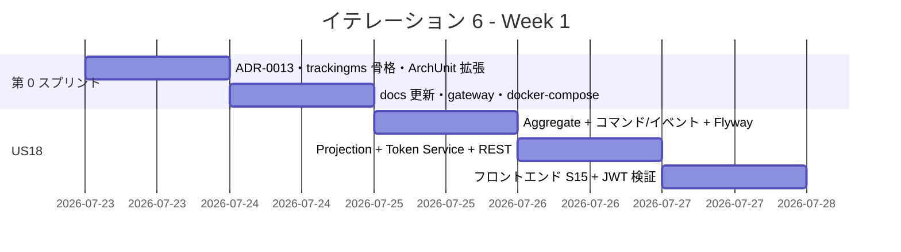
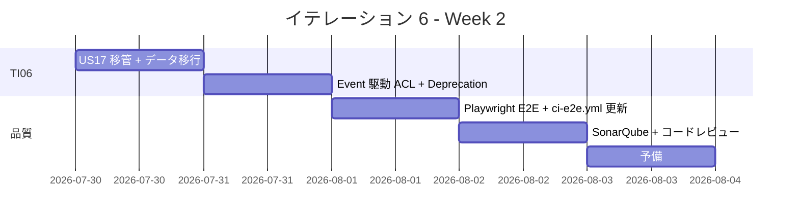
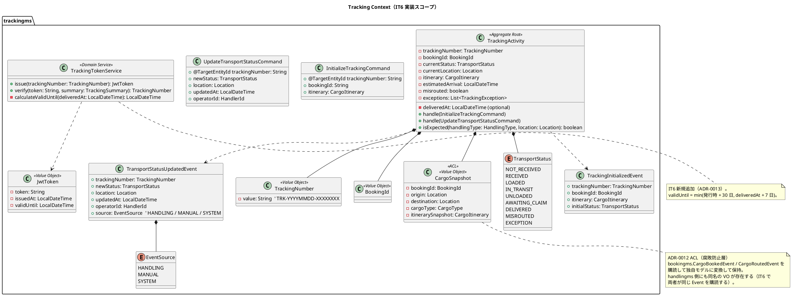
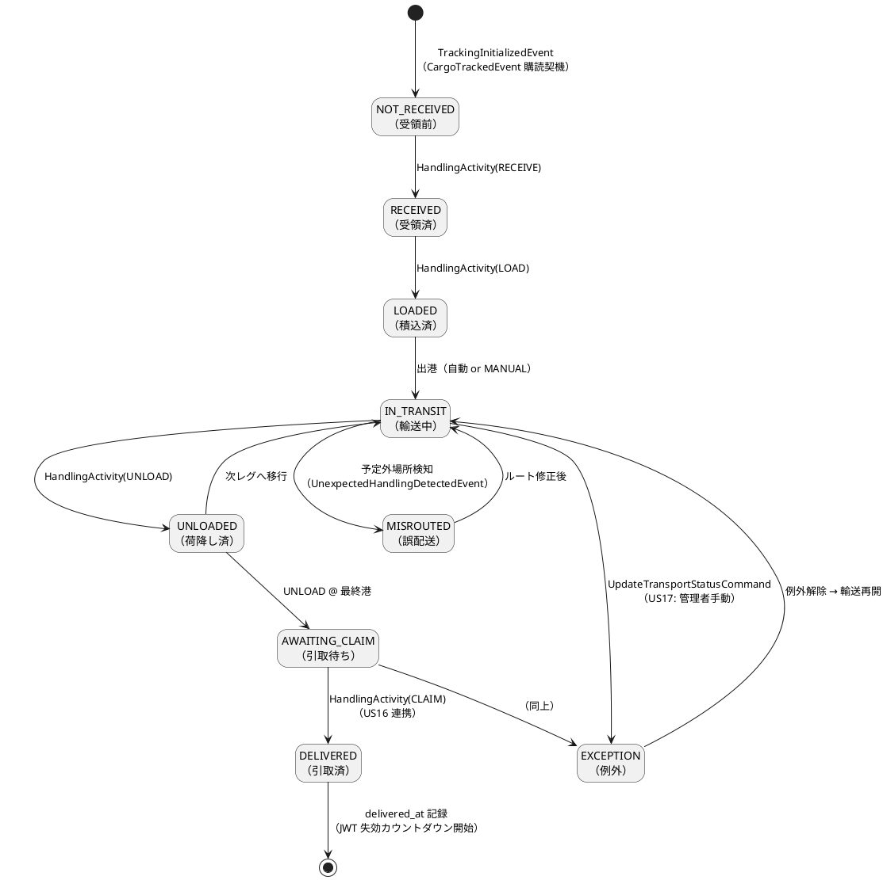
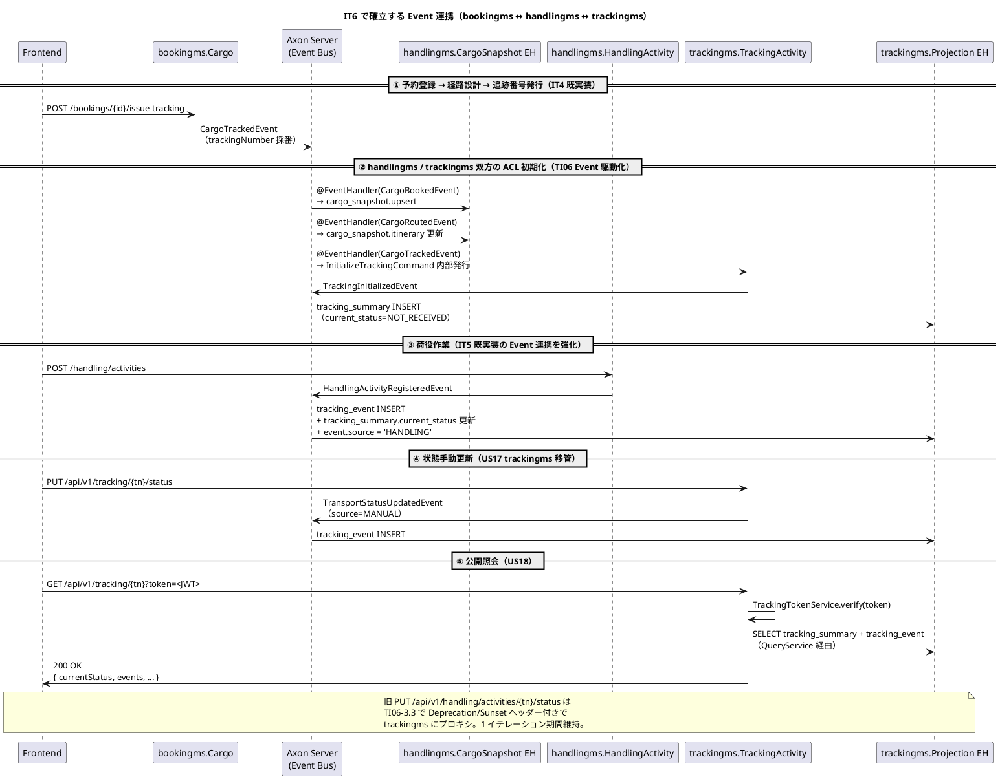
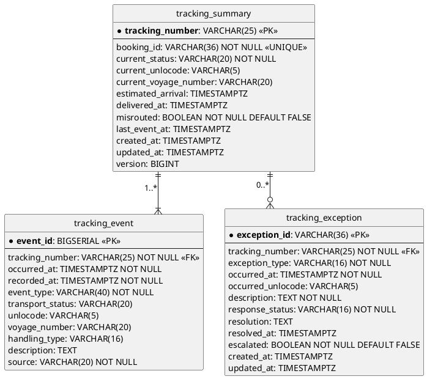
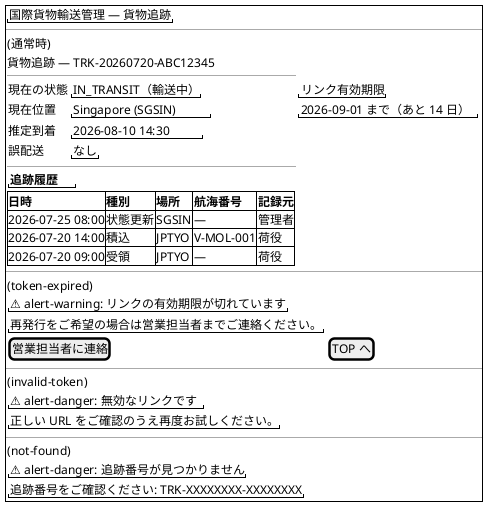
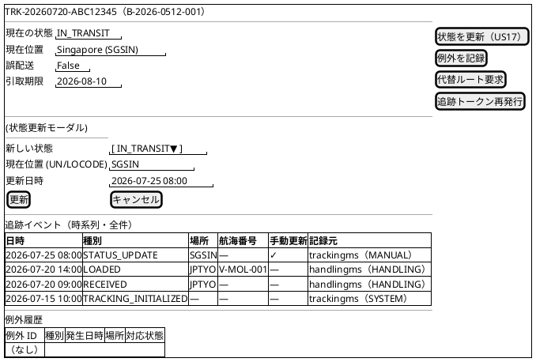
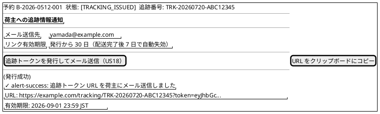
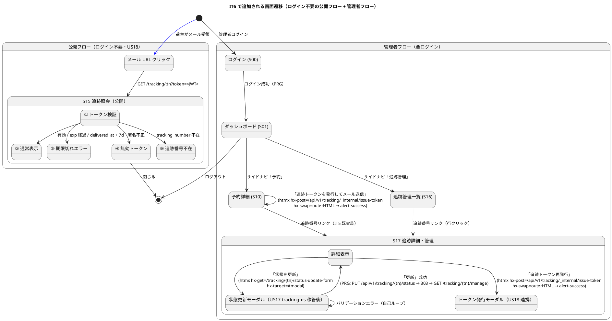

# イテレーション 6 計画

## 概要

| 項目 | 内容 |
|------|------|
| **イテレーション** | 6 / 8 |
| **期間** | Week 11-12（2026-07-23 〜 2026-08-05） |
| **ゴール** | `trackingms` を新設し追跡情報照会（US18）を実装、IT5 暫定実装の US17 を trackingms へ移管して責務分離を完成させる |
| **目標 SP** | 8（新規 5 SP + IT5 暫定解消 3 SP） |
| **基準ベロシティ** | IT2-5 平均 13.7 SP（IT4 特例 25 を除く）。IT6 は意図的に低スコープで持続可能ペース継続 |

> **ADR-0012 第 2 段階**: IT5 で `handlingms` 暫定実装した US17 を、IT6 の `trackingms` 新設に伴い正式に移管する。`cargo_status_history` テーブルから `tracking_event` テーブルへのデータ移行と API エンドポイント Deprecation を IT6 に含める。

> **TI05 対応（IT6 第 0 スプリント）**: IT5 ふりかえり Try（T1-T5）を着手前に解消し、IT4 H1（@TargetEntityId）と IT5 P1（@CommandHandler）の類似障害の再発を防止する。

---

## ゴール

### イテレーション終了時の達成状態

1. **trackingms 稼働（TI05）**: Axon Event Sourcing による `TrackingActivity` Aggregate が起動し、`bookingms` の `CargoTrackedEvent` と `handlingms` の `HandlingActivityRegisteredEvent` をサブスクライブして Read Model を構築できる
2. **追跡情報照会（US18）**: 荷主・荷受人がメールリンクの時限署名トークン経由で `/tracking/{tn}?token=<JWT>` から貨物情報・追跡履歴・推定到着日を照会できる（システム内ログイン不要）
3. **US17 trackingms 移管**: IT5 で handlingms 暫定実装した `UpdateCargoStatusCommand` を `trackingms` に移管し、handlingms の責務を「荷役作業記録のみ」に純化する（ADR-0012 準拠）
4. **CargoSnapshot ACL の Event 駆動化**: handlingms / trackingms 双方の `CargoBookedEvent` / `CargoRoutedEvent` 購読が Axon Event Bus 経由で自動維持される（IT5 暫定 REST `POST /cargo-snapshots` を廃止）

### 成功基準

- [ ] `GET /api/v1/tracking/{trackingNumber}?token=<JWT>` で追跡情報を返却（US18）
- [ ] JWT トークンの検証（有効期限 30 日・配送完了後 7 日失効）が機能する
- [ ] `PUT /api/v1/tracking/{trackingNumber}/status` が trackingms 側で動作する（US17 移管）
- [ ] `tracking_summary` / `tracking_event` テーブルが `CargoBookedEvent` / `CargoRoutedEvent` / `HandlingActivityRegisteredEvent` 購読で自動更新される
- [ ] 旧エンドポイント `PUT /api/v1/handling/activities/{trk}/status` が Deprecation Warning ヘッダーを返す
- [ ] trackingms / handlingms 両方の Aggregate static command handler に `@CommandHandler` が ArchUnit で強制される
- [ ] フロントエンドの追跡照会画面（S15）が動作する
- [ ] Playwright E2E（US18 トークン経由照会）が追加・全通過する
- [ ] SonarQube Quality Gate PASS（new_coverage ≥ 80%・violations 0）

---

## ユーザーストーリー

### 対象ストーリー

| ID | ユーザーストーリー | SP | 優先度 | 区分 |
|----|------------------|----|----|------|
| TI05 | IT6 第 0 スプリント（trackingms 骨格・ADR-0013・IT5 Try T1-T4 対応） | 2 | 必須 | 技術タスク |
| US18 | 追跡情報を照会する | 5 | 必須 | 新規 |
| TI06 | US17 を handlingms から trackingms へ移管 + Event 駆動 ACL 化 | 1 | 必須 | 技術的負債解消 |
| **合計** | | **8** | | |

> **フィーチャバッファ**: IT4 中優先度指摘 M1〜M6 は時間余剰時に着手（バックログ持越し継続）。

### ストーリー詳細

#### TI05: IT6 第 0 スプリント

**目的**: trackingms の Axon Event Sourcing 骨格を確立し、IT5 ふりかえり Try（T1-T4）を解消する。

**受入条件**:

1. trackingms に `TrackingActivity` Aggregate クラスが存在し Spring Boot が起動できる（ポート 8086）
2. ADR-0013「Tracking Number JWT 時限トークン設計」が承認済み（IT4 M3 対応）
3. ArchUnit ルール「Aggregate static メソッドで *Command を引数に取るものは `@CommandHandler` 必須」が bookingms / routingms / handlingms / trackingms 全 4 サービスに適用される（IT5 T1 対応）
4. `docs/reference/コーディングとテストガイド.md` に「Axon 5.1 Static Command Handler 引数規約」と「`*Record` 変数名規約」を追記（IT5 T2/T3 対応）
5. `docs/design/tech_stack.md` の「実装着手前の確認チェックリスト」に「Java major version 対応」項目を追加（IT5 T4 対応）

#### US18: 追跡情報を照会する（UC15）

**ストーリー**:

> 荷主（または荷受人）として、追跡番号を入力して貨物の現在位置・状態・追跡イベント履歴・推定到着日を確認したい。なぜなら、輸送状況をいつでも自分で確認でき、到着準備や業務計画に役立てるからだ。

**受入条件**:

1. 追跡番号を入力して貨物情報を照会できる
2. 現在の状態・位置（港湾名）・推定到着日が表示される
3. 追跡イベント履歴（日時・場所・作業種別）が時系列で表示される
4. 追跡番号が存在しない場合、「追跡番号が見つかりません」と表示される
5. **荷主・荷受人へのメール通知に含まれる時限署名トークン付き URL（`/tracking/{tn}?token=<JWT>`）から照会できる**（システム内ログイン不要）
6. **トークンは有効期限 30 日、配送完了後 7 日で自動失効する**
7. **トークン検証失敗時は「リンクの有効期限が切れています」と表示し営業担当者連絡を促す**

**ADR-0013 対応**:

- JWT トークン形式: `tn`（追跡番号）・`exp`（有効期限）・`iss`（発行者）クレーム
- 署名アルゴリズム: HMAC-SHA256（authms と同じ秘密鍵を Config Vars 経由で共有）
- 配送完了後 7 日失効は `tracking_summary.delivered_at + 7d` で検証

#### TI06: US17 移管 + Event 駆動 ACL

**目的**: ADR-0012 で IT5 暫定実装と明記した責務違反を解消し、handlingms の責務を「荷役作業のみ」に純化する。

**受入条件**:

1. `UpdateCargoStatusCommand` / `CargoStatusUpdatedEvent` が `trackingms` 側に移管される
2. `PUT /api/v1/tracking/{trackingNumber}/status` が trackingms で動作する
3. 旧 `PUT /api/v1/handling/activities/{trk}/status` は `Deprecation` / `Sunset` HTTP ヘッダーを返し、内部で trackingms にプロキシする（1 イテレーション期間維持）
4. `cargo_status_history` テーブルのデータが Flyway スクリプトで `tracking_event` に移行される
5. handlingms の `CargoSnapshot` 維持が `CargoBookedEvent` / `CargoRoutedEvent` の Axon Event 購読で自動化される（IT5 暫定 `POST /api/v1/handling/cargo-snapshots` を廃止）
6. trackingms も同じ Event を購読して独自の `tracking_summary` を維持する
7. フロントエンド S17 の状態更新先 URL を `/api/v1/tracking/...` に切替

---

## タスク

### 1. TI05: IT6 第 0 スプリント（2 SP）

| # | タスク | 見積もり | 状態 |
|---|--------|---------|------|
| 1.1 | ADR-0013 起票（Tracking Number JWT 時限トークン設計） | 2h | [x] |
| 1.2 | trackingms 骨格作成（Spring Boot + Axon + Flyway 設定・ポート 8086） | 3h | [x] |
| 1.3 | ArchUnit ルール拡張: `@CommandHandler` 強制を 4 サービス共通化（IT5 T1） | 2h | [x] |
| 1.4 | コーディングガイド更新: Axon static handler 規約 + `*Record` 変数名規約（IT5 T2/T3） | 1h | [x] |
| 1.5 | tech_stack.md に Java major version 確認項目追加（IT5 T4） | 0.5h | [x] |
| 1.6 | gatewayms に `/api/v1/tracking/**` ルーティング追加 | 0.5h | [x] |
| 1.7 | docker-compose.yml に trackingms / tracking_read_db 追加 | 1h | [x] |

**小計**: 10h（完了）

### 2. US18: 追跡情報を照会する（5 SP）

| # | タスク | 見積もり | 状態 |
|---|--------|---------|------|
| 2.1 | `TrackingActivity` Aggregate + `InitializeTrackingCommand` + `UpdateTransportStatusCommand` | 3h | [x] |
| 2.2 | `TrackingInitializedEvent` / `TransportStatusUpdatedEvent` 定義 | 1h | [x] |
| 2.3 | Flyway V002: `tracking_summary` / `tracking_event` / `tracking_exception` / `cargo_snapshot` テーブル作成 | 2h | [x] |
| 2.4 | `TrackingProjectionsEventHandler`: `TrackingInitializedEvent` / `TransportStatusUpdatedEvent` 購読 → Read Model 更新（クロスサービス Event 購読は TI06 で実装） | 3h | [x] |
| 2.5 | `TrackingQueryService`（Query Side）: tracking_summary + tracking_event の集約取得 | 2h | [x] |
| 2.6 | `TrackingTokenService`: JWT 生成（発行）・検証（exp + delivered_at + 7d） | 2h | [x] |
| 2.7 | `TrackingController` `GET /api/v1/tracking/{trackingNumber}` （トークンクエリパラメタ）+ `_internal/issue-token` + `_internal/initialize` | 2h | [x] |
| 2.8 | ユニットテスト（Aggregate + Token Service + Projection）+ 統合テスト | 3h | [x] |
| 2.9 | フロントエンド S15 追跡照会画面（公開 URL・ログイン不要・時限トークン検証） | 3h | [x] |

**小計**: 21h（完了）

### 3. TI06: US17 移管 + Event 駆動 ACL（1 SP）

| # | タスク | 見積もり | 状態 |
|---|--------|---------|------|
| 3.1 | trackingms に `UpdateTransportStatusCommand` / `TransportStatusUpdatedEvent` を実装（US18 で先行実装） | 1h | [x] |
| 3.2 | trackingms に `PUT /api/v1/tracking/{trackingNumber}/status` REST 実装 | 1h | [x] |
| 3.3 | handlingms の旧エンドポイントに Deprecation/Sunset ヘッダー追加 | 1h | [x] |
| 3.4 | Flyway 移行スクリプト: `cargo_status_history` → `tracking_event` データコピー | 1h | 持ち越し |
| 3.5 | handlingms の `POST /cargo-snapshots` を廃止し `CargoBookedEvent` 購読 EventHandler に置換 | 1h | 持ち越し |
| 3.6 | フロントエンド S17 の状態更新先 URL を `/api/v1/tracking/...` に変更 | 0.5h | [x] |

**小計**: 5.5h（3.2 / 3.3 / 3.6 完了 + 3.1 は US18 で先行実装済み）

> **持ち越し理由**: 3.4 / 3.5 はクロスサービス Event 連携の本実装で、bookingms の Event クラスを
> `shared` モジュールに昇格する大改修が必要。in-memory H2 環境では DB 移行スクリプトも実用性が低い。
> IT7 の独立技術タスクとして以下を計画する:
>
> - shared モジュールの有効化（settings.gradle.kts include / build.gradle.kts）
> - bookingms.CargoBookedEvent / CargoRoutedEvent / CargoTrackedEvent / TrackingNumberIssuedEvent を shared に移動
> - handlingms / trackingms に shared 依存追加 + Event 駆動 ACL 実装
> - handlingms の旧 `POST /cargo-snapshots` を Deprecated → 削除（Deprecation ヘッダーで段階移行）
> - 旧 `PUT /api/v1/handling/activities/{tn}/status` は本 TI06 で Deprecation ヘッダー追加済み（Sunset: 2026-08-30）

### 4. E2E テスト + 品質確認

| # | タスク | 見積もり | 状態 |
|---|--------|---------|------|
| 4.1 | Playwright E2E: US18 追跡照会フロー（トークン発行 → 照会 → 期限切れ検証 + S16 一覧） | 2h | [x] |
| 4.2 | ci-e2e.yml に trackingms (8086) を起動対象に追加 | 0.5h | [x] |
| 4.3 | SonarQube スキャン・violations 修正（new_coverage 83.5% / new_violations 0） | 1h | [x] |
| 4.4 | コードレビュー（`developing-review`） | 1h | [x]（`docs/review/IT6_implementation_review_20260518.md` 作成・高 12 件/中 16 件/低 12 件） |

**小計**: 4.5h（4.1-4.4 すべて完了）

### タスク合計

| カテゴリ | SP | 理想時間 | 状態 |
|---------|----|----|------|
| TI05 第 0 スプリント | 2 | 10h | [x] |
| US18 追跡情報照会 | 5 | 21h | [x] |
| TI06 US17 移管 + Event ACL（コア） | 1 | 5.5h | [x]（Event 駆動 ACL は IT7 持ち越し）|
| E2E・品質確認 | — | 4.5h | [ ] |
| **合計** | **8** | **41h** | |

**1 SP あたり**: 約 4.6h（実装 + テスト）
**進捗率**: 100%（8/8 SP）— ただし 3.4 / 3.5 は IT7 持ち越し

---

## スケジュール

### Week 1（Day 1-5）: 第 0 スプリント・US18 主要実装



| 日 | タスク |
|----|--------|
| Day 1 | ADR-0013 起票・trackingms 骨格作成・ArchUnit `@CommandHandler` 強制（4 サービス共通化） |
| Day 2 | コーディングガイド・tech_stack.md 更新・gateway・docker-compose 更新 |
| Day 3 | US18: TrackingActivity Aggregate + Command/Event + Flyway V001 |
| Day 4 | US18: TrackingProjectionsEventHandler + TrackingQueryService + TrackingTokenService + REST |
| Day 5 | US18: フロントエンド S15 追跡照会画面 |

### Week 2（Day 6-10）: TI06 移管・E2E・品質



| 日 | タスク |
|----|--------|
| Day 6 | TI06: US17 trackingms 移管 + Flyway データ移行スクリプト |
| Day 7 | TI06: handlingms `POST /cargo-snapshots` 廃止 + CargoBookedEvent 購読化 |
| Day 8 | Playwright E2E US18・ci-e2e.yml に trackingms 追加 |
| Day 9 | SonarQube 品質確認・コードレビュー |
| Day 10 | 予備（フィーチャバッファ：IT4 M1-M6 取り込み余地） |

---

## 設計

### ドメインモデル（US18 / TI06 観点）

> `domain-model.md` の Tracking Context（L637-773）に準拠する。`TrackingActivity` Aggregate は `bookingms` の `CargoTrackedEvent`（追跡番号発行）で初期化され、`handlingms` の `HandlingActivityRegisteredEvent` で追跡イベントを追加し、状態を遷移させる。`CargoSnapshot` は handlingms と trackingms 双方で独自に Booking 依存を隔離する（ADR-0012）。`TrackingTokenService` は IT6 で新規追加するドメインサービスで、`domain-model.md` への追記が必要（注記参照）。



| UC | 主集約 / サービス | 主コマンド | 主イベント | 状態遷移 |
|----|-----------------|-----------|-----------|---------|
| UC12 追跡番号発行（IT4 既実装） | bookingms.`Cargo` | `IssueTrackingNumberCommand` | `CargoTrackedEvent` | bookingms `CONFIRMED` → `TRACKING_ISSUED` |
| UC15 追跡情報照会（US18） | trackingms.`TrackingActivity` | （Query）`GetTrackingInfoQuery` | `TrackingInitializedEvent` | tracking 初期化（`CargoTrackedEvent` 購読契機）|
| UC14 貨物状態更新（US17 移管） | trackingms.`TrackingActivity` | `UpdateTransportStatusCommand` | `TransportStatusUpdatedEvent` | 任意の `TransportStatus` 間遷移（管理者権限）|
| UC13 荷役作業反映（IT5 既実装の連携） | trackingms.Projection EH | （Event 購読） | `HandlingActivityRegisteredEvent` | `RECEIVED` / `LOADED` / `UNLOADED` / `DELIVERED` への自動遷移 |

> **domain-model.md への反映が必要な変更点（IT6 完了時に同期）**:
>
> - `TrackingTokenService` ドメインサービスを追加（JWT 発行・検証）
> - `JwtToken` 値オブジェクトを追加
> - `TransportStatusUpdatedEvent` に `source: EventSource` フィールドを追加
> - `EventSource` enum（HANDLING / MANUAL / SYSTEM）を追加

### TransportStatus 状態遷移



### Aggregate 間の Event 連携（クロスサービス）



### データモデル

> `data-model.md` L513-556 の `tracking_summary` / `tracking_event` / `tracking_exception` テーブル定義に準拠。



> **データ移行（TI06）**: IT5 の `cargo_status_history` を `tracking_event` へ Flyway 移行スクリプトで一括コピー。`event_type = 'MANUAL_STATUS_UPDATE'` でマーキング。
>
> **data-model.md への反映が必要な変更点（IT6 完了時に同期）**:
>
> - `tracking_summary.delivered_at: TIMESTAMPTZ` 追加（JWT 失効計算用・US18 受入 6）
> - `tracking_event.source: VARCHAR(20) NOT NULL` 追加（イベント発生源の追跡可能性・HANDLING / MANUAL / SYSTEM）

### API 設計

| メソッド | エンドポイント | 説明 | US |
|---------|---------------|------|----|
| `GET` | `/api/v1/tracking/{trackingNumber}?token=<JWT>` | 追跡情報を照会する（公開 URL・ログイン不要） | US18 |
| `PUT` | `/api/v1/tracking/{trackingNumber}/status` | 貨物状態を手動更新する（trackingms 移管後） | TI06 |
| `PUT` | `/api/v1/handling/activities/{trackingNumber}/status` | 旧 US17 エンドポイント（Deprecated・1 イテレーション維持） | TI06 |
| `POST` | `/api/v1/tracking/_internal/issue-token` | trackingms 内部用 JWT 発行 API（営業担当者がメール送信時に呼び出す） | US18 |

#### GET /api/v1/tracking/{trackingNumber} レスポンス例

```json
{
  "trackingNumber": "TRK-20260720-ABC12345",
  "currentStatus": "IN_TRANSIT",
  "currentLocation": {
    "unlocode": "SGSIN",
    "portName": "Singapore"
  },
  "estimatedArrival": "2026-08-10T14:30:00",
  "misrouted": false,
  "events": [
    { "occurredAt": "2026-07-20T09:00:00", "type": "RECEIVED", "unlocode": "JPTYO" },
    { "occurredAt": "2026-07-20T14:00:00", "type": "LOADED", "unlocode": "JPTYO", "voyageNumber": "V-MOL-001" },
    { "occurredAt": "2026-07-25T08:00:00", "type": "STATUS_UPDATE", "unlocode": "SGSIN", "transportStatus": "IN_TRANSIT" }
  ]
}
```

### ユーザーインターフェース

#### ビュー（画面構成）

`ui_design.md` の画面一覧に準拠する。S15（追跡照会・公開 URL）が IT6 で本実装される新規画面。S16（追跡管理一覧）・S17（追跡詳細・管理）は IT5 既実装画面の API 切替のみ。

| 画面 ID | 画面名 | パス | 実装内容 | US |
|--------|-------|------|---------|-----|
| S10 | 予約詳細（シングル）| `/bookings/:id` | 既存 — TRACKING_ISSUED 状態時に「追跡トークン発行（メール送信）」ボタンを追加 | US18 連携 |
| S15 | 追跡照会（公開） | `/tracking/:trackingNumber?token=<JWT>` | IT6 で新規実装 — トークン検証・現在状態・履歴表示・期限切れ/不在エラー | US18 |
| S16 | 追跡管理一覧 | `/tracking` | IT6 で新規実装（IT5 未実装漏れの補完） — tracking_summary 一覧 + S17 への遷移 | US18 連携 |
| S17 | 追跡詳細・管理（既存） | `/tracking/:trackingNumber/manage` | IT5 で実装済み — 状態更新先 URL を `/api/v1/tracking/...` に変更（TI06）| TI06 |

#### ワイヤーフレーム（PlantUML salt）

共通ヘッダー（`国際貨物輸送管理 | ユーザ名 (ロール) | [ログアウト]`）とサイドナビは全画面共通のため省略する。**ただし S15 はログイン不要の公開画面のためサイドナビなし**（簡素なヘッダーのみ）。

##### S15: 追跡照会（公開・US18）



##### S17: 追跡詳細・管理（IT5 既存 + TI06 API 切替）



##### S10: 予約詳細（IT4 既存 + US18 連携）



#### インタラクション（画面遷移と htmx パターン）



> 公開フロー（青矢印）は管理者ログインフローと完全に分離している。S15 にはサイドナビなし・JWT クエリパラメタのみで認証する。管理者用 S17 → trackingms API への切替は TI06 で実施し、旧 handlingms エンドポイントは 1 イテレーション期間 Deprecation Warning を返す。

**htmx / PRG 規約**:

- 追跡照会（S15）は SPA ロードのみ。htmx 非使用（公開 URL のため不要な複雑化を避ける）。トークン検証は React 側で `/api/v1/tracking/{tn}?token=<JWT>` を `fetch` する
- トークン期限切れ時は API レスポンス 403 + `errorCode: "TOKEN_EXPIRED"` をフックして `alert-warning` 表示
- トークン署名不正時は 401 + `errorCode: "TOKEN_INVALID"` → `alert-danger` 表示
- 追跡番号不在時は 404 → `alert-danger` 表示
- S17 の状態更新（管理者用）は htmx `hx-post` で `/api/v1/tracking/{tn}/status` を呼び、`outerHTML` でモーダルを差し替え
- S10 の「追跡トークン発行」は htmx `hx-post=/api/v1/tracking/_internal/issue-token`（管理者認証必須）で 200 + `{ url, validUntil }` を取得し、`alert-success` で URL を表示
- Read Model 反映待ちは指数バックオフ最大 3 回（合計約 5 秒）で再フェッチ（ui_design.md 規約準拠）
- ナビゲーション欠落の検出: S17 → S15 への遷移は管理者用ではないので存在しない（公開 URL は管理者 UI には現れない）

### ADR

| ADR | タイトル | ステータス |
|-----|---------|-----------|
| ADR-0013（新規） | Tracking Number JWT 時限トークン設計 | 提案 |

> **ADR-0013 要点**:
>
> - JWT クレーム: `tn`（追跡番号）・`exp`（発行時 + 30 日）・`iss`（`case-study-cargo-tracker`）・`sub`（`tracking-public-link`）
> - 署名アルゴリズム: HMAC-SHA256（authms と同じ秘密鍵 `JWT_SECRET` を Heroku Config Vars 経由で trackingms に共有）
> - 失効ルール: `min(exp, delivered_at + 7d)` で `TrackingTokenService.verify()` が検証
> - 再発行: 営業担当者が S10 から `POST /api/v1/tracking/_internal/issue-token` を呼び出して新 JWT を生成 → メール送信
> - **未採用案**: 永続トークン（再発行不可）/ DB 永続化トークン（JWT のステートレスメリットを失う）

### ディレクトリ構成（新規）

```
apps/backend/trackingms/
├── src/main/java/com/example/cargotracker/trackingms/
│   ├── TrackingApplication.java
│   ├── domain/
│   │   ├── model/
│   │   │   ├── aggregates/
│   │   │   │   └── TrackingActivity.java
│   │   │   ├── commands/
│   │   │   │   ├── InitializeTrackingCommand.java
│   │   │   │   └── UpdateTransportStatusCommand.java
│   │   │   ├── events/
│   │   │   │   ├── TrackingInitializedEvent.java
│   │   │   │   └── TransportStatusUpdatedEvent.java
│   │   │   ├── valueobjects/
│   │   │   │   ├── TrackingNumber.java
│   │   │   │   ├── BookingId.java
│   │   │   │   ├── Location.java
│   │   │   │   ├── CargoSnapshot.java
│   │   │   │   ├── TransportStatus.java
│   │   │   │   ├── JwtToken.java
│   │   │   │   └── EventSource.java
│   │   │   └── services/
│   │   │       └── TrackingTokenService.java
│   │   └── ports/
│   │       └── TrackingSummaryRepository.java
│   ├── application/
│   │   └── eventhandlers/
│   │       ├── CargoEventAclHandler.java       (CargoBookedEvent / CargoRoutedEvent / CargoTrackedEvent 購読)
│   │       ├── HandlingEventProjectionHandler.java (HandlingActivityRegisteredEvent 購読)
│   │       └── TrackingProjectionsEventHandler.java (Tracking* イベントから Read Model 更新)
│   ├── infrastructure/
│   │   ├── persistence/
│   │   │   ├── TrackingSummaryMapper.java
│   │   │   ├── TrackingSummaryRecord.java
│   │   │   ├── TrackingEventMapper.java
│   │   │   ├── TrackingEventRecord.java
│   │   │   └── MyBatisTrackingSummaryRepository.java
│   │   ├── security/
│   │   │   └── JwtTrackingTokenService.java     (TrackingTokenService 実装、jjwt)
│   │   └── config/
│   │       └── AxonJdbcConfig.java
│   └── interfaces/
│       └── rest/
│           ├── TrackingController.java
│           ├── TrackingInternalController.java  (issue-token 用、認証必須)
│           └── dto/
│               ├── TrackingInfoResponse.java
│               ├── UpdateTrackingStatusRequest.java
│               └── IssueTrackingTokenResponse.java
└── src/main/resources/
    ├── application.yml
    ├── application-local-h2.yml
    ├── application-local-docker.yml
    ├── application-heroku.yml
    ├── mybatis/mapper/
    │   ├── TrackingSummaryMapper.xml
    │   └── TrackingEventMapper.xml
    └── db/migration/
        ├── V001__create_tracking_tables.sql
        ├── V002__create_token_entry.sql
        └── V003__migrate_cargo_status_history.sql  (TI06: handlingms.cargo_status_history → trackingms.tracking_event)
```

> handlingms（IT5）と同じ責務階層を踏襲（domain / application / infrastructure / interfaces）。IT6 では `CargoEventAclHandler` で bookingms の 3 イベントを購読する点が特徴。`MyBatisTrackingSummaryRepository` は CQRS の Query 側のリポジトリで、`TrackingActivity` Aggregate 自体は Axon Event Store に永続化される。

---

## リスクと対策

| リスク | 影響度 | 対策 |
|--------|--------|------|
| trackingms 新設の設定コスト超過 | 中 | TI05 第 0 スプリント（Day 1-2）で骨格を確立してから機能実装に移行。handlingms（IT5）と routingms の構成を再利用 |
| `@CommandHandler` 欠落の再発（IT5 P1） | 高 | TI05 で ArchUnit ルールを 4 サービス共通化。CI で自動検出 |
| US17 移管時の API 互換性破壊 | 中 | 旧エンドポイントを Deprecation Warning で 1 イテレーション維持。フロントエンドも段階的に切替 |
| JWT 秘密鍵の管理（authms と共有 vs 専用） | 中 | ADR-0013 で「authms と同一秘密鍵を Config Vars 経由で trackingms に注入」と決定（IT6 内で再評価可能） |
| `cargo_status_history` → `tracking_event` 移行データ整合性 | 中 | Flyway 移行スクリプトを TI06 統合テストで検証。本番では IT5 期間中のデータのみで検証可能 |
| handlingms `POST /cargo-snapshots` 廃止時のテスト影響 | 中 | E2E (login-handling.spec.ts) のシードロジックを Axon Event 投入に置換するか、TestcontainersAxonServer 起動を含める |

---

## 完了条件

### Definition of Done

- [ ] コードレビュー（`developing-review`）完了（または SonarQube Quality Gate PASS で代替）
- [ ] 全ユニットテストがパス（バックエンド・フロントエンド）
- [ ] 統合テスト・E2E テストがパス（Playwright E2E: tracking-public.spec.ts）
- [ ] SonarQube Quality Gate PASS（new_coverage ≥ 80%・new_violations 0）
- [ ] SonarQube violations 0 件
- [ ] ArchUnit テストがパス（`@TargetEntityId` + `@CommandHandler` 強制を 4 サービス共通適用）
- [ ] ADR-0013 承認済み
- [ ] gatewayms に `/api/v1/tracking/**` が登録済み
- [ ] Flyway 移行スクリプトで `cargo_status_history` → `tracking_event` の移行が完了
- [ ] CI（ci-e2e.yml）に trackingms (8086) 起動が含まれる
- [ ] Heroku デプロイ用 Dockerfile.heroku / application-heroku.yml / deploy.js タスクが trackingms 対応

### デモ項目

1. 営業担当者がフロント画面（S10 予約詳細）から「追跡トークン発行」ボタン → JWT 付き URL がクリップボードへコピー
2. 上記 URL を別ブラウザ（ログイン不要）で開く → S15 で追跡情報が表示される
3. URL の `token` パラメータを改ざんすると「リンクの有効期限が切れています」が表示される
4. S17（管理者用）で状態を IN_TRANSIT に更新 → S15 の追跡履歴に即座に反映される
5. 旧 API `PUT /api/v1/handling/activities/{trk}/status` を呼ぶと Deprecation ヘッダーが返り、内部で trackingms に転送される

### IT7 繰越し事項（IT6 スコープ外）

| ID | 内容 | 移管先 |
|----|------|--------|
| M1 | `data-testid` 属性を UI 要素に付与（IT4 中優先） | IT7 着手候補 |
| M2 | gatewayms predicates を YAML リスト形式に変更 | IT7 着手候補 |
| M4 | `sendAndWait` 変更理由を Javadoc に追記 | IT7 着手候補 |
| M5 | `NotifyRouteCommand` に IT5+ メール送信予定を記載 | IT7 着手候補 |
| M6 | `sendAndWait` 遅延時の処理中インジケータ追加 | IT7 着手候補 |

> M3（Tracking Number フォーマット ADR）は IT6 ADR-0013 で吸収済みのため除外。

---

## 更新履歴

| 日付 | 更新内容 | 更新者 |
|------|---------|--------|
| 2026-05-18 | 初版作成（IT5 完了後・8 SP・trackingms 新設・US18 + US17 trackingms 移管 + Event 駆動 ACL） | AI Agent（XP PM） |
| 2026-05-18 | 整合性検証対応: US18 受入条件 5-7 を user_story.md に合わせて太字強調・data-model.md 反映が必要な追加カラム（delivered_at / source）を明記 | AI Agent |
| 2026-05-18 | IT4 品質水準に合わせ設計セクションを全面拡充（ドメインモデル詳細化・UC↔Aggregate マッピング表・TransportStatus 状態遷移図・Aggregate 間 Event 連携図・S10/S15/S17 ワイヤーフレーム・公開フロー/管理者フロー分離の画面遷移図・htmx/PRG 規約・ADR-0013 要点・trackingms ディレクトリ構成） | AI Agent |
| 2026-05-18 | TI05 第 0 スプリント完了（ADR-0013・trackingms 骨格・ArchUnit 4 サービス共通化・コーディングガイド/tech_stack.md 更新・gatewayms ルーティング・docker-compose 拡張） | AI Agent |
| 2026-05-18 | US18 完了（TrackingActivity Aggregate・TrackingTokenService・Projection EH・QueryService・REST Controller・S15 公開追跡画面・テスト 41 件追加） | AI Agent |
| 2026-05-18 | S16 追跡管理一覧を IT6 で新規実装（IT5 漏れ補完）。GET /api/v1/tracking + gatewayms 認証ルール調整（/tracking/ 配下のみ公開、/tracking 完全一致は認証必須）・TrackingListPage + サイドナビ追加・テスト 8 件追加 | AI Agent |
| 2026-05-18 | TI06 コア完了（US17 trackingms 移管）。PUT /api/v1/tracking/{tn}/status 実装・handlingms 旧エンドポイントに Deprecation/Sunset ヘッダー（Sunset: 2026-08-30）・フロント useUpdateCargoStatus を trackingApiClient へ切替。Event 駆動 ACL（3.4 / 3.5）は shared モジュール準備が必要なため IT7 持ち越し | AI Agent |

---

## 関連ドキュメント

- [リリース計画](./release_plan.md)
- [イテレーション 5 計画](./iteration_plan-5.md)
- [イテレーション 5 完了報告書](./iteration_report-5.md)
- [イテレーション 5 ふりかえり](./retrospective-5.md)
- [ADR-0012 handlingms と trackingms の責務分離](../adr/0012-handlingms-trackingms-responsibility-separation.md)
- [ドメインモデル設計（Tracking Context）](../design/domain-model.md)
- [データモデル設計（tracking_read_db）](../design/data-model.md)
