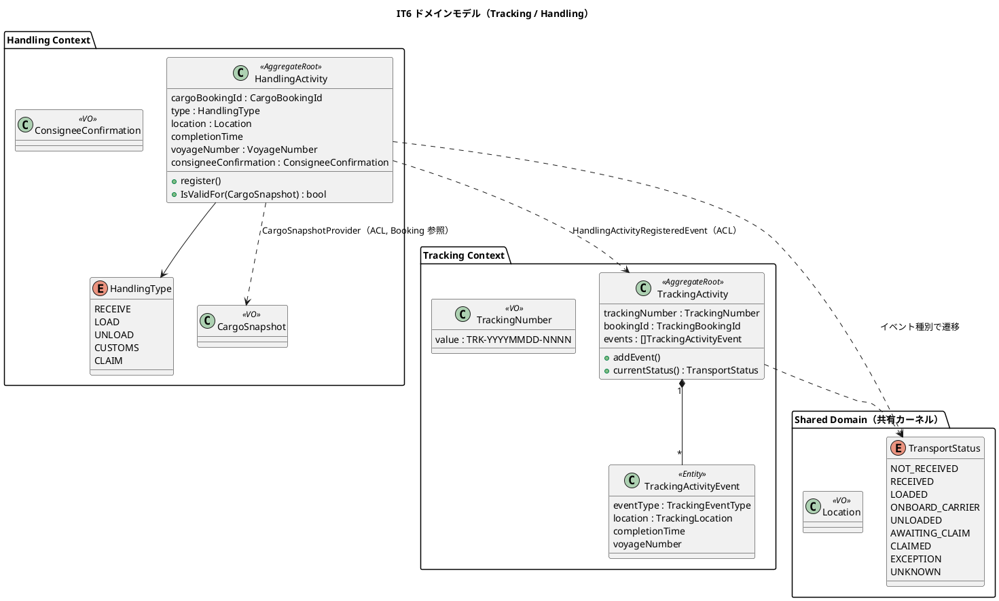
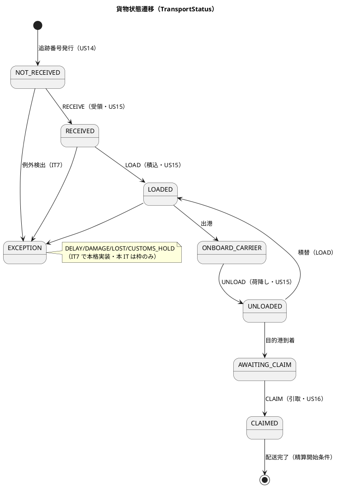
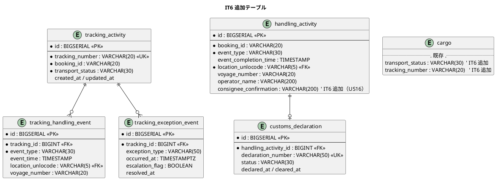
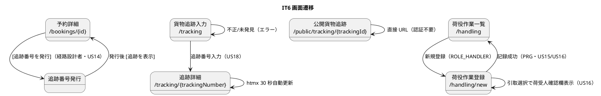

# イテレーション 6 計画

## 概要

本イテレーション（IT6）は、中盤局面（**インサイドアウト**）の最終イテレーションとして、**追跡番号発行（US14・3SP）**・**荷役作業記録（US15・5SP）**・**引取作業記録（US16・3SP）**・**追跡情報照会（US18・3SP）** を実装し、これまで未実装だった **Tracking Context（追跡）** と **Handling Context（荷役）** の 2 つの BC を新設する。荷役イベントの記録により貨物の輸送状態（TransportStatus）が自動遷移し、荷主・荷受人が追跡番号で貨物の現在位置・状態・イベント履歴を照会できる。これをもって **Phase 2（経路設計・貨物追跡）が完了し Release 0.2** に到達する。

- **局面**: 中盤（IT3-6）／アプローチ: **インサイドアウト**（追跡・荷役の集約と荷役妥当性検証・状態遷移の不変条件を domain / data 層から堅牢に固めて上位層へ）
- **対象 BC**: **Tracking Context（新設）**・**Handling Context（新設）**・Booking Context（追跡番号発行コマンド・cargo テーブル拡張）・Shared Domain（`TransportStatus` 共有列挙の新設）
- **BC 独立性**: Handling → Booking の貨物情報参照（荷役妥当性検証 `IsValidFor` の CargoSnapshot）は **ACL ポート経由**（既存 EventPublisher / RouteSearcher / NotificationPort の先例に倣う）。Tracking は Handling / Booking のドメインイベント（HandlingActivityRegisteredEvent / CargoBookedEvent 等）を **ACL で受信**し、直接依存を持たない（下記「設計判断」）
- **前提**: `internal/tracking` / `internal/handling` は未実装（新規作成）。Booking 側に `BookingStatusTrackingIssued = "TRACKING_ISSUED"` の定数のみ定義済み（発行コマンドは未実装）。`cmd/server/main.go` の `/tracking`・`/handling` は現状プレースホルダ。ナビ・E2E に両パスの導線テストは既存。

---

## ゴール

### イテレーション終了時の達成状態

- 経路設計者が、確定済み予約に対して**一意の追跡番号を発行**でき、荷主に追跡番号が通知され、貨物状態が「受領待ち（NOT_RECEIVED）」に設定される（US14）。
- 荷役作業員が、追跡番号で貨物を特定し**作業種別（受領・積込・荷降し）・日時・場所を記録**でき、貨物状態が対応状態に自動更新される。作業場所が予定ルートと異なる場合は警告/ MISROUTED 判定が働く（US15）。
- 荷役作業員が、**荷受人確認（署名または確認コード）を取得して引取作業を記録**でき、貨物状態が「引取済（CLAIMED）」に更新される（US16）。
- 荷主・荷受人が、**追跡番号で貨物の現在状態・位置・イベント履歴・推定到着日を照会**でき、ログインなしでも公開照会できる（US18）。

### 成功基準

- [ ] US14/US15/US16/US18 の受け入れ基準を満たす（採番・発行通知・荷役記録・状態自動遷移・引取確認・追跡照会・公開照会）。
- [ ] Tracking / Handling の集約・値オブジェクト・荷役妥当性検証（`IsValidFor` デシジョンテーブル）・状態遷移の不変条件を domain 層ユニットテストで隔離検証。
- [ ] Handling → Booking の貨物情報参照を ACL ポート（`CargoSnapshotProvider` 等）で抽象化し、`make arch`（go-arch-lint）が BC 間直接依存なしで green。
- [ ] Tracking / Handling のドメイン層カバレッジ 90% 以上、SonarQube Quality Gate PASS（new_coverage 80%+・violations 0・重複 3% 未満）。
- [ ] `make check`（build + test + lint + govulncheck + arch）green・CI success。
- [ ] IT6 デモ項目（追跡番号発行 → 荷役記録 → 状態遷移 → 追跡照会の一連フロー）が Playwright E2E で green。

### IT5 ふりかえり Try の反映（返済枠）

- [ ] **T1（IT5 由来）ロール別「作業入口」を DoD 化**: `/tracking`（ROLE_SHIPPER/CONSIGNEE/TRACKER）・`/handling`（ROLE_HANDLER/TRACKER）を実装したら、各ロールがダッシュボード/ナビから到達できる導線を必ず確認（画面単体でなく導線まで）。ナビ整合チェックを DoD に組み込む。
- [ ] **T2/T3（IT5 由来・レビュー H-1「高」/ M-2「中」）協議依頼・通知待ちワークリスト**: US10-12 の運用完成（営業ダッシュボードに「協議依頼待ち」「荷主通知待ち」一覧）。**対応方針**: IT6 は 2 BC 新設 + 14SP（平均ベロシティ 11.6 を上回る）で Release 0.2 完了が最優先のため、本ワークリストはコア 4 ストーリー完了後の**余力枠**とし、余力がなければ Phase 3 の IT7 へ明示繰越する（H-1 は業務ループの穴だが、追跡・荷役の基盤なしには Phase 2 が閉じないため優先順位は追跡・荷役が上）。
- [ ] **T4（IT5 由来）見出しと機能スコープの一致**: 各画面見出し・受入基準に MVP スコープを明記し期待を管理。
- [ ] **T5（IT5 由来）ID 再採番は影響全体を一度に**: `public/tracking` 画面の US 表記（US13 → US18）などトレーサビリティ不整合を本 IT で一括是正。
- [ ] **T7（IT5 由来）sqlcgen per-BC schema 分離**: 新設 Tracking / Handling の sqlcgen は最初から per-BC schema で分離し、負債を増やさない（既存 BC の返済は優先度低）。

---

## ユーザーストーリー

### 対象ストーリー

| ID | ユーザーストーリー | SP | 対応 UC | BC | 優先度 |
|----|-------------------|----|---------|----|--------|
| US14 | 追跡番号を発行する | 3 | UC12 | booking / tracking | 高 |
| US15 | 荷役作業を記録する | 5 | UC13 | handling / tracking | 高 |
| US16 | 引取作業を記録する | 3 | UC13 | handling / tracking | 高 |
| US18 | 追跡情報を照会する | 3 | UC15 | tracking | 高 |
| **合計** | | **14** | | | |

> ベロシティ注記: IT1 15・IT2 8・IT3 17・IT4 11・IT5 7 SP（5 IT 平均 ≒ 11.6）。IT6 は 14 SP と平均をやや上回るが、Release 0.2 完了の節目であり必須ストーリーのみで構成。2 BC 新設のオーバーヘッド（domain/application/infrastructure/interfaces 一式 × 2）を含むため、T2/T3 ワークリストは余力次第の繰越枠とする。

### ストーリー詳細（受け入れ基準の要点）

#### US14: 追跡番号を発行する（経路設計者 / UC12）

- 「予約確定」状態の予約に対して追跡番号を発行できる。
- 追跡番号は一意に採番される（形式 `TRK-YYYYMMDD-NNNN`・UI 設計 L636）。
- 発行後、貨物状態が「受領待ち（NOT_RECEIVED）」に設定される。
- 荷主に追跡番号と追跡方法をメール通知する（IT5 の NotificationPort を再利用）。
- Booking 側で貨物状態が `TRACKING_ISSUED` に遷移する。

#### US15: 荷役作業を記録する（荷役作業員 / UC13）

- 追跡番号の入力（またはスキャン）で貨物を特定できる。
- 作業種別（受領 RECEIVE・積込 LOAD・荷降し UNLOAD）を選択できる。
- 作業日時・作業場所（UN/LOCODE 形式）を入力できる。
- 記録後、貨物状態が対応状態（RECEIVED / LOADED / UNLOADED）に自動更新される。
- 記録後、荷主に状態変更通知が送信される。
- 追跡番号が存在しない場合、エラーメッセージが表示される。
- 作業場所が予定ルートと異なる場合、警告が表示される（LOAD/UNLOAD は MISROUTED 判定・下記デシジョンテーブル）。

#### US16: 引取作業を記録する（荷役作業員 / UC13）

- 作業種別「引取（CLAIM）」を選択すると、荷受人確認フィールド（署名または確認コード）が表示される。
- 荷受人確認が取得されると引取作業が記録される。
- 記録後、貨物状態が「引取済（CLAIMED）」に更新される。
- 貨物状態「引取済」は配送完了を意味し、精算処理（Phase 3）の開始条件となる。

#### US18: 追跡情報を照会する（荷主・荷受人 / UC15）

- 追跡番号を入力して貨物情報を照会できる。
- 現在の状態・位置（港湾名）・推定到着日が表示される。
- 追跡イベント履歴（日時・場所・作業種別）が時系列で表示される。
- 追跡番号が存在しない場合、「追跡番号が見つかりません」と表示される。
- ログインなしでも追跡番号があれば照会できる（`/public/tracking/{trackingId}`）。

---

## タスク（インサイドアウト順）

### 0. Shared Domain 拡張（前提基盤）

- `internal/shared/domain/transport_status.go`: 共有列挙 `TransportStatus`（NOT_RECEIVED / RECEIVED / LOADED / ONBOARD_CARRIER / UNLOADED / AWAITING_CLAIM / CLAIMED / EXCEPTION / UNKNOWN）を新設。遷移順・表示名・バッジ色をドメインで定義（domain-model L710 / ui_design L698,L1220 と一致）。
- 命名統一: domain-model の Tracking Context 記述に残る `TrackingStatus` は本共有 `TransportStatus` に統一する（設計反映が必要・下記「注」）。

### 1. Handling Context（domain → data → application → interfaces / US15・US16）

- **domain**: 集約ルート `HandlingActivity`（cargoBookingId, type, location, completionTime, voyageNumber）・`register()` / `IsValidFor(snapshot CargoSnapshot) bool`。値オブジェクト `HandlingType`（RECEIVE/LOAD/UNLOAD/CUSTOMS/CLAIM・`requiresVoyageNumber()`/`isLoadType()`/`isClaimType()`）・`CargoSnapshot`・`LegSnapshot`・`VoyageNumber`。集約内エンティティ `CustomsDeclaration`（本 IT では最小・CLAIM 前提の CLEARED 判定のみ）。US16 の荷受人確認（署名/確認コード）を値オブジェクト `ConsigneeConfirmation` として追加（data-model 反映が必要・下記「注」）。
- **荷役妥当性検証**: 下記デシジョンテーブルを domain ユニットテストで隔離検証（RECEIVE/LOAD/UNLOAD/CLAIM × VoyageNumber 必須・場所チェック・MISROUTED 判定）。
- **data**: migration で `handling_activity`・`customs_declaration` テーブル追加（sqlcgen は per-BC schema で分離・T7）。data-model の物理テーブル表・DDL・論理モデルを同一コミットで更新（T1 由来の規律）。
- **application**: `RegisterHandlingActivityService`（HandlingActivityRegistrationCommand）。Booking の貨物情報は ACL ポート `CargoSnapshotProvider` 経由で取得（BC 独立性）。記録後 `HandlingActivityRegisteredEvent` を Publish。
- **interfaces**: `/handling`（一覧）・`/handling/new`（登録・引取確認フィールド動的表示）。PRG で一覧へ。ROLE_HANDLER / ROLE_TRACKER。

### 2. Tracking Context（domain → data → application → interfaces / US14 受け・US18）

- **domain**: 集約ルート `TrackingActivity`（trackingNumber, bookingId, events[], exceptions[]）・`addEvent()` / `currentStatus()`。値オブジェクト `TrackingNumber`（`TRK-YYYYMMDD-NNNN` 採番・一意）・`TrackingBookingId`・`TrackingLocation`・`TrackingVoyageNumber`。集約内エンティティ `TrackingActivityEvent`。状態遷移は共有 `TransportStatus`。例外（TrackingExceptionEvent / ExceptionType）は IT7 中心のため本 IT では枠のみ。
- **data**: migration で `tracking_activity`・`tracking_handling_event`・`tracking_exception_event` テーブル追加。
- **application**: `HandlingActivityRegisteredEvent` を ACL 受信 → 対応 TrackingActivity に addEvent し TransportStatus を遷移させるハンドラ。追跡照会クエリ（CQRS 読み取り）`TrackingQueryService`。
- **interfaces**: `/tracking`（入力）・`/tracking/{trackingNumber}`（詳細・htmx 30 秒自動更新）・`/public/tracking/{trackingId}`（認証不要・個人情報非表示）。ROLE_SHIPPER / CONSIGNEE / TRACKER。

### 3. Booking Context 追跡番号発行（US14）

- **application**: `AssignTrackingNumberService`（AssignTrackingNumberCommand）。確定済み予約に TrackingNumber を採番・紐付け、貨物状態を `TRACKING_ISSUED` に遷移。TrackingActivity を新規作成（TransportStatus=NOT_RECEIVED）。荷主へ NotificationPort で通知。
- **data**: `cargo` テーブルに `transport_status`・`tracking_number` カラム追加（migration・data-model L737 の将来追加分を反映）。
- **interfaces**: 予約詳細画面に「追跡番号を発行」導線を追加（UI 設計に発行導線の反映が必要・下記「注」）。発行後は「[追跡を表示]」を表示。

### 4. デモ E2E（受け入れ基準）

- 追跡番号発行 → 受領（RECEIVE）記録 → 積込（LOAD）記録 → 追跡照会で状態遷移（NOT_RECEIVED → RECEIVED → LOADED）とイベント履歴が表示される一連フローを Playwright で検証。
- 引取（CLAIM）記録 → 貨物状態が CLAIMED になり公開照会で確認できる。
- 存在しない追跡番号で「追跡番号が見つかりません」が表示される。
- ロール別到達性（T1）: 荷役作業員が `/handling`、荷主/荷受人が `/tracking`、未認証で `/public/tracking/{id}` に到達できる。

---

## スケジュール

インサイドアウトで内側（domain/data）から外側（application/interfaces）へ、Handling → Tracking → Booking 発行 → E2E の順に貫通する。

### Week 1（Day 1-5）

- Day 1: 共有 `TransportStatus` 新設（タスク 0）・Handling domain（集約・HandlingType・IsValidFor デシジョンテーブル）ユニットテスト。
- Day 2-3: Handling data（migration・sqlcgen per-BC）・application（`RegisterHandlingActivityService`・`CargoSnapshotProvider` ACL・イベント Publish）。US15/US16 のドメイン確定。
- Day 4-5: Handling interfaces（`/handling`・`/handling/new`・引取確認欄）。Tracking domain（`TrackingActivity`・`TrackingNumber` 採番）。

### Week 2（Day 6-10）

- Day 6-7: Tracking data・application（イベント受信ハンドラで状態遷移・CQRS 追跡照会クエリ）。
- Day 8: Booking 追跡番号発行（`AssignTrackingNumberService`・cargo 拡張 migration・発行導線）。US14 完了。
- Day 9: Tracking interfaces（`/tracking`・`/tracking/{trackingNumber}`・`/public/tracking/{trackingId}`・htmx 自動更新）。US18 完了。
- Day 10: デモ E2E・ロール別到達性確認（T1）・設計ドキュメント是正（注 1〜5）・品質ゲート（make check / SonarQube）。余力あれば T2/T3 ワークリスト。

---

## 設計判断（要 validating-design 確認）

1. **貨物状態列挙の命名統一（TransportStatus）**: domain-model は Tracking Context で `TrackingStatus`、Shared / UI / DB で `TransportStatus` と二系統だが値集合は同一。**Shared Domain の共有列挙 `TransportStatus` に統一**し、Tracking Context はこれを利用する（共有カーネル・domain-model L24 に既記載）。domain-model の `TrackingStatus` 記述を是正（注 1）。
2. **BC 独立性（Handling → Booking）**: 荷役妥当性検証（`IsValidFor`）に必要な貨物情報（origin/destination/itinerary）は Booking ドメインを直接 import せず **ACL ポート `CargoSnapshotProvider`** で取得。既存 ACL 先例（RouteSearcher・EventPublisher・NotificationPort）と同型。
3. **BC 独立性（Tracking の受信）**: Tracking は Handling / Booking のイベント（HandlingActivityRegisteredEvent / CargoBookedEvent）を **ACL で受信**し逆参照しない。イベント公開は IT1 の loggingPublisher パターンを踏襲。
4. **荷役種別の表記統一（CUSTOMS）**: ドメイン値は `CUSTOMS`（domain-model L862 / data-model）。UI 設計 L736 の `CUSTOMS_CLEARANCE` を `CUSTOMS` に是正（注 2）。本 IT では CUSTOMS は CLAIM 前提の最小実装（税関自動登録は IT7 系）。
5. **US16 荷受人確認の格納**: data-model の `handling_activity` に荷受人確認カラムが無いため、`consignee_confirmation`（署名 or 確認コード）カラムを追加し、ドメインは値オブジェクト `ConsigneeConfirmation` で表現（注 3）。
6. **US14 発行 UI**: 専用発行画面は UI 設計に未定義。予約詳細画面に「追跡番号を発行」導線を追加する（注 4）。発行操作は Booking Context の `AssignTrackingNumberCommand` 経由。

---

## 設計（IT6 スコープに絞って掲載）

### ドメインモデル

### 状態遷移図（TransportStatus・荷役イベント駆動）

### 荷役妥当性検証デシジョンテーブル（IsValidFor）

| 荷役タイプ | VoyageNumber | 場所チェック | 不一致時 |
|-----------|--------------|-------------|---------|
| RECEIVE | 不要 | 出発港（RouteSpecification.origin）一致 | 警告 |
| LOAD | 必須 | Itinerary 積込港（Leg.loadLocation）一致 | MISROUTED |
| UNLOAD | 必須 | Itinerary 荷降港（Leg.unloadLocation）一致 | MISROUTED |
| CLAIM | 不要 | 目的港（RouteSpecification.destination）一致 | 警告 |

> LOAD/UNLOAD で MISROUTED 確定時は Booking の RoutingStatus を MISROUTED 更新（ACL 経由）。CustomsDeclaration が CLEARED になるまで CLAIM 不可。

### データモデル（ER 図・IT6 追加分）

### 画面遷移図

### API 設計

| メソッド | パス | 説明 | ロール |
|---------|------|------|--------|
| POST | `/bookings/{id}/tracking-number` | 追跡番号発行（US14） | 経路設計者 |
| GET | `/tracking` | 貨物追跡入力（US18） | 荷主・荷受人・追跡管理者 |
| GET | `/tracking/{trackingNumber}` | 追跡詳細（US18） | 荷主・荷受人 |
| GET | `/tracking/{trackingNumber}/status` | 追跡状態部分更新（htmx） | 同上 |
| GET | `/public/tracking/{trackingId}` | 公開追跡（US18・認証不要） | 未認証 |
| GET | `/handling` | 荷役作業一覧（US15/US16） | 荷役作業員・追跡管理者 |
| GET/POST | `/handling/new` | 荷役作業登録（US15/US16） | 荷役作業員 |

### ADR

- 新規 ADR 候補: 「TransportStatus を共有カーネルに配置し Tracking / Handling / Booking で共有する」判断（BC 独立性と共有カーネルの境界）。実装時に必要性を判断し `creating-adr` で起票。

---

## 検証結果（validating-iteration-plan / validating-design）

> ステップ 3・4 実施後に記入する。

### 一致を確認した項目

- **ユーザーストーリー**（user_story.md）: US14/US15/US16/US18 の ID・タイトル・アクター・受入基準・対応 UC（UC12/UC13/UC13/UC15）が一致。
- **ドメインモデル**（domain-model.md）: 集約 `TrackingActivity`・`HandlingActivity`、`HandlingType`（RECEIVE/LOAD/UNLOAD/CUSTOMS/CLAIM）、荷役妥当性検証デシジョンテーブル、値オブジェクト名が一致。
- **データモデル**（data-model.md）: テーブル名（単数形 `tracking_activity`・`handling_activity`・`customs_declaration`）、サロゲート PK + 業務キー UK、FK が `id` 参照、`BIGSERIAL`、cargo への `transport_status`/`tracking_number` 追加方針が一致。
- **UI（ビュー/インタラクション）**（ui_design.md）: URL パス（`/tracking`・`/tracking/{trackingNumber}`・`/public/tracking/{trackingId}`・`/handling`・`/handling/new`）、htmx 30 秒自動更新、PRG、エラーループが一致。
- **テンプレート**（イテレーション計画.md）: 概要・ゴール・ユーザーストーリー・スケジュール・設計・リスクと対策・完了条件（DoD・デモ項目）・更新履歴・関連ドキュメントを具備。
- **過去レビュー**（it5_go_review_20260725.md）: H-1（協議依頼ワークリスト・高）・M-2（通知待ちリスト・中）を返済枠に取り込み、対応方針（余力枠・IT7 繰越）を明記。T1 ロール別作業入口を DoD 化。

### 検証で修正した計画側の是正（本計画に反映済み）

- テンプレート必須の「スケジュール」節（Week 1/Week 2）を追加。
- IT5 レビュー H-1（高）の対応方針を「余力枠・IT7 明示繰越」として理由付きで明記（追跡・荷役基盤が Phase 2 完了の前提であり優先順位が上）。

### validating-design（3 軸横断検証）

- **軸 A（開発戦略整合）**: development_strategy.md L155 の IT6 割当（US14/15/16/18・追跡/荷役・tracking,handling BC）・局面「中盤（IT3-6）」・アプローチ「インサイドアウト」と本計画が一致。
- **軸 B（設計トピックカバレッジ）**: 新規列挙 `TransportStatus`（共有）・`HandlingType` は domain-model の要素表に既存。ドメインモデル図・状態遷移図・ER 図・画面遷移図の 4 図を IT6 スコープで掲載。ナビ整合（T1）を DoD 化。
- **軸 C（過去計画の連続性）**: BC 独立性パターンを踏襲——ACL ポートは消費側 BC の application 層に定義する先例（`RouteSearcher`・`EventPublisher`・`NotificationPort`・`CargoQueryPort`）に倣い、`CargoSnapshotProvider` を handling/application に配置。共有カーネルは `shared/domain`（location・routing_status・cargo_type 等）の再利用に加え `transport_status` を新設。`.go-arch-lint.yml` に `tracking-*`/`handling-*` コンポーネントが宣言済み（依存規則は実装時に確認）。**要注意**: sqlcgen コンポーネントは `tracking-sqlcgen`/`handling-sqlcgen` が未宣言のため、T7 の per-BC schema 分離時に arch-lint へ追加する。

### 注（設計ドキュメントを IT6 で是正 / 実装と同時反映）

- **注 1**: domain-model.md の Tracking Context の `TrackingStatus` 記述を、共有 `TransportStatus` に統一（値集合は不変）。
- **注 2**: ui_design.md L736 の荷役種別 `CUSTOMS_CLEARANCE` を `CUSTOMS` に是正（ドメイン値と一致）。
- **注 3**: data-model.md の `handling_activity` に `consignee_confirmation`（US16 荷受人確認）カラムを追加。
- **注 4**: ui_design.md に US14 追跡番号発行の導線（予約詳細画面の発行ボタン・`POST /bookings/{id}/tracking-number`）を追記。
- **注 5**: ui_design.md L87 の `public/tracking` 画面の US 表記を US13 → US18 に是正（T5・トレーサビリティ一括）。

---

## リスクと対策

| リスク | 影響度 | 対策 |
|--------|--------|------|
| 2 BC（Tracking / Handling）同時新設で 14SP が超過 | 高 | domain/data 層を先に固め（インサイドアウト）、CUSTOMS・例外系は最小枠に留める。T2/T3 ワークリストは余力次第・超過時は IT7 繰越 |
| Handling → Booking の貨物情報参照で BC 直接依存が混入 | 高 | ACL ポート `CargoSnapshotProvider` を先に定義し `make arch` 常時 green で担保 |
| TransportStatus の二系統命名が実装で混乱 | 中 | 着手前に Shared 共有列挙へ統一（設計判断 1）・domain-model を同時是正 |
| htmx 30 秒自動更新（追跡詳細）のフレイキー E2E | 中 | E2E は状態遷移の確定待ちで検証、自動更新は待機条件を明示。統合テストで補完 |
| US16 荷受人確認のデータ項目欠落 | 中 | `consignee_confirmation` カラム追加を migration・data-model 同時反映（注 3） |

---

## 完了条件

### Definition of Done

- [ ] US14/US15/US16/US18 の受け入れ基準をすべて満たす。
- [ ] Tracking / Handling BC の domain 層カバレッジ 90% 以上。
- [ ] `make check`（build + test + lint + govulncheck + arch）green・CI success。
- [ ] `make arch`（go-arch-lint）green：BC 間直接依存なし（ACL/イベント経由のみ）。
- [ ] SonarQube Quality Gate PASS（new_coverage 80%+・violations 0・重複 3% 未満）。
- [ ] **ロール別到達性（T1）**: `/tracking`（荷主/荷受人/追跡管理者）・`/handling`（荷役作業員/追跡管理者）・`/public/tracking`（未認証）がナビ/ダッシュボードから到達できることを確認。
- [ ] migration と data-model（物理テーブル・DDL・論理モデル）を同一コミットで同期（T1 規律）。
- [ ] 設計ドキュメント是正（注 1〜5）を実装と同時に反映。
- [ ] IT6 デモ項目の E2E が green。
- [ ] Release 0.2 の完了条件（Phase 2 全 US 実装）を満たす。

### デモ項目（E2E 受け入れ基準）

1. 経路設計者が確定予約に追跡番号を発行 → 荷主に通知・状態 NOT_RECEIVED（US14）。
2. 荷役作業員が受領・積込・荷降しを記録 → 状態が自動遷移し警告/ MISROUTED が働く（US15）。
3. 荷役作業員が荷受人確認を取得して引取を記録 → 状態 CLAIMED（US16）。
4. 荷主/荷受人が追跡番号で現在状態・位置・イベント履歴・推定到着日を照会（ログインあり/なし両方・US18）。

---

## 更新履歴

| 日付 | 内容 |
|------|------|
| 2026-07-27 | 初版作成。IT6（US14/US15/US16/US18・14SP）で Tracking / Handling BC を新設し Phase 2 完了（Release 0.2）。中盤・インサイドアウト。IT5 Try（T1 ロール別作業入口 DoD 化・T5 ID 一括是正・T7 sqlcgen 分離）を反映。設計ギャップ（TransportStatus 命名統一・CUSTOMS 表記・US16 確認カラム・US14 発行 UI）を注 1〜5 として明記。 |
| 2026-07-27 | 開発進捗（インサイドアウト・バックエンド）: ドメイン + application 層を完了。共有 TransportStatus（注1）、Handling domain/app（IsValidFor・ConsigneeConfirmation 注3）、Tracking domain/app（採番・CQRS 照会）、Booking `Cargo.IssueTrackingNumber` + `AssignTrackingNumberService`（US14）、pgx リポジトリ、migration 000012-014 + sqlc（per-BC 分離 T7・arch-lint 宣言）。全単体テスト green・`make arch` green・ドメイン層カバレッジ 98-100%。**残**: Booking repo の UpdateTracking/CargoSnapshotProvider 実装、interfaces（web handler + テンプレート）、main.go 配線（イベントアダプタ Handling→Tracking / Booking→Tracking・ルート・ロール別到達性 T1）、デモ E2E、設計ドキュメント注1〜5 反映。 |

---

## 関連ドキュメント

- [リリース計画](release_plan.md)
- [開発戦略](development_strategy.md)
- [IT5 ふりかえり](retrospective-5.md)
- [ドメインモデル設計](../design/domain-model.md)
- [データモデル設計](../design/data-model.md)
- [UI 設計](../design/ui_design.md)
- [ユーザーストーリー](../requirements/user_story.md)
- [システムユースケース](../requirements/system_usecase.md)
