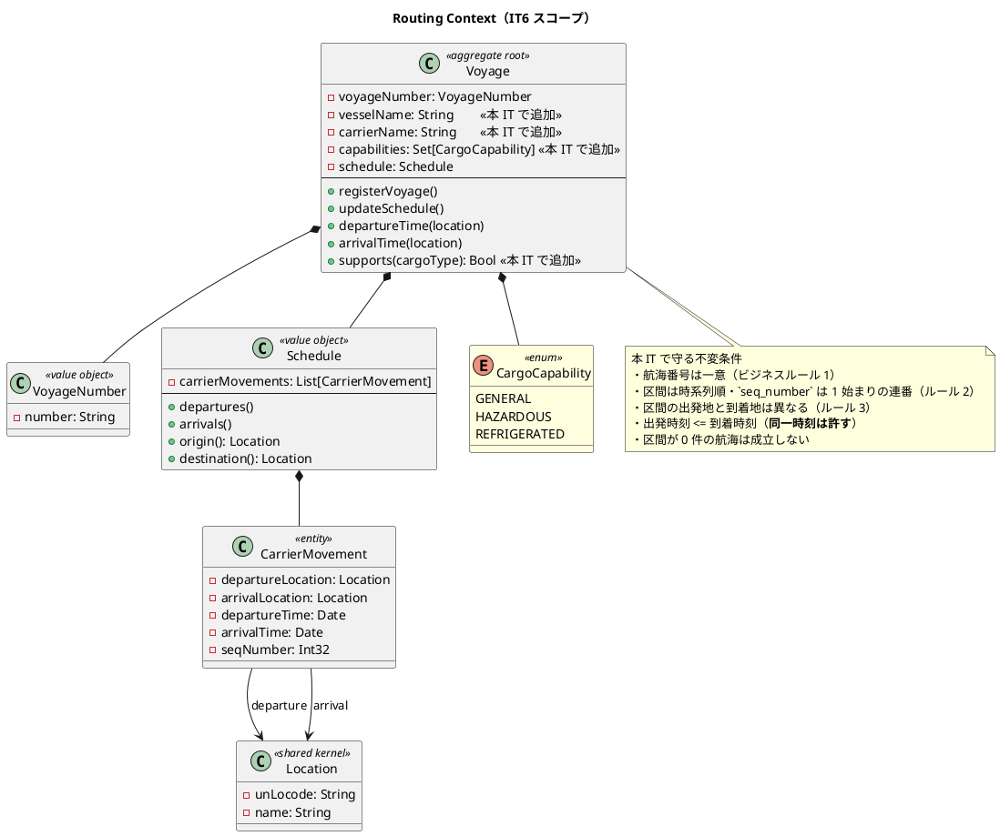
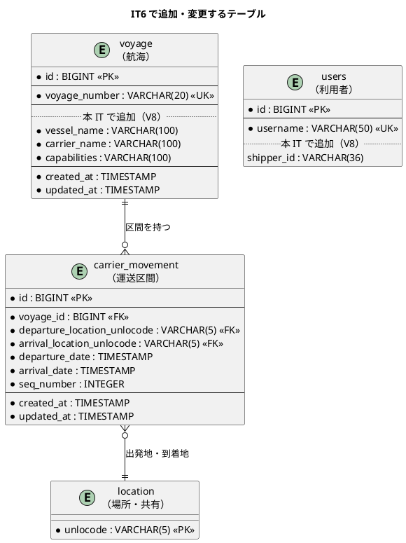
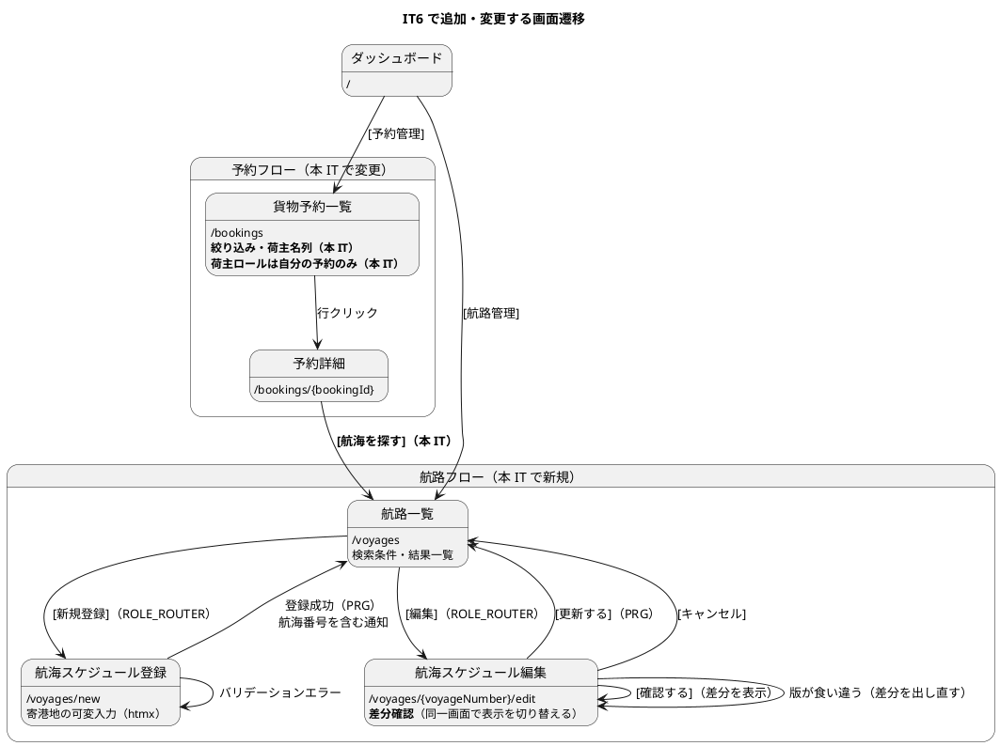

# イテレーション 6 計画

## 概要

| 項目 | 内容 |
|------|------|
| イテレーション | 6 |
| 期間 | 2026-10-12 〜 2026-10-23（2 週間） |
| 計画 SP | 11 |
| 局面 | 中盤（インサイドアウト）の 3 回目 |
| 前提 | IT5 で Booking の書き込み・状態遷移が通っている |

---

## ゴール

### イテレーション終了時の達成状態

**Routing Context を立ち上げ、航海スケジュールの登録・更新・検索を通す。**
これにより、IT7 の経路候補算出（Datalog）が入力を得られる状態になる。

あわせて IT5 のレビューで残した高優先度の負債（予約一覧の絞り込み・荷主の可視範囲）を返す。

### 成功基準（IT6 クローズ時の評価）

| # | 基準 | 測り方 |
|:--:|------|-------|
| 1 | 航海スケジュールを登録し、**検索で見つけられる** | 登録 → 検索の受入テスト（US24-6・US07 の連結） |
| 2 | 更新前後の差分を確認してから上書きできる | 差分確認画面の受入テスト（US25-2・US25-3） |
| 3 | 貨物種別に対応する航海だけが検索結果に残る | 危険物・冷凍での絞り込みテスト（US07-6） |
| 4 | 営業担当者が**予約一覧で自分の探している予約を見つけられる** | 絞り込みと荷主名列の受入テスト（IT5 レビュー M15） |
| 5 | 荷主が**自分の予約だけ**を見られる | 利用者と荷主の紐付けと、他人の予約が見えないテスト |
| 6 | レビュー高優先度が **11 件未満** | クローズ時のレビュー結果（IT4: 18 → IT5: 11） |
| 7 | 縮退 0 件で着地する | クローズ時のタスク状態 |

> **成功基準に「時間」を置かない**（IT5 ふりかえり Try T6）。
> 「40h に収まる」は人の稼働を前提とした基準であり、本プロジェクトの実行形態
> （AI エージェントの単独実行）に対応しない。IT1-IT4 の超過率 1.55 → 1.93 も
> 同じ前提の記録であり、**Try T8（係数 1.9）は廃止した**。
> 見積もり精度は **SP・縮退件数・レビュー高優先度件数**で測る。

### 前イテレーションの Try の反映

IT5 ふりかえりの Try を、本計画のどこで消化するかを明示する。**「余力次第」とはしない**。

| Try | 反映先 |
|:---:|-------|
| T1 Try を「手順」ではなく「原理」で書く | 本計画の Try 欄を原理で書いた。レビュー依頼時に「この原理が及ぶ他の場所はどこか」を必ず問う（タスク 6.1） |
| T2 引き継ぎ表の各行をタスク表へ 1:1 で落とす | タスク 0.2 で**引き継ぎ件数とタスク行数を数える**。IT5 は M9 を引き継ぎ表に書きながらタスクに落とさず漏らした |
| T3 観点表に軸 6「可視範囲」を追加 | タスク 0.1。IT5 は荷主に他社の予約が見えていたが、4 軸のどこにも当たらなかった |
| T4 観測手段を入れたらそれが働くことをテストで固定 | タスク 5.2（`X-Route` が付くことのテスト）。IT5 は「入れた」で終わらせ、テスト実行では無効だった |
| T5 対策が仮説に対応しているかを対策を書く前に確認 | タスク 5.1。仮説と対策の対応表を作ってから `X-App-Instance` を入れる |
| T6 成功基準は「測れるか」を先に確認 | 上記「成功基準に時間を置かない」 |
| T7 索引の列挙をやめる | タスク 5.4。`arch_lint_rules.md` のフィクスチャ一覧を命名規約のみにする |
| T8 クローズ手順に索引の突合を入れる | DoD に含める |
| T9 SP に共有モジュールへの波及を織り込む | US24 のタスクに「共有部品の拡張」を別行で計上（タスク 2.1） |
| T10 レビュー高優先度の件数を成功基準に入れる | 成功基準 6 |

---

## ユーザーストーリー

### 対象ストーリー

| ID | ストーリー | SP | 優先度 | 状態 |
|:--:|-----------|:--:|:---:|------|
| US24 | 航海スケジュールを新規登録する | 3 | 高 | 未着手 |
| US25 | 既存航海スケジュールを更新する | 3 | 高 | 未着手 |
| US07 | 航海スケジュールを検索する | 3 | 高 | 未着手 |
| TS11 | IT5 レビューの返済（予約一覧・可視範囲・観測手段） | 2 | **最高** | 未着手 |

**目標 SP**: 11

### スコープの変更（2 件の判断を確定させた）

リリース計画の暫定配分は IT6 を `US24, US25, TS07, US07`（14 SP）としていた。
**IT4 から 2 回先送りしていた 2 つの判断を、本計画で確定させる。**

#### 1. Phase 5（精算・US21-23・13 SP）を**スコープ外**とする

残 82 SP に対し IT6-IT10 の実効ベロシティ換算は 60-65 SP であり、入らない。
リリース計画の[リスク対応方針 2](release_plan.md#スケジュールリスク) が想定していた選択肢であり、
**v1.0.0 の定義を「荷役・追跡まで」に変更する**。US21-23 は将来リリースへ送る。

#### 2. TS07（外部 ACL 基盤・5 SP）を**必要になるまで延期**する

全ユーザーストーリーの受入基準を確認したが、**外部システム連携を要求するものが無い**。

| 確認したこと | 結果 |
| :--- | :--- |
| US24・US25 は外部から取得するか | いいえ。経路設計者が**手動で登録・更新**する |
| US08（経路候補算出）は外部サービスに委ねるか | いいえ。**Datalog による自前実装**（リリース計画・技術スタック選定） |
| 他に外部連携を受入基準に持つ US はあるか | 無い |

`architecture_backend.md` は `eff ExternalRouting` と HttpClient ハンドラを描いているが、
**それを要求するストーリーが存在しない**。開発戦略の「後で必要になるから今作る は禁止」に従い、
外部連携を要求するストーリーが現れた時点で作る。

> **リリース計画の「技術ストーリー（TS01-TS07）は削減しない」との関係**:
> この規律は「削るとアーキテクチャが成立しなくなる」ことを理由としている。
> TS01-TS06（Web・DB・認証・HTML・CI・arch-lint）はすべて**現に動いている機能が依存**しており、
> 削れば成立しない。TS07 は**依存する機能が 1 つも無い**点で性質が異なる。
> 削減ではなく**延期**であり、`architecture_backend.md` の `ExternalRouting` も残す
> （設計の意図は保ち、実装だけを必要時点へ送る）。

**影響**: 残 SP は 82 − 13（Phase 5）= 69。TS07 の 5 SP を IT6 から外すことで、
IT6-IT10 の計画は **64 SP**となり、実効ベロシティ換算（60-65 SP）に収まる。
**IT7 の 18 SP は依然として単独で超過している**ため、本計画で IT7 を分割する（下記の再配分）。

### 再配分（IT6-IT10）

| IT | ゴール | 対象 | 計画 SP |
|:--:|-------|------|:---:|
| IT6 | 航海スケジュールの登録・更新・検索 + IT5 の返済 | US24, US25, US07, TS11 | 11 |
| IT7 | 経路候補算出（Datalog）+ HTTP ランタイムの防御 | US08, TS12 | 11 |
| IT8 | 経路の選択・確定と予約への紐付け + 輸送見積 | US09, US11, US01 | 13 |
| IT9 | 予約確定・追跡番号発行と荷役記録 | US13, US14, US15 | 12 |
| IT10 | 追跡連携と例外処理 | US16, US17, US19 | 12 |
| （将来リリース） | 精算・経路再算出・通知 | US21-23, US10, US12, US20 | 21 |

> **IT7 を分割した**。従来の IT7 は US08（8）+ US09（5）+ US01（5）= 18 SP で、
> 実効ベロシティを 5-6 SP 超えていた。US08（Datalog）は分割の余地が小さいため、
> **US08 とランタイム防御だけに絞り**、US09・US01 を IT8 へ送る。
>
> あわせて **US10（経路条件の調整・3 SP）・US12（確定経路の通知・2 SP）・US20（3 SP）を
> 将来リリースへ送る**。いずれもリリース計画で優先度「中」であり、
> [リスク対応方針 1](release_plan.md#スケジュールリスク)（フィーチャバッファを先に消費）に沿う。
>
> **US01（輸送見積）は IT7 → IT8 へ再度移した**。IT5 計画では「IT7 へ送る」と
> 記したが、その IT7 が 18 SP と超過しているため成立しない。US01 は
> 「航海スケジュール情報をもとにルート概算候補が表示される」を要求しており、
> **経路候補算出（US08・IT7）の後**に置くのが依存の順序としても自然である。
>
> **TS12（HTTP ランタイムの防御・3 SP）を新設**した。従来 US08 の IT に「あわせて実施」と
> 書かれていた作業（セマフォ・タイムアウト・追跡 API の負荷試験）を、SP を計上した
> ストーリーへ切り出す。IT4 で TS08 を新設したのと同じ理由である。

### ストーリー詳細

#### TS11: IT5 レビューの返済（2 SP）

**として**: 営業担当者・荷主

**したい**: 予約を一覧から探せて、荷主として自分の予約だけを見たい

**なぜなら**: 予約一覧が全件のままだと「先週の件どうなってる？」の電話に応えられず
**予約側で Excel 台帳が復活する**。また IT5 で荷主ロールから予約を隠したため、
**荷主が自分の予約を確認できない**状態になっているからだ

**出典**: IT5 レビュー M15・P3（`docs/review/IT5実装_review_20260803.md`）

**受け入れ基準**:

- [ ] 予約一覧を予約番号・出発地・仕向地・荷主名で絞り込める
- [ ] 予約一覧に荷主名の列がある
- [ ] 利用者と荷主が紐づき、荷主ロールでは**自分の予約だけ**が一覧に出る
- [ ] 他の荷主の予約は一覧にも詳細にも現れない（詳細は 404 とし、存在の有無を漏らさない）
- [ ] 荷主ロールのナビゲーションに予約が戻る

**壊れ方の観点**（観点表の 6 軸を当てた結果。**軸 6 は本 IT で新設**）:

| 軸 | 想定する壊れ方 | 対応 |
|----|--------------|------|
| 軸 6-1（可視範囲） | 一覧は絞られるが**詳細は誰でも開ける** | 詳細も所有者で絞る。他人の予約は 404 |
| 軸 6-2 | 詳細で 403 を返すと**存在することが漏れる** | 404 に統一する |
| 軸 6-3 | 荷主に紐づかない利用者（営業）が 0 件になる | ロールで分岐し、営業は全件 |
| 軸 1（境界） | 絞り込み語が空・空白のみ | 未入力として扱う（荷主一覧と同じ） |
| 軸 2（外部） | `%`・`_` がワイルドカードとして働く | `escapeLike` を使う（荷主一覧と共有） |
| 軸 3（表示経路） | 0 件のとき「未登録」と「該当なし」を区別できない | 文言を分ける（荷主一覧と同じ） |

#### US24: 航海スケジュールを新規登録する（3 SP）

**として**: 経路設計者

**したい**: 各運送会社が公開している航海スケジュール（航海番号・船名・出発港・到着港・出発日・到着日・寄港地・対応貨物種別）をシステムに新規登録したい

**なぜなら**: 最新の運航情報をシステムに反映することで、経路候補の算出精度が上がり荷主に正確な経路・所要日数を提案できるからだ

**対応 UC**: UC19

**受け入れ基準**:

- [ ] 航海番号・船名・運送会社・出発港（UN/LOCODE）・到着港（UN/LOCODE）・出発日・到着日・対応貨物種別を入力できる
- [ ] 寄港地を複数かつ順序付きで入力できる
- [ ] 必須項目が未入力の場合、未入力箇所を明示したエラーが表示される
- [ ] 出発日が到着日より後の場合、日付の整合性エラーが表示される
- [ ] 同一航海番号がシステムに存在しない場合、登録が完了し登録番号が発行される
- [ ] 登録後、UC05（航海スケジュール検索）の検索対象として利用できる

> **注（設計への反映が必要）**: `domain-model.md` の Routing Context に
> **船名・運送会社・対応貨物種別が無い**。`Voyage` は `VoyageNumber` と `Schedule` だけを持ち、
> `CarrierMovement` は出発地・到着地・時刻のみである。US24 の受入基準 1 が要求する
> 3 項目を集約へ追加し、要素表とクラス図を更新する（タスク 5.3）。
>
> **注（設計への反映が必要）**: `data-model.md` の `voyage` テーブルも
> `voyage_number` しか持たない。船名・運送会社・対応貨物種別の列を追加する（V8）。
>
> **対応貨物種別を持つ理由**: US07-6（危険物・冷凍は対応可能な航海のみ）と
> US05-3（IT5 で対象外とした受入基準）が、この属性に依存する。
> あわせて BK-6（危険物・冷凍は指定港のみ取扱可能）も**航海側の対応可否**として
> 表現できるようになるが、**港側の制約は IT7 で扱う**（港と航海の両方が揃って初めて
> 「取扱可能」が決まるため）。

**壊れ方の観点**:

| 軸 | 想定する壊れ方 | 対応 |
|----|--------------|------|
| 軸 1（境界） | 出発日 = 到着日／出発日 > 到着日／同一日時 | 同一日時は許す（当日到着の便）。逆転は拒否 |
| 軸 1 | 寄港地が 0 件・1 件・重複・出発港と同じ | 0 件は直行として許す。重複と端点との一致は拒否 |
| 軸 1 | UN/LOCODE の形式・全角・マスタ外 | IT4 で作った `isUnLocode` と `LocationCatalog` を使う（新規に書かない） |
| 軸 2（外部） | 同一航海番号の重複登録 | 一意制約 + 事前確認。**500 にしない** |
| 軸 2 | 区間の順序（`seq_number`）が飛ぶ・重複する | 保存時に 1 始まりの連番へ正規化し、読み出しで検証 |
| 軸 3（表示経路） | 未入力箇所が**どれか分からない**エラー | 欄ごとにエラーを出す（受入基準 3） |
| 軸 5（実行環境） | マイグレーションの追加が JAR 起動で効くか | 日次ジョブの実 PostgreSQL で確認 |
| 軸 6（可視範囲） | 航海スケジュールは誰が見てよいか | 経路設計者のみ登録・更新。検索は営業も使う（US07 は経路設計者向けだが、営業の見積にも要る） |

#### US25: 既存航海スケジュールを更新する（3 SP）

**として**: 経路設計者

**したい**: 運送会社が運航変更を発表した場合に、システムに登録済みの航海スケジュールを最新情報に更新したい

**なぜなら**: スケジュール変更を即座にシステムに反映することで、変更後の経路候補算出に誤りが生じるのを防げるからだ

**対応 UC**: UC19

**受け入れ基準**:

- [ ] 既存の航海番号を指定して既登録スケジュールを呼び出せる
- [ ] 既存内容と更新内容の差分が確認画面に表示される
- [ ] 差分確認後に「更新する」を選択することで既存スケジュールが上書き更新される
- [ ] 更新後、UC05（航海スケジュール検索）の検索結果に更新内容が反映される
- [ ] 「キャンセル」を選択した場合、既存スケジュールは変更されない

**壊れ方の観点**:

| 軸 | 想定する壊れ方 | 対応 |
|----|--------------|------|
| 軸 4（並行） | 差分確認中に別の利用者が更新する（ロストアップデート） | **更新時に読み込み時点の版を照合する**。食い違ったら差分を出し直す |
| 軸 4 | 「更新する」の二重送信 | 版の照合で 2 回目は弾かれる |
| 軸 3（表示経路） | 差分が「変わった」だけで**何がどう変わるか**分からない | 項目ごとに旧値・新値を並べる |
| 軸 3 | キャンセルで**戻る先が無い**（行き止まり） | 一覧へ戻す |
| 軸 2（外部） | 区間を減らす更新で古い行が残る | 更新は区間を入れ替える（削除 → 挿入）。残存を読み出しで検証 |

#### US07: 航海スケジュールを検索する（3 SP）

**として**: 経路設計者

**したい**: 予約の出発地・目的地・期限をもとに、利用可能な航海スケジュールを検索したい

**なぜなら**: 制約条件を満たす航海を特定し、経路候補算出の入力を準備できるからだ

**対応 UC**: UC05

**受け入れ基準**（本 IT の範囲）:

- [ ] 予約番号を指定して出発地・目的地・期限・貨物仕様を確認できる
- [ ] 検索条件（出発地・目的地・出発期間・貨物種別）を入力して検索できる
- [ ] 航海スケジュール一覧に航海番号・運送会社・出発日・到着日・寄港地が表示される
- [ ] 条件を満たす航海がない場合、その旨が表示され条件を緩和して再検索できる
- [ ] 危険物・冷凍貨物の場合、対応可能な航海のみに絞り込まれる
- [ ] 出発地・目的地は UN/LOCODE 形式で指定できる
- [ ] 制約条件（航海スケジュール・寄港地接続・港湾制約・貨物種別対応）に基づいて利用可能な航海が表示される
  → **本 IT では「航海スケジュール」「貨物種別対応」まで**。
  **寄港地接続**（乗り継ぎの成立判定）は US08 の到達可能性判定と同じ関心であり、
  Datalog で解くほうが自然なため IT7 で扱う。**港湾制約**も BK-6 とともに IT7。
  本 IT では**直行便の検索**が通るところまでとする

**壊れ方の観点**:

| 軸 | 想定する壊れ方 | 対応 |
|----|--------------|------|
| 軸 1（境界） | 出発期間の開始 > 終了／片方だけ入力／期限当日 | 逆転は拒否。片方のみは許す。**当日は含める**（IT5 の到着期限と同じ判断） |
| 軸 1 | 貨物種別が未選択・未知の値 | 未選択は絞り込まない。未知は拒否（既定値へ倒さない） |
| 軸 2（外部） | 区間が 0 件の航海が検索に出る | 出さない。読み出しで検証 |
| 軸 3（表示経路） | 0 件のとき条件を緩和する手段が無い | 入力値を保持して再検索できる形にする（IT5 の荷主一覧と同じ） |
| 軸 6（可視範囲） | 予約番号を指定した確認で、他人の予約が見える | TS11 と同じ規則を適用する |

---

## タスク

### 0. 着手前の準備（返済枠・0 SP）

| # | タスク | 見積 |
|:--:|-------|:---:|
| 0.1 | **観点表に軸 6「可視範囲」を追加する**（誰がどのデータを見られるか・一覧が返す範囲・他人のデータが混ざらないか・存在の有無を漏らさないか）。Try T3 | 1h |
| 0.2 | **引き継ぎ件数とタスク行数を突合する**。IT5 レビューの中・低 23 件と引き継ぎ 13 件を「本 IT / IT7 以降 / 対応しない」に仕分け、本 IT 分がタスク表に 1:1 で存在することを数える。Try T2 | 1h |

### 1. TS11: IT5 レビューの返済（2 SP）

| # | タスク | 見積 |
|:--:|-------|:---:|
| 1.1 | 利用者と荷主の紐付け（`users.shipper_id`・V8）。**ドメインではなく認可の関心**として設計する | 3h |
| 1.2 | 予約一覧の絞り込み（予約番号・出発地・仕向地・荷主名）。SQL で絞る。`escapeLike` は共有 | 3h |
| 1.3 | 予約一覧に荷主名の列。ACL の `describeShipper` を使う（N+1 にしない） | 2h |
| 1.4 | 荷主ロールの可視範囲を所有者で絞る。詳細は他人なら 404（403 だと存在が漏れる） | 3h |

### 2. US24: 航海スケジュールの登録（3 SP）

インサイドアウト。集約 → ポート → 永続化 → 画面の順に進める。

| # | タスク | 見積 |
|:--:|-------|:---:|
| 2.0 | `business_rule_traceability.md` に Routing Context の行を先に埋める（中盤の規律） | 1h |
| 2.1 | **共有部品の拡張を先に済ませる**（日付範囲の検証・`Decimal` の再利用可否を確認）。Try T9 | 2h |
| 2.2 | `Voyage` 集約・`VoyageNumber`・`Schedule`・`CarrierMovement`・`CargoCapability`。単体テスト先行 | 4h |
| 2.3 | マイグレーション `V8`（`voyage` に船名・運送会社・対応貨物種別、`users.shipper_id`） | 2h |
| 2.4 | `VoyageRepo` ポートと JDBC 実装。区間の順序正規化と往復テスト | 4h |
| 2.5 | 登録画面（寄港地の可変入力は htmx）。欄ごとのエラー表示 | 4h |

### 3. US25: 航海スケジュールの更新（3 SP）

| # | タスク | 見積 |
|:--:|-------|:---:|
| 3.1 | 差分の算出（項目ごとの旧値・新値）。純粋関数として単体テスト | 3h |
| 3.2 | 差分の表示（編集画面内で切り替える。**URL を増やさない**）とキャンセル導線（戻る先を必ず置く） | 3h |
| 3.3 | 版の照合による上書き更新（ロストアップデートの防止）。並行テストで固定 | 4h |
| 3.4 | 区間の入れ替え（削除 → 挿入）と残存の検証 | 2h |

### 4. US07: 航海スケジュールの検索（3 SP）

| # | タスク | 見積 |
|:--:|-------|:---:|
| 4.1 | 検索条件の解釈（出発期間の境界・貨物種別）。単体テスト先行 | 2h |
| 4.2 | 検索の SQL（貨物種別対応で絞る）。区間 0 件の航海を除く | 3h |
| 4.3 | 検索画面と結果一覧（条件を保持して再検索できる） | 3h |
| 4.4 | 予約番号からの遷移（TS11 の可視範囲の規則を適用） | 2h |

### 5. 観測・規律・ドキュメント（1 SP 相当・返済枠）

| # | タスク | 見積 |
|:--:|-------|:---:|
| 5.1 | **仮説と対策の対応表を作ってから** `X-App-Instance` を入れる。Try T5 | 2h |
| 5.2 | `X-Route` と `X-App-Instance` が**実際に付くこと**を統合テストで固定する。Try T4 | 1h |
| 5.3 | `domain-model.md` / `data-model.md` / `ui_design.md` への反映（実装と同時） | 3h |
| 5.4 | `arch_lint_rules.md` のフィクスチャ一覧を**命名規約のみ**にする。Try T7 | 1h |
| 5.5 | リリース計画の再配分を反映（Phase 5 のスコープ外化・TS07 の延期・IT7 の分割） | 2h |

### 6. レビュー（0 SP）

| # | タスク | 見積 |
|:--:|-------|:---:|
| 6.1 | レビュー依頼時に「**この原理が及ぶ他の場所はどこか**」を各指摘へ問う。Try T1 | - |

### タスク合計

| ストーリー | SP | 理想時間 |
|-----------|:--:|:---:|
| 0. 着手前の準備 | 0 | 2h |
| 1. TS11 | 2 | 11h |
| 2. US24 | 3 | 17h |
| 3. US25 | 3 | 12h |
| 4. US07 | 3 | 10h |
| 5. 観測・規律・ドキュメント | 0 | 9h |
| **合計** | **11** | **61h** |

### 縮退順序（着手前に確定させる）

| 順 | 落とすもの | 理由 |
|:--:|-----------|------|
| 1 | タスク 5.1-5.2（`X-App-Instance`） | 間欠異常は 2 例とも再現しておらず、観測手段は `X-Route` が既にある |
| 2 | US25 の差分表示（3.2） | 更新そのものは 3.3 で通る。差分表示は受入基準 2 の充足を次 IT へ送る |
| 3 | US07 の予約番号からの遷移（4.4） | 検索単体は成立する |
| 4 | TS11 の予約一覧の絞り込み（1.2-1.3） | **ただし 2 回目の持ち越しになる**。落とすなら理由を分析する |

**US24 と TS11-1.1/1.4（可視範囲）は落とさない**。前者は本 IT のゴール、
後者は**荷主が自分の予約を見られない状態**を IT5 から継続させないためである。

---

## スケジュール

### Week 1（Day 1-5）

| Day | 内容 |
|:---:|------|
| 1 | タスク 0（観点表の軸 6・引き継ぎの突合）、1.1（利用者と荷主の紐付け） |
| 2 | 1.2-1.4（予約一覧の絞り込み・荷主名・可視範囲） |
| 3 | 2.0-2.2（対応表・共有部品・`Voyage` 集約） |
| 4 | 2.3-2.4（マイグレーションと永続化） |
| 5 | 2.5（登録画面） |

### Week 2（Day 6-10）

| Day | 内容 |
|:---:|------|
| 6 | 3.1-3.2（差分の算出と確認画面） |
| 7 | 3.3-3.4（版の照合と区間の入れ替え） |
| 8 | 4.1-4.3（検索の解釈・SQL・画面） |
| 9 | 4.4、5.1-5.2（観測手段） |
| 10 | 5.3-5.5（ドキュメント）、クローズ準備 |

---

## 設計

### ドメインモデル（Routing Context の IT6 スコープ）



> **注（設計への反映が必要）**: `domain-model.md` の Routing Context に
> **船名・運送会社・対応貨物種別が無い**。US24 の受入基準 1 が要求するため集約へ追加し、
> 要素表・クラス図・ビジネスルールを更新する（タスク 5.3）。
> `CargoCapability` は**新規 enum**であり、要素表への登録を忘れないこと
> （IT1-IT3 で 3 回、IT5 で 1 回反復したドリフト）。
>
> **`CargoType` と `CargoCapability` を分ける理由**: 前者は Booking Context の
> 「この貨物は何か」、後者は Routing Context の「この航海は何を運べるか」であり、
> **文脈が違う**。同じ列挙を共有すると BC 独立性（arch-lint 規約 4）に反する。
> IT4 で `ShipperError` と `BookingError` を分けたのと同じ判断である。

### 状態遷移（IT6 の範囲）

`Voyage` は**状態を持たない**。登録された航海スケジュールは有効か削除済みかの区別すら
本 IT では設けない（US24・US25 の受入基準に状態の概念が無い）。

したがって**状態遷移図は省略する**。`BookingStatus` の遷移は IT5 で
`Preliminary → RouteProposed` まで実装済みで、本 IT では変化しない。

### ER 図（本 IT で追加・変更するテーブル）



> **注（設計への反映が必要）**: `data-model.md` の `voyage` は `voyage_number` しか持たない。
> 船名・運送会社・対応貨物種別の 3 列を追加する。
>
> **`capabilities` を 1 列に持つ理由**: 値は 3 種のみで、検索は
> 「この種別に対応しているか」の 1 パターンである。別テーブルにすると結合が増え、
> 得るものが無い。`GENERAL,HAZARDOUS` のような区切り文字列で保持し、
> **検索は `LIKE` ではなく完全一致の集合演算で行う**（`LIKE '%GENERAL%'` は
> 将来 `GENERAL_CARGO` のような値が増えたとき誤一致する）。
>
> **`users.shipper_id` に FK を張らない**。`users` は共有（認証）、`shipper` は
> Shipper Context であり、コンテキスト間の参照整合性は DB 外部キーで縛らない
> （`data-model.md`「5. コンテキスト間の参照整合性」・`cargo.shipper_id` と同じ扱い）。

### 画面遷移図（本 IT スコープ）



> **注（設計への反映が必要）**: `ui_design.md` の画面一覧に
> 航海スケジュール登録・編集が「ワイヤーフレーム未作成」として残っている。
> 本 IT で実装するため、ワイヤーフレームを追加し未作成の一覧から外す（タスク 5.3）。
>
> **用語**: 画面名は `ui_design.md` の画面一覧に従う（一覧は「航路一覧」、
> 登録・編集は「航海スケジュール登録 / 編集」）。ドメインの集約名は `Voyage`（航海）である。
>
> **ナビゲーション整合**: `/voyages`（航路管理）は `Role.Router` に既に割り当て済み。
> **荷主ロールに `/bookings` を戻す**（IT5 で外した。TS11 で自分の予約だけに絞るため）。
> navbar とダッシュボードの両方、および `LayoutTest` の表を同時に更新する。

### インタラクション（htmx・PRG・フィードバック）

| 項目 | 方式 |
|------|------|
| 寄港地の可変入力 | `hx-get` で行を追加・`hx-delete` で削除。**ページ全体を再描画しない**（入力途中の他の項目を失わない） |
| 検索 | `GET` フォーム（結果を URL で共有・再訪できる。CSRF トークンは付けない。arch-lint 規約 8） |
| 登録・更新の成功 | PRG。`SharedHttpFlash` に航海番号の種別を追加 |
| 差分確認 | **画面を増やさない**。`POST /voyages/{n}/edit` で差分を表示 → `POST /voyages/{n}` で確定。**版を hidden で持ち回る**（`ui_design.md` は差分確認を編集画面の一部としている） |
| 予約一覧の絞り込み | 荷主一覧と同じ形（`GET`・入力値を保持・0 件の文言を分ける） |

### ディレクトリ構成（本 IT で追加するモジュール）

```text
apps/cargo-tracker/src/
  routing/                       # 新規 BC
    domain/model/Voyage.flix
    domain/port/VoyageRepo.flix
    application/commandservices/RegisterVoyage.flix
    application/commandservices/UpdateVoyage.flix
    application/queryservices/SearchVoyages.flix
    infrastructure/repositories/JdbcVoyageRepo.flix
    interfaces/web/VoyagePages.flix
    interfaces/web/VoyageRoutes.flix
resources/db/migration/
  V8__add_voyage_details_and_user_shipper.sql
```

> **新規 BC を追加する**。`arch-lint` の規約 4（コンテキスト間参照）が
> `routing` にも効くことを確認する。`Booking` から `Voyage` を参照しないこと
> （IT7 の経路割り当てで必要になるが、そのときも ACL を挟む）。

### ADR

| # | 判断 | 起票 |
|:--:|------|------|
| ADR-0007 | TS07（外部 ACL 基盤）を延期し、v1.0.0 のスコープから精算を外す | **本 IT で起票**。リリース計画の再定義であり、後から理由を追えるようにする |
| ADR-0008 | 楽観的ロック（版の照合）による更新の衝突検出 | 本 IT で起票。US25 で導入し、以降の更新系が従う方針とする |

---

## リスクと対策

| リスク | 影響度 | 発生確率 | 対策 |
|--------|:---:|:---:|------|
| 新規 BC（Routing）の立ち上げが US24 の枠を超える | 高 | 中 | IT4 で Shipper・Booking の 2 BC を立ち上げた手順を踏襲する。ポート・ACL・画面の形は既にある |
| 寄港地の可変入力（htmx）が想定より重い | 中 | 中 | 縮退させるなら「寄港地は 1 区間のみ（直行便）」まで落とす。US24-2 の充足を次 IT へ送る |
| 版の照合が既存の更新系（`updateStatus`）と食い違う | 中 | 中 | ADR-0008 で方針を定め、`updateStatus` にも適用するかを明示する |
| 利用者と荷主の紐付けが認証の設計に波及する | 中 | 中 | `users.shipper_id` は**認可の関心**として扱い、ドメインへ持ち込まない |
| 検索の受入基準のうち IT7 送りの分が曖昧になる | 中 | 高 | 「直行便まで」を計画時に明記した。クローズ時に部分充足として正直に記録する |

---

## 完了条件

### Definition of Done

- [ ] TS11 の受入基準 5 項目がテストで確認されている
- [ ] US24 の受入基準 6 項目がテストで確認されている
- [ ] US25 の受入基準 5 項目がテストで確認されている
- [ ] US07 の受入基準（本 IT の範囲 6 項目）がテストで確認されている
- [ ] 対象外とした受入基準に**理由と充足予定の IT** が明記されている
- [ ] 全テストが green（単体・統合・HTTP フロー・E2E）
- [ ] `arch-lint` / `trace-lint` / ESLint の違反が 0 件
- [ ] CI が緑（全ジョブ）
- [ ] `domain-model.md` / `data-model.md` / `ui_design.md` / `business_rule_traceability.md` に本 IT の変更が反映されている
- [ ] ADR-0007・ADR-0008 が作成されている
- [ ] リリース計画に再配分（Phase 5 のスコープ外化・TS07 の延期・IT7 の分割）が反映されている
- [ ] **索引の突合**（`docs/index.md`・各 `index.md`・`mkdocs.yml` と実体の一致）。Try T8
- [ ] レビュー高優先度が 11 件未満（成功基準 6）
- [ ] 縮退 0 件（成功基準 7）。落とした場合は縮退順序と理由を記録

### デモ項目

| # | シナリオ | 対応 |
|:--:|---------|------|
| 1 | 航海スケジュールを寄港地つきで登録し、航海番号が通知に出る | US24 |
| 2 | 同一航海番号で再登録しようとして、エラーが画面に出る（500 にならない） | US24 |
| 3 | 登録済みの航海を編集し、差分を確認してから更新する | US25 |
| 4 | 差分確認中に別の利用者が更新すると、差分が出し直される | US25 |
| 5 | 出発地・目的地・貨物種別で航海を検索し、冷凍対応の便だけが残る | US07 |
| 6 | 営業担当者が予約一覧を荷主名で絞り込む | TS11 |
| 7 | 荷主でログインし、**自分の予約だけ**が見えることを確認する | TS11 |

---

## 前イテレーションからの引き継ぎ

IT5 レビューの中・低 23 件と、ふりかえりの引き継ぎ 13 件の仕分け（タスク 0.2 で確定させる）。

| 項目 | 本計画での扱い |
|------|--------------|
| 予約一覧の絞り込みと荷主名列（M15） | **本 IT**（1.2-1.3） |
| 荷主と利用者の紐付け（P3 の続き） | **本 IT**（1.1・1.4） |
| `X-App-Instance` の追加（矛盾事項 2） | **本 IT**（5.1-5.2） |
| `arch_lint_rules.md` のフィクスチャ一覧（L4） | **本 IT**（5.4） |
| 二重引き渡しの並行テスト（M8） | **本 IT**（US25 の版の照合と同じ関心のため 3.3 に統合） |
| 温度単位を摂氏固定にするか（矛盾事項 1） | **本 IT で判断**（5.3 のドメインモデル反映時）。残すなら保存時に摂氏へ換算する |
| 危険物クラスの選択肢化（M14） | IT7。US05-3・BK-6 と同じ IT で扱う |
| `BookingRoutes.create` の分割（M9）・`formOf` の位置引数（M10） | IT7 |
| PostgreSQL での `JdbcCargoRepoTest`（M11） | **本 IT**（2.3 の日次ジョブ確認と同時） |
| `Set-Cookie` を複数載せられない（M12） | IT7。本 IT で 3 つ目の通知種別（航海番号）が増えるため、衝突の余地を再確認する |
| `arch-lint` 規約 8 の偽陰性（M13） | IT7 |
| 希望引渡日（集荷日） | IT7 |
| 予約の編集（US06 受入基準 4） | IT7 |
| 通知の暫定運用の明記 | **本 IT**（5.3） |
| `Main.flix` の重複した `isDevelopment`（L2） | IT7 |
| ADR の承認日の並び（L3） | **本 IT**（ADR-0007 起票時に方針を決める） |
| その他の低優先度 | IT7 以降 |

---

## 更新履歴

| 日付 | 更新内容 |
|------|---------|
| 2026-08-03 | 初版作成 |

---

## 関連ドキュメント

- [リリース計画](release_plan.md)
- [開発戦略](development_strategy.md)
- [IT5 計画](iteration_plan-5.md) / [IT5 ふりかえり](retrospective-5.md) / [IT5 完了報告書](iteration_report-5.md)
- [IT5 実装レビュー](../review/IT5実装_review_20260803.md)
- [壊れ方の観点表](../reference/壊れ方の観点表.md)
- [ドメインモデル設計](../design/domain-model.md)
- [データモデル設計](../design/data-model.md)
- [UI 設計](../design/ui_design.md)
- [テスト戦略](../design/test_strategy.md)
