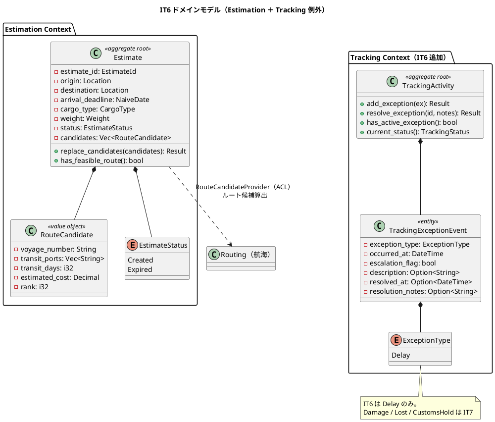
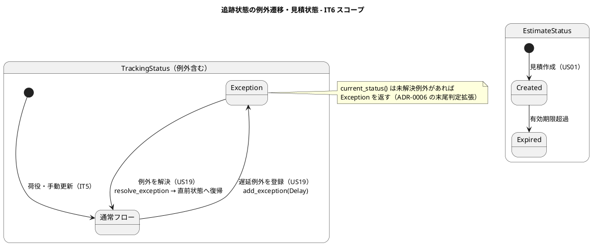
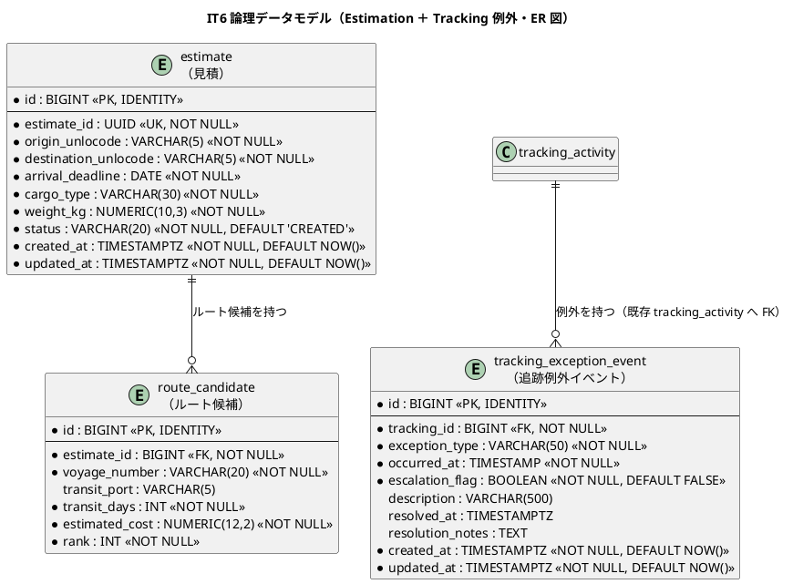
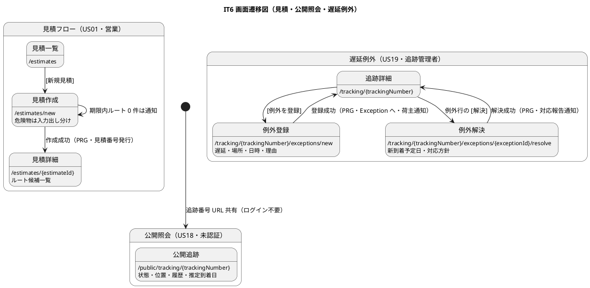
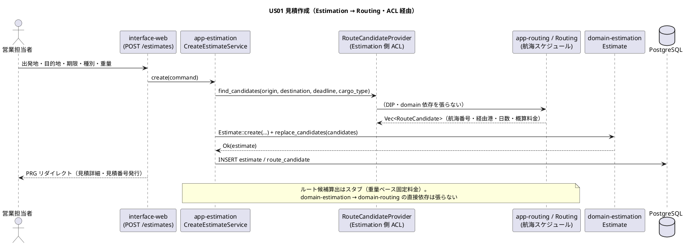

# イテレーション 6 計画

## 概要

| 項目 | 内容 |
|------|------|
| **イテレーション** | 6 |
| **期間** | Week 11-12（2 週間・2026-09-16 〜 2026-09-29） |
| **局面** | 終盤（アウトサイドイン） |
| **ゴール** | 既存の各コンテキスト集約（Routing・Tracking）を業務シナリオ起点で束ね、輸送見積の作成（US01）・追跡情報の公開照会（US18）・遅延例外の処理（US19）を成立させる。Estimation Context をスケルトンから本格実装し、Tracking Context に例外イベントを導入する（Release 1.1 例外対応・請求の起点） |
| **目標 SP** | 13（US01 5・US18 3・US19 5・release_plan Phase 3 準拠） |

---

## ゴール

### イテレーション終了時の達成状態

1. **輸送見積の作成（US01）**: 営業担当者が輸送要件（出発地・目的地・希望期限・貨物種別・重量）を入力すると、既存の航海スケジュール（Routing）を用いてルート概算候補（経由港・所要日数・概算料金・航海番号）が算出され、見積が保存されて見積番号（`EstimateId`・UUID）が発行される。`domain-estimation` の `Estimate` 集約（`RouteCandidate` の `Vec` を保持）をアウトサイドインで実装する。期限内ルートが無い場合はその旨を通知する。危険物入力フォームの出し分けに対応する。
2. **追跡情報の公開照会（US18）**: 荷主・荷受人が追跡番号を入力して貨物の現在状態・位置（港湾名）・追跡イベント履歴（時系列）・推定到着日を照会できる。**認証不要の公開ページ**（`/public/tracking/{trackingNumber}`）を提供し、荷主が URL を共有できる。CQRS の読み取り最適化（既存 `tracking_activity`／`tracking_handling_event` の Read Model クエリ）で実装する。
3. **遅延例外の処理（US19）**: 追跡管理者が追跡番号・例外種別「遅延」・発生状況（場所・日時・理由）を記録すると、`TrackingActivity` に `TrackingExceptionEvent` が追加され、`current_status()` が「例外発生（Exception）」を返すよう拡張される。荷主へ遅延通知が送信（記録）され、対応内容（新しい到着予定日・対応方針）の入力で対応報告を送信でき、例外対応履歴が記録される。

### 成功基準

- US01・US18・US19 の全受入基準に 1:1 対応するテストが存在し green。**通知系受入基準（US19 遅延通知・対応報告）は永続化テーブル（notification）をアサートする統合テストをセットで実装する（IT5 Try#1）**。
- `domain-estimation`・`app-estimation` がスケルトンから `Estimate` 集約・`RouteCandidate`・見積ユースケースを備えた実装へ昇格。
- `TrackingActivity` に `add_exception()`・`has_active_exception()` を実装し、`current_status()` が未解決例外時に `Exception` を返す（IT5 の純粋関数導出の拡張・ADR-0006 踏襲）。
- 公開追跡ページが認証不要ルートとして提供され、既存の認証必須ルートと分離される。
- ワークスペース clippy `-D warnings` クリーン・fmt 準拠・domain/app カバレッジ維持。

---

## ユーザーストーリー

### 対象ストーリー

| ID | ユーザーストーリー | SP | 対応 UC | アクター |
|----|-------------------|----|--------|--------|
| US01 | 輸送見積を作成する | 5 | UC01 | 営業担当者 |
| US18 | 追跡情報を照会する | 3 | UC15 | 荷主・荷受人 |
| US19 | 遅延例外を処理する | 5 | UC16 | 追跡管理者 |
| **合計** | | **13** | | |

### ストーリー詳細

#### US01: 輸送見積を作成する（5 SP）

**として** 営業担当者 **したい** 輸送要件を入力し輸送料金と所要日数の見積を作成したい **なぜなら** 荷主が予算と納期を事前に把握でき予約決定を迅速化できるからだ。

**受け入れ基準**:

- [ ] 出発地・目的地・希望期限・貨物種別・重量を入力できる
- [ ] 航海スケジュール情報をもとにルート概算候補が表示される
- [ ] ルート候補ごとに「経由港・所要日数・概算料金・航海番号」が表示される
- [ ] 見積情報が保存され、見積番号が発行される
- [ ] 希望期限に間に合うルートが存在しない場合、その旨が通知される
- [ ] 危険物が含まれる場合、危険物申告情報の入力フォームが表示される

#### US18: 追跡情報を照会する（3 SP）

**として** 荷主（または荷受人）**したい** 追跡番号で貨物の現在位置・状態・履歴・推定到着日を確認したい **なぜなら** 輸送状況をいつでも自分で確認できるからだ。

**受け入れ基準**:

- [ ] 追跡番号を入力して貨物情報を照会できる
- [ ] 現在の状態・位置（港湾名）・推定到着日が表示される
- [ ] 追跡イベント履歴（日時・場所・作業種別）が時系列で表示される
- [ ] 追跡番号が存在しない場合、「追跡番号が見つかりません」と表示される
- [ ] ログインなしでも追跡番号があれば照会できる

#### US19: 遅延例外を処理する（5 SP）

**として** 追跡管理者 **したい** 遅延を例外種別「遅延」として記録し荷主通知と対応内容を管理したい **なぜなら** 遅延情報を速やかに伝え対応策を提示できるからだ。

**受け入れ基準**:

- [ ] 追跡番号と例外種別「遅延」・発生状況（場所・日時・理由）を記録できる
- [ ] 記録後、貨物状態が「例外発生」に更新される
- [ ] 荷主に遅延発生の通知が送信される
- [ ] 対応内容（新しい到着予定日・対応方針）を入力して荷主に対応報告を送信できる
- [ ] 例外対応履歴が記録される

### タスク

#### 0. IT5 ふりかえり Try 返済枠（技術的負債返済・SP 外）

- [x] **Try#1**: 通知アサートテストを DoD 化。IT6 HTTP フローテストで notification テーブル（EXCEPTION_RAISED/EXCEPTION_RESOLVED）をアサート。対応表に通知アサート列を設置済み。
- [x] **Try#2**: ADR-0006 の Booking→Tracking 冪等再操作パスを実装（`find_by_booking_id` で既存追跡があれば既存番号を返し二重発行防止・`TrackingIssued` からの回復を許容）。
- [x] **Try#3（宛先解決）**: 宛先ハードコード解消。`resolve_recipient(booking_id)` で `cargo.consignee_email` へ解決（フォールバック付き）、HTTP フローで宛先アサート（レビュー H1）。**通知の実配信（メール送信）・照会画面の通知履歴導線は IT7 へ繰り越し**（記録＝送信の現行方針を継続）。
- [x] **Try#4**: `transport_status` を Read Model キャッシュとコード・マイグレーションに明記（ADR-0006）。
- [x] **Try#5**: `RouteCheckPort` を `enum RouteCheck { OnRoute, OffRoute, Unknown }` に分離（OffRoute のみ警告）。
- [~] **Try#6**: dashboard の最新荷役一覧・予約詳細への追跡番号表示。受入基準外の UX 拡充のため **IT7 へ繰り越し**（見積の有効期限・公開ページ再照会フォーム等の UX 改善とまとめて対応）。

#### 1. 見積ドメイン・アプリ（US01・アウトサイドイン起点）（US01 5 SP の一部）

- [x] `domain-estimation` を昇格: `Estimate` 集約・`EstimateId`（UUID）・`RouteCandidate`・`EstimateStatus`・`Weight`・`EstimateLocation`・`replace_candidates()`・`EstimateRepository` ポート（7 テスト）。
- [x] `app-estimation`: `CreateEstimateService`。`RouteCandidateProvider` ACL で既存 Routing を参照、概算料金は重量ベーススタブ（mockall 4 テスト）。
- [x] `infra-persistence`: `estimate`／`route_candidate` マイグレーションと `SqlxEstimateRepository`。

#### 2. 追跡照会（US18・CQRS 読み取り）（US18 3 SP）

- [x] 追跡照会は既存 `tracking_activity`＋`tracking_handling_event`（`find_by_tracking_number`）を Read Model として利用し現在状態・位置・履歴・推定到着日を表示。
- [x] 公開追跡ページ `/public/tracking/{trackingNumber}`（認証不要・`RoleGuard` 非適用）。不存在時は「追跡番号が見つかりません」。
- [x] 推定到着日は最新イベント日時から簡易導出（確定経路連携は後続 IT）。**既知の負債（レビュー H6）**: 受入基準の「到着"予定"」を厳密には満たさず、確定経路からの推定到着日導出を IT7 で実装。

#### 3. 遅延例外（US19・Tracking 例外イベント）（US19 5 SP）

- [x] `domain-tracking` に `TrackingExceptionEvent`・`ExceptionType`（Delay）・`add_exception()`・`has_active_exception()`・`resolve_exception()` を追加。`current_status()` を例外対応に拡張（4 テスト・計 12 green）。
- [x] `app-tracking`: `TrackingExceptionService`（遅延記録・対応報告）。荷主へ遅延通知・対応報告を記録（mockall 2 テスト）。
- [x] `infra-persistence`: `tracking_exception_event` マイグレーション（occurred_at は TIMESTAMPTZ で domain と整合）・sqlx 永続化（例外洗い替え）。
- [x] 例外登録 `/tracking/{n}/exceptions/new`→POST `.../exceptions`・例外解決 `.../{i}/resolve`（追跡管理者）。

#### 4. インターフェース（画面・htmx／PRG）

- [x] 見積一覧／作成（危険物出し分け）／詳細（`RoleGuard<SalesUser>`）・`RoutingRouteCandidateProvider` ACL。
- [x] 公開追跡ページ・例外登録／解決画面（追跡管理者）。
- [x] HTTP フロー統合テスト 5 件（testcontainers）で US01/US18/US19 を検証。
- [x] E2E デモ受け入れテスト 5 件（見積作成・候補無し・危険物出し分け・公開照会/共有 URL・遅延例外→対応報告）を追加（IT1〜IT6 全 25 件 green）。
- [~] dashboard 拡充（Try#6）は IT7 へ繰り越し（受入基準外 UX）。見積管理ナビは IT1 navbar 出力済み。

#### タスク合計

見積 13 SP（US01 5・US18 3・US19 5）＋ Try 返済枠（SP 外）。

---

## スケジュール

### Week 1（Day 1-5）

- Day 1: Try#2/#4/#5 返済（既存 Tracking/Handling の負債整理）＋ US01 受入テスト作成（アウトサイドイン起点）
- Day 2: `domain-estimation` 集約 TDD（`Estimate`・`RouteCandidate`・`EstimateStatus`）
- Day 3: `app-estimation` 見積作成＋ Routing ACL でルート候補算出・概算料金スタブ
- Day 4: `estimate`／`route_candidate` マイグレーション・sqlx リポジトリ・見積画面（危険物出し分け）
- Day 5: US01 HTTP フローテスト＋期限内ルート 0 件通知

### Week 2（Day 6-10）

- Day 6: US18 追跡照会 Read Model クエリ・推定到着日導出
- Day 7: 公開追跡ページ（認証不要ルート）＋不存在エラー・US18 HTTP フローテスト
- Day 8: `domain-tracking` 例外イベント（`add_exception`／`current_status` 拡張）＋ `tracking_exception_event` マイグレーション
- Day 9: US19 遅延例外記録・対応報告＋通知テーブルアサート（Try#1）・例外登録/解決画面＋ E2E（見積・照会・例外デモ）
- Day 10: Try#3（通知実配信・可視化）・Try#6（dashboard 拡充）返済＋受入基準×テスト対応表突合・developing-review 反映・クローズ準備

---

## 設計

> 本 IT の対象スコープに絞り、設計の各トピックに PlantUML 図を掲載する。US01/US19 は状態を持つ集約（Estimate・Tracking 例外）、US18 は読み取り照会であり、ドメインモデル図・状態遷移図・ER 図（データモデル）・画面遷移図（UI）・シーケンス図（US01 のルート候補算出 ACL）を掲載する。

### ドメインモデル（Estimation Context ＋ Tracking 例外・IT6 追加分）

> **BC 独立**: `domain-estimation` は他 BC の domain クレートに依存しない。ルート候補算出は app 層が Routing の ACL（`RouteCandidateProvider`）経由で行う（IT3-5 の ACL パターン踏襲）。

### 状態遷移図（TrackingStatus 例外遷移・EstimateStatus・IT6 中核）

### データモデル（Estimation ＋ Tracking 例外・IT6）

マイグレーション: `20260916000001_it6_estimation_exception.sql`（`estimate`・`route_candidate`・`tracking_exception_event`。`tracking_exception_event` は IT5 で繰延した分）。

### ユーザーインターフェース

| 画面 | パス | ロール | US |
|------|------|--------|----|
| 見積一覧 | `/estimates` | 営業担当者 | US01 |
| 見積作成 | `/estimates/new` | 営業担当者 | US01 |
| 見積詳細 | `/estimates/{estimateId}` | 営業担当者 | US01 |
| 公開貨物追跡 | `/public/tracking/{trackingNumber}` | 荷主・荷受人（未認証） | US18 |
| 例外登録 | `/tracking/{trackingNumber}/exceptions/new` | 追跡管理者 | US19 |
| 例外解決 | `/tracking/{trackingNumber}/exceptions/{exceptionId}/resolve` | 追跡管理者 | US19 |

#### 画面遷移図（IT6 スコープ）

### API 設計

- `POST /estimates`（見積作成・US01）／`GET /estimates`・`GET /estimates/{estimateId}`
- `GET /public/tracking/{trackingNumber}`（公開照会・US18・認証不要）
- 例外登録（US19）: `GET /tracking/{trackingNumber}/exceptions/new`（登録フォーム表示）→ `POST /tracking/{trackingNumber}/exceptions`（登録実行・PRG）
- 例外解決（US19）: `GET /tracking/{trackingNumber}/exceptions/{exceptionId}/resolve`（解決フォーム）→ `POST` 同パス（対応報告実行・PRG）
- 認可は `RoleGuard<R>`（`SalesUser`／`TrackerUser`）。公開照会のみ `RoleGuard` を通さない別ルーティングで提供する。

> **注（設計への反映が必要・命名統一）**: 追跡番号を渡すパスパラメータは、IT5 実装（`/tracking/{trackingNumber}`）・ドメイン値オブジェクト `TrackingNumber`・業務語「追跡番号」に一致する `{trackingNumber}` を正典とする。`ui_design.md`／`development_strategy.md` にあった `{trackingId}` 表記は本 IT で `{trackingNumber}` に統一済み（validating-iteration-plan／validating-design 指摘 #1）。

#### シーケンス図（US01 見積作成のルート候補算出・BC 跨ぎ ACL）

### ADR

- **ADR 踏襲**: ADR-0006（追跡状態の純粋関数導出）を例外イベントに拡張（`current_status()` が未解決例外時に `Exception`）。ADR-0003（Arc<dyn> 注入）・ADR-0001（CQRS Read Model 配置）を US18 照会クエリに適用。
- **ADR 候補**: 公開（認証不要）ルートの分離方式（`RoleGuard` を通さない別 Router マージ）は ADR-0002（認証方式）の派生。単独 ADR まで不要だが ADR-0002 に一文追記を検討。

### docs/design への反映が必要な設計要素（当該 IT で反映）

1. **`ExceptionType` を `domain-model.md` の Tracking Context 要素表で「IT6 は Delay のみ」と実装状況を明記**（現状 DELAY/DAMAGE/LOST/CUSTOMS_HOLD 全列挙）。
2. **`architecture_backend.md` の段階的実装計画**: Estimation を Phase 4 とする記述と、release_plan/development_strategy が US01 を IT6（終盤）に置く割り当ての整合を注記（イテレーション割当を正とする）。
3. **`ui_design.md` の見積・例外画面の salt/仕様**が実装と一致するか確認し、危険物出し分け・推定到着日の表示を反映。

---

## 受入基準 × テストケース対応表（Try #1・通知アサート列付き）

### US01: 輸送見積を作成する

| 受入基準 | 想定テスト | 通知アサート |
|---------|-----------|------------|
| 要件入力 | domain-estimation::見積は要件を保持する | - |
| ルート候補表示 | app-estimation::航海スケジュールからルート候補を算出する | - |
| 候補ごとの情報 | domain-estimation::ルート候補は経由港・日数・料金・航海番号を持つ | - |
| 見積番号発行 | app-estimation::見積を保存し見積番号を発行する / interface-web::estimate_flow 作成 | - |
| 期限内 0 件通知 | app-estimation::期限内ルートが無い場合を通知する | - |
| 危険物フォーム | interface-web::estimate_flow 危険物選択で申告フォーム表示 | - |

### US18: 追跡情報を照会する

| 受入基準 | 想定テスト | 通知アサート |
|---------|-----------|------------|
| 番号で照会 | interface-web::public_tracking_flow 照会 | - |
| 現在状態・位置・推定到着日 | infra::tracking_query 現在状態と推定到着日を返す | - |
| 履歴時系列 | infra::tracking_query イベント履歴を時系列で返す | - |
| 不存在エラー | interface-web::public_tracking_flow 不存在は 404/メッセージ | - |
| 未認証照会 | interface-web::public_tracking_flow 未認証で照会できる | - |

### US19: 遅延例外を処理する

| 受入基準 | 想定テスト | 通知アサート |
|---------|-----------|------------|
| 遅延記録 | domain-tracking::遅延例外を追加できる / app-tracking::遅延例外を記録する | - |
| Exception 更新 | domain-tracking::未解決例外があると current_status は Exception | - |
| 遅延通知 | interface-web::exception_flow 遅延登録 | **notification に EXCEPTION_RAISED 記録（宛先＝荷受人連絡先）** |
| 対応報告 | app-tracking::対応報告を記録する | **notification に EXCEPTION_RESOLVED 記録** |
| 対応履歴 | domain-tracking::例外を解決すると resolved_at が記録される | - |

---

## リスクと対策

| リスク | 影響 | 対策 |
|--------|------|------|
| Estimation がスケルトンからの新規実装で US01 8 SP が大きい | 13 SP 未達 | アウトサイドインで受入テストを先に固定し、ルート候補算出は既存 Routing 再利用＋料金スタブで薄く。危険物出し分けは US05 の実装を流用 |
| 公開（認証不要）ルートの分離ミスで認証必須ページが露出 | セキュリティ | `/public/*` を `RoleGuard` を通さない専用 Router として明示分離し、他ルートは従来通り認証必須。ルーティングテストで未認証アクセスの可否を検証 |
| 例外イベント導入で `current_status()` の既存挙動が変わる | IT5 回帰 | ADR-0006 の末尾判定拡張を「未解決例外があれば Exception、無ければ従来導出」に限定し、IT5 の追跡フローテストが回帰しないことを確認 |
| 見積 → 予約引き継ぎ導線 | スコープ肥大 | 本 IT は見積作成・保存までとし、見積 → 予約フォーム引き継ぎは後続（US01 受入に含まれないため範囲外と明記） |

---

## 完了条件

### Definition of Done

- [ ] US01・US18・US19 の全受入基準に対応するテストが存在し green（通知系は notification テーブルをアサート・Try#1）
- [ ] `domain-estimation`・`app-estimation` が集約・値オブジェクト・ユースケースを備え実装昇格
- [ ] `TrackingActivity` の例外イベント（`add_exception`／`current_status` 拡張）実装・IT5 追跡フローが回帰しない
- [ ] マイグレーション `20260916000001_it6_estimation_exception.sql` 適用・infra 統合テスト green
- [ ] 公開追跡ページが認証不要ルートとして分離され、未認証アクセスのルーティングテストが green
- [ ] ナビゲーション整合（見積管理・検証テスト）・dashboard 拡充（Try#6）
- [ ] ワークスペース clippy `-D warnings` クリーン・fmt 準拠・domain/app カバレッジ維持
- [ ] IT5 Try#1〜#6 の返済完了
- [ ] developing-review（5 エージェント並列）の高優先度指摘をクローズ前に対応

### デモ項目

1. 営業担当者が輸送要件を入力 → ルート候補（経由港・日数・料金・航海番号）表示 → 見積保存・見積番号発行（US01）
2. 期限内ルートが無い要件で見積 → その旨を通知（US01）
3. 荷主が追跡番号を未認証で公開ページ照会 → 現在状態・位置・履歴・推定到着日（US18）
4. 追跡管理者が遅延例外を登録 → 貨物状態が例外発生に・荷主へ遅延通知（US19）
5. 追跡管理者が対応報告（新到着予定日・対応方針）→ 荷主へ対応報告通知・履歴記録（US19）

---

## 更新履歴

| 日付 | 内容 |
|------|------|
| 2026-07-23 | IT6 計画初版作成（opening-iteration・IT5 ふりかえり Try 反映） |
| 2026-07-23 | validating-iteration-plan／validating-design 反映: 追跡番号パスを `{trackingNumber}` に統一（ui_design/development_strategy 修正）、例外の GET フォーム→POST 登録パスを明記、domain-model の ExceptionType 実装状況注記を反映 |

---

## 関連ドキュメント

- [リリース計画](./release_plan.md)
- [開発戦略](./development_strategy.md)
- [イテレーション 5 ふりかえり](./retrospective-5.md)
- [ドメインモデル設計](../design/domain-model.md)
- [データモデル設計](../design/data-model.md)
- [UI 設計](../design/ui_design.md)
- [ユーザーストーリー](../requirements/user_story.md)
- [ADR-0006 追跡状態の純粋関数導出と Booking→Tracking 回復戦略](../adr/0006-tracking-status-derivation-and-cross-context-recovery.md)
