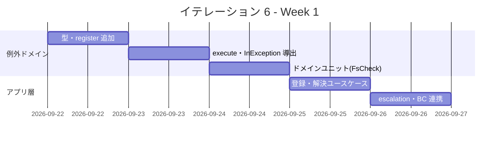
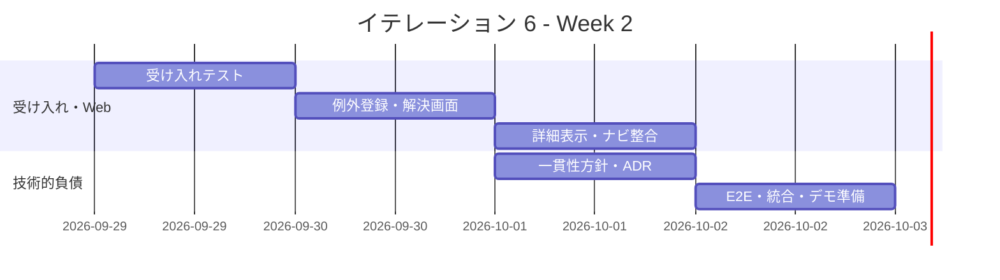
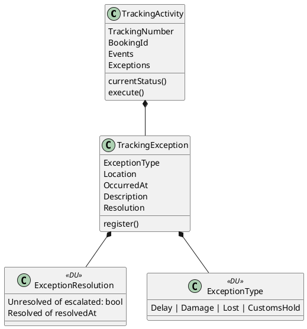
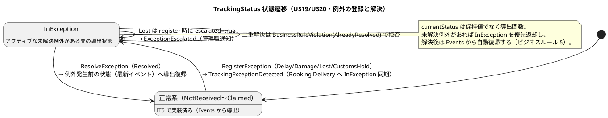
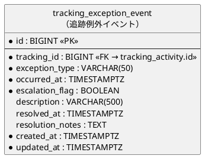
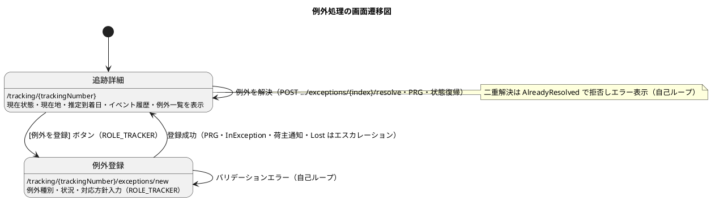

# イテレーション 6 計画

## 概要

| 項目 | 内容 |
|------|------|
| **イテレーション** | 6 |
| **期間** | Week 11-12（2 週間・2026-09-22 〜 2026-10-03 計画） |
| **ゴール** | 輸送中の例外（遅延・破損・紛失）を追跡管理者が登録し、貨物状態を「例外発生」（InException）へ自動遷移させ、荷主通知・エスカレーション・対応報告までを一気通貫させる。Release 1.1 の例外対応フローを完成させ、IT5 の技術的負債（荷役→追跡の一貫性・追跡照会の所有者制御）を解消する。 |
| **目標 SP** | 6（US19/US20）+ Release 1.0 フィードバック対応・retro-5 Try 消化 |

---

## ゴール

### イテレーション終了時の達成状態

1. **遅延例外の登録と荷主通知（US19）**: 追跡管理者が追跡番号で貨物を特定し、例外種別「遅延」と発生状況（場所・日時・理由）を登録すると、貨物状態が `InException`（例外発生）へ導出遷移し、荷主へ遅延通知が送信される。対応内容（新到着予定日・対応方針）を入力して対応報告を送信し、例外を `Resolved` へ遷移できる。
2. **破損・紛失例外の登録とエスカレーション（US20）**: 例外種別「破損」または「紛失」を登録でき、「紛失」（Lost）の場合は `TrackingException.register` が必ずエスカレーションフラグを立て `ExceptionEscalated` イベントを発行し、管理職への escalation 通知が送信される。荷主にも緊急通知が送信される。
3. **例外解決と状態復帰（ビジネスルール 5）**: `ResolveException` により例外が `Resolved` へ遷移すると、`currentStatus`（導出値）が例外発生前の状態（最新イベントから導出）へ自動復帰する。二重解決は `BusinessRuleViolation`（AlreadyResolved）で拒否される。
4. **BC 間連携（例外→輸送状態）**: 例外登録で `TrackingExceptionDetected` を発行し、輸送状態を `InException` に反映する。**注（実装で判明）**: Booking 側に `transport_status` カラムは未実体化（data-model の「将来追加予定」）で、輸送状態は Tracking 自身の `tracking_activity.transport_status`（`currentStatus`→`toTransportStatus` の非正規化キャッシュ）に保持される。したがって例外の InException は Tracking のリポジトリ保存で自動反映され、Booking への越境書き込み先は現時点で存在しない。`TrackingExceptionDetected` は発行イベントとして残し（将来の Booking 実体化時に消費）、本 IT は Tracking 内の永続化整合（例外の save/load）で InException の往復を保証する。
5. **技術的負債の解消（retro-5 Try#1/#4）**: 荷役登録と追跡イベント記録の一貫性方針を確定（合成層ヘルパ or 補償/再試行方針の明文化）し、追跡照会の所有者制御方針を ADR 化する。

### 成功基準

- [ ] `RegisterException`（Delay/Damage/Lost/CustomsHold）で `TrackingException` が登録され、`currentStatus` が `InException` へ導出遷移することがユニット（FsCheck 込み）で検証される
- [ ] Lost 例外は必ず `Unresolved (escalated=true)` で生成され `ExceptionEscalated` を発行する（ビジネスルール 3）ことがユニットで保証される
- [ ] `ResolveException` で状態が例外発生前へ復帰し、二重解決が拒否される（ビジネスルール 5）ことがユニットで検証される
- [ ] 「例外登録 → 荷主通知 →（Lost 時）エスカレーション通知 → 対応報告 → 解決 → 状態復帰」が受け入れテストで一気通貫する
- [ ] `TrackingExceptionDetected` が Booking の Delivery（InException 同期）に伝播することが統合テストでパスする
- [ ] 例外登録画面（`/tracking/{trackingNumber}/exceptions/new`・ROLE_TRACKER）と追跡詳細からの解決導線が動作する。例外登録は navbar 直下ではなく追跡詳細（`/tracking`・ROLE_TRACKER 含む）配下の導線のため、navbar は変更せず [例外を登録]／[例外を解決] ボタンのロール条件表示＋ナビ表示の検証テストで整合性を担保する
- [ ] 追跡詳細に現在地・推定到着日が表示され（レビュー高#5）、追跡番号発行通知に公開追跡 URL が同梱される（レビュー高#6）
- [ ] IT5 レビュー IT6 送り（高 2・中 6）と retro-5 Try#1/#4 が消化済み（「過去レビュー・ふりかえり指摘の反映」表のとおり）
- [ ] ドメイン被覆 85%／全体 80% のカバレッジゲート・ArchUnit（BC 分離）が緑
- [ ] テストカバレッジ 80% 以上

> **アプローチ（終盤アウトサイドイン IT6-IT7）**: [開発戦略](./development_strategy.md#終盤-アウトサイドインit6-it7)に従い、実装済みの Tracking 集約を業務シナリオ（例外登録〜対応報告）起点で結合する。受け入れテスト → Web → アプリ層 → ドメイン（`RegisterException`/`ResolveException`）の順に外側から駆動し、既存の ACL＝関数レコード・NotificationPort・Clock ポート・post-commit dispatch・カバレッジゲート・ArchUnit の規律を踏襲する。例外の解決状態は `ExceptionResolution` DU で表現し「解決済みなのに時刻が null」という不正状態を型で排除する。

### 過去レビュー・ふりかえり指摘の反映

IT5 レビュー（[開発成果物_IT5_review_20260716.md](../review/開発成果物_IT5_review_20260716.md)）の **IT6 送り**（高 2・中 6）と retro-5 Try を本 IT で消化する。

| 出典 | 指摘 | 反映先タスク | 対応方針 |
|------|------|-------------|----------|
| レビュー高#5 | US18 追跡照会に現在地・推定到着日を表示 | 4.3 | 本 IT 必須 |
| レビュー高#6 | 公開追跡 URL を荷主へ提示する導線 | 4.4 | 本 IT 必須 |
| レビュー中#1 | `applyCommand` の dispatch 例外にログを残す | 4.6 | 本 IT（通知是正とセット） |
| レビュー中#2 | `syncEvents` を append-only 化 | 4.5 | 本 IT |
| レビュー中#3 | 通知 recipient を荷主識別子へ是正 | 4.6 | 本 IT |
| レビュー中#4 | US16 荷役登録の確認ステップ明示 | 4.7 | 本 IT |
| レビュー中#5 | 荷役→追跡の別トランザクション原子性 | 4.1 | 本 IT（retro-5 Try#1 と統合） |
| レビュー中#6 | `DateTimeOffset.Parse` 例外経路のテスト | 4.7 | 本 IT |
| retro-5 Try#4 | 追跡照会の所有者制御方針を ADR 化 | 4.2 | 本 IT（ADR-0011） |

> retro-5 Try#2（通知の実メール送信・recipient 実解決）は「通知強化 IT」へ送るが、中#3 の recipient 是正（荷主識別子化）は本 IT で先行実施する。

---

## ユーザーストーリー

### 対象ストーリー

| ID | ユーザーストーリー | SP | 優先度 |
|----|-------------------|----|----|
| US19 | 遅延例外を処理する | 3 | 必須 |
| US20 | 破損・紛失例外を処理する | 3 | 必須 |
| **合計** | | **6** | |

### ストーリー詳細

#### US19: 遅延例外を処理する

**ストーリー**:
> 追跡管理者として、輸送中に遅延が発生した場合、例外種別「遅延」として記録し、荷主への通知と対応内容を管理したい。なぜなら、遅延情報を速やかに荷主に伝え、対応策（代替ルート等）を迅速に提示できるからだ。

**対応 UC**: UC16

**受入条件**:

1. 追跡番号と例外種別「遅延」・発生状況（場所・日時・理由）を記録できる
2. 記録後、貨物状態が「例外発生」（InException）に更新される
3. 荷主に遅延発生の通知が送信される
4. 対応内容（新しい到着予定日・対応方針）を入力して荷主に対応報告を送信できる
5. 例外対応履歴が記録される

#### US20: 破損・紛失例外を処理する

**ストーリー**:
> 追跡管理者（または荷役作業員）として、輸送中に破損または紛失が発生した場合、例外種別「破損」または「紛失」として記録し、関係者に緊急通知を送りたい。なぜなら、重大な例外は即座に全関係者に共有し、保険手続き・補償対応・代替措置を迅速に開始できるからだ。

**対応 UC**: UC16

**受入条件**:

1. 追跡番号と例外種別「破損」または「紛失」・発生状況を記録できる
2. 記録後、貨物状態が「例外発生」（InException）に更新される
3. 例外種別「紛失」の場合、緊急フラグが設定されて管理職への escalation 通知が送信される
4. 荷主に破損・紛失発生の通知が送信される
5. 対応内容（補償方針等）を入力して荷主に報告を送信できる

---

## タスク

### 1. 例外ドメイン（US19/US20・3 SP）

| # | タスク | 見積もり | 担当 | 状態 |
|---|--------|---------|------|------|
| 1.1 | `ExceptionType`/`ExceptionResolution`/`TrackingException` 型と `register`（Lost→escalated）を Domain.fs に追加（IT5 デスコープ分の起こし込み） | 3h | - | [x] |
| 1.2 | `TrackingCommand` に `RegisterException`/`ResolveException` を追加し `execute` を拡張（イベント発行含む） | 3h | - | [x] |
| 1.3 | `currentStatus` の `InException` 導出（アクティブ例外優先・解決後復帰）を実装 | 2h | - | [x] |
| 1.4 | ドメインユニット（FsCheck: 例外登録→InException、Lost→escalated、解決→復帰、二重解決拒否） | 4h | - | [x] |

**小計**: 12h（理想時間）

### 2. アプリ層・BC 連携（US19/US20・2 SP）

| # | タスク | 見積もり | 担当 | 状態 |
|---|--------|---------|------|------|
| 2.1 | Application.fs に例外登録・解決ユースケースを追加（NotificationPort で荷主通知・Clock ポートで時刻注入） | 3h | - | [x] |
| 2.2 | Lost 時の管理職 escalation 通知経路（`ExceptionEscalated` 消費）を結線（`EscalationNotifier` ポート・アプリ層で発行イベント検査） | 2h | - | [x] |
| 2.3 | 例外の永続化（`tracking_exception_event` マイグレーション 0011・save/update の `syncExceptions`・reconstruct 復元）と InException 往復統合テスト | 3h | - | [x] |
| 2.4 | 例外登録・解決の受け入れテスト（一気通貫: 登録→通知→エスカレーション→対応報告→解決→復帰） | 3h | - | [x] |

**小計**: 11h（理想時間）

### 3. Web UI・例外画面（US19/US20・1 SP）

| # | タスク | 見積もり | 担当 | 状態 |
|---|--------|---------|------|------|
| 3.1 | 例外登録画面（`GET/POST /tracking/{trackingNumber}/exceptions/new`・ROLE_TRACKER） | 3h | - | [x] |
| 3.2 | 例外解決・対応報告（`POST /tracking/{trackingNumber}/exceptions/{index}/resolve`・追跡詳細のインライン解決フォーム） | 2h | - | [x] |
| 3.3 | 追跡詳細に例外一覧・状態（InException）表示と [例外を登録]／[解決] ボタン（ROLE_TRACKER 条件表示）を追加し、受け入れテストで権限・一気通貫を検証 | 2h | - | [x] |

**小計**: 7h（理想時間）

### 4. 技術的負債の解消（IT5 レビュー IT6 送り・retro-5 Try・Release 1.0 フィードバック）

> IT5 レビュー（[開発成果物_IT5_review_20260716.md](../review/開発成果物_IT5_review_20260716.md)）で **IT6 送り**とされた高 2 件・中 6 件を本節で消化する。対応関係は「過去レビュー・ふりかえり指摘の反映」表を参照。

| # | タスク | 見積もり | 担当 | 状態 |
|---|--------|---------|------|------|
| 4.1 | 荷役登録→追跡イベント記録の一貫性方針を確定（合成層ヘルパ or 補償/再試行の明文化・retro-5 Try#1／レビュー中#5） | 3h | - | [ ] |
| 4.2 | 追跡照会の所有者制御方針を ADR 化（capability ベース or 認証経路の所有者チェック・retro-5 Try#4） | 2h | - | [ ] |
| 4.3 | US18 追跡照会に現在地・推定到着日を表示（TrackingView 拡張・レビュー高#5） | 2h | - | [ ] |
| 4.4 | 公開追跡 URL を荷主へ提示する導線を追加（追跡番号発行通知に access_token URL を同梱・レビュー高#6） | 2h | - | [ ] |
| 4.5 | `syncEvents` を全置換（DELETE→INSERT）から append-only に変更（レビュー中#2） | 2h | - | [ ] |
| 4.6 | 通知の recipient を TrackingNumber から荷主識別子へ是正し、dispatch 例外にログを残す（レビュー中#3・中#1） | 3h | - | [ ] |
| 4.7 | US16 荷役登録の確認ステップ明示・`DateTimeOffset.Parse` 例外経路のテスト追加（レビュー中#4・中#6） | 2h | - | [ ] |
| 4.8 | Release 1.0 の E2E に例外シナリオ（US19/US20）を追加し一気通貫を維持 | 2h | - | [ ] |

**小計**: 18h（理想時間）

> **スコープ注記**: 本節は 18h とストーリー本体（30h）に匹敵する。6 SP のストーリーを優先確定させ、超過時はフィーチャバッファで **4.1（原子性設計）→ 4.6（通知モデル）** の順に IT7 前半へ繰越す（レビュー中指摘は IT7 送り可、高指摘は本 IT で必須対応）。

#### タスク合計

| カテゴリ | SP | 理想時間 | 状態 |
|---------|----|----|------|
| 例外ドメイン | 3 | 12h | [x] |
| アプリ層・BC 連携 | 2 | 11h | [x] |
| Web UI・例外画面 | 1 | 7h | [x] |
| 技術的負債の解消 | - | 18h | [ ] |
| **合計** | **6** | **48h** | |

**1 SP あたり**: 約 8.0h（IT5 レビュー IT6 送り・改善タスク 18h を含む）
**進捗率**: 100% (6/6 SP・US19/US20 ストーリー完了。残は技術的負債タスク 4)

---

## スケジュール

### Week 1（Day 1-5）

| 日 | タスク |
|----|--------|
| Day 1 | 1.1 型・register（Lost→escalated） |
| Day 2 | 1.2/1.3 execute 拡張・InException 導出 |
| Day 3 | 1.4 ドメインユニット（FsCheck） |
| Day 4 | 2.1 登録・解決ユースケース（通知・Clock） |
| Day 5 | 2.2/2.3 escalation・BC 連携（Booking 同期） |

### Week 2（Day 6-10）

| 日 | タスク |
|----|--------|
| Day 6 | 2.4 例外の受け入れテスト（一気通貫） |
| Day 7 | 3.1/3.2 例外登録・解決導線／4.3 US18 現在地・推定到着日表示 |
| Day 8 | 3.3 詳細に例外一覧・InException 表示・ナビ整合／4.4 公開追跡 URL 導線 |
| Day 9 | 4.1/4.2 一貫性方針・所有者制御 ADR／4.5 syncEvents append-only／4.6 通知 recipient 是正・ログ |
| Day 10 | 4.7 US16 確認ステップ・Parse 例外テスト／4.8 E2E 例外シナリオ、統合テスト、バグ修正、デモ準備 |

---

## 設計

### ドメインモデル

> 実装対象は [ドメインモデル設計](../design/domain-model.md) の Tracking Context（§4）に定義済み。IT5 でデスコープした `TrackingException`・`ExceptionResolution`・`RegisterException`/`ResolveException` を IT6 で起こし込む。`ExceptionResolution` DU で「解決済みなのに時刻が null」という不正状態を型で排除する（ビジネスルール 5・6）。

### 状態遷移（IT6 スコープ: InException・解決復帰）

> IT5 の状態遷移図（正常系 NotReceived〜Claimed）を前提に、IT6 は `InException`（9 ケース目）とその解決復帰を追加する。domain-model のビジネスルール 5（導出値による自動復帰）・ルール 3（Lost は必ずエスカレーション）に整合する。

### データモデル

> [データモデル設計](../design/data-model.md#tracking_exception_event追跡例外イベント) の `tracking_exception_event`（定義済み・テーブル本体は未マイグレーション）を IT6 のマイグレーション（0011 予定）で作成する。永続化マッピングの要点:
>
> - ドメインの `ExceptionResolution` DU（`Unresolved of escalated: bool` / `Resolved of resolvedAt`）は、DB では `escalation_flag`（BOOLEAN）＋ `resolved_at`（NULL 可）の 2 カラムへ写像する。読み出し時に `resolved_at` が NULL なら `Unresolved escalation_flag`、非 NULL なら `Resolved resolved_at` に復元する。
> - `exception_type` の文字列表現は `DELAY`/`DAMAGE`/`LOST`/`CUSTOMS_HOLD`（data-model.md の記載に準拠）とし、`ExceptionType.ofString`/`toString` で相互変換する。UI ラベル（`DELAYED（遅延）`等）は表示専用で、永続値には data-model の値を用いる。
> - **注（data-model.md / ui_design.md 反映）**: data-model の `exception_type` 例（`DAMAGE`/`DELAY`）と ui_design の選択肢コード（`DAMAGED`/`DELAYED`）が不一致。IT6 完了時に永続値を `DELAY`/`DAMAGE`/`LOST`/`CUSTOMS_HOLD` に統一し、ui_design の表示コードへ注記を追加する。

### ユーザーインターフェース（ビュー）

> [UI 設計](../design/ui_design.md#例外登録-trackingtrackingnumberexceptionsnew) の「例外登録」画面（`/tracking/{trackingNumber}/exceptions/new`・ROLE_TRACKER）に準拠する。ナビバーは `{/ <b>CargoTracker</b> | 貨物予約 | <b>貨物追跡</b> | 荷役管理 | [ログアウト] }` 形式、入力項目は例外種別・発生場所（港コード）・発生日時・状況説明・対応方針、「荷主に通知する」チェックボックス（デフォルト ON）、LOST 選択時のエスカレーション警告表示。追跡詳細（`/tracking/{trackingNumber}`）の [例外を登録] ボタン（ROLE_TRACKER のみ表示）から遷移する。
>
> **注（ui_design.md 反映予定）**: ui_design では対応方針を例外登録フォームに含め、独立した「例外解決／対応報告」画面を定義していない。US19/US20 の受入基準（対応報告の送信＝`ResolveException`）を満たすため、IT6 では追跡詳細から解決アクション（`POST /tracking/{trackingNumber}/exceptions/{index}/resolve`）を追加する。この解決導線は ui_design に未記載のため、IT6 完了時に ui_design へ「例外解決」state・導線を追記する。

### インタラクション

> フィードバック規約（ui_design 準拠）: 登録成功は PRG で追跡詳細へリダイレクトし成功アラート（`alert-success`）、バリデーションエラーは同一フォームへ再表示（`alert-danger`）、LOST 選択時のエスカレーションは警告表示（`alert-warning`）。

### API 設計

| メソッド | エンドポイント | 説明 |
|---------|---------------|------|
| GET | /tracking/{trackingNumber}/exceptions/new | 例外登録フォーム（ROLE_TRACKER） |
| POST | /tracking/{trackingNumber}/exceptions/new | 例外登録（Delay/Damage/Lost・InException 遷移・通知） |
| POST | /tracking/{trackingNumber}/exceptions/{index}/resolve | 例外解決・対応報告送信 |

### ADR

| ADR | タイトル | ステータス |
|-----|---------|-----------|
| [ADR-0011](../adr/0011-tracking-access-control.md)（新規予定） | 追跡照会の所有者制御方針（capability ベース or 認証経路の所有者チェック・retro-5 Try#4） | 提案 |

> 永続化: `tracking_exception_event` テーブルはマイグレーション 0011 で作成する（data-model.md 準拠）。
>
> **注（ADR 番号の連続性）**: 既存 ADR は 0001〜0010。IT5 計画で「ADR-0011（候補・予約確定→追跡番号発行 BC 連携）」を挙げたが、当該連携は ADR-0002 改訂に統合され ADR-0011 は未作成のため、本 IT で 0011 を所有者制御方針に充てる。例外→予約の InException 同期（`TrackingExceptionDetected`）は既存の ADR-0002（post-commit）・ADR-0010（合成層 ACL）パターンの踏襲であり新規 ADR は起こさない。

---

## リスクと対策

| リスク | 影響度 | 対策 |
|--------|--------|------|
| 例外の解決による状態復帰（導出値）の検証漏れ | 中 | `currentStatus` を保持値でなく導出関数として FsCheck で網羅（登録→解決→復帰の往復性を性質テスト化） |
| Booking への `TrackingExceptionDetected` 伝播（BC 越境）の一貫性 | 中 | IT4/IT5 の post-commit dispatch 方式を踏襲し、統合テストで Delivery の InException 同期を検証 |
| 改善タスク（retro Try#1/#4）が例外実装を圧迫 | 中 | 6 SP のストーリーを優先確定させ、4.1/4.2 は Day 9 に配置。超過時はフィーチャバッファで 4.1 を IT7 前半へ繰越 |
| Lost 時のエスカレーション通知先（管理職）の recipient 未確定 | 低 | 実送信は retro-5 Try#2 に委ね、IT6 は NotificationPort のログ/スタブ送信で escalation 経路の結線を実証 |

---

## 完了条件

### Definition of Done

- [ ] コードレビュー完了（self-review + 必要に応じ developing-review）
- [ ] ユニットテストがパス（FsCheck 含む・ドメイン被覆 85%）
- [ ] 受け入れ・統合・E2E テストがパス（例外シナリオ一気通貫）
- [ ] `dotnet build` 警告なし・ArchUnit（BC 分離）緑
- [ ] 例外登録・解決機能がローカル環境で動作確認済み（ナビゲーション整合性含む）
- [ ] ドキュメント更新完了（domain-model の IT6 実装状況・ADR-0011・release_plan 進捗）

### デモ項目

1. 追跡詳細から遅延例外を登録 → 貨物状態が InException へ遷移 → 荷主へ遅延通知
2. 紛失例外を登録 → escalation フラグ設定 → 管理職エスカレーション通知 + 荷主緊急通知
3. 対応内容を入力して解決 → 状態が例外発生前へ復帰 → 対応報告送信（二重解決は拒否）

---

## 更新履歴

| 日付 | 更新内容 | 更新者 |
|------|---------|--------|
| 2026-07-17 | 初版作成（US19/US20・6 SP + retro-5 Try#1/#4・終盤アウトサイドイン） | - |

---

## 関連ドキュメント

- [イテレーション 6 ふりかえり](./retrospective-6.md)
- [ドメインモデル設計 - Tracking Context](../design/domain-model.md)
- [開発戦略 - 終盤アウトサイドイン](./development_strategy.md)
- [リリース計画](./release_plan.md)
