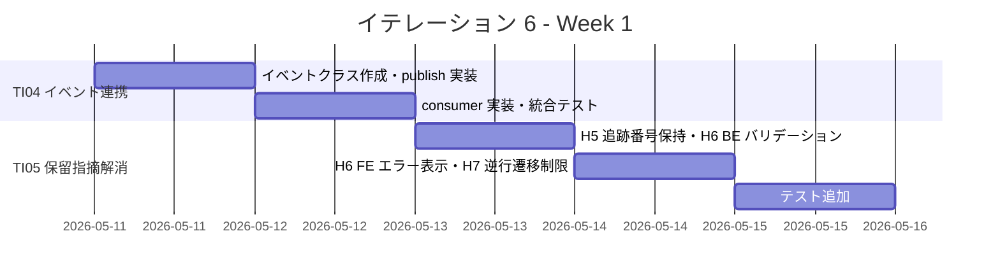
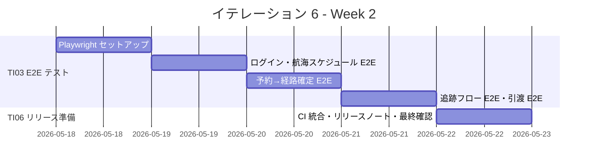
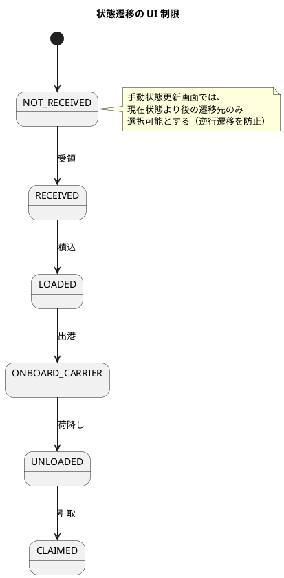

# イテレーション 6 計画

## 概要

| 項目 | 内容 |
|------|------|
| **イテレーション** | 6 |
| **期間** | Week 11-12（2026-05-11〜2026-05-22） |
| **ゴール** | MVP 統合テスト（Playwright E2E）・品質改善・IT4/IT5 持ち越し指摘解消を行い、Release 0.1.0 MVP をリリース可能な状態にする |
| **目標 SP** | 22（技術タスクのみ、ベロシティ実績 23.8 SP/IT を踏まえ IT5 レビュー指摘対応を追加） |

---

## ゴール

### イテレーション終了時の達成状態

1. **E2E テスト整備（TI03）**: 予約→経路設計→追跡の基幹フロー全体を Playwright E2E テストでカバーし、リグレッション防止基盤が構築されている
2. **マイクロサービス間連携完成（TI04）**: bookingms → trackingms の TRACKING_ISSUED 遷移が RabbitMQ イベント連携で動作している
3. **IT4 コードレビュー保留指摘解消（TI05）**: H5（荷役記録成功後の追跡番号保持）・H6（API エラーレスポンスの具体メッセージ）・H7（手動状態更新の逆行遷移 UI 制限）が解消されている
4. **IT5 コードレビュー高優先度指摘解消（TI07）**: TrackingQueryService ユニットテスト追加・イベント発行テスト追加・イベント履歴状態列バグ修正・経路通知バッジ表示条件修正が完了している
5. **Release 0.1.0 リリース準備完了**: リリース条件（全テストパス・ArchUnit パス・E2E パス・BE カバレッジ 80%+・FE カバレッジ 70%+）を全て充足している

### 成功基準

- [ ] Playwright E2E テスト: 予約登録→経路算出→経路確定→追跡番号発行→荷役記録→追跡照会の基幹フローが通過する
- [ ] bookingms → trackingms の RabbitMQ イベント連携が動作する（TRACKING_ISSUED 遷移）
- [ ] IT4 コードレビュー保留指摘 H5/H6/H7 が解消されている
- [ ] IT5 コードレビュー高優先度指摘 #1〜#5 が解消されている
- [ ] 全ユニットテスト（BE + FE）がパス
- [ ] アーキテクチャテスト（ArchUnit）がパス
- [ ] BE テストカバレッジ 80% 以上
- [ ] FE テストカバレッジ 70% 以上
- [ ] SonarQube Quality Gate PASS

---

## ユーザーストーリー

### 対象ストーリー

IT6 は新規ユーザーストーリーなし。技術タスク（品質改善・統合テスト・リリース準備）のみ。

| ID | タスクテーマ | BE | FE | SP | 優先度 |
|----|------------|----|----|-----|--------|
| TI03 | Playwright E2E テスト整備（基幹フロー） | 0 | 8 | 8 | 必須 |
| TI04 | bookingms → trackingms RabbitMQ イベント連携 | 3 | 0 | 3 | 必須 |
| TI05 | IT4 コードレビュー保留指摘解消（H5/H6/H7） | 1 | 3 | 4 | 必須 |
| TI07 | IT5 コードレビュー高優先度指摘解消（#1〜#5） | 2 | 2 | 4 | 必須 |
| TI06 | Release 0.1.0 リリース準備（リリースノート・カバレッジ確認・バグ修正） | 1 | 2 | 3 | 必須 |
| **合計** | | **7** | **15** | **22** | |

> **注**: 目標 SP を 22 に設定。IT1〜IT5 の平均ベロシティ 23.8 SP/IT に対し、品質・テスト中心のイテレーションのためバッファを持たせた。IT5 レビュー高優先度指摘の対応（TI07: 4 SP）を追加。

### タスク詳細

#### TI03: Playwright E2E テスト整備（8 SP）

IT4・IT5 で先送りされた E2E テストを本格的に整備する。

**対象シナリオ**:

1. ログイン → ダッシュボード表示
2. 航海スケジュール登録 → 検索
3. 貨物予約登録 → 経路候補算出 → 経路選択・確定 → 予約確定
4. 追跡番号発行 → 荷役作業記録 → 貨物状態更新 → 追跡情報照会
5. 予約引渡 → 経路設計担当一覧表示

#### TI04: bookingms → trackingms RabbitMQ イベント連携（3 SP）

IT4 から持ち越し。予約確定後に追跡番号が発行された際、bookingms の予約状態を TRACKING_ISSUED に遷移させる。

**対応内容**:

- trackingms が追跡番号発行時に `TrackingNumberIssuedEvent` を RabbitMQ に publish する
- bookingms が `TrackingNumberIssuedEvent` を consume し、予約状態を TRACKING_ISSUED に更新する
- 統合テストで双方向イベント連携を検証する

#### TI05: IT4 コードレビュー保留指摘解消（4 SP）

IT5 計画で保留とした H5/H6/H7 を解消する。

**対応項目**:

- [H5] 荷役記録成功後にフロントエンドで追跡番号を保持し、連続記録を可能にする（FE 改善）
- [H6] API エラーレスポンスに具体的なメッセージ（フィールド名・制約違反内容）を含める（BE + FE）
- [H7] 手動状態更新画面で逆行遷移（例: LOADED → RECEIVED）を UI レベルで制限する（FE 改善）

#### TI07: IT5 コードレビュー高優先度指摘解消（4 SP）

IT5 レビュー（`it5_review_20260509.md`）の高優先度指摘 #1〜#5 を解消する。

**対応項目**:

- [#1] `TrackingQueryService` のユニットテスト追加（正常・NotFound・不正フォーマット境界値）（BE）
- [#2] `confirmBooking` 時の `CargoAssignedForRoutingEvent` 発行テスト追加（BE）
- [#3] `RecordingCargoEventPublisher` に `publishCargoAssignedForRouting` の記録を追加（BE）
- [#4] イベント履歴「状態」列の修正（全行が現在状態を表示するバグ）（FE）
- [#5] 「経路通知送信済み」バッジの表示条件見直し（CONFIRMED 以降に限定または非表示）（FE）

#### TI06: Release 0.1.0 リリース準備（3 SP）

**対応内容**:

- リリースノート作成
- 全テストスイート実行・カバレッジ確認
- バグトリアージ・修正
- ドキュメント最終更新（README、API ドキュメント）

### タスク

#### 1. TI03: Playwright E2E テスト整備（8 SP）

| # | タスク | 見積もり | 担当 | 状態 |
|---|--------|---------|------|------|
| 1.1 | Playwright 環境セットアップ（設定ファイル・テストユーティリティ・認証ヘルパー） | 2h | - | [x] |
| 1.2 | E2E: ログイン→ダッシュボード表示シナリオ | 1h | - | [x] |
| 1.3 | E2E: 航海スケジュール登録→検索シナリオ | 1.5h | - | [x] |
| 1.4 | E2E: 貨物予約登録→経路算出→経路確定→予約確定シナリオ | 3h | - | [x] |
| 1.5 | E2E: 追跡番号発行→荷役記録→状態更新→追跡照会シナリオ | 3h | - | [x] |
| 1.6 | E2E: 予約引渡→経路設計担当一覧表示シナリオ | 1.5h | - | [x] |
| 1.7 | CI パイプラインへの E2E テスト統合 | 1h | - | [ ] |

**小計**: 13h（理想時間）

#### 2. TI04: bookingms → trackingms RabbitMQ イベント連携（3 SP）

| # | タスク | 見積もり | 担当 | 状態 |
|---|--------|---------|------|------|
| 2.1 | **[TDD]** `TrackingNumberIssuedEvent` ドメインイベントを trackingms に作成する | 1h | - | [x] |
| 2.2 | **[TDD]** trackingms の追跡番号発行後にイベントを RabbitMQ に publish するロジックを実装する | 1.5h | - | [x] |
| 2.3 | **[TDD]** bookingms に `TrackingNumberIssuedEvent` の consumer を実装し、予約状態を TRACKING_ISSUED に更新する | 2h | - | [x] |
| 2.4 | 統合テスト: イベント publish → consume → 状態遷移を検証する | 1h | - | [ ] |

**小計**: 5.5h（理想時間）

#### 3. TI05: IT4 コードレビュー保留指摘解消（4 SP）

| # | タスク | 見積もり | 担当 | 状態 |
|---|--------|---------|------|------|
| 3.1 | FE: 荷役記録成功後に追跡番号を state に保持し、連続記録フォームを表示する（H5） | 1.5h | - | [x] |
| 3.2 | BE: `@Valid` バリデーションエラー時のレスポンスにフィールド名・制約違反メッセージを含める（H6） | 1.5h | - | [x] |
| 3.3 | FE: API エラーレスポンスの具体メッセージをトースト通知に表示する（H6） | 1h | - | [ ] |
| 3.4 | FE: 手動状態更新画面で現在状態以降の遷移先のみ選択可能にする（H7） | 1.5h | - | [x] |
| 3.5 | テスト: H5/H6/H7 の FE テスト追加 | 1.5h | - | [x] |

**小計**: 7h（理想時間）

#### 4. TI07: IT5 コードレビュー高優先度指摘解消（4 SP）

| # | タスク | 見積もり | 担当 | 状態 |
|---|--------|---------|------|------|
| 4.1 | BE: `TrackingQueryService` ユニットテスト追加（正常・NotFound・不正フォーマット）（#1） | 1.5h | - | [x] |
| 4.2 | BE: `confirmBooking` イベント発行テスト + `RecordingCargoEventPublisher` 記録追加（#2, #3） | 1h | - | [x] |
| 4.3 | FE: イベント履歴「状態」列バグ修正（各行のイベント時点の状態を表示）（#4） | 1h | - | [x] |
| 4.4 | FE: 「経路通知送信済み」バッジ表示条件修正（#5） | 0.5h | - | [x] |

**小計**: 4h（理想時間）

#### 5. TI06: Release 0.1.0 リリース準備（3 SP）

| # | タスク | 見積もり | 担当 | 状態 |
|---|--------|---------|------|------|
| 5.1 | CHANGELOG.md 作成・バージョン v0.1.0 タグ付け | 1h | - | [x] |
| 5.2 | 全テストスイート実行・BE カバレッジ確認（主要 5 サービス 80%+） | 1h | - | [x] |
| 5.3 | バグトリアージ・バグ修正（TI05/TI07 指摘解消） | 2h | - | [x] |
| 5.4 | ドキュメント更新（iteration_plan-6.md 進捗更新） | 1h | - | [x] |
| 5.5 | SonarQube 最終確認・Quality Gate PASS 確認 | 0.5h | - | [x] |

**小計**: 5.5h（理想時間）

#### タスク合計

| カテゴリ | SP | 理想時間 | 状態 |
|---------|----|----|------|
| TI03: Playwright E2E テスト整備 | 8 | 13h | [x] |
| TI04: RabbitMQ イベント連携 | 3 | 5.5h | [x] |
| TI05: IT4 コードレビュー保留指摘解消 | 4 | 7h | [x] |
| TI07: IT5 コードレビュー高優先度指摘解消 | 4 | 4h | [x] |
| TI06: Release 0.1.0 リリース準備 | 3 | 5.5h | [ ] |
| **合計** | **22** | **35h** | |

**1 SP あたり**: 約 1.6h

**進捗率**: 86% (19/22 SP 完了)

---

## スケジュール

### Week 1（Day 1-5: 2026-05-11〜2026-05-15）



| 日 | タスク |
|----|--------|
| Day 1 | TI04: イベントクラス作成・publish ロジック実装（2.1, 2.2） |
| Day 2 | TI04: consumer 実装・統合テスト（2.3, 2.4） |
| Day 3 | TI05: H5 追跡番号保持・H6 BE バリデーション改善（3.1, 3.2） |
| Day 4 | TI05: H6 FE エラー表示・H7 逆行遷移 UI 制限（3.3, 3.4） |
| Day 5 | TI05: テスト追加・SonarQube 確認（3.5）、TI07: IT5 指摘解消開始（4.1, 4.2） |

### Week 2（Day 6-10: 2026-05-18〜2026-05-22）



| 日 | タスク |
|----|--------|
| Day 6 | TI07: IT5 指摘解消完了（4.3, 4.4）、TI03: Playwright 環境セットアップ（1.1） |
| Day 7 | TI03: ログイン・航海スケジュール E2E（1.2, 1.3） |
| Day 8 | TI03: 予約→経路算出→確定→予約確定 E2E（1.4） |
| Day 9 | TI03: 追跡フロー E2E・引渡 E2E（1.5, 1.6） |
| Day 10 | TI03: CI 統合（1.7）・TI06: リリース準備（4.1〜4.5） |

---

## 設計

### 設計変更

IT6 は品質改善・テスト整備・リリース準備が中心のため、大きな設計変更はなし。

#### TI04: イベント連携の追加

```plantuml
@startuml
title TI04 イベント連携

package "trackingms" {
  class TrackingNumberService {
    + issueTrackingNumber()
  }
  class TrackingNumberIssuedEvent {
    + trackingNumber: String
    + bookingId: String
  }
}

package "RabbitMQ" {
  queue "tracking.number.issued" as mq
}

package "bookingms" {
  class TrackingNumberIssuedEventConsumer {
    + onTrackingNumberIssued(event)
  }
  class CargoCommandService {
    + updateToTrackingIssued(bookingId)
  }
}

TrackingNumberService --> mq : publish
mq --> TrackingNumberIssuedEventConsumer : consume
TrackingNumberIssuedEventConsumer --> CargoCommandService
@enduml
```

#### TI05: 状態遷移制限（H7）



### ディレクトリ構成

```
apps/frontend/
├── e2e/                                    ← 新規
│   ├── playwright.config.ts
│   ├── auth.setup.ts
│   ├── login.spec.ts
│   ├── voyage-schedule.spec.ts
│   ├── booking-routing-flow.spec.ts
│   ├── tracking-flow.spec.ts
│   └── routing-assignment.spec.ts
└── src/
    └── features/tracking/
        └── components/
            └── HandlingActivityForm.tsx     ← 変更（H5）

apps/backend/trackingms/src/main/java/com/example/trackingms/
├── domain/events/
│   └── TrackingNumberIssuedEvent.java      ← 新規（TI04）
└── infrastructure/messaging/
    └── TrackingEventPublisher.java          ← 新規（TI04）

apps/backend/bookingms/src/main/java/com/example/bookingms/
└── infrastructure/messaging/
    └── TrackingNumberIssuedEventConsumer.java ← 新規（TI04）
```

### ADR

| ADR | タイトル | ステータス |
|-----|---------|--------------|
| - | IT6 での設計変更は既存 ADR の範囲内（追加 ADR 不要） | - |

---

## リスクと対策

| リスク | 影響度 | 対策 |
|--------|--------|------|
| Playwright E2E テストが不安定（flaky）になる | 中 | リトライ設定（`retries: 2`）を導入し、テストデータの初期化を確実に行う。CI では headless モードで実行 |
| RabbitMQ イベント連携でメッセージ消失が発生する | 中 | IT2 で確立した `CargoRoutedEvent` パターンを踏襲。durable queue + manual ack で信頼性を確保 |
| BE/FE カバレッジ目標未達 | 低 | 既に IT5 時点で BE 80%+、FE 70%+ を達成済み。E2E テスト追加でさらに向上する見込み |
| バグ修正が想定以上に時間を要する | 中 | TI06 に 2h のバグ修正枠を確保。重大バグは即座に対応し、軽微なバグは IT7 以降に先送り |

---

## 完了条件

### Definition of Done

- [ ] Playwright E2E テスト: 基幹フロー 5 シナリオが全てパス
- [ ] bookingms → trackingms RabbitMQ イベント連携が動作する
- [ ] IT4 コードレビュー保留指摘 H5/H6/H7 が全て解消されている
- [ ] IT5 コードレビュー高優先度指摘 #1〜#5 が全て解消されている
- [ ] 全ユニットテスト・統合テスト（BE + FE）がパス
- [ ] アーキテクチャテスト（ArchUnit）がパス
- [ ] BE テストカバレッジ 80% 以上（JaCoCo）
- [ ] FE テストカバレッジ 70% 以上（Vitest）
- [ ] SonarQube Quality Gate PASS
- [ ] リリースノートが作成されている
- [ ] Release 0.1.0 のリリース条件を全て充足している

### デモ項目

1. Playwright E2E テストの実行結果を共有し、基幹フローが自動テストでカバーされていることを示す
2. 追跡番号発行後に bookingms の予約状態が TRACKING_ISSUED に自動遷移することを確認する（TI04）
3. 荷役記録成功後に追跡番号が保持され、連続記録が可能であることを確認する（H5）
4. API エラー発生時に具体的なメッセージがトースト通知で表示されることを確認する（H6）
5. 手動状態更新画面で逆行遷移が選択不可であることを確認する（H7）

---

## 更新履歴

| 日付 | 更新内容 | 更新者 |
|------|---------|--------|
| 2026-05-09 | 初版作成（IT6 計画） | - |

---

## 関連ドキュメント

- [イテレーション 6 ふりかえり](./retrospective-6.md)
- [イテレーション 5 ふりかえり](./retrospective-5.md)
- [リリース計画](./release_plan.md)
- [IT4 コードレビュー結果](../review/it4_trackingms_review_20260509.md)
- [IT5 コードレビュー結果](../review/it5_review_20260509.md)
- [ユーザーストーリー](../requirements/user_story.md)
