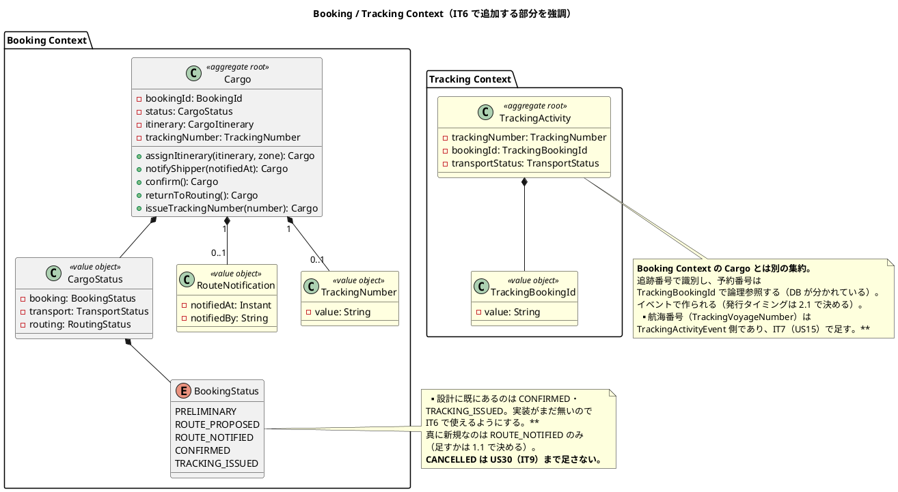
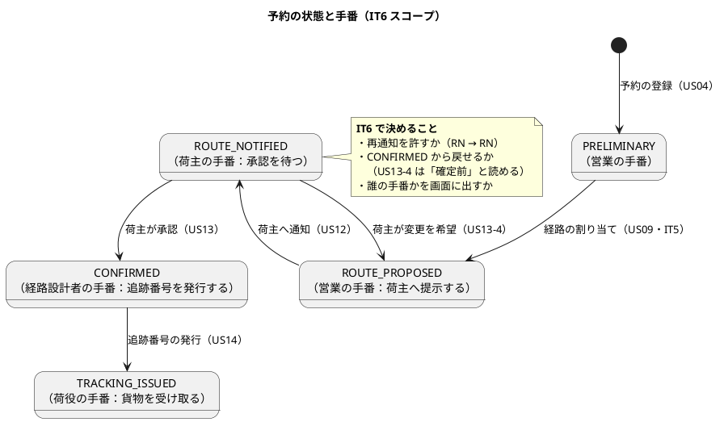
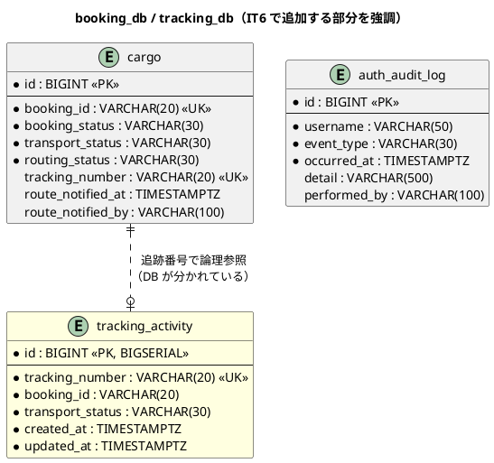
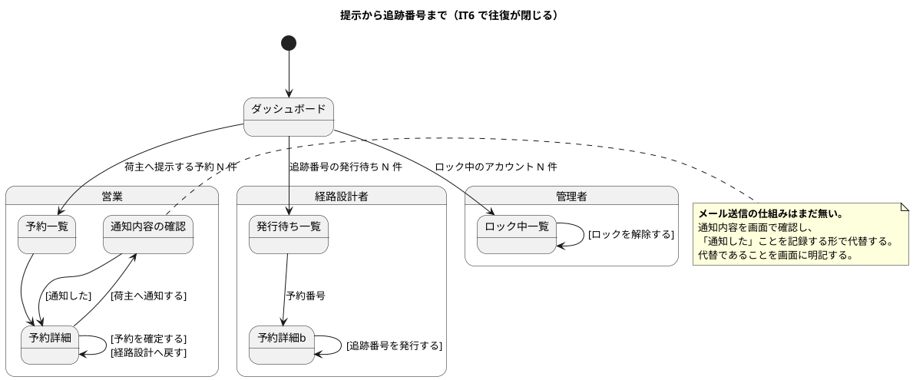

# イテレーション 6 計画

| 項目 | 内容 |
| :--- | :--- |
| イテレーション | IT6 |
| 期間 | 2026-08-22 〜 2026-09-04（2 週間） |
| 対象ストーリー | US12（経路の通知）・US13（予約確定）・US14（追跡番号発行）・US32（ロック解除） |
| 計画 SP | 9 |
| 局面 | **中盤（4 本目）／インサイドアウト**（[開発戦略](development_strategy.md#中盤-インサイドアウトit3it7--release-0210-前半)） |
| 前提 | [IT5 完了報告書](iteration_report-5.md)・[IT5 ふりかえり](retrospective-5.md) |

## ゴール

**荷主に経路を提示してから追跡番号を渡すまでを閉じる。** 経路が決まった予約を荷主へ提示し、合意を得て確定し、追跡番号を発行して荷主が自分で追える状態にする。あわせて**サービス間の非同期連携（イベント）を初めて通す**。

### 成功基準

> **荷主による追跡番号での照会は IT6 のスコープに入りません。** 照会画面は US18（`/tracking`）で、[リリース計画](release_plan.md)・[開発戦略](development_strategy.md)とも **IT8** に置いています（`navigation.ts` でも `available: false`）。さらにリリース計画は「**荷主向けの追跡番号メール通知は US18 が出るまで無効化する**」と定めています（照会画面が無い状態で番号だけ届くと問い合わせが営業に集中するため）。
>
> したがって US14-4 の代替も、**荷主に番号を送るのではなく、営業が予約詳細で番号を確認できる形**にとどめます。この扱いを 4.3 とマニュアルに明記します。

| # | 基準 | 測り方 |
| :--- | :--- | :--- |
| 1 | **提示から追跡番号までが閉じる** | kind 統合環境で、経路提案中 → 通知 → 確定 → 追跡番号発行 → **trackingms に追跡の記録が残る**、までを 1 本通す **達成**（2026-08-22）。実バックエンドの E2E で画面から通し、`tracking_db.tracking_activity` に行が残ることを確認 |
| 2 | **イベントが実際に相手へ届く** | bookingms が発行したイベントを trackingms が受け取り、**追跡の記録が残る**ことを、実 RabbitMQ（Testcontainers）で確かめる **達成**。`TrackingEventRoundTripTest`（専用 CI ジョブ `event-contract`）。kind でも実際に届いている |
| 3 | **受け取れなかったイベントが消えない** | 相手が落ちている / 処理に失敗したイベントの行き先を決め、**その経路を実際に通す** **達成**。地点マスタに無い港を送ってデッドレターへ回ることを確認し、**購読側で例外を握りつぶす実装に変えると赤になる**ことも確かめた |
| 4 | 荷主が変更・キャンセルを希望したときに戻せる | 確定前の予約を経路設計へ戻せる（US13 受入基準）。**戻したことが経路設計者に見える** |
| 5 | 管理者がロックを解除でき、監査に残る | 解除直後にログインできること・解除操作が監査ログに残ることを固定する **達成**。実 DB（`AuthIntegrationTest`）と実バックエンドの E2E の両方で通した |

## 局面とアプローチ

**中盤（インサイドアウト）**。[開発戦略](development_strategy.md)が「サービス間結合の型（US09 で REST 契約・**US14 でイベント契約**）もドメインの出力ポートから外へ向かって確立する」と定めている。

IT5 で REST 契約を確立したのと同じ形を、イベントで行う。**IT5 で作った ACL の型がイベント契約の下敷きになる。**

## 前イテレーションからの反映

### ふりかえりの Try（[retrospective-5.md](retrospective-5.md)）

| Try | 本 IT での落とし込み |
| :--- | :--- |
| 1. サービス間の接続先は、実際に 1 往復する検査を必ず対にする | **成功基準 2 に据えた**。イベントは Testcontainers の実 RabbitMQ で通す。タスク 2.3・5.1 |
| 2. E2E の「条件が揃わなければスキップ」を禁じる | タスク 5.2 の DoD。前提が要るなら前提を作ってから通す |
| 3. 同じ規則を 2 か所に書かない検査を、規則を足すときに同時に作る | タスク 1.2（`Cargo#confirm` の可否判定）と 3.3（API が集約の述語を呼ぶこと）で、**入口が集約の述語を呼んでいることを検査で固定する** |
| 4. モックを足す変更では、本物の該当箇所を開いて条件を読み比べる | タスク 4.4 の手順に明記。コミットメッセージに 1 行残す |
| 5. API のレスポンス型はフロントとサーバを機械的に突き合わせる | タスク 0.3（契約テストの名簿をリフレクション化） |
| 6. DoD に「前 IT で『まだできません』と書いた箇所の棚卸し」を入れる | **DoD に追加**。`grep -rn "準備中\|まだ働く場面\|次のリリース\|IT[0-9] は.*まで"` |
| 7. ユースケースを足したら、その場で直接のテストを書く | 各タスクの完了条件。Controller のモック経由で済ませない |
| 8. 状態を足したら「次に何ができるか」を役割ごとに書き出してから実装する | タスク 1.1（状態遷移の設計）で、状態遷移図に**誰の手番か**を書く |

### 引き継ぎ（返済枠・SP 対象外）

| # | タスク | 見積 | 状態 |
| :--- | :--- | :--- | :--- |
| 0.1 | **kind 統合環境で IT5 の往復を 1 本通す**（IT5 成功基準 1 の残り）。**接続先の欠陥が実環境でだけ出た経緯があるため、最初に行う** | 4h | [x] **完了**。狙いどおり実環境でだけ出る欠陥を 2 件捕まえた（ACL がサービス間で名乗らず 401→403・`APP_ROUTING_SERVICE_BASE_URL` を kind の Kustomize に入れ忘れ）。[ADR-019](../adr/019-route-assignment-api.md) の後日談 3 に決定と検査を記録 |
| 0.2 | **目的地が東京以外の予約で期限の判定を通す**（BC 間のタイムゾーン食い違いを直したが実環境で未確認） | 2h | [x] **完了**。期限日 20:00Z 着の便で判別する形にした（東京の暦では期限切れ・ロサンゼルスの暦では期限内）。候補に出ることと、bookingms の再検証を通って確定できることを対で固定。期限を 1 日前にすると消えることも併せて確かめ、「絞っていないだけ」の緑を排除した |
| 0.3 | **契約テストの項目名簿を DTO のコンポーネント名から導く**（手書きの名簿はコンシューマ側が項目を足しても赤にならない。Try 5・IT5 レビュー 中 14）。**あわせてクエリの「効き」と型の検査を入れ子（`appliedCriteria`）まで広げる**（同 中 13。IT5 では区間の項目までしか見ていない） | 4h | [x] **完了**。コンシューマ側の名簿を DTO の要素から導き、写しとの不一致で赤にした（項目を足して赤になることを確認）。プロバイダ側は `appliedCriteria` に型の検査・送った値を映しているかの検査・省略時に `null` で返る検査を足した |
| 0.4 | **再検証失敗専用の例外型を作り 409 の射程を絞る**（いまは `IllegalStateException` が「再検証の失敗」と「地点マスタの不備」の両方を運ぶ） | 2h | [x] **完了**。`RouteNoLongerAvailableException`（409）と `LocationMasterMissingException`（500）に分けた。後者は「探し直してください」と言わず、どの地点が無いかも返さない（利用者に使い道が無く構成を漏らすだけ）。文言と地点名の不在をテストで固定 |
| 0.5 | 地点マスタの N+1（確定 1 回あたり候補数 × 区間数 × 2 回。IT5 レビュー 低 33） | 2h | [x] **完了**。候補の変換前に 1 回だけ読み、UN/LOCODE で引き当てる形にした。**読んだ回数を数えるテスト**で固定（結果だけを見る検査は元の実装に戻しても緑のままになる） |
| 0.8 | **荷主編集で種別変更要求を明示的に断る検査を、実 DB でも通す**（IT5 レビュー 中 18。サーバとモックには入れたが、実 PostgreSQL の経路は未確認） | 1h | [x] **完了**。入口の 400 とは別に、**編集後の行の種別が変わらない**ことを実 PostgreSQL で固定した（入口の断りを外しても、行がどうなるかはここが守る） |
| 0.9 | **差し替え後の区間を DB から読み戻す**（IT5 レビュー 中 28。対応済みだが、同じ形の「保存の戻り値で確かめている」箇所が他に無いかを見る） | 1h | [x] **完了**。同じ形を走査して 6 件見つけ、うち名前が「保存され」「読み戻せる」と主張していた 4 件を含めて全件直した（`assignsBookingIdFromDatabase` / `assignsDistinctBookingIds` / `persistsPreliminaryStatuses` / `restoresLocationNames` / `assignsShipperCode` / `assignsDistinctCodes`） |
| 0.10 | **`mocks/handlers.ts`（1,060 行）の分割**。4.4 で同じファイルを触るため着手条件が成立している。**据え置いた負債は育つ**（IT5 のレビュー時点 1,045 行 → いま 1,060 行） | 3h | [x] **完了**。着手時には **1,381 行**まで育っていた（据え置いたぶんだけ増えた）。状態（`data.ts`）と経路探索（`routes.ts`）を切り出し、ハンドラを BC ごとに 5 本へ。最大 470 行。**採番のカウンタは `let` の export では増えて見えない**ため、オブジェクトに変えた |
| 0.11 | **予約の訂正（到着期限・出発希望日だけでも）**（引き継ぎ 8。着手条件「US13 より前」が成立）。条件協議の結果が「期限を延ばす」だったとき、予約を直せないと再依頼しても同じ結果になる | 4h | [x] **完了**。直せるのは**日程だけ**（出発地・目的地・貨物の内容を変えるならそれは別の予約）。**引き渡す前と営業へ戻された予約だけ**——経路設計者が組んでいる最中に条件が変わると、出来上がった経路が条件を満たさなくなる。マニュアルの「訂正はまだできません」（2 IT 連続で据え置いていた記述）も直した |
| 0.12 | **SonarQube のセキュリティホットスポットを解消する**（IT5 のクローズで未了。UI での確認が要る 1 件。**解消しないと IT6 のクローズでも Quality Gate が PASS しない**） | 1h | [!] **利用者の操作待ち**。スキャン用トークンでは `api/hotspots/search` が `Insufficient privileges` を返し、列挙も「レビュー済み」への変更もできない。UI（`http://localhost:9001/security_hotspots?id=cargo-tracker-take7-backend`）での確認が要る。未了のあいだ backend の Quality Gate は `new_security_hotspots_reviewed: 0.0` で ERROR のまま（`new_violations` は 0・新規カバレッジ 92%・重複 0.18%） |
| 0.6 | **`noEventPublishingRule` を「発行してよい場所だけ許す」形に絞る**（ADR-019 決定 3。**イベント発行を足すタスク 2.2 と同じ変更で行う**。別々にすると、発行を足した瞬間に理由の分からない赤になる）。**丸ごと消さない**——消すと以後のイベント発行が無検査になり、ドメイン層やコントローラから直接発行しても気づけない（IT5 レビュー 中 15） | 2h | [x] **完了**。2.2 と同じ変更で行った。`infrastructure.messaging` と合成ルート（`config`）だけを許す形に絞り、丸ごとは消していない。あわせて違反メッセージが `%s` のまま出ていた（`.formatted` が連結の後半にしか掛かっていなかった）のを直した |
| 0.7 | **経路の差し替えを営業が気づく手段**（IT5 で `[経路を見直す]` を作ったが、差し替えたことが営業に伝わらない。US12 と同じ IT で扱うと決めた） | 3h | [x] **完了**。気づく手段は「手番が営業に戻ること」（差し替えで `ROUTE_PROPOSED` に戻る）。**あわせて欠陥を 1 つ見つけた**——差し替えが `RoutingStatus` しか見ておらず、**確定済みの予約でも通り、荷主が合意した記録が黙って消えていた**（ADR-021 決定 3 を裏口から破る形）。差し替えたら通知の記録も消す |
| **小計** | | **29h** | |

> **0.6 を「余力次第」にしません。** [ADR-008 が 3 IT 連続で繰越された](retrospective-4.md)反省から、返済枠は独立したタスクとして先に置きます。

## 対象ストーリーと受入基準

### US12: 確定経路を荷主に通知する（2 SP）

| # | 受入基準 | 扱い | タスク |
| :--- | :--- | :--- | :--- |
| US12-1 | 予約番号を指定して紐付けられた経路情報を確認できる | **IT5 で達成済み**（予約詳細の旅程） | — |
| US12-2 | 通知内容（経由港・所要日数・到着予定日・料金概算）を確認できる | スコープ内 | 4.1 |
| US12-3 | 荷主への経路通知を送信できる | スコープ内（**メール基盤は無い**。下記の注を参照） | 1.3・4.1 |
| US12-4 | 通知送信記録が登録される | スコープ内 | 1.3・2.1 |

> **メール送信の仕組みはまだありません。** US06（引き渡し）・US10（条件協議）と同じく、**送ったことを状態と記録として残し、荷主側の画面で見える形**で代替します。「通知した」という業務上の事実は記録し、実際の送信手段は US19（通知基盤）で足します。**代替であることを画面とマニュアルに明記します。**

### US13: 予約を確定する（2 SP）

| # | 受入基準 | 扱い | タスク |
| :--- | :--- | :--- | :--- |
| US13-1 | 予約番号を指定して予約内容と選択ルートを確認できる | **IT5 で達成済み** | — |
| US13-2 | 確定操作を行うと予約状態が「予約確定」に更新される | スコープ内 | 1.2・4.2 |
| US13-3 | 経路設計者に追跡番号発行依頼の通知が送信される | スコープ内（画面上の気づく手段で代替） | 3.3・4.3 |
| US13-4 | 荷主がルート変更を希望する場合、予約を「経路設計中」に戻せる | スコープ内 | 1.1・1.2・4.2 |
| US13-5 | 荷主がキャンセルを希望する場合、予約をキャンセル状態に変更できる | **スコープ外**（下記の注） | — |
| US13-6 | キャンセル時、荷主にキャンセル確認通知が送信される | **スコープ外**（同上） | — |

> **US13-5・US13-6 を落とす理由**: 輸送開始前のキャンセルは**承認を経ません**（[ui_design.md](../design/ui_design.md) の予約詳細「輸送開始前（PRELIMINARY〜TRACKING_ISSUED）: `[キャンセル]`（即時確定・理由必須）」、US30 受入基準 1）。したがって「承認フローと不可分だから落とす」は誤りです。
>
> 落とす理由は、**`CANCELLED` 状態・キャンセル理由の記録・キャンセル料の算定を US30（IT9）で一括して入れるほうが、状態と料率の設計が 1 回で済む**ためです。ここだけ先に `CANCELLED` を足すと、US30 でキャンセル申請・承認・陸揚げ地・料率を入れるときに作り直しになります。**落としたことを完了報告書に明記します。**

### US14: 追跡番号を発行する（3 SP）

| # | 受入基準 | 扱い | タスク |
| :--- | :--- | :--- | :--- |
| US14-1 | 「予約確定」状態の予約に追跡番号を発行できる | スコープ内 | 1.4・3.1・4.3 |
| US14-2 | 追跡番号は一意に採番される | スコープ内（**DB シーケンス**。[ADR-011](../adr/011-booking-id-numbering.md) と同じ形） | 3.1 |
| US14-3 | 発行後、貨物状態が「受領待ち」に設定される | スコープ内 | 1.4・2.2 |
| US14-4 | 荷主に追跡番号と追跡方法をメール通知する | スコープ内（画面上の手段で代替。US12 と同じ） | 4.3 |

### US32: ロックされたアカウントを管理者が解除する（2 SP）

| # | 受入基準 | 扱い | タスク |
| :--- | :--- | :--- | :--- |
| US32-1 | 管理者がロック中のアカウント一覧を確認できる | スコープ内 | 6.1・6.2 |
| US32-2 | 管理者がロックを解除でき、解除直後から対象者はログインできる | スコープ内 | 6.1・6.3 |
| US32-3 | 解除操作（**誰が・いつ・どのアカウントを**）が監査ログに記録される | スコープ内 | 6.1 |
| US32-4 | 管理者以外のロールは解除操作にアクセスできない（403） | スコープ内 | 6.2 |

## 設計

### ドメインモデル図（IT6 スコープ）

> **`RouteNotification` を値オブジェクトにする理由**: 「いつ・誰が通知したか」で 1 組の意味を持ちます。通知が複数回起こりうるか（再通知）は 1.3 で決めます。

### 状態遷移図（IT6 スコープ・**誰の手番か**を明記）

> **`RoutingStatus` を動かすかは 1.1 で決めます。** US12〜US14 は予約のライフサイクル側の話なので原則 `RoutingStatus` は触りません。ただし **US13-4 は「予約を『経路設計中』に戻せる」**と書いており、`BookingStatus` を `ROUTE_PROPOSED`（画面の言葉は「経路提案中」）に戻すだけでは文言を満たしません。**「経路設計中」が `RoutingStatus.ROUTING_REQUESTED` を指すのかを決め、用語も揃えます。**

### ER 図（IT6 スコープ）

> **`tracking_number` は `cargo` にも `tracking_activity` にも持ちます。** 前者は「この予約に発行した番号」、後者は「この追跡の識別子」です。**DB が分かれているため FK は張れません**（[ADR-001](../adr/001-microservices-architecture.md)）。**採番は bookingms 側の DB シーケンス**で行い（[ADR-011](../adr/011-booking-id-numbering.md) と同じ形）、イベントで trackingms へ渡します。
>
> **`auth_audit_log` に `performed_by` を足します。** `event_type` に `UNLOCKED` は既に定義済みで、いま持っているのは「誰のアカウントか」（`username`）・「いつ」（`occurred_at`）です。US32-3 が求める 3 要素のうち**「誰が解除したか」だけが残りません**。6.1 で追加します。

### 画面遷移図（IT6 スコープ）

## タスク

### 0. 返済枠（SP 対象外）

上記「引き継ぎ」の表を参照。**Day 1-2 に独立して着手します。**

### 1. Phase 1: ドメイン（3 SP 相当）

| # | タスク | 見積 | 状態 |
| :--- | :--- | :--- | :--- |
| 1.1 | **状態遷移を決めて ADR-021 に落とす**。決定は 6 つ: ①`ROUTE_NOTIFIED` を足すか（通知を状態にするか記録だけにするか）②再通知を許すか ③`CONFIRMED` から戻せるか（US13-4 の射程）④**US13-4 の「経路設計中に戻す」が何を指すか**（`BookingStatus` を `ROUTE_PROPOSED` に戻すだけか、`RoutingStatus` も `ROUTING_REQUESTED` に戻すか。「経路提案中」と「経路設計中」は別の言葉である）⑤`CANCELLED` は US30 まで足さない ⑥**誰の手番か**を状態ごとに定める（Try 8）。**決定の数だけ検査を用意する** | 6h | [x] **完了**。[ADR-021](../adr/021-shipper-notification-and-confirmation-transitions.md)。決定は 7 つ（注 13 の誤りの訂正を含む）。決定の数だけ検査を用意する表を付けた |
| 1.2 | `Cargo#notifyShipper` / `#confirm` / `#returnToRouting` を単体テストで構築。**壊して赤を確認する** | 5h | [x] **完了**。3 つの遷移と `issueTrackingNumber` を単体テストで構築。決定 1（通知していない予約は確定できない）と決定 3（確定後は戻せない）は**検査を壊して赤になることを確認**した。あわせて `Cargo#visibleToRoutingPlanner()` が `RoutingStatus` の述語を呼ばず**同じ規則を書き直していた**のを直した（ADR-020 後日談で一本化したはずの形に戻っていた） |
| 1.3 | `RouteNotification` 値オブジェクト。「いつ・誰が」で 1 組。**通知の記録が残らないと US12-4 を満たさない**。**`of` で検査し `restore` では検査しない**（規則が無かったころの行が読めなくなる。[ADR-012](../adr/012-value-object-granularity.md)）。両方をテストで固定する | 3h | [x] **完了**。`of` で検査し `restore` では検査しないことを対で固定。両方 `null` なら「記録が無い」を返す（空の記録は「通知したが日時が分からない」と区別できなくなる） |
| 1.4 | `TrackingNumber` 値オブジェクトと `Cargo#issueTrackingNumber`。**採番は永続化の経路で行う**（集約で組み立てるとシーケンスと衝突する。[ADR-011](../adr/011-booking-id-numbering.md) の先例）。**形式を決めて `ui_design.md` の例示（`TRK-20260819-1234`）と一致させる**（注 15）。**Tracking Context にも同名の `TrackingNumber` があるため、[コンテキスト分離設計](../design/domain-model.md#voyagenumber-のコンテキスト分離設計)に Booking 側の行を足す**（IT5 の `VoyageNumber` と同じ形） | 5h | [x] **形式と集約は完了**（`TRK-yyyyMMdd-nnnn`。17 文字で `VARCHAR(20)` に収まる）。採番のマイグレーションは 3.1、`domain-model.md` のコンテキスト分離表への追記は未了 |
| 1.5 | **`Cargo` が肥大化していないか確認する**。IT6 で状態遷移が 4 つ増える。[ADR-012](../adr/012-value-object-granularity.md) の基準で分割の要否を判断し、**分けないなら理由を残す** | 3h | [x] **完了。分けない**（388 行・項目 9・遷移 11）。理由: 遷移とその不変条件こそ集約ルートの存在理由であり、状態機械を外へ出すと `Cargo` が貧血になり、不変条件を守る場所が呼び出し側に移る。代わりに (1) 遷移のたびに全項目を並べ直さない `with()` を入れ、(2) `restore` の引数が 7 個を超える件を `test_strategy.md` の SonarQube 方針表に `User#restore` と並べて記載した（テーブルの列数がそのまま現れる形であり、まとめると復元の意味が薄れる）。**次に状態が増えるときは再判断する** |
| **小計** | | **22h** | |

### 2. Phase 2: イベント基盤（2 SP 相当）

| # | タスク | 見積 | 状態 |
| :--- | :--- | :--- | :--- |
| 2.1 | **イベント契約を決めて ADR-022 に落とす**。決定は 6 つ: ①ペイロードに何を載せるか（ID のみか内容もか）②スキーマの後方互換の方針 ③**受け取れなかったイベントの行き先**（DLQ・再試行回数）④順序保証を前提にするか ⑤**`CargoBookedEvent` をいつ発行するか**（設計は経路割り当ての直後＝IT5 の時点。計画は追跡番号の発行時。**どちらかに寄せる**。注 11）⑥**追跡番号を誰が採番するか**（bookingms の DB シーケンスか、trackingms 側か。注 9）。**IT5 の REST 契約（ADR-019）と同じ形で、コンシューマ・プロバイダの両側に検査を置く** | 6h | [x] **完了**。[ADR-022](../adr/022-domain-event-contract.md)。決定 7 つ。設計と計画の食い違い（注 11）は **`CargoBookedEvent` の廃止**で寄せた——採番が bookingms（ADR-021）である以上、「割り当てを依頼する」イベントは要らない。代わりに `TrackingNumberIssuedEvent` を US14 の発行時に出す |
| 2.2 | **発行を出力ポートから外へ向かって作る**（開発戦略の中盤の形）。①ドメイン側に発行のポートを置く（`application/port`。**`Port` 接尾辞を付けず「何を頼むか」で名付ける**。IT5 で確立した規約。例 `CargoEventNotifier`）②`infrastructure/messaging` で実装 ③**トランザクションのコミット後に発火させる**（`AFTER_COMMIT`。コミット前に出すと、ロールバックした予約のイベントが飛ぶ）。**`noEventPublishingRule` を同じ変更で絞る**（0.6） | 6h | [x] **完了**。出力ポート `CargoEventNotifier`（`Port` 接尾辞なし）＋ `infrastructure/messaging` の実装。コミット後の発火は**アダプタ側**に置いた（トランザクションの境目はインフラの関心であり、ユースケースに作法を課すと入口の数だけ破られる） |
| 2.3 | trackingms が購読し `TrackingActivity` を作る。**実 RabbitMQ（Testcontainers）で 1 往復させる**（成功基準 2・Try 1） | 5h | [x] **完了**。実 RabbitMQ（Testcontainers）で往復を通した。地点はこちらのマスタから引く（イベントが運ぶのは UN/LOCODE だけ） |
| 2.4 | **受け取れなかったイベントの経路を実際に通す**（成功基準 3）。相手を落とす / 例外を投げる形で確かめる | 2h | [x] **完了**。地点マスタに無い港を送り、デッドレターへ回ることを確かめた。**購読側で例外を握りつぶす実装に変えると赤になる**ことも確認（設定を書いたことと届くことは別） |
| 2.5 | **イベント契約テストを導入し CI に配線する**（[開発戦略](development_strategy.md)・[リリース計画](release_plan.md)が US14 の独立タスクとして「Contract 導入・kind への RabbitMQ 配線」を明記）。IT5 の REST 契約と同じく**コンシューマ・プロバイダの両側**に置き、**専用ジョブ**にして赤の意味を一意にする | 5h | [x] **完了**。両側に契約テストを置き、名簿は DTO の要素から導いた。**専用ジョブ** `event-contract` に、契約 2 本＋発行のタイミング＋実 RabbitMQ の往復（届く・冪等・デッドレター）をまとめた。JSON は**本番と同じ変換器**を通して確かめる（テスト側で自前の ObjectMapper を組むと、本物が送る形と違っても緑になる） |
| **小計** | | **24h** | |

### 3. Phase 3: 永続化と API（2 SP 相当）

| # | タスク | 見積 | 状態 |
| :--- | :--- | :--- | :--- |
| 3.1 | `cargo` の `tracking_number`（**既存列**）に UK を足し、`route_notified_at` / `route_notified_by` を**新規追加**（V6）。**追跡番号のシーケンスと形式の組み立てはマイグレーションに書く**（[ADR-011](../adr/011-booking-id-numbering.md) 決定 3。アプリ側で文字列を作ると別の経路が違う形式を発行できる）。**新しい列を NOT NULL にしない**（列が無かったころの行が読めなくなる）。方言スモークを通す | 5h | [x] **完了**（V6）。`tracking_number` は `data-model.md` にはあったが実装に無く（設計が先行）、列ごと足した。採番の組み立てはマイグレーションに置き、UK を張った。新しい列は NOT NULL にしていない |
| 3.2 | `tracking_activity` テーブルと **`location` テーブル + UN/LOCODE のシード**（trackingms）。**trackingms は IT6 が初実装**。Flyway・MyBatis・ヘキサゴナルの型を bookingms に揃える（**新しい型を発明しない**）。地点の複製は [ADR-014](../adr/014-location-replica-sync.md) に従い**同一の種データファイルを配り、内容の一致をテストで検査する**。版番号は実装に合わせ（欠番を作らない）、`data-model.md` の記載も直す。**既存の ArchUnit 群（BC 分離・ヘキサゴナル・認可順序・イベント発行）を trackingms にも適用する**——適用漏れは `ArchitectureRuleCoverageTest` が検出するが、新サービスは名簿に載るまで対象外になる | 6h | [x] **完了**。bookingms の型をそのまま写した（新しい型を発明していない）。地点は同一の種データを配り、`LocationSeedReplicaTest` が自動で対象に加える。ArchUnit は既存の名簿に載っており、絞った検査も適用済み。IT6 は**追跡の作成のみ**の縮小実装であることをマイグレーションと集約に明記 |
| 3.3 | API: `POST /api/v1/bookings/{bookingId}/route-notification`・`PUT /{bookingId}/confirm`・`POST /{bookingId}/tracking-number`・`PUT /{bookingId}/return-to-routing`。**認可を入力の検査より先に置く**（[ADR-016](../adr/016-authorize-before-validate.md)）。**入力の検査に `@Valid` を使わずメソッド本体で行う**（[ADR-016](../adr/016-authorize-before-validate.md) 決定 2）。**入口が集約の述語を呼んでいることを検査で固定する**（Try 3）。**パスは IT5 に揃えて名詞形にする**（IT5 は `PUT /{bookingId}/route`・`POST /{bookingId}/consultation-request`）。**経路設計者の可視範囲を `CONFIRMED` まで広げる**（注 13。広げないと US14 が 404 で成立しない）。判定は `RoutingStatus#visibleToRoutingPlanner` 1 箇所（IT5 で一本化した形）を崩さない | 7h | [x] **完了**。4 本とも認可を先に置き、判定は集約に任せた（入口に書き写していない）。**可視範囲の拡大は不要だった**（ADR-021 決定 7）ので広げず、確定した予約が経路設計者に開けることを入口のテストで固定した |
| **小計** | | **18h** | |

### 4. Phase 4: 画面（2 SP 相当）

| # | タスク | 見積 | 状態 |
| :--- | :--- | :--- | :--- |
| 4.1 | **`ui_design.md` に通知・確定・発行の画面詳細設計を書く。書いてから実装する**（IT5 の 4.1 と同じ順序） | 3h | [x] **完了**。手番の表（状態 × 出す操作 × 出す相手）・通知内容の確認・**メールを送っていないことの明示**・戻したことが経路設計者に見えること・発行待ちの気づき。バッジ表に `ROUTE_NOTIFIED`、トースト表に 4 行を追加 |
| 4.2 | 予約詳細に「荷主へ通知する」「予約を確定する」「経路設計へ戻す」。**状態で出し分ける**。**メール送信の代替であることを画面に明記** | 5h | [x] **完了**。手番の 1 行・通知内容の確認・**メールが送られないことの明示**・状態での出し分け。「押せるのにできない」を作らないため、通知していない予約に確定のボタンを出さないことをテストで固定 |
| 4.3 | 追跡番号の発行と、経路設計者の「発行待ち」の気づき。**件数から対象へ行けること**（IT5 と同じ形）。**発行した番号は営業が予約詳細で確認できるところまで**（荷主への送付は US18 が出るまで行わない） | 4h | [x] **完了**。予約の状態での絞り込みをサーバから通し（送った値が捨てられていないことを検査）、経路設計者のダッシュボードに「追跡番号の発行を待っている予約を見る」を足した。発行した番号は営業が予約詳細で確認でき、**荷主に届いていないこと**を添えて出す |
| 4.6 | **ナビゲーションの 4 点一致**（IT5 の DoD と同じ形）。`ui_design.md` のナビ構成表・`config/navigation.ts`・`config/dashboard-panels.ts`・`navigation.test.ts` を同じ変更で揃える。**ロール別・状態別の到達性**を確かめる | 3h | [x] **US13-3 の分は完了**（`ui_design.md` の IT6 節・`dashboard-panels.ts`・ダッシュボードのテスト）。サイドバーは変更なし（発行待ちは状態軸の導線であり、メニュー項目ではない）。US32 の分は 6.2 で行う |
| 4.4 | **モックを本物と読み比べて足す**（Try 4）。差分をコミットメッセージに 1 行残す | 2h | [x] **完了**。本物の集約の条件を 1 つずつ読み比べた。差分はコミットメッセージに記載 |
| 4.5 | 0.7（経路の差し替えを営業が気づく手段）を US12 の画面に統合する。**同じ変更で `route-design-page.tsx`（502 行）を分割する**（IT5 レビュー 低 30 が「US12 で同ファイルを触るときに行う」と決めた枠。確定確認パネル・候補テーブル・該当なしパネルを抽出する） | 4h | [x] **完了**。0.7 は画面ではなく**集約**に入れた（差し替えで手番が営業に戻る形）——画面に置くと、経路設計者が差し替えたことを営業の画面が知る手段が状態以外に増える。分割は 558 → 360 行（確定確認パネル・候補テーブル・該当なしパネル・書式）。**振る舞いは変えていない**（既存のテスト 35 本がそのまま緑） |
| **小計** | | **21h** | |

### 5. Phase 5: 結合の検査

| # | タスク | 見積 | 状態 |
| :--- | :--- | :--- | :--- |
| 5.1 | **kind 統合環境で成功基準 1 を通す**（提示 → 確定 → 発行 → 荷主の照会）。**イベントが実際に届くことまで**（Try 1） | 5h | [x] **完了**。実バックエンドの E2E 9 本すべて緑。**イベントが実際に届いていること**を `tracking_db.tracking_activity` の行で確認（`TRK-20260822-0001` / `BKG-2026000044` / `NOT_RECEIVED`）。デッドレターのキューも kind に作られている |
| 5.2 | E2E：提示から発行まで。**「条件が揃わなければスキップ」を書かない**（Try 2）。前提が要るなら前提を作る | 5h | [x] **完了**。スキップは書かず、**前提を種データとして用意**した（モックは再読み込みで初期化されるため、1 本の中で利用者を切り替えられない）。US32 の E2E も同じファイルに置いた |
| **小計** | | **10h** | |

### 6. US32: ロック解除（2 SP 相当）

| # | タスク | 見積 | 状態 |
| :--- | :--- | :--- | :--- |
| 6.1 | `User#unlock` と監査記録。**`auth_audit_log` に「誰が解除したか」を残せるか確認し、無ければ足す**（US32-3） | 3h | [x] **完了**。`auth_audit_log` に `actor` 列が無く US32-3 を満たせなかったので V5 で足した（NOT NULL にしない）。解除は**失敗回数も白紙に戻す**——期限だけ消すと次の 1 回でまたロックされる |
| 6.2 | API と画面（ロック中一覧・解除）。**管理者以外のロールは解除操作にアクセスできない**（US32-4）。**`navigation.test.ts` の免除リストから `ROLE_ADMIN` を外す**——いまは「業務メニューを持たないロール」として免除されており、画面を足すとこの検査が確実に赤になる | 4h | [x] **完了**。管理者以外の 6 ロールすべてで 403 を固定。`navigation.test.ts` の免除リストから `ROLE_ADMIN` を外し、ナビ・ダッシュボード・`ui_design.md` のナビ構成表・マニュアルの対応表を同じ変更で揃えた |
| 6.3 | **解除直後にログインできることを実 DB で通す**（US32-2）。ロック → 解除 → ログイン成功、を 1 本で | 2h | [x] **完了**。5 回失敗 → 拒否 → 解除 → ログイン成功、を 1 本で。`actor` が実 DB の行に残ることも確かめた（列を足しただけでは残らない） |
| **小計** | | **9h** | |

### 7. ユーザーマニュアル（SP 対象外・10h）

画面を伴う IT なので、計画段階で枠を取ります。

| # | タスク | 見積 | 状態 |
| :--- | :--- | :--- | :--- |
| 7.1 | `04-貨物予約.md` に通知・確定・経路設計へ戻すを追加。**メール送信の代替であることを明記** | 4h | [x] **完了**（4.6）。手番の表・メールが送られないことの明示・費用が概算であること・確定後は戻せないこと |
| 7.2 | 追跡番号の発行（経路設計者）と、荷主向けの追跡方法の案内を追加。管理者向けにロック解除の章を追加 | 3h | [x] **完了**。経路設計章に 6.3（発行）、予約章に 4.7（番号の確認と伝達）、新章 `07-アカウント管理.md`。荷主向けの照会画面は US18 までないため、**営業が伝える**形で案内した |
| 7.3 | キャプチャを再生成し `manual:build` で目視。**画面に出るメッセージを機械的に洗い出して表に足す** | 3h | [x] **完了**。IT6 の 4 画面（通知と確定・追跡番号・発行待ち一覧・ロック解除）を生成 spec に足して撮り直した（手で PNG を置かない）。`manual:build` で 8 章 + 画像 23 点。**画面に出るメッセージ**は各章末の表に機械的に列挙した |
| **小計** | | **10h** | |

### 8. レビュー手直しの枠（SP 対象外・12h）

| # | タスク | 見積 | 状態 |
| :--- | :--- | :--- | :--- |
| 8.1 | **クローズのレビューで出る高優先度の手直し**。IT3 は 11 件、IT4 は 14 件、IT5 は 12 件。**3 IT 続けて 12 件前後で安定しているため、同じ枠を取る**。ただし IT5 のふりかえりが示したとおり、**減らすべきは量ではなく「全テスト緑のまま業務が成り立たない」形の質**である | 12h | [ ] |
| **小計** | | **12h** | |

### 見積もり合計

| 区分 | 見積 |
| :--- | :--- |
| 0. 返済枠 | 29h |
| 1. Phase 1 ドメイン | 22h |
| 2. Phase 2 イベント基盤 | 24h |
| 3. Phase 3 永続化と API | 18h |
| 4. Phase 4 画面 | 21h |
| 5. Phase 5 結合の検査 | 10h |
| 6. US32 | 9h |
| 7. マニュアル | 10h |
| 8. レビュー手直し | 12h |
| **合計** | **155h** |

> **IT5 は 146h の見積もりで 8 SP を達成しました。IT6 は 155h で 9 SP です。**
>
> **この見積もりは 2 週間に収まりません。** 整合性検証で返済枠が 7 件 → 12 件（21h → 29h）に増え、イベント契約テストの CI 配線（2.5・5h）とナビゲーション整合（4.6・3h）が加わったためです。**増えたぶんはどれも「やらないと後で高くつく」もの**なので削らず、**落とす順序を先に決めます**。
>
> | 順 | 落とすもの | 見積 | 落としてよい理由 |
> | :--- | :--- | :--- | :--- |
> | 1 | 0.11 予約の訂正 | 4h | 条件協議の結果を反映する経路だが、IT6 では協議が起きた予約が実際に出るとは限らない。US13 と同じ IT である必要は無い |
> | 2 | 0.10 `handlers.ts` の分割 | 3h | 4.4 で触るが、分割しなくても足せる。ただし**落とすと 3 IT 連続の繰越**になるため、落とすなら IT7 の返済枠の先頭に置く |
> | 3 | 0.5 地点マスタの N+1 | 2h | 頻度が低く、候補件数が増えるまで効かない |
> | 4 | 4.5 の分割部分 | 2h | 差し替えの気づき（US12 統合）は残し、`route-design-page.tsx` の分割だけ落とす |
>
> **Phase 2（イベント基盤）・2.5（契約テストの CI 配線）・5.1（kind での往復）は削りません。** イベントは IT7（荷役）でも使うため、ここで通しておかないと同じ不確実性を持ち越します。**0.12（SonarQube のホットスポット）も削りません**——解消しないと IT6 のクローズでも Quality Gate が PASS しません。

## スケジュール

### Week 1（Day 1-5）

| 日 | 内容 | 区分 |
| :--- | :--- | :--- |
| Day 1 | **0.1 kind で IT5 の往復を通す**、0.2 期限の判定、0.12 ホットスポット | 返済枠 |
| Day 2 | 0.3 契約テストの名簿、0.4 例外型、0.8 種別変更、0.9 読み戻し、0.5 N+1 | 返済枠 |
| Day 3 | 1.1 ADR-021（状態遷移） | Phase 1 |
| Day 4 | 1.2 集約の遷移、1.3 `RouteNotification` | Phase 1 |
| Day 5 | 1.4 `TrackingNumber`、1.5 `Cargo` の肥大化確認 | Phase 1 |

### Week 2（Day 6-10）

| 日 | 内容 | 区分 |
| :--- | :--- | :--- |
| Day 6 | 2.1 ADR-022（イベント契約）、2.2 発行（出力ポートから外へ） | Phase 2 |
| Day 7 | 2.3 購読と往復、2.4 受け取れなかったイベント、2.5 契約テストの CI 配線 | Phase 2 |
| Day 8 | 3.1 / 3.2 永続化、3.3 API | Phase 3 |
| Day 9 | 4.1 設計 → 4.2 / 4.3 画面、4.6 ナビ整合、6.1-6.3 US32 | Phase 4・US32 |
| Day 10 | 4.4 / 4.5、5.1 kind、5.2 E2E、7.1-7.3 マニュアル、クローズ準備 | 仕上げ |

> **返済枠の 0.6・0.7・0.10・0.11 は、関連するタスクと同じ日に行います。** 0.6（検査を絞る）は Day 6 の 2.2 と、0.7（差し替えの気づき）と 0.10（`handlers.ts` の分割）は Day 10 の 4.5・4.4 と、0.11（予約の訂正）は Day 9 の 4.2 と同時です。**別々にすると、片方だけ入って赤になるか、触るついでを逃します。**

## リスク

| # | リスク | 影響 | 対応 |
| :--- | :--- | :--- | :--- |
| 1 | **イベント基盤が初物で、見積もりが外れる** | Phase 2 が膨らみ Phase 4・5 を圧迫 | Day 6-7 に固めて置き、Day 7 終了時に進捗を確認する。遅れたら 4.5 → 0.5 → 0.7 の順に落とす | [x] ADR-021 決定 1・`domain-model.md` のビジネスルール 4 |
| 2 | **trackingms が初実装** | ヘキサゴナルの型・Flyway・MyBatis の配線をゼロから作る | bookingms の形をそのまま写す。**新しい型を発明しない** | [x] 要素表に `RouteNotification` / `TrackingNumber` を追加 |
| 3 | **メール送信の仕組みが無い** | US12-3・US13-3・US14-4 が「代替」になる | 代替であることを画面・マニュアル・完了報告書に明記する。US19（通知基盤）で置き換える | [x] パッケージツリーを実装で埋め、**縮小実装であること**を明記 |
| 4 | **`Cargo` の肥大化** | 状態遷移が 4 つ増え、集約が読みにくくなる | 1.5 で明示的に判断し、分けないなら理由を残す | [ ] |
| 5 | US13-5・US13-6（キャンセル）を落とす | US13 の受入基準が部分達成 | **完了報告書に明記**。US30（IT9）で扱う | [ ] |
| 6 | ~~経路設計者が `CONFIRMED` の予約を開けない~~ **解消（誤読だった）**。可視判定は `RoutingStatus` だけを見ており、確定しても `ROUTED` のまま | なし | [ADR-021](../adr/021-shipper-notification-and-confirmation-transitions.md) 決定 7。広げる変更はせず、**狭まらないことを検査で固定する**（1.2） | [ ] |
| 7 | **設計と計画で `CargoBookedEvent` の発行タイミングと追跡番号の採番所在が食い違っている** | イベント基盤の作り直し | 注 9・11。**2.1（ADR-022）の決定 ⑤⑥ で先に寄せる**。実装の前に決める | [x] UC10 の事前条件に「荷主へ通知済でもよい」（再通知）、UC11 の事前条件を「荷主へ通知済」に。代替であることも記載 |

## 設計への反映が必要な箇所（注）

> **反映の状況をこの表で管理します。**（[x] = 反映済み）

| # | 内容 | 反映先 | タスク | 状況 |
| :--- | :--- | :--- | :--- | :--- |
| 1 | `BookingStatus` に `ROUTE_NOTIFIED` を足すか（設計は `PRELIMINARY → ROUTE_PROPOSED → CONFIRMED` で通知の状態を持たない） | `domain-model.md`・ADR-021 | 1.1 | [x] ADR-021 決定 1・`domain-model.md` のビジネスルール 4 |
| 2 | `RouteNotification` / `TrackingNumber` が Booking Context の要素表に無い | `domain-model.md` の要素表 | 1.3・1.4 | [x] 要素表に `RouteNotification` / `TrackingNumber` を追加 |
| 3 | `TrackingActivity` が Tracking Context の要素表にあるが、**実装が無い**（trackingms は config のみ） | `architecture_backend.md` のパッケージツリー | 3.2 | [x] 実装した（domain/application/infrastructure/config）。パッケージツリーの更新は未 |
| 4 | `auth_audit_log` に「誰が操作したか」の列が無い（US32-3 を満たせない） | `data-model.md` | 6.1 | [x] `actor` 列を V5 で追加。`data-model.md` にも記載 |
| 5 | イベントのペイロード定義が `architecture_backend.md` の一覧にあるが、**項目まで決まっていない** | `architecture_backend.md`・ADR-022 | 2.1 | [x] ADR-022 決定 2。一覧にも項目を記載 |
| 6 | **`data-model.md` の Flyway 構成（`V1__init_tracking.sql` / `V2__seed_locations.sql`）と実装の版番号がずれている**。実装は `V1__init.sql`（スキーマの下ごしらえのみ）で、`tracking_activity` も `location` も無い | `data-model.md` の Flyway 構成 | 3.2 | [x] `data-model.md` を実装に合わせた（bookingms の V6・authms の V5 も併せて記載） |
| 7 | UC10・UC11 の事前条件が「予約が『経路提案中』状態にある」。`ROUTE_NOTIFIED` を足すなら事前条件が変わる | `system_usecase.md` の UC10・UC11 | 1.1 | [x] UC10 の事前条件に「荷主へ通知済でもよい」（再通知）、UC11 の事前条件を「荷主へ通知済」に。代替であることも記載 |
| 8 | `cargo` に通知の記録列（`route_notified_at` / `route_notified_by`）が無い | `data-model.md` の `cargo` | 3.1 | [x] V6 で追加し、`data-model.md` の Flyway 構成にも記載 |
| 9 | **追跡番号を誰が採番するかが割れている**。`domain-model.md` の `AssignTrackingNumberCommand` は Tracking Context 側で採番と読め、計画は bookingms の DB シーケンスとしている。[ADR-011](../adr/011-booking-id-numbering.md) は「予約番号から導出しない」だけを決めており、所在は未決 | `domain-model.md`・ADR-021 | 1.4・2.1 | [x] 採番は bookingms の永続化の経路。コマンド表と分離表に明記 |
| 10 | bookingms の API 一覧に `route-notification` と `return-to-routing` が無い | `architecture_backend.md` の API 一覧 | 3.3 | [x] 4 本とも記載（権限と前提条件つき） |
| 11 | **`CargoBookedEvent` の発行タイミングが設計と違う**。設計（`architecture_backend.md` の一覧・`domain-model.md` のシーケンス）は**経路割り当ての直後**（IT5 の時点）に発行して trackingms が追跡を作る形。計画は追跡番号の発行時としている | `architecture_backend.md`・ADR-022 | 2.1 | [x] ADR-022 決定 1。`CargoBookedEvent` を廃止し `TrackingNumberIssuedEvent` に置き換え。一覧に廃止の行を残した |
| 12 | 「通知内容の確認」「発行待ち一覧」「ロック中一覧」が画面一覧・ナビゲーション・権限マトリクスのどれにも無い。**`ROLE_ADMIN` 向けの画面は 1 つも定義されていない** | `ui_design.md` の 3 表 | 4.1・6.2 | [x] ナビ構成表に「アカウント管理」を追加。通知内容の確認と発行待ちは IT6 節に記載 |
| 13 | ~~**経路設計者の可視範囲が `ROUTING_REQUESTED` / `ROUTED` に限られており、`CONFIRMED` の予約は 404 になる**~~ **この読みは誤りだった**（[ADR-021](../adr/021-shipper-notification-and-confirmation-transitions.md) 決定 7）。可視の判定は `RoutingStatus#visibleToRoutingPlanner()` 1 か所にあり、確定は `BookingStatus` を動かすだけで `RoutingStatus` は `ROUTED` のまま。US14 は 404 にならない。**広げる変更はしないが、狭まらないことを検査で固定する** | ADR-021 | 1.1・3.3 | [x] 誤りだった。ADR-021 決定 7 で訂正 |
| 14 | UC20 に「システム管理者」アクターと解除のシナリオが無い | `system_usecase.md` の UC20 | 6.1 | [x] 副アクターと拡張 2c（解除の手順）を追加 |
| 15 | 追跡番号の形式が決まっていない（`ui_design.md` の例示は `TRK-20260819-1234`、`data-model.md` は `VARCHAR(20)`） | `ui_design.md`・`data-model.md` | 1.4 | [x] `TRK-yyyyMMdd-nnnn`（17 文字）に確定。`VARCHAR(20)` に収まる |
| 16 | `ui_design.md` の `BookingStatus` バッジ表に `ROUTE_NOTIFIED` が無い（足すなら） | `ui_design.md` のバッジ表 | 4.1 | [x] 追加（荷主へ通知済） |
| 17 | `domain-model.md` のコマンド表に `NotifyShipperCommand` / `ReturnToRoutingCommand` が無い | `domain-model.md` のコマンド表 | 1.2 | [x] `NotifyShipperCommand` / `ReturnToRoutingCommand` を追加 |
| 18 | `domain-model.md` のビジネスルール（`BookingStatus` の遷移順）に `ROUTE_NOTIFIED` を挟むかの記載が無い | `domain-model.md` のビジネスルール | 1.1 | [x] 遷移順に `ROUTE_NOTIFIED` を挟み、手番も記載 |
| 19 | `TrackingActivity` は設計上 `TrackingActivityEvent` などを内包するが、IT6 は追跡の作成のみ（**縮小実装であること**が未明示） | `architecture_backend.md` のパッケージツリー | 3.2 | [x] `architecture_backend.md` に縮小実装であることを明記（荷役イベント・例外は US15 以降） |

## デモ項目

イテレーションの終わりに、この順で動かして見せます。**デモ項目は受け入れ基準そのもの**であり、5.2 の E2E はこれを操作の系列に翻訳したものです（[開発戦略](development_strategy.md)）。

| # | 見せるもの | 役割 | 対応 |
| :--- | :--- | :--- | :--- |
| 1 | 経路が決まった予約を開き、通知内容（経由港・所要日数・到着予定日・費用の概算）を確認して荷主へ通知する | 営業 | US12 | [x] ADR-021 決定 1・`domain-model.md` のビジネスルール 4 |
| 2 | 通知した予約を確定する。**確定にすると経路設計者の「発行待ち」に現れる** | 営業 | US13-2・US13-3 | [x] 要素表に `RouteNotification` / `TrackingNumber` を追加 |
| 3 | 荷主が変更を希望した予約を経路設計へ戻す。**戻したことが経路設計者に見える** | 営業 | US13-4 | [x] パッケージツリーを実装で埋め、**縮小実装であること**を明記 |
| 4 | 確定した予約に追跡番号を発行する。**番号が採番され、貨物の状態が「受領待ち」になる** | 経路設計者 | US14-1〜3 | [x] kind で実施。`TRK-20260823-0001` / `BKG-2026000062` |
| 5 | **trackingms に追跡の記録が残っている**ことを示す（イベントが実際に届いた証拠） | — | 成功基準 2 | [x] `tracking_db.tracking_activity` に `TRK-20260823-0001` / `NOT_RECEIVED` |
| 6 | **相手が受け取れなかったイベントが消えていない**ことを示す | — | 成功基準 3 | [x] `trackingms.tracking-number-issued.dlq` が kind に存在。到達は Testcontainers で固定（タスク 2.4） |
| 7 | ロック中のアカウントを解除し、**その場でログインできる**。監査ログに「誰が・いつ・どのアカウントを」が残る | 管理者 | US32 | [x] UC10 の事前条件に「荷主へ通知済でもよい」（再通知）、UC11 の事前条件を「荷主へ通知済」に。代替であることも記載 |

> **荷主が追跡番号で照会する場面はデモに含めません。** 照会画面は US18（IT8）です。

## DoD（完了の定義）

- [x] 対象ストーリーの受入基準を満たす（**スコープ外にしたものは理由とともに完了報告書へ**）。US13-5・US13-6 はスコープ外（[ADR-021](../adr/021-shipper-notification-and-confirmation-transitions.md) 決定 5）
- [x] 成功基準 1〜5 を満たす（成功基準の表に達成の根拠を記載）
- [x] 全テストが緑（単体・統合・契約・E2E）。**CI のジョブすべて success**（イベント契約のジョブ `event-contract` を新設）
- [x] **`TZ=UTC` でも緑**（CI のジョブ `backend-utc`）
- [x] **ドメイン層のカバレッジが 90% 以上**（authms 94% / bookingms 96% / routingms 98% / trackingms 100% / shared 100%）
- [ ] SonarQube Quality Gate が PASS（新規違反 0・Bug 0・Vulnerability 0・重複 3% 未満）。**新規違反はバックエンド・フロントエンドとも 0、フロントエンドは PASS**。バックエンドは**セキュリティホットスポット 1 件のレビューが利用者の操作待ち**（走査用トークンでは列挙も記録もできない）
- [x] **決定の数だけ検査がある**（ADR-021 の 7 決定＋後日談 2・ADR-022 の 7 決定。各 ADR のコンプライアンス表を参照）
- [x] **壊して赤を確認した**（ADR-021 決定 1・決定 3、ADR-022 決定 4、契約の名簿、期限の判定、地点マスタの読み込み回数）
- [x] **サービス間の呼び出しを実際に 1 往復させた**（Try 1）。REST は kind、イベントは Testcontainers と kind の両方
- [x] **E2E に「条件が揃わなければスキップ」が無い**（Try 2）。前提は種データで用意した
- [x] **モックを足した変更で、本物の該当箇所と読み比べた**（Try 4。差分をコミットメッセージに記載）
- [x] **前 IT で「まだできません」と書いた箇所を棚卸しした**（Try 6）。マニュアルの「訂正は次のリリース」「工程 4・5・6 は次のリリース」を実態に合わせた
- [x] **ナビゲーションの 4 点が一致している**。US32 で `navigation.test.ts` の免除リストから `ROLE_ADMIN` を外した。**状態別の到達性**（発行待ち → 対象の一覧）も足した
- [x] **デモ項目 7 件をこの順で通した**（kind 統合環境。実バックエンドの E2E 9 本すべて緑）
- [x] **JIG / jig-erd の出力を再生成した**
- [x] ユーザーマニュアルを更新し、**キャプチャを再生成して `manual:build` で目視した**（8 章 + 画像 23 点）
- [x] **「設計への反映が必要な箇所（注）」19 件をすべて反映した**
- [x] `docs/index.md` / `development/index.md` / `mkdocs.yml` を同期した（ADR-021 / ADR-022 / マニュアル新章）

## 進捗

| 区分 | 状態 |
| :--- | :--- |
| 返済枠（0.1〜0.12） | **11/12 完了**。0.12（SonarQube のホットスポット）のみ利用者の操作待ち |
| Phase 1 ドメイン | 完了 |
| Phase 2 イベント基盤 | 完了 |
| Phase 3 永続化と API | 完了 |
| Phase 4 画面 | 完了 |
| Phase 5 結合の検査 | 完了 |
| US32 | 完了 |
| ユーザーマニュアル | 完了 |
| レビュー手直しの枠 | 完了。高優先度 9 件をすべてクローズ前に反映（[レビュー](../review/イテレーション6_review_20260822.md)） |

### 実装中に見つけた欠陥（いずれも全テストが緑のまま潜んでいたもの）

| # | 欠陥 | 見つけ方 |
| :--- | :--- | :--- |
| 1 | ACL がサービス間で名乗らず、経路確定の瞬間だけ 401→403 | kind の往復（0.1） |
| 2 | `APP_ROUTING_SERVICE_BASE_URL` を kind の Kustomize に入れ忘れ | 同上 |
| 3 | `Cargo#visibleToRoutingPlanner()` が `RoutingStatus` の述語を呼ばず同じ規則を書き直していた | 1.2 の実装中に発見（ADR-020 後日談で一本化したはずの形） |
| 4 | **確定した予約の経路が裏口で差し替えられ、荷主の合意記録が黙って消えた** | 0.7 の実装中（ADR-021 決定 3 を破る形） |
| 5 | `withItinerary` が読み戻しで通知の記録と追跡番号を落としていた | 3.1 の読み戻しテスト |
| 6 | 保存を確かめるテスト 6 件が戻り値で済ませていた | 0.9 の走査 |
| 7 | `admin01` が種データに存在せず、US32 を誰も使えなかった | 5.2 の E2E |
| 8 | ArchUnit の違反メッセージが `%s` のまま出ていた | 0.6 の絞り込み |
| 9 | `npx tsc --noEmit` がプロジェクト参照で素通りしており、モックが型検査されていなかった | 0.10 の分割 |
