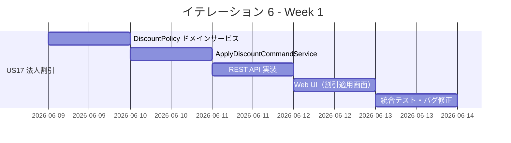
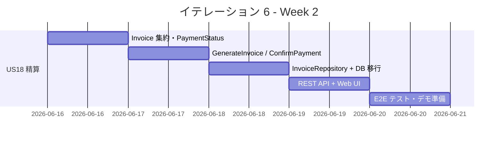
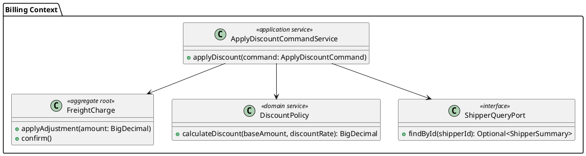
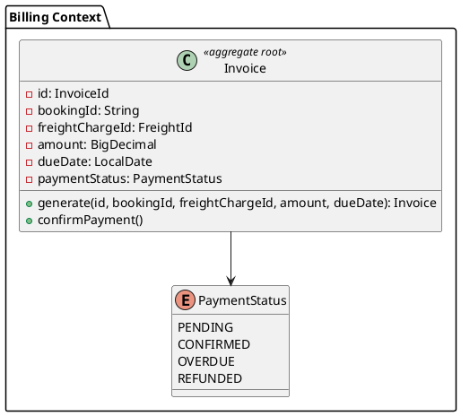

# イテレーション 6 計画

## 概要

| 項目 | 内容 |
|------|------|
| **イテレーション** | 6 |
| **期間** | Week 11-12（2026-06-09〜2026-06-22） |
| **ゴール** | 法人割引適用と精算処理で Phase 2 を完結させ、v1.0.0 をリリースする |
| **目標 SP** | 8 |

---

## ゴール

### イテレーション終了時の達成状態

1. **法人割引適用**: 経理担当者が法人荷主の輸送料金に対して契約割引率を自動適用し、割引後の合計金額を確認できる
2. **精算処理**: 経理担当者が確定済み輸送料金から精算書（Invoice）を発行し、支払い確認まで一連の精算フローを実行できる
3. **v1.0.0 リリース**: US01〜US18 が揃い、Phase 2 全機能が稼働する v1.0.0 のリリースが完了する

### 成功基準

- [x] 法人荷主の予約に対して割引率（0〜30%）が自動適用され、割引後合計金額が算出される
- [x] 個人荷主の予約には割引が適用されない（割引率ゼロ扱い）
- [x] 確定済み輸送料金から精算書を発行でき、支払い状態が「PENDING」で登録される
- [x] 支払い確認操作により支払い状態が「CONFIRMED」に更新される
- [x] backend テスト Green・カバレッジ 80% 以上・SonarQube Quality Gate PASS
- [x] E2E テストが全件 Green

---

## ユーザーストーリー

### 対象ストーリー

| ID | ユーザーストーリー | SP | 優先度 |
|----|-------------------|----|--------|
| US17 | 法人割引を適用する | 3 | 中 |
| US18 | 精算を処理する | 5 | 中 |
| **合計** | | **8** | |

### ストーリー詳細

#### US17: 法人割引を適用する

**ストーリー**:
> 経理担当者として、法人荷主の輸送料金に対して法人契約の割引率を適用したい。なぜなら、法人顧客への契約優遇を正確に反映した料金で精算を行えるからだ。

**受入条件**:

1. 法人荷主の予約に輸送料金（DRAFT 状態）が存在する場合、割引を適用できる
2. 割引率は荷主の法人契約情報（`CorporateContractInfo.discountRate`）から自動取得される
3. 割引額 = 基本料金 × 割引率（マイナス調整額として `applyAdjustment()` に適用）
4. 割引後の合計金額（基本料金 − 割引額）が画面に表示される
5. 個人荷主（`CustomerCategory.INDIVIDUAL`）には割引が適用されない

#### US18: 精算を処理する

**ストーリー**:
> 経理担当者として、確定済みの輸送料金に対して精算書を発行し、支払いの受付・確認を管理したい。なぜなら、輸送料金の確定から入金確認までの精算フローを一元管理できるからだ。

**受入条件**:

1. 確定済み（CONFIRMED）輸送料金に対して精算書（Invoice）を発行できる
2. 精算書には予約 ID・輸送料金・支払い期限が含まれ、支払い状態「PENDING」で登録される
3. 支払い確認操作で支払い状態が「CONFIRMED」に更新される
4. 精算一覧画面で精算書の支払い状態（PENDING / CONFIRMED）を確認できる
5. 支払い状態が「CONFIRMED」の精算書は変更できない

### タスク

#### 1. US17: 法人割引を適用する（3 SP）

| # | タスク | 見積もり | 担当 | 状態 |
|---|--------|---------|------|------|
| 1.1 | `DiscountPolicy` ドメインサービス + 単体テスト（TDD） | 4h | - | [x] |
| 1.2 | `ApplyDiscountCommand` + `ApplyDiscountCommandService`（Shipper ACL 連携） | 4h | - | [x] |
| 1.3 | REST API: `PUT /api/freight-charges/{id}/apply-discount` | 2h | - | [x] |
| 1.4 | Web UI: 割引適用ボタン・割引後金額表示（`billing/detail.html`） | 2h | - | [x] |

**小計**: 12h（理想時間）

#### 2. US18: 精算を処理する（5 SP）

| # | タスク | 見積もり | 担当 | 状態 |
|---|--------|---------|------|------|
| 2.1 | `Invoice` 集約 + `PaymentStatus` 値オブジェクト + 単体テスト（TDD） | 4h | - | [x] |
| 2.2 | `GenerateInvoiceCommand` + `GenerateInvoiceCommandService` | 4h | - | [x] |
| 2.3 | `ConfirmPaymentCommand` + `ConfirmPaymentCommandService` | 2h | - | [x] |
| 2.4 | `InvoiceRepository` + DB マイグレーション（`invoices` テーブル） | 2h | - | [x] |
| 2.5 | REST API: `POST /api/invoices`・`PUT /api/invoices/{id}/confirm-payment` | 3h | - | [x] |
| 2.6 | Web UI: 精算一覧（`billing/invoices.html`）・精算書詳細（`billing/invoice-detail.html`） | 3h | - | [x] |
| 2.7 | E2E テスト: `US17E2ETest`・`US18E2ETest` | 3h | - | [x] |

**小計**: 21h（理想時間）

#### タスク合計

| カテゴリ | SP | 理想時間 | 状態 |
|---------|----|----|------|
| US17 法人割引適用 | 3 | 12h | [x] |
| US18 精算処理 | 5 | 21h | [x] |
| **合計** | **8** | **33h** | |

**1 SP あたり**: 約 4.1h
**進捗率**: 100%（8/8 SP）✅

---

## スケジュール

### Week 1（Day 1-5）: US17 法人割引



| 日 | タスク |
|----|--------|
| Day 1（6/9） | 1.1 `DiscountPolicy` ドメインサービス TDD |
| Day 2（6/10） | 1.2 `ApplyDiscountCommandService`（Shipper ACL 連携） |
| Day 3（6/11） | 1.3 REST API 実装 |
| Day 4（6/12） | 1.4 Web UI（割引適用ボタン・金額表示） |
| Day 5（6/13） | US17 統合テスト・バグ修正 |

### Week 2（Day 6-10）: US18 精算処理



| 日 | タスク |
|----|--------|
| Day 6（6/16） | 2.1 `Invoice` 集約・`PaymentStatus` TDD |
| Day 7（6/17） | 2.2〜2.3 `GenerateInvoiceCommandService`・`ConfirmPaymentCommandService` |
| Day 8（6/18） | 2.4 `InvoiceRepository`・DB マイグレーション |
| Day 9（6/19） | 2.5〜2.6 REST API・Web UI（精算一覧・詳細） |
| Day 10（6/20） | 2.7 E2E テスト全件確認・デモ準備・v1.0.0 リリース作業 |

---

## 設計

### ドメインモデル

#### US17: DiscountPolicy ドメインサービス



#### US18: Invoice 集約



### データモデル

#### invoices テーブル

```sql
CREATE TABLE invoices (
    id          VARCHAR(36)    NOT NULL PRIMARY KEY,
    booking_id  VARCHAR(36)    NOT NULL,
    freight_id  VARCHAR(36)    NOT NULL,
    amount      DECIMAL(15, 2) NOT NULL,
    due_date    DATE           NOT NULL,
    status      VARCHAR(20)    NOT NULL DEFAULT 'PENDING'
);
```

### API 設計

| メソッド | エンドポイント | 説明 |
|---------|---------------|------|
| PUT | `/api/freight-charges/{id}/apply-discount` | 法人割引を適用する（US17） |
| POST | `/api/invoices` | 精算書を発行する（US18） |
| PUT | `/api/invoices/{id}/confirm-payment` | 支払いを確認する（US18） |
| GET | `/api/invoices` | 精算一覧を取得する（US18） |

### ACL 設計（US17）

Billing BC は Shipper BC の法人契約情報を取得するため、ACL ポートを追加する。

- インターフェース: `billing.application.internal.outboundservices.ShipperQueryPort`
- アダプター: `billing.infrastructure.adapters.ShipperQueryPortAdapter`
- 実装: Shipper BC の `ShipperRepository` を呼び出して `CorporateContractInfo.discountRate()` を返す

---

## リスクと対策

| リスク | 影響度 | 対策 |
|--------|--------|------|
| Billing-Shipper BC 間の ACL 実装複雑化 | 中 | IT5 の `FreightBookingQueryPortAdapter` パターンを踏襲する |
| Invoice テーブル追加による既存テスト影響 | 低 | E2E テストの `cleanUp()` に `DELETE FROM invoices` を追加する |
| v1.0.0 リリース作業が Day 10 に集中 | 中 | Day 9 でリリース準備を開始し、Day 10 は確認・タグ付けのみにする |

---

## 完了条件

### Definition of Done

- [x] `./gradlew test` 全件 GREEN
- [x] テストカバレッジ 80% 以上（分岐カバレッジ含む）
- [x] SonarQube Quality Gate PASS
- [x] E2E テスト（`US17E2ETest`・`US18E2ETest`）全件 GREEN
- [x] コードレビュー完了（`developing-review` スキル実行）
- [x] UI/UX レビュー完了（`developing-uiux-review` スキル実行）
- [ ] ドキュメント更新完了（`mkdocs.yml`・`docs/index.md`）
- [ ] v1.0.0 リリースタグ付与

### デモ項目

1. 法人荷主の輸送料金に割引率を適用し、割引後合計金額を確認する
2. 確定済み輸送料金から精算書を発行し、支払い状態「PENDING」で登録される
3. 支払い確認操作で状態が「CONFIRMED」に更新される

---

## 更新履歴

| 日付 | 更新内容 | 更新者 |
|------|---------|--------|
| 2026-04-03 | 初版作成 | - |
| 2026-04-03 | IT6 完了（8/8 SP・100%）・US17 法人割引・US18 精算処理全実装・E2E 全件 Green・SonarQube Quality Gate PASS | Copilot |

---

## 関連ドキュメント

- [イテレーション 6 ふりかえり](./retrospective-6.md)
- [イテレーション 6 完了報告書](./iteration_report-6.md)
- [リリース計画](./release_plan.md)
