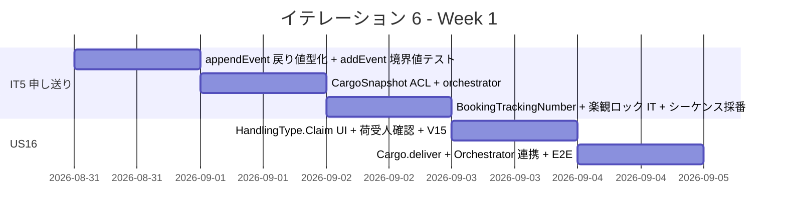
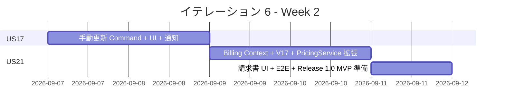
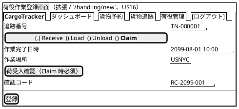
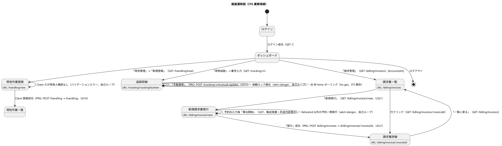

# イテレーション 6 計画

## 概要

| 項目 | 内容 |
|------|------|
| **イテレーション** | 6 |
| **期間** | Week 11-12（2026-08-31 〜 2026-09-13、2 週間） |
| **ゴール** | 引取作業記録（US16）・貨物状態手動更新（US17）・輸送料金算出（US21）を完成させ Release 1.0 MVP をリリースする。IT5 セルフレビュー高優先度 7 件（H1-H7）+ 中観察 3 件（O1-O3）を解消する |
| **目標 SP** | 12（US16: 3 + US17: 3 + US21: 6） |

---

## ゴール

### イテレーション終了時の達成状態

1. **引取作業記録（US16）**: 荷役作業員が引取作業（`HandlingType.Claim`）を記録すると荷受人確認（署名 or 確認コード）と共に永続化され、貨物状態が `BookingStatus.Delivered` に遷移する
2. **貨物状態手動更新（US17）**: 追跡管理者が追跡番号を指定して状態・位置・時刻を手動更新でき、楽観ロックで整合性を保証する
3. **輸送料金算出（US21）**: Billing Context を新設し、引取済予約に対して輸送実績ベースの料金（`baseAmount`）を算出し `Invoice` 集約を生成する。US01 見積ロジックと共通化（`PricingService` 経由）
4. **US22 法人割引の自動表示**（IT6 部分実装）: 荷主が法人の場合、`Accountant` が料金算出画面で `DiscountRate` を自動取得・表示する（適用ロジック完成は IT8 US22）
5. **Release 1.0 MVP リリース**: 共通最低ゲート + 増分検証（追跡照会 P95 < 1 秒、E2E シナリオ、見積・料金整合性）を満たし v1.0.0 をリリースする
6. **IT5 申し送り解消**: H1-H7 + O1-O3 を全件解消

### 成功基準

- [ ] US16 / US17 / US21 の受入条件をすべて満たす
- [ ] Release 1.0 MVP 増分検証ゲート pass
- [ ] new_coverage 80% 以上、Quality Gate PASS
- [ ] `appendEvent` 戻り値型化（H1）/ `CargoSnapshot` ACL（H6）/ orchestration サービス分離（H3）が完了
- [ ] `OutOfOrder` 境界値テスト（H4）/ 楽観ロック integration test（H5）追加
- [ ] tracking_number 採番を PostgreSQL シーケンス化（O2）

---

## ユーザーストーリー

### 対象ストーリー

| ID | ユーザーストーリー | SP | 優先度 |
|----|-------------------|----|----|
| US16 | 引取作業を記録する | 3 | 必須 |
| US17 | 貨物状態を手動更新する | 3 | 必須 |
| US21 | 輸送料金を算出する | 6 | 必須 |
| **合計** | | **12** | |

### ストーリー詳細

#### US16: 引取作業を記録する

> 荷役作業員として、荷受人が貨物を引き取る際に荷受人確認（署名または確認コード）を取得して引取作業を記録したい。なぜなら、荷受人への正式な引き渡しを証明し配送完了を記録できるからだ。

**受入条件**:

1. 作業種別「引取」（`HandlingType.Claim`）を選択すると荷受人確認フィールド（署名または確認コード）が表示される
2. 荷受人確認が取得されると引取作業が記録される
3. 記録後、貨物状態が「引取済」（`BookingStatus.Delivered`）に更新される
4. 貨物状態「引取済」は配送完了を意味し、精算処理（US21）の開始条件となる

#### US17: 貨物状態を手動更新する

> 追跡管理者として、追跡番号を指定して貨物の状態・位置・更新日時を手動で更新したい。なぜなら、荷役作業員の記録だけでは捕捉できない状態変化（出港・入港等）を追跡情報に反映できるからだ。

**受入条件**:

1. 追跡番号を指定して現在の貨物情報を確認できる
2. 新しい状態・位置・日時を入力して追跡情報を更新できる
3. 更新後、追跡イベントが履歴に記録される（`TrackingActivityEvent` 追記）
4. 楽観ロックで競合更新が拒否される（`OptimisticLockException`）
5. 状態変更の種類に応じて荷主への通知が送信される

#### US21: 輸送料金を算出する

> 経理担当者として、配送完了した予約に対して輸送実績（経路・重量・貨物種別・荷役実績）をもとに輸送料金を算出したい。なぜなら、実際の輸送内容に基づく正確な料金を算出し精算に進めるからだ。

**受入条件**:

1. 「引取済」（`BookingStatus.Delivered`）状態の予約に対して料金算出を開始できる
2. 輸送実績（経路・距離・重量・貨物種別・荷役作業実績）が表示される
3. 基本料金（`baseAmount`）が `PricingService` で自動計算される
4. 法人荷主の場合、`DiscountRate` を自動取得して画面に表示する（適用ロジック完成は IT8 US22）
5. 算出結果を確認して `Invoice` 集約を `Pending` 状態で確定登録できる
6. 例外（遅延・破損等）対応の料金調整入力は IT7 申し送り（US19/US20 と同時実装）

### タスク

#### 0. IT5 申し送り（マルチパースペクティブセルフレビュー高優先度 + 中観察）

| # | タスク | 見積もり | 状態 |
|---|--------|---------|------|
| 0.1 | `TrackingActivityRepository.appendEvent` 戻り値を `Unit` → `TrackingActivity`（新バージョン付き）に変更し呼出側の再利用安全化（H1 解消） | 3h | [x] |
| 0.2 | `CargoSnapshot` ACL VO を Handling Context に新設、`HandlingCommandService.register` に注入し Cargo 状態（`TrackingIssued`/`InTransit`/`Delivered` 直前まで）を検証（H6 解消） | 4h | [ ] |
| 0.3 | orchestration サービス `BookingHandlingOrchestrator` を application 層に新設し、HandlingActivity 登録 + TrackingActivity event 追記 + 通知ログを単一 `DB.localTx` 境界に統合（H3 解消） | 4h | [ ] |
| 0.4 | `TrackingActivitySpec` に `addEvent` の `OutOfOrder`（時系列逆順）境界値テスト + 同時刻イベント許容テストを追加（H4 解消） | 2h | [x] |
| 0.5 | `ScalikeJdbcTrackingActivityRepositoryIntegrationSpec`（Testcontainers）に楽観ロック衝突 → `OptimisticLockException` テストを追加（H5 解消） | 3h | [x] |
| 0.6 | `BookingTrackingNumber` opaque type を Booking Context に新設、`Cargo.issueTracking(BookingTrackingNumber)` でフォーマット検証（H2 解消） | 3h | [x] |
| 0.7 | `transport_status` 整合性 assertion を `TrackingActivity` 不変条件に追加し、`addEvent` 結果と DB キャッシュの乖離を検出（H7 解消） | 2h | [x] |
| 0.8 | tracking_number 採番を `MAX(id)+1` → PostgreSQL シーケンス（`DEFAULT nextval('tracking_number_seq')`）に変更（O2 解消、ADR 0013 で 0010 更新） | 3h | [x] |
| 0.9 | 公開ページ用 `layout/public.scala.html` を切り出し `publicDetail` / `publicNotFound` から呼出（O1 解消） | 2h | [x] |
| 0.10 | `Itinerary` に leg 詳細（from/to 港湾）を追加し、`HandlingCommandService.register` のルート逸脱判定（`routeDeviation`）を正式実装（O3 解消） | 4h | [ ] |

**小計**: 30h

> **IT6 スコープ外で IT7 / IT8 以降に申し送り**:
>
> - 例外対応の料金調整入力（US21 受入条件 6）: US19/US20（IT7）と同時実装
> - 法人割引適用ロジック・割引内訳の請求書詳細表示（US22 全体）: IT8（US22 単独）
> - 支払い確認（US23）: IT8

#### 1. US16 引取作業記録（3 SP）

| # | タスク | 見積もり | 状態 |
|---|--------|---------|------|
| 1.1 | `HandlingType.Claim` の UI 開放（荷役作業登録画面に「引取」ラジオボタン追加）+ 荷受人確認フィールド（署名 or 確認コード）の条件付き表示 | 3h | [x] |
| 1.2 | `HandlingActivity` 集約に `recipientConfirmation: Option[String]` フィールド追加 + `Claim` 時必須化のドメイン不変条件 | 2h | [x] |
| 1.3 | Flyway V15: `handling_activity.recipient_confirmation` カラム追加 | 1h | [x] |
| 1.4 | `Cargo.deliver()` ドメインメソッド: `Claim` 記録後に `BookingStatus` を `Delivered` に遷移 + canTransitionTo 拡張 | 3h | [x] |
| 1.5 | Claim → Cargo.deliver + DeliveryCompleted 通知連携（Orchestrator 0.3 未着手のため Controller 一時連結） | 2h | [x] |
| 1.6 | E2E（Claim 登録 → 貨物状態 `Delivered` + TrackingStatus `Claimed` + 配送完了通知）+ ユニットテスト（荷受人確認必須 / Delivered 遷移） | 3h | [x] |

**小計**: 14h

#### 2. US17 貨物状態手動更新（3 SP）

| # | タスク | 見積もり | 状態 |
|---|--------|---------|------|
| 2.1 | `UpdateTrackingStatusCommand` + `TrackingCommandService.updateStatus(trackingNumber, status, location, occurredAt)` 実装。楽観ロック付き | 3h | [x] |
| 2.2 | `TrackingActivity.recordManualUpdate(status, location, time)`: イベント履歴に `TrackingActivityEvent` を追記 + `transport_status` 同期（既存 addEvent + appendEvent で実現） | 3h | [x] |
| 2.3 | 追跡詳細画面（`/tracking/:trackingNumber`）に「状態を手動更新」ボタン + モーダルフォーム（状態セレクト / 港湾 / 日時） | 4h | [x] |
| 2.4 | `NotificationType.ManualStatusUpdated` 追加 + Flyway V16（notification_log CHECK 拡張）+ payload + Booking 側通知連携 | 2h | [x] |
| 2.5 | E2E（Tracker ログイン → 手動更新 → 履歴反映 + 通知記録 + 競合時 `OptimisticLockException`）+ ユニットテスト | 3h | [x] |

**小計**: 15h

#### 3. US21 輸送料金算出（6 SP）

| # | タスク | 見積もり | 状態 |
|---|--------|---------|------|
| 3.1 | Billing Context 新設: `Invoice` 集約 + VO（`InvoiceId` / `BillingBookingId` / `BillingShipperId(isCorporate)` / `DiscountRate(0.0000~0.3000)` / `DiscountPolicyType` / `Money`）+ enum（`PaymentStatus` / `DiscountPolicyType`）+ `InvoiceRepository` ポート | 5h | [x] |
| 3.2 | Flyway V17: `invoice` + `invoice_line_item` + `payment` テーブル + `cargo.invoice_id` 参照カラム + `invoice_id_seq` シーケンス + ScalikeJdbcInvoiceRepository 実装 | 3h | [x] |
| 3.3 | `PricingService.calculateActual(...)` を追加（現状は `estimateCost` と同値、Estimation と単価表共通利用） | 3h | [x] |
| 3.4 | `GenerateInvoiceCommand` + `BillingCommandService.generate(bookingId)` 実装（Delivered 必須 / Pending 発行 / 冪等） | 4h | [x] |
| 3.5 | 法人割引率自動取得（US22 部分実装）: `BillingShipperId.isCorporate` 真の場合 `DiscountPolicy.calculateRate` で `DiscountRate` を取得し画面に表示（適用 = `applyDiscount` は IT8 US22） | 2h | [ ] |
| 3.6 | 請求書一覧 `/billing/invoices` + 発行画面 `/billing/invoices/new` + 詳細 `/billing/invoices/:invoiceId`（基本料金 / 割引率 / 最終金額 / 状態表示） | 5h | [x] |
| 3.7 | `Settlement` ロール（または `MasterAdmin`）でダッシュボードに「請求管理」カード追加 | 2h | [x] |
| 3.8 | E2E（引取済予約 → 料金算出 → `PaymentStatus.Pending` 登録 → 一覧表示 + 見積金額との整合性 property test）+ ユニットテスト | 4h | [x] |

**小計**: 28h

#### タスク合計

| カテゴリ | SP | 理想時間 |
|---------|----|----|
| IT5 申し送り（0.x） | - | 30h |
| US16 引取作業記録 | 3 | 14h |
| US17 貨物状態手動更新 | 3 | 15h |
| US21 輸送料金算出 | 6 | 28h |
| **合計** | **12** | **87h** |

**1 SP あたり**: 約 7.3h（IT5 申し送り含む / 機能タスクのみなら 4.8h）
**進捗率**: 100% (12/12 SP 機能完了 + E2E 5 件 PASS) / IT5 申し送り 7/10 件完了 (18/30h)

- US16 (3 SP): 1.1〜1.6 完了 (E2E 2 件 PASS)
- US17 (3 SP): 2.1〜2.5 完了 (E2E 1 件 PASS)
- US21 (6 SP): 3.1〜3.4 + 3.6 + 3.7 + 3.8 完了 (E2E 2 件 PASS)、3.5 法人割引自動取得は IT7 へ申し送り

**テスト実績**:
- Unit: 261 件 succeeded / 0 failed
- E2E (Playwright): 36/36 PASS (1.3 分)、IT6 5 件含む
- Testcontainers IT: 2 件 (楽観ロック、Docker 起動時のみ)

---

## スケジュール

### Week 1（Day 1-5）



| 日 | タスク |
|----|--------|
| Day 1 | 0.1 appendEvent 戻り値化（H1）/ 0.4 OutOfOrder テスト（H4） |
| Day 2 | 0.2 CargoSnapshot（H6）/ 0.3 Orchestrator（H3） |
| Day 3 | 0.5 楽観ロック IT（H5）/ 0.6 BookingTrackingNumber（H2）/ 0.7 transport_status assertion（H7）/ 0.8 シーケンス採番 + ADR 0013（O2）/ 0.9 公開 layout（O1）/ 0.10 Itinerary leg + 逸脱判定（O3） |
| Day 4 | 1.1-1.3 US16 UI + ドメイン + V15 |
| Day 5 | 1.4-1.6 US16 deliver + Orchestrator + E2E |

### Week 2（Day 6-10）



| 日 | タスク |
|----|--------|
| Day 6 | 2.1-2.3 US17 Command + 集約メソッド + UI |
| Day 7 | 2.4-2.5 US17 通知 + V16 + E2E |
| Day 8 | 3.1-3.3 US21 Billing Context + V17 + PricingService 共通化 + ADR 0012 |
| Day 9 | 3.4-3.6 US21 GenerateInvoice + 法人割引率自動取得 + UI |
| Day 10 | 3.7-3.8 ダッシュボード + E2E + 統合テスト + Release 1.0 MVP リリース準備 |

---

## 設計

### ドメインモデル

IT5 までで確立した Booking / Routing / Tracking / Handling Context に、IT6 で **Billing Context** を新設する。`Invoice` 集約ルートが `DiscountRate` / `DiscountPolicy` を持ち（domain-model.md L914-927 / L1341-1345）、Booking との連携は `BillingBookingId` ACL + ドメインイベント（`InvoiceCreatedEvent` / `InvoiceConfirmedEvent`）で実施する。`PricingService`（Shared Kernel 配下 `shared.domain.pricing`）を Estimate（US01）と Invoice（US21）で共通利用する（ADR 0012）。

```plantuml
@startuml

title IT6 ドメインモデル全体図 (Billing Context 新設 + 引取・状態更新拡張)

package "Shared Kernel" {
  class PricingService <<service>> {
    + calculate(spec): Money
    + calculateActual(bookingId): Money
  }
  class Money <<value>> {
    amount: Long
    currency: Currency
  }
  class Location <<value>> {
    unLocode
  }
}

package "Booking Context" {
  class Cargo <<aggregate root>> {
    bookingId
    status: BookingStatus
    trackingNumber: Option
    invoiceId: Option
    version
    --
    + issueTracking(tn)
    + deliver()
  }
  enum BookingStatus {
    Preliminary
    RouteProposed
    RouteAssigned
    Confirmed
    TrackingIssued
    InTransit
    Delivered
    Settled
    Cancelled
  }
  class BookingTrackingNumber <<opaque>>
}

package "Tracking Context" {
  class TrackingActivity <<aggregate root>> {
    events
    transport_status
    version
    --
    + addEvent(e): TrackingActivity
    + recordManualUpdate(s, l, t)
  }
}

package "Handling Context" {
  class HandlingActivity <<aggregate root>> {
    eventType: HandlingType
    recipientConfirmation: Option
    routeDeviation: Boolean
    --
    + isClaim(): Boolean
  }
  enum HandlingType {
    Receive
    Load
    Unload
    Customs
    Claim
  }
  class CargoSnapshot <<ACL>> {
    bookingId
    status
    itinerary
    --
    + canRegisterHandling(t)
  }
}

package "Billing Context" {
  class Invoice <<aggregate root>> {
    invoiceId: InvoiceId
    cargoBookingId: BillingBookingId
    shipperId: BillingShipperId
    baseAmount: Money
    discountRate: DiscountRate
    finalAmount: Money
    paymentStatus: PaymentStatus
    issuedAt: Option
    paidAt: Option
    version
    --
    + calculateFinalAmount(): Money
    + applyDiscount(p)
    + confirmPayment(at)
  }
  class InvoiceId <<opaque>>
  class BillingBookingId <<opaque>>
  class BillingShipperId <<value>> {
    shipperId
    shipperType
    --
    + isCorporate(): Boolean
  }
  class DiscountRate <<opaque>>
  class DiscountPolicy <<value>> {
    policyType: DiscountPolicyType
    --
    + calculateRate(st, amt): DiscountRate
  }
  enum PaymentStatus {
    Pending
    Confirmed
    Overdue
    Refunded
  }
  enum DiscountPolicyType {
    CorporateStandard
    VolumeDiscount
    Seasonal
    None
  }
}

Cargo *-- BookingStatus
Cargo o-- BookingTrackingNumber
HandlingActivity *-- HandlingType
HandlingActivity ..> CargoSnapshot : validates
Invoice *-- InvoiceId
Invoice *-- BillingBookingId
Invoice *-- BillingShipperId
Invoice *-- Money
Invoice *-- DiscountRate
Invoice *-- PaymentStatus
Invoice ..> DiscountPolicy : applyDiscount
Invoice ..> PricingService : calculateActual
DiscountPolicy *-- DiscountPolicyType

HandlingActivity ..> Cargo : HandlingActivityRegistered
Invoice ..> Cargo : InvoiceCreated

note right of BookingStatus
  Delivered は IT6 US16 で
  InTransit から Delivered 遷移を有効化
end note

note right of HandlingType
  Claim は IT6 US16 で UI 開放
  (IT5 は enum 定義のみ)
end note

note bottom of CargoSnapshot
  IT6 新規 (IT5 H6 解消、ADR 0011)
  Handling は Booking 内部に依存せず
  Cargo 状態を ACL 経由で検証
end note

note right of PricingService
  Estimate (US01) と Invoice (US21)
  で共通利用 (ADR 0012)
  calculateActual は荷役実績含む
end note

note bottom of Invoice
  IT6 新規 (domain-model.md L914-927 準拠)
  applyDiscount + confirmPayment は
  IT8 US22/US23 で完成
end note

@enduml
```



#### 不変条件（IT6 追加分）

1. `HandlingActivity.recipientConfirmation` は `eventType == Claim` のとき必須（空 or 未指定なら `RecipientConfirmationRequired`）
2. `Cargo.deliver` は `Claim` 荷役記録経由（`HandlingActivityRegisteredEvent`）でのみ呼出可。直接呼出は `DomainError.InvalidOperation`
3. `Invoice` は `BookingStatus.Delivered` の予約に対してのみ作成可（domain-model.md L997）
4. `Invoice.applyDiscount` は `paymentStatus == Pending` 状態でのみ実行可
5. `Invoice.confirmPayment` は `paymentStatus == Pending` 状態でのみ実行可、`Confirmed` への 1 方向遷移（IT8 US23 で実装）
6. `Pending` の `Invoice` は再計算不可（idempotent / 再計算したい場合は補正用 `invoice_line_item` を追加）
7. `TrackingActivity.recordManualUpdate` の `occurredAt` は最終イベントより未来でなければならない（H4 と同様の時系列順序検証）
8. `BookingTrackingNumber` は `Cargo.issueTracking` 時に opaque type 検証通過のみ受理（H2）
9. `transport_status` カラムは書込トランザクション内で `deriveStatus(events)` と一致することを assertion（H7）
10. `DiscountRate` は `0.0000 ~ 0.3000` の範囲（domain-model.md L948 / data-model.md L667）
11. `BillingShipperId.isCorporate` 真かつ法人荷主の場合のみ `DiscountPolicy.calculateRate` で割引率を取得（個人荷主は 0.0000）

#### BookingStatus 状態遷移マトリクス（IT6 拡張版）

| from \ to | InTransit | **Delivered** | Settled | Cancelled |
|-----------|:---------:|:-------------:|:-------:|:---------:|
| **TrackingIssued** | ✓（IT5）| - | - | - |
| **InTransit** | - | **✓（US16 / IT6）** | - | - |
| **Delivered** | - | - | ✓（IT8 US23）| - |

太字は IT6 で新規追加する遷移（`InTransit → Delivered`、US16 経由）。

#### PaymentStatus 遷移マトリクス（IT6）

| from \ to | Pending | Confirmed | Overdue | Refunded |
|-----------|:-------:|:---------:|:-------:|:--------:|
| **（新規）** | **✓（US21 / IT6）** | - | - | - |
| **Pending** | - | ✓（IT8 US23）| ✓（IT8 自動）| - |
| **Confirmed** | - | - | - | ✓（IT8 / 業務例外）|

IT6 で実装するのは「新規 → Pending」のみ。`Confirmed` / `Overdue` / `Refunded` への遷移は IT8 で完成。

### データモデル

V14 まで適用済の IT5 状態に対し、IT6 で **V15 / V16 / V17** を追加する。命名規約（単数形テーブル / `id BIGSERIAL PK + 業務キー UK` / `version INT` / 監査カラム / FK は `id` 参照）は data-model.md に準拠する。

#### V15: handling_activity.recipient_confirmation（US16）

```sql
-- IT6 US16: 引取時の荷受人確認（署名 or 確認コード）
ALTER TABLE handling_activity
  ADD COLUMN recipient_confirmation VARCHAR(500);
-- ドメイン側で eventType=Claim 時の必須化を担保（DB 制約は緩い）
COMMENT ON COLUMN handling_activity.recipient_confirmation IS 'Claim 時のみ必須（署名画像参照 or 確認コード）';
```

#### V16: notification_log CHECK 拡張（US16 / US17）

```sql
-- IT6 US16 / US17: 配送完了通知 + 手動更新通知を追加
ALTER TABLE notification_log DROP CONSTRAINT ck_notification_log_type;
ALTER TABLE notification_log ADD CONSTRAINT ck_notification_log_type
    CHECK (type IN ('RouteNotified', 'BookingConfirmed', 'BookingCancelled',
                    'TrackingIssued', 'HandlingRecorded',
                    'ManualStatusUpdated', 'DeliveryCompleted'));
```

#### V17: invoice + invoice_line_item + payment + cargo.invoice_id（US21）

```sql
-- IT6 US21: 請求書（精算書）集約ルート、data-model.md L859 準拠
CREATE TABLE invoice (
  id BIGSERIAL PRIMARY KEY,
  invoice_number VARCHAR(30) NOT NULL,
  booking_id VARCHAR(20) NOT NULL,
  total_amount_value INTEGER NOT NULL,
  total_amount_currency VARCHAR(3) NOT NULL,
  tax_rate NUMERIC(5,4) NOT NULL DEFAULT 0.1000,
  tax_amount NUMERIC(15,2) NOT NULL DEFAULT 0,
  payment_status VARCHAR(30) NOT NULL
    CHECK (payment_status IN ('PENDING', 'CONFIRMED', 'OVERDUE', 'REFUNDED')),
  issued_at TIMESTAMP WITH TIME ZONE,
  due_date DATE,
  discount_amount_value INTEGER,
  discount_amount_currency VARCHAR(3),
  version INT NOT NULL DEFAULT 0,
  created_at TIMESTAMP WITH TIME ZONE NOT NULL DEFAULT CURRENT_TIMESTAMP,
  updated_at TIMESTAMP WITH TIME ZONE NOT NULL DEFAULT CURRENT_TIMESTAMP,
  CONSTRAINT uk_invoice_invoice_number UNIQUE (invoice_number),
  CONSTRAINT uk_invoice_booking UNIQUE (booking_id) -- 二重請求防止
);
CREATE INDEX idx_invoice_booking ON invoice (booking_id);
CREATE INDEX idx_invoice_payment_status ON invoice (payment_status);

-- IT6 US21: 精算明細、data-model.md L880 準拠
CREATE TABLE invoice_line_item (
  id BIGSERIAL PRIMARY KEY,
  invoice_id BIGINT NOT NULL REFERENCES invoice (id) ON DELETE CASCADE,
  description VARCHAR(200) NOT NULL,
  amount_value INTEGER NOT NULL,
  amount_currency VARCHAR(3) NOT NULL,
  seq_number INT NOT NULL,
  created_at TIMESTAMP NOT NULL DEFAULT CURRENT_TIMESTAMP,
  updated_at TIMESTAMP NOT NULL DEFAULT CURRENT_TIMESTAMP,
  CONSTRAINT uk_invoice_line_item_seq UNIQUE (invoice_id, seq_number)
);
CREATE INDEX idx_invoice_line_item_invoice ON invoice_line_item (invoice_id);

-- IT6 US21: 支払記録テーブルを先行作成（活用は IT8 US23）、data-model.md L895 準拠
CREATE TABLE payment (
  id BIGSERIAL PRIMARY KEY,
  invoice_id BIGINT NOT NULL REFERENCES invoice (id),
  paid_amount_value INTEGER NOT NULL,
  paid_amount_currency VARCHAR(3) NOT NULL,
  paid_at TIMESTAMP NOT NULL,
  payment_method VARCHAR(30) NOT NULL
    CHECK (payment_method IN ('BANK_TRANSFER', 'CREDIT_CARD', 'OTHER')),
  transaction_reference VARCHAR(100),
  created_at TIMESTAMP WITH TIME ZONE NOT NULL DEFAULT CURRENT_TIMESTAMP,
  updated_at TIMESTAMP WITH TIME ZONE NOT NULL DEFAULT CURRENT_TIMESTAMP
);
CREATE INDEX idx_payment_invoice ON payment (invoice_id);

-- IT6 US21: Cargo に invoice_id 参照を追加（Read Model 用、Booking ⇆ Billing 連携の denormalize）
ALTER TABLE cargo ADD COLUMN invoice_id BIGINT;
CREATE INDEX idx_cargo_invoice_id ON cargo (invoice_id);

-- IT6 O2: tracking_number 採番を MAX(id)+1 → PostgreSQL シーケンス化（ADR 0013）
CREATE SEQUENCE tracking_number_seq START WITH 1000 INCREMENT BY 1;
-- 既存テーブルは触らない（採番ロジック側で nextval('tracking_number_seq') を利用）
```

#### 既存テーブル一覧（参考）

| テーブル | バージョン | IT |
|---------|----------|-----|
| user, shipper, cargo, voyage, carrier_movement, voyage_supported_cargo_type, estimate, route_candidate | V1-V8 | IT1-IT3 |
| route_candidate_selection / route_candidate_selection_leg | V9 | IT4 |
| cargo_itinerary_leg | V10 | IT4 |
| notification_log | V11 | IT4 |
| tracking_activity（+ cargo.tracking_number） | V12 | IT5 |
| handling_activity | V13 | IT5 |
| tracking_handling_event（+ notification_log type 拡張） | V14 | IT5 |
| **handling_activity.recipient_confirmation** | **V15** | **IT6** |
| **notification_log CHECK 拡張（ManualStatusUpdated / DeliveryCompleted）** | **V16** | **IT6** |
| **invoice / invoice_line_item / payment / cargo.invoice_id / tracking_number_seq** | **V17** | **IT6** |

### ユーザーインターフェース

#### ビュー

ui_design.md（line 71-130）の画面一覧に IT6 で追加する 3 画面（請求書一覧 / 新規請求書発行 / 請求書詳細）と、拡張する 2 画面（荷役登録 / 追跡詳細）を反映する。ナビバーは IT2 から継続するが、`Accountant` ロールで「請求管理」メニューを追加する。



#### 画面一覧（IT6 追加・拡張）

| 画面名 | URL | 説明 | アクセスロール | 関連 US |
|--------|-----|------|---------------|---------|
| 荷役登録（拡張）| `/handling/new` | `Claim` 種別 + 荷受人確認フィールドの条件付き表示 | Handler, Tracker | **US16** |
| 追跡詳細（拡張）| `/tracking/:trackingNumber` | Tracker 限定で「状態を手動更新」モーダル | Tracker | **US17** |
| 新規請求書発行（新規）| `/billing/invoices/new` | 予約 ID 入力 → 輸送実績 → 基本料金 + 法人割引率 + 消費税 → 発行 | Accountant, MasterAdmin | **US21** + US22 部分 |
| 請求書一覧（新規）| `/billing/invoices` | 請求書一覧 + 支払状態フィルタ | Accountant, MasterAdmin | **US21** |
| 請求書詳細（新規）| `/billing/invoices/:invoiceId` | 経路 / 荷役実績 + 料金内訳 + 支払い確認（IT8 US23） | Accountant, MasterAdmin | **US21** |

#### インタラクション



#### htmx パターン

| パターン | 採用箇所 | 実装 |
|---------|---------|------|
| 確認モーダル | 「請求書発行」「支払い確認」 | Bootstrap modal + `data-bs-toggle` 後に通常 POST フォーム送信 |
| 通常 POST + PRG | Claim 荷役登録 / 手動更新 / 請求書発行 | フォーム送信 → SEE_OTHER → 詳細・一覧画面に flash success/error |
| htmx 部分更新（モーダル）| 追跡詳細の「状態を手動更新」 | `hx-get="/tracking/:n/manual-update-modal" hx-target="#modal" hx-trigger="click"` でフォーム取得 |
| htmx 部分更新（料金内訳）| 新規請求書発行画面の予約 ID 入力後 | `hx-get="/billing/invoices/preview?bookingId=" hx-trigger="change delay:300ms" hx-target="#invoice-preview"` で輸送実績 + 料金内訳を非同期取得 |
| htmx エラー処理 | 楽観ロック競合 | `htmx:responseError` を listener で受け `#flash-area` に `alert-danger` 挿入 |

#### フィードバックメッセージ

| トリガー | スタイル | メッセージ例 |
|---------|---------|------------|
| US16 Claim 登録成功 | `alert-success` | 「引取作業を登録しました（TN-000001 / USNYC / 配送完了）」 |
| US16 荷受人確認なし | `alert-danger` | 「引取作業には荷受人確認（署名または確認コード）が必須です」 |
| US17 手動更新成功 | `alert-success` | 「追跡状態を OnboardCarrier に更新しました」 |
| US17 楽観ロック衝突 | `alert-danger` | 「他のユーザーが先に更新しました。画面を再読み込みしてください」 |
| US21 発行成功 | `alert-success` | 「請求書 INV-000001 を発行しました（1,045 USD）」 |
| US21 Delivered 以外 | `alert-danger` | 「引取済（Delivered）でない予約には請求書を発行できません」 |
| US21 既発行 | `alert-warning` | 「この予約には既に請求書が発行されています（INV-000001）」 |

### ディレクトリ構成

IT5 までの構成に対し、IT6 で以下を追加する。

```text
apps/cargo-tracker/
├── app/
│   ├── cargotracker/
│   │   ├── booking/
│   │   │   ├── domain/model/
│   │   │   │   ├── aggregates/Cargo.scala               # IT6 拡張: deliver() + invoiceId
│   │   │   │   ├── valueobjects/BookingTrackingNumber.scala  # IT6 新規（H2）
│   │   │   │   └── valueobjects/NotificationType.scala  # IT6 拡張: ManualStatusUpdated, DeliveryCompleted
│   │   │   └── application/orchestration/
│   │   │       └── BookingHandlingOrchestrator.scala    # IT6 新規（H3）
│   │   ├── tracking/
│   │   │   ├── domain/model/aggregates/TrackingActivity.scala  # IT6 拡張: recordManualUpdate + addEvent 戻り値型化（H1）
│   │   │   ├── domain/model/repositories/TrackingActivityRepository.scala  # appendEvent 戻り値型化
│   │   │   ├── application/commandservices/
│   │   │   │   └── UpdateTrackingStatusCommand.scala    # IT6 新規
│   │   │   └── infrastructure/repositories/
│   │   │       └── ScalikeJdbcTrackingActivityRepository.scala  # シーケンス採番（O2）
│   │   ├── handling/
│   │   │   ├── domain/model/aggregates/HandlingActivity.scala  # IT6 拡張: recipientConfirmation
│   │   │   ├── domain/model/acl/CargoSnapshot.scala     # IT6 新規（H6）
│   │   │   └── application/commandservices/HandlingCommandService.scala  # IT6 拡張: Claim + ACL
│   │   ├── billing/                                     # IT6 新規 Context
│   │   │   ├── domain/model/
│   │   │   │   ├── aggregates/Invoice.scala
│   │   │   │   ├── valueobjects/
│   │   │   │   │   ├── InvoiceId.scala                  # opaque type String
│   │   │   │   │   ├── BillingBookingId.scala
│   │   │   │   │   ├── BillingShipperId.scala           # isCorporate 内包
│   │   │   │   │   ├── DiscountRate.scala               # opaque type BigDecimal
│   │   │   │   │   └── DiscountPolicy.scala             # calculateRate 内包
│   │   │   │   ├── enums/
│   │   │   │   │   ├── PaymentStatus.scala              # 4 値
│   │   │   │   │   └── DiscountPolicyType.scala         # 4 値
│   │   │   │   └── repositories/InvoiceRepository.scala
│   │   │   ├── application/
│   │   │   │   └── commandservices/
│   │   │   │       ├── BillingCommandService.scala
│   │   │   │       ├── GenerateInvoiceCommand.scala
│   │   │   │       └── ApplyDiscountCommand.scala       # IT8 US22 で活用
│   │   │   ├── infrastructure/repositories/
│   │   │   │   └── ScalikeJdbcInvoiceRepository.scala
│   │   │   └── interfaces/web/
│   │   │       └── BillingController.scala              # /billing/invoices 配下
│   │   └── shared/
│   │       ├── domain/pricing/PricingService.scala      # IT6 拡張: calculateActual
│   │       └── interfaces/web/views/layout/
│   │           └── public.scala.html                    # IT6 新規（O1）
│   └── views/
│       ├── handling/new.scala.html                      # IT6 拡張: Claim ラジオ + 荷受人確認
│       ├── tracking/detail.scala.html                   # IT6 拡張: 手動更新モーダル
│       └── billing/                                     # IT6 新規
│           ├── list.scala.html                          # /billing/invoices
│           ├── newForm.scala.html                       # /billing/invoices/new
│           └── detail.scala.html                        # /billing/invoices/:invoiceId
├── conf/
│   ├── routes                                           # IT6 拡張: 6 エンドポイント追加
│   └── db/migration/default/
│       ├── V15__add_recipient_confirmation.sql          # IT6 新規
│       ├── V16__extend_notification_log_check.sql       # IT6 新規
│       └── V17__create_invoice_payment.sql              # IT6 新規
└── test/
    └── cargotracker/
        ├── billing/                                     # IT6 新規テスト
        ├── e2e/
        │   ├── ClaimDeliveryEndpointSpec.scala          # IT6 新規（US16）
        │   ├── ManualStatusUpdateEndpointSpec.scala     # IT6 新規（US17）
        │   └── InvoiceFlowEndpointSpec.scala            # IT6 新規（US21）
        └── shared/domain/pricing/
            └── PricingServiceSpec.scala                 # IT6 拡張: calculateActual property test
```

### API 設計

| メソッド | エンドポイント | 説明 | 関連 US | 認証 |
|---------|---------------|------|---------|------|
| POST | `/tracking/:trackingNumber/manual-update` | 状態手動更新（PRG）| US17 | Tracker |
| GET | `/billing/invoices` | 請求書一覧 | US21 | Accountant |
| GET | `/billing/invoices/new` | 新規発行フォーム | US21 | Accountant |
| GET | `/billing/invoices/preview` | 料金内訳 htmx プレビュー（bookingId クエリ）| US21 | Accountant |
| POST | `/billing/invoices` | 請求書発行（PRG → 詳細）| US21 | Accountant |
| GET | `/billing/invoices/:invoiceId` | 請求書詳細 | US21 | Accountant |

### ADR

| ADR | タイトル | ステータス | 関連タスク |
|-----|---------|-----------|------|
| [ADR 0011](../adr/0011-cargo-snapshot-acl-pattern.md) | `CargoSnapshot` ACL VO による Handling → Booking 状態検証パターン | 提案（IT6 Day 2 起案） | 0.2 |
| [ADR 0012](../adr/0012-pricing-service-shared-actual-pattern.md) | `PricingService.calculateActual` を Estimate（US01）と Invoice（US21）で共通利用するパターン | 提案（IT6 Day 8 起案） | 3.3 |
| [ADR 0013](../adr/0013-tracking-number-sequence-policy.md) | tracking_number 採番ポリシーを `MAX(id)+1` → PostgreSQL シーケンス（`tracking_number_seq`）に変更（ADR 0010 更新）| 提案（IT6 Day 3 起案）| 0.8 |

---

## リスクと対策

| リスク | 影響度 | 対策 |
|--------|--------|------|
| Billing Context 新設で集約境界判断が IT6 内で揺れる | 高 | Day 8 朝に ADR 0012 で `Invoice` 集約境界 + `PricingService` 共通化を確定 |
| US01 見積料金と US21 算出料金の整合性検証コスト | 中 | `PricingService` テストで両者が同一公式を使うことを property test 化 |
| IT5 申し送り 30h が機能タスクを圧迫 | 高 | Day 1-3 で集中消化、圧迫時は O1（公開 layout）/ O3（ルート逸脱）を IT7 に申し送り |
| US21 が 6 SP + 28h と最大、Billing Context 新設の見積もりズレ | 高 | 3.1-3.3 を Day 8 で完了させ、UI/E2E（3.6-3.8）に余裕を確保 |
| Release 1.0 MVP のリリースゲート（追跡照会 P95 < 1 秒）達成 | 中 | TrackingQueryService に Read Model キャッシュ追加（H7 と統合） |
| `Cargo.deliver` を `HandlingActivityRegisteredEvent` 経由限定にすることでテスト難化 | 中 | Orchestrator（0.3）のユニットテストで Claim → deliver 連携を直接検証 |
| 法人割引（US22 部分）の判定ロジックが IT6 / IT8 にまたがる | 中 | IT6 では `BillingShipperId.isCorporate` 真の表示までに留め、`applyDiscount` 実装は IT8 で完成と明示 |

---

## 完了条件

### Definition of Done

- [ ] 全タスクのコード変更が完了
- [ ] ユニット / 統合 / E2E テストがパス（new_coverage 80% 以上）
- [ ] **Release 1.0 MVP 業務導線 E2E**（予約 → 経路確定 → 追跡 → 荷役（Receive/Load/Unload/Claim）→ Delivered → 請求書発行）が緑
- [ ] **追跡照会 P95 < 1 秒** 達成（追跡詳細 + 公開照会の両方）
- [ ] **見積（US01）と料金算出（US21）の整合性**: 同一条件で同一金額が出ることを property test で実証
- [ ] scalafmt / scalafix エラーなし
- [ ] SonarQube Quality Gate PASS（Bug 0 / Vulnerability 0 / Code Smell 0 / 重複 < 3%）
- [ ] Playwright E2E 全件緑（IT6 で 5 件以上追加）
- [ ] ドキュメント更新完了（domain-model.md に Billing Context 実装反映、data-model.md に V15-V17 追記、ui_design.md に請求書発行画面追加、release_plan.md の進捗更新）
- [ ] **validating-iteration-plan 検証で不整合 0 件**
- [ ] **Release 1.0 MVP リリース準備完了**（CHANGELOG / ゲートチェック / v1.0.0 タグ準備）

### デモ項目

1. 荷役作業員が `/handling/new` で `Claim` 種別 + 荷受人確認を入力 → 貨物状態が `Delivered` + TrackingStatus が `Claimed` に遷移 + 配送完了通知記録
2. Tracker が `/tracking/:trackingNumber` で「状態を手動更新」モーダルから手動更新 → 履歴に反映 + 通知記録 + 楽観ロック競合時のエラー表示
3. Accountant が `/billing/invoices/new` で引取済予約の ID を入力 → 輸送実績 + 基本料金 + 法人割引率（法人荷主時）+ 消費税内訳が表示 → 「発行」で `Invoice`（`PaymentStatus.Pending`）登録
4. `/billing/invoices` で発行済請求書一覧が表示され、行クリックで詳細表示
5. 見積（US01）の料金と US21 算出料金が同一条件で一致することを画面比較 + property test で実証
6. Release 1.0 MVP として荷主中核体験 + 引取 + 手動更新 + 請求書発行の一気通貫が動作

---

## 更新履歴

| 日付 | 更新内容 | 更新者 |
|------|---------|--------|
| 2026-06-22 | 初版作成（IT5 ふりかえり Try 10 件 + IT5 セルフレビュー H1-H7 + O1-O3 を 0.x に取り込み、US16/US17/US21 を機能タスクとして計画、Billing Context 新設、Release 1.0 MVP リリース準備）| AI Agent |
| 2026-06-22 | validating-iteration-plan 検証反映: (a) `Invoice` 集約を design 準拠に全面差し替え（`invoiceId / cargoBookingId / shipperId(BillingShipperId) / baseAmount / discountRate / finalAmount / paymentStatus`）、(b) `PaymentStatus { Pending, Confirmed, Overdue, Refunded }` + `DiscountPolicyType` enum 追加、(c) `DiscountRate` / `DiscountPolicy` / `BillingShipperId` VO 追加、(d) V17 を data-model.md L859 準拠（`invoice_number VARCHAR(30)` / `total_amount_value INTEGER` / `tax_rate NUMERIC(5,4)` / `payment_status VARCHAR(30) CHECK IN ('PENDING'/'CONFIRMED'/'OVERDUE'/'REFUNDED')` / `issued_at` / `due_date` / `discount_amount_*`）、(e) `invoice_adjustment` → `invoice_line_item`、`payment` テーブル追加、(f) URL 修正：`/billing/invoices` / `/billing/invoices/new` / `/billing/invoices/:invoiceId`（ui_design.md L88-90 準拠）、(g) ロール修正：`Settlement` → `Accountant`（ui_design.md L109）、(h) US22 法人割引率自動取得を IT6 部分実装として明記（適用ロジック完成は IT8）、(i) 設計セクションを iteration_plan-5.md と同レベルに拡充（ドメインモデル全体図 + 不変条件 11 件 + BookingStatus 遷移マトリクス + PaymentStatus 遷移マトリクス、V15-V17 完全 SQL DDL、salt ワイヤーフレーム 4 画面 + 画面一覧 + 画面遷移図 + htmx パターン表 + フィードバックメッセージ表、ディレクトリ構成、API 6 エンドポイント表、ADR 表）。合計 87h | AI Agent |

---

## 関連ドキュメント

- [リリース計画](./release_plan.md)
- [IT5 計画](./iteration_plan-5.md)
- [IT5 完了報告書](./iteration_report-5.md)
- [IT5 ふりかえり](./retrospective-5.md)
- [IT5 セルフレビュー](../review/it5_self_review_20260622.md)
- [ドメインモデル設計](../design/domain-model.md)
- [データモデル設計](../design/data-model.md)
- [UI 設計](../design/ui_design.md)
- [ADR 0010 追跡番号採番ポリシー](../adr/0010-tracking-number-policy.md)（IT6 で ADR 0013 によりシーケンス化に更新予定）
