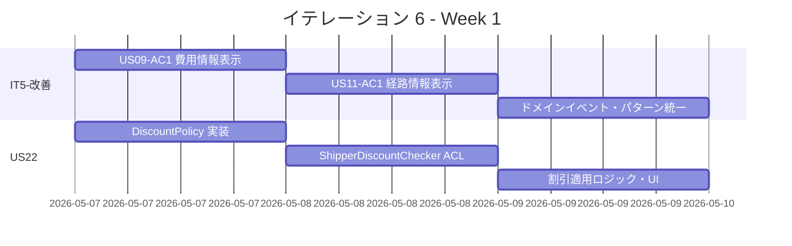
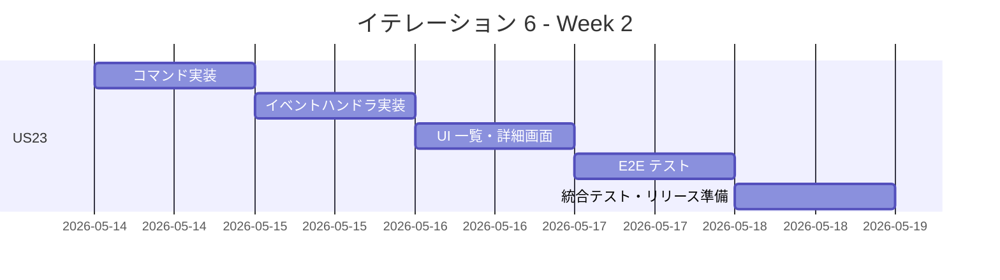
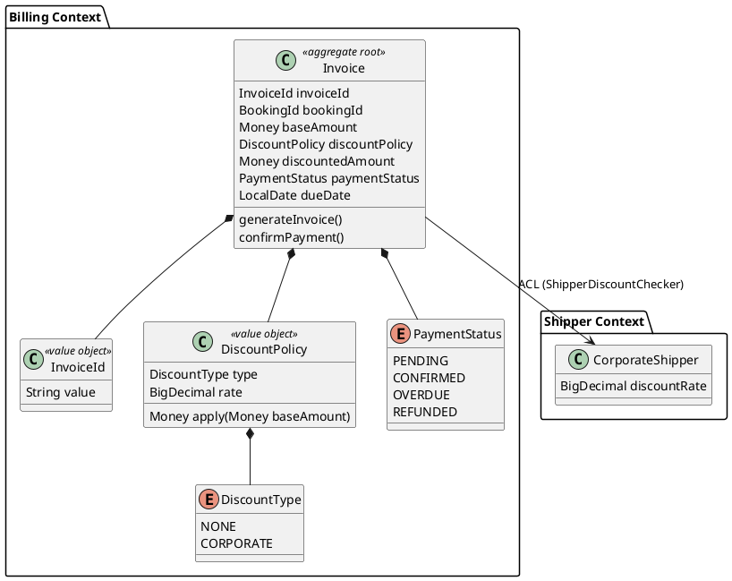
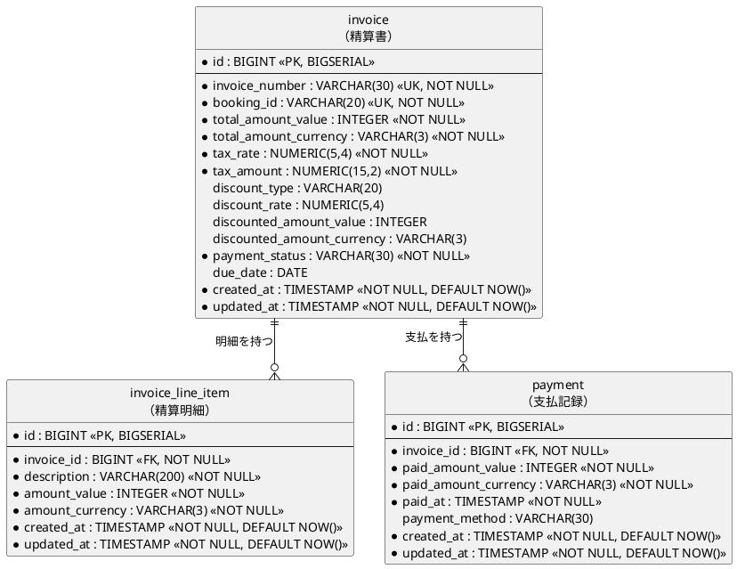
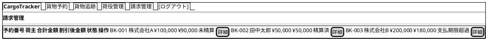
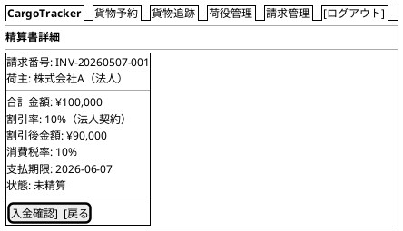
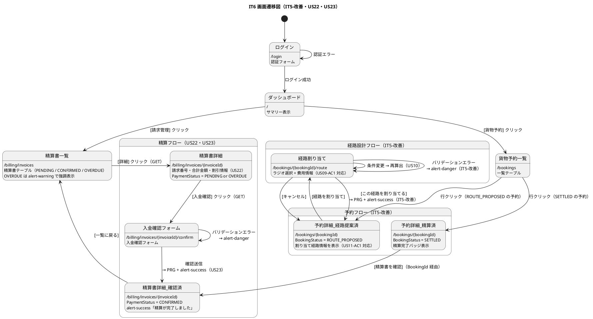

# イテレーション 6 計画

## 概要

| 項目 | 内容 |
|------|------|
| **イテレーション** | 6 |
| **期間** | Week 11-12（2026-05-07 〜 2026-05-20） |
| **ゴール** | IT5 レビュー高優先度対応と法人割引・精算処理を完成させ、プロジェクト全機能をリリース可能状態にする |
| **目標 SP** | 10 |

---

## ゴール

### イテレーション終了時の達成状態

1. **IT5 申し送り解消**: 受入条件未達（US09-AC1・US11-AC1）の充足、ドメインイベント発行の一貫性確保、コントローラパターン統一、テスト品質改善が完了している
2. **US22 完了**: 法人荷主の精算時に契約割引率が自動適用され、割引後金額が精算書に記載される
3. **US23 完了**: 確定輸送料金をもとに精算書を発行し、入金確認・精算完了処理が行える。6 イテレーション全機能の統合テストが完了している

### 成功基準

- [x] US09-AC1: 費用情報が経路一覧に表示される
- [x] US11-AC1: 予約詳細画面に割り当て済み経路情報が表示される
- [x] `assignItinerary` に `requireStatus(EnumSet)` パターンが適用され、状態ガードが統一されている
- [x] `assignItinerary` で `CargoRoutedEvent` が発行されている
- [x] `assignRoute` が `executeBookingCommand` パターンに統合されている
- [x] `BookingThymeleafControllerTest` のセットアップ重複が `createGeneralBooking()` ヘルパーに集約されている
- [x] `route.html` にフィードバックメッセージ表示領域が追加されている
- [ ] 法人荷主の精算時に割引率が自動取得・適用される
- [ ] 精算書（Invoice）が発行でき、請求番号・金額・支払い期限が表示される
- [ ] Java テスト全パス・E2E テスト全パス
- [ ] テストカバレッジ 80% 以上

---

## ユーザーストーリー

### 対象ストーリー

| ID | ユーザーストーリー | SP | 優先度 |
|----|-------------------|----|--------|
| IT5-改善 | IT5 申し送り高優先度対応（受入条件充足・ドメインイベント・パターン統一・テスト品質） | 3 | 必須 |
| US22 | 法人割引を適用する | 3 | 必須 |
| US23 | 精算を処理する | 4 | 必須 |
| **合計** | | **10** | |

### ストーリー詳細

#### IT5-改善: IT5 申し送り高優先度対応

**内容**:

1. US09-AC1: 費用情報を `VoyageQueryService` から取得して `route.html` に表示する（高 #1）
2. US11-AC1: 予約詳細画面（`show.html`）に割り当て済み経路情報セクションを追加する（高 #2）
3. `assignItinerary` に `requireStatus(EnumSet.of(...))` パターンを適用し、状態ガードを統一する（高 #3）
4. `assignItinerary` 完了時に `CargoRoutedEvent` を発行する（高 #4）
5. `routeDetail` の未使用 `bookingId` パスパラメータを削除する（高 #6）
6. `assignRoute` を `executeBookingCommand` パターンに統合する（高 #5）
7. `BookingThymeleafControllerTest` のセットアップを `@BeforeEach` に集約する（高 #7）
8. `route.html` に `alert-success`・`alert-danger` フィードバックメッセージ表示領域を追加する（高 #8）

#### US22: 法人割引を適用する

**ストーリー**:
> 経理担当者として、法人荷主の精算時に契約割引率を基本料金に自動適用して割引後の請求金額を確定したい。なぜなら、法人契約条件に基づく正確な割引を自動化し、手計算ミスを防ぐからだ。

**受入条件**:

1. 荷主種別が「法人」の場合、料金算出時に契約割引率が自動的に取得・表示される
2. 割引率（0〜30%）が基本料金に適用され、割引後の金額が表示される
3. 個人荷主の場合は割引が適用されない
4. 割引計算の根拠（割引率・基本料金・割引後料金）が精算書に記載される

#### US23: 精算を処理する

**ストーリー**:
> 経理担当者として、確定した輸送料金をもとに精算書を発行し、荷主への通知・入金確認・精算完了処理を行いたい。なぜなら、精算業務を一元管理し、入金状況を追跡して確実に精算を完了できるからだ。

**受入条件**:

1. 「確定」状態の輸送料金をもとに精算書（請求番号・請求金額・支払い期限）を発行できる
2. 精算書が荷主にメール通知される（UI 上の通知メッセージで代替可）
3. 入金確認後、精算状態が「精算済」に更新され予約状態も「精算済」になる
4. 精算管理一覧画面で全精算の状態（未精算・精算済・支払期限超過）を確認できる
5. 支払い期限超過時、経理担当者に未払い通知が送信される（UI 上のアラート表示で代替可）

### タスク

#### 1. IT5-改善（3 SP）

| # | タスク | 見積もり | 担当 | 状態 |
|---|--------|---------|------|------|
| 1.1 | US09-AC1: `VoyageQueryService` から費用情報を取得・`route.html` に表示（V11 `carrier_movement.base_fare_*` 追加、`Voyage.getTotalBaseFare()` 実装） | 2h | - | [x] |
| 1.2 | US11-AC1: `show.html` に割り当て済み経路情報セクションを追加 | 2h | - | [x] |
| 1.3 | `assignItinerary` に `requireStatus(EnumSet)` パターン適用 | 1h | - | [x] |
| 1.4 | `assignItinerary` で `CargoRoutedEvent` 発行（`CargoBookingCommandService` から発行） | 1h | - | [x] |
| 1.5 | `routeDetail` の未使用 `bookingId` パスパラメータを削除 | 0.5h | - | [x] |
| 1.6 | `assignRoute` を `executeBookingCommand` パターンに統合 | 1h | - | [x] |
| 1.7 | `BookingThymeleafControllerTest` セットアップを `createGeneralBooking()` ヘルパーに集約 | 1.5h | - | [x] |
| 1.8 | `route.html` にフィードバックメッセージ表示領域追加 | 1h | - | [x] |

**小計**: 10h（理想時間）

#### 2. US22: 法人割引を適用する（3 SP）

| # | タスク | 見積もり | 担当 | 状態 |
|---|--------|---------|------|------|
| 2.1 | Billing Context: `DiscountPolicy` ドメインモデル実装（`CorporateDiscountPolicy` record） | 2h | - | [ ] |
| 2.2 | Billing Context: `ShipperDiscountChecker` ACL ポート設計・実装（荷主コンテキストへの割引率照会） | 2h | - | [ ] |
| 2.3 | Billing Context: 法人割引適用ロジックを `Invoice` 集約に組み込む | 1.5h | - | [ ] |
| 2.4 | Billing Context: `InvoiceApplicationService` に割引適用サービスを追加 | 1h | - | [ ] |
| 2.5 | UI: 精算書詳細画面に割引情報（割引率・基本料金・割引後料金）を表示 | 1.5h | - | [ ] |
| 2.6 | テスト: 法人割引適用の単体テスト・統合テスト追加 | 2h | - | [ ] |

**小計**: 10h（理想時間）

#### 3. US23: 精算を処理する（4 SP）

| # | タスク | 見積もり | 担当 | 状態 |
|---|--------|---------|------|------|
| 3.1 | Billing Context: `Invoice` 集約ルート設計・実装（`InvoiceId`・`PaymentStatus`） | 2h | - | [ ] |
| 3.2 | Billing Context: `InvoiceRepository`・DB スキーマ（V10 マイグレーション）作成 | 1.5h | - | [ ] |
| 3.3 | Billing Context: `GenerateInvoiceCommand`・`ConfirmPaymentCommand` 実装 | 2h | - | [ ] |
| 3.4 | Billing Context: `CargoDeliveredEvent` を受け取り精算書を自動生成する `InvoiceEventHandler` 実装 | 1.5h | - | [ ] |
| 3.5 | Booking Context: 精算完了時に `BookingStatus` を `SETTLED` に遷移させるイベントハンドラ実装 | 1h | - | [ ] |
| 3.6 | UI: 精算管理一覧画面（`BillingThymeleafController`・`billing/invoices/index.html`）実装 | 2h | - | [ ] |
| 3.7 | UI: 精算書詳細・入金確認画面（`billing/invoices/show.html`・`billing/invoices/confirm.html`）実装 | 2h | - | [ ] |
| 3.8 | E2E テスト: 精算フロー全体（精算書発行→入金確認→精算完了）の Playwright テスト追加 | 2h | - | [ ] |
| 3.9 | 全体統合テスト・パフォーマンステスト・リリース準備 | 2h | - | [ ] |

**小計**: 16h（理想時間）

#### タスク合計

| カテゴリ | SP | 理想時間 | 状態 |
|---------|----|---------|------|
| IT5-改善（申し送り対応） | 3 | 10h | [x] |
| US22 法人割引を適用する | 3 | 10h | [ ] |
| US23 精算を処理する | 4 | 16h | [ ] |
| **合計** | **10** | **36h** | |

**1 SP あたり**: 約 3.6h
**進捗率**: 30% (3/10 SP)

---

## スケジュール

### Week 1（Day 1-5）



| 日 | タスク |
|----|--------|
| Day 1 | IT5-改善: US09-AC1 費用情報表示（1.1）、US22: DiscountPolicy 実装（2.1） |
| Day 2 | IT5-改善: US11-AC1 経路情報表示（1.2）、US22: ACL ポート設計（2.2） |
| Day 3 | IT5-改善: requireStatus パターン・CargoRoutedEvent・routeDetail 修正（1.3〜1.5）、US22: 割引適用ロジック（2.3） |
| Day 4 | IT5-改善: assignRoute パターン統合・セットアップ集約・フィードバック UI（1.6〜1.8）、US22: ApplicationService・UI（2.4〜2.5） |
| Day 5 | US22: テスト追加（2.6）、US23: Invoice 集約・DB スキーマ設計着手（3.1〜3.2） |

### Week 2（Day 6-10）



| 日 | タスク |
|----|--------|
| Day 6 | US23: GenerateInvoiceCommand・ConfirmPaymentCommand 実装（3.3） |
| Day 7 | US23: InvoiceEventHandler・BookingStatus SETTLED 遷移（3.4〜3.5） |
| Day 8 | US23: 精算管理一覧画面・コントローラ実装（3.6） |
| Day 9 | US23: 精算書詳細・入金確認画面（3.7）、E2E テスト追加（3.8） |
| Day 10 | 全体統合テスト・パフォーマンステスト・バグ修正・リリース準備・デモ準備（3.9） |

---

## 設計

### ドメインモデル（Billing Context）



### データモデル（追加テーブル）

> **注**: `data-model.md` の命名規約（単数形テーブル名・`BIGSERIAL` PK + 業務 UK・`INTEGER` 金額型 + 通貨 VARCHAR(3)）に準拠する。



### ユーザーインターフェース

#### 精算管理一覧画面（ナビバー形式は `ui_design.md` 共通レイアウトに準拠）



#### 精算書詳細・入金確認画面



### 画面遷移

> **注**: `ui_design.md` 画面遷移仕様に準拠。IT5 の経路割り当てフローから精算フローへ続く全体の流れを示す。



### API 設計

> **注**: `ui_design.md` の画面一覧規約に従い、精算関連 URL は `/billing/invoices` プレフィックスを使用する。

| メソッド | エンドポイント | 説明 |
|---------|---------------|------|
| GET | /billing/invoices | 精算管理一覧 |
| GET | /billing/invoices/{invoiceId} | 精算書詳細 |
| POST | /billing/invoices/{invoiceId}/confirm | 入金確認（PRG パターン） |

### データベーススキーマ（V10 マイグレーション）

> **注**: `data-model.md` の規約に従い、テーブル名は単数形・PK は `BIGSERIAL`・金額は `INTEGER` + 通貨 `VARCHAR(3)` ペアとする。

```sql
CREATE TABLE invoice (
    id BIGSERIAL PRIMARY KEY,
    invoice_number VARCHAR(30) NOT NULL UNIQUE,
    booking_id VARCHAR(20) NOT NULL UNIQUE,
    total_amount_value INTEGER NOT NULL,
    total_amount_currency VARCHAR(3) NOT NULL DEFAULT 'JPY',
    tax_rate NUMERIC(5,4) NOT NULL DEFAULT 0.10,
    tax_amount NUMERIC(15,2) NOT NULL,
    discount_type VARCHAR(20),
    discount_rate NUMERIC(5,4),
    discounted_amount_value INTEGER,
    discounted_amount_currency VARCHAR(3),
    payment_status VARCHAR(30) NOT NULL DEFAULT 'PENDING',
    due_date DATE,
    created_at TIMESTAMP NOT NULL DEFAULT NOW(),
    updated_at TIMESTAMP NOT NULL DEFAULT NOW()
);

CREATE TABLE invoice_line_item (
    id BIGSERIAL PRIMARY KEY,
    invoice_id BIGINT NOT NULL REFERENCES invoice(id),
    description VARCHAR(200) NOT NULL,
    amount_value INTEGER NOT NULL,
    amount_currency VARCHAR(3) NOT NULL DEFAULT 'JPY',
    created_at TIMESTAMP NOT NULL DEFAULT NOW(),
    updated_at TIMESTAMP NOT NULL DEFAULT NOW()
);

CREATE TABLE payment (
    id BIGSERIAL PRIMARY KEY,
    invoice_id BIGINT NOT NULL REFERENCES invoice(id),
    paid_amount_value INTEGER NOT NULL,
    paid_amount_currency VARCHAR(3) NOT NULL DEFAULT 'JPY',
    paid_at TIMESTAMP NOT NULL,
    payment_method VARCHAR(30),
    created_at TIMESTAMP NOT NULL DEFAULT NOW(),
    updated_at TIMESTAMP NOT NULL DEFAULT NOW()
);
```

### ADR

| ADR | タイトル | ステータス |
|-----|---------|-----------|
| 今後検討 | Billing Context の ACL 設計（ShipperDiscountChecker） | 提案 |

---

## リスクと対策

| リスク | 影響度 | 対策 |
|--------|--------|------|
| Billing Context 新規実装で IT5-改善と並行進行による工数増大 | 中 | Day 1-4 で IT5-改善を先行完了し、Day 5 以降を US22・US23 に集中する |
| US23 の精算フローが要件より複雑になる | 中 | メール通知は UI 通知メッセージで代替、外部決済連携はスタブで実装する |
| 全体統合テスト（6 イテレーション分）でのデグレード発見 | 高 | Day 10 に統合テスト・バグ修正時間を確保し、既存テスト 250 件がすべてパスすることを前提とする |

---

## 完了条件

### Definition of Done

- [ ] コードレビュー完了（`developing-review` 実施）
- [ ] Java ユニット・統合テストが全パス
- [ ] Playwright E2E テストが全パス
- [ ] SonarQube Quality Gate PASS
- [ ] テストカバレッジ 80% 以上
- [ ] 機能がローカル環境で動作確認済み
- [ ] ドキュメント更新完了（`release_plan.md`・`docs/index.md`・`mkdocs.yml`）

### デモ項目

1. 経路一覧に費用情報が表示され、予約詳細画面に割り当て済み経路情報が確認できる（IT5 申し送り解消）
2. 法人荷主の精算書に割引率と割引後料金が自動適用されて表示される（US22）
3. 精算書の発行から入金確認・精算完了までのフルフローが動作する（US23）

---

## 更新履歴

| 日付 | 更新内容 | 更新者 |
|------|---------|--------|
| 2026-04-10 | 初版作成 | - |
| 2026-04-10 | IT5-改善 8 タスク完了を反映（3 SP 完了・進捗率 30%）。`6a99417 feat(routing): IT5 改善・基本運賃情報を経路割り当て画面に表示` で 1.1〜1.8 をまとめて実装 | - |

---

## 関連ドキュメント

- [イテレーション 5 ふりかえり](./retrospective-5.md)
- [イテレーション 5 完了報告書](./iteration_report-5.md)
