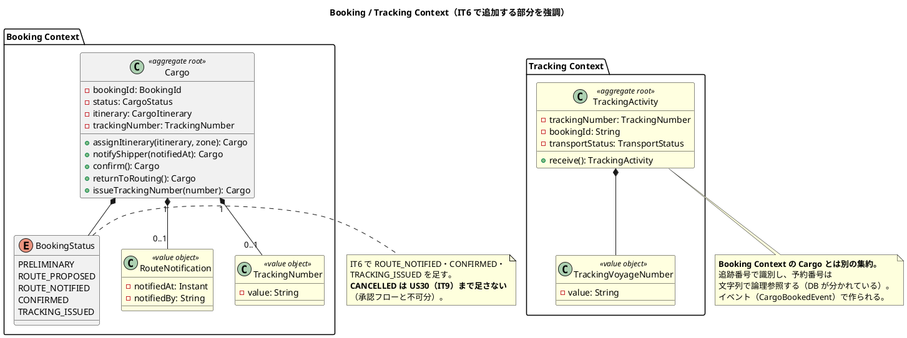
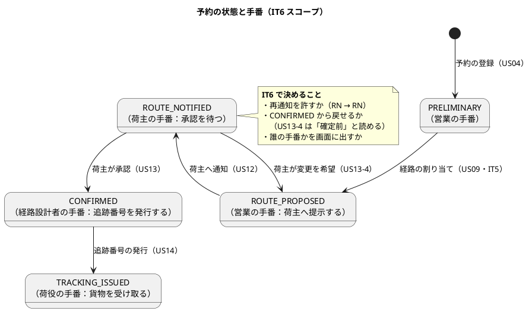
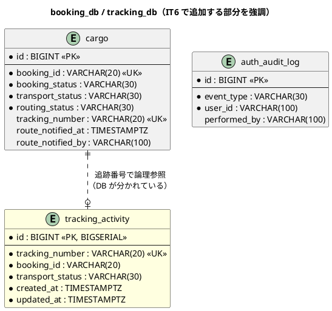
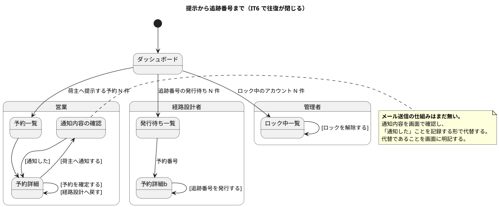

# イテレーション 6 計画

| 項目 | 内容 |
| :--- | :--- |
| イテレーション | IT6 |
| 期間 | 2026-08-22 〜 2026-09-04（2 週間） |
| 対象ストーリー | US12（経路の通知）・US13（予約確定）・US14（追跡番号発行）・US32（ロック解除） |
| 計画 SP | 9 |
| 局面 | **中盤（4 本目）／インサイドアウト**（[開発戦略](development_strategy.md#中盤-インサイドアウトit3it7--release-0210-前半)） |
| 前提 | [IT5 完了報告書](iteration_report-5.md)・[IT5 ふりかえり](retrospective-5.md) |

## ゴール

**荷主に経路を提示してから追跡番号を渡すまでを閉じる。** 経路が決まった予約を荷主へ提示し、合意を得て確定し、追跡番号を発行して荷主が自分で追える状態にする。あわせて**サービス間の非同期連携（イベント）を初めて通す**。

### 成功基準

| # | 基準 | 測り方 |
| :--- | :--- | :--- |
| 1 | **提示から追跡番号までが閉じる** | kind 統合環境で、経路提案中 → 通知 → 確定 → 追跡番号発行 → 荷主が追跡番号で照会、までを 1 本通す |
| 2 | **イベントが実際に相手へ届く** | bookingms が発行したイベントを trackingms が受け取り、**追跡の記録が残る**ことを、実 RabbitMQ（Testcontainers）で確かめる |
| 3 | **受け取れなかったイベントが消えない** | 相手が落ちている / 処理に失敗したイベントの行き先を決め、**その経路を実際に通す** |
| 4 | 荷主が変更・キャンセルを希望したときに戻せる | 確定前の予約を経路設計へ戻せる（US13 受入基準）。**戻したことが経路設計者に見える** |
| 5 | 管理者がロックを解除でき、監査に残る | 解除直後にログインできること・解除操作が監査ログに残ることを固定する |

## 局面とアプローチ

**中盤（インサイドアウト）**。[開発戦略](development_strategy.md)が「サービス間結合の型（US09 で REST 契約・**US14 でイベント契約**）もドメインの出力ポートから外へ向かって確立する」と定めている。

IT5 で REST 契約を確立したのと同じ形を、イベントで行う。**IT5 で作った ACL の型がイベント契約の下敷きになる。**

## 前イテレーションからの反映

### ふりかえりの Try（[retrospective-5.md](retrospective-5.md)）

| Try | 本 IT での落とし込み |
| :--- | :--- |
| 1. サービス間の接続先は、実際に 1 往復する検査を必ず対にする | **成功基準 2 に据えた**。イベントは Testcontainers の実 RabbitMQ で通す。タスク 2.3・5.1 |
| 2. E2E の「条件が揃わなければスキップ」を禁じる | タスク 5.2 の DoD。前提が要るなら前提を作ってから通す |
| 3. 同じ規則を 2 か所に書かない検査を、規則を足すときに同時に作る | タスク 1.2（`Cargo#confirm` の可否判定）と 3.2（追跡番号の採番）で、**入口が集約の述語を呼んでいることを検査で固定する** |
| 4. モックを足す変更では、本物の該当箇所を開いて条件を読み比べる | タスク 4.4 の手順に明記。コミットメッセージに 1 行残す |
| 5. API のレスポンス型はフロントとサーバを機械的に突き合わせる | タスク 0.3（契約テストの名簿をリフレクション化） |
| 6. DoD に「前 IT で『まだできません』と書いた箇所の棚卸し」を入れる | **DoD に追加**。`grep -rn "準備中\|まだ働く場面\|次のリリース\|IT[0-9] は.*まで"` |
| 7. ユースケースを足したら、その場で直接のテストを書く | 各タスクの完了条件。Controller のモック経由で済ませない |
| 8. 状態を足したら「次に何ができるか」を役割ごとに書き出してから実装する | タスク 1.1（状態遷移の設計）で、状態遷移図に**誰の手番か**を書く |

### 引き継ぎ（返済枠・SP 対象外）

| # | タスク | 見積 | 状態 |
| :--- | :--- | :--- | :--- |
| 0.1 | **kind 統合環境で IT5 の往復を 1 本通す**（IT5 成功基準 1 の残り）。**接続先の欠陥が実環境でだけ出た経緯があるため、最初に行う** | 4h | [ ] |
| 0.2 | **目的地が東京以外の予約で期限の判定を通す**（BC 間のタイムゾーン食い違いを直したが実環境で未確認） | 2h | [ ] |
| 0.3 | **契約テストの項目名簿を DTO のコンポーネント名から導く**（手書きの名簿はコンシューマ側が項目を足しても赤にならない。Try 5） | 3h | [ ] |
| 0.4 | **再検証失敗専用の例外型を作り 409 の射程を絞る**（いまは `IllegalStateException` が「再検証の失敗」と「地点マスタの不備」の両方を運ぶ） | 2h | [ ] |
| 0.5 | 地点マスタの N+1（確定 1 回あたり候補数 × 区間数 × 2 回） | 2h | [ ] |
| 0.6 | **`noEventPublishingRule` を外す**（ADR-019 決定 3。**イベント発行を足すタスク 2.2 と同じ変更で行う**。別々にすると、発行を足した瞬間に理由の分からない赤になる） | 1h | [ ] |
| 0.7 | **経路の差し替えを営業が気づく手段**（IT5 で `[経路を見直す]` を作ったが、差し替えたことが営業に伝わらない。US12 と同じ IT で扱うと決めた） | 3h | [ ] |
| **小計** | | **17h** | |

> **0.6 を「余力次第」にしません。** [ADR-008 が 3 IT 連続で繰越された](retrospective-4.md)反省から、返済枠は独立したタスクとして先に置きます。

## 対象ストーリーと受入基準

### US12: 確定経路を荷主に通知する（2 SP）

| # | 受入基準 | 扱い | タスク |
| :--- | :--- | :--- | :--- |
| US12-1 | 予約番号を指定して紐付けられた経路情報を確認できる | **IT5 で達成済み**（予約詳細の旅程） | — |
| US12-2 | 通知内容（経由港・所要日数・到着予定日・料金概算）を確認できる | スコープ内 | 4.1 |
| US12-3 | 荷主への経路通知を送信できる | スコープ内（**メール基盤は無い**。下記の注を参照） | 1.3・4.1 |
| US12-4 | 通知送信記録が登録される | スコープ内 | 1.3・2.1 |

> **メール送信の仕組みはまだありません。** US06（引き渡し）・US10（条件協議）と同じく、**送ったことを状態と記録として残し、荷主側の画面で見える形**で代替します。「通知した」という業務上の事実は記録し、実際の送信手段は US19（通知基盤）で足します。**代替であることを画面とマニュアルに明記します。**

### US13: 予約を確定する（3 SP）

| # | 受入基準 | 扱い | タスク |
| :--- | :--- | :--- | :--- |
| US13-1 | 予約番号を指定して予約内容と選択ルートを確認できる | **IT5 で達成済み** | — |
| US13-2 | 確定操作で予約状態が「予約確定」に更新される | スコープ内 | 1.2・4.2 |
| US13-3 | 経路設計者に追跡番号発行依頼の通知が送信される | スコープ内（画面上の気づく手段で代替） | 3.3・4.3 |
| US13-4 | ルート変更希望時に「経路設計中」へ戻せる | スコープ内 | 1.2・4.2 |
| US13-5 | キャンセル希望時にキャンセル状態へ変更できる | **スコープ外**（UC22 の承認フローと不可分。US30・IT9） | — |
| US13-6 | キャンセル時に確認通知を送信 | **スコープ外**（同上） | — |

> **US13-5・US13-6 を落とす理由**: 輸送開始前と輸送中でキャンセルの扱いが違い（[ui_design.md](../design/ui_design.md) の予約詳細）、承認フロー・陸揚げ地・キャンセル料が絡みます。ここだけ先に作ると、US30（IT9）で作り直しになります。**落としたことを完了報告書に明記します。**

### US14: 追跡番号を発行する（3 SP）

| # | 受入基準 | 扱い | タスク |
| :--- | :--- | :--- | :--- |
| US14-1 | 「予約確定」状態の予約に追跡番号を発行できる | スコープ内 | 1.4・3.1・4.3 |
| US14-2 | 追跡番号は一意に採番される | スコープ内（**DB シーケンス**。[ADR-011](../adr/011-booking-id-numbering.md) と同じ形） | 3.1 |
| US14-3 | 発行後、貨物状態が「受領待ち」に設定される | スコープ内 | 1.4・2.2 |
| US14-4 | 荷主に追跡番号と追跡方法をメール通知 | スコープ内（画面上の手段で代替。US12 と同じ） | 4.3 |

### US32: ロックされたアカウントを管理者が解除する（1 SP）

| # | 受入基準 | 扱い | タスク |
| :--- | :--- | :--- | :--- |
| US32-1 | 管理者がロック中のアカウント一覧を確認できる | スコープ内 | 6.1・6.2 |
| US32-2 | 解除でき、解除直後からログインできる | スコープ内 | 6.1・6.3 |
| US32-3 | 解除操作が監査ログに記録される | スコープ内 | 6.1 |
| US32-4 | 管理者以外は 403 | スコープ内 | 6.2 |

## 設計

### ドメインモデル図（IT6 スコープ）

> **`RouteNotification` を値オブジェクトにする理由**: 「いつ・誰が通知したか」で 1 組の意味を持ちます。通知が複数回起こりうるか（再通知）は 1.3 で決めます。

### 状態遷移図（IT6 スコープ・**誰の手番か**を明記）

> **`RoutingStatus` は動かしません。** 経路は IT5 で `ROUTED` になっており、US12〜US14 は予約のライフサイクル側の話です。2 つの状態を同じ操作で動かすのは、[ADR-020](../adr/020-itinerary-assignment-transitions.md) 決定 2 が「関心が違うものを 1 つで兼ねない」と決めた形に反します。

### ER 図（IT6 スコープ）

> **`tracking_number` は `cargo` にも `tracking_activity` にも持ちます。** 前者は「この予約に発行した番号」、後者は「この追跡の識別子」です。**DB が分かれているため FK は張れません**（[ADR-002](../adr/002-microservices-split.md)）。**採番は bookingms 側の DB シーケンス**で行い（[ADR-011](../adr/011-booking-id-numbering.md) と同じ形）、イベントで trackingms へ渡します。
>
> **`auth_audit_log` に `performed_by` を足すか**を 6.1 で決めます。いまは「誰のアカウントか」しか持たず、「誰が解除したか」が残りません（US32-3）。

### 画面遷移図（IT6 スコープ）

## タスク

### 0. 返済枠（SP 対象外・17h）

上記「引き継ぎ」の表を参照。**Day 1-2 に独立して着手します。**

### 1. Phase 1: ドメイン（3 SP 相当・20h）

| # | タスク | 見積 | 状態 |
| :--- | :--- | :--- | :--- |
| 1.1 | **状態遷移を決めて ADR-021 に落とす**。決定は 5 つ: ①`ROUTE_NOTIFIED` を足すか（通知を状態にするか記録だけにするか）②再通知を許すか ③`CONFIRMED` から戻せるか（US13-4 の射程）④`CANCELLED` は US30 まで足さない ⑤**誰の手番か**を状態ごとに定める（Try 8）。**決定の数だけ検査を用意する** | 5h | [ ] |
| 1.2 | `Cargo#notifyShipper` / `#confirm` / `#returnToRouting` を単体テストで構築。**壊して赤を確認する** | 5h | [ ] |
| 1.3 | `RouteNotification` 値オブジェクト。「いつ・誰が」で 1 組。**通知の記録が残らないと US12-4 を満たさない** | 3h | [ ] |
| 1.4 | `TrackingNumber` 値オブジェクトと `Cargo#issueTrackingNumber`。**採番は永続化の経路で行う**（集約で組み立てるとシーケンスと衝突する。[ADR-011](../adr/011-booking-id-numbering.md) の先例） | 4h | [ ] |
| 1.5 | **`Cargo` が肥大化していないか確認する**。IT6 で状態遷移が 4 つ増える。[ADR-012](../adr/012-value-object-granularity.md) の基準で分割の要否を判断し、**分けないなら理由を残す** | 3h | [ ] |
| **小計** | | **20h** | |

### 2. Phase 2: イベント基盤（2 SP 相当・16h）

| # | タスク | 見積 | 状態 |
| :--- | :--- | :--- | :--- |
| 2.1 | **イベント契約を決めて ADR-022 に落とす**。決定は 4 つ: ①ペイロードに何を載せるか（IDのみか内容もか）②スキーマの後方互換の方針 ③**受け取れなかったイベントの行き先**（DLQ・再試行回数）④順序保証を前提にするか。**IT5 の REST 契約（ADR-019）と同じ形で、コンシューマ・プロバイダの両側に検査を置く** | 5h | [ ] |
| 2.2 | `CargoBookedEvent` の発行（bookingms）。**`noEventPublishingRule` を同じ変更で外す**（0.6） | 4h | [ ] |
| 2.3 | trackingms が購読し `TrackingActivity` を作る。**実 RabbitMQ（Testcontainers）で 1 往復させる**（成功基準 2・Try 1） | 5h | [ ] |
| 2.4 | **受け取れなかったイベントの経路を実際に通す**（成功基準 3）。相手を落とす / 例外を投げる形で確かめる | 2h | [ ] |
| **小計** | | **16h** | |

### 3. Phase 3: 永続化と API（2 SP 相当・14h）

| # | タスク | 見積 | 状態 |
| :--- | :--- | :--- | :--- |
| 3.1 | `cargo` に `tracking_number` / `route_notified_at` / `route_notified_by` を追加（V6）。**追跡番号のシーケンス**。方言スモークを通す | 4h | [ ] |
| 3.2 | `tracking_activity` テーブル（trackingms・V2）。**trackingms は IT6 が初実装**。Flyway・MyBatis・ヘキサゴナルの型を bookingms に揃える | 4h | [ ] |
| 3.3 | API: `POST /{bookingId}/route-notification`・`PUT /{bookingId}/confirm`・`POST /{bookingId}/tracking-number`・`PUT /{bookingId}/return-to-routing`。**認可を入力の検査より先に置く**（[ADR-016](../adr/016-authorize-before-validate.md)）。**入口が集約の述語を呼んでいることを検査で固定する**（Try 3） | 6h | [ ] |
| **小計** | | **14h** | |

### 4. Phase 4: 画面（2 SP 相当・16h）

| # | タスク | 見積 | 状態 |
| :--- | :--- | :--- | :--- |
| 4.1 | **`ui_design.md` に通知・確定・発行の画面詳細設計を書く。書いてから実装する**（IT5 の 4.1 と同じ順序） | 3h | [ ] |
| 4.2 | 予約詳細に「荷主へ通知する」「予約を確定する」「経路設計へ戻す」。**状態で出し分ける**。**メール送信の代替であることを画面に明記** | 5h | [ ] |
| 4.3 | 追跡番号の発行と、経路設計者の「発行待ち」の気づき。**件数から対象へ行けること**（IT5 と同じ形） | 4h | [ ] |
| 4.4 | **モックを本物と読み比べて足す**（Try 4）。差分をコミットメッセージに 1 行残す | 2h | [ ] |
| 4.5 | 0.7（経路の差し替えを営業が気づく手段）を US12 の画面に統合する | 2h | [ ] |
| **小計** | | **16h** | |

### 5. Phase 5: 結合の検査（10h）

| # | タスク | 見積 | 状態 |
| :--- | :--- | :--- | :--- |
| 5.1 | **kind 統合環境で成功基準 1 を通す**（提示 → 確定 → 発行 → 荷主の照会）。**イベントが実際に届くことまで**（Try 1） | 5h | [ ] |
| 5.2 | E2E：提示から発行まで。**「条件が揃わなければスキップ」を書かない**（Try 2）。前提が要るなら前提を作る | 5h | [ ] |
| **小計** | | **10h** | |

### 6. US32: ロック解除（1 SP 相当・8h）

| # | タスク | 見積 | 状態 |
| :--- | :--- | :--- | :--- |
| 6.1 | `User#unlock` と監査記録。**`auth_audit_log` に「誰が解除したか」を残せるか確認し、無ければ足す**（US32-3） | 3h | [ ] |
| 6.2 | API と画面（ロック中一覧・解除）。**管理者以外は 403**（US32-4） | 3h | [ ] |
| 6.3 | **解除直後にログインできることを実 DB で通す**（US32-2）。ロック → 解除 → ログイン成功、を 1 本で | 2h | [ ] |
| **小計** | | **8h** | |

### 7. ユーザーマニュアル（SP 対象外・10h）

画面を伴う IT なので、計画段階で枠を取ります。

| # | タスク | 見積 | 状態 |
| :--- | :--- | :--- | :--- |
| 7.1 | `04-貨物予約.md` に通知・確定・経路設計へ戻すを追加。**メール送信の代替であることを明記** | 4h | [ ] |
| 7.2 | 追跡番号の発行（経路設計者）と、荷主向けの追跡方法の案内を追加。管理者向けにロック解除の章を追加 | 3h | [ ] |
| 7.3 | キャプチャを再生成し `manual:build` で目視。**画面に出るメッセージを機械的に洗い出して表に足す** | 3h | [ ] |
| **小計** | | **10h** | |

### 8. レビュー手直しの枠（SP 対象外・12h）

| # | タスク | 見積 | 状態 |
| :--- | :--- | :--- | :--- |
| 8.1 | **クローズのレビューで出る高優先度の手直し**。IT3 は 11 件、IT4 は 14 件、IT5 は 12 件。**3 IT 続けて 12 件前後で安定しているため、同じ枠を取る**。ただし IT5 のふりかえりが示したとおり、**減らすべきは量ではなく「全テスト緑のまま業務が成り立たない」形の質**である | 12h | [ ] |
| **小計** | | **12h** | |

### 見積もり合計

| 区分 | 見積 |
| :--- | :--- |
| 0. 返済枠 | 17h |
| 1. Phase 1 ドメイン | 20h |
| 2. Phase 2 イベント基盤 | 16h |
| 3. Phase 3 永続化と API | 14h |
| 4. Phase 4 画面 | 16h |
| 5. Phase 5 結合の検査 | 10h |
| 6. US32 | 8h |
| 7. マニュアル | 10h |
| 8. レビュー手直し | 12h |
| **合計** | **123h** |

> **IT5 は 146h の見積もりで 8 SP を達成しました。** IT6 は 123h で 9 SP です。**イベント基盤という初物**があるぶん不確実性が高いので、落とし代を先に決めます。
>
> 落とし代は **4.5 → 0.5 → 0.7** の順です。**Phase 2（イベント基盤）と 5.1（kind での往復）は削りません。** イベントは IT7（荷役）でも使うため、ここで通しておかないと同じ不確実性を持ち越します。

## スケジュール

### Week 1（Day 1-5）

| 日 | 内容 | 区分 |
| :--- | :--- | :--- |
| Day 1 | **0.1 kind で IT5 の往復を通す**、0.2 期限の判定、0.6 検査を外す準備 | 返済枠 |
| Day 2 | 0.3 契約テストの名簿、0.4 例外型、0.5 N+1、0.7 差し替えの気づき | 返済枠 |
| Day 3 | 1.1 ADR-021（状態遷移） | Phase 1 |
| Day 4 | 1.2 集約の遷移、1.3 `RouteNotification` | Phase 1 |
| Day 5 | 1.4 `TrackingNumber`、1.5 `Cargo` の肥大化確認 | Phase 1 |

### Week 2（Day 6-10）

| 日 | 内容 | 区分 |
| :--- | :--- | :--- |
| Day 6 | 2.1 ADR-022（イベント契約）、2.2 発行 | Phase 2 |
| Day 7 | 2.3 購読と往復、2.4 受け取れなかったイベント | Phase 2 |
| Day 8 | 3.1 / 3.2 永続化、3.3 API | Phase 3 |
| Day 9 | 4.1 設計 → 4.2 / 4.3 画面、6.1-6.3 US32 | Phase 4・US32 |
| Day 10 | 4.4 / 4.5、5.1 kind、5.2 E2E、7.1-7.3 マニュアル、クローズ準備 | 仕上げ |

## リスク

| # | リスク | 影響 | 対応 |
| :--- | :--- | :--- | :--- |
| 1 | **イベント基盤が初物で、見積もりが外れる** | Phase 2 が膨らみ Phase 4・5 を圧迫 | Day 6-7 に固めて置き、Day 7 終了時に進捗を確認する。遅れたら 4.5 → 0.5 → 0.7 の順に落とす |
| 2 | **trackingms が初実装** | ヘキサゴナルの型・Flyway・MyBatis の配線をゼロから作る | bookingms の形をそのまま写す。**新しい型を発明しない** |
| 3 | **メール送信の仕組みが無い** | US12-3・US13-3・US14-4 が「代替」になる | 代替であることを画面・マニュアル・完了報告書に明記する。US19（通知基盤）で置き換える |
| 4 | **`Cargo` の肥大化** | 状態遷移が 4 つ増え、集約が読みにくくなる | 1.5 で明示的に判断し、分けないなら理由を残す |
| 5 | US13-5・US13-6（キャンセル）を落とす | US13 の受入基準が部分達成 | **完了報告書に明記**。US30（IT9）で扱う |

## 設計への反映が必要な箇所（注）

| # | 内容 | 反映先 | タスク |
| :--- | :--- | :--- | :--- |
| 1 | `BookingStatus` に `ROUTE_NOTIFIED` を足すか（設計は `PRELIMINARY → ROUTE_PROPOSED → CONFIRMED` で通知の状態を持たない） | `domain-model.md`・ADR-021 | 1.1 |
| 2 | `RouteNotification` / `TrackingNumber` が Booking Context の要素表に無い | `domain-model.md` の要素表 | 1.3・1.4 |
| 3 | `TrackingActivity` が Tracking Context の要素表にあるが、**実装が無い**（trackingms は config のみ） | `architecture_backend.md` のパッケージツリー | 3.2 |
| 4 | `auth_audit_log` に「誰が操作したか」の列が無い（US32-3 を満たせない） | `data-model.md` | 6.1 |
| 5 | イベントのペイロード定義が `architecture_backend.md` の一覧にあるが、**項目まで決まっていない** | `architecture_backend.md`・ADR-022 | 2.1 |
| 6 | `tracking_db` の `tracking_activity` に Flyway 構成の記載が無い | `data-model.md` の Flyway 構成 | 3.2 |

## DoD（完了の定義）

- [ ] 対象ストーリーの受入基準を満たす（**スコープ外にしたものは理由とともに完了報告書へ**）
- [ ] 成功基準 1〜5 を満たす
- [ ] 全テストが緑（単体・統合・契約・E2E）。**CI の 5 ジョブすべて success**
- [ ] SonarQube Quality Gate が PASS（新規違反 0・Bug 0・Vulnerability 0・重複 3% 未満）
- [ ] **決定の数だけ検査がある**（ADR-021 の 5 決定・ADR-022 の 4 決定）
- [ ] **壊して赤を確認した**（少なくとも各 ADR の決定ごとに 1 回）
- [ ] **サービス間の呼び出しを実際に 1 往復させた**（Try 1）
- [ ] **E2E に「条件が揃わなければスキップ」が無い**（Try 2）
- [ ] **モックを足した変更で、本物の該当箇所と読み比べた**（Try 4。コミットメッセージに 1 行）
- [ ] **前 IT で「まだできません」と書いた箇所を棚卸しした**（Try 6。`grep -rn "準備中\|まだ働く場面\|次のリリース\|IT[0-9] は.*まで"`）
- [ ] ユーザーマニュアルを更新し、**キャプチャを再生成して `manual:build` で目視した**
- [ ] `docs/index.md` / `development/index.md` / `mkdocs.yml` を同期した
