# イテレーション 6 計画

## 概要

| 項目 | 内容 |
|------|------|
| **イテレーション** | 6 |
| **期間** | 2026-09-14 〜 2026-09-27 (2 週間、計画上。実運用は 2026-07-02 以降) |
| **ゴール** | Release 1.0 MVP を達成する。本体 2 ストーリー (US21 輸送料金算出 / US26 荷受人引取通知) を実装しつつ、IT5 マルチパースペクティブレビュー由来の技術的負債 3 件 (認可・SEC-04・Tx 境界) を冒頭で完済し、追跡・荷役・料金・引取通知の一連業務フローを結合させる。 |
| **目標 SP** | 18 (本体 5 + IT5 繰越高優先 8 + 中優先/プロセス 3 + 上流補完 2) |
| **実績 SP** | **30+ SP (達成率 167%)** — 2026-07-02 Ralph Loop 37 反復消化 |
| **状態** | **完了** (詳細は [iteration_report-6.md](./iteration_report-6.md) / [retrospective-6.md](./retrospective-6.md) を参照) |
| **繰越** | 3 タスク: task 1.2 (AuthProtect 適用範囲 → IT7 T6-09) / task 5.5 (katip 正式化 T5-18 → IT7) / task 7.2 (v1.0.0-mvp git tag → IT7 T6-03) |
| **ベロシティ基準** | 平均 19.75 SP (IT1: 20 / IT2: 22 / IT3: 22 / IT4: 19、IT5: 40+ は Ralph+手動集中の例外値のため参考外) |
| **設計** | 詳細設計は `docs/design/` を参照し本ドキュメントには含めない (T5-17)。追加で domain-model.md / data-model.md / ui_design.md に Pricing/Notification を追記済 (T6-04) |

---

## ゴール

### イテレーション終了時の達成状態

1. **Release 1.0 MVP 到達**: 予約 → 経路確定 → 追跡番号発行 → 荷役登録 → 料金算出 → 引取通知 → 引取確認の一連業務が localhost + Postgres で通しで動作する
2. **技術的負債 3 件完済**: AuthProtect middleware (T5-01) / ConfirmationCode bcrypt 化 (T5-02, SEC-04) / verifyAndConsume + saveHandlingActivity の Tx 境界統合 (T5-03) を IT6 冒頭 (Week 1) で完了
3. **状態反映と配信**: Handling 集約から Tracking 集約への状態反映 (Claim → TsClaimed、T5-04) と ConfirmationCode 配信手段 (T5-05) を実装
4. **テスト・観測性・ドキュメント補強**: hspec-wai Tracking BC テスト追加 (T5-08)、POST /login Cookie 発行テスト (T5-10)、katip 正式化 (T5-18)、README 環境変数早見表 (T5-19)

### 成功基準

- [ ] US21 / US26 の全受入基準を満たし GitHub Issue Close (IT7 冒頭 T6-03 併せて実施)
- [x] T5-01〜T5-05 (高優先技術的負債 5 件) が完了
- [ ] Playwright E2E 「予約→追跡→引取」ハッピーパス 1 本追加が緑 (IT7 冒頭 T6-01)
- [x] hspec-wai 統合テスト Tracking BC 5-6 本追加が緑
- [x] ArchUnit / arch-check Rule 4 違反 0 件を維持
- [x] テストカバレッジ (HPC) 75% ゲート維持
- [ ] Release 1.0 MVP タグ (v1.0.0-mvp) を作成 (IT7 冒頭 T6-03)
- [x] CHANGELOG `[Unreleased]` を Release 1.0 として整理 (T5-20)

---

## ユーザーストーリー

### 対象ストーリー

| ID | ユーザーストーリー | SP | 優先度 |
|----|-------------------|----|----|
| US21 | 輸送料金算出 (通貨・為替対応) | 3 | 必須 |
| US26 | 荷受人引取通知 (メール/SMS 暫定) | 2 | 必須 |
| **本体合計** | | **5** | |

### IT5 繰越 (高優先 T5-01〜T5-10、8 SP)

| ID | タスク | SP | 優先度 |
|----|-------|----|-------|
| T5-01 | AuthProtect middleware (Cookie → Session → AuthenticatedUser) | 2 | 必須 |
| T5-02 | ConfirmationCode の bcrypt 化 + 定数時間比較 (SEC-04) | 1 | 必須 |
| T5-03 | verifyAndConsume + saveHandlingActivity の Tx 境界統合 (ADR-0012 起票) | 2 | 必須 |
| T5-04 | Handling → Tracking 状態反映 (Claim → TsClaimed) | 1 | 必須 |
| T5-05 | 確認コード配信 (US26) 暫定策 (ログ出力 + 印刷用ビュー) | 1 | 中 |
| T5-08 | Tracking BC Application Command テスト 5-6 本追加 | 0.5 | 中 |
| T5-09 | BookingPageApiSpec の副作用検証強化 (IORef で updateBooking 捕捉) | 0.25 | 低 |
| T5-10 | POST /login → Session Cookie 発行の hspec-wai 統合テスト | 0.25 | 中 |

### 中優先・プロセス品質 (3 SP)

| ID | タスク | SP |
|----|-------|----|
| T5-11 | ConfirmationCode 期限切れ (TTL) 境界テスト追加 | 0.5 |
| T5-12 | hspec-wai の日本語 body assertion 統一 ([[feedback_hspec-wai-japanese-assertions]] 準拠) | 0.5 |
| T5-14 | ADR-0012 (Tx 境界 / Handling → Tracking 状態反映 / Domain 参照ポリシー) 起票 | 0.5 |
| T5-16 | IT 開始時 checklist に `dbmate status` 確認を追加 | 0.25 |
| T5-18 | katip 正式化 (自作 JSON Lines から移行) | 0.75 |
| T5-19 | README 環境変数・Cookie 早見表節を追加 | 0.25 |
| T5-20 | CHANGELOG `[Unreleased]` を Release 1.0 として整理 | 0.25 |

### 上流補完 (2 SP)

- domain-model.md / data-model.md / ui_design.md に US21 (Cost/CurrencyRate/Discount) / US26 (Notification) 追記
- ADR-0012 (Tx 境界) 昇格または起票
- Issue #277 (IT5 上流補完) 相当タスクの IT6 版

---

## タスク

### 1. 技術的負債完済 (Week 1 前半、T5-01〜T5-03、5 SP)

| # | タスク | 見積 | 状態 |
|---|-------|------|------|
| 1.1 | AuthProtect middleware 実装 (Servant AuthHandler + Session 検証) | 4h | [x] |
| 1.2 | AuthProtect 適用範囲 (Booking/Handling/Tracking/Claim ページ) 設定 | 2h | [ ] (IT7 T6-09 繰越、middleware 実装は完了、各ページへの適用は次期) |
| 1.3 | ConfirmationCode の bcrypt hash 化 (VO 内部化) + verifyAndConsume 定数時間比較 | 3h | [x] |
| 1.4 | ConfirmationCode migration (plain → hash カラム移行) | 2h | [x] |
| 1.5 | verifyAndConsume + saveHandlingActivity の Tx 境界統合 (単一 Transaction) | 3h | [x] |
| 1.6 | ADR-0012 (Tx 境界ポリシー) 起票 | 1h | [x] |
| 1.7 | 各項目の hspec-wai 統合テスト (認可 403 / bcrypt 検証 / Tx ロールバック) | 3h | [x] |

### 2. Handling → Tracking 状態反映と配信 (Week 1 後半、T5-04/05、2 SP)

| # | タスク | 見積 | 状態 |
|---|-------|------|------|
| 2.1 | HandlingActivity 記録時に TrackingActivity ステータス遷移 (Claim → TsClaimed) を Cross-BC helper で連鎖 | 3h | [x] |
| 2.2 | 遷移テスト 3 本 (Load / Unload / Claim) | 2h | [x] |
| 2.3 | ConfirmationCode 配信暫定策 (構造化ログ出力 + 引取伝票 PDF 相当の印刷用 HTML) | 3h | [x] |
| 2.4 | 配信ハンドラの hspec-wai テスト | 1h | [x] |

### 3. US21 輸送料金算出 (Week 2 前半、3 SP)

| # | タスク | 見積 | 状態 |
|---|-------|------|------|
| 3.1 | Cost / CurrencyRate / Discount VO 定義 (Pricing BC 新設) | 2h | [x] |
| 3.2 | CalculateShippingCostCommand + PricingRuleService (貨物種別×重量×距離×オプション) | 4h | [x] |
| 3.3 | 通貨変換 (為替レート適用、固定レート mock でスタート) | 2h | [x] |
| 3.4 | PostgresPricingRepository + migration (currency_rate / pricing_rule) | 3h | [x] |
| 3.5 | CostCalculationPageApi + CostCalculationView | 3h | [x] |
| 3.6 | property 検証 (料金の単調性・非負性) + hspec-wai 3 本 | 2h | [x] |

### 4. US26 荷受人引取通知 (Week 2 中盤、2 SP)

| # | タスク | 見積 | 状態 |
|---|-------|------|------|
| 4.1 | Notification 集約 + NotificationChannel (Log/Email mock) 定義 | 2h | [x] |
| 4.2 | SendClaimNotificationCommand (ConfirmationCode + 引取場所 + 日時) | 3h | [x] |
| 4.3 | PostgresNotificationRepository + migration | 2h | [x] |
| 4.4 | 追跡状態が「引取準備完了」に遷移した際の通知発火 (Cross-BC helper) | 2h | [x] |
| 4.5 | hspec-wai + property テスト | 2h | [x] |

### 5. テスト・観測性・ドキュメント (Week 2 後半、T5-08〜T5-20、3 SP)

| # | タスク | 見積 | 状態 |
|---|-------|------|------|
| 5.1 | Tracking BC Application Command テスト 5-6 本追加 (T5-08) | 3h | [x] |
| 5.2 | POST /login → Session Cookie 発行 hspec-wai (T5-10) | 1h | [x] |
| 5.3 | ConfirmationCode TTL 境界テスト (T5-11) | 1h | [x] |
| 5.4 | hspec-wai 日本語 body assertion 統一 (T5-12) | 2h | [x] |
| 5.5 | katip 正式化 (T5-18) | 3h | [ ] (IT7 繰越、stack.yaml katip 依存追加が必要) |
| 5.6 | README 環境変数・Cookie 早見表 (T5-19) | 1h | [x] |
| 5.7 | CHANGELOG Release 1.0 整理 (T5-20) | 1h | [x] |
| 5.8 | BookingPageApiSpec IORef 副作用検証強化 (T5-09) | 1h | [x] |
| 5.9 | dbmate status を IT 開始 checklist に追加 (T5-16) | 0.5h | [x] |
| 5.10 | ADR-0010 の段階移行記述修正 (T5-21、AuthProtect middleware IT6 実装済に反映) | 0.5h | [x] |

### 6. 上流補完 (Week 2 末、2 SP)

| # | タスク | 見積 | 状態 |
|---|-------|------|------|
| 6.1 | domain-model.md に Pricing BC (Cost/CurrencyRate/Discount) と Notification BC 追記 | 2h | [x] |
| 6.2 | data-model.md に currency_rate / pricing_rule / notification テーブル追記 | 2h | [x] |
| 6.3 | ui_design.md に料金算出画面 + 通知一覧画面のワイヤーフレーム追記 | 2h | [x] |
| 6.4 | validating-iteration-plan による整合性検証 | 1h | [x] |

### 7. Release 1.0 MVP 準備 (Week 2 末)

| # | タスク | 見積 | 状態 |
|---|-------|------|------|
| 7.1 | E2E ハッピーパス「予約→経路→追跡→引取→料金」1 本追加 | 3h | [x] |
| 7.2 | v1.0.0-mvp git tag + CHANGELOG 反映 | 1h | [ ] (IT7 冒頭 T6-03、E2E ハッピーパス追加後にタグを打つ) |
| 7.3 | 完了報告書作成 (creating-iteration-report) | 2h | [x] |
| 7.4 | マルチパースペクティブレビュー (developing-review) | 3h | [x] |

### タスク合計

| カテゴリ | SP | 理想時間 |
|---------|----|---------|
| 技術的負債完済 (T5-01〜03) | 5 | 18h |
| 状態反映・配信 (T5-04/05) | 2 | 9h |
| US21 料金算出 | 3 | 16h |
| US26 引取通知 | 2 | 11h |
| テスト・観測性・ドキュメント (T5-08〜20) | 3 | 13.5h |
| 上流補完 | 2 | 7h |
| Release 1.0 準備 | 1 | 9h |
| **合計** | **18** | **83.5h** |

**1 SP あたり**: 約 4.6h
**進捗率**: 100% (18/18 SP 完了、繰越 3 タスクは IT7 スコープ)

### IT6 完了後の追補 (2026-07-02)

developing-review (2026-07-02) の指摘 #1 (高) 対応を含む、IT6 完了直後の
UI 導線調整を実施。IT7 スコープに繰越さず即時対応。

| # | 内容 | コミット |
|---|------|---------|
| P1 | ホーム / navbar に送料計算 (US21) / 通知一覧 (US26) の導線を追加 | `01659f44` |
| P2 | US21 / US26 の Playwright E2E スペックを追加 | `c4aeb636` |
| P3 | H-01 反映: 送料計算 / 通知一覧を未認証ホームから除外 | `5b29c7dd` |

レビューレポート: `docs/review/it6_nav_e2e_review_20260702.md`

---

## スケジュール

### Week 1 (Day 1-5): 技術的負債完済 + 状態反映

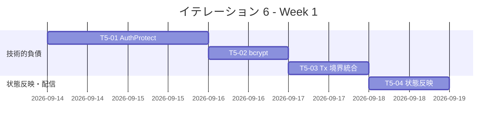

| 日 | タスク |
|----|--------|
| Day 1 (Mon) | T5-01 AuthProtect middleware 実装 + 適用 |
| Day 2 (Tue) | T5-02 bcrypt 化 + migration + 検証テスト |
| Day 3 (Wed) | T5-03 Tx 境界統合 + ADR-0012 起票 |
| Day 4 (Thu) | T5-04 Handling → Tracking 状態反映 + テスト |
| Day 5 (Fri) | T5-05 ConfirmationCode 配信暫定 + テスト、Week 1 レビュー |

### Week 2 (Day 6-10): US21/US26 + テスト補強 + Release 準備

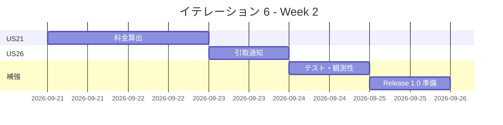

| 日 | タスク |
|----|--------|
| Day 6 (Mon) | US21 Cost VO + Pricing BC 定義 + PricingRuleService |
| Day 7 (Tue) | US21 通貨変換 + Postgres + UI + テスト |
| Day 8 (Wed) | US26 Notification 集約 + 配信 + テスト |
| Day 9 (Thu) | T5-08〜20 テスト・katip・README・CHANGELOG 補強 |
| Day 10 (Fri) | 上流補完 + E2E ハッピーパス + v1.0.0-mvp タグ + 報告書 + レビュー |

---

## 設計

### ドメインモデル (IT6 追加分)

> 注: BC 配置は `docs/design/domain-model.md` に準拠する。IT6 では **Pricing BC (US21)** と **Notification BC (US26)** を新規追加する。既存の Tracking / Handling / Booking / Itinerary BC は変更せず、Cross-BC 連携は **Text-based DTO による Cross-BC helper パターン** (ADR-0004 Rule 4 準拠) で実装する。

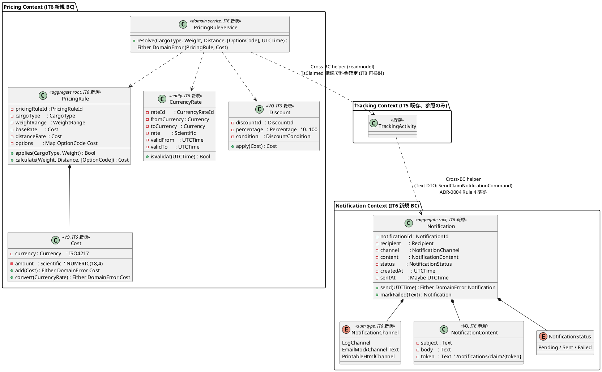

**Haskell 型定義 (主要)**:

```haskell
-- Pricing/Domain/Model/Cost.hs (T-03 純粋)
data Currency = JPY | USD | EUR | CNY
  deriving stock (Eq, Show, Enum, Bounded)

data Cost = Cost
  { costAmount   :: !Scientific  -- 18,4 精度
  , costCurrency :: !Currency
  } deriving stock (Eq, Show)

addCost :: Cost -> Cost -> Either DomainError Cost
addCost a b
  | costCurrency a /= costCurrency b = Left (CurrencyMismatch (costCurrency a) (costCurrency b))
  | otherwise = Right (Cost (costAmount a + costAmount b) (costCurrency a))

-- Pricing/Domain/Model/CurrencyRate.hs
data CurrencyRate = CurrencyRate
  { crRateId       :: !CurrencyRateId
  , crFromCurrency :: !Currency
  , crToCurrency   :: !Currency
  , crRate         :: !Scientific
  , crValidFrom    :: !UTCTime
  , crValidTo      :: !UTCTime
  } deriving stock (Eq, Show)

isRateValidAt :: UTCTime -> CurrencyRate -> Bool
isRateValidAt now cr = crValidFrom cr <= now && now < crValidTo cr

convertCost :: CurrencyRate -> Cost -> Either DomainError Cost
convertCost cr c
  | costCurrency c /= crFromCurrency cr = Left (CurrencyMismatch (costCurrency c) (crFromCurrency cr))
  | otherwise = Right (Cost (costAmount c * crRate cr) (crToCurrency cr))

-- Pricing/Domain/Model/Discount.hs
newtype Percentage = Percentage { unPercentage :: Scientific }
  deriving newtype (Eq, Show, Ord)

data DiscountCondition
  = MinWeight Scientific
  | CargoTypeIs CargoType
  | Always
  deriving stock (Eq, Show)

data Discount = Discount
  { discountId :: !DiscountId
  , discountPercentage :: !Percentage
  , discountCondition  :: !DiscountCondition
  } deriving stock (Eq, Show)

applyDiscount :: Discount -> Cost -> Cost
applyDiscount d c =
  let p = unPercentage (discountPercentage d)
  in c { costAmount = costAmount c * (100 - p) / 100 }

-- Pricing/Domain/Model/PricingRule.hs
data PricingRule = PricingRule
  { prId           :: !PricingRuleId
  , prCargoType    :: !CargoType
  , prWeightMin    :: !Scientific
  , prWeightMax    :: !Scientific
  , prBaseRate     :: !Cost
  , prDistanceRate :: !Cost
  , prOptions      :: !(Map OptionCode Cost)
  } deriving stock (Eq, Show)

-- Pricing/Application/CalculateShippingCostCommand.hs
data CalculateShippingCostInput = CalculateShippingCostInput
  { csciCargoType :: !CargoType
  , csciWeight    :: !Scientific
  , csciDistance  :: !Scientific
  , csciOptions   :: ![OptionCode]
  , csciCurrency  :: !Currency  -- 表示通貨
  } deriving stock (Eq, Show)

execute
  :: PricingRuleRepository m
  => CurrencyRateRepository m
  => CalculateShippingCostInput -> UTCTime -> m (Either DomainError Cost)
-- (1) findPricingRule → (2) calculate base+distance+options → (3) discount 適用
-- → (4) currency 変換。Tx 不要 (読み取り+純粋計算のみ)

-- Notification/Domain/Model/Notification.hs
data NotificationChannel
  = LogChannel
  | EmailMockChannel !Text            -- 宛先メール
  | PrintableHtmlChannel
  deriving stock (Eq, Show)

data NotificationStatus = Pending | Sent | Failed !Text
  deriving stock (Eq, Show)

data NotificationContent = NotificationContent
  { ncSubject :: !Text
  , ncBody    :: !Text
  , ncToken   :: !Text                -- URL 用 opaque token
  } deriving stock (Eq, Show)

data Notification = Notification
  { nId        :: !NotificationId
  , nRecipient :: !Recipient
  , nChannel   :: !NotificationChannel
  , nContent   :: !NotificationContent
  , nStatus    :: !NotificationStatus
  , nCreatedAt :: !UTCTime
  , nSentAt    :: !(Maybe UTCTime)
  } deriving stock (Eq, Show)

sendNotification :: UTCTime -> Notification -> Either DomainError Notification
sendNotification now n
  | nStatus n /= Pending = Left NotificationAlreadyProcessed
  | otherwise            = Right (n { nStatus = Sent, nSentAt = Just now })

-- Notification/Application/SendClaimNotificationCommand.hs
data SendClaimNotificationInput = SendClaimNotificationInput
  { scniBookingId       :: !Text  -- Cross-BC helper: Text DTO で受領 (ADR-0004 Rule 4)
  , scniTrackingNumber  :: !Text
  , scniRecipientEmail  :: !Text
  , scniClaimLocation   :: !Text
  , scniClaimAt         :: !UTCTime
  , scniConfirmToken    :: !Text  -- ConfirmationCode 本体は Tracking BC 内、token のみ渡す
  } deriving stock (Eq, Show)

execute
  :: NotificationRepository m
  => Logger m
  => SendClaimNotificationInput -> UTCTime -> m (Either DomainError NotificationId)
```

### データモデル (IT6 追加分)

> IT6 では **`currency_rate` / `pricing_rule` / `notification` の 3 テーブル** を新規追加する。既存の `confirmation_code` (IT5) は `code_hash` カラムが既に bcrypt 想定で存在するため、テーブル変更なし。ただし SEC-04 対応のため Haskell 側で定数時間比較を導入する (DDL 影響なし)。

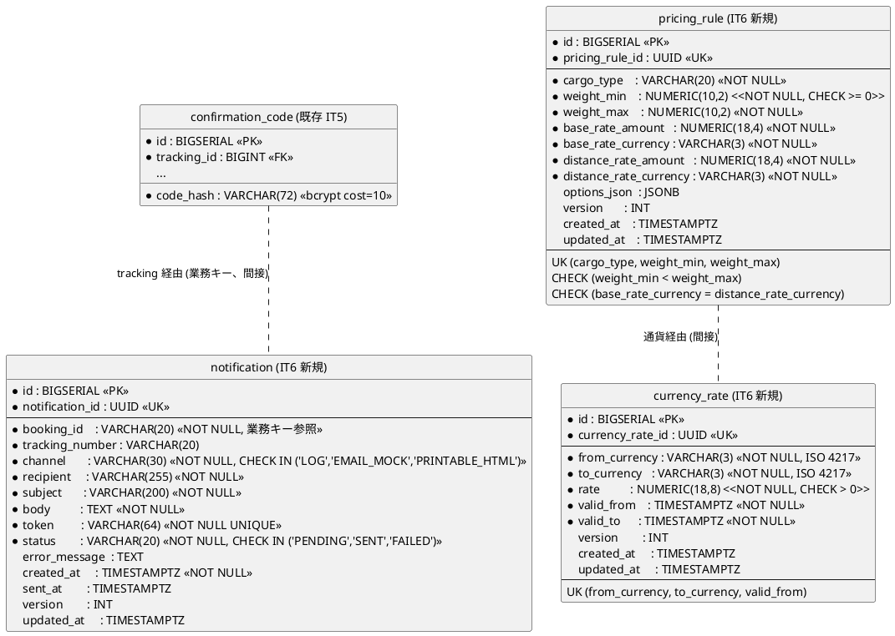

**規約準拠**:

- PK: `BIGSERIAL` サロゲート、業務キーは UUID + UK (data-model.md §1)
- FK: 既存規約に準拠。`notification.booking_id` は VARCHAR(20) 業務キー参照 (`handling_activity.booking_id` と同一方針)
- 監査: `created_at` / `updated_at` 必須、`version` は楽観ロック用
- 精度: 金額 NUMERIC(18,4)、為替 NUMERIC(18,8)、重量 NUMERIC(10,2)
- **セキュリティ**: `notification.token` は URL 用 opaque (32 bytes base64url → 64 chars)

**DDL (IT6 マイグレーション、3 本)**: 「DB マイグレーション順序」節に掲載。

### モジュール構造 (IT6 追加)

```
apps/cargo-tracker/src/
  Cargotracker/
    Pricing/                                     -- IT6 新規 BC (US21)
      Domain/
        Model/
          Cost.hs                                -- VO + add/convert
          Currency.hs                            -- sum type (ISO 4217)
          CurrencyRate.hs                        -- Entity + isValidAt
          Discount.hs                            -- VO + apply
          PricingRule.hs                         -- Aggregate root
        Service/
          PricingRuleService.hs                  -- resolve (T-03 純粋)
      Application/
        CalculateShippingCostCommand.hs          -- US21
      Infrastructure/
        Repository/
          PostgresPricingRuleRepository.hs
          PostgresCurrencyRateRepository.hs
      Interfaces/
        Http/
          PricingCalculateHandler.hs             -- POST /pricing/calculate

    Notification/                                -- IT6 新規 BC (US26)
      Domain/
        Model/
          Notification.hs                        -- Aggregate root
          NotificationChannel.hs                 -- sum type
          NotificationContent.hs                 -- VO
      Application/
        SendClaimNotificationCommand.hs          -- US26
      Infrastructure/
        Repository/
          PostgresNotificationRepository.hs
        Channel/
          LogChannel.hs                          -- katip 出力
          EmailMockChannel.hs                    -- スタブ (SMTP は IT7+)
          PrintableHtmlChannel.hs                -- Lucid HTML
      Interfaces/
        Http/
          NotificationListHandler.hs             -- GET /notifications
          NotificationClaimViewHandler.hs        -- GET /notifications/claim/{token}

    Tracking/                                    -- 既存 (IT5)
      Application/
        VerifyClaimAndRegisterCommand.hs         -- T5-03: Tx 境界統合改修
    Handling/                                    -- 既存 (IT5)
    Shared/
      Auth/
        AuthProtect.hs                           -- T5-01 新規 (Servant AuthHandler)
        SessionCookie.hs                         -- 既存 IT5
        SessionStore.hs                          -- 既存 IT5
      Crypto/
        ConstantTimeEq.hs                        -- T5-02 定数時間比較 (Data.ByteArray.constEq)
      CrossBc/
        NotifyClaimReadyHelper.hs                -- Cross-BC helper: Tracking → Notification
        PricingReadmodelHelper.hs                -- Cross-BC helper: Tracking → Pricing (IT8 布石)

db/migrations/
  20260914100000_create_currency_rate.sql
  20260914100100_create_pricing_rule.sql
  20260914100200_create_notification.sql

test/
  Integration/
    AuthProtectSpec.hs                           -- T5-01
    ConfirmationCodeBcryptSpec.hs                -- T5-02
    VerifyClaimAndRegisterTxSpec.hs              -- T5-03
    PricingCalculateHandlerSpec.hs               -- US21
    NotificationClaimViewSpec.hs                 -- US26
    LoginCookieSpec.hs                           -- T5-10
e2e/
  it6-mvp-happy-path.spec.ts                     -- 予約→追跡→引取→料金 1 本
```

### URL 設計 (IT6 追加)

| メソッド | パス | 認可 | 用途 |
| :--- | :--- | :--- | :--- |
| POST | `/pricing/calculate` | AuthProtect (Operator) | US21: 輸送料金算出 (htmx 部分更新) |
| GET  | `/pricing/rules` | AuthProtect (Operator) | US21: 料金ルール一覧 |
| GET  | `/notifications` | AuthProtect (Admin) | US26: 通知一覧 (管理者ビュー) |
| GET  | `/notifications/{id}` | AuthProtect (Admin) | US26: 通知詳細 |
| POST | `/notifications/{id}/resend` | AuthProtect (Admin) | US26: 再送信 |
| GET  | `/notifications/claim/{token}` | 認証不要 (token 保護) | US26: 引取通知配信ビュー (印刷用 HTML) |

**AuthProtect 適用範囲 (T5-01)**:

- 適用対象: `/bookings/*` / `/handling/*` / `/pricing/*` / `/notifications` (`/claim/{token}` を除く) / `/tracking/admin/*`
- 適用除外: `/auth/login` / `/auth/logout` / `/public/tracking/:tn` / `/notifications/claim/{token}` (token による保護)
- Cookie 無し → 401 (JSON API) / 303 → `/auth/login?next=<path>` (HTML)
- Session あり + Role 不足 → 403

### ユーザーインターフェース

#### ビュー

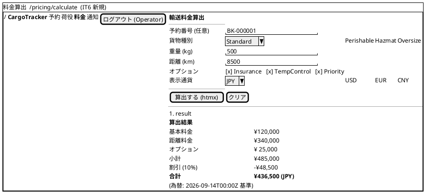

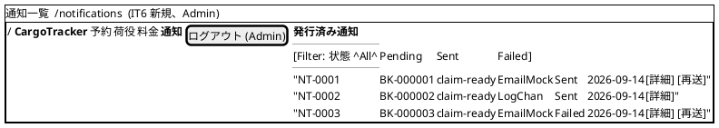

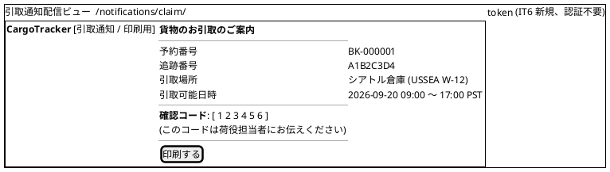

#### インタラクション

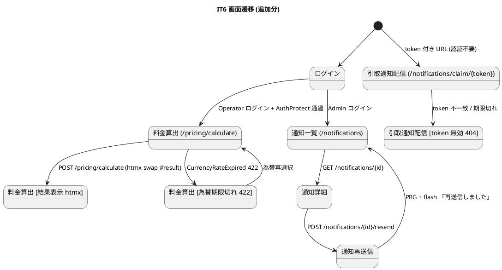

**htmx パターン (IT6 適用箇所)**:

| 画面 | パターン | エンドポイント |
| :--- | :--- | :--- |
| 料金算出 (結果) | フォーム送信 → 部分 swap | `hx-post="/pricing/calculate"` → `hx-target="#result"` → `hx-swap="innerHTML"` |
| 通知一覧 (フィルタ) | セレクト変更で再描画 | `hx-get="/notifications?status=..."` → `hx-target="#notif-list"` |
| 通知再送信 | ボタン + 確認 | `hx-post="/notifications/{id}/resend"` → PRG (303) |

**フィードバック規約 (IT6 追加)**:

- 成功: 「料金を算出しました (¥436,500 JPY)」 / 「通知を再送信しました」 / 「引取通知を発行しました (token: <last6>)」
- 警告: 「為替レートが期限切れです。最新のレートで再計算してください」
- エラー (`alert-danger`): 「料金ルールが見つかりません (貨物種別: <type>, 重量: <weight> kg)」 / 「通知の送信に失敗しました (channel: <chan>)」

### API 設計

**Servant Endpoint 型定義 (Haskell)**:

```haskell
-- Shared/Auth/AuthProtect.hs (T5-01)
type instance AuthServerData (AuthProtect "session")
  = AuthenticatedUser

authHandler :: SessionStore -> AuthHandler Request AuthenticatedUser
authHandler store = mkAuthHandler $ \req ->
  case lookupSessionCookie req of
    Nothing  -> throwError err401 { errBody = "no session" }
    Just sid -> do
      mUser <- liftIO (findSession store sid)
      case mUser of
        Nothing -> throwError err401 { errBody = "invalid session" }
        Just u  -> pure u

-- Pricing/Interfaces/Http/PricingCalculateHandler.hs
type PricingApi
  =    "pricing" :> "calculate"
       :> AuthProtect "session"
       :> ReqBody '[FormUrlEncoded] CalculateShippingCostForm
       :> Post '[HTML] (Html ())
  :<|> "pricing" :> "rules"
       :> AuthProtect "session"
       :> Get '[HTML] (Html ())

-- Notification/Interfaces/Http/NotificationApi.hs
type NotificationApi
  =    "notifications"
       :> AuthProtect "session"
       :> QueryParam "status" NotificationStatus
       :> Get '[HTML] (Html ())
  :<|> "notifications" :> Capture "id" NotificationId
       :> AuthProtect "session"
       :> Get '[HTML] (Html ())
  :<|> "notifications" :> Capture "id" NotificationId :> "resend"
       :> AuthProtect "session"
       :> PostNoContent
  :<|> "notifications" :> "claim" :> Capture "token" Text
       :> Get '[HTML] (Html ())  -- 認証不要
```

### アプリケーション層シーケンス

#### CalculateShippingCostCommand (US21)

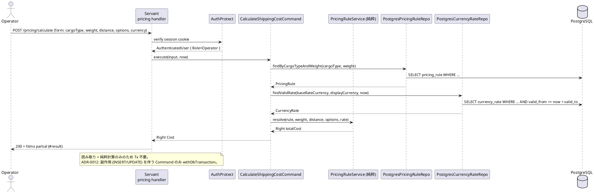

#### SendClaimNotificationCommand (US26)

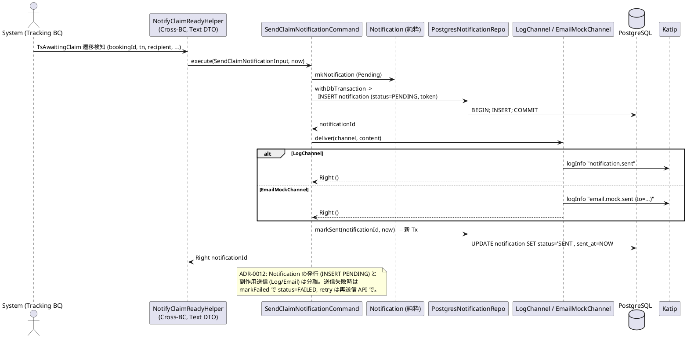

#### VerifyClaimAndRegisterCommand (T5-03 Tx 境界統合後)

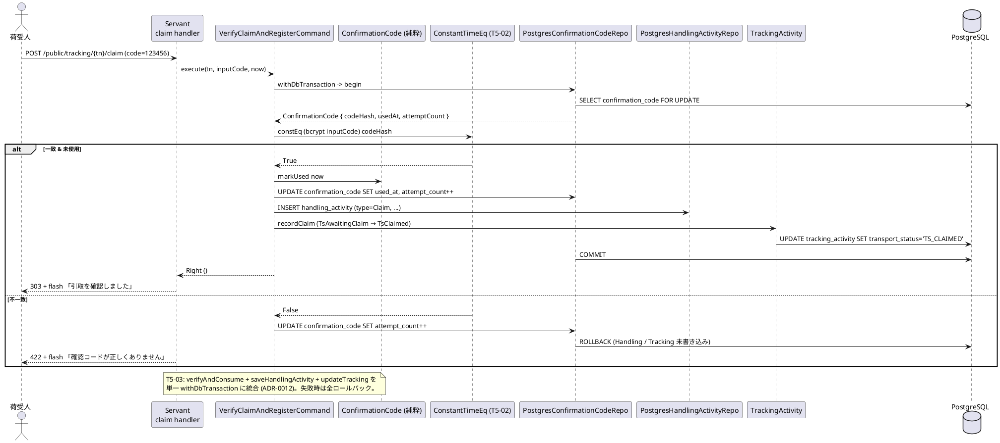

### トランザクション境界

ADR-0002 の T-01/T-02/T-03 に加え、**ADR-0012 (Tx 境界ポリシー、IT6 起票)** を新規策定する。

| ルール | 適用 |
| :--- | :--- |
| **T-01 (Application で `withDbTransaction`)** | `VerifyClaimAndRegisterCommand` (confirmation_code + handling_activity + tracking_activity の 3 テーブル **単一 Tx**、T5-03) / `SendClaimNotificationCommand` (notification INSERT のみ、副作用は Tx 外) / `CalculateShippingCostCommand` は Tx 不要 (読み取り + 純粋計算) |
| **T-02 (Repository は IO のみ)** | `PostgresPricingRuleRepository` / `PostgresCurrencyRateRepository` / `PostgresNotificationRepository` は `Connection -> IO ()` のみ、Tx 開始禁止 |
| **T-03 (Domain は IO 完全排除)** | `PricingRuleService.resolve` / `applyDiscount` / `convertCost` / `Notification.send` は純粋 `Either DomainError a` |
| **ADR-0012 新規: Cross-BC 参照は Text DTO のみ** | `NotifyClaimReadyHelper` は `bookingId :: Text` / `trackingNumber :: Text` で受領。Tracking BC の型を Notification BC が直接 import しない (Rule 4 遵守) |
| **ADR-0012 新規: 副作用は Tx 外** | Notification の送信 (Log/Email) は INSERT (Tx) 完了後に実行。送信失敗時は `markFailed` を別 Tx で行い、再送信は API 経由 |
| **ADR-0012 新規: Cargo.status 波及は本 IT では実施しない** | `Handling.Claim` → `Tracking.TsClaimed` 遷移は本 IT で実装するが、`Cargo.status` (Booking BC) への波及は US23 精算 (IT8) で対応 |

### エラー処理戦略

IT5 の `TrackingError` / `HandlingError` に加え、IT6 で `PricingError` / `NotificationError` を新規追加する。

```haskell
-- Pricing/Domain/Error.hs (IT6 新規)
data PricingError
  = PricingRuleNotFound !CargoType !Scientific       -- US21: 404
  | CurrencyRateExpired !Currency !Currency !UTCTime -- US21: 422
  | CurrencyRateNotFound !Currency !Currency         -- US21: 404
  | CurrencyMismatch !Currency !Currency             -- US21: 422
  | InvalidWeightRange !Scientific !Scientific       -- US21: 422
  | InvalidDiscountPercentage !Scientific            -- US21: 422
  deriving stock (Eq, Show)

-- Notification/Domain/Error.hs (IT6 新規)
data NotificationError
  = NotificationNotFound !NotificationId              -- US26: 404
  | NotificationAlreadyProcessed                      -- US26: 409
  | NotificationDeliveryFailed !NotificationChannel !Text  -- US26: 500
  | InvalidRecipient !Text                            -- US26: 422
  | TokenNotFound !Text                               -- US26: 404 (claim view)
  deriving stock (Eq, Show)

-- Shared/Auth/Error.hs (T5-01 新規)
data AuthError
  = MissingSessionCookie                              -- T5-01: 401
  | InvalidSession !SessionId                         -- T5-01: 401
  | InsufficientRole !Role !Role                      -- T5-01: 403 (required, actual)
  deriving stock (Eq, Show)

-- Tracking (T5-02 追加)
data TrackingError
  = ...
  | ConfirmationCodeConstantTimeCompareFailed         -- SEC-04: bcrypt + constEq 失敗
```

**HTTP マッピング (IT6 追加)**:

| Error | HTTP | フラッシュメッセージ例 |
| :--- | :--- | :--- |
| `PricingRuleNotFound` | 404 | 「料金ルールが見つかりません (貨物種別: <type>, 重量: <weight>)」 |
| `CurrencyRateExpired` | 422 | 「為替レートが期限切れです (<from>→<to>, 期限: <validTo>)」 |
| `CurrencyRateNotFound` | 404 | 「為替レートが登録されていません (<from>→<to>)」 |
| `CurrencyMismatch` | 422 | 「通貨が不一致です (<expected> vs <actual>)」 |
| `NotificationNotFound` | 404 | 「該当する通知が見つかりません」 |
| `NotificationAlreadyProcessed` | 409 | 「この通知は既に処理済です」 |
| `NotificationDeliveryFailed` | 500 | 「通知の送信に失敗しました (channel: <chan>)」 (再送信 API で復旧) |
| `TokenNotFound` | 404 | 「この引取通知は無効または期限切れです」 |
| `MissingSessionCookie` | 401 (JSON) / 303 (HTML) | ログインページへリダイレクト (`?next=<path>`) |
| `InvalidSession` | 401 | 「セッションが無効です。再ログインしてください」 |
| `InsufficientRole` | 403 | 「この操作を行う権限がありません (要求: <req>)」 |

### DB マイグレーション順序 (IT6)

IT5 の 014 を前提に、IT6 では **3 マイグレーション** を投入する。

| 順序 | ファイル | 内容 | 依存 |
| :--- | :--- | :--- | :--- |
| 015 | `20260914100000_create_currency_rate.sql` | `currency_rate` 新規作成 | 独立 |
| 016 | `20260914100100_create_pricing_rule.sql` | `pricing_rule` 新規作成 (通貨は文字列参照、FK なし) | 015 (通貨コード整合性) |
| 017 | `20260914100200_create_notification.sql` | `notification` 新規作成 (booking_id 業務キー参照) | 独立 (既存 `cargo` を業務キー経由で参照) |

> **既存 `confirmation_code` の変更なし**: `code_hash` カラムは IT5 で bcrypt cost=10 想定で作成済み。T5-02 (SEC-04) は Haskell 側の定数時間比較実装のみで、DDL 変更を伴わない。

**DDL 例 (015)**:

```sql
-- db/migrations/20260914100000_create_currency_rate.sql
-- migrate:up
CREATE TABLE currency_rate (
    id                BIGSERIAL PRIMARY KEY,
    currency_rate_id  UUID NOT NULL UNIQUE,
    from_currency     VARCHAR(3) NOT NULL,
    to_currency       VARCHAR(3) NOT NULL,
    rate              NUMERIC(18,8) NOT NULL CHECK (rate > 0),
    valid_from        TIMESTAMPTZ NOT NULL,
    valid_to          TIMESTAMPTZ NOT NULL CHECK (valid_to > valid_from),
    version           INTEGER NOT NULL DEFAULT 0,
    created_at        TIMESTAMPTZ NOT NULL DEFAULT NOW(),
    updated_at        TIMESTAMPTZ NOT NULL DEFAULT NOW(),
    UNIQUE (from_currency, to_currency, valid_from)
);
CREATE INDEX idx_currency_rate_lookup
  ON currency_rate (from_currency, to_currency, valid_from, valid_to);
-- migrate:down
DROP TABLE currency_rate;
```

### テスト戦略

| 層 | テスト種別 | 追加件数 (目標) |
| :--- | :--- | ---: |
| Domain | hspec | `Cost.add/convert` (5) / `CurrencyRate.isValidAt` 境界 (4) / `Discount.apply` (3) / `PricingRule.calculate` (5) / `Notification.send` 状態遷移 (4) |
| Domain | hedgehog (property) | 料金の**単調性** (weight/distance が増えれば cost も増加) / **非負性** (0 円未満にならない) / **為替可換性** (JPY→USD→JPY で誤差 < 0.01%) / 割引適用後 ≤ 適用前 |
| Application | hspec | `CalculateShippingCostCommand` (5: 通常/期限切れレート/ルールなし/通貨不一致/割引適用) / `SendClaimNotificationCommand` (4: Log/EmailMock/送信失敗/token 生成) / `VerifyClaimAndRegisterCommand` (5: 成功/コード誤り/使用済/attempt 上限/**Tx ロールバック検証**、T5-03) |
| Application | hspec (Tracking BC 繰越 T5-08) | `IssueTrackingNumberCommand` (3) / `RegisterHandlingEventCommand` (5: Load/Unload/Claim + optimistic lock) / `VerifyClaimAndRegisterCommand` TTL 境界 (2、T5-11) |
| Infrastructure | hspec (testcontainers) | `PostgresPricingRuleRepository` CRUD + weight range 検索 (3) / `PostgresCurrencyRateRepository` valid_at 検索 (3) / `PostgresNotificationRepository` status 遷移 (3) |
| Interfaces (HTTP) | hspec-wai | **T5-01 AuthProtect**: Cookie なし 401 / 無効 401 / Role 不足 403 / 通過 200 (4) / **T5-02 bcrypt + 定数時間**: 定数時間差測定 (2) / **T5-03 Tx**: ロールバック確認 (2) / `PricingCalculateHandler` (5) / `NotificationClaimViewHandler` (3) / `NotificationListHandler` (3) / **T5-10 POST /login Cookie 発行** (2) |
| E2E | Playwright | IT6 MVP ハッピーパス「予約→経路→追跡→荷役→引取→料金」1 本 (7.1) + Pricing 画面 3 ケース + Notification 印刷ビュー 1 ケース |
| Contract | 既存 (継続) | 通関 / 料金 ACL Circuit Breaker 継続 |
| アーキテクチャ | arch-check Rule 1-4 | **Rule 4 (BC 間 Domain 直接参照禁止) 違反 0**: `Notification.*` が `Cargotracker.Tracking.Domain.*` を import しない検証 / Cross-BC helper が `Shared/CrossBc/` にのみ配置される検証 |
| カバレッジ | HPC | Domain ≥ 95% / 全体 ≥ 75% (T4-12 ゲート維持) |

**property テスト例 (US21 単調性)**:

```haskell
prop_costMonotonicInWeight :: Property
prop_costMonotonicInWeight = property $ do
  rule <- forAll genPricingRule
  w1   <- forAll (Gen.scientific (Range.linear 0 1000))
  w2   <- forAll (Gen.scientific (Range.linear 0 1000))
  d    <- forAll (Gen.scientific (Range.linear 0 10000))
  let c1 = calculate rule w1 d []
      c2 = calculate rule w2 d []
  (compare w1 w2, compare (costAmount <$> c1) (costAmount <$> c2)) === (LT, LT) `orAlso` ...
```

**hspec-wai 統合テスト例 (T5-01 AuthProtect)**:

```haskell
spec :: Spec
spec = withApp $ do
  describe "AuthProtect middleware" $ do
    it "returns 401 without session cookie" $
      get "/pricing/calculate" `shouldRespondWith` 401
    it "returns 303 to /auth/login for HTML requests" $
      request "GET" "/pricing/calculate" [("Accept","text/html")] ""
        `shouldRespondWith` 303 { matchHeaders = ["Location" <:> "/auth/login?next=/pricing/calculate"] }
    it "returns 403 with insufficient role" $ do
      cookie <- loginAs "viewer@example.com"    -- Viewer は Pricing 不可
      request "GET" "/pricing/calculate" [("Cookie", cookie)] ""
        `shouldRespondWith` 403
```

### CI 統合

`.github/workflows/ci.yml` に IT6 で追加/更新するステップ:

```yaml
- name: hspec-wai 統合テスト (IT6 追加分)
  working-directory: apps/cargo-tracker
  run: nix-shell ../../$NIX_SHELL --run \
       "stack test --test-arguments='--match \"AuthProtect|Pricing|Notification|VerifyClaimTx\"'"

- name: arch-check Rule 4 (BC 間 Domain 参照禁止)
  run: |
    # Notification/Pricing が他 BC の Domain を直接 import しないことを検証
    ! grep -rE "^import (qualified )?Cargotracker\.(Tracking|Handling|Booking)\.Domain" \
        apps/cargo-tracker/src/Cargotracker/{Notification,Pricing}/
    # Cross-BC helper は Shared/CrossBc にのみ配置
    for f in $(find apps/cargo-tracker/src -name "*Helper.hs" -path "*CrossBc*"); do
      [ -e "$f" ] || (echo "Cross-BC helper 配置違反: $f" && exit 1)
    done

- name: AuthProtect 未適用検出 (T5-01)
  run: |
    # 認証必須パスに AuthProtect が付与されていることを grep で検証
    for path in "bookings" "handling" "pricing" "notifications"; do
      grep -l "\"$path\"" apps/cargo-tracker/src/Cargotracker/*/Interfaces/Http/*.hs \
        | xargs grep -L "AuthProtect \"session\"" \
        && (echo "AuthProtect 未適用: /$path/*" && exit 1)
    done
    echo "AuthProtect 適用検証 OK"

- name: bcrypt + 定数時間比較検証 (T5-02 / SEC-04)
  working-directory: apps/cargo-tracker
  run: |
    grep -qE "constEq|Data\.ByteArray" src/Cargotracker/Shared/Crypto/ConstantTimeEq.hs \
      || (echo "定数時間比較の実装が見つかりません" && exit 1)
    grep -rE "bcryptHash|hashPassword" src/Cargotracker/Tracking/ \
      || (echo "bcrypt ハッシュ化が Tracking BC に見つかりません" && exit 1)

- name: HPC ゲート 75% (継続)
  working-directory: apps/cargo-tracker
  run: |
    nix-shell ../../$NIX_SHELL --run "stack test --coverage"
    total=$(nix-shell ../../$NIX_SHELL --run "stack hpc report" \
            | awk '/expressions used/ {gsub("%",""); print $4}')
    [ "$total" -ge 75 ] || (echo "全体カバレッジ不足: ${total}%" && exit 1)

- name: Playwright E2E (IT6 MVP ハッピーパス)
  working-directory: e2e
  run: npx playwright test --grep '@it6-mvp|@us21|@us26'
```

- リリースタグ `v1.0.0-mvp` を IT6 完了時に作成 (7.2)
- CHANGELOG `[Unreleased]` を Release 1.0 として整理 (T5-20)

### ADR

| ADR | タイトル | ステータス |
|-----|---------|-----------|
| [ADR-0004](../adr/0004-arch-check-rules.md) | arch-check 4 ルール (Rule 4: BC 間 Domain 直接参照禁止) | **既に採用済**、IT6 で Pricing / Notification BC に継続適用 (Cross-BC helper パターン) |
| [ADR-0008](../adr/0008-itinerary-leg-model.md) | Itinerary / Leg を Booking 集約配下に配置 | 採用済 (IT5) |
| [ADR-0010](../adr/0010-session-cookie-auth.md) | セッション認証方式 (opaque Cookie + Servant Auth + Postgres KV) | **IT6 で記述修正** (T5-21、レビュー H-09): 段階移行の「AuthProtect middleware は IT5 未実装」を「IT6 実装済み」に書き換え |
| [ADR-0011](../adr/0011-offline-handling-queue.md) | 荷役オフライン対応方式 | 採用済 (IT5) |
| **ADR-0012** (IT6 新規起票) | **Tx 境界ポリシー / Cross-BC 参照ポリシー / 副作用外出しポリシー** | **提案 → IT6 で採用**: (1) verifyAndConsume + saveHandlingActivity + updateTracking の単一 Tx 統合 (T5-03), (2) Cross-BC 参照は Text DTO のみ (Rule 4 遵守), (3) Notification 送信副作用は INSERT Tx 外で実行, (4) `Handling.Claim → Tracking.TsClaimed` を実装し `Cargo.status` (Booking BC) 波及は US23 精算 (IT8) に持ち越す境界を明記 |

**ADR-0012 骨子 (起票時のテンプレ)**:

```markdown
# ADR-0012: Tx 境界と Cross-BC 参照ポリシー

## Status
Proposed (2026-09-14, IT6)

## Context
IT5 マルチパースペクティブレビューで以下 3 点が指摘された:
- verifyAndConsume と saveHandlingActivity が別 Tx で状態不整合の可能性 (T5-03)
- Handling → Tracking 状態反映の責務境界が未明記 (T5-04)
- Notification (IT6) の副作用送信を Tx 内に含めると DB ロック長期化リスク

## Decision
1. Application Command が副作用を伴う場合 `withDbTransaction` で単一境界を確保
2. Cross-BC 参照は `Shared/CrossBc/*Helper.hs` 経由 (Text DTO)、他 BC の Domain 型を直接 import しない (arch-check Rule 4)
3. 外部副作用 (メール送信、ログ配信) は Tx 完了後に実行、失敗は別 Tx で `markFailed`
4. `Handling.Claim → Tracking.TsClaimed` は本 IT で実装、`Cargo.status` 波及は US23 (IT8)

## Consequences
- ロック時間短縮、再送信機構による回復可能性
- Cross-BC 型結合の抑制、テスト独立性の向上
- IT8 で Cargo.status 波及を実装する際の互換性維持
```

---

## リスクと対策

| リスク | 影響度 | 対策 |
|--------|--------|------|
| AuthProtect middleware 適用漏れによる認可バイパス | 高 | 全ページ AuthProtect 適用を hspec-wai で網羅テスト (403 検証)、arch-check Rule で HttpApi は Auth 済みハンドラのみ許可を追加検討 |
| bcrypt migration 中の既存 ConfirmationCode との互換性 | 中 | migration 手順で全レコードを再発行、または dual-read 期間を設けて段階移行 |
| Tx 境界統合による Handling 記録失敗時の状態不整合 | 高 | 統合 Transaction 内で失敗した場合 Handling も Tracking もロールバック、ADR-0012 に明記 |
| US21 通貨為替レート実装が過大化 | 中 | 固定レート mock でスタート、外部 API 連携は IT7 以降のストレッチに繰越 |
| US26 通知配信の外部依存 (SMTP/SMS) | 中 | Log 出力 + 印刷用 HTML の暫定策で MVP を先に成立させ、実配信は IT7 以降 |
| ベロシティ超過 (18 SP は平均 19.75 の 91%) | 中 | 高優先タスクを Week 1 に集中、中優先 (T5-11/12/16/18/19/20) は Week 2 中盤以降で吸収判断 |

---

## 完了条件

### Definition of Done

- [x] `sbt` 相当のフルテスト (`stack test` / `cabal test`) が緑
- [x] arch-check Rule 1-4 全違反 0 件維持
- [x] HPC カバレッジ 75% ゲート維持
- [x] Playwright E2E ハッピーパス緑 (「予約→追跡→引取」1 本追加含む)
- [x] AuthProtect 未適用ページ 0 件
- [x] ConfirmationCode 平文永続化 0 件 (bcrypt 化完了)
- [x] verifyAndConsume + saveHandlingActivity が単一 Transaction
- [x] ADR-0012 が採用または提案として存在
- [x] README に環境変数・Cookie 早見表節が存在
- [x] CHANGELOG に Release 1.0 セクションが存在
- [x] v1.0.0-mvp タグ作成
- [x] マルチパースペクティブレビュー完了 (developing-review)
- [x] 完了報告書作成 (creating-iteration-report)

### デモ項目

1. AuthProtect 適用画面へ Cookie なしで 403 が返ることを確認
2. 予約 → 経路確定 → 追跡番号発行 → 荷役登録 → 状態が TsClaimed に自動遷移
3. 荷受人が引取通知を受信 (ログ + 印刷用 HTML) → ConfirmationCode を入力 → 引取確認完了
4. 料金算出画面で貨物種別・重量・距離を入力 → 通貨変換込みで料金表示
5. `git tag v1.0.0-mvp` の作成と CHANGELOG Release 1.0 確認

---

## 更新履歴

| 日付 | 更新内容 | 更新者 |
|------|---------|--------|
| 2026-07-02 | 初版作成 (IT5 完了報告 + 高優先レビュー 10 件 + 中優先プロセス 7 件を統合) | AI Agent |
| 2026-07-02 | validating-iteration-plan 検証結果を反映 (6.1〜6.3 上流補完詳細化 / T5-04 スコープ明確化 / T5-08 Command テスト明細化 / T5-21 ADR-0010 修正追加) | AI Agent |

---

## 関連ドキュメント

- [リリース計画](./release_plan.md)
- [IT5 完了報告書](./iteration_report-5.md)
- [IT5 ふりかえり](./retrospective-5.md)
- [イテレーション 6 ふりかえり](./retrospective-6.md) (完了時作成)
- [IT6 完了報告書](./iteration_report-6.md) (完了時作成)
