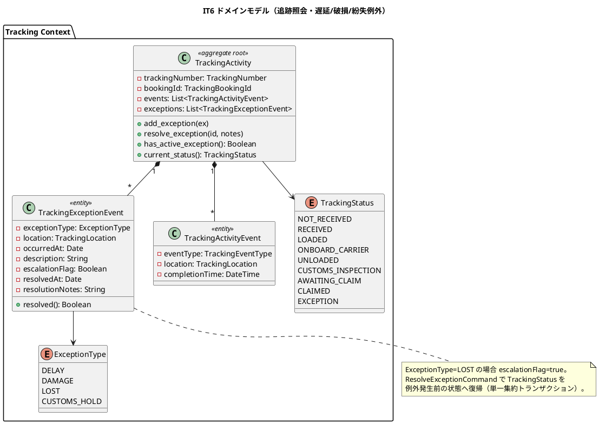
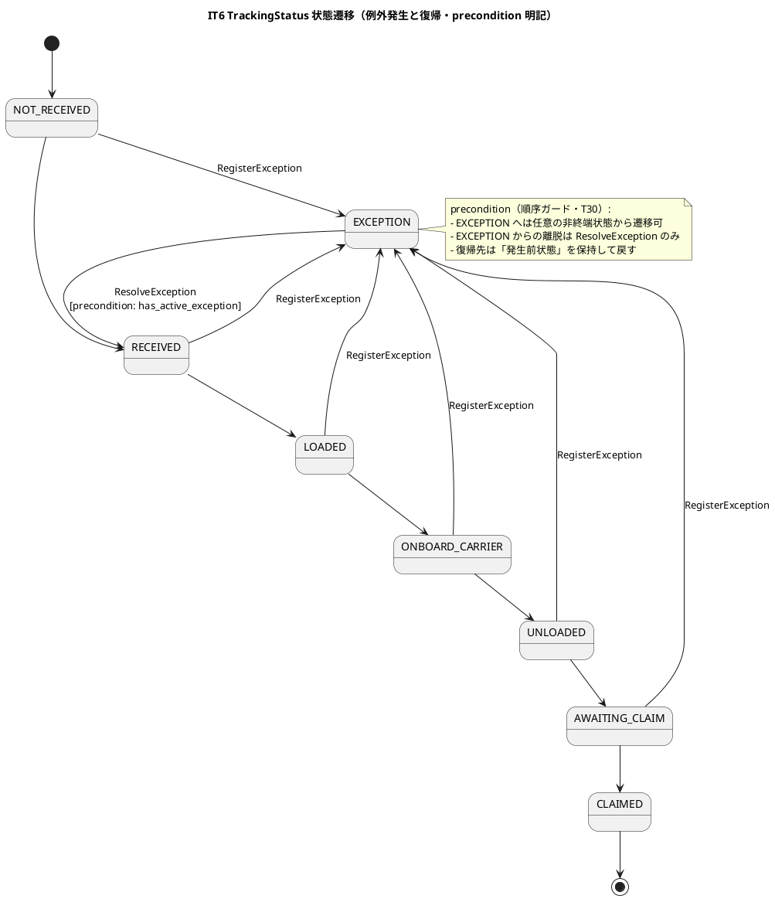
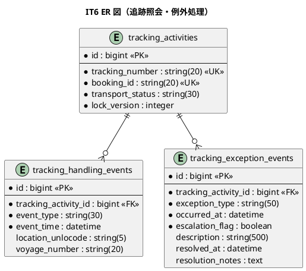
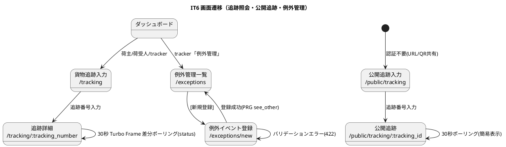

# イテレーション 6 計画 - 追跡照会 + 遅延例外 + 破損/紛失例外

## ゴール

追跡情報照会（US18・認証あり詳細照会＋認証不要の公開追跡ページ・Turbo Frame 30 秒差分ポーリング）と例外処理（US19 遅延・US20 破損/紛失）を中盤インサイドアウトで実装する。IT5 で確立した Tracking Context（`TrackingActivity` 集約・追跡イベント履歴）に `TrackingExceptionEvent`（集約内エンティティ）・`ExceptionType`・`tracking_exception_detected` イベントを結線し、Phase 3（追跡・荷役・例外処理）を完了して **Release 0.3** を発行する。

## 対象ストーリー

| US | 概要 | SP | BC | 対応 UC |
|:---|:-----|:--|:---|:--------|
| US18 | 追跡情報を照会する | 5 | Tracking | UC15 |
| US19 | 遅延例外を処理する | 5 | Tracking | UC16 |
| US20 | 破損・紛失例外を処理する | 5 | Tracking | UC16 |

（release_plan.md Phase 3 / IT6 と一致・計 15 SP。直近ベロシティ IT3-5=14/15/14 SP と整合）

## 受入条件

[user_story.md](../requirements/user_story.md) の受け入れ基準に準拠（全文）。各基準は計画段階でテストケースへ 1:1 マッピングする（IT4 Try T27 の継続）。

**US18 追跡情報を照会する**（として: 荷主・荷受人）

- [ ] 追跡番号を入力して貨物情報を照会できる
- [ ] 現在の状態・位置（港湾名）・推定到着日が表示される
- [ ] 追跡イベント履歴（日時・場所・作業種別）が時系列で表示される
- [ ] 追跡番号が存在しない場合、「追跡番号が見つかりません」と表示される
- [ ] ログインなしでも追跡番号があれば照会できる（公開追跡ページ `/public/tracking`）

**US19 遅延例外を処理する**（として: 追跡管理者）

- [ ] 追跡番号と例外種別「遅延」・発生状況（場所・日時・理由）を記録できる
- [ ] 記録後、貨物状態が「例外発生」（EXCEPTION）に更新される
- [ ] 荷主に遅延発生の通知が送信される
- [ ] 対応内容（新しい到着予定日・対応方針）を入力して荷主に対応報告を送信できる
- [ ] 例外対応履歴が記録される

**US20 破損・紛失例外を処理する**（として: 追跡管理者・荷役作業員）

- [ ] 追跡番号と例外種別「破損」または「紛失」・発生状況を記録できる
- [ ] 記録後、貨物状態が「例外発生」（EXCEPTION）に更新される
- [ ] 例外種別「紛失」の場合、緊急フラグ（escalation_flag）が設定され管理職への escalation 通知が送信される
- [ ] 荷主に破損・紛失発生の通知が送信される
- [ ] 対応内容（補償方針等）を入力して荷主に報告を送信できる

## タスク分解（インサイドアウト）

中盤はデータ層 → ドメイン層 → アプリケーション → UI の順で貫通する。

### 技術的負債の返済枠（IT5 ふりかえり Try・序盤の独立コミット枠で先着手）

> [[feedback_debt-allowance-defer-antipattern]] を踏まえ、IT5 で繰り越した Try を **Week 11 序盤の独立コミット枠**で例外処理本体の着手より前に先着手する。「余力次第」にしない。

- [ ] 【T28】荷役の二重登録防止（冪等キー: `booking_id` + `event_type` + `completion_time` + `voyage`）を `RegisterHandlingActivity` に追加し、多重 POST での二重通知を防ぐ。冪等キー衝突時は既存記録を返す回帰 spec を追加
- [ ] 【T29】楽観/悲観ロック競合（`StaleObjectError`・並行荷役／並行例外登録）の回帰テストを追加（`tracking_activities.lock_version` を含む・ロックを入れた以上競合時挙動を固定）
- [ ] 【T30】ドメイン設計時に「状態遷移の前提条件（precondition）」を集約ごとに洗い出し、状態機械テーブルをユニット spec で固定する設計チェックを DoD 化（本計画の「設計 4 図」の状態遷移図に precondition を明記し、`TrackingStatus`→EXCEPTION／ResolveException による復帰の順序ガードをユニット spec で先に固定）
- [ ] 【T32】MISROUTED → `cargos.routing_status` 反映（導出値と永続値の整合設計・IT5 L2）。LOAD/UNLOAD の MISROUTED 確定時に `handling_activity_registered` 経由で `cargos.routing_status` を MISROUTED に保存し、導出述語と永続値の一致を spec で固定

### データ層（tracking_exception_events 新設）

- [ ] `tracking_exception_events` テーブル migration（新規・data-model L892 準拠）: `id` bigint PK / `tracking_activity_id` bigint FK→tracking_activities.id NOT NULL / `exception_type` string(50) NOT NULL（DELAY/DAMAGE/LOST/CUSTOMS_HOLD）/ `occurred_at` datetime NOT NULL / `escalation_flag` boolean NOT NULL DEFAULT FALSE / `description` string(500) / `resolved_at` datetime NULL（NULL=未解決）/ `resolution_notes` text（対応内容メモ）/ `created_at`, `updated_at`。集約ルート `tracking_activities` の子テーブル（楽観ロックは集約ルート側 lock_version）
- [ ] US18 追跡照会クエリの読み取り最適化確認（`tracking_handling_events` の時系列取得・`tracking_activities.transport_status` 現在状態・推定到着日の導出元。IT5 実装済みテーブルの Query 側再利用。CQRS Query として集約と分離）

### ドメイン層（Tracking Context・例外処理）

- [ ] `ExceptionType` 列挙型（DELAY/DAMAGE/LOST/CUSTOMS_HOLD）のユニット spec（IT5 で enum 定義のみ先行済みの場合は述語を拡充。`escalation_required?`＝LOST を内包）
- [ ] `TrackingExceptionEvent`（集約内エンティティ）: `exception_type`・`location: TrackingLocation`・`occurred_at`・`description`・`escalation_flag`・`resolved_at`・`resolution_notes`・`resolved?` 述語のユニット spec
- [ ] `TrackingActivity` 集約の例外メソッド拡張: `add_exception(ex)`・`has_active_exception?()`・例外登録時 `current_status()` を EXCEPTION に遷移・`resolve_exception(id, notes)` で発生前状態へ復帰（domain-model ビジネスルール 5・単一集約トランザクション）のユニット spec。**precondition（順序ガード）を明記**（T30・EXCEPTION からの復帰は resolve でのみ許可）
- [ ] LOST 例外の `escalation_flag=true` 自動設定（domain-model ビジネスルール 3）のユニット spec
- [ ] `tracking_exception_detected` ドメインイベントのペイロード定義（プリミティブ Hash・BC 越境は ADR-0003 識別子のみ）

### アプリケーション（ユースケース・イベントハンドラ）

- [ ] `TrackCargoQuery` / 追跡照会ユースケース（US18・追跡番号で `TrackingActivity` と履歴・現在状態・位置・推定到着日を取得。認証あり詳細照会と公開ページ両方の Query 供給。存在しない追跡番号は「見つかりません」を返す）
- [ ] `RegisterExceptionCommand` ユースケース（US19/US20・追跡番号で貨物特定→`TrackingExceptionEvent` 登録→`TrackingStatus` EXCEPTION 遷移→LOST は escalation_flag→`tracking_exception_detected` 発行）
- [ ] `ResolveExceptionCommand` / 対応報告ユースケース（US19/US20・`resolution_notes`・新到着予定日/補償方針を記録→荷主へ対応報告通知→解決時 `TrackingStatus` を発生前状態へ復帰）
- [ ] `tracking_exception_detected` 購読ハンドラ（domain-model「将来連携」→ IT6 で有効化）: 荷主へ例外発生通知・LOST 時は管理職へ escalation 通知・Booking Context 側の状態同期（必要範囲）。既存 `NotificationSubscribers`/`NotificationWiring`/`install_once` 冪等ガード（IT5 T26）を再利用。購読側例外は非伝播（ADR-0002）
- [ ] 例外対応履歴の記録（`tracking_exception_events` の resolved_at/resolution_notes による履歴・US19 受入基準）

### UI（追跡照会・公開追跡ページ・例外管理）

- [ ] US18 認証あり追跡照会: `GET /tracking`（`trackings#new` 入力）・`GET /tracking/:tracking_number`（`trackings#show` 詳細・現在状態/位置/推定到着日/イベント履歴時系列。EXCEPTION は赤バッジ表示）
- [ ] US18 公開追跡ページ: `GET /public/tracking`（`public/trackings#new`）・`GET /public/tracking/:tracking_id`（`public/trackings#show`・`skip_before_action :require_login`・専用レイアウト `layouts/public.html.erb`・TransportStatus/最終イベント/現在地のみ表示・個人情報非表示・「反映に最大 30 秒」注記）
- [ ] US18 Turbo Frame 30 秒差分ポーリング: `trackings#status`（ETag 返却・差分なしは 304 Not Modified で DOM 非更新）を `turbo_frame_tag "status_timeline", src: status_tracking_path(...)` とし、Stimulus `polling_controller`（`data-polling-interval-value="30000"`）で 30 秒ごと `frame.reload()`・差分時のみ aria-live 通知
- [ ] US19/US20 例外管理 UI: `GET /exceptions`（`exceptions#index`・追跡管理者・例外一覧）・`GET /exceptions/new`（`exceptions#new`・例外種別選択→遅延は理由/新到着予定・破損/紛失は状況入力を動的表示（Stimulus）・PRG）・`POST /exceptions`（`exceptions#create`）・`PATCH /exceptions/:id/status`（`exceptions#update_status`・対応状況更新）・`POST /exceptions/:id/report`（`exceptions#report`・荷主への対応報告送信。ui_design L142/177 のルート定義に一致）
- [ ] ナビゲーション整合・ロール別到達性 system spec: 追跡管理者（tracker）が navbar「例外管理」→ `/exceptions` → 例外登録に到達・荷主/荷受人がダッシュボードまたは公開ページから追跡照会に到達（ui_design ナビ・ダッシュボード・検証テストの 4 点一致を DoD 化・[[feedback_navigation-integrity-check]]・[[feedback_role-entry-navigation]]）
- [ ] 【T31】受入基準の UI 挙動（例外種別に応じた動的表示・EXCEPTION 警告表示・公開ページ到達・ポーリング差分更新）を実装 DoD のチェック項目に含め、プレースホルダ残存を機械的に検出（`trackings#new` 等の未実装ルートを system spec で網羅）

## スケジュール

| Week | 主な作業 |
|:-----|:---------|
| Week 11 | **序盤先着手: 負債返済枠（T28 荷役二重登録防止 / T29 ロック競合回帰 / T30 precondition DoD 化 / T32 MISROUTED→routing_status）を例外処理本体より前に独立コミットで完了** → `tracking_exception_events` migration → `ExceptionType`/`TrackingExceptionEvent`/`TrackingActivity` 例外メソッドのユニット spec → US18 追跡照会（認証あり詳細・Query 側） |
| Week 12 | US18 公開追跡ページ・Turbo Frame 30 秒ポーリング（ETag/304）→ US19 遅延例外（RegisterException・EXCEPTION 遷移・荷主通知・対応報告）→ US20 破損/紛失例外（LOST→escalation・管理職通知）→ `tracking_exception_detected` 購読結線 → 例外管理 UI・ナビ導線 → デモ項目 system spec の green 化、品質ゲート（SonarQube 含む）→ **Release 0.3 発行**（Phase 3 完了） |

## 設計（IT6 スコープに絞った 4 図）

### ドメインモデル図（Tracking Context・例外処理）

### 状態遷移図（TrackingStatus・EXCEPTION 遷移と precondition・T30）

### ER 図（IT6 スコープ・tracking_exception_events 新設）

### 画面遷移図（IT6 スコープ）

## リスク

| リスク | 対策 |
|--------|------|
| Turbo Frame 30 秒ポーリングの ETag/304 実装が誤ると DOM が毎回再描画され通知が過剰発火 | `trackings#status` で ETag を安定生成し差分なしは 304 を返す request spec を先に固定。差分時のみ aria-live 通知する Stimulus 挙動を system spec で検証 |
| 公開追跡ページで個人情報が漏洩する | 公開 Query を専用射影（TransportStatus・最終イベント・現在地のみ）に限定し、荷主名・住所等を含めない。`skip_before_action :require_login` の適用範囲を `public/*` に限定し他ルートへ波及させない request spec |
| 例外登録の状態機械 precondition 不足で RECEIVE 直後などに不整合が生じる（IT5 の H3 類似欠陥） | T30 に従い precondition を状態遷移図に明記し、EXCEPTION 遷移・ResolveException 復帰の順序ガードをユニット spec で先に固定（レビュー前に検出） |
| `tracking_exception_detected` ファンアウト（荷主通知・escalation・状態同期）の多重購読・非トランザクション性 | IT5 の `install_once` 冪等ガード（T26）・`reset!`→再結線のテスト分離を再利用（[[feedback_domain-event-subscriber-test-isolation]]）。partial-apply/イベント喪失窓は将来 Outbox で受容（ADR-0002 既定・IT5 L1） |
| US18/US19/US20 の UI 帰属が ui_design と architecture_backend で不一致（例外登録 UI・公開ページの US 対応） | 「設計への反映が必要」で一意化。例外登録は独立 `/exceptions` 画面（ui_design 正）、公開追跡は US18 に帰属（architecture_backend 正）として正典を修正し実装と同時反映 |
| Tracking が Booking 内部集約に依存し BC 独立性を破る | 連携は ADR-0003 越境識別子（`TrackingBookingId`・string）とドメインイベント（プリミティブ Hash）に限定。`packs/tracking` の `enforce_privacy: true` を Packwerk で検証 |

## 設計への反映が必要（validating 検証で確定予定）

以下は検証ステップ（ステップ 3・4）で確定し、実装と同一コミットで `docs/design/`・ADR へ反映する（[[feedback_scope-change-canon-sync]]・正典 3 点同時更新）。

1. **例外登録 UI の帰属一意化**: ui_design.md は独立画面 `/exceptions`・`/exceptions/new`（US19/US20・IT6）、architecture_backend.md L773-774 は US19/US20 の画面欄を「追跡詳細」と記載 → 齟齬。ui_design を正として独立 `/exceptions` 画面に一意化し architecture_backend を整合。
2. **公開追跡ページの対応 US 表記ゆれ**: ui_design.md 画面一覧の `/public/tracking` 系対応 US 列が「US13」、architecture_backend.md L772 は「US18」 → 表記ゆれ。US18 に一意化して ui_design を修正。
3. **`tracking_exception_detected` を「将来連携」から「IT6 実装」へ**: domain-model のイベント表（L1539/L1564）・architecture_backend L502 で本イベントが「将来連携」。US19/US20 で荷主通知・escalation・状態同期を実装するため、実装状況注記と通知対応（event_type）を追記。
4. **MISROUTED→routing_status 反映の設計明記（T32）**: MISROUTED は Booking の `RoutingStatus`（`cargos.routing_status`）に帰属（domain-model L244/L1490）。LOAD/UNLOAD の MISROUTED 確定時に `handling_activity_registered` 経由で `cargos.routing_status` を保存する導出値と永続値の整合方針を domain-model のビジネスルールに明記。
5. **CUSTOMS_HOLD 例外の自動登録経路**: domain-model はビジネスルール 4 で `CustomsClearancePort` からの自動登録を規定するが IT6 スコープ外（税関連携）。IT6 では tracker 手動登録の DELAY/DAMAGE/LOST を対象とし、CUSTOMS_HOLD の自動登録は将来スコープである旨を計画・domain-model 注記で明確化。
6. **推定到着日の導出元**: US18 の「推定到着日」表示の導出元（確定経路 `CargoItinerary` の最終 leg 到着日か Voyage スケジュールか）が設計に未明記 → 確定して domain-model / ui_design に追記。
7. **`TrackingExceptionEvent.location` のデータモデル欠落**: domain-model は `TrackingExceptionEvent` に `location: TrackingLocation`（発生場所）を持つが、data-model `tracking_exception_events`（L163-169/L896-）には location カラムが存在しない（`exception_type`/`occurred_at`/`escalation_flag`/`description`/`resolved_at`/`resolution_notes` のみ）。US19/US20 受入基準は「発生状況（場所・日時・理由）」の記録を要求するため、`occurred_location_unlocode`（string(5) FK→locations）カラム追加の要否を確定し data-model へ反映（または `description` へ内包する方針を明記）。集約設計と永続化スキーマの一致を取る。

## Definition of Done

- [ ] US18/US19/US20 の受け入れ基準をすべて満たす
- [ ] デモ項目 system/request spec（追跡照会→現在状態/位置/推定到着日/履歴表示、存在しない番号→「見つかりません」、公開ページ認証不要照会、30 秒 Turbo Frame 差分ポーリング（ETag/304）、遅延例外→EXCEPTION・荷主通知・対応報告、破損/紛失例外→EXCEPTION、紛失→escalation 通知）が green
- [ ] `TrackingExceptionEvent`・`TrackingActivity` 例外メソッド（add_exception/resolve_exception/has_active_exception）・EXCEPTION 遷移と復帰の precondition（T30）・LOST escalation のユニット spec が green
- [ ] `tracking_exception_detected`→荷主通知/escalation/状態同期（購読ハンドラ）の spec が green（発行はアプリサービス・`install_once` 冪等ガード・購読側例外非伝播・ADR-0002）
- [ ] `bundle exec rspec` 全 green / `rubocop`（AR 禁止 cop）/ `brakeman`（0）/ `bundler-audit`（0）/ `bin/packwerk check`（privacy）green・CI success
- [ ] ドメイン層カバレッジ 85% 以上・全体 80% 以上
- [ ] **SonarQube Quality Gate PASS**（Bug 0・Vulnerability 0・重複 3% 未満・違反 0）
- [ ] BC 独立性: Tracking が Booking の内部集約に依存せず ADR-0003 越境識別子／ドメインイベント経由のみ（Packwerk privacy）
- [ ] 公開追跡ページで個人情報を露出しない（専用射影・request spec で検証）
- [ ] ナビゲーション整合・ロール別到達性（tracker→例外管理→登録、荷主/荷受人→追跡照会、公開ページ到達）の system spec green・4 点一致
- [ ] 上記「設計への反映が必要」の 7 点を `docs/design/`・ADR に反映済み
- [ ] 負債返済枠 T28/T29/T30/T32 を序盤の独立コミット枠で消化済み（繰越の連鎖を断つ）
- [ ] **Release 0.3 を発行**（Phase 3 完了・`ruby/take-1/v0.3.0`）

## デモ項目（イテレーションレビュー）

1. 荷主が追跡番号を入力すると、現在の状態・位置（港湾名）・推定到着日と追跡イベント履歴が時系列で表示される。存在しない番号では「追跡番号が見つかりません」が表示される。
2. ログインせずに公開追跡ページ（`/public/tracking`）で追跡番号を照会でき、TransportStatus・最終イベント・現在地のみが表示される（個人情報は非表示）。
3. 追跡詳細のステータスタイムラインが 30 秒ごとに Turbo Frame で差分更新され、変化がなければ 304 で再描画されない。
4. 追跡管理者が例外種別「遅延」と発生状況を登録すると、貨物状態が「例外発生」になり荷主へ遅延通知が送られ、対応内容（新到着予定日）を入力して対応報告を送信できる。
5. 追跡管理者が例外種別「紛失」を登録すると、緊急フラグが設定され管理職への escalation 通知と荷主通知が送られる。

## 更新履歴

| 日付 | 更新内容 | 更新者 |
|------|---------|--------|
| 2026-07-29 | 初版作成（IT6: 追跡照会 US18・公開追跡ページ・Turbo 30 秒ポーリング・遅延例外 US19・破損/紛失例外 US20・TrackingExceptionEvent 確立・tracking_exception_detected 結線・Phase 3 完了で Release 0.3） | - |
| 2026-07-29 | 実装進捗（中盤インサイドアウト TDD）: US19/US20 をドメイン層（ExceptionType・TrackingExceptionEvent・TrackingStatus.EXCEPTION・register/resolve_exception + precondition T30）→ 永続化（tracking_exception_events・location カラム反映）→ アプリ層（RegisterException/ResolveException・tracking_exception_detected/resolved 発行）→ 通知結線（荷主通知・紛失時 MANAGER エスカレーション・対応報告）→ UI（例外管理 index/new/create/report・Stimulus 動的表示 T31）→ ナビ導線（4 点一致）まで完成。US18 は公開追跡ページ（認証不要・個人情報非表示・推定到着日）と追跡詳細の 30 秒 Turbo Frame ポーリング（status エンドポイント・polling_controller）を完成。 | - |
| 2026-07-29 | 開発フェーズ完了: 負債返済 T28（荷役二重登録防止・冪等ガード）・T29（楽観ロック競合回帰テスト）・T32（MISROUTED→cargos.routing_status 反映）を実装。設計反映 7 点を docs/design（data-model・architecture_backend・domain-model・ui_design）へ同期。全ローカル品質ゲート合格（RSpec 331 examples 0 failures・RuboCop 0・Brakeman 0・bundler-audit 0・Packwerk 0）。**残（closing-iteration フェーズ）**: SonarQube Quality Gate 確認・Release 0.3 発行・マルチパースペクティブレビュー・ふりかえり・完了報告書。 | - |

## 関連ドキュメント

- [リリース計画](release_plan.md)
- [開発戦略](development_strategy.md)（中盤インサイドアウト・IT3-IT6）
- [イテレーション 5 ふりかえり](retrospective-5.md)（Try T28/T29/T30/T31/T32・L1/L2）
- [イテレーション 5 計画](iteration_plan-5.md)（Tracking/Handling Context・通知基盤）
- [ユーザーストーリー](../requirements/user_story.md)（US18-US20）
- [ドメインモデル](../design/domain-model.md)（Tracking Context・TrackingExceptionEvent・ExceptionType・tracking_exception_detected）
- [データモデル](../design/data-model.md)（tracking_exception_events）
- [UI 設計](../design/ui_design.md)（追跡照会・公開追跡・例外管理）
- [ADR-0002](../adr/0002-domain-events-and-notification.md)（ドメインイベント駆動通知）
- [ADR-0003](../adr/0003-cross-context-identifier-and-acl.md)（越境識別子・ACL）
