# イテレーション 6 計画（IT6・追跡照会 + 例外処理、Phase 2 / 2）

| 項目 | 内容 |
|------|------|
| **イテレーション** | IT6（追跡照会 + 例外処理） |
| **期間** | 2026-07-30 〜 2026-08-12（計画 2 週間） |
| **計画 SP** | 9（US18:5 / US19:2 / US20:2） |
| **想定ベロシティ** | 10 SP（IT5 実績ベース、IT6 は 9 SP のためバッファあり） |

## ゴール

1. 荷主・荷受人が **時限署名トークン（JWT）でログイン不要に追跡情報を照会** できる公開エンドポイント（US18）を実装し、Release 2.0 の中核機能を完成させる。
2. 追跡管理者が **遅延・破損・紛失の例外を記録し、対応履歴・荷主通知・管理職 escalation** を管理できる例外処理機能（US19/US20）を実装する。
3. IT5 ふりかえり Try（T1-T3, T5）を IT6 序盤に処理し、技術的負債の蓄積を防ぐ。

## 満足条件

### スコープ

- US18: 追跡情報の公開照会（時限署名トークン）
- US19: 遅延例外の記録・対応
- US20: 破損・紛失例外の記録・対応（紛失は管理職 escalation）
- IT5 持ち越し技術負債解消（Kafka 統合テストの構造化、ADR 起票、handlingms 投影改善）

### 受け入れ基準（ユーザーストーリー単位）

#### US18: 追跡情報を照会する（5 SP）

1. 追跡番号を入力して貨物情報を照会できる
2. 現在の状態・位置（港湾名）・推定到着日が表示される
3. 追跡イベント履歴（日時・場所・作業種別）が時系列で表示される
4. 追跡番号が存在しない場合、「追跡番号が見つかりません」と表示される
5. **ログインなしでも追跡番号があれば照会できる**（時限署名トークン / JWT、ADR-0013 採用）

#### US19: 遅延例外を処理する（2 SP）

1. 追跡番号と例外種別「遅延」・発生状況（場所・日時・理由）を記録できる
2. 記録後、貨物状態が「例外発生（EXCEPTION）」に更新される
3. 荷主に遅延発生の通知が送信される（NotificationAcl）
4. 対応内容（新しい到着予定日・対応方針）を入力して荷主に対応報告を送信できる
5. 例外対応履歴が記録される（REPORTED → RESPONDING → RESOLVED）

#### US20: 破損・紛失例外を処理する（2 SP）

1. 追跡番号と例外種別「破損」または「紛失」・発生状況を記録できる
2. 記録後、貨物状態が「例外発生（EXCEPTION）」に更新される
3. 例外種別「紛失」の場合、緊急フラグ（`escalated = TRUE`）が設定されて管理職への escalation 通知が送信される
4. 荷主に破損・紛失発生の通知が送信される
5. 対応内容（補償方針等）を入力して荷主に報告を送信できる

## タスク

### 0. 基盤改善（IT5 持ち越し Try、SP 外）

| # | タスク | 見積もり | 担当 | 状態 | 元 Try |
|---|--------|---------|------|------|--------|
| 0.1 | Testcontainers Reusable + 一意 topic prefix で Kafka container race を構造的解決し、@Tag("kafka-integration") 除外を解除して通常 `check` に戻す。**併せて H6**（`TrackingControllerIntegrationTest.hasSize(7)` を緩和ではなく `@DirtiesContext(BEFORE_CLASS)` で根本対処）と **H7**（`HandlingActivityKafkaIntegrationTest` の publish verify 追加または container 廃止）を解消 | 5h | - | [部分] | T1（最優先）/ H6 / H7 |
| 0.2 | ADR-0012: cross-service 冪等性・トランザクション境界の方針（H3 + MEMORY 既出問題を統合） | 1h | - | [x] | T2 |
| 0.3 | ADR-0013: 公開追跡照会の時限署名トークン（JWT）採用 | 1h | - | [x] | US18 設計判断 |
| 0.4 | ADR-0014: @ProcessingGroup 命名規約（cross- / local- / outbound- prefix） | 1h | - | [x] | T3 |
| 0.5 | handlingms フォールバック投影の根本対処（DLQ 風 `pending_handling_activity` 待避テーブル + CargoSnapshot 到着時 retro-update） | 4h | - | [ ] | T5 |
| 0.6 | NotificationAcl の実メール送信切替準備（ADR、現状スタブから JavaMailSender / SendGrid 等への移行方針） | 1h | - | [ ] | US19/US20 通知の本格化 |

**小計**: 13h（理想時間、SP 外。0.1 を H6/H7 含めて 3h→5h に増）

### 1. US18 追跡情報照会（5 SP）

| # | タスク | 見積もり | 担当 | 状態 |
|---|--------|---------|------|------|
| 1.1 | trackingms: `TrackingTokenService` ドメインサービス（JWT 発行・検証、有効期限 = `delivered_at + 30 日`、ADR-0013） | 3h | - | [x] |
| 1.2 | trackingms: `POST /api/v1/tracking/{tn}/token` 認証済みエンドポイント（追跡管理者が荷主向けトークンを発行）| 2h | - | [x] |
| 1.3 | trackingms: `GET /api/v1/public/tracking/{tn}?token=<JWT>` 公開エンドポイント（OncePerRequestFilter で JWT 検証、Spring Security は IT8 で統一導入） | 4h | - | [x] |
| 1.4 | フロント S15 追跡照会画面（`/tracking/:tn?token=<JWT>`、公開ルート、未認証アクセス可、PrivateRoute 除外） | 4h | - | [x] |
| 1.5 | フロント `TrackingPublicPage`：現在状態 / 位置 / 推定到着日 / 履歴時系列の表示。404 / 403 ハンドリング | 3h | - | [x] |
| 1.6 | テスト（TrackingTokenService TDD、Controller 単体、@SpringBootTest 統合、フロント Vitest、E2E 公開アクセス） | 3h | - | [x] |

**小計**: 19h（理想時間）

### 2. US19 遅延例外処理（2 SP）

| # | タスク | 見積もり | 担当 | 状態 |
|---|--------|---------|------|------|
| 2.1 | trackingms: `TrackingException` エンティティ + `ExceptionType` enum（DELAY / DAMAGE / LOSS）+ `ResponseStatus` enum（REPORTED / RESPONDING / RESOLVED）| 2h | - | [ ] |
| 2.2 | trackingms: `TrackingActivity` 集約に `RegisterTrackingExceptionCommand` + `ResolveTrackingExceptionCommand` ハンドラ追加。EXCEPTION 遷移と例外履歴管理 | 3h | - | [ ] |
| 2.3 | `tracking_exception` Read Model 投影（既存 V2 スキーマ利用）+ Mapper + Controller（POST /exceptions、PATCH /exceptions/{id}/resolve、GET /tracking/{tn}/exceptions）| 3h | - | [ ] |
| 2.4 | フロント S18 例外登録画面（`/tracking/:trackingNumber/exceptions/new`、種別・場所・日時・理由）+ S19 例外対応一覧（`/tracking/exceptions`、対応詳細・入力）| 3h | - | [ ] |
| 2.5 | NotificationAcl 拡張：`notifyExceptionRegistered` / `notifyExceptionResolved` 追加。テスト | 1h | - | [ ] |

**小計**: 12h（理想時間）

### 3. US20 破損・紛失例外処理（2 SP）

| # | タスク | 見積もり | 担当 | 状態 |
|---|--------|---------|------|------|
| 3.1 | trackingms: `RegisterTrackingExceptionCommand` で DAMAGE / LOSS を受理。`ExceptionType = LOSS` のとき `escalated = TRUE` を集約で自動設定し `TrackingExceptionEscalatedEvent` を発行 | 2h | - | [ ] |
| 3.2 | NotificationAcl 拡張：`notifyExceptionEscalation`（管理職向け）。LoggingNotificationAcl で WARN ログ。実装は IT8 以降 | 1h | - | [ ] |
| 3.3 | フロント S18 例外登録画面で「破損」「紛失」を選択可能に。S19 例外対応一覧で紛失の場合は赤色警告バッジ「管理職に escalation 通知済み」を表示 | 2h | - | [ ] |
| 3.4 | テスト（DAMAGE / LOSS 集約・escalation 自動設定・notifyExceptionEscalation 呼び出し検証）| 2h | - | [ ] |

**小計**: 7h（理想時間）

### 4. テスト / 仕上げ

| # | タスク | 見積もり | 担当 | 状態 |
|---|--------|---------|------|------|
| 4.1 | E2E（Playwright）：US18 公開照会フロー（ログイン不要、404 ハンドリング）+ US19/US20 例外登録 → 通知確認 | 3h | - | [ ] |
| 4.2 | SonarQube ライブスキャン + Quality Gate Backend/Frontend 両方 OK 維持。Code Smell 0、カバレッジ閾値達成 | 1h | - | [ ] |
| 4.3 | マルチパースペクティブレビュー実施（developing-review）→ 重要度「高」を IT 内で対応 | 2h | - | [ ] |
| 4.4 | ふりかえり + 完了報告書作成 | 1h | - | [ ] |

**小計**: 7h（理想時間）

### タスク合計

| カテゴリ | SP | 理想時間 | 状態 |
|---------|----|----|------|
| 基盤改善（IT5 Try 持ち越し、SP 外） | - | 13h | [ ] |
| US18 追跡情報照会 | 5 | 19h | [ ] |
| US19 遅延例外処理 | 2 | 12h | [ ] |
| US20 破損・紛失例外処理 | 2 | 7h | [ ] |
| テスト / 仕上げ | - | 7h | [ ] |
| **合計（コミット）** | **9** | **58h** | |

**1 SP あたり**: 約 6.2h（コミット分）。基盤改善 13h + テスト/仕上げ 7h を含めると 58h。

**進捗率**: 56%（5/9 SP、US18 完了）

> **注**: IT5（10 SP）が 2 日で完了している実績を踏まえ、9 SP の IT6 は計画どおり完了可能。基盤改善で技術負債を解消し、後続 IT7/IT8 のベロシティを安定化する。

---

## スケジュール

### Week 1（Day 1-5）

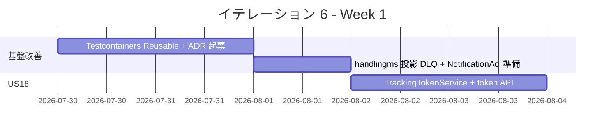

| 日 | タスク |
|----|--------|
| Day 1 | T1: Testcontainers Reusable 化、@Tag 除外解除、`./gradlew check` 安定確認 |
| Day 2 | T2/T3/T6 ADR-0012〜0014 起票 + handlingms フォールバック DLQ 設計 |
| Day 3 | US18 TrackingTokenService（TDD）、JWT 有効期限ロジック、ADR-0013 確定 |
| Day 4 | US18 POST /tracking/{tn}/token + GET /public/tracking/{tn} エンドポイント |
| Day 5 | US18 Spring Security 公開ルート設定 + 統合テスト |

### Week 2（Day 6-10）

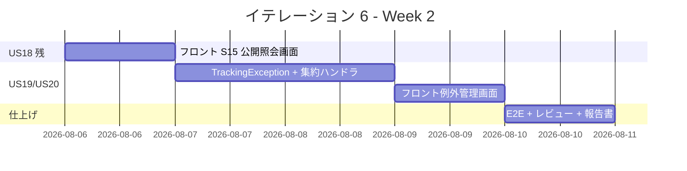

| 日 | タスク |
|----|--------|
| Day 6 | US18 フロント `TrackingPublicPage`（S15）、公開ルート、404 ハンドリング |
| Day 7 | US19 / US20 集約・例外エンティティ・投影・Controller |
| Day 8 | US19 / US20 NotificationAcl 拡張、escalation 通知、フロント例外管理画面 |
| Day 9 | E2E（US18 公開照会 + US19/20 例外登録）、SonarQube QG 確認 |
| Day 10 | マルチパースペクティブレビュー + 重要度「高」対応 + ふりかえり + 完了報告書 |

---

## 設計

> **注**: domain-model.md（Tracking Context: TrackingException / ExceptionType / ResponseStatus / TrackingTokenService）・data-model.md（tracking_exception テーブル、IT5 V2 で先行作成済み）・ui_design.md（S15 / S18 / S19）・ADR-0013（時限署名トークン）に準拠する。新規 ADR-0012（cross-service 冪等性・トランザクション境界）・ADR-0014（@ProcessingGroup 命名規約）を IT6 で起票する。

### 主要設計方針

- **時限署名トークン（JWT、ADR-0013、ui_design.md S15 準拠）**: JWT (HS256) の Claims は `tn`（追跡番号）/ `sub`（荷主 ID または荷受人 ID）/ `exp`（有効期限）/ `iat`（発行時刻）/ `role`（`SHIPPER` or `CONSIGNEE`）。追跡管理者が `POST /tracking/{tn}/token?role={SHIPPER|CONSIGNEE}&subjectId=<id>` で発行。公開エンドポイント `GET /public/tracking/{tn}` は Spring Security で `permitAll` とし、`PublicTrackingTokenFilter` で署名・期限・`tn` 一致を検証する。有効期限は **30 日**（配送完了後 + 7 日で自動失効、ui_design.md L737）。検証失敗時は **403 Forbidden**（ui_design.md L738 準拠、リソース存在秘匿）。
- **JWT 鍵管理（IT6 暫定 / IT8 本格）**: HS256 + 32 バイト以上。IT6 では Heroku Config Vars / 環境変数 `tracking.public-token.secret` で暫定運用。**ui_design.md L734 準拠の AWS Secrets Manager + 四半期ローテーションへの切替は IT8（非機能改善）で対応**（タスク 0.6 で ADR 起票）。
- **レート制限（IT6 暫定 / IT8 本格）**: ui_design.md L739 で公開エンドポイントは「同一 IP から 60 req/min、超過 429」が規定。IT6 では Spring Security の Bucket4j 統合を暫定でスキップし、**IT8 でリバースプロキシ層 or アプリ層 rate limit を本格実装**（ADR-0015 と統合）。本 IT では Heroku の標準制限のみで運用。
- **例外を集約内エンティティに**: `TrackingException` は `TrackingActivity` 集約内のエンティティ（domain-model.md M5）。集約識別子は `trackingNumber`、例外識別子 `exceptionId` は集約スコープ。例外履歴は集約の `List<TrackingException>` フィールドに格納し、Event Sourcing で完全再構築可能。
- **EXCEPTION 状態への遷移**: 既存 `TransportStatusTransition`（IT5）で {NOT_RECEIVED, RECEIVED, LOADED, IN_TRANSIT, UNLOADED, AWAITING_CLAIM} → EXCEPTION の遷移は許可済み。例外登録時に集約内で「現状態 → EXCEPTION」遷移を自動実行し、`TransportStatusUpdatedEvent` + `TrackingExceptionRegisteredEvent` の 2 件を順次発行。MISROUTED / DELIVERED 状態の貨物には例外登録不可（IllegalStateException）。
- **escalation の自動判定**: 集約内で `ExceptionType = LOSS` のときに `escalated = true` を自動設定し、`TrackingExceptionRegisteredEvent` と同時に `TrackingExceptionEscalatedEvent` を発行。`TrackingNotificationEventHandler` が `NotificationAcl.notifyExceptionEscalation` を呼び出して管理職通知のスタブ実行（実メール送信は 0.6 で外部連携 ADR を起票し IT8 で実装）。
- **公開照会のセキュリティ**: 推測困難な追跡番号（TRK- + 大文字英数 10 桁、36^10 ≒ 3.6×10^15 通り）+ JWT 署名で二重防御。トークン共有による情報漏洩リスクは荷主の責任範囲（メール文面に注意書き）。`PublicTrackingTokenFilter` は `Authorization` ヘッダではなく `?token=` クエリパラメータから読む（メール URL に埋め込み可能にする）。
- **TrackingTokenService の責務**: JWT 発行 / 検証 / 期限計算をすべてドメインサービスに集約。`@Value` で秘密鍵を注入し、jjwt 0.12+ で `Jwts.builder().subject(subjectId).claim("tn", trackingNumber).claim("role", role).expiration(...)` の構成。authms の `JwtTokenProvider` とは別鍵で区別。**domain-model.md L711-714 の `verify(token, deliveredAt)` シグネチャは旧仕様**。本 IT では `verify(token, expectedTrackingNumber)` に変更し、IT6 完了時に domain-model.md を更新する（変更点として注記）。
- **NotificationAcl 拡張（0.6 で実装基盤）**: 既存 `notifyTrackingIssued` / `notifyStatusChanged` / `notifyMisrouted` に加えて、`notifyExceptionRegistered` / `notifyExceptionResolved` / `notifyExceptionEscalation` を追加。`LoggingNotificationAcl` スタブを更新し、IT6 4.x で実メール送信 ADR-0015（仮）を起票して切替準備。
- **cross-service 経路は IT6 では最小**: 例外関連の cross-service イベント発信は本 IT 範囲外（trackingms 内で完結）。IT7 Billing 連携時に `CargoExceptionResolvedEvent` 等を shared 化する余地を残す。

### ドメインモデル（IT6 範囲）

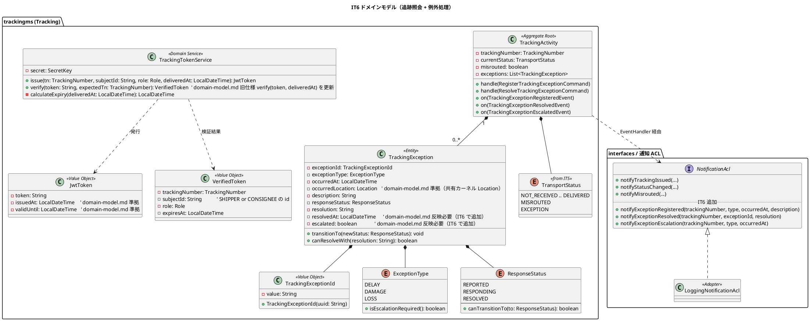

#### 集約の不変条件（IT6 関連）

- **TrackingActivity（拡張）**:
  - `RegisterTrackingExceptionCommand` は `currentStatus IN {NOT_RECEIVED, RECEIVED, LOADED, IN_TRANSIT, UNLOADED, AWAITING_CLAIM}` のときのみ受理。MISROUTED / DELIVERED / EXCEPTION 状態では `IllegalStateException`。
  - 受理時に集約内で `TransportStatusUpdatedEvent(currentStatus → EXCEPTION)` + `TrackingExceptionRegisteredEvent(exceptionId, type, ...)` を順次 apply。
  - `ResolveTrackingExceptionCommand` の `exceptionId` は集約の `exceptions` リストに存在する必要あり（不存在は `IllegalArgumentException`）。
  - 同一 `(trackingNumber, exceptionType, occurredAt の分粒度)` の重複登録は拒否（5 分以内に同種別の例外を登録不可、HandlingActivity IT5 3.2 と同じ規約）。
- **TrackingException**:
  - `exceptionType = LOSS` のとき `escalated = true` を集約コンストラクタで自動設定。
  - `responseStatus` の遷移は `REPORTED → RESPONDING → RESOLVED` の単方向のみ。逆行・スキップは `IllegalStateException`。
  - `resolution` は `responseStatus = RESOLVED` への遷移時のみ必須（空文字拒否）。
  - `resolvedAt` は `RESOLVED` 遷移時に集約側で `LocalDateTime.now()` で自動設定。
- **TrackingTokenService**:
  - 有効期限計算（ui_design.md L729 / L737 準拠）：発行時点から 30 日。配送完了済みなら `deliveredAt + 7 日` で頭打ち（配送完了後 7 日で自動失効）。
  - JWT subject は荷主 ID または荷受人 ID（ui_design.md L733）、`tn` claim に追跡番号、`role` claim に `SHIPPER` / `CONSIGNEE`、issuer は `trackingms`。
  - 検証時に `tn claim == 期待追跡番号` を厳密チェック（トークン取り違えの防止）。失敗時は **403 Forbidden**。

### 状態遷移（例外発生 → 対応 → 解決）

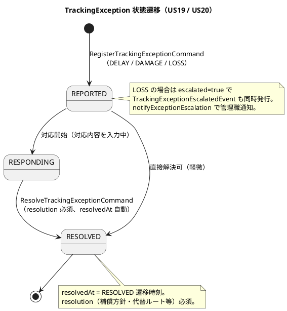

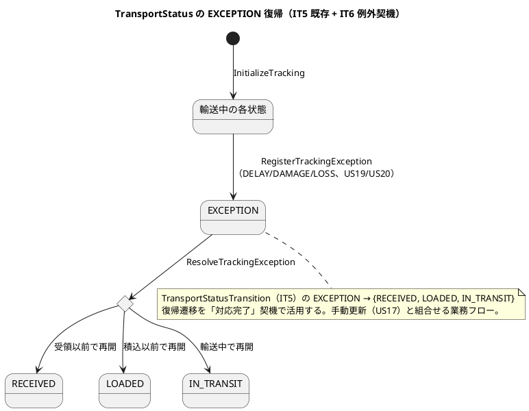

### データモデル

`tracking_exception` テーブルは IT5 Flyway V2 で先行作成済み（data-model.md L564-578 準拠）。IT6 では Flyway V4 で `tracking_summary.delivered_at` カラムが既に存在することの確認のみ。新規テーブル追加なし。

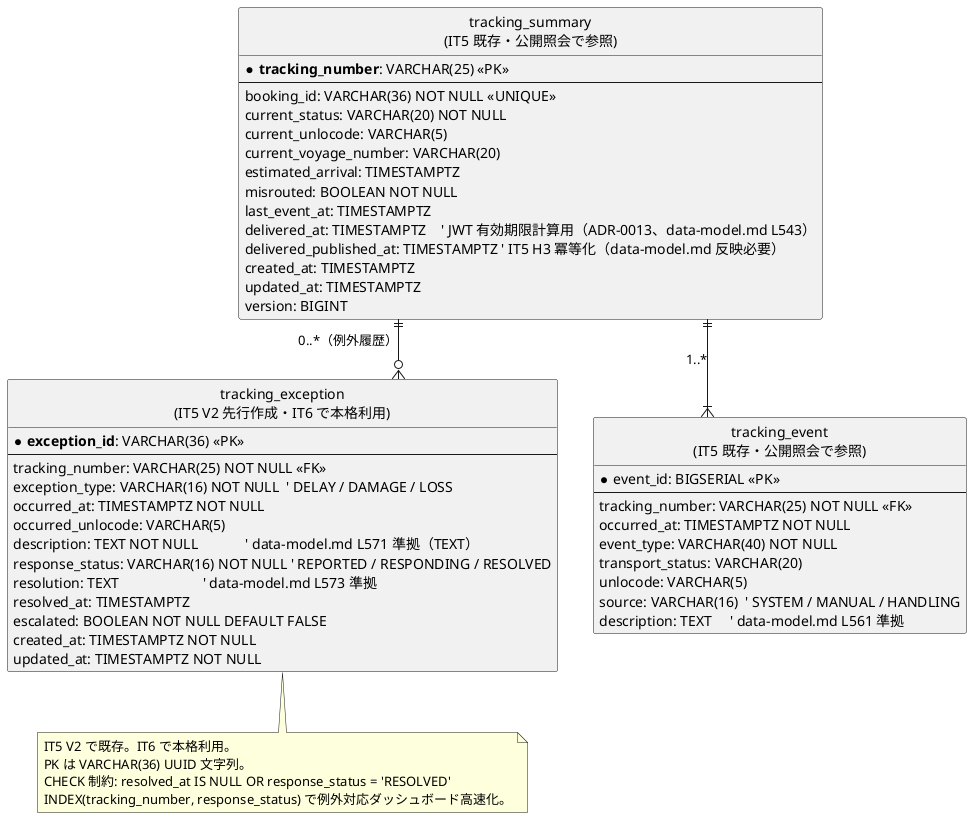

> **インデックス・制約（data-model.md L610-611 準拠、IT6 追加なし）**:
> - `tracking_exception`: `INDEX(tracking_number, response_status)` / `INDEX(tracking_number, occurred_at)` / `CHECK(resolved_at IS NULL OR response_status = 'RESOLVED')`
> - `tracking_summary.delivered_at`: 既存カラム、ADR-0013 で JWT 有効期限計算に使用

### ユーザーインターフェース

> ui_design.md の画面 ID・パス・ロールに準拠する。本 IT で追加する画面は S15（公開）・S18（追跡管理）・S19（追跡管理）の 3 枚。フロントは React + Vite + React Router。S15 のみ `PrivateRoute` 除外（公開ルート）。フォームは送信成功で関連画面へ PRG 遷移、バリデーションエラーは自己ループ。フィードバックは IT1-IT5 と同じ alert 表示パターン。

| 画面 ID | 画面 | パス | ロール | タイプ | 対応ストーリー |
|---------|------|------|--------|--------|---------------|
| S15 | 追跡照会（公開）| `/tracking/:trackingNumber?token=<JWT>` | 公開（ログイン不要）| シングル | US18（追跡情報照会） |
| S18 | 例外登録 | `/tracking/:trackingNumber/exceptions/new` | 追跡管理・荷役 | フォーム | US19（遅延）・US20（破損/紛失） |
| S19 | 例外対応一覧 | `/tracking/exceptions` | 追跡管理 | コレクション | US19（対応入力）・US20（escalation 表示） |

> 既存連携: S16 追跡管理一覧 → S18 例外登録（追跡番号引き継ぎ）、S19 → S17 追跡詳細・管理（対応詳細）、Navigation に「例外対応」リンク追加（ROLE_ADMIN + ROLE_TRACKER）。

#### ビュー

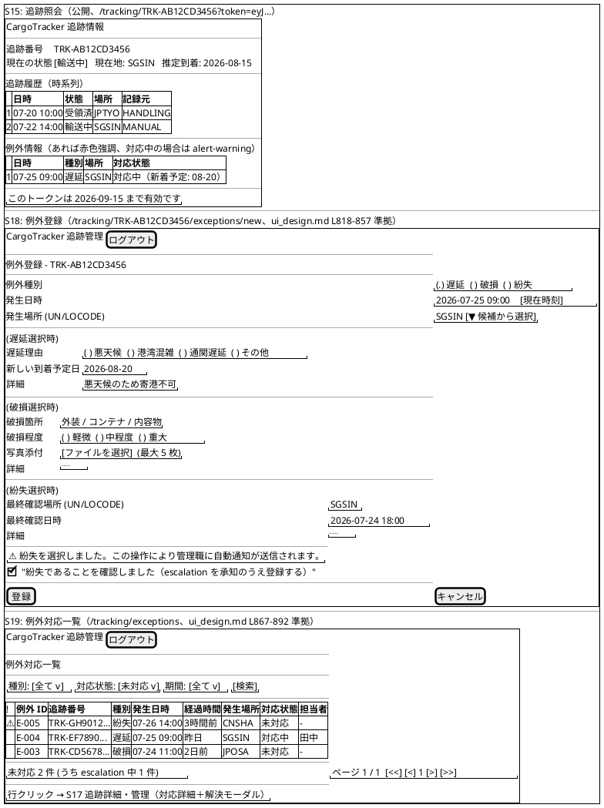

#### モデル

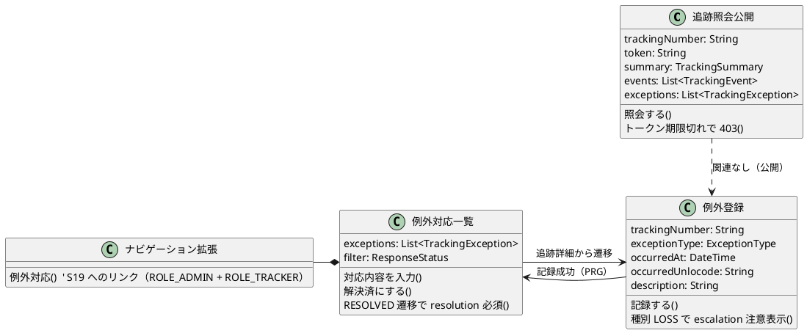

#### インタラクション

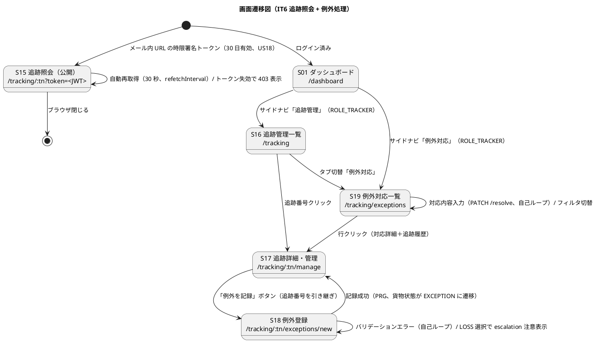

#### フィードバックメッセージ

| 種別 | 契機 | メッセージ例 | スタイル |
|------|------|-------------|---------|
| 成功 | 例外登録（DELAY/DAMAGE）| 「例外を記録しました。荷主に通知を送信しました」 | `alert-success` |
| 成功 | 例外登録（LOSS）| 「紛失例外を記録しました。管理職に escalation 通知を送信しました」 | `alert-success` |
| 成功 | 対応内容更新（RESPONDING）| 「対応内容を更新しました」 | `alert-success` |
| 成功 | 解決済へ遷移（RESOLVED）| 「例外を解決済としてクローズしました」 | `alert-success` |
| 警告 | 公開照会で対応中例外あり | 「現在、貨物に例外（遅延）が発生しています。対応状況: 対応中（新到着予定: ...）」 | `alert-warning` |
| エラー | トークン期限切れ・無効 | 「このリンクは有効期限切れです。担当者に再発行を依頼してください」 | `alert-error` |
| エラー | 追跡番号不在（公開照会）| 「追跡番号が見つかりません」 | `alert-error` |
| エラー | EXCEPTION 状態で例外登録 | 「すでに例外発生中の貨物には新規例外を登録できません」 | `alert-error` |
| エラー | resolution 空で RESOLVED 遷移 | 「対応内容を入力してから解決済にしてください」 | `alert-error` |

### API 設計（IT6 追加分）

| メソッド | エンドポイント | 認証 | 説明 | ストーリー | サービス |
|---------|---------------|------|------|-----------|---------|
| POST | `/api/v1/tracking/{trackingNumber}/token` | ROLE_TRACKER + ROLE_ADMIN | 公開照会用 JWT 発行（有効期限を返す） | US18 | trackingms |
| GET | `/api/v1/public/tracking/{trackingNumber}?token=<JWT>` | **permitAll**（PublicTrackingTokenFilter で検証）| 公開追跡照会（summary + events + exceptions）| US18 | trackingms |
| POST | `/api/v1/tracking/{trackingNumber}/exceptions` | ROLE_TRACKER + ROLE_HANDLER + ROLE_ADMIN | 例外登録（DELAY / DAMAGE / LOSS）| US19・US20 | trackingms |
| PATCH | `/api/v1/tracking/{trackingNumber}/exceptions/{exceptionId}` | ROLE_TRACKER + ROLE_ADMIN | 対応内容更新（RESPONDING へ遷移）| US19・US20 | trackingms |
| PATCH | `/api/v1/tracking/{trackingNumber}/exceptions/{exceptionId}/resolve` | ROLE_TRACKER + ROLE_ADMIN | RESOLVED へ遷移（resolution 必須）| US19・US20 | trackingms |
| GET | `/api/v1/tracking/{trackingNumber}/exceptions` | ROLE_TRACKER + ROLE_ADMIN / 公開（JWT 検証）| 例外一覧 | US18・US19・US20 | trackingms |
| GET | `/api/v1/tracking/exceptions?responseStatus={REPORTED,RESPONDING,RESOLVED}` | ROLE_TRACKER + ROLE_ADMIN | 全例外横断一覧（S19 例外対応一覧）| US19・US20 | trackingms |

> エンドポイントは実装時に確定し、`docs/design/architecture_backend.md` の API カタログへ随時追記する（DoD）。

### イベントフロー（cross-service と内部）

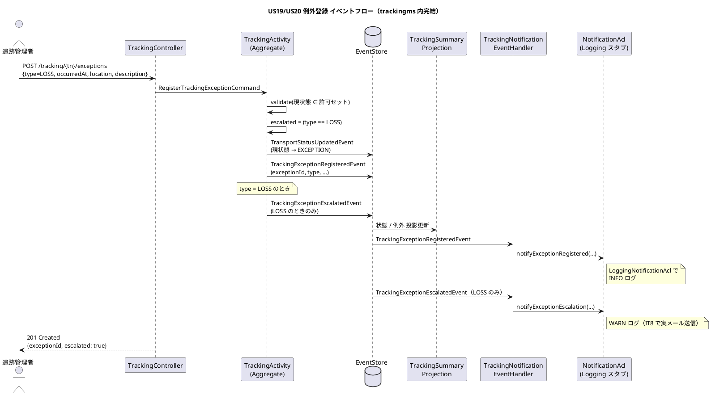

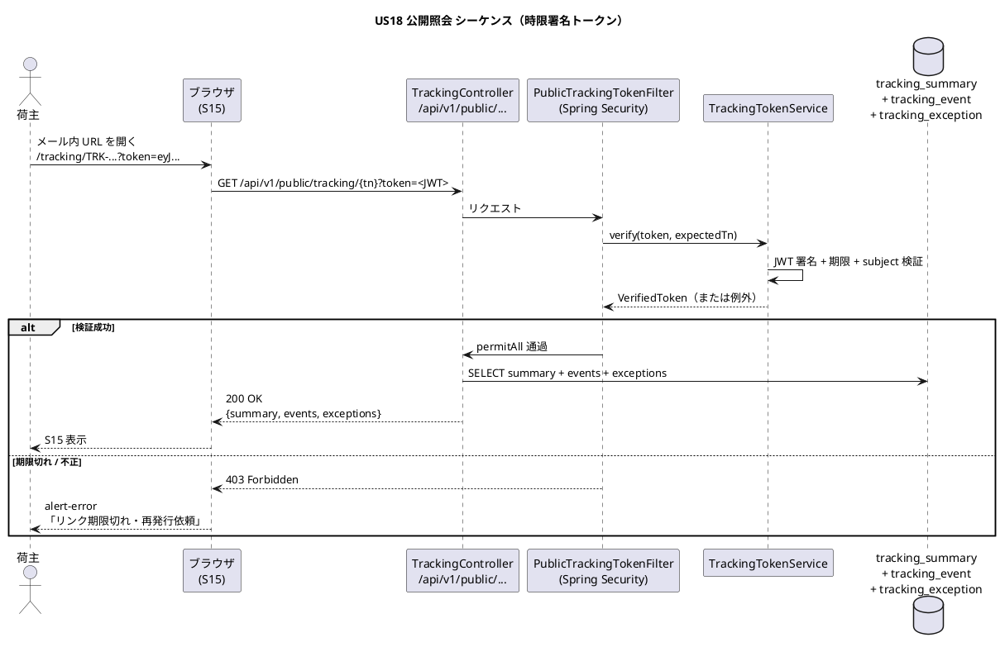

### ディレクトリ構成（IT6 追加分）

```text
apps/backend/trackingms/src/main/java/com/example/trackingms/
├─ domain/model/TrackingException.java                       # 集約内エンティティ
├─ domain/model/TrackingExceptionId.java                     # 値オブジェクト
├─ domain/model/ExceptionType.java                          # enum (DELAY / DAMAGE / LOSS)
├─ domain/model/ResponseStatus.java                         # enum (REPORTED / RESPONDING / RESOLVED)
├─ domain/services/TrackingTokenService.java                # JWT 発行・検証（jjwt 0.12+）
├─ domain/services/PublicTrackingTokenFilter.java           # Spring Security 公開ルート用フィルタ
├─ domain/commands/RegisterTrackingExceptionCommand.java
├─ domain/commands/UpdateTrackingExceptionResponseCommand.java
├─ domain/commands/ResolveTrackingExceptionCommand.java
├─ domain/events/TrackingExceptionRegisteredEvent.java
├─ domain/events/TrackingExceptionUpdatedEvent.java
├─ domain/events/TrackingExceptionResolvedEvent.java
├─ domain/events/TrackingExceptionEscalatedEvent.java
├─ domain/projections/TrackingExceptionView.java            # POJO + ResultMap
├─ infrastructure/repositories/mybatis/TrackingExceptionMapper.java
├─ infrastructure/outboundservices/notification/NotificationAcl.java   # 既存に 3 メソッド追加
├─ interfaces/rest/PublicTrackingController.java            # GET /public/tracking/{tn}
├─ interfaces/rest/TrackingExceptionController.java         # POST/PATCH/GET /tracking/{tn}/exceptions
├─ interfaces/rest/dto/RegisterExceptionRequest.java / UpdateExceptionRequest.java / TrackingExceptionResponse.java
├─ interfaces/events/TrackingNotificationEventHandler.java  # 既存に 3 ハンドラ追加
└─ config/SecurityConfig.java                              # /public/** を permitAll に追加

apps/frontend/src/features/tracking/
├─ api/trackingApi.ts                                       # 既存に getPublic / token 発行 / 例外関連 4 API 追加
├─ pages/TrackingPublicPage.tsx                             # S15 公開照会（PrivateRoute 除外）
├─ pages/ExceptionRegisterPage.tsx                          # S18 例外登録
├─ pages/ExceptionListPage.tsx                              # S19 例外対応一覧
└─ pages/__tests__/                                         # Vitest（公開 / 登録 / 対応）

apps/frontend/src/App.tsx                                   # /public/tracking/:tn と /tracking/exceptions ルート追加
apps/frontend/src/components/layout/Navigation.tsx          # 「例外対応」リンク追加

apps/backend/trackingms/src/main/resources/
├─ application.yml                                          # tracking.public-token.secret / audience 等
└─ db/migration/V4__noop_or_indexes.sql                    # 既存 tracking_exception の index 追加（任意）

docs/adr/
├─ 0012-cross-service-idempotency-and-transactions.md       # cross-service 冪等性・トランザクション境界
├─ 0013-public-tracking-token.md                           # 時限署名トークン採用
└─ 0014-processing-group-naming.md                         # @ProcessingGroup 命名規約
```

### バリデーション / セキュリティ

| 観点 | 規約 |
|------|------|
| **JWT 鍵長** | HS256 + 32 バイト以上（authms と別鍵、`tracking.public-token.secret` 環境変数）|
| **JWT 有効期限** | `delivered_at + 30 日`（未配送なら `arrival_deadline + 30 日`、MAX `now + 90 日`）|
| **JWT subject 検証** | 公開エンドポイントの `{trackingNumber}` パス変数と JWT subject の完全一致を強制（トークン取り違え防止）|
| **公開ルート CORS** | `/api/v1/public/**` のみ `*` 許可。それ以外は既存 `https://<frontend>` のみ |
| **rate limit（将来）** | 公開エンドポイントは IP 単位の rate limit を IT8 で検討（本 IT 範囲外）|
| **resolution 最小長** | RESOLVED 遷移時の `resolution` は 10 文字以上必須（雑な「OK」を拒否）|
| **occurredAt の制約** | 過去または現在のみ受理（HandlingActivity IT5 3.2 と同規約）|
| **description 最大長** | アプリ層で 1000 文字制限（DB は `TEXT` で上限なし、data-model.md L571 準拠）|

### ロール / 認可

| ロール | 権限 |
|--------|------|
| 公開（未認証）| S15 のみ（`?token=` 必須）|
| ROLE_TRACKER | S16 / S17 / S18 / S19 + 例外登録 / 対応更新 / 解決 + トークン発行 |
| ROLE_HANDLER | S18 例外登録のみ（現場で発見した破損・紛失を記録）|
| ROLE_ADMIN | 全権限 |

> 既存 IT5 の ROLE_TRACKER / ROLE_HANDLER / ROLE_ADMIN の拡張。Navigation.test.tsx に IT6 関連ロール表示テストを追加する。

---

## リスク

| リスク | 影響 | 対策 |
|--------|------|------|
| 時限署名トークンの設計（鍵管理・有効期限・失効）| 高 | ADR-0013 で方針を明文化。鍵は Heroku Config Vars + jwt.secret-key。失効は MVP では未実装（有効期限切れで自動失効） |
| Testcontainers Reusable 化が技術的に困難（Spring Context キャッシュ互換問題）| 中 | T1 の代替として一意 topic prefix + @DirtiesContext 段階導入。完全解決を IT7 持ち越し可 |
| handlingms DLQ 設計（T5）が IT5 Try の中で最も重い | 中 | 0.5 で 4h 確保。事前到着 / 後追い update の 2 段戦略を ADR-0012 と統合 |
| 例外イベントの cross-service 配信が複数（NotificationAcl 拡張）| 中 | 既存 TrackingNotificationEventHandler に新ハンドラ追加で対応、ADR-0011 ホワイトリスト適用 |
| US18 の公開エンドポイントの SQL Injection / トークン漏洩 | 中 | Spring Security + JWT のベストプラクティス、Bouncy Castle 不使用、HS256 鍵長 32 バイト以上 |

---

## IT5 ふりかえり Try との対応

| Try ID | 内容 | IT6 対応 |
|--------|------|----------|
| **T1** | Testcontainers Reusable で Kafka container race 構造的解決 | **タスク 0.1（Day 1、最優先）** |
| **T2** | cross-service 冪等性・トランザクション境界 ADR | タスク 0.2（ADR-0012） |
| **T3** | @ProcessingGroup 命名規約 ADR | タスク 0.4（ADR-0014） |
| **T4** | 業務適合性向上（通知記録 UI / バーコード / 営業画面） | US19/US20 の NotificationAcl 拡張で部分対応、残りは IT7 |
| **T5** | handlingms フォールバック投影根本対処 | タスク 0.5（DLQ 風 pending_handling_activity）|
| **T6** | フロント型 OpenAPI 自動生成 | IT7 持ち越し（IT6 範囲外）|
| **T7** | マルチパースペクティブレビュー固定化 | タスク 4.3 で継続実施 |

## IT5 レビュー高優先度指摘との対応

| 指摘 ID | 内容 | IT6 対応方針 |
|---------|------|--------------|
| **H1** | `release_plan.md` の IT5 進捗反映 | **対応済み**（IT5 完了時の `tracking-progress --update` で反映済み） |
| **H2** | handlingms `UNKNOWN-BOOKING` フォールバック根本対処 | **タスク 0.5**（DLQ 風 `pending_handling_activity` 待避テーブル + CargoSnapshot 到着時 retro-update） |
| **H3** | `CargoDeliveredEventPublisher` 再生時重複発行リスク | **タスク 0.2 ADR-0012** で冪等化方針を明文化（`tracking_summary.delivered_published_at` 列はすでに追加済み） |
| **H4** | S20 荷役作業記録の連続入力 / バーコード対応 | **IT7 持ち越し**（業務適合性向上、レビュー残バックログ M6 と統合） |
| **H5** | MISROUTED 後の救済動線（再経路設計差し戻し） | **IT7 持ち越し**（routingms / bookingms 横断改修のためスコープが大きい、user_story.md へのストーリー追加で対応 — IT6 範囲外と明示） |
| **H6** | `TrackingControllerIntegrationTest.hasSize(7)` 緩和の根本対処 | **タスク 0.1 のサブ**として、Reusable 化と併せて `@DirtiesContext(BEFORE_CLASS)` or event store クリーンで H2 replay 汚染を解消し、`hasSize(7)` に戻す |
| **H7** | `HandlingActivityKafkaIntegrationTest` の publish 未 verify | **タスク 0.1 のサブ**として、テスト名を「ローカル投影到達」に変更（container 廃止）または consumer record を assert する形に修正 |

## レビュー残バックログ（IT5 中・低指摘 22 件）

GitHub Issue 化を IT6 序盤で実施推奨。コードベース全体の改善として継続的に消化する。

- programmer 系：shared HandlingTypeCode 化（M1）/ Controller 非同期化（M2）/ Clock 注入（L1-L4）
- architect 系：BookingSagaManager itinerary 型を shared LegData に（M3）/ shared HandlingActivityRegisteredEvent 改名（L6）
- writer 系：architecture_backend API カタログ追記（M5）
- tester 系：Mock 暗黙前提（M10）/ E2E helper 抽出（L12）
- user 系：通知記録 UI（M7）/ EXCEPTION 補助（M8）/ 営業読み取り画面（L7）

## 完了条件

### Definition of Done

- [ ] US18 / US19 / US20 の受入基準すべて充足（ストーリーマトリックス参照）
- [ ] バックエンド全モジュール `./gradlew check` PASS（Kafka 統合テストは @Tag 除外解除後の通常 check に含む、IT5 H6/H7 持ち越し T1 解消後）
- [ ] フロント `npm run test:run` 全件 PASS、E2E（Playwright）45 件 +α PASS
- [ ] SonarQube ライブスキャン Backend/Frontend 両プロジェクト Quality Gate **OK**
  - Bug 0 / Vulnerability 0 / Code Smell 0 / Security Hotspot 0
  - new_coverage 70% 以上、全体カバレッジ Backend 85% 以上 / Frontend 75% 以上
- [ ] マルチパースペクティブレビュー（5 エージェント）実施・重要度「高」全件対応済み
- [ ] iteration_plan-6.md の全タスク [x] マーク、retrospective-6.md / iteration_report-6.md 作成
- [ ] release_plan.md / docs index.md / mkdocs.yml に IT6 完了反映
- [ ] GitHub Issue（take-5 US18/US19/US20）クローズ

### デモ項目

1. 追跡管理者が `POST /tracking/{tn}/token` で公開照会トークンを発行（US18）
2. 荷主が `/tracking/TRK-...?token=<JWT>` をブラウザで開き、ログイン不要で追跡情報を照会（US18）
3. トークン期限切れ・無効トークンで 401/403 を確認（US18）
4. 追跡管理者が S18 例外登録画面で「遅延」を記録 → 貨物状態が EXCEPTION に遷移、荷主通知ログを `LoggingNotificationAcl` で確認（US19）
5. S19 例外対応一覧から対応内容を入力して RESOLVED 遷移（US19）
6. 「紛失」を記録 → `escalated=TRUE` の自動設定と管理職向け WARN ログを確認（US20）
7. cross-service E2E（CROSS_SERVICE_E2E=1）で US18 公開照会 + US19/US20 例外登録の貫通検証

## 更新履歴

| 日付 | 更新内容 | 更新者 |
|------|---------|--------|
| 2026-05-29 | 初版作成（US18/US19/US20 + IT5 ふりかえり Try T1-T5 取込、9 SP / 2 週間） | k2works |
| 2026-05-29 | validating-iteration-plan による検証修正（S18/S19 を ui_design.md に整合、画面遷移図追加、完了条件 / 更新履歴セクション追加） | k2works |
| 2026-05-29 | iteration_plan-5.md パターンに合わせて設計セクション拡充（PlantUML 7 種・Salt 図・API 表・ディレクトリ構成・バリデーション/ロール表） | k2works |
| 2026-05-29 | 2 回目の validating-iteration-plan 検証修正：domain-model.md 準拠で `occurredLocation: Location` / `LocalDateTime` 統一、data-model.md 準拠で `TIMESTAMPTZ` / `TEXT` 統一、ui_design.md 準拠で JWT Claims（`sub` = 荷主 ID、`tn` claim、`role`）/ 403 Forbidden / S18 動的フォーム / S19 期間フィルタ反映、IT5 レビュー H5/H6/H7 対応方針を明文化（タスク 0.1 を 5h に拡張、IT7 持ち越し方針注記） | k2works |
| 2026-05-29 | IT6 着手（Ralph Loop iteration 1）：タスク 0.2/0.3/0.4 ADR 起票完了、タスク 1.1 TrackingTokenService TDD 完了（10/10 PASS）、タスク 0.1 H6/H7 は IT5 既存対応確認済み（T1 Testcontainers Reusable は構造変更のため確認必須として保留） | k2works |
| 2026-05-29 | Ralph Loop iteration 2：タスク 1.2 POST /tracking/{tn}/token 完了（TrackingControllerTest 14/14 PASS）、タスク 1.3 PublicTrackingTokenFilter + GET /public/tracking 完了（Filter 単体 6/6 + 統合 5/5 PASS）。trackingms は Spring Security 未導入のため OncePerRequestFilter で実装、認可は IT8 で統一導入予定 | k2works |
| 2026-05-29 | Ralph Loop iteration 3：US18 フロント完成。タスク 1.4 + 1.5 TrackingPublicPage 完了（Vitest 6/6 + 全体 193/193 PASS）、タスク 1.6 E2E public-tracking.spec.ts 追加。ESLint / vite build / 全体テスト すべて PASS。US18（5 SP）100% 完了、IT6 進捗 5/9 SP（56%） | k2works |

## 参照

- [IT6 範囲：US18-US20 ユーザーストーリー](../requirements/user_story.md)
- [IT5 完了報告書](iteration_report-5.md)
- [IT5 ふりかえり](retrospective-5.md)
- [IT5 マルチパースペクティブレビュー](../review/IT5_review_20260529.md)
- [リリース計画](release_plan.md)
- [ドメインモデル設計（Tracking Context / TrackingException）](../design/domain-model.md)
- [データモデル設計（tracking_exception テーブル）](../design/data-model.md)
- [ADR-0009 cross-service イベント連携](../adr/0009-cross-service-event-coordination.md)
- [ADR-0011 Kafka tracking エラーハンドリング](../adr/0011-kafka-tracking-error-handling-policy.md)
