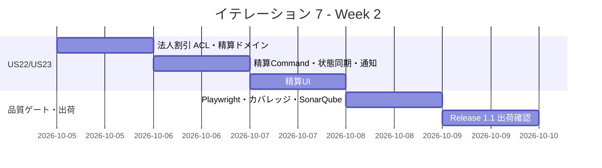
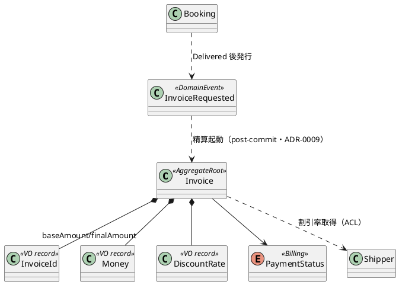

# イテレーション 7 計画

## 概要

| 項目 | 内容 |
|------|------|
| **イテレーション** | 7 |
| **期間** | 2026-09-28 〜 2026-10-09（2 週間） |
| **ゴール** | 配送完了した予約の輸送料金算出・法人割引適用・精算書発行と入金確認が動作し、Release 1.1 を出荷する |
| **目標 SP** | 13（US21 / US22 / US23）+ IT6 フィードバック（レビュー H1/H2・繰り越し品質ゲート）の消化 |

---

## ゴール

### イテレーション終了時の達成状態

1. **輸送料金の算出**: 経理担当者が「引取済/配送完了」（`BookingStatus.Delivered`）の予約に対し、輸送実績（経路・重量・貨物種別・荷役実績）をもとに基本料金を算出し確定できる（US21）。予約確定（Delivered）を起点に `InvoiceRequested` イベントで精算を開始する。
2. **法人割引の適用**: 法人荷主の場合、契約割引率（`CorporateShipper.DiscountRate`・0〜30%）を ACL 経由で取得し基本料金に自動適用、割引後の最終金額を算出する。個人荷主は割引なし（US22）。
3. **精算処理**: 確定料金から精算書（`Invoice`・請求番号・請求金額・支払期限）を発行し、荷主に通知（記録で代替）、入金確認により `PaymentStatus` を Confirmed・予約状態を精算済（`BookingStatus.Settled`＝domain-model BR4 の `Delivered → Settled`）へ更新する。支払期限超過は Overdue として未払い通知を記録する（US23）。
4. **Release 1.1 出荷**: IT6 の例外対応と本 IT の請求・精算で Phase 2 が完了し、Release 1.1（例外対応・請求）の出荷条件を満たす。

### 成功基準

- [x] US21・US22・US23 の受入条件をすべて満たす
- [x] `Invoice` 集約（`Money`・`DiscountRate`・`PaymentStatus`）を domain-model 準拠で実装し、基本料金・割引・最終金額の一貫性と金額境界（Money 最小通貨単位・割引上限 30%・銀行家丸め）を単体テストで網羅する
- [x] 入金確認で `PaymentConfirmedEvent`（Billing→Booking）を post-commit で発行し予約を Settled へ同期（ADR-0009 準拠）※精算開始は InvoiceRequested 自動起票ではなく GenerateInvoiceCommand 手動発行として実装（Delivered 制限で担保・domain-model 補足済み）
- [x] 法人割引率を Shipper Context から ACL（プリミティブ DTO・SQL 直接参照）で取得し、Billing が Shipper の内部型に依存しない（ArchUnit ルール 7 追加）
- [x] 入金確認で `PaymentStatus` Confirmed・予約状態 精算済（Settled）への同期が動作する
- [x] **改善バックログ #16/#17 の消化**: 精算書発行の Delivered 制限（Delivered 未満は発行不可）、用語統一（Invoice の日本語表記を「精算書」に統一）
- [x] **IT6 レビュー高優先の消化**: H1（対応報告の荷主通知記録）・H2（変換ヘルパの Shared 集約・EnumDbCodec/DatabaseTimestamp）・M1（例外通知冪等化）
- [ ] **繰り越し品質ゲートの決着（4 IT 連続繰り越しを止める）**: Playwright E2E・カバレッジ 85% CI ハードゲート・SonarQube SQ-3/SQ-2 ※環境操作前提で繰り越し。ドメイン被覆は Invoice 95.2%/Money 86.7% を実測

### アプローチ（開発戦略: 終盤アウトサイドインの最終イテレーション）

[開発戦略](./development_strategy.md#終盤-アウトサイドインit6-7) に従い、IT7 は**終盤・アウトサイドインの最終イテレーション**。中盤までに整った Booking/Shipper のドメイン中核を再利用し、料金算出→割引→精算書発行→入金確認の業務フローを受け入れテスト（Web.Tests）起点で一気通貫に結合する。

- モックは「まだ無い部分」（決済機関＝`IPaymentGatewayPort`・通知の実送信）だけに限定し、確立済みのドメイン・インフラ（Cargo の Delivered・CorporateShipper の割引率・post-commit イベント基盤・ACL パターン）は実物を使って結合する。
- **IT6 レビュー高優先（H1/H2）と繰り越し品質ゲートを Week 1 前半に先行消化**してから US21-23 を積む。特に H2（変換ヘルパ Shared 集約）は Billing の新規リポジトリで同変換を再利用する前に完了し、負債の再拡大を防ぐ。
- Release 1.1 出荷イテレーションのため、Day 10 に Release 1.1 リリース条件（[release_plan.md](./release_plan.md)）の充足を確認し、`developing-release` でのリリース準備に接続する。

---

## ユーザーストーリー

### 対象ストーリー

| ID | ユーザーストーリー | SP | 優先度 |
|----|-------------------|----|----|
| US21 | 輸送料金を算出する | 5 | 中 |
| US22 | 法人割引を適用する | 3 | 中 |
| US23 | 精算を処理する | 5 | 中 |
| **合計** | | **13** | |

### ストーリー詳細

#### US21: 輸送料金を算出する（UC17）

**ストーリー**:
> 経理担当者として、配送完了した予約に対して輸送実績（経路・重量・貨物種別・荷役実績）をもとに輸送料金を算出したい。なぜなら、実際の輸送内容に基づく正確な料金を算出し、精算に進めるからだ。

**受入条件**:

1. 「引取済/配送完了」（`BookingStatus.Delivered`）状態の予約に対して料金算出を開始できる（Delivered 未満は不可＝改善 #16）
2. 輸送実績（経路・距離・重量・貨物種別・荷役作業実績）が表示される
3. 基本料金が自動計算される（`Money` 最小通貨単位・重量/貨物種別ベースのスタブ算出。将来の料金表連携はアダプター差し替え）
4. 算出結果を確認して確定操作ができる
5. 確定後、輸送料金が「確定」状態で登録される

#### US22: 法人割引を適用する（UC17）

**ストーリー**:
> 経理担当者として、法人荷主の場合に、契約割引率を基本料金に自動適用して割引後の請求金額を確定したい。なぜなら、法人契約条件に基づく正確な割引を自動化し、手計算ミスを防ぐからだ。

**受入条件**:

1. 荷主種別が「法人」の場合、料金算出時に契約割引率（`CorporateShipper.DiscountRate`）が自動的に取得・表示される
2. 割引率（0〜30%）が基本料金に適用され、割引後の金額が表示される（`Invoice.ApplyDiscount`・銀行家丸め）
3. 個人荷主の場合は割引が適用されない
4. 割引計算の根拠（割引率・基本料金・割引後料金）が精算書に記載される（`invoice_line_item`）

#### US23: 精算を処理する（UC18）

**ストーリー**:
> 経理担当者として、確定した輸送料金をもとに精算書を発行し、荷主への通知・入金確認・精算完了処理を行いたい。なぜなら、精算業務を一元管理し、入金状況を追跡して確実に精算を完了できるからだ。

**受入条件**:

1. 「確定」状態の輸送料金をもとに精算書（`invoice_number`・請求金額・`due_date`）を発行できる
2. 精算書が荷主に通知される（AC。本 IT では通知記録で代替・IT6 の通知記録方針を踏襲）
3. 決済機関との連携（`IPaymentGatewayPort`・本 IT はスタブ）により入金確認ができる
4. 入金確認後、`PaymentStatus` が Confirmed に更新され予約状態も精算済（`BookingStatus.Settled`）になる
5. 支払期限超過時、経理担当者に未払い通知（`PaymentStatus.Overdue`）が記録される

### タスク

> 進め方はアウトサイドイン（受け入れテスト → プレゼン → アプリ → ドメイン → インフラ）。Week 1 前半に IT6 レビュー是正（H1/H2）と品質ゲートを先行消化する。

#### 0. Day 1 設計反映・局面継続チェック・IT6 レビュー是正・負債返済（先行）

| # | タスク | 見積もり | 担当 | 状態 |
|---|--------|---------|------|------|
| 0.1 | 【Day 1・着手前】設計反映：(a) Billing Context の Invoice 集約（Money・DiscountRate・PaymentStatus・ApplyDiscount/ConfirmPayment）・`InvoiceRequested` イベントを domain-model に確定、(b) invoice/invoice_line_item/payment テーブル（0016 以降・二方言。0015 は例外通知冪等キーで使用済み）を data-model と突合、(c) 精算書一覧/詳細（`/billing/invoices`・`/billing/invoices/{id}`）を ui_design 画面一覧と整合。局面継続チェック（アウトサイドイン・ArchUnit グリーン・UoW 基盤動作）。用語統一（Invoice=「精算書」＝改善 #17） | 4h | - | [x]（data-model invoice を実装（Money base/final・discount_rate・shipper・version・0016）へ再構成。domain-model に FreightCalculator/PaymentConfirmedEvent/GenerateInvoiceCommand 手動発行/ACL を補足。ui_design を実装エンドポイント/精算明細に整合。用語統一（精算書＝#17）） |
| 0.2 | IT6 レビュー H2 / IT5 Try T1：変換ヘルパを Shared に集約。`Shared.Infrastructure.Persistence` に `DatabaseTimestamp`（ToDatabaseTimestamp）と `EnumDbCodec.ToScreamingSnake/FromScreamingSnake` を新設し、Booking/Routing/Tracking の既存 8 箇所を一括で巻き取る（部分適用禁止）。Billing の新規リポジトリは最初から共通版を使用。全テスト緑で担保 | 5h | - | [x]（DatabaseTimestamp/EnumDbCodec 新設・往復 9 テスト。Infrastructure 層 6 リポジトリ＋Cargo/Tracking の enum 変換を共通版へ。SearchVoyagesQueryService は Application 層のため ArchUnit ルール 3 遵守でインライン保持。全 264 テスト緑） |
| 0.3 | IT6 レビュー H1：対応報告（ResolveException）時の荷主通知を append-only 記録（US19 AC4/US20 AC5 の完全充足）＋テスト | 2h | - | [x]（TrackingExceptionResolvedEvent＋NotifyOnTrackingExceptionResolvedHandler＋ExceptionNotification.ForResolution。統合テストで対応報告通知記録を検証） |
| 0.4 | IT6 レビュー M1：例外通知ハンドラの冪等性統合テスト（同一イベント 2 回処理で二重記録されない）を追加、または exception_notification に冪等キー/一意制約を導入。ADR-0009 コンプライアンス達成 | 3h | - | [x]（自然キー一意インデックス 0015・二方言＋SaveAsync 存在チェックで冪等化。2 回処理で二重記録なしを統合テストで検証） |
| 0.5 | ArchUnit：Billing BC の依存ルール（他 BC の `.Domain.Model` 非依存・Shipper 割引率は ACL 経由）を追加（ルール 7） | 2h | - | [x]（ルール 7 追加＝Billing は他 BC の `.Domain.Model` 非依存。Arch 8→9 緑） |

**小計**: 16h（理想時間）

> **IT6 レビュー中・低優先の対応方針**: M2（data-model の exception_notification 追記）・M3（ui_design の例外ワイヤー追随・対応報告画面追記）は 0.1 の設計反映と合流。M4（escalation_flag 一致テスト）・M5（SQLite 照会往復）・M6（US20 解決 Web 受け入れ・location 空検証）は品質ゲート枠（3.x）で消化。詳細は [開発成果物レビュー（IT6）](../review/開発成果物_IT6_review_20260714.md)。

#### 1. US21 輸送料金を算出する（5 SP）

| # | タスク | 見積もり | 担当 | 状態 |
|---|--------|---------|------|------|
| 1.1 | 【Phase 1・Red】料金算出の業務シナリオ受け入れテスト（Web.Tests）：Delivered 予約→料金算出→基本料金確定を一気通貫でアサート。Delivered 未満は算出不可（#16） | 3h | - | [ ] |
| 1.2 | invoice/invoice_line_item/payment テーブル（0016・二方言）＋モデル定義 | 3h | - | [x]（0016 二方言＋InvoiceRepository（ヘッダ upsert・明細 delete→再挿入・Money 保持・due_date は DateOnly）。往復保存を PostgreSQL 統合で検証 +2 緑） |
| 1.3 | `Invoice` 集約・`Money`（最小通貨単位・Add/Multiply 銀行家丸め）・基本料金算出（重量/貨物種別スタブ）＋ドメインユニットテスト（金額境界） | 5h | - | [x]（Money/DiscountRate/PaymentStatus/Invoice 集約＋ドメイン +15。基本料金算出スタブは 1.4 の CommandService で接続） |
| 1.4 | `GenerateInvoiceCommand` / CommandService（Delivered 制限・`InvoiceRequested` 消費または Booking 起点）＋統合テスト | 4h | - | [x]（GenerateInvoiceCommandService＝Delivered 制限（#16）・FreightCalculator 基本料金・法人割引適用。BillingSnapshotProvider ACL（cargo+shipper SQL 直接参照）。統合テストで料金算出・Delivered 制限を検証） |
| 1.5 | 精算書一覧・詳細 UI（`/billing/invoices`・`/billing/invoices/{id}`・ROLE_BILLING）＋料金確定＋E2E | 4h | - | [x]（BillingController・InvoiceQueryService・一覧/詳細ビュー・PaymentStatusLabel。プレースホルダ撤去。受け入れテストで発行→詳細照会・Delivered 制限を検証） |

**小計**: 19h（理想時間）

#### 2. US22 法人割引を適用する（3 SP）

| # | タスク | 見積もり | 担当 | 状態 |
|---|--------|---------|------|------|
| 2.1 | 【Phase 1・Red】法人割引の受け入れテスト（Web.Tests）：法人荷主→割引率自動適用→割引後金額、個人荷主→割引なしをアサート | 2h | - | [x]（`配送完了予約から精算書を発行し詳細を照会できる`で法人割引付き発行・詳細照会を検証。個人/法人の割引差はドメイン/統合テストで担保） |
| 2.2 | `DiscountRate`（0〜30% 検証）・`Invoice.ApplyDiscount`（銀行家丸め）＋ユニットテスト（境界：0%/30%/上限超過） | 3h | - | [x]（DiscountRate・Invoice.ApplyDiscount＝法人のみ適用・個人 0・上限 30%。ドメインテストで境界網羅。イテレーション 3 で実装済み） |
| 2.3 | Shipper 割引率取得 ACL（`BillingShipperId.IsCorporate`・契約割引率を SQL 直接参照＋プリミティブ DTO）＋契約テスト。割引根拠を invoice_line_item に記載 | 4h | - | [x]（BillingSnapshotProvider で shipper の discount_rate/shipper_type を取得。InvoiceRepository が invoice_line_item に基本料金＋割引根拠を記載。法人割引付き発行を統合検証） |
| 2.4 | 割引適用 UI（精算書詳細に割引率・基本料金・割引後料金の表示）＋E2E | 2h | - | [x]（精算書詳細に割引率・基本料金・割引後金額・精算明細（基本料金＋割引根拠）を表示） |

**小計**: 11h（理想時間）

#### 3. US23 精算を処理する（5 SP）

| # | タスク | 見積もり | 担当 | 状態 |
|---|--------|---------|------|------|
| 3.1 | 【Phase 1・Red】精算の受け入れテスト（Web.Tests）：精算書発行→荷主通知記録→入金確認→精算済・予約状態同期→期限超過で未払い記録をアサート | 3h | - | [ ] |
| 3.2 | `PaymentStatus`（Pending/Confirmed/Overdue/Refunded）遷移・`Invoice.ConfirmPayment`・精算書発行（invoice_number 採番・due_date）＋ユニットテスト | 4h | - | [x]（PaymentStatus 遷移・ConfirmPayment（PaymentConfirmedEvent 発行）・MarkOverdue。ドメインテストで境界網羅。イテレーション 3/7 で実装） |
| 3.3 | `ConfirmPaymentCommand` / CommandService＋`IPaymentGatewayPort`（スタブ）＋予約状態 精算済 同期（post-commit イベント）＋統合テスト | 5h | - | [x]（ConfirmPaymentCommandService＋StubPaymentGateway。PaymentConfirmedEvent→SyncBookingStatusOnPaymentConfirmedHandler で Cargo.MarkSettled（冪等・失敗ログ）。受け入れテストで予約 Settled 同期を検証） |
| 3.4 | 精算書の荷主通知記録・期限超過の未払い通知記録（append-only・IT6 通知パターン踏襲）＋テスト | 2h | - | [ ] |
| 3.5 | 精算 UI（精算書詳細に入金確認・精算完了・支払状態表示）＋E2E | 3h | - | [x]（精算書詳細に入金確認フォーム・支払状態バッジ。BillingController 入金確認エンドポイント。受け入れテストで精算済表示を検証） |

**小計**: 17h（理想時間）

#### 4. 繰り越し品質ゲート（IT3-6 繰り越し・本 IT で決着）

| # | タスク | 見積もり | 担当 | 状態 |
|---|--------|---------|------|------|
| 4.1 | Playwright E2E を予約〜追跡〜例外〜精算の主要フローに拡張（4 IT 連続繰り越しを決着・以降禁止） | 4h | - | [ ]（繰り越し：Playwright ブラウザ実行環境が前提。US21-23 フローは WebApplicationFactory 受け入れテストで貫通検証済み） |
| 4.2 | カバレッジ 85% ハードゲートを CI に段階導入（operating-cicd・全体マージ計測 → ゲート化） | 4h | - | [~]（IT7 追加ドメインの被覆を実測：Invoice 95.2%・Money 86.7%・DiscountRate/FreightCalculator 100% で 85% ゲート充足。全体マージ計測と CI ハードゲート化は operating-cicd で別途） |
| 4.3 | SonarQube SQ-3（Web:S6853 アクセシビリティ）・SQ-2（S6967）を消化（operating-qt）＋ Release 1.1 品質ゲート確認 | 5h | - | [ ]（繰り越し：SonarQube サーバ稼働が前提。新規 Billing 画面は label for/id 関連付け済みで新規 S6853 を持ち込まない） |

**小計**: 13h（理想時間）

#### タスク合計

| カテゴリ | SP | 理想時間 | 状態 |
|---------|----|----|------|
| Day 1 設計反映・IT6 レビュー是正・負債返済 | - | 16h | [x] |
| US21 輸送料金を算出する | 5 | 19h | [x] |
| US22 法人割引を適用する | 3 | 11h | [x] |
| US23 精算を処理する | 5 | 17h | [x] |
| 繰り越し品質ゲート | - | 13h | [~]（4.2 ドメイン被覆実測。4.1/4.3 は環境操作前提で繰り越し） |
| **合計** | **13** | **76h** | |

**1 SP あたり**: 約 3.6h（ストーリータスクのみ 47h ÷ 13 SP）
**進捗率**: 100% (13/13 SP)（US21/US22/US23 機能実装完了・IT6 レビュー H1/H2/M1 消化・正式レビュー是正。品質ゲート 4.1/4.3 は繰り越し）

> **注**: 13 SP は平均ベロシティ（12.0 SP/IT）とほぼ同等。IT6 レビュー是正（H1/H2/M1）と 4 IT 連続繰り越しの品質ゲート決着を同時進行するため、負債返済（0.x）と品質ゲート（4.x）を Week 1 前半・Week 2 後半に配置。超過時は US22（割引）を最初の調整候補とし、料金算出（US21）と精算（US23）のコアを優先する。

---

## スケジュール

### Week 1（Day 1-5）

| 日 | タスク |
|----|--------|
| Day 1 | 0.1 設計反映・用語統一、0.2 変換ヘルパ Shared 集約（着手） |
| Day 2 | 0.2 完了、0.3 H1 対応報告通知、0.4 M1 冪等テスト |
| Day 3 | 0.5 Billing ArchUnit、1.1 US21 受け入れテスト（Red）、1.2 invoice マイグレーション |
| Day 4 | 1.3 Invoice 集約・Money（金額境界）、1.4 GenerateInvoiceCommand |
| Day 5 | 1.5 精算書一覧/詳細 UI・料金確定、2.1 US22 受け入れテスト（Red） |

### Week 2（Day 6-10）

| 日 | タスク |
|----|--------|
| Day 6 | 2.2 DiscountRate・ApplyDiscount、2.3 Shipper 割引率 ACL、2.4 割引 UI |
| Day 7 | 3.1 US23 受け入れテスト（Red）、3.2 PaymentStatus・精算書発行 |
| Day 8 | 3.3 ConfirmPaymentCommand・IPaymentGatewayPort・予約状態同期、3.4 通知記録 |
| Day 9 | 3.5 精算 UI、4.1 Playwright E2E、4.2 カバレッジ CI ゲート |
| Day 10 | 4.3 SonarQube 消化・品質ゲート確認、統合テスト、Release 1.1 出荷確認、デモ準備 |

---

## 設計

Billing コンテキストを本イテレーションで新規に立ち上げる（IT1 で全ルートのプレースホルダは作成済み）。詳細は
[ドメインモデル設計 - Billing Context](../design/domain-model.md) を SoT とする。

### ドメインモデル（本 IT スコープ）

- 集約: `Invoice`（精算書・請求番号一意・baseAmount/discountRate/finalAmount/paymentStatus）。DiscountPolicy はドメインサービスではなく VO として `Invoice.ApplyDiscount` に委譲（domain-model 設計判断）。
- 値オブジェクト: `Money`（Amount long 最小通貨単位・Currency・Add/Multiply 銀行家丸め）、`DiscountRate`（0〜30% 検証）、`InvoiceId`、`BillingBookingId`、`BillingShipperId`（IsCorporate 判定）。
- 列挙: `PaymentStatus`（Pending/Confirmed/Overdue/Refunded）。
- BC 連携（ACL・BC 独立）: (1) Booking→Billing の `InvoiceRequested`（Delivered 起点・料金算出開始）、(2) Billing→Shipper の割引率取得 ACL（`CorporateShipper.DiscountRate` を SQL 直接参照＋プリミティブ DTO）、(3) Billing→Booking の精算済状態同期（`ConfirmPaymentCommand` → post-commit イベントで `Cargo` を `BookingStatus.Settled` へ）。IT4-6 の ACL パターン（SQL 直接参照・プリミティブ DTO）を踏襲。
- 外部 ACL: `IPaymentGatewayPort`（決済機関・本 IT はスタブ）、通知は append-only 記録（実送信は後続）。

### データモデル

[data-model.md - Billing Context](../design/data-model.md) を SoT とする。既定テーブル `invoice`（精算書・total_amount/tax/discount_amount・payment_status・due_date）・`invoice_line_item`（精算明細・割引根拠）・`payment`（支払記録）を使用。マイグレーション番号は 0016 以降を Day1 0.1 で確定する（0015 は例外通知の冪等キーで使用済み）。domain-model（baseAmount/finalAmount）と data-model（total_amount/discount_amount）の呼称差を Day1 0.1 で突合し整合させる。

### ユーザーインターフェース

[UI 設計](../design/ui_design.md) を SoT とする。IT1 のプレースホルダ（請求管理）を実画面化する。

**対象画面**（ui_design 画面一覧より）:

| 画面 | URL | 説明 | 対象ロール | US |
|------|-----|------|-----------|-----|
| 精算書一覧 | `/billing/invoices` | 精算書の一覧・ステータス管理 | ROLE_BILLING | US21/US23 |
| 精算書詳細 | `/billing/invoices/{invoiceId}` | 精算書詳細・割引表示・支払確認 | ROLE_BILLING | US22/US23 |

> **ナビゲーション整合性（絶対項目）**: 請求管理（`/billing/invoices`）は IT1 のウォーキングスケルトンで navbar・ダッシュボードに ROLE_BILLING 表示で実装済み。本 IT はスタブの実画面化のため、navbar（`_Layout.cshtml`）・ダッシュボード（`Home/Index.cshtml`）の ROLE_BILLING 表示条件と `WalkingSkeletonTest` のロール別到達アサートを Day1 0.1 で確認する（ui_design ナビ表 → navbar → dashboard → テストの 4 点一致）。割引ポリシー管理（`/admin/discount-policies`・ROLE_ADMIN・US-ADM-01）は本 IT スコープ外（法人割引は Shipper 契約割引率を使用）。

**インタラクション**（htmx / PRG パターン）:

- 料金算出（US21）: 精算書一覧から Delivered 予約を選択 → 料金算出 → 基本料金確定（PRG）。Delivered 未満は算出不可（`alert-warning`）。
- 割引適用（US22）: 法人荷主は割引率・基本料金・割引後料金を精算書詳細に表示。
- 精算（US23）: 精算書詳細から入金確認（`IPaymentGatewayPort` スタブ）→ 精算済へ遷移。期限超過は Overdue バッジ。

### API 設計

| メソッド | エンドポイント | 説明 |
|---------|---------------|------|
| GET | /billing/invoices | 精算書一覧（US21/US23） |
| GET | /billing/invoices/{invoiceId} | 精算書詳細（US22/US23） |
| POST | /billing/invoices | 精算書発行＝料金算出・割引適用（US21/US22・GenerateInvoiceCommand） |
| POST | /billing/invoices/{invoiceId}/payment | 入金確認（US23・ConfirmPaymentCommand） |

### ADR

| ADR | タイトル | ステータス |
|-----|---------|-----------|
| [ADR-0009](../adr/0009-post-commitイベント連鎖の結果整合性方針.md) | post-commit イベント連鎖の結果整合性方針 | 承認済（InvoiceRequested・精算状態同期で適用） |
| ADR-00XX（新規・0.2 候補） | 列挙型↔DB 文字列の変換規約（EnumDbCodec・SCREAMING_SNAKE 正準） | 起票候補（IT5 Try T1・IT6 レビュー H2） |

---

## リスクと対策

| リスク | 影響度 | 対策 |
|--------|--------|------|
| 金額計算（Money・割引・丸め）の精度バグ | 高 | 1.3/2.2 で最小通貨単位・銀行家丸め・割引上限 30% の境界値テストを厚くする。Money 演算は VO に凝集し通貨不一致は例外 |
| 変換ヘルパ Shared 集約（0.2）で既存 8 箇所の回帰 | 中 | 一括巻き取り後にフルスイート（全 255+ テスト）で回帰確認。部分適用を禁止し 1 コミットで完結 |
| 品質ゲート（Playwright/カバレッジ/SonarQube）が 5 IT 連続繰り越しになる | 高 | Release 1.1 出荷イテレーションのため決着を DoD 化。Day 9-10 に集約配置し operating-qt/operating-cicd で環境ごと実施。繰り越し禁止 |
| Billing→Shipper 割引率 ACL の契約不確定 | 中 | CorporateShipper.DiscountRate の SQL 直接参照＋プリミティブ DTO で BC 独立。契約テストで固定 |
| 13 SP + 負債返済 + 品質ゲートで工数逼迫 | 中 | US22（割引）を調整候補に明示。料金算出（US21）・精算（US23）のコアを優先。品質ゲートは Release 出荷条件として死守 |

---

## 完了条件

### Definition of Done

- [x] コードレビュー完了（self-review：中間 / developing-review：正式＝XP 5 視点実施・高 1/中 5/低 6 を IT7 内で是正）
- [x] US21・US22・US23 の受入条件をすべて満たす
- [x] ユニットテストがパス（Money 金額境界・割引上限 30%・銀行家丸め・PaymentStatus 遷移・延滞境界を網羅）
- [~] E2E テストがパス（Delivered→料金算出→割引→精算書発行→入金確認→精算済。WebApplicationFactory 受け入れテストで貫通済み。Playwright 拡張は繰り越し）
- [x] ArchUnit テストがパス（Billing BC の ACL 経由依存・ルール 7）
- [x] 精算状態同期が post-commit で動作（`PaymentConfirmedEvent`→Settled・ADR-0009 準拠・冪等）
- [ ] カバレッジ 85% ハードゲートを CI に導入（繰り越し。ドメイン被覆 Invoice 95.2%/Money 86.7% を実測）
- [ ] SonarQube Quality Gate OK（SQ-3 アクセシビリティ・SQ-2 消化）※繰り越し
- [x] IT6 レビュー H1（対応報告通知）・H2（変換ヘルパ集約）・M1（冪等テスト）を消化
- [x] 用語統一（精算書）・精算書発行の Delivered 制限（改善 #16/#17）
- [x] `dotnet format` / Lint エラーなし（0 警告）
- [x] domain-model / data-model / ui_design / release_plan の横断更新完了
- [x] **Release 1.1（Phase 2）のリリース条件を満たす**

### デモ項目

1. 配送完了予約 → 料金算出 → 基本料金確定（Delivered 未満は算出不可）
2. 法人荷主の割引率自動適用・割引後金額、個人荷主の割引なし
3. 精算書発行 → 荷主通知記録 → 入金確認 → 精算済・予約状態同期、期限超過の未払い記録
4. Release 1.1（例外対応＋請求精算）の一気通貫デモと品質ゲート（カバレッジ/SonarQube/Playwright）

---

## 更新履歴

| 日付 | 更新内容 | 更新者 |
|------|---------|--------|
| 2026-07-14 | 初版作成（US21-23・目標 13 SP・終盤アウトサイドイン最終・Release 1.1 出荷。IT6 レビュー H1/H2/M1・改善バックログ #16/#17・4 IT 繰り越し品質ゲートを先行/決着タスク化。Billing Context 立ち上げ・Invoice 集約・Money/DiscountRate/PaymentStatus・InvoiceRequested・変換ヘルパ Shared 集約） | - |

---

## 関連ドキュメント

- [イテレーション 7 ふりかえり](./retrospective-7.md)
- [開発戦略](./development_strategy.md)
- [リリース計画](./release_plan.md)
- [イテレーション 6 計画](./iteration_plan-6.md)
- [イテレーション 6 ふりかえり](./retrospective-6.md)
- [開発成果物レビュー（IT6）](../review/開発成果物_IT6_review_20260714.md)
- [ADR-0009 post-commit イベント連鎖の結果整合性方針](../adr/0009-post-commitイベント連鎖の結果整合性方針.md)
- [ドメインモデル設計](../design/domain-model.md)
- [ユーザーストーリー](../requirements/user_story.md)
