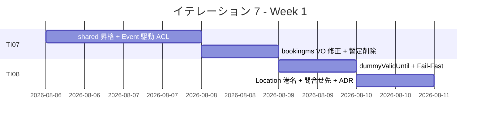
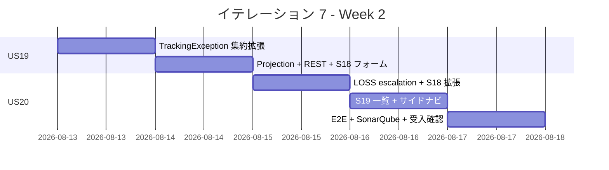
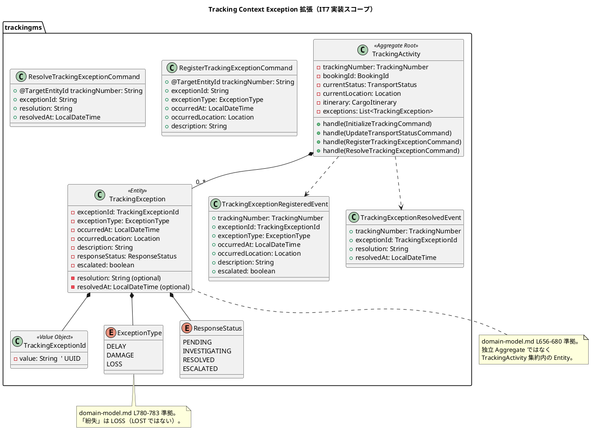
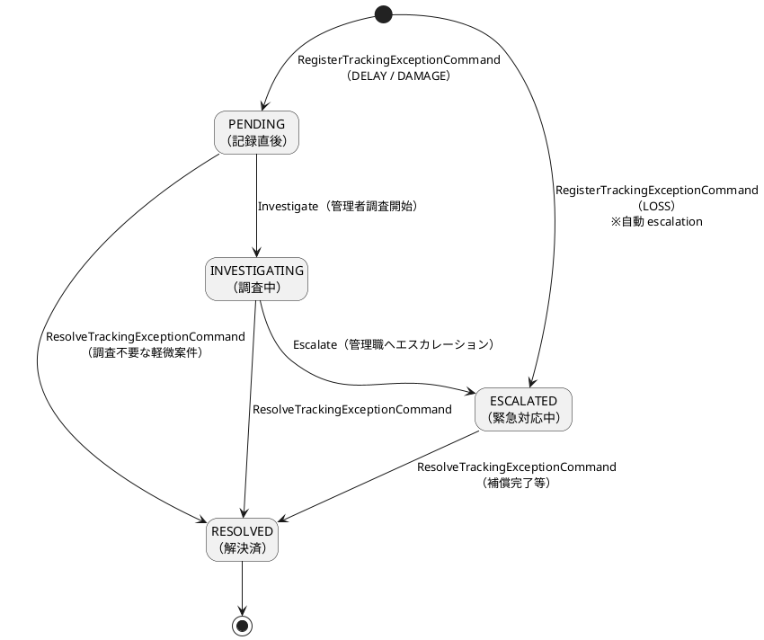
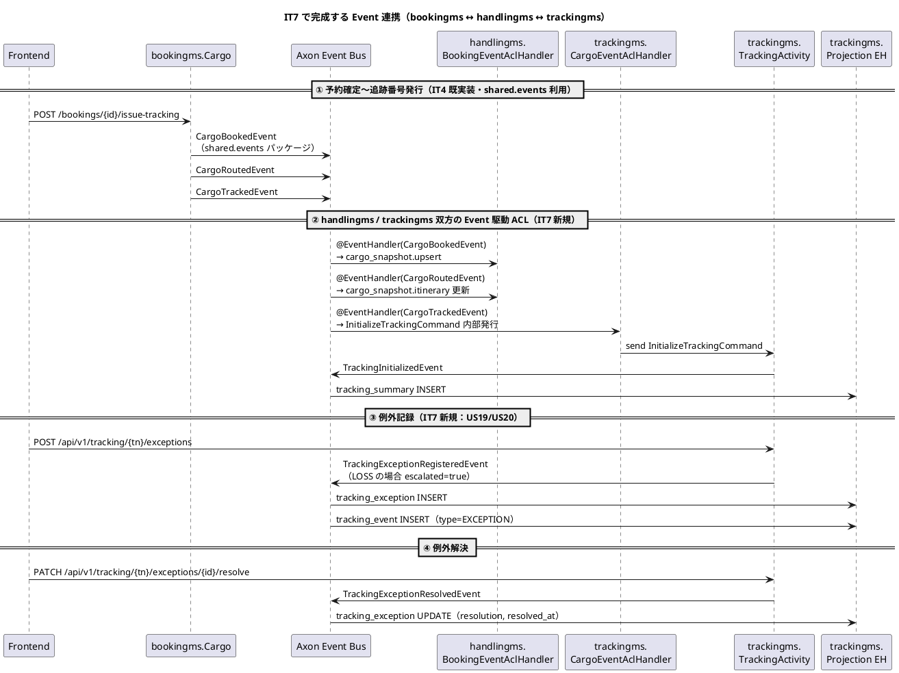
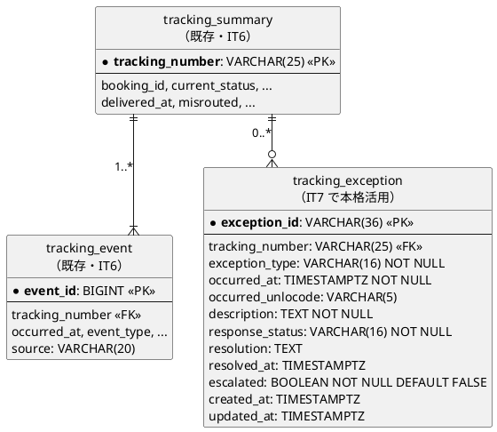
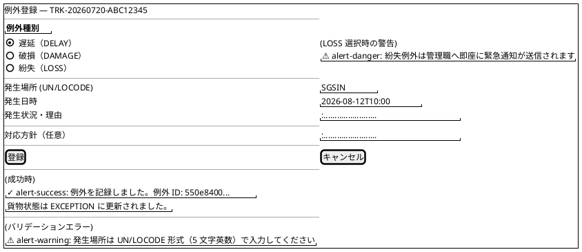
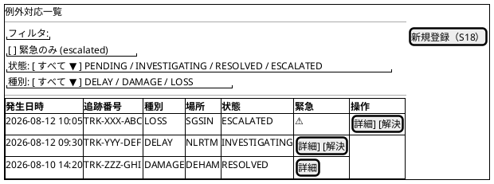
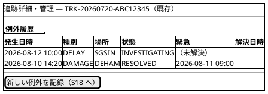
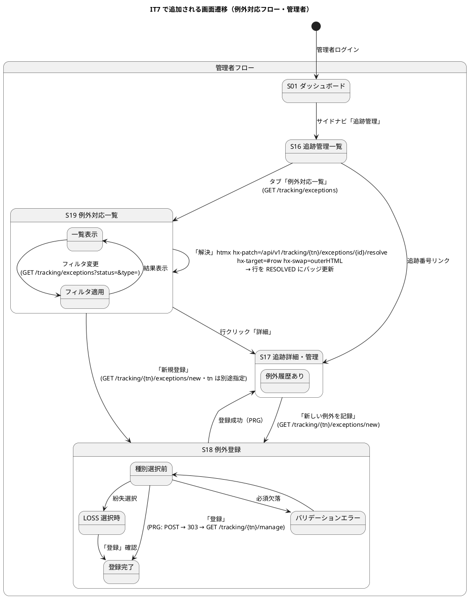

# イテレーション 7 計画

## 概要

| 項目 | 内容 |
|------|------|
| **イテレーション** | 7 / 8 |
| **期間** | Week 13-14（2026-08-06 〜 2026-08-19） |
| **ゴール** | 例外処理（US19/US20）を実装すると同時に、IT5/IT6 で持ち越した shared モジュール昇格 + Event 駆動 ACL を完成させ、IT4 由来の `bookingms.TrackingNumber` 値オブジェクト乖離負債を回収する |
| **目標 SP** | 11（新規 6 + 負債回収 5）|
| **基準ベロシティ** | 14.7 SP（IT1-IT6 平均）|

> **スコープ設定（IT6 完了後）**: 当初計画 6 SP（US19+US20）に対し、IT6 ふりかえりで「Event 駆動 ACL は shared モジュール昇格と束ねて IT7 で本実装」と決定したため、TI07 第 0 スプリント（3 SP）と IT4/IT6 負債回収（2 SP）を追加。合計 11 SP は IT1-IT6 平均 14.7 SP の 75% で、IT5 と同水準の持続可能ペース。

> **TI07 対応（IT7 第 0 スプリント）**: IT5/IT6 で積み残した暫定処理（handlingms `POST /cargo-snapshots`・フロント自動 initialize・TrackingActivity 未初期化フォールバック・bookingms.TrackingNumber 乖離）を一括解消する。これにより Phase 2 完了に向けて Event 駆動 ACL を正規化する。

> **ADR-0012 方針の最終形を実装**: bookingms の Event クラスを `shared` モジュールに昇格して 3 サービス（bookingms / handlingms / trackingms）から共有参照する設計に切り替える。これは ADR-0005「shared モジュールの役割」で「Location・UnLocode のみ」と限定していた方針の拡張で、IT7 で ADR-0014 を起票して責務範囲を再定義する。

---

## ゴール

### イテレーション終了時の達成状態

1. **shared モジュールが有効化されている**: bookingms.Event クラス 4 種（`CargoBookedEvent` / `CargoRoutedEvent` / `CargoTrackedEvent` / `TrackingNumberIssuedEvent`）が `shared/src/main/java/com/example/cargotracker/shared/events/` に移動し、3 サービス（bookingms / handlingms / trackingms）から参照される
2. **Event 駆動 ACL が本実装されている**: handlingms / trackingms が bookingms の Event を Axon Event Bus 経由で購読し、`POST /cargo-snapshots`（handlingms）・フロント自動 `initialize`（trackingms）の暫定処理が削除されている
3. **bookingms.TrackingNumber が正しい正規表現で検証される**: `^TRK-\d{8}-[0-9A-F]{8}$` に修正され、`Cargo` 内部状態が VO で保持される
4. **例外処理ストーリーが完成している**: US19（遅延例外）・US20（破損・紛失例外）が `trackingms.TrackingActivity` 集約内の `TrackingException` Entity として実装され、`tracking_exception` Read Model に反映される（`TrackingException` は **独立 Aggregate ではなく** `TrackingActivity` 集約内の子 Entity・domain-model.md 準拠）
5. **IT6 レビュー高優先度残課題が解消されている**: H-1 港名表示・H-5 問合せ先導線・H-7 dummyValidUntil・H-8 JWT secret 本番 Fail-Fast

### 成功基準

- [ ] `apps/backend/shared` モジュールビルド成功 + 3 サービスから依存解決可能
- [ ] handlingms 旧 `POST /api/v1/handling/cargo-snapshots` 削除（404 を返す or エンドポイント自体を削除）
- [ ] フロント `BookingDetailPage` の useEffect 自動 initialize 削除（Event 駆動 ACL に置換）
- [ ] `TrackingActivity.updateStatus` の未初期化フォールバック削除 → `IllegalStateException` で拒否
- [ ] `bookingms.TrackingNumber` 正規表現を `^TRK-\d{8}-[0-9A-F]{8}$` に修正 + `Cargo` 内部 VO 化
- [ ] `POST /api/v1/tracking/{trackingNumber}/exceptions` で例外を記録できる（US19/US20）
- [ ] `PATCH /api/v1/tracking/{trackingNumber}/exceptions/{exceptionId}/resolve` で例外を解決できる
- [ ] LOSS 種別時に `escalated=true` が自動付与される
- [ ] フロント S18 例外登録 + S19 例外対応一覧画面が動作する
- [ ] `data-model.md` / `domain-model.md` に IT6 変更が反映されている
- [ ] ADR-0013 ステータスが「承認済み」に昇格している
- [ ] ADR-0014「shared モジュールの責務拡張」が起票・承認されている
- [ ] Playwright E2E（US19 / US20 含む 13 シナリオ以上）が全通過する
- [ ] SonarQube Quality Gate PASS（new_coverage >= 80% / new_violations 0）

---

## ユーザーストーリー

### 対象ストーリー

| ID | ストーリー / タスク | SP | 優先度 | 区分 |
|----|------------------|----|-------|------|
| TI07 | IT7 第 0 スプリント（shared 昇格 + Event 駆動 ACL + IT4 由来負債） | 3 | 必須 | 技術タスク |
| TI08 | IT6 レビュー高優先度残課題 + ADR-0013/0014 + 設計書同期 | 2 | 必須 | 技術タスク |
| US19 | 遅延例外を処理する | 3 | 必須 | 新規 |
| US20 | 破損・紛失例外を処理する | 3 | 必須 | 新規 |
| **合計** | | **11** | | |

> **フィーチャバッファ（任意）**: US19/US20 が先行完了した場合のみ実装。M-2 BookingId VO 統一（0.5 SP）/ M-5 STATUS_LABEL 重複解消（0.5 SP）/ M-6 sendAndWaitWithTimeout 共通化（0.5 SP）/ M-15 TrackingController 分離（0.5 SP）。

### ストーリー詳細

#### TI07: IT7 第 0 スプリント（shared 昇格 + Event 駆動 ACL + IT4 由来負債）

IT5 (T5) / IT6 (T1) 持ち越しの Event 駆動 ACL を完成させ、サービス境界をまたぐ Event 連携を正規化する。

**完了条件**:

1. `apps/backend/shared` Gradle モジュール有効化（`settings.gradle.kts` の include を有効化、`shared/build.gradle.kts` を作成）
2. bookingms の Event クラス 4 種を `shared/src/main/java/com/example/cargotracker/shared/events/` に移動（新 FQN: `com.example.cargotracker.shared.events.*`）
3. handlingms / trackingms に shared 依存追加 + `BookingEventAclHandler`（handlingms）・`CargoEventAclHandler`（trackingms）実装
4. handlingms 旧 `POST /api/v1/handling/cargo-snapshots` を削除 + 関連 E2E シードロジックを Axon Event 投入に切替
5. trackingms フロント `BookingDetailPage` の useEffect 自動 initialize を削除 + `TrackingActivity.updateStatus` 未初期化フォールバック削除（`IllegalStateException` で拒否）
6. bookingms.TrackingNumber 正規表現を `^TRK-\d{8}-[0-9A-F]{8}$` に修正 + `Cargo` 内部状態を VO 化

**ADR 参照**: ADR-0004 / ADR-0005 / ADR-0012 / ADR-0014（IT7 新規）

#### TI08: IT6 レビュー高優先度残課題 + ADR + 設計書同期

| # | 内容 | 出典 |
|---|------|------|
| TI08-1 | `Location` 値オブジェクトに `portName` 必須化 + bookingms / routingms / handlingms / trackingms の Event ペイロードで `portName` を伝搬。公開画面 S15 で「港名 (UN/LOCODE)」表示 | レビュー H-1 |
| TI08-2 | 期限切れエラー画面に問合せ先（環境変数 `SUPPORT_EMAIL` / `SUPPORT_PHONE` 経由）を表示 | レビュー H-5 |
| TI08-3 | `TrackingTokenService.verify` 戻り値を `VerifiedToken(TrackingNumber, expiresAt)` に拡張し、`TrackingController#getTracking` の `dummyValidUntil` を解消 | レビュー H-7 |
| TI08-4 | JWT secret 本番 Fail-Fast: `JwtTrackingTokenService` で `@PostConstruct` + `Environment#acceptsProfiles` で profile 判定 | レビュー H-8 |
| TI08-5 | ADR-0013 ステータスを「提案」→「承認済み」へ昇格 + index.md / mkdocs.yml 同期 | レビュー M-10 |
| TI08-6 | ADR-0014「shared モジュールの責務拡張」起票（Event クラスを shared に昇格する判断を ADR-0005 と整合させる） | 新規 |
| TI08-7 | `data-model.md` / `domain-model.md` に IT6 変更を反映（`delivered_at` / `source` / `TrackingTokenService` / `JwtToken` / `EventSource` / `tracking_number: VARCHAR(25)`） | レビュー M-9 |
| TI08-8 | `docs/operation/Deprecation 一覧.md` 新設 + handlingms 旧 PUT を登録（Sunset: 2026-08-30） | レビュー M-12 |

#### US19: 遅延例外を処理する（3 SP）

**として**: 追跡管理者

**したい**: 輸送中に遅延が発生した場合、例外種別「遅延」として記録し、荷主への通知と対応内容を管理したい

**なぜなら**: 遅延情報を速やかに荷主に伝え、対応策（代替ルート等）を迅速に提示できるからだ

**対応 UC**: UC16

**受け入れ基準**:

- [ ] 追跡番号と例外種別「遅延（DELAY）」・発生状況（場所・日時・理由）を記録できる
- [ ] 記録後、貨物状態が「EXCEPTION」に更新される（`TransportStatusUpdatedEvent` 発行）
- [ ] 荷主に遅延発生の通知が記録される（IT7 ではメール送信実体はモック・ログ出力のみ）
- [ ] 対応内容（新しい到着予定日・対応方針）を入力して荷主に対応報告を送信できる（同上モック）
- [ ] 例外対応履歴が `tracking_exception` テーブルに記録される

#### US20: 破損・紛失例外を処理する（3 SP）

**として**: 追跡管理者（または荷役作業員）

**したい**: 輸送中に破損または紛失が発生した場合、例外種別「破損」または「紛失」として記録し、関係者に緊急通知を送りたい

**なぜなら**: 重大な例外は即座に全関係者に共有し、保険手続き・補償対応・代替措置を迅速に開始できるからだ

**対応 UC**: UC16

**受け入れ基準**:

- [ ] 追跡番号と例外種別「破損（DAMAGE）」または「紛失（LOSS）」・発生状況を記録できる
- [ ] 記録後、貨物状態が「EXCEPTION」に更新される
- [ ] 例外種別「LOSS」の場合、緊急フラグ（`escalated=true`）が自動付与され `response_status=ESCALATED` で記録される
- [ ] 荷主に破損・紛失発生の通知が記録される（IT7 ではモック）
- [ ] 対応内容（補償方針等）を入力して荷主に報告を送信できる（同上モック）

---

## タスク

### 1. TI07: IT7 第 0 スプリント（3 SP）

| # | タスク | 見積もり | 状態 |
|---|--------|---------|------|
| 1.1 | shared モジュール有効化 / `shared/build.gradle.kts` 作成 / `settings.gradle.kts` include 解除 | 1h | [ ] |
| 1.2 | bookingms.Event 4 種を `shared.events.*` へ移動 + 既存 import 修正 | 2h | [ ] |
| 1.3 | handlingms に `BookingEventAclHandler`（CargoBookedEvent / CargoRoutedEvent → cargo_snapshot upsert） | 2h | [ ] |
| 1.4 | trackingms に `CargoEventAclHandler`（CargoTrackedEvent → 内部 `InitializeTrackingCommand` 発行） | 2h | [ ] |
| 1.5 | handlingms 旧 `POST /cargo-snapshots` 削除 + E2E シードを Axon Event 投入に切替 | 1.5h | [ ] |
| 1.6 | フロント `BookingDetailPage` 自動 initialize 削除 + 関連テスト更新 | 1h | [ ] |
| 1.7 | TrackingActivity 未初期化フォールバック削除 + `IllegalStateException` 化 + テスト更新 | 1h | [ ] |
| 1.8 | bookingms.TrackingNumber 正規表現修正 + `Cargo.trackingNumber` を VO 型に変更 + 既存テスト更新 | 2h | [ ] |
| 1.9 | trackingms.TrackingNumber を IT6 で緩めた検証から厳密書式へ戻す | 0.5h | [ ] |
| 1.10 | E2E `login-tracking.spec.ts` / `login-handling.spec.ts` の暫定処理を Event 駆動に置換 | 2h | [ ] |

**小計**: 15h

### 2. TI08: レビュー高優先度残課題 + ADR + 設計書同期（2 SP）

| # | タスク | 見積もり | 状態 |
|---|--------|---------|------|
| 2.1 | TI08-3: `TrackingTokenService.verify` 戻り値を `VerifiedToken` に拡張 + `dummyValidUntil` 解消 + テスト追加 | 1.5h | [ ] |
| 2.2 | TI08-4: JWT secret 本番 Fail-Fast（`@PostConstruct` + profile 判定） | 1h | [ ] |
| 2.3 | TI08-1: `Location` の `portName` 必須化 + Event ペイロード伝搬 + 公開画面表示更新 | 2h | [ ] |
| 2.4 | TI08-2: `SUPPORT_EMAIL` / `SUPPORT_PHONE` 環境変数導入 + 公開画面期限切れ画面に表示 | 1h | [ ] |
| 2.5 | TI08-5: ADR-0013 ステータス「提案」→「承認済み」昇格 + index/mkdocs 同期 | 0.5h | [ ] |
| 2.6 | TI08-6: ADR-0014「shared モジュール責務拡張」起票 + index/mkdocs 登録 | 1h | [ ] |
| 2.7 | TI08-7: `data-model.md` / `domain-model.md` に IT6 変更を反映 | 1.5h | [ ] |
| 2.8 | TI08-8: `docs/operation/Deprecation 一覧.md` 新設 | 0.5h | [ ] |

**小計**: 9h

### 3. US19: 遅延例外を処理する（3 SP）

| # | タスク | 見積もり | 状態 |
|---|--------|---------|------|
| 3.1 | `TrackingActivity` に `TrackingException` Entity（子）と `TrackingExceptionId` VO + `RegisterTrackingExceptionCommand` + `ResolveTrackingExceptionCommand` を追加（domain-model.md L656-680 準拠） | 3h | [x] |
| 3.2 | `TrackingExceptionRegisteredEvent` / `TrackingExceptionResolvedEvent` 定義 + Projection EH（`tracking_exception` 更新）+ `TransportStatusUpdatedEvent`(EXCEPTION) 連鎖発行 | 2h | [x] |
| 3.3 | `TrackingExceptionMapper` + XML + Read Model 拡張 + Flyway V003 マイグレーション | 2h | [x] |
| 3.4 | trackingms に `POST /api/v1/tracking/{tn}/exceptions` + `PATCH /api/v1/tracking/{tn}/exceptions/{exceptionId}/resolve` REST + DTO | 2h | [x] |
| 3.5 | ユニットテスト（TrackingActivity Exception Command Handler + Projection + Controller 統合） | 2h | [x] |
| 3.6 | フロントエンド S18 例外登録フォーム（`/tracking/:tn/exceptions/new`） + `useTrackingException` hook | 3h | [x] |

**小計**: 14h

### 4. US20: 破損・紛失例外を処理する（3 SP）

| # | タスク | 見積もり | 状態 |
|---|--------|---------|------|
| 4.1 | `ExceptionType` enum に `DELAY` / `DAMAGE` / `LOSS` 3 値定義 + `TrackingException` Entity に `escalated` フィールド | 1h | [x] |
| 4.2 | `RegisterTrackingExceptionCommand` 内で `LOSS` 時に `escalated=true` を自動付与（Aggregate 内不変条件） | 1.5h | [x] |
| 4.3 | 緊急通知モック実装（ログ出力 + Projection で `tracking_exception.escalated` / `response_status=ESCALATED` 反映） | 1.5h | [x] |
| 4.4 | フロント S18 拡張: 例外種別選択時にラジオ表示・LOSS 選択時に「緊急通知が送信されます」警告バナー + 補償方針入力欄表示 | 3h | [x] |
| 4.5 | フロント S19 例外対応一覧画面（`/tracking/exceptions`・追跡管理一覧からタブ遷移・response_status / escalated でフィルタ） | 2h | [x] |
| 4.6 | サイドナビ「追跡管理」に例外対応サブメニュー追加 or タブ切替 UI 整備 | 0.5h | [x] |
| 4.7 | Playwright E2E `login-tracking-exception.spec.ts`: 例外記録 → 対応 → 解決フルフロー（DELAY + LOSS の 2 シナリオ） | 2h | [x] |
| 4.8 | SonarQube スキャン + violations 修正 | 1.5h | [ ] |
| 4.9 | コードレビュー（`developing-review`） | 1h | [ ] |

**小計**: 14h

### タスク合計

| カテゴリ | SP | 理想時間 | 状態 |
|---------|----|----|------|
| TI07 第 0 スプリント | 3 | 15h | [ ] |
| TI08 レビュー残課題 + 同期 | 2 | 9h | [ ] |
| US19 遅延例外 | 3 | 14h | [ ] |
| US20 破損・紛失例外 | 3 | 14h | [ ] |
| **合計** | **11** | **52h** | |

**1 SP あたり**: 約 4.7h（実装 + テスト）
**進捗率**: 0%（0/11 SP）

---

## スケジュール

### Week 1（Day 1-5）: 第 0 スプリント + 残課題回収



### Week 2（Day 6-10）: US19/US20 + 受入



| 日 | タスク |
|----|--------|
| Day 1-2 | TI07: shared 昇格 + Event 駆動 ACL（handlingms / trackingms BookingEventAclHandler / CargoEventAclHandler） |
| Day 3 | TI07: bookingms.TrackingNumber 修正 + フロント自動 initialize 削除 + Aggregate フォールバック削除 |
| Day 4 | TI08: dummyValidUntil 解消 + JWT Fail-Fast |
| Day 5 | TI08: Location 港名 + 問合せ先 + ADR-0013 承認 + ADR-0014 起票 + 設計書同期 |
| Day 6 | US19: TrackingException 集約拡張 + RegisterCommand / ResolveCommand |
| Day 7 | US19: Projection + REST + S18 例外登録フォーム |
| Day 8 | US20: LOSS escalation + S18 拡張 |
| Day 9 | US20: S19 例外対応一覧 + サイドナビ |
| Day 10 | E2E 全通過 + SonarQube + コードレビュー + 受入確認 |

---

## 設計

### ドメインモデル（US19 / US20 観点・domain-model.md 準拠）



| UC | 主集約 | 主コマンド | 主イベント | 状態遷移 |
|----|--------|-----------|-----------|---------|
| UC16 遅延例外（US19） | `TrackingActivity` | `RegisterTrackingExceptionCommand`（type=DELAY） / `ResolveTrackingExceptionCommand` | `TrackingExceptionRegisteredEvent` / `TrackingExceptionResolvedEvent` | `responseStatus`: `PENDING` → `INVESTIGATING` → `RESOLVED` |
| UC16 破損・紛失（US20） | `TrackingActivity` | 同上（type=DAMAGE/LOSS） | 同上（LOSS は `escalated=true`） | `LOSS` は `PENDING` → `ESCALATED`（自動）|

> **domain-model.md への反映が必要な変更点（IT7 完了時に同期）**:
>
> - `ResponseStatus` enum 値（PENDING / INVESTIGATING / RESOLVED / ESCALATED）の整理（既存定義がやや散在）
> - `TrackingException.escalated: boolean` フィールド明示（既に文中に記載あり）
> - `TrackingExceptionId` を VO として明示

### ResponseStatus 状態遷移



### Event 駆動 ACL 完成形（IT7 で確立）



### データモデル

> `data-model.md` の `tracking_exception` テーブル定義に準拠。IT7 では同テーブルを Read Model として活用する。



> **Flyway 移行（IT7 V003）**: IT6 V002 で既に `tracking_exception` テーブルは作成済み。IT7 では `ALTER TABLE` 不要。Projection EH 経由で実データが流れ込む。
>
> **data-model.md への反映確認**: data-model.md L505-560 に既に定義済み。IT7 で改めて反映不要。

### API 設計（IT7 追加）

| メソッド | エンドポイント | 説明 | 認証 | US |
|---------|---------------|------|------|----|
| `POST` | `/api/v1/tracking/{trackingNumber}/exceptions` | 例外を記録する（`RegisterTrackingExceptionCommand`） | 管理者必須 | US19/US20 |
| `PATCH` | `/api/v1/tracking/{trackingNumber}/exceptions/{exceptionId}/resolve` | 例外を解決する（`ResolveTrackingExceptionCommand`） | 管理者必須 | US19/US20 |
| `GET` | `/api/v1/tracking/exceptions` | 例外対応一覧（管理者用・`response_status` / `escalated` でフィルタ可） | 管理者必須 | US19/US20 |

#### POST /api/v1/tracking/{tn}/exceptions リクエスト例

```json
{
  "exceptionType": "DELAY",
  "occurredAt": "2026-08-12T10:00:00",
  "occurredUnlocode": "SGSIN",
  "description": "シンガポール港で台風による出港遅延発生"
}
```

#### POST レスポンス例（LOSS の場合の自動 escalation）

```json
{
  "trackingNumber": "TRK-20260720-ABC12345",
  "exceptionId": "550e8400-e29b-41d4-a716-446655440000",
  "exceptionType": "LOSS",
  "responseStatus": "ESCALATED",
  "escalated": true,
  "createdAt": "2026-08-12T10:05:00"
}
```

### ユーザーインターフェース

#### ビュー（画面構成）

`ui_design.md` の画面一覧に準拠。S18 = 例外登録、S19 = 例外対応一覧。S17 には例外履歴セクションを既存テーブル拡張で追加する。

| 画面 ID | 画面名 | パス | 実装内容 | US |
|--------|-------|------|---------|-----|
| S17 | 追跡詳細・管理 | `/tracking/:trackingNumber/manage` | 既存（IT5/IT6） — 例外履歴セクション拡張（例外種別 / 発生日時 / 対応状態 / 解決日時） | US19/US20 連携 |
| S18 | 例外登録 | `/tracking/:trackingNumber/exceptions/new` | IT7 新規 — フォーム（例外種別ラジオ / 発生場所 UN-LOCODE / 日時 / 理由）+ LOSS 選択時の緊急通知警告 | US19/US20 |
| S19 | 例外対応一覧 | `/tracking/exceptions` | IT7 新規 — コレクション（例外種別 / 追跡番号 / 発生日時 / response_status バッジ / escalated アイコン）+ S16 追跡管理一覧からタブ切替 | US19/US20 |

#### ワイヤーフレーム（PlantUML salt）

共通ヘッダー / サイドナビ（追跡管理メニュー）は省略する。

##### S18: 例外登録（US19/US20）



##### S19: 例外対応一覧（US19/US20）



##### S17: 追跡詳細・管理（既存・例外履歴セクション追加）



#### インタラクション（画面遷移と htmx パターン）



#### フィードバック / htmx 規約

- S18 登録は PRG パターン: `POST /api/v1/tracking/{tn}/exceptions` → 303 → `GET /tracking/{tn}/manage`
- S19 解決は htmx インライン更新: `hx-patch="/api/v1/tracking/{tn}/exceptions/{id}/resolve" hx-target="#exception-row-{id}" hx-swap="outerHTML"` → 行を RESOLVED バッジへ
- LOSS 選択時の警告: React state 駆動（htmx 不要・即座にラジオ変更時にバナー表示）
- バリデーションエラー: 自己ループ（フォーム再描画）+ `alert-warning` 表示
- 成功フィードバック: `alert-success`（自動消失 5 秒）

### ADR

| ADR | タイトル | ステータス |
|-----|---------|-----------|
| ADR-0013 | Tracking Number JWT 時限トークン設計 | IT7 で「提案」→「**承認済み**」へ昇格（TI08-5） |
| ADR-0014（新規） | shared モジュールの責務拡張（Event クラス共有） | 提案 |

> **ADR-0014 要点**（TI08-6 で起票）:
>
> - **コンテキスト**: ADR-0005 は shared モジュールを「`Location` / `UnLocode` のみ」と限定していたが、IT6 で Event 駆動 ACL の正式実装を IT7 に持ち越すと決定し、bookingms.Event クラス 4 種を 3 サービスで共有する必要が生じた
> - **決定**: shared モジュールに `events/` パッケージを追加し、`CargoBookedEvent` / `CargoRoutedEvent` / `CargoTrackedEvent` / `TrackingNumberIssuedEvent` を移動する。FQN は `com.example.cargotracker.shared.events.*`
> - **責務制限**: shared には「サービス境界をまたぐ不変な型のみ」を置く。`Aggregate` / `Repository` / `Service` 等の依存性の方向を持つクラスは shared に置かない（依存性逆転の維持）
> - **未採用案**: (1) 各サービスで Event クラスを重複定義（FQN 一致で Axon が受け取れない）/ (2) JSON Schema での Event 仕様共有（型安全性が失われる）

### ディレクトリ構成（IT7 追加・更新）

```
apps/backend/
├── shared/                                      ← IT7 で新規有効化
│   ├── build.gradle.kts
│   ├── README.md                                ← shared モジュールの責務範囲を明記
│   └── src/main/java/com/example/cargotracker/shared/
│       ├── events/
│       │   ├── CargoBookedEvent.java            ← bookingms から移動
│       │   ├── CargoRoutedEvent.java            ← 同上
│       │   ├── CargoTrackedEvent.java           ← 同上
│       │   └── TrackingNumberIssuedEvent.java   ← 同上
│       └── valueobjects/                        ← IT8 候補（IT7 では未着手）
├── handlingms/src/main/java/com/example/cargotracker/handlingms/
│   └── application/eventhandlers/
│       ├── BookingEventAclHandler.java          ← IT7 新規（CargoBookedEvent / CargoRoutedEvent 購読）
│       └── HandlingProjectionsEventHandler.java ← 既存（HandlingActivityRegisteredEvent 購読）
├── trackingms/src/main/java/com/example/cargotracker/trackingms/
│   ├── application/eventhandlers/
│   │   ├── CargoEventAclHandler.java            ← IT7 新規（CargoTrackedEvent 購読 → 内部 initialize）
│   │   └── TrackingProjectionsEventHandler.java ← 既存（拡張: TrackingExceptionRegisteredEvent / TrackingExceptionResolvedEvent 購読）
│   ├── domain/model/
│   │   ├── aggregates/
│   │   │   └── TrackingActivity.java            ← 既存（拡張: TrackingException エンティティを exceptions: List に追加）
│   │   ├── entities/
│   │   │   └── TrackingException.java           ← IT7 新規（Entity）
│   │   ├── commands/
│   │   │   ├── RegisterTrackingExceptionCommand.java  ← IT7 新規
│   │   │   └── ResolveTrackingExceptionCommand.java   ← IT7 新規
│   │   ├── events/
│   │   │   ├── TrackingExceptionRegisteredEvent.java  ← IT7 新規
│   │   │   └── TrackingExceptionResolvedEvent.java    ← IT7 新規
│   │   └── valueobjects/
│   │       ├── TrackingExceptionId.java         ← IT7 新規
│   │       ├── ExceptionType.java               ← IT7 新規（enum: DELAY / DAMAGE / LOSS）
│   │       └── ResponseStatus.java              ← IT7 新規（enum）
│   ├── infrastructure/persistence/
│   │   ├── TrackingExceptionMapper.java         ← IT7 新規
│   │   └── TrackingExceptionRecord.java         ← IT7 新規（POJO）
│   └── interfaces/rest/
│       ├── TrackingExceptionController.java     ← IT7 新規（POST / PATCH / GET）
│       └── dto/
│           ├── RegisterTrackingExceptionRequest.java
│           ├── ResolveTrackingExceptionRequest.java
│           └── TrackingExceptionResponse.java
└── bookingms/src/main/java/com/example/cargotracker/bookingms/
    └── domain/model/
        ├── valueobjects/
        │   └── TrackingNumber.java              ← IT4 由来負債：正規表現修正
        └── aggregates/
            └── Cargo.java                       ← trackingNumber: String → TrackingNumber 型へ
```

```
apps/frontend/src/
├── features/tracking/
│   ├── components/
│   │   ├── TrackingException Form.tsx           ← IT7 新規（S18 例外登録フォーム）
│   │   ├── TrackingExceptionList.tsx            ← IT7 新規（S19 例外対応一覧）
│   │   └── ExceptionHistoryTable.tsx            ← IT7 新規（S17 内に組み込む例外履歴）
│   ├── hooks/
│   │   └── useTrackingException.ts              ← IT7 新規（register / resolve / list）
│   └── types/
│       └── tracking-exception.ts                ← IT7 新規（ExceptionType / ResponseStatus 型）
└── pages/
    ├── TrackingExceptionNewPage.tsx             ← IT7 新規（S18）
    └── TrackingExceptionListPage.tsx            ← IT7 新規（S19）
```

---

## リスクと対策

| リスク | 影響度 | 対策 |
|--------|--------|------|
| shared モジュール導入で既存サービスのビルドが破壊される | 高 | TI07-1.1 で空 shared を一旦組み込み build 通過確認 → 1.2 で Event 移動を 1 ファイルずつ実施 |
| Event クラス FQN 変更で Axon Event Store の既存ペイロードが読み込めない | 高 | Event Store は in-memory（H2 + Axon ローカルバス）なので再起動でクリアされる。本番運用時は upcaster 実装 |
| bookingms.TrackingNumber 正規表現変更で既存テストが壊れる | 中 | 既存テストの `TRK-` リテラルを全件 grep して新フォーマットに置換 |
| 例外処理 UI（S18 / S19）が複雑化して US19/US20 SP を超過 | 中 | フィーチャバッファ M-2/M-5/M-6/M-15 を後回しにできる構造 |
| `Location.portName` 必須化で既存 Event ペイロードの破壊変更 | 中 | bookingms 内部での生成時に `CargoSnapshot` から `portName` を引く経路を確立 + 既存 Event を `portName=null` 許容で受け取る Backward 互換性確保 |
| TrackingActivity 集約が複数の責務を持ち過密化（追跡 + 状態更新 + 例外管理） | 中 | domain-model.md 通り `TrackingException` を子 Entity として実装。集約境界を変えない。将来分割が必要なら別 ADR で議論 |
| LOSS の自動 escalation で予期せぬ業務影響 | 低 | 通知はモック実装のためログ出力のみ。実通知は IT8 以降の課題 |

---

## 完了条件

### Definition of Done

- [ ] 全タスク（11 SP / 52h）完了
- [ ] shared モジュールビルド成功 + handlingms / trackingms / bookingms から参照
- [ ] handlingms / trackingms の Event 駆動 ACL が動作（暫定 REST / 自動 initialize 削除済み）
- [ ] bookingms.TrackingNumber 正規表現修正 + 既存 E2E 全通過
- [ ] US19 / US20 受入条件すべて達成
- [ ] バックエンドユニットテスト + 統合テスト全 PASS
- [ ] Playwright E2E（US19/US20 含む 13 シナリオ以上）全 PASS
- [ ] SonarQube Quality Gate PASS（new_coverage >= 80% / new_violations 0）
- [ ] data-model.md / domain-model.md 同期完了
- [ ] ADR-0013 ステータス「承認済み」へ更新
- [ ] ADR-0014「shared モジュール責務拡張」起票・承認

### デモ項目

1. shared モジュール経由で Axon Event を受け取る Event 駆動 ACL（handlingms / trackingms）— bookingms から発行された `CargoTrackedEvent` を trackingms が自動受信して `tracking_summary` に INSERT される様子
2. 予約 → 経路設計 → 追跡番号発行 → S16 一覧表示（フロントから明示的な initialize 呼び出しなしで自動反映）
3. S18 から DELAY 例外を記録 → 貨物状態が EXCEPTION に更新 → S17 例外履歴セクションに反映
4. S18 から LOSS 例外を記録 → 緊急通知警告バナー表示 → `escalated=true` が自動付与 → S19 で緊急フィルタにヒット
5. S19 で例外行の「解決」ボタンクリック（htmx）→ 行が RESOLVED バッジに即座に更新
6. 公開画面（S15）で港名表示（H-1 改善）+ 期限切れ時の問合せ先表示（H-5 改善）
7. JWT secret 本番プロファイル未設定時の起動失敗（H-8 改善・実演用に環境変数を一時的に消す）

---

## 関連ドキュメント

- [iteration_plan-6.md](./iteration_plan-6.md): 前イテレーション計画
- [retrospective-6.md](./retrospective-6.md): IT6 ふりかえり
- [iteration_report-6.md](./iteration_report-6.md): IT6 完了報告書
- [IT6_implementation_review_20260518.md](../review/IT6_implementation_review_20260518.md): IT6 マルチパースペクティブレビュー（高 12 / 中 16 / 低 12）
- [ADR-0004 マイクロサービス分割方針](../adr/0004-microservice-decomposition.md)
- [ADR-0005 shared モジュールの役割](../adr/0005-shared-module-role.md)（ADR-0014 で拡張予定）
- [ADR-0012 handlingms と trackingms の責務分離](../adr/0012-handlingms-trackingms-responsibility-separation.md)
- [ADR-0013 Tracking Number JWT 時限トークン設計](../adr/0013-tracking-number-jwt-time-limited-token.md)
- [domain-model.md L656-680](../design/domain-model.md): TrackingException Entity 定義
- [data-model.md L505-560](../design/data-model.md): tracking_exception テーブル
- [ui_design.md L108-109, L797](../design/ui_design.md): S18 例外登録 / S19 例外対応一覧
- [user_story.md US19 / US20](../requirements/user_story.md)

---

## 更新履歴

| 日付 | 内容 | 担当 |
|------|------|------|
| 2026-05-18 | IT7 計画策定（11 SP・shared 昇格 + Event 駆動 ACL + IT4 由来負債回収 + IT6 レビュー高優先度 + US19 + US20） | AI Agent（XP PM） |
| 2026-05-18 | 整合性検証対応: domain-model.md 準拠で TrackingException を Aggregate → Entity、Command/Event 名称統一（RegisterTrackingExceptionCommand 等）、紛失コード LOST → LOSS、S19 例外対応一覧画面の言及追加、API 設計表追加 | AI Agent |
| 2026-05-18 | IT6 品質水準に合わせ設計セクションを全面拡充（ドメインモデル詳細クラス図・UC↔Aggregate マッピング表・ResponseStatus 状態遷移図・Event 駆動 ACL 完成形シーケンス図・データモデル ER 図・S17/S18/S19 ワイヤーフレーム・画面遷移図・htmx/PRG 規約・ADR-0014 要点・ディレクトリ構成） | AI Agent |
