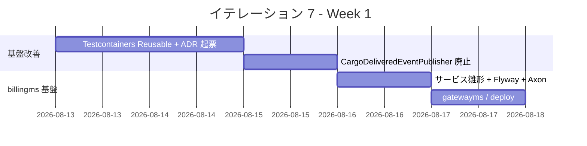
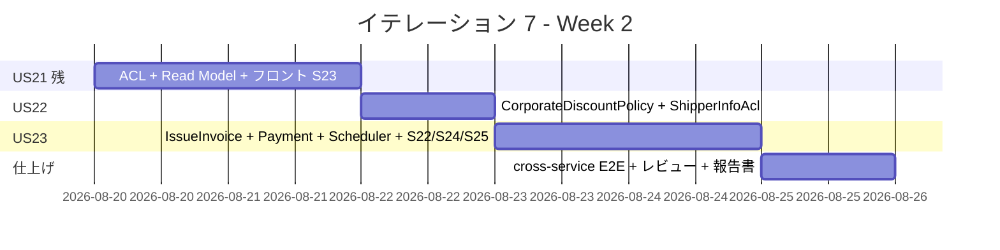
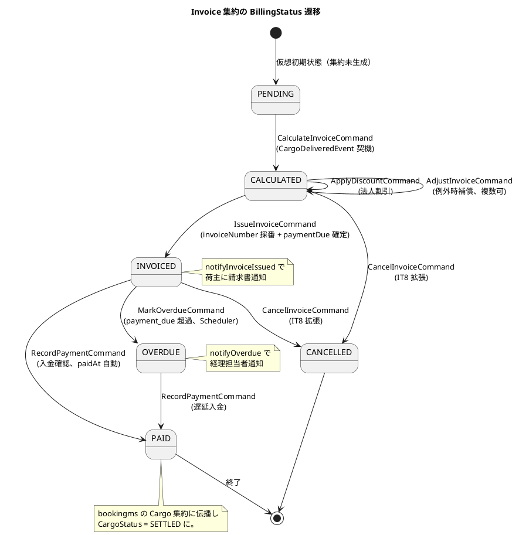
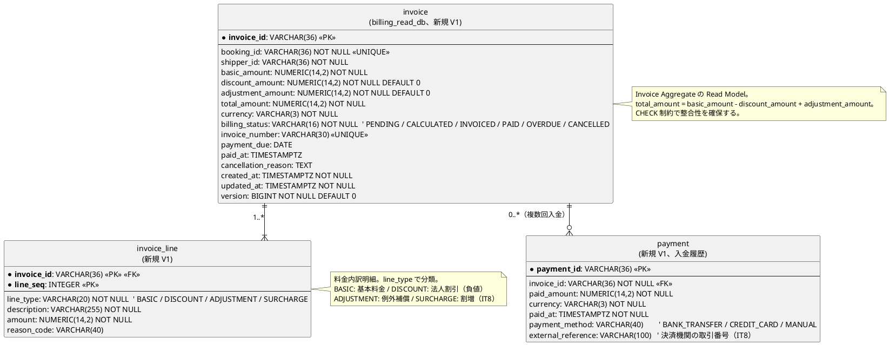
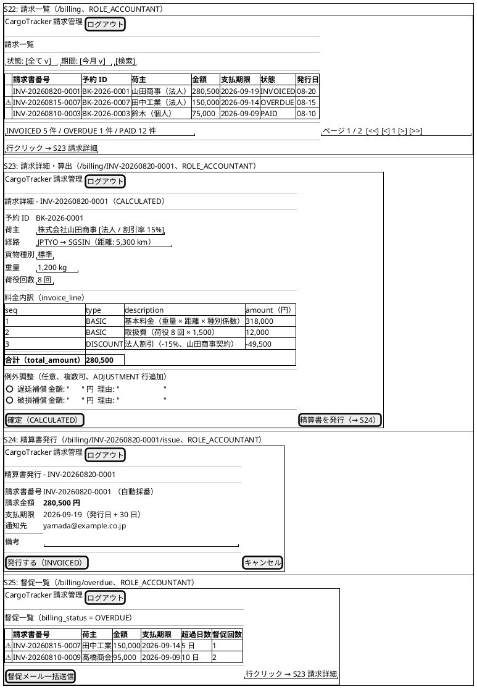
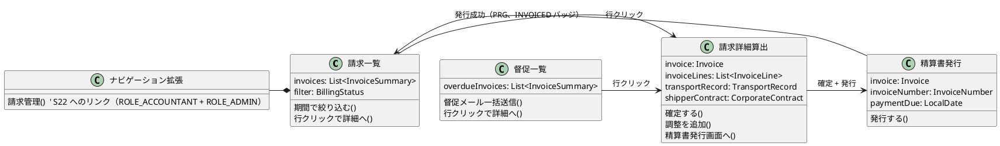
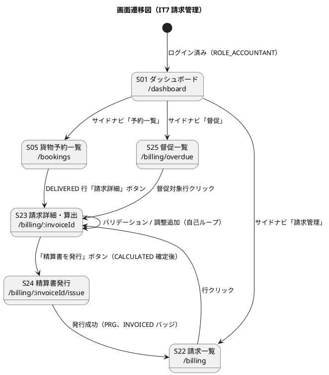
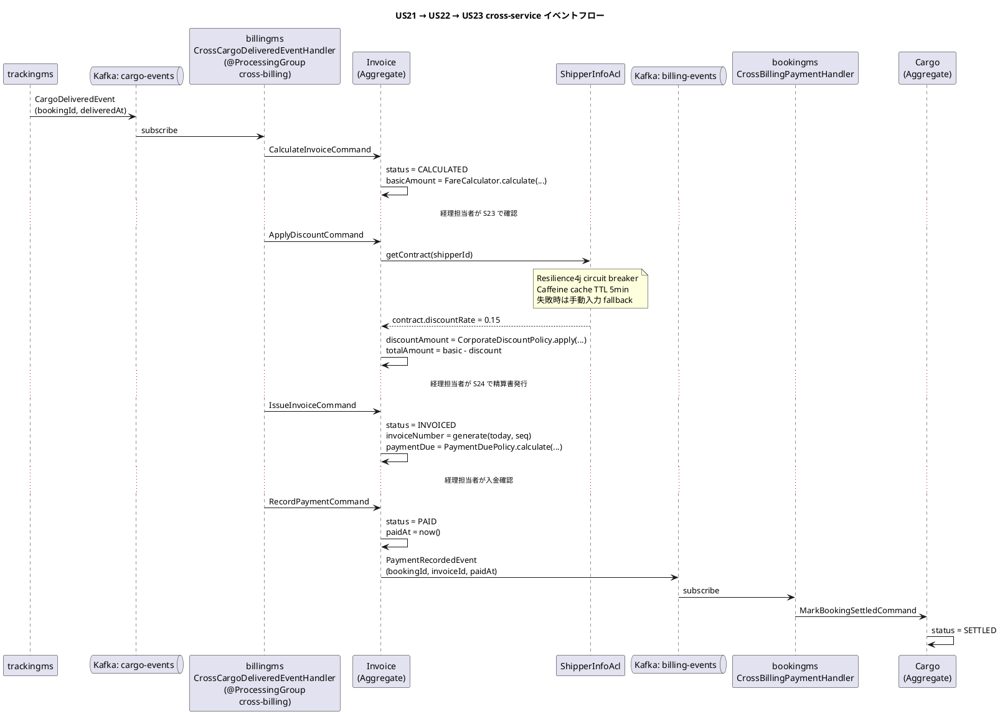
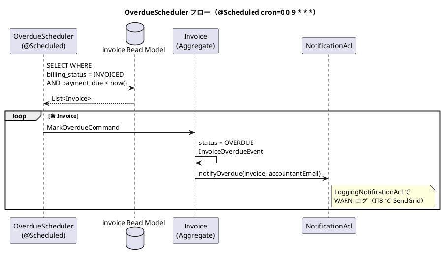

# イテレーション 7 計画（IT7・精算 + Phase 2 Buffer、Phase 2 / 3）

| 項目 | 内容 |
|------|------|
| **イテレーション** | IT7（Billing Context 立ち上げ + IT5/IT6 持ち越し技術負債解消） |
| **期間** | 2026-08-13 〜 2026-08-26（計画 2 週間） |
| **計画 SP** | 8（US21:3 / US22:2 / US23:3） |
| **想定ベロシティ** | 9.5 SP（IT5=10 / IT6=9 の平均、安定域）。IT7 は 8 SP のため 16% バッファあり |

## ゴール

1. **billingms（Billing Context）** を新規立ち上げ、配送完了 → 輸送料金算出（`InvoiceCalculatedEvent`）→ 法人割引適用（`DiscountAppliedEvent`）→ 精算書発行（`InvoiceIssuedEvent`）→ 入金記録（`PaymentRecordedEvent`）→ 督促（`InvoiceOverdueEvent`）の業務フローを Phase 2 Release 2.1 として完成させる（US21/US22/US23）。
2. IT6 ふりかえり Try **T2（CargoDeliveredEventPublisher 廃止 + 集約発火型移行）/ T3（@ProcessingGroup 一斉改名）/ T6（architecture_backend.md API カタログ更新）** を IT7 序盤で処理し、ADR-0012 と実装の整合性を回復する。
3. IT5 持ち越し **T1（Testcontainers Reusable + H6/H7）** を確実に解消し、`./gradlew check` を全モジュール一括 PASS に戻す。

## 満足条件

### スコープ

- US21: 輸送料金算出（基本料金 + 例外時の料金調整、`CalculateInvoiceCommand`）
- US22: 法人割引適用（契約割引率の自動取得・適用、`ApplyDiscountCommand`）
- US23: 精算処理（請求書発行 + メール通知 + 入金記録 + 督促、`IssueInvoiceCommand` / `RecordPaymentCommand` / `MarkOverdueCommand`）
- 基盤改善: IT5/IT6 持ち越し Try（T1 / T2 / T3 / T6）
- 新規サービス `billingms` の立ち上げ（service コード雛形・Flyway スキーマ・Axon 設定・gatewayms ルート・deploy:dev 反映）

### 受け入れ基準（ユーザーストーリー単位）

#### US21: 輸送料金を算出する（3 SP）

1. 「引取済（DELIVERED）」状態の予約に対して料金算出を開始できる（`Invoice` 集約が PENDING → CALCULATED に遷移）
2. 輸送実績（経路・距離・重量・貨物種別・荷役作業実績）が画面に表示される（`TransportRecord` 値オブジェクト）
3. 基本料金が自動計算される（`FareCalculator.calculate(transport, cargoSpec)`）
4. 算出結果を確認して確定操作ができる
5. 確定後、`Invoice.billingStatus = CALCULATED` で記録される
6. 例外（遅延・破損等）が発生している場合、料金調整（`invoice_line` の `ADJUSTMENT` 行）を入力できる

#### US22: 法人割引を適用する（2 SP）

1. 荷主種別が「法人（CORPORATE）」の場合、料金算出時に契約割引率が自動的に取得・表示される（`CorporateDiscountPolicy.apply(basic, contract)`）
2. 割引率（0〜30%）が基本料金に適用され、割引後の金額が表示される
3. 個人荷主の場合は割引が適用されない（`discount_amount = 0`）
4. 割引計算の根拠（割引率・基本料金・割引額・割引後料金）が `invoice_line` の `DISCOUNT` 行に記録される

#### US23: 精算を処理する（3 SP）

1. CALCULATED 状態の Invoice をもとに精算書（`invoice_number` ・`payment_due`）を発行できる（PENDING → CALCULATED → INVOICED 遷移）
2. 精算書が荷主にメール通知される（IT7 は LoggingNotificationAcl スタブ、本格メールは IT8）
3. 入金確認操作で `RecordPaymentCommand` が発行され、`payment` テーブルに入金履歴が記録される
4. 入金確認後、`billingStatus = PAID` に更新され予約状態も「精算済」になる（bookingms cross-service 連携）
5. 支払い期限超過時、OverdueScheduler が `MarkOverdueCommand` を発行し `billingStatus = OVERDUE`、経理担当者に未払い通知が送信される

## タスク

### 0. 基盤改善（IT5/IT6 持ち越し Try、SP 外）

| # | タスク | 見積もり | 担当 | 状態 | 元 Try |
|---|--------|---------|------|------|--------|
| 0.1 | Testcontainers Reusable + 一意 topic prefix で Kafka container race を構造的解決し、@Tag("kafka-integration") 除外を解除して通常 `check` に戻す。H6（`hasSize(7)` を `@DirtiesContext(BEFORE_CLASS)` で根本対処）/ H7（`HandlingActivityKafkaIntegrationTest` 修正）も同時解消 | 5h | - | [x] | IT5 T1 / IT6 T1 |
| 0.2 | `CargoDeliveredEventPublisher` 廃止 + 集約発火型移行（ADR-0012 自己整合回復）。`TrackingActivity.handle(UpdateTransportStatusCommand)` 内で DELIVERED 遷移時に `CargoDeliveredEvent` を直接 apply、`tracking_summary.delivered_published_at` 冪等化を温存 | 3h | - | [x] | IT6 T2 / IT6 review H1 |
| 0.3 | ADR-0015: billingms cross-service イベント + ShipperInfo ACL 採用方針 | 1h | - | [x] | IT7 設計判断 |
| 0.4 | ADR-0016: @ProcessingGroup 一斉改名（`cross-` / `local-` / `outbound-` prefix）+ token 移行手順 + ArchUnit 構造ガードテスト | 2h | - | [x] | IT6 T3 |
| 0.5 | architecture_backend.md API カタログを IT6 7 endpoint + IT7 billingms 全 endpoint で更新。domain-model.md / data-model.md / ui_design.md の「反映必要」マーカー 4 件をクローズ | 2h | - | [x] | IT6 T6 / IT6 review writer H6 |
| 0.6 | 新サービス追加チェックリスト（`docs/reference/新サービス追加チェックリスト.md`）の billingms 適用ドライラン。漏れがあれば checklist を改訂 | 1h | - | [x] | IT2 ふりかえり T1 持ち越し |

**小計**: 14h（理想時間、SP 外）

### 1. billingms サービス基盤立ち上げ（SP 外、US21 着手の前提）

| # | タスク | 見積もり | 担当 | 状態 |
|---|--------|---------|------|------|
| 1.1 | `apps/backend/billingms/` ディレクトリ作成、Gradle module 追加、Spring Boot 4 / Axon 5 / MyBatis 依存。`application.yml` / `application-local-h2.yml` / `application-heroku.yml` | 3h | - | [x] |
| 1.2 | Flyway V1: `invoice` / `invoice_line` / `payment` テーブル定義（data-model.md L693-735 準拠、PostgreSQL + H2 互換） | 2h | - | [x] |
| 1.3 | Axon Event Store（PostgreSQL）+ Kafka tracking event publisher（既存 services と同パターン）。`@ProcessingGroup` 命名規約は ADR-0016 適用 | 2h | - | [x] |
| 1.4 | gatewayms `application-*.yml` に `/api/v1/billing/**` ルートを追加（local-h2 / heroku 両方） | 1h | - | [x] |
| 1.5 | ops/scripts/heroku.js に `billingms` 追加（SERVICES / DEPLOY_ORDER / deploy:dev:setup / deploy:dev:config / deploy:dev:build:backend / deploy:dev:help） | 2h | - | [x] |
| 1.6 | `LocalH2SmokeTest`（ApplicationContext assertion パターン）を billingms に追加。CI で context 起動を保証 | 1h | - | [x] |

**小計**: 11h（理想時間、SP 外）

### 2. US21 輸送料金算出（3 SP）

| # | タスク | 見積もり | 担当 | 状態 |
|---|--------|---------|------|------|
| 2.1 | billingms: `Invoice` 集約（`invoiceId` を集約 ID、`bookingId` UNIQUE）+ `BillingStatus` enum（PENDING → CALCULATED → INVOICED → PAID / OVERDUE / CANCELLED）+ `TransportRecord` 値オブジェクト | 3h | - | [ ] |
| 2.2 | billingms: `FareCalculator` ドメインサービス + `RateTable` 値オブジェクト（基本料金 = 重量 × 距離 × 貨物種別係数 + 荷役回数 × 取扱費）+ `HandlingSummary` 値オブジェクト | 3h | - | [ ] |
| 2.3 | billingms: `CalculateInvoiceCommand`（DELIVERED 契機）ハンドラ + `InvoiceCalculatedEvent`。冪等化（`if (billingStatus != null) return;`）| 2h | - | [ ] |
| 2.4 | billingms: ACL（cargoms から CargoDeliveredEvent サブスクライブ → `CalculateInvoiceCommand` 発火、ADR-0015）+ Routing ACL（routingms `confirmed_itinerary` を REST 経由参照、距離・港 ID 取得）+ Handling ACL（handlingms から荷役回数を REST 経由集計）| 4h | - | [ ] |
| 2.5 | `invoice` Read Model 投影（MyBatis Mapper + EventHandler）+ `invoice_line` 投影（`line_type = BASIC` 行を `InvoiceCalculatedEvent` から生成）+ Controller（`POST /api/v1/billing/invoices`、`GET /api/v1/billing/invoices/{invoiceId}`、`PATCH /adjust`） | 3h | - | [ ] |
| 2.6 | フロント S23 請求詳細・算出画面（`/billing/:invoiceId`、ROLE_ACCOUNTANT）：輸送実績表示・基本料金・例外調整入力・確定ボタン | 4h | - | [ ] |
| 2.7 | テスト（Axon Test Fixture 8 件、ドメインサービス 6 件、Controller 6 件、Vitest 6 件、E2E 2 件） | 3h | - | [ ] |

**小計**: 22h（理想時間）

### 3. US22 法人割引適用（2 SP）

| # | タスク | 見積もり | 担当 | 状態 |
|---|--------|---------|------|------|
| 3.1 | billingms: `CorporateDiscountPolicy` ドメインサービス（`apply(basic: Money, contract: CorporateContract): Money`）。ShipperType `CORPORATE` のみ適用、`INDIVIDUAL` は 0%。`CorporateContract` 値オブジェクト（`discountRate: BigDecimal 0〜0.30`）| 3h | - | [ ] |
| 3.2 | billingms: `ShipperInfoAcl`（bookingms `GET /api/v1/shippers/{id}` を REST 経由で参照、ShipperType / contract を取得）。Resilience4j circuit breaker + Caffeine cache（TTL 5min、ADR-0015）| 3h | - | [ ] |
| 3.3 | `Invoice` 集約で `ApplyDiscountCommand` 受理時に CorporateDiscountPolicy 適用。`DiscountAppliedEvent` 発行で `discount_amount` 確定。`invoice_line` 投影に `line_type = DISCOUNT` 行を追加 | 2h | - | [ ] |
| 3.4 | フロント S23 改修：荷主種別バッジ（法人 / 個人）+ 割引率表示 + 割引前後金額の対比表示 | 2h | - | [ ] |
| 3.5 | テスト（割引率 0%/15%/30% の境界値、個人 vs 法人、ACL タイムアウト時のフォールバック検証） | 2h | - | [ ] |

**小計**: 12h（理想時間）

### 4. US23 精算処理（3 SP）

| # | タスク | 見積もり | 担当 | 状態 |
|---|--------|---------|------|------|
| 4.1 | billingms: `IssueInvoiceCommand`（CALCULATED 確定契機）+ `RecordPaymentCommand`（入金確認）+ `MarkOverdueCommand` ハンドラ。`InvoiceIssuedEvent` / `PaymentRecordedEvent` / `InvoiceOverdueEvent` 発行 | 3h | - | [ ] |
| 4.2 | billingms: `InvoiceNumberGenerator`（`INV-YYYYMMDD-XXXX` 形式、日付 + シーケンス、UNIQUE 制約 + ON CONFLICT 再試行 5 回）+ `PaymentDuePolicy`（発行日 + 30 日）| 2h | - | [ ] |
| 4.3 | `invoice` Read Model 拡張（`invoice_number` / `payment_due` / `paid_at` カラム反映）+ `payment` 投影 Mapper + Controller（`POST /invoices/{id}/issue`、`POST /invoices/{id}/payments`、`GET /invoices?status=...`） | 4h | - | [ ] |
| 4.4 | NotificationAcl 拡張：`notifyInvoiceIssued` / `notifyPaymentReceived` / `notifyOverdue`。LoggingNotificationAcl スタブで INFO ログ、IT8 で SendGrid 統合 | 1h | - | [ ] |
| 4.5 | bookingms cross-service: `PaymentRecordedEvent`（billingms 発行）を購読し、`Cargo` 集約の予約状態を「精算済（SETTLED）」に更新。`@ProcessingGroup("cross-booking-billing")`、既存 `CargoStatus` enum に `SETTLED` 追加 | 2h | - | [ ] |
| 4.6 | OverdueScheduler（`@Scheduled` cron、毎日 09:00）：`billing_status = INVOICED AND payment_due < now()` を SELECT → 順次 `MarkOverdueCommand` 発火、`notifyOverdue` 発火 | 2h | - | [ ] |
| 4.7 | フロント S22 請求一覧（`/billing`、ROLE_ACCOUNTANT、ステータスフィルタ）+ S24 精算書発行（`/billing/:invoiceId/issue`、ROLE_ACCOUNTANT）+ S25 督促一覧（`/billing/overdue`、ROLE_ACCOUNTANT） | 5h | - | [ ] |
| 4.8 | テスト（Invoice 集約 Axon Fixture 10 件、Controller 8 件、Scheduler 2 件、Vitest 8 件、E2E 3 件） | 3h | - | [ ] |

**小計**: 22h（理想時間）

### 5. テスト / 仕上げ

| # | タスク | 見積もり | 担当 | 状態 |
|---|--------|---------|------|------|
| 5.1 | cross-service E2E（CROSS_SERVICE_E2E=1）：DELIVERED → InvoiceCalculated → DiscountApplied → InvoiceIssued → PaymentRecorded → Booking SETTLED の貫通検証 | 3h | - | [ ] |
| 5.2 | SonarQube ライブスキャン + Quality Gate Backend/Frontend 両方 OK 維持。billingms カバレッジ 80%+ 目標 | 1h | - | [ ] |
| 5.3 | マルチパースペクティブレビュー実施（developing-review）→ 重要度「高」を IT 内で対応 | 2h | - | [ ] |
| 5.4 | ふりかえり + 完了報告書作成 + release_plan / docs index / mkdocs 反映 | 1h | - | [ ] |

**小計**: 7h（理想時間）

### タスク合計

| カテゴリ | SP | 理想時間 | 状態 |
|---------|----|----|------|
| 基盤改善（IT5/IT6 Try 持ち越し、SP 外） | - | 14h | [ ] |
| billingms 基盤立ち上げ（SP 外） | - | 11h | [ ] |
| US21 輸送料金算出 | 3 | 22h | [ ] |
| US22 法人割引適用 | 2 | 12h | [ ] |
| US23 精算処理 | 3 | 22h | [ ] |
| テスト / 仕上げ | - | 7h | [ ] |
| **合計（コミット）** | **8** | **88h** | |

**1 SP あたり**: 約 7.0h（コミット分）。基盤改善 14h + サービス基盤 11h + テスト/仕上げ 7h を含めると 88h。

**進捗率**: 0%（0/8 SP）

> **注**: IT5（10 SP）が 2 日 / IT6（9 SP）が 1 日（Ralph Loop 7 iterations）で完了している実績を踏まえ、8 SP の IT7 は計画どおり完了可能。billingms 新規立ち上げで初期コストが大きいが、bookingms 立ち上げ（IT2）の学習を新サービス追加チェックリストで再利用できる。

---

## スケジュール

### Week 1（Day 1-5）



| 日 | タスク |
|----|--------|
| Day 1 | T1: Testcontainers Reusable 化、`@DirtiesContext(BEFORE_CLASS)` 適用、`./gradlew check` 全モジュール一括 PASS 確認 |
| Day 2 | T2: CargoDeliveredEventPublisher 廃止 + 集約発火型移行（ADR-0012 自己整合）。T3 ADR-0015/0016 起票 |
| Day 3 | billingms 1.1-1.3: サービス雛形 + Flyway V1（invoice/invoice_line/payment）+ Axon + Kafka publisher |
| Day 4 | billingms 1.4-1.6: gatewayms ルート + heroku.js + LocalH2SmokeTest |
| Day 5 | US21 2.1-2.3: Invoice 集約 + BillingStatus + TransportRecord + FareCalculator + CalculateInvoiceCommand |

### Week 2（Day 6-10）



| 日 | タスク |
|----|--------|
| Day 6 | US21 2.4-2.5: ACL（Routing / Handling）+ Read Model 投影 + Controller |
| Day 7 | US21 2.6-2.7: フロント S23 + テスト一式 |
| Day 8 | US22 3.1-3.5: CorporateDiscountPolicy + CorporateContract + ShipperInfoAcl + 集約適用 + S23 改修 + テスト |
| Day 9 | US23 4.1-4.4: IssueInvoice + PaymentRecord + InvoiceNumber + NotificationAcl |
| Day 10 | US23 4.5-4.8 + 5.1-5.4: bookingms 連携 + Scheduler + S22/S24/S25 + cross-service E2E + レビュー + 報告書 |

---

## 設計

> **注**: domain-model.md（Billing Context: Invoice / BillingStatus / FareCalculator / CorporateDiscountPolicy / TransportRecord / RateTable / HandlingSummary、L885-958）・data-model.md（invoice / invoice_line / payment テーブル、L684-760）・ui_design.md（S22 / S23 / S24 / S25、L112-115）に完全準拠する。新規 **ADR-0015**（billingms cross-service イベント + ShipperInfo ACL）・**ADR-0016**（@ProcessingGroup 一斉改名）を IT7 で起票する。既存 ADR-0012（集約発火型）を CargoDeliveredEventPublisher 廃止により実装に整合させる（IT6 T2 持ち越し）。

### 主要設計方針

- **billingms の分離（DDD Bounded Context）**: 精算は経理担当者の業務であり、bookingms（営業）/ cargoms（追跡）と関心事が分離される。集約は **`Invoice`（請求書）単一集約**（domain-model.md L893 準拠）。集約 ID は `invoiceId`、`bookingId` は UNIQUE FK として 1:1 対応。料金計算（PENDING → CALCULATED）→ 割引適用（CALCULATED + discount_amount > 0）→ 請求書発行（CALCULATED → INVOICED）→ 入金記録（INVOICED → PAID）→ 督促（INVOICED → OVERDUE）を単一集約内に閉じる。
- **cross-service 連携の方針（ADR-0015）**: cargoms → billingms は **集約発火型 + Kafka tracking event**（ADR-0012 準拠）。`CargoDeliveredEvent` を billingms の `CrossCargoDeliveredEventHandler`（`@ProcessingGroup("cross-billing")`）がサブスクライブし、`CalculateInvoiceCommand` を発火。冪等化は集約内 `if (billingStatus != null) return;` で担保。
- **ShipperInfo の参照（ADR-0015）**: 法人割引率は bookingms の `Shipper` 集約に保持。billingms から **REST API（`GET /api/v1/shippers/{id}`）** で同期参照する。理由は (1) Kafka event での全 Shipper レプリケーションは過剰、(2) 精算は同期 UX、(3) Cache（Caffeine TTL 5min）で性能を補える。Resilience4j circuit breaker で bookingms 障害時は **「割引率取得失敗、手動入力で続行」のフォールバック UI** を提示。
- **集約発火型への一斉移行（IT6 T2）**: IT6 で残った `CargoDeliveredEventPublisher`（trackingms の二段イベント）を廃止し、`TrackingActivity.handle(UpdateTransportStatusCommand)` 内で DELIVERED 遷移時に `CargoDeliveredEvent` を直接 apply。既存 `tracking_summary.delivered_published_at` 冪等化列を温存して replay 時の二度発行を防止。
- **@ProcessingGroup 命名規約の一斉改名（ADR-0016）**: 既存 9 グループを `cross-` / `local-` / `outbound-` prefix に統一。billingms 新規追加分（`cross-billing` / `local-billing` / `outbound-billing-notification`）は最初から規約準拠。`token_entry` テーブルの re-consume + event store リプレイ対策手順を ADR に明記。ArchUnit で「prefix 規約違反は CI で fail」の構造ガードテストを追加。
- **invoice_line の line_type 駆動設計**: `BASIC`（基本料金、`InvoiceCalculatedEvent` 受信時に投影）/ `DISCOUNT`（割引、`DiscountAppliedEvent` 受信時に投影、負の金額）/ `ADJUSTMENT`（例外時補償、`InvoiceAdjustedEvent` 受信時に投影）/ `SURCHARGE`（割増料金、IT8 拡張用）。`total_amount = sum(invoice_line.amount)` を `CHECK(total_amount = basic_amount - discount_amount + adjustment_amount)` で整合性ガード。
- **InvoiceNumber の一意性と並行発行**: `INV-YYYYMMDD-XXXX` 形式。同日内のシーケンスは `invoice` テーブルの `INSERT ... ON CONFLICT(invoice_number)` で楽観ロック、衝突時は再試行（最大 5 回）。billingms 単一 instance を前提（IT8 でクラスタ対応）。
- **入金記録 API のモック化（IT7 → IT8）**: IT7 は `POST /invoices/{id}/payments` の手動 API のみ実装し、決済機関連携は IT8 で外部 webhook 受信（Stripe / GMO 等を ADR-0017 で選定）。`payment.payment_method` enum（`BANK_TRANSFER` / `CREDIT_CARD` / `MANUAL`）を予約済み。
- **OverdueScheduler の実装方針**: `@Scheduled(cron = "0 0 9 * * *")` で毎日 09:00 JST 実行。`billing_status = INVOICED AND payment_due < now()` を全件 SELECT し `MarkOverdueCommand` を順次発火。billingms 単一 instance 前提（IT8 で ShedLock 等のクラスタ排他制御）。
- **NotificationAcl の拡張（IT7 → IT8）**: `notifyInvoiceIssued` / `notifyPaymentReceived` / `notifyOverdue` を追加。IT7 は `LoggingNotificationAcl` で INFO ログのみ、IT8 で `SendGridNotificationAcl` 実装に切替（ADR-0018 で SendGrid 採用判断、IT6 0.6 持ち越し）。
- **bookingms の予約状態「精算済」**: 既存 `CargoStatus` enum に `SETTLED` を追加。billingms の `PaymentRecordedEvent` を bookingms の `CrossBillingPaymentHandler`（`@ProcessingGroup("cross-booking-billing")`）がサブスクライブし、`Cargo` 集約の状態遷移を発火。UI（S05 貨物予約一覧）に SETTLED バッジを追加。

### ドメインモデル（IT7 範囲、domain-model.md L885-958 準拠）

```plantuml
@startuml
title IT7 ドメインモデル（Billing Context、Invoice 単一集約）

package "billingms (Billing)" {
  class Invoice <<Aggregate Root>> {
    - invoiceId: InvoiceId
    - bookingId: BookingId
    - shipperId: ShipperId
    - basicAmount: Money
    - discountAmount: Money
    - adjustmentAmount: Money
    - totalAmount: Money
    - billingStatus: BillingStatus
    - invoiceNumber: InvoiceNumber (optional, INVOICED 後)
    - paymentDue: LocalDate (optional, INVOICED 後)
    - paidAt: LocalDateTime (optional, PAID 後)
    + handle(CalculateInvoiceCommand)
    + handle(ApplyDiscountCommand)
    + handle(AdjustInvoiceCommand)
    + handle(IssueInvoiceCommand)
    + handle(RecordPaymentCommand)
    + handle(MarkOverdueCommand)
    + on(InvoiceCalculatedEvent)
    + on(DiscountAppliedEvent)
    + on(InvoiceAdjustedEvent)
    + on(InvoiceIssuedEvent)
    + on(PaymentRecordedEvent)
    + on(InvoiceOverdueEvent)
  }

  class InvoiceId <<Value Object>>
  class InvoiceNumber <<Value Object>>

  enum BillingStatus {
    PENDING
    CALCULATED
    INVOICED
    PAID
    OVERDUE
    CANCELLED
    --
    + canTransitionTo(to): boolean
  }

  class FareCalculator <<Domain Service>> {
    - rateTable: RateTable
    + calculate(transport: TransportRecord, cargoSpec: CargoSpecification): Money
  }

  class TransportRecord <<Value Object>> {
    - distanceKm: BigDecimal
    - actualLegs: List<Leg>
    - weightKg: BigDecimal
    - cargoType: CargoType
    - handlingSummary: HandlingSummary
  }

  class HandlingSummary <<Value Object>> {
    - receiveAt: LocalDateTime
    - claimAt: LocalDateTime
    - exceptionAdjustment: Money
  }

  class RateTable <<Value Object>> {
    - rates: Map<CargoType, Money>
    - distanceFactor: BigDecimal
    - weightFactor: BigDecimal
  }

  class CorporateDiscountPolicy <<Domain Service>> {
    + apply(basic: Money, shipperContract: CorporateContract): Money
  }

  class CorporateContract <<Value Object>> {
    - shipperId: ShipperId
    - discountRate: BigDecimal  ' 0.00 ~ 0.30
    + validate(): void
  }

  class PaymentDuePolicy <<Domain Service>> {
    + calculate(issuedAt: LocalDate): LocalDate  ' issuedAt + 30 日
  }

  class InvoiceNumberGenerator <<Domain Service>> {
    + generate(today: LocalDate, sequence: int): InvoiceNumber
  }
}

package "ACL" {
  interface ShipperInfoAcl {
    + getShipperType(shipperId): ShipperType
    + getContract(shipperId): CorporateContract
  }
  class RestShipperInfoAcl <<Adapter, Resilience4j>>

  interface ItineraryInfoAcl {
    + getDistance(bookingId): BigDecimal
    + getRoute(bookingId): RouteSummary
  }
  class RestItineraryInfoAcl <<Adapter>>

  interface HandlingActivityAcl {
    + getHandlingSummary(trackingNumber): HandlingSummary
  }
  class RestHandlingActivityAcl <<Adapter>>

  interface NotificationAcl {
    + notifyInvoiceIssued(invoice, shipperEmail)
    + notifyPaymentReceived(invoice, shipperEmail)
    + notifyOverdue(invoice, accountantEmail)
  }
  class LoggingNotificationAcl <<Adapter>>
}

Invoice *-- InvoiceId
Invoice *-- BillingStatus
Invoice *-- "0..1" InvoiceNumber
Invoice "1" *-- "3" Money
Invoice ..> FareCalculator
Invoice ..> CorporateDiscountPolicy
Invoice ..> PaymentDuePolicy
Invoice ..> InvoiceNumberGenerator

FareCalculator ..> RateTable
FareCalculator ..> TransportRecord
TransportRecord *-- HandlingSummary
CorporateDiscountPolicy ..> CorporateContract

Invoice ..> ShipperInfoAcl : 法人契約取得
Invoice ..> ItineraryInfoAcl : 距離・経路取得
Invoice ..> HandlingActivityAcl : 荷役実績取得
Invoice ..> NotificationAcl : 通知

ShipperInfoAcl <|.. RestShipperInfoAcl
ItineraryInfoAcl <|.. RestItineraryInfoAcl
HandlingActivityAcl <|.. RestHandlingActivityAcl
NotificationAcl <|.. LoggingNotificationAcl

@enduml
```



#### Invoice 集約の不変条件（domain-model.md L960-966 準拠）

- `totalAmount = basicAmount - discountAmount + adjustmentAmount`（金額計算の整合、CHECK 制約でも担保）
- `billingStatus = PAID` への遷移時、`paidAt` は必須
- 通貨は集約内で一貫（混在不可、`currency: VARCHAR(3)` 列）
- `paymentDue` は `INVOICED` 状態への遷移時に確定する
- `cancelled` 状態の Invoice は再発行不可（新規 Invoice を発行する）
- `CalculateInvoiceCommand` は `billingStatus == null` のときのみ受理（冪等、CargoDeliveredEvent 重複対策）
- `ApplyDiscountCommand` は `billingStatus == CALCULATED && discount_amount == 0` のみ受理
- `AdjustInvoiceCommand` は `billingStatus IN (CALCULATED)` のみ受理。INVOICED 後の調整は新規 invoice_line の SURCHARGE 行で扱う（IT8）
- `IssueInvoiceCommand` は `billingStatus == CALCULATED` のみ受理。`invoiceNumber` を採番し `paymentDue` を確定
- `RecordPaymentCommand` は `billingStatus IN (INVOICED, OVERDUE)` のみ受理。`paid_amount == total_amount` の完全一致を要求（部分入金は IT8）
- `MarkOverdueCommand` は `billingStatus == INVOICED && payment_due < now()` のみ受理

### 状態遷移（BillingStatus）



### データモデル（data-model.md L684-760 完全準拠）



> **インデックス・制約（data-model.md L750-760 完全準拠）**:
>
> - `invoice`: `UNIQUE(booking_id)` / `UNIQUE(invoice_number) WHERE invoice_number IS NOT NULL` / `INDEX(shipper_id, billing_status)` / `INDEX(billing_status, payment_due)` / `CHECK(total_amount = basic_amount - discount_amount + adjustment_amount)` / `CHECK(discount_amount >= 0 AND adjustment_amount >= 0 AND basic_amount >= 0)`
> - `payment`: `INDEX(invoice_id)`

### ユーザーインターフェース（ui_design.md L112-115 完全準拠）

> ui_design.md の画面 ID・パス・ロールに準拠する。本 IT で追加する画面は **S22 請求一覧 / S23 請求詳細・算出 / S24 精算書発行 / S25 督促一覧** の 4 枚。フロントは React + Vite + React Router。`ROLE_ACCOUNTANT`（新規ロール、domain-model.md L1025 既定）と `ROLE_ADMIN` のみアクセス可。Navigation に「請求管理」リンクを追加。

| 画面 ID | 画面 | パス | ロール | タイプ | 対応ストーリー |
|---------|------|------|--------|--------|---------------|
| S22 | 請求一覧 | `/billing` | 経理・管理者 | コレクション | US23（一覧 + フィルタ）|
| S23 | 請求詳細・算出 | `/billing/:invoiceId` | 経理・管理者 | シングル / フォーム | US21（料金算出）/ US22（割引適用）|
| S24 | 精算書発行 | `/billing/:invoiceId/issue` | 経理・管理者 | フォーム | US23（発行）|
| S25 | 督促一覧 | `/billing/overdue` | 経理・管理者 | コレクション | US23（督促）|

> 既存連携: S05 貨物予約一覧（bookingms） → S23（DELIVERED 行から「請求詳細」ボタン）、S23 → S24（CALCULATED 確定後に発行）、S22 → S23（行クリック）、S25 → S23（督促対象クリック）。Navigation に「請求管理」リンク追加（ROLE_ACCOUNTANT + ROLE_ADMIN）。

#### ビュー



#### モデル



#### インタラクション



#### フィードバックメッセージ

| 種別 | 契機 | メッセージ例 | スタイル |
|------|------|-------------|---------|
| 成功 | 料金算出確定 | 「料金を算出しました（合計 280,500 円）」 | `alert-success` |
| 成功 | 精算書発行 | 「精算書（INV-20260820-0001）を発行しました。荷主にメール通知を送信しました」 | `alert-success` |
| 成功 | 入金記録 | 「入金を記録しました。予約状態を「精算済」に更新しました」 | `alert-success` |
| 警告 | 法人割引率取得失敗 | 「割引率の取得に失敗しました。手動入力で続行してください」 | `alert-warning` |
| 警告 | 督促対象あり | 「OVERDUE が N 件あります。督促を送付してください」 | `alert-warning` |
| エラー | 未引取の予約で料金算出 | 「配送完了していない貨物の料金は算出できません」 | `alert-error` |
| エラー | INVOICED 後の調整試行 | 「発行済の請求書は調整できません」 | `alert-error` |
| エラー | 入金額不一致 | 「入金額が請求額と一致しません」 | `alert-error` |

### API 設計（IT7 追加分）

| メソッド | エンドポイント | 認証 | 説明 | ストーリー | サービス |
|---------|---------------|------|------|-----------|---------|
| POST | `/api/v1/billing/invoices` | ROLE_ACCOUNTANT + ROLE_ADMIN | 料金算出開始（手動契機）。通常は CargoDeliveredEvent 自動契機 | US21 | billingms |
| GET | `/api/v1/billing/invoices` | ROLE_ACCOUNTANT + ROLE_ADMIN | 請求一覧（フィルタ: billing_status / date range / page / size）| US23 | billingms |
| GET | `/api/v1/billing/invoices/{invoiceId}` | ROLE_ACCOUNTANT + ROLE_ADMIN | 請求詳細（invoice + invoice_line + payment 履歴）| US21・US23 | billingms |
| POST | `/api/v1/billing/invoices/{invoiceId}/discount` | ROLE_ACCOUNTANT + ROLE_ADMIN | 法人割引適用 | US22 | billingms |
| PATCH | `/api/v1/billing/invoices/{invoiceId}/adjust` | ROLE_ACCOUNTANT + ROLE_ADMIN | 例外時補償追加（ADJUSTMENT 行）| US21 | billingms |
| POST | `/api/v1/billing/invoices/{invoiceId}/issue` | ROLE_ACCOUNTANT + ROLE_ADMIN | 精算書発行（invoice_number 採番 + payment_due 確定 + INVOICED 遷移）| US23 | billingms |
| POST | `/api/v1/billing/invoices/{invoiceId}/payments` | ROLE_ACCOUNTANT + ROLE_ADMIN | 入金記録（PAID 遷移）| US23 | billingms |
| GET | `/api/v1/billing/invoices/overdue` | ROLE_ACCOUNTANT + ROLE_ADMIN | 督促対象一覧 | US23 | billingms |

> エンドポイントは実装時に確定し、`docs/design/architecture_backend.md` の API カタログへ追記する（DoD、タスク 0.5 で IT6 7 endpoint と統合）。

### イベントフロー（cross-service と内部）





### ディレクトリ構成（IT7 追加分）

```text
apps/backend/billingms/                                          # 新規サービス
├─ build.gradle
├─ src/main/java/com/example/billingms/
│  ├─ BillingMsApplication.java
│  ├─ config/AxonConfig.java
│  ├─ config/MyBatisConfig.java
│  ├─ config/SecurityConfig.java                                # IT8 で本格導入、IT7 は最小限
│  ├─ domain/model/Invoice.java                                 # Aggregate Root
│  ├─ domain/model/InvoiceId.java                               # VO
│  ├─ domain/model/InvoiceNumber.java                           # VO
│  ├─ domain/model/BillingStatus.java                           # enum
│  ├─ domain/model/TransportRecord.java                         # Value Object
│  ├─ domain/model/HandlingSummary.java                         # Value Object
│  ├─ domain/model/RateTable.java                               # Value Object
│  ├─ domain/model/CorporateContract.java                       # Value Object
│  ├─ domain/services/FareCalculator.java
│  ├─ domain/services/CorporateDiscountPolicy.java
│  ├─ domain/services/InvoiceNumberGenerator.java
│  ├─ domain/services/PaymentDuePolicy.java
│  ├─ domain/commands/CalculateInvoiceCommand.java
│  ├─ domain/commands/ApplyDiscountCommand.java
│  ├─ domain/commands/AdjustInvoiceCommand.java
│  ├─ domain/commands/IssueInvoiceCommand.java
│  ├─ domain/commands/RecordPaymentCommand.java
│  ├─ domain/commands/MarkOverdueCommand.java
│  ├─ domain/events/InvoiceCalculatedEvent.java
│  ├─ domain/events/DiscountAppliedEvent.java
│  ├─ domain/events/InvoiceAdjustedEvent.java
│  ├─ domain/events/InvoiceIssuedEvent.java
│  ├─ domain/events/PaymentRecordedEvent.java                   # shared kernel に昇格
│  ├─ domain/events/InvoiceOverdueEvent.java
│  ├─ domain/projections/InvoiceSummary.java
│  ├─ domain/projections/InvoiceLine.java
│  ├─ infrastructure/repositories/mybatis/InvoiceSummaryMapper.java
│  ├─ infrastructure/repositories/mybatis/InvoiceLineMapper.java
│  ├─ infrastructure/repositories/mybatis/PaymentMapper.java
│  ├─ infrastructure/outboundservices/notification/NotificationAcl.java
│  ├─ infrastructure/outboundservices/notification/LoggingNotificationAcl.java
│  ├─ infrastructure/outboundservices/shipper/ShipperInfoAcl.java
│  ├─ infrastructure/outboundservices/shipper/RestShipperInfoAcl.java    # Resilience4j + Caffeine
│  ├─ infrastructure/outboundservices/itinerary/ItineraryInfoAcl.java
│  ├─ infrastructure/outboundservices/itinerary/RestItineraryInfoAcl.java
│  ├─ infrastructure/outboundservices/handling/HandlingActivityAcl.java
│  ├─ infrastructure/outboundservices/handling/RestHandlingActivityAcl.java
│  ├─ infrastructure/scheduling/OverdueScheduler.java
│  ├─ interfaces/events/CrossCargoDeliveredEventHandler.java   # @ProcessingGroup("cross-billing")
│  ├─ interfaces/events/LocalProjectionEventHandler.java       # @ProcessingGroup("local-billing")
│  ├─ interfaces/rest/InvoiceController.java
│  └─ interfaces/rest/dto/*.java
├─ src/main/resources/
│  ├─ application.yml
│  ├─ application-local-h2.yml
│  ├─ application-heroku.yml
│  ├─ db/migration/V1__init_billing.sql                        # invoice / invoice_line / payment
│  └─ db/migration/h2/V1__init_billing.sql                     # H2 互換版
└─ src/test/java/com/example/billingms/
   ├─ LocalH2SmokeTest.java                                    # ApplicationContext assertion
   ├─ domain/model/InvoiceTest.java                            # Axon Test Fixture
   ├─ domain/services/FareCalculatorTest.java
   ├─ domain/services/CorporateDiscountPolicyTest.java
   ├─ domain/services/InvoiceNumberGeneratorTest.java
   └─ interfaces/rest/InvoiceControllerTest.java

apps/backend/bookingms/src/main/java/com/example/bookingms/
├─ domain/model/CargoStatus.java                               # SETTLED 追加
└─ interfaces/events/CrossBillingPaymentHandler.java           # @ProcessingGroup("cross-booking-billing")

apps/backend/trackingms/src/main/java/com/example/trackingms/
└─ domain/model/TrackingActivity.java                          # CargoDeliveredEvent を集約発火型に移行（IT6 T2）

shared/src/main/java/com/example/shared/events/
└─ PaymentRecordedEvent.java                                   # 新規 shared kernel

apps/frontend/src/features/billing/                            # 新規 feature
├─ api/billingApi.ts
├─ pages/InvoiceListPage.tsx                                   # S22
├─ pages/InvoiceDetailPage.tsx                                 # S23
├─ pages/InvoiceIssuePage.tsx                                  # S24
├─ pages/OverdueListPage.tsx                                   # S25
└─ pages/__tests__/

apps/frontend/src/App.tsx                                      # /billing/** ルート追加
apps/frontend/src/components/layout/Navigation.tsx             # 「請求管理」「督促」リンク追加

apps/frontend/e2e/billing.spec.ts                              # 新規 E2E
apps/frontend/e2e/cross-service.spec.ts                        # billing 連携シナリオ追加

ops/scripts/heroku.js                                          # billingms 追加（SERVICES / DEPLOY_ORDER / 各タスク）

apps/backend/gatewayms/src/main/resources/
├─ application-local-h2.yml                                    # /api/v1/billing/** ルート追加
└─ application-heroku.yml                                      # 同上

docs/adr/
├─ 0015-billingms-cross-service-and-shipper-acl.md            # 新規
└─ 0016-processing-group-renaming.md                          # 新規（IT6 T3）

docs/design/
├─ architecture_backend.md                                    # IT6 7 endpoint + IT7 全 endpoint 反映
├─ domain-model.md                                            # 「反映必要」マーカー 4 件クローズ
├─ data-model.md                                              # ditto
└─ ui_design.md                                               # ditto
```

### バリデーション / セキュリティ

| 観点 | 規約 |
|------|------|
| **金額の精度** | `NUMERIC(14,2)`（最大 999,999,999,999.99 円、精度 0.01 円）。`BigDecimal` で計算、`HALF_UP` 丸め |
| **割引率の範囲** | `0.00 ≤ rate ≤ 0.30`（30% 上限、CorporateContract で検証）。範囲外は `IllegalArgumentException` |
| **invoice_number 衝突** | `INSERT ... ON CONFLICT(invoice_number)` で楽観ロック、衝突時は sequence + 1 で再試行（最大 5 回）|
| **payment_due の最小値** | 発行日 + 7 日以上（業務ルール、PaymentDuePolicy で強制）|
| **paid_amount の検証** | `total_amount` との完全一致を要求（部分入金は IT8）|
| **currency の一貫性** | Invoice 集約内で混在不可（同一 currency のみ） |
| **ShipperInfoAcl タイムアウト** | 接続 2 秒 / 読込 3 秒、circuit breaker は 50% 失敗率 / 10 リクエスト window |
| **Caffeine cache TTL** | 5 分（業務影響を許容できる古さ）|
| **rate limit（IT8 持ち越し）** | billingms 公開はないため IT7 では未対応 |

### ロール / 認可

| ロール | 権限 |
|--------|------|
| ROLE_ACCOUNTANT（domain-model.md L1025 既定）| S22 / S23 / S24 / S25 + Invoice 算出・割引・調整・発行・入金記録 |
| ROLE_ADMIN | 全権限 |
| 他 | 全エンドポイントへのアクセス不可 |

> IT7 で `ROLE_ACCOUNTANT` を実装（domain-model.md 既定 + ui_design.md S22-S25 既定）。authms の `User.role` enum に追加 + Navigation.test.tsx 拡張。Spring Security 統一導入は IT8 持ち越し（trackingms の `OncePerRequestFilter` と同様、billingms も IT7 は最小実装）。

---

## リスク

| リスク | 影響 | 対策 |
|--------|------|------|
| **billingms 新規立ち上げ初期コストの想定超過** | 高 | 「新サービス追加チェックリスト」を IT7 で適用（0.6）。bookingms 立ち上げ（IT2）の学習を再利用。基盤改善 11h を SP 外で計上済み |
| **cross-service イベント連携の冪等性バグ**（CargoDeliveredEvent 重複処理）| 高 | 集約内 `if (billingStatus != null) return;` で冪等化（ADR-0012 既定）。Saga ではなく EventHandler で実装し、`@ProcessingGroup("cross-billing")` で token 管理 |
| **ShipperInfoAcl の bookingms 障害時挙動** | 中 | Resilience4j circuit breaker + 「手動入力 fallback UI」で業務継続。Caffeine cache TTL 5min で頻度低減 |
| **CargoDeliveredEventPublisher 廃止時の既存イベント影響** | 中 | T2 を IT7 序盤（Day 2）で実施し、E2E でリプレイ検証。`tracking_summary.delivered_published_at` 冪等化列を温存 |
| **InvoiceNumber 並行発行衝突** | 低 | UNIQUE 制約 + ON CONFLICT 再試行（最大 5 回）。billingms 単一 instance を IT7 前提 |
| **OverdueScheduler の重複実行** | 低 | billingms 単一 instance 前提。IT8 で ShedLock 導入（ADR 起票）|

---

## IT5 / IT6 ふりかえり Try との対応

| Try ID | 内容 | IT7 対応 |
|--------|------|----------|
| IT5 T1 / IT6 T1 | Testcontainers Reusable + 一意 topic prefix | **タスク 0.1（Day 1、最優先）** |
| IT6 T2 | CargoDeliveredEventPublisher 廃止 + 集約発火型移行 | **タスク 0.2（Day 2）** |
| IT6 T3 | ADR-0016: @ProcessingGroup 一斉改名 + ArchUnit ガード | **タスク 0.4（Day 2）** |
| IT6 T4 | TrackingException 設計改善（EXCEPTION_REGISTRABLE_STATES）| **IT8 持ち越し**（PdM 確認後、業務要件再確認が必要）|
| IT6 T5 | S15 / S19 UX 改善（403 文言・配送完了バッジ・filter state）| **IT8 持ち越し**（UI 改修中心、IT7 のスコープ外）|
| IT6 T6 | architecture_backend.md API カタログ更新 + 設計ドキュメント反映 | **タスク 0.5（Day 1-2）** |
| IT6 T7 | `@RestControllerAdvice` で例外ハンドラ抽出（DRY 解消）| **IT8 持ち越し**（billingms 新設で Controller 数増、IT8 でまとめて対応）|
| IT6 T8 | Spring Security 統一導入 + JWT 鍵管理 + rate limit | **IT8（次イテレーション）|
| IT2 T1 持ち越し | 新サービス追加チェックリスト | **タスク 0.6（billingms で適用ドライラン、漏れは checklist 改訂）** |
| IT3 T2 持ち越し | 設計ドキュメント更新（ADR-0008 差分解消）| **タスク 0.5 と統合（architecture_backend.md / domain-model.md / data-model.md 一斉更新）** |

## IT6 レビュー高優先度指摘との対応

| 指摘 ID | 内容 | IT7 対応方針 |
|---------|------|--------------|
| **H1** | CargoDeliveredEventPublisher の二段イベント残存 | **タスク 0.2** で集約発火型移行 |
| **H2** | `TrackingActivity.now == null` 死コード | **IT7 序盤（Day 2 with T2）の小修正** |
| **H3** | handleCompletionException + unwrap の Controller 間コピー | **IT8 持ち越し**（T7 と統合、billingms 新規 Controller でも同パターン発生のため IT8 で一斉抽出）|
| **H4** | EXCEPTION_REGISTRABLE_STATES に EXCEPTION 不在 | **IT8 持ち越し**（T4） |
| **H5** | architecture_backend.md API カタログ反映漏れ | **タスク 0.5（Day 1-2）** で IT6 7 endpoint + IT7 全 endpoint 統合 |
| **H6** | TrackingControllerIntegrationTest の flaky 再発 | **タスク 0.1（Day 1）** で H6 含めて構造的解決 |
| **H7** | S15 公開照会 403 文言の差別化 | **IT8 持ち越し**（T5） |
| **H8** | S15 配送完了バッジ強調 | **IT8 持ち越し**（T5） |
| **H9** | S19 RESOLVED 行の赤背景解除 | **IT8 持ち越し**（T5） |

---

## 完了条件

### Definition of Done

- [ ] US21 / US22 / US23 の受入基準すべて充足
- [ ] バックエンド全モジュール `./gradlew check` PASS（Kafka 統合テストは @Tag 除外解除後の通常 check に含む、IT5/IT6 持ち越し T1 解消後）
- [ ] フロント `npm run test:run` 全件 PASS、E2E（Playwright）既存 55 件 + IT7 追加 5 件 = 60+ 件 PASS
- [ ] SonarQube ライブスキャン Backend/Frontend 両プロジェクト Quality Gate **OK**
  - Bug 0 / Vulnerability 0 / Code Smell 0 / Security Hotspot 0
  - new_coverage 70% 以上、全体カバレッジ Backend 85% 以上 / Frontend 75% 以上、billingms カバレッジ 80%+
- [ ] マルチパースペクティブレビュー（5 エージェント）実施・重要度「高」全件対応済み
- [ ] iteration_plan-7.md の全タスク [x] マーク、retrospective-7.md / iteration_report-7.md 作成
- [ ] release_plan.md / docs index.md / mkdocs.yml に IT7 完了反映
- [ ] GitHub Issue（take-5 US21/US22/US23）クローズ
- [ ] ADR-0015 / 0016 起票完了
- [ ] architecture_backend.md / domain-model.md / data-model.md / ui_design.md の Billing Context 反映完了

### デモ項目

1. cargoms（trackingms）から DELIVERED イベント発行 → billingms で Invoice が自動 CALCULATED 生成（US21、cross-service）
2. 経理担当者が S23 で輸送実績を確認、ApplyDiscountCommand 発行 → 法人割引が自動適用され invoice_line に DISCOUNT 行が追加（US21・US22）
3. CALCULATED で S24 から精算書発行（IssueInvoiceCommand）→ invoice_number 採番 + INVOICED 遷移（US23）
4. S22 請求一覧で発行済請求書を確認、フィルタで INVOICED・OVERDUE・PAID を抽出
5. S23 で入金記録（RecordPaymentCommand）→ PAID 遷移、bookingms 側の予約状態が SETTLED に伝播（US23、cross-service）
6. OverdueScheduler 実行で payment_due 超過の請求書が OVERDUE に遷移、S25 督促一覧に表示（US23）
7. cross-service E2E（CROSS_SERVICE_E2E=1）で DELIVERED → 算出 → 割引 → 発行 → 入金 → SETTLED の貫通検証

---

## 更新履歴

| 日付 | 更新内容 | 更新者 |
|------|---------|--------|
| 2026-06-04 | 初版作成（US21/US22/US23 + IT5/IT6 ふりかえり Try T1/T2/T3/T6 取込、billingms 新規立ち上げ、8 SP / 2 週間）| k2works |
| 2026-06-04 | validating-iteration-plan 検証修正：ドメインモデル（Invoice 単一集約 + BillingStatus + FareCalculator + CorporateDiscountPolicy + TransportRecord）/ データモデル（invoice / invoice_line / payment、PK invoice_id、NUMERIC(14,2)）/ 画面 ID（S22-S25 督促一覧含む 4 枚に修正、S20/S21 衝突解消）を設計ドキュメント完全準拠に統一 | k2works |

---

## 関連ドキュメント

- [IT7 範囲：US21-US23 ユーザーストーリー](../requirements/user_story.md)
- [IT6 完了報告書](iteration_report-6.md)
- [IT6 ふりかえり](retrospective-6.md)
- [IT6 マルチパースペクティブレビュー](../review/IT6_review_20260529.md)
- [リリース計画](release_plan.md)
- [ドメインモデル設計 - Billing Context（L885-958）](../design/domain-model.md)
- [データモデル設計 - billing_read_db（L684-760）](../design/data-model.md)
- [UI 設計 - S22-S25（L112-115）](../design/ui_design.md)
- [新サービス追加チェックリスト](../reference/新サービス追加チェックリスト.md)
- [ADR-0012 cross-service 冪等性とトランザクション境界](../adr/0012-cross-service-idempotency-and-transactions.md)
