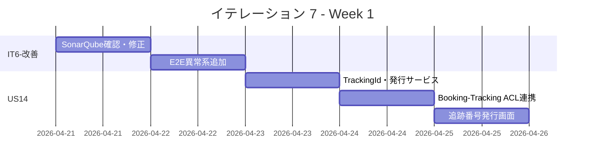
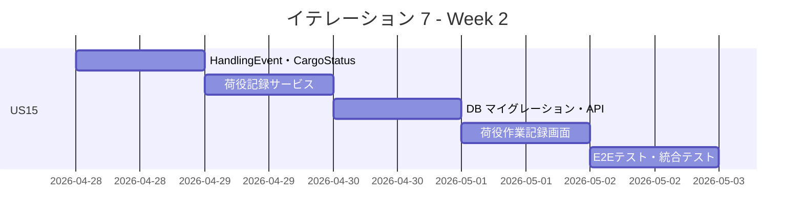
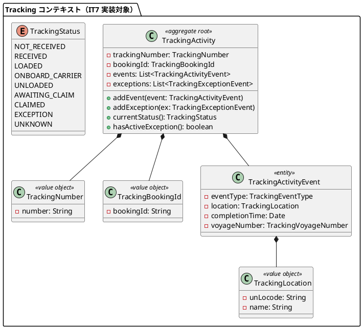
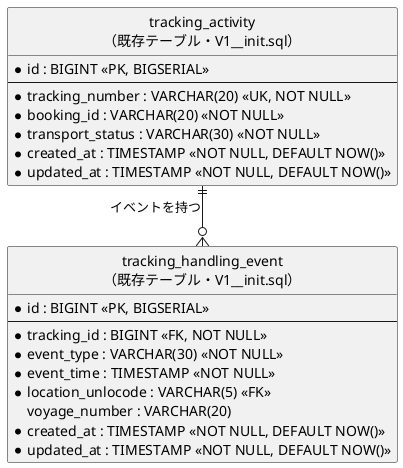
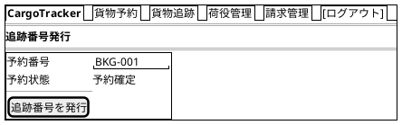
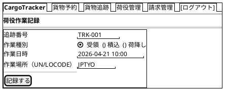
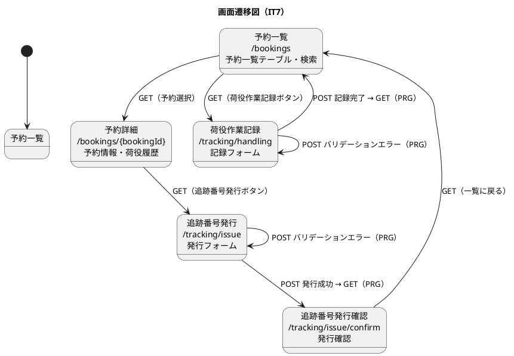

# イテレーション 7 計画

## 概要

| 項目 | 内容 |
|------|------|
| **イテレーション** | 7 |
| **期間** | Week 13-14（2026-04-21 〜 2026-05-04） |
| **ゴール** | IT6 申し送り事項を解消し、追跡番号発行と荷役作業記録の基盤を構築する |
| **目標 SP** | 10 |

---

## ゴール

### イテレーション終了時の達成状態

1. **IT6-改善完了**: SonarQube Quality Gate を確認し、E2E テストの異常系シナリオ（OVERDUE・バリデーションエラー）を追加する
2. **US14 完了**: 「予約確定」状態の予約に対して一意の追跡番号が発行され、貨物状態が「受領待ち」に設定される
3. **US15 完了**: 追跡番号で貨物を特定し、作業種別・日時・場所を登録すると貨物状態が自動更新される

### 成功基準

- [ ] SonarQube Quality Gate が PASS している
- [ ] E2E 異常系シナリオ（OVERDUE・バリデーションエラー）が追加されている
- [ ] 「予約確定」状態の予約に追跡番号を発行できる
- [ ] 追跡番号は一意に採番される
- [ ] 発行後、貨物状態が「受領待ち」に設定される
- [ ] 追跡番号で貨物を特定して作業を記録できる
- [ ] 記録後、貨物状態が対応する状態（受領済・積込済・荷降し済）に更新される
- [ ] テストカバレッジ 80% 以上

---

## ユーザーストーリー

### 対象ストーリー

| ID | ユーザーストーリー | SP | 優先度 |
|----|-------------------|----|--------|
| IT6-改善 | IT6 申し送り事項対応（SonarQube + E2E 異常系） | 2 | 必須 |
| US14 | 追跡番号を発行する | 3 | 必須 |
| US15 | 荷役作業を記録する | 5 | 必須 |
| **合計** | | **10** | |

### ストーリー詳細

#### IT6-改善: IT6 申し送り事項対応

**対応内容**:

- T1: SonarQube Quality Gate の確認・未解決イシューの対応
- T2: E2E テストの異常系シナリオ追加（OVERDUE・バリデーションエラー）
- T4: htmx フラグメントを `th:fragment` で実装（優先度中、時間があれば）

#### US14: 追跡番号を発行する

**ストーリー**:
> 経路設計者として、確定した予約に対して一意の追跡番号を発行し、荷主に通知したい。なぜなら、荷主が追跡番号を使って輸送状況をいつでも確認できるようになるからだ。

**受入条件**:

- [ ] 「予約確定」状態の予約に対して追跡番号を発行できる
- [ ] 追跡番号は一意に採番される
- [ ] 発行後、貨物状態が「受領待ち」に設定される
- [ ] 荷主に追跡番号と追跡方法をメール通知する

#### US15: 荷役作業を記録する

**ストーリー**:
> 荷役作業員として、追跡番号を入力して貨物を特定し、作業種別・日時・場所を登録したい。なぜなら、荷役作業完了が即座に貨物状態に反映され、荷主がリアルタイムで確認できるからだ。

**受入条件**:

- [ ] 追跡番号の入力（またはスキャン）で貨物を特定できる
- [ ] 作業種別（受領・積込・荷降し）を選択できる
- [ ] 作業日時と作業場所（UN/LOCODE 形式の港湾コード）を入力できる
- [ ] 記録後、貨物状態が対応する状態（受領済・積込済・荷降し済）に自動更新される
- [ ] 記録後、荷主に状態変更通知が送信される
- [ ] 追跡番号が存在しない場合、エラーメッセージが表示される
- [ ] 作業場所が予定ルートと異なる場合、警告が表示される

### タスク

#### 1. IT6-改善（2 SP）

| # | タスク | 見積もり | 担当 | 状態 |
|---|--------|---------|------|------|
| 1.1 | SonarQube スキャン実行・Quality Gate 確認 | 1h | - | [ ] |
| 1.2 | SonarQube 指摘事項の修正（Critical/Major） | 2h | - | [ ] |
| 1.3 | E2E 異常系シナリオ追加（billing.spec.ts の OVERDUE フロー） | 2h | - | [ ] |
| 1.4 | E2E バリデーションエラーシナリオ追加 | 1h | - | [ ] |

**小計**: 6h（理想時間）

#### 2. US14: 追跡番号を発行する（3 SP）

| # | タスク | 見積もり | 担当 | 状態 |
|---|--------|---------|------|------|
| 2.1 | Tracking コンテキスト: `TrackingNumber`・`TrackingBookingId` 値オブジェクト実装（TDD） | 2h | - | [ ] |
| 2.2 | Tracking コンテキスト: `TrackingNumberIssuer` ドメインサービス実装（TDD） | 2h | - | [ ] |
| 2.3 | Booking → Tracking: 追跡番号発行イベント連携（ACL ポート） | 2h | - | [ ] |
| 2.4 | Tracking コントローラ: 追跡番号発行 API エンドポイント実装 | 1h | - | [ ] |
| 2.5 | Thymeleaf: 追跡番号発行画面実装 | 1h | - | [ ] |
| 2.6 | E2E テスト: 追跡番号発行シナリオ作成 | 2h | - | [ ] |

**小計**: 10h（理想時間）

#### 3. US15: 荷役作業を記録する（5 SP）

| # | タスク | 見積もり | 担当 | 状態 |
|---|--------|---------|------|------|
| 3.1 | Tracking コンテキスト: `TrackingActivityEvent`・`TrackingEventType` 実装（TDD） | 2h | - | [ ] |
| 3.2 | Tracking コンテキスト: `TrackingActivity` 集約・`TrackingStatus` 遷移実装（TDD） | 2h | - | [ ] |
| 3.3 | Tracking コンテキスト: 荷役記録アプリケーションサービス実装（TDD） | 2h | - | [ ] |
| 3.4 | DB マイグレーション: `cargo.tracking_number` カラム追加（Flyway V11）+ MyBatis マッパー実装 | 1h | - | [ ] |
| 3.5 | 荷役作業記録 API エンドポイント実装 | 1h | - | [ ] |
| 3.6 | Thymeleaf: 荷役作業記録画面（作業種別選択・場所入力）実装 | 2h | - | [ ] |
| 3.7 | E2E テスト: 荷役作業記録シナリオ（受領・積込・荷降し）作成 | 2h | - | [ ] |
| 3.8 | E2E テスト: 異常系シナリオ（追跡番号不在・場所不一致警告）作成 | 1h | - | [ ] |

**小計**: 13h（理想時間）

#### タスク合計

| カテゴリ | SP | 理想時間 | 状態 |
|---------|----|----|------|
| IT6-改善 | 2 | 6h | [ ] |
| US14 追跡番号発行 | 3 | 10h | [ ] |
| US15 荷役作業記録 | 5 | 13h | [ ] |
| **合計** | **10** | **29h** | |

**1 SP あたり**: 約 2.9h
**進捗率**: 0% (0/10 SP)

---

## スケジュール

### Week 1（Day 1-5）



| 日 | タスク |
|----|--------|
| Day 1 | IT6-改善: SonarQube 確認・修正 |
| Day 2 | IT6-改善: E2E 異常系シナリオ追加 |
| Day 3 | US14: TrackingId・発行サービス実装（TDD） |
| Day 4 | US14: Booking → Tracking ACL 連携 |
| Day 5 | US14: 追跡番号発行画面・E2E テスト |

### Week 2（Day 6-10）



| 日 | タスク |
|----|--------|
| Day 6 | US15: HandlingEvent・CargoStatus 実装（TDD） |
| Day 7 | US15: 荷役記録アプリケーションサービス実装 |
| Day 8 | US15: DB マイグレーション・API エンドポイント実装 |
| Day 9 | US15: 荷役作業記録画面実装 |
| Day 10 | US15: E2E テスト作成・統合テスト・バグ修正・デモ準備 |

---

## 設計

### ドメインモデル

> **注**: domain-model.md の Tracking Context 定義に準拠する。`TrackingActivity` が集約ルート、`TrackingNumber` が識別子、`TrackingStatus` が状態列挙型。



### データモデル

> **注**: data-model.md の Tracking Context 定義に準拠する。`tracking_activity` および `tracking_handling_event` は V1__init.sql で既に定義済みのテーブル。IT7 では新規テーブル作成は不要。既存テーブルを MyBatis マッパーで利用する。



**IT7 での DB マイグレーション方針**:

- `tracking_activity` / `tracking_handling_event` は V1__init.sql 既定義のため新規テーブル作成不要
- 追跡番号発行後に `cargo.tracking_number` カラムを更新する（V1__init.sql の `cargo` テーブルに `tracking_number VARCHAR(20)` カラムが「将来追加予定」として記載済み）
- 必要に応じて `cargo` テーブルへの `tracking_number` カラム追加マイグレーション（V11）を実施する

### ユーザーインターフェース

#### ビュー

> **注**: ui_design.md の共通レイアウト（ナビバー形式）に準拠する。新規画面 `/tracking/issue` および `/tracking/handling` は ui_design.md 画面一覧への追加が必要（本イテレーション完了時に ui_design.md を更新する）。

##### 追跡番号発行画面 (/tracking/issue)



##### 荷役作業記録画面 (/tracking/handling)



#### インタラクション



**htmx パターン**:

| 画面 | 操作 | htmx 属性 |
|------|------|-----------|
| 荷役作業記録フォーム | 追跡番号入力後に貨物情報を非同期照会 | `hx-get="/tracking/lookup" hx-target="#cargo-info" hx-swap="innerHTML"` |
| 荷役作業記録フォーム | フォーム送信（htmx 使用しない・通常 POST/PRG） | - |

**フィードバックメッセージ**:

| 操作 | メッセージ | スタイル |
|------|----------|---------|
| 追跡番号発行成功 | 「追跡番号 {trackingNumber} を発行しました」 | `alert-success` |
| 追跡番号発行失敗（予約状態不正） | 「予約確定状態の予約にのみ追跡番号を発行できます」 | `alert-danger` |
| 荷役作業記録成功 | 「荷役作業を記録しました。貨物状態: {status}」 | `alert-success` |
| 荷役作業記録失敗（追跡番号不在） | 「追跡番号が見つかりません」 | `alert-danger` |
| 荷役作業記録警告（場所不一致） | 「作業場所が予定ルートと異なります」 | `alert-warning` |
| バリデーションエラー | フィールド単位のインラインエラー | `is-invalid` + `invalid-feedback` |

### ディレクトリ構成

```
apps/backend/src/main/java/.../
├── tracking/
│   ├── domain/
│   │   ├── model/
│   │   │   ├── TrackingActivity.java           (集約ルート)
│   │   │   ├── TrackingNumber.java             (値オブジェクト)
│   │   │   ├── TrackingBookingId.java          (値オブジェクト)
│   │   │   ├── TrackingActivityEvent.java      (エンティティ)
│   │   │   ├── TrackingLocation.java           (値オブジェクト)
│   │   │   ├── TrackingVoyageNumber.java       (値オブジェクト)
│   │   │   ├── TrackingStatus.java             (列挙型)
│   │   │   └── TrackingEventType.java          (列挙型)
│   │   └── service/
│   │       └── TrackingNumberIssuer.java        (ドメインサービス)
│   ├── application/
│   │   └── TrackingApplicationService.java
│   └── infrastructure/
│       └── persistence/
│           └── MyBatisTrackingActivityRepository.java
```

### API 設計

| メソッド | エンドポイント | 説明 |
|---------|---------------|------|
| POST | /tracking/issue | 追跡番号を発行する |
| POST | /tracking/handling | 荷役作業を記録する |
| GET | /tracking/{trackingId} | 追跡情報を照会する（US18 で実装） |

---

## ストーリー間の依存関係

| 依存元 | 依存先 | 理由 |
|--------|--------|------|
| US15 | US14 | 荷役作業記録には有効な追跡番号が必要。US14 で `TrackingActivity` が作成されていない状態では US15 の機能テストができない |

実装順序: US14（`TrackingActivity` 作成・追跡番号発行）→ US15（追跡番号で特定して荷役記録）

## IT5 レビュー指摘事項の対応方針

| 指摘 # | 内容 | IT7 対応方針 |
|--------|------|-------------|
| H-4 | Routing コンテキストへのアクセスに ACL 導入 | US14/US15 の Booking → Tracking ACL 設計時に同様のパターンで `TrackingBookingIdPort` を実装する（本イテレーション対応） |
| H-1〜H-3, H-5〜H-9 | Booking/Routing コンテキスト改善 | IT7 スコープ外（Tracking コンテキスト新規実装）のため保留。IT8 以降で対応を検討する |

## リスクと対策

| リスク | 影響度 | 対策 |
|--------|--------|------|
| Tracking コンテキストの新規作成による工数増 | 高 | IT6 の Billing コンテキスト作成の経験を活かす |
| Booking → Tracking の ACL 設計が複雑 | 中 | 既存の Routing ACL パターンを参考にする |
| 荷役作業と貨物状態の整合性 | 中 | `TrackingActivity.addEvent()` でドメインイベント駆動の状態遷移を管理する |
| domain-model.md の `TrackingActivity` 集約との整合性 | 中 | 設計セクションの修正済み定義に従い、`CargoTracking` ではなく `TrackingActivity` を集約ルートとして実装する |

---

## 完了条件

### Definition of Done

- [ ] コードレビュー完了
- [ ] ユニットテストがパス（Java テスト数 > 272 件）
- [ ] E2E テストがパス（E2E テスト数 > 67 件）
- [ ] SonarQube Quality Gate PASS
- [ ] 機能がローカル環境で動作確認済み
- [ ] ドキュメント更新完了

### デモ項目

1. SonarQube Quality Gate PASS の確認
2. 「予約確定」状態の予約から追跡番号を発行
3. 追跡番号で貨物を特定して荷役作業（受領・積込・荷降し）を記録
4. 各作業後に貨物状態が正しく更新されることを確認

---

## 更新履歴

| 日付 | 更新内容 | 更新者 |
|------|---------|--------|
| 2026-04-10 | 初版作成 | - |
| 2026-04-17 | 整合性検証結果に基づく修正: ドメインモデル（`CargoTracking`→`TrackingActivity`・`TrackingStatus` 9値修正）、データモデル（既存テーブル利用・V11 内容変更）、UI 設計（ナビバー・htmx パターン・フィードバック追加）、US15 受入条件省略を補完、IT5 指摘事項対応方針追加 | - |

---

## 関連ドキュメント

- [イテレーション 7 ふりかえり](./retrospective-7.md)
- [イテレーション 7 完了報告書](./iteration_report-7.md)
- [イテレーション 6 計画](./iteration_plan-6.md)
- [イテレーション 6 ふりかえり](./retrospective-6.md)
- [リリース計画](./release_plan.md)
