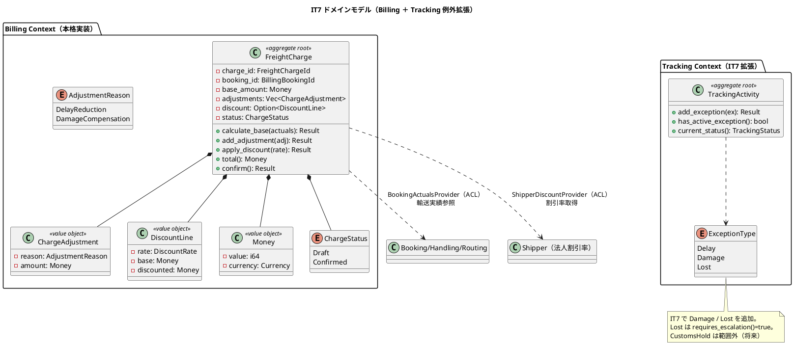
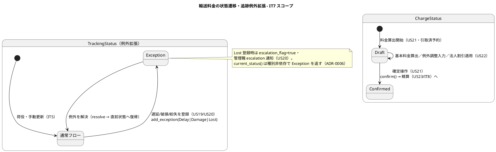
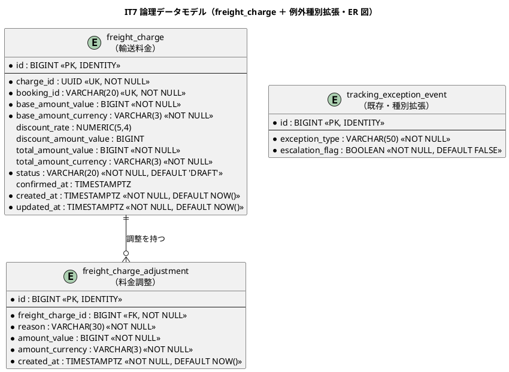
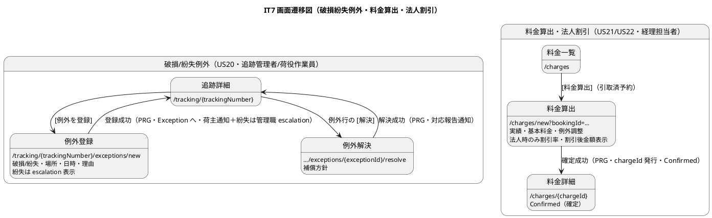
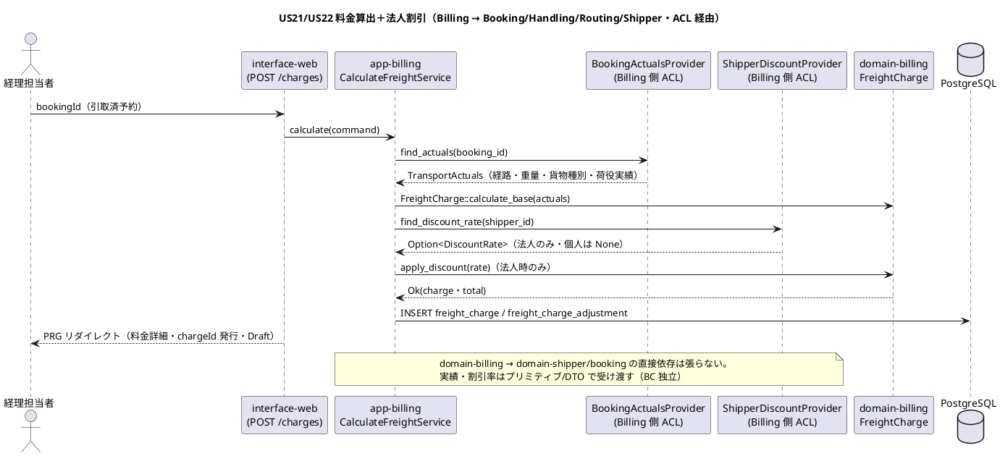

# イテレーション 7 計画

## 概要

| 項目 | 内容 |
|------|------|
| **イテレーション** | 7 |
| **期間** | Week 13-14（2 週間・2026-09-30 〜 2026-10-13） |
| **局面** | 終盤（アウトサイドイン） |
| **ゴール** | Tracking Context の例外種別を破損・紛失に拡張し（US20）、Billing Context をスケルトンから本格実装して輸送料金算出（US21）・法人割引適用（US22）を成立させる。中盤で実装済みの Shipper（法人割引率）・Booking・Handling・Routing 集約を業務シナリオ起点で束ね、精算（US23・IT8）の前提となる「確定した輸送料金」を作る（Release 1.1 例外対応・請求の中核） |
| **目標 SP** | 13（US20 5・US21 5・US22 3・release_plan Phase 3 準拠） |

---

## ゴール

### イテレーション終了時の達成状態

1. **破損・紛失例外の処理（US20）**: 追跡管理者（または荷役作業員）が追跡番号・例外種別「破損」または「紛失」・発生状況（場所・日時・理由）を記録すると、`TrackingActivity` に例外イベントが追加され、`current_status()` が「例外発生（Exception）」を返す（ADR-0006 の導出拡張を踏襲）。**例外種別「紛失」の場合は緊急フラグ（`escalation_flag`）が設定され、管理職への escalation 通知が送信（記録）される**。荷主へ破損・紛失発生の通知が送信され、対応内容（補償方針等）の入力で対応報告を送信できる。`ExceptionType` を `Delay` から `Damage`・`Lost` に拡張する。
2. **輸送料金の算出（US21）**: 経理担当者が「引取済（引取記録済み）」状態の予約に対して料金算出を開始でき、輸送実績（経路・重量・貨物種別・荷役作業実績）をもとに基本料金が自動計算される。例外（遅延・破損等）が発生している場合は料金調整（減額・補償費用）を入力でき、算出結果を確認して確定操作を行うと、輸送料金が「確定（Confirmed）」状態で登録される。`domain-billing` の `FreightCharge` 集約（基本料金・調整・合計を保持）をアウトサイドインで実装する。
3. **法人割引の適用（US22）**: 経理担当者が料金算出を行う際、荷主種別が「法人」の場合は Shipper Context の契約割引率（`DiscountRate`・0〜30%）が ACL 経由で自動取得・表示され、基本料金に適用されて割引後金額が算出される。個人荷主の場合は割引が適用されない。割引計算の根拠（割引率・基本料金・割引後料金）が `FreightCharge` に保持され、精算書（US23・IT8）に引き継げる。

### 成功基準

- US20・US21・US22 の全受入基準に 1:1 対応するテストが存在し green。**通知系受入基準（US20 破損/紛失通知・紛失 escalation・対応報告）は永続化テーブル（notification）を宛先・種別まで含めてアサートする統合テストをセットで実装する（IT6 Try#1）**。
- `domain-billing`・`app-billing`（新規クレート）がスケルトンから `FreightCharge` 集約・`Money`・`DiscountRate` 適用・料金算出ユースケースを備えた実装へ昇格。
- `ExceptionType` を `Damage`・`Lost` に拡張し、`Lost` 登録時に escalation_flag と管理職通知が発火する（US20）。IT6 の遅延例外フローが回帰しない。
- 法人割引は Shipper ACL（`ShipperDiscountProvider`）経由で取得し、`domain-billing` は `domain-shipper` の domain クレートに依存しない（BC 独立）。
- ワークスペース clippy `-D warnings` クリーン・fmt 準拠・domain/app カバレッジ維持・`cargo audit`／`cargo deny` 緑（CI）。

---

## ユーザーストーリー

### 対象ストーリー

| ID | ユーザーストーリー | SP | 対応 UC | アクター |
|----|-------------------|----|--------|--------|
| US20 | 破損・紛失例外を処理する | 5 | UC16 | 追跡管理者・荷役作業員 |
| US21 | 輸送料金を算出する | 5 | UC17 | 経理担当者 |
| US22 | 法人割引を適用する | 3 | UC17 | 経理担当者 |
| **合計** | | **13** | | |

### ストーリー詳細

#### US20: 破損・紛失例外を処理する（5 SP）

**として** 追跡管理者（または荷役作業員）**したい** 輸送中に破損または紛失が発生した場合、例外種別「破損」または「紛失」として記録し、関係者に緊急通知を送りたい **なぜなら** 重大な例外は即座に全関係者に共有し、保険手続き・補償対応・代替措置を迅速に開始できるからだ。

**受け入れ基準**:

- [ ] 追跡番号と例外種別「破損」または「紛失」・発生状況を記録できる
- [ ] 記録後、貨物状態が「例外発生」に更新される
- [ ] 例外種別「紛失」の場合、緊急フラグが設定されて管理職への escalation 通知が送信される
- [ ] 荷主に破損・紛失発生の通知が送信される
- [ ] 対応内容（補償方針等）を入力して荷主に報告を送信できる

#### US21: 輸送料金を算出する（5 SP）

**として** 経理担当者 **したい** 配送完了した予約に対して輸送実績（経路・重量・貨物種別・荷役実績）をもとに輸送料金を算出したい **なぜなら** 実際の輸送内容に基づく正確な料金を算出し、精算に進めるからだ。

**受け入れ基準**:

- [ ] 「引取済」状態の予約に対して料金算出を開始できる
- [ ] 輸送実績（経路・距離・重量・貨物種別・荷役作業実績）が表示される
- [ ] 基本料金が自動計算される
- [ ] 算出結果を確認して確定操作ができる
- [ ] 確定後、輸送料金が「確定」状態で登録される
- [ ] 例外（遅延・破損等）が発生している場合、料金調整（減額・補償費用）の入力ができる

#### US22: 法人割引を適用する（3 SP）

**として** 経理担当者 **したい** 法人荷主の場合に、契約割引率を基本料金に自動適用して割引後の請求金額を確定したい **なぜなら** 法人契約条件に基づく正確な割引を自動化し、手計算ミスを防ぐからだ。

**受け入れ基準**:

- [ ] 荷主種別が「法人」の場合、料金算出時に契約割引率が自動的に取得・表示される
- [ ] 割引率（0〜30%）が基本料金に適用され、割引後の金額が表示される
- [ ] 個人荷主の場合は割引が適用されない
- [ ] 割引計算の根拠（割引率・基本料金・割引後料金）が精算書に記載される（本 IT では `FreightCharge` に保持し、精算書記載は US23／IT8 で実現）

### タスク

#### 0. IT6 ふりかえり Try 返済枠（技術的負債返済・SP 外）

- [ ] **Try#1**: 「送信＝記録」系の通知テストは件数だけでなく**宛先・本文（recipient_email・種別）まで**アサートすることを DoD に組み込む。US20 の破損/紛失通知・紛失 escalation・対応報告で notification テーブルを宛先・種別までアサート（対応表に通知アサート列を設置）。
- [ ] **Try#2**: 受入基準に UI 表示制御（法人割引フィールドの出し分け・可視/不可視）が含まれるため、E2E で `toBeVisible`/`toBeHidden` を必須ケース化する（危険物出し分け型の再発防止）。US22 の法人時のみ割引率表示、US20 の紛失時 escalation 表示に適用。
- [ ] **Try#3**: 通知の実配信（メール送信アダプター `infra-external`）と照会画面の通知履歴導線を実装する（IT6 繰り越し分）。`NotificationPort` の実配信実装（ログ／SMTP スタブ）と、公開追跡ページ・ダッシュボードへの通知履歴表示を追加。
- [ ] **Try#4**: 確定経路からの推定到着日導出を実装し、US18 の「到着予定」を厳密化＋導出テストで固定する（IT6 レビュー H6 既知負債返済）。`SelectedRoute`（Routing）の到着日を Tracking 照会へ ACL 経由で連携。
- [ ] **Try#5**: rank 採番の責務を集約 `replace_candidates` に一元化する（ACL は算出のみ・rank は集約が採番。ADR-0007 負債返済）。
- [ ] **Try#6**: dashboard の最新荷役一覧・予約詳細への追跡番号表示・見積の有効期限・公開ページ再照会フォームを UX 改善としてまとめて対応（IT6 繰り越し分・受入基準外 UX）。

> Try#3〜#6 は受入基準外の負債返済・UX 改善であり、SP には含めない。US20〜US22 の受入完了を優先し、時間が不足する場合は Try#5／#6 を IT8 のハードニング枠へ再繰り越しする（優先度: Try#1 > #2 > #3 > #4 > #5 > #6）。

#### 1. 破損・紛失例外（US20・Tracking 例外拡張）（US20 5 SP）

- [ ] `domain-tracking` の `ExceptionType` に `Damage`・`Lost` を追加（`as_str`／`from_str` の網羅・`Lost` は `requires_escalation()` を true）。既存 `Delay` 挙動は不変（回帰テスト）。
- [ ] `TrackingActivity::add_exception()` を拡張し、`Lost`（および escalation 対象）の場合に `escalation_flag = true` を設定。`has_active_exception()`／`current_status()` は種別非依存で Exception を返す（ADR-0006 踏襲・種別追加で分岐増やさない）。
- [ ] `app-tracking::TrackingExceptionService` を拡張: 破損/紛失記録で荷主通知、`Lost` 時は管理職 escalation 通知を追加発火。対応報告（補償方針）を記録（notification 宛先・種別アサート）。
- [ ] `infra-persistence`: `tracking_exception_event` の `exception_type` に DAMAGE/LOST を格納（マイグレーション不要・既存カラム VARCHAR(50)）。escalation_flag は既存カラムを利用。
- [ ] インターフェース: 例外登録フォームの種別選択に「破損」「紛失」を追加、紛失時 escalation 表示（Try#2 の可視性 E2E）。

#### 2. 輸送料金算出ドメイン・アプリ（US21・Billing 本格実装）（US21 5 SP）

- [ ] `domain-billing` を昇格: `FreightCharge` 集約（`FreightChargeId`・UUID）・`Money`（値・通貨 ISO4217）・`ChargeStatus{ Draft, Confirmed }`・`base_amount`・`adjustments: Vec<ChargeAdjustment>`・`discount`・`total()`・`confirm()`・`FreightChargeRepository` ポート。純粋関数で基本料金算出（距離×重量×貨物種別係数・名前付き定数・IT6 Try 教訓で金額は単体テスト必須）。
- [ ] `app-billing`（新規クレート）: `CalculateFreightService`。`BookingActualsProvider` ACL で Booking／Handling／Routing の輸送実績（経路・重量・貨物種別・荷役実績）を参照し、基本料金＋例外調整を算出。「引取済」状態でない予約は料金算出不可（ドメインエラー）。
- [ ] `infra-persistence`: `freight_charge`／`freight_charge_adjustment` マイグレーションと `SqlxFreightChargeRepository`（マイグレーション `20260930000001_it7_billing_charge.sql`）。
- [ ] ワークスペース登録: `Cargo.toml` に `app-billing` を追加、`domain-billing`／`app-billing` を server 結線。

#### 3. 法人割引適用（US22・Shipper ACL）（US22 3 SP）

- [ ] `domain-billing` に割引適用ロジック: `FreightCharge::apply_discount(rate: DiscountRate)` で基本料金×割引率を割引額として算出し `total()` に反映。個人（割引率なし）は無適用。割引根拠（割引率・基本料金・割引後料金）を保持。
- [ ] `Money` と `DiscountRate` の扱い: `domain-billing` は `domain-shipper` に依存せず、割引率は app 層が `ShipperDiscountProvider` ACL 経由で取得し `f64`／`Decimal` のプリミティブで受け渡す（BC 独立）。`domain-billing` 側で `DiscountRate`（0〜30% バリデーション）を再定義。
- [ ] `app-billing::CalculateFreightService` を拡張: 予約の荷主 ID から `ShipperDiscountProvider` で割引率を取得し `apply_discount`。法人のみ割引、個人は 0%。
- [ ] インターフェース: 料金算出画面で法人時のみ割引率・割引後金額を表示（Try#2 の可視性 E2E で法人/個人の出し分けを検証）。

#### 4. インターフェース（画面・htmx／PRG）・通知実配信（Try#3）

- [ ] 例外登録画面の破損/紛失対応・料金算出一覧／算出／確定画面（`RoleGuard<BillingRole>`／`RoleGuard<TrackerRole>`・marker `BillingRole` を IT7 で追加）・`BookingActualsProvider`／`ShipperDiscountProvider` ACL。
- [ ] `NotificationPort` の実配信アダプター（`infra-external`・ログ or SMTP スタブ）と通知履歴導線（公開追跡ページ・dashboard）を追加（Try#3）。
- [ ] HTTP フロー統合テスト（testcontainers）で US20（破損・紛失・escalation）・US21（料金算出・確定・例外調整）・US22（法人割引・個人無割引）を検証。
- [ ] E2E デモ受け入れテスト（破損/紛失例外＋紛失 escalation 可視性・料金算出→確定・法人割引出し分け可視性）を追加（IT1〜IT7 全件 green）。
- [ ] ナビゲーション整合: 料金算出（経理）メニューを navbar／dashboard／検証テストの 4 点で一致させる。

#### タスク合計

Billing・例外拡張 13 SP（US20 5・US21 5・US22 3）＋ Try 返済枠（SP 外）。

---

## スケジュール

### Week 1（Day 1-5）

- Day 1: Try#5（rank 集約一元化）返済＋ US20 受入テスト作成（アウトサイドイン起点）・`ExceptionType` 拡張（Damage/Lost）TDD
- Day 2: US20 破損/紛失記録・紛失 escalation 通知・対応報告（notification 宛先・種別アサート・Try#1）＋例外登録画面拡張
- Day 3: `domain-billing` 昇格 TDD（`FreightCharge`・`Money`・`ChargeStatus`・基本料金算出・金額単体テスト）
- Day 4: `app-billing` 新規クレート＋ `BookingActualsProvider` ACL で輸送実績参照・基本料金算出・「引取済」ガード
- Day 5: `freight_charge`／`freight_charge_adjustment` マイグレーション・sqlx リポジトリ・料金算出画面（US21 HTTP フロー）

### Week 2（Day 6-10）

- Day 6: US22 法人割引 `apply_discount`＋ `ShipperDiscountProvider` ACL・法人/個人出し分け（可視性 E2E・Try#2）
- Day 7: 例外時料金調整（減額・補償費用）＋料金確定（Confirmed）・US21/US22 HTTP フローテスト
- Day 8: Try#3（通知実配信アダプター・通知履歴導線）＋ Try#4（確定経路からの推定到着日導出・US18 厳密化）
- Day 9: Try#6（dashboard 拡充・見積有効期限・公開再照会フォーム）＋ E2E（破損/紛失・料金・割引デモ）
- Day 10: 受入基準×テスト対応表突合・`cargo audit`／`cargo deny` 確認・developing-review 反映・クローズ準備

---

## 設計

> 本 IT の対象スコープに絞り、設計の各トピックに PlantUML 図を掲載する。US20 は状態を持つ集約（Tracking 例外拡張）、US21/US22 は状態を持つ集約（FreightCharge の Draft→Confirmed）であり、ドメインモデル図・状態遷移図・ER 図（データモデル）・画面遷移図（UI）・シーケンス図（US21/US22 の料金算出＋割引 ACL）を掲載する。

### ドメインモデル（Billing Context 本格実装 ＋ Tracking 例外拡張・IT7）

> **BC 独立**: `domain-billing` は他 BC の domain クレート（`domain-shipper`／`domain-booking`／`domain-handling`／`domain-routing`）に依存しない。輸送実績参照・割引率取得は app 層が ACL（`BookingActualsProvider`・`ShipperDiscountProvider`）経由で行い、プリミティブ／DTO で受け渡す（IT3-6 の ACL パターン踏襲）。`DiscountRate` は Shipper と Billing で別々に定義する（コンテキスト固有型・IT6 の BC 独立方針）。

### 状態遷移図（FreightCharge・Tracking 例外拡張・IT7 中核）

### データモデル（Billing ＋ Tracking 例外・IT7）

マイグレーション: `20260930000001_it7_billing_charge.sql`（`freight_charge`・`freight_charge_adjustment`）。`tracking_exception_event` は IT6 で作成済みのため、DAMAGE/LOST は既存 VARCHAR(50) カラムへ格納しマイグレーション不要。

> **注（設計への反映が必要・data-model）**: `docs/design/data-model.md` の Billing Context は `invoice`／`invoice_line_item`／`payment` の 3 テーブルのみで、輸送料金算出（US21）と精算書発行（US23）を分離する `freight_charge` テーブルが未定義。本 IT で `freight_charge`／`freight_charge_adjustment` を追加し data-model に反映する（「確定した輸送料金」を US23 の精算書生成の入力とする段階分割）。

### ユーザーインターフェース

| 画面 | パス | ロール | US |
|------|------|--------|----|
| 例外登録（破損/紛失対応） | `/tracking/{trackingNumber}/exceptions/new` | 追跡管理者・荷役作業員 | US20 |
| 例外解決（対応報告） | `/tracking/{trackingNumber}/exceptions/{exceptionId}/resolve` | 追跡管理者 | US20 |
| 料金算出一覧 | `/charges` | 経理担当者（`ROLE_BILLING`） | US21 |
| 料金算出（実績・基本料金・調整・割引） | `/charges/new?bookingId={bookingId}` | 経理担当者（`ROLE_BILLING`） | US21/US22 |
| 料金詳細（確定） | `/charges/{chargeId}` | 経理担当者（`ROLE_BILLING`） | US21/US22 |

> **命名統一**: 例外登録/解決は IT6 で `{trackingNumber}` に統一済みの正典パスを踏襲する。料金は業務語「輸送料金＝freight charge」に一致する `/charges`・`{chargeId}`（UUID）を用いる。

#### 画面遷移図（IT7 スコープ）

### API 設計

- 破損/紛失例外（US20）: `GET /tracking/{trackingNumber}/exceptions/new`（登録フォーム・種別に破損/紛失追加）→ `POST /tracking/{trackingNumber}/exceptions`（登録・PRG・紛失は escalation 通知）
- 例外解決（US20・IT6 と共通）: `GET .../exceptions/{exceptionId}/resolve` → `POST` 同パス（対応報告・PRG）
- 料金算出（US21/US22）: `GET /charges`・`GET /charges/new?bookingId={bookingId}`（実績・基本料金・法人割引表示）→ `POST /charges`（Draft 作成・調整/割引適用）→ `POST /charges/{chargeId}/confirm`（確定・PRG）／`GET /charges/{chargeId}`
- 認可は `RoleGuard<R>`（`TrackerRole`／`BillingRole`）。料金算出は経理ロール（`ROLE_BILLING`）に限定する。

> **注（実装・設計の実態／validating 反映）**: 経理担当者ロールは **`shared_kernel::Role::Billing`（`ROLE_BILLING`）として実装済み**で、シードユーザーにも割当済み（`seed.rs`・`&[Role::Billing]`）。`ui_design.md` も `ROLE_BILLING` で一致。したがって本 IT で新設するのは **interface-web の `RoleGuard` マーカー型 `BillingRole`（`const ROLE = "ROLE_BILLING"`）のみ**（既存 `SalesRole`／`TrackerRole` 等と同様）。一方 `architecture_backend.md` の RBAC 表は「ACCOUNTANT」と表記ゆれがあるため、本 IT で `BILLING` に統一する（設計・実装が正）。US21/US22/US23 は `ROLE_BILLING` を前提とする。

#### シーケンス図（US21/US22 料金算出＋法人割引・BC 跨ぎ ACL）

### ADR

- **ADR 踏襲**: ADR-0006（追跡状態の純粋関数導出）を Damage/Lost に拡張（`current_status()` は種別非依存で Exception を返す・分岐を増やさない）。ADR-0007（Estimation の ACL 隔離パターン）を Billing の `BookingActualsProvider`／`ShipperDiscountProvider` に適用。ADR-0003（Arc<dyn> 注入）・ADR-0001（CQRS）を踏襲。
- **ADR 候補（起票予定）**: **ADR-0009 Billing Context の料金モデルと精算書分離**（`freight_charge`＝確定した輸送料金 と `invoice`＝精算書 を段階分割する設計判断・US21/US23 の責務境界）。**ADR-0010 コンテキスト横断の金額表現（`Money` 値オブジェクトの BC ローカル定義方針）**（shared-kernel に昇格せず Billing ローカルに置く根拠・IT6 BC 独立方針の継続）。

### docs/design への反映が必要な設計要素（当該 IT で反映）

1. **`data-model.md` に `freight_charge`／`freight_charge_adjustment` テーブルを追加**（Billing Context・US21 輸送料金算出の永続化構造・invoice との段階分割）。
2. **`domain-model.md` の Tracking Context `ExceptionType` 要素表を「IT7 で Delay/Damage/Lost 実装済み・CustomsHold 未実装」に更新**（現状 DELAY/DAMAGE/LOST/CUSTOMS_HOLD 全列挙）。Billing Context に `FreightCharge`・`Money`・`ChargeStatus` を追記。
3. **`architecture_backend.md` の RBAC 表・段階的実装計画**に Billing Context（Phase）を反映し、RBAC 表の経理ロール表記「ACCOUNTANT」を実装・`ui_design.md` に合わせて **`BILLING`（`ROLE_BILLING`）に統一**する。
4. **`ui_design.md`** に料金算出画面（`/charges`）・法人割引出し分けの salt/仕様を追加し、navbar に経理メニューを反映。

---

## 受入基準 × テストケース対応表（Try#1・通知アサート列付き）

### US20: 破損・紛失例外を処理する

| 受入基準 | 想定テスト | 通知アサート |
|---------|-----------|------------|
| 破損/紛失記録 | domain-tracking::破損/紛失例外を追加できる / app-tracking::破損/紛失を記録する | - |
| Exception 更新 | domain-tracking::未解決例外があると current_status は Exception（種別非依存） | - |
| 紛失 escalation | domain-tracking::Lost は escalation_flag=true / interface-web::exception_flow 紛失登録 | **notification に EXCEPTION_RAISED（宛先＝荷受人）＋ ESCALATION（宛先＝管理職）記録** |
| 破損/紛失通知 | interface-web::exception_flow 破損登録 | **notification に EXCEPTION_RAISED 記録（宛先＝荷受人連絡先）** |
| 対応報告 | app-tracking::対応報告（補償方針）を記録する | **notification に EXCEPTION_RESOLVED 記録（宛先アサート）** |

### US21: 輸送料金を算出する

| 受入基準 | 想定テスト | 通知アサート |
|---------|-----------|------------|
| 引取済で開始 | app-billing::引取済でない予約は料金算出不可 | - |
| 実績表示 | interface-web::charge_flow 実績（経路・重量・貨物種別・荷役）表示 | - |
| 基本料金自動計算 | domain-billing::基本料金を距離×重量×係数で算出する（金額単体テスト・名前付き定数） | - |
| 確認・確定操作 | interface-web::charge_flow 確定 / domain-billing::confirm で Confirmed へ | - |
| 確定状態で登録 | infra::freight_charge_repository 確定を永続化する | - |
| 例外時料金調整 | domain-billing::例外調整（減額・補償費用）を total に反映する | - |

### US22: 法人割引を適用する

| 受入基準 | 想定テスト | 通知アサート |
|---------|-----------|------------|
| 法人時割引率取得・表示 | app-billing::法人荷主の割引率を ACL で取得する / interface-web::charge_flow 法人時に割引率表示（toBeVisible・Try#2） | - |
| 割引適用・割引後金額 | domain-billing::apply_discount で基本料金×割引率を割引後金額に反映する | - |
| 個人は無割引 | domain-billing::個人荷主（割引なし）は total が基本料金と一致する / interface-web::charge_flow 個人時に割引率非表示（toBeHidden・Try#2） | - |
| 割引根拠保持 | domain-billing::DiscountLine が割引率・基本料金・割引後料金を保持する | - |

---

## リスクと対策

| リスク | 影響 | 対策 |
|--------|------|------|
| Billing がスケルトンからの新規実装で US21/US22 8 SP が大きい | 13 SP 未達 | アウトサイドインで受入テストを先に固定し、基本料金算出は距離×重量×係数のスタブ的純粋関数で薄く。ACL は Estimation（IT6）の `RouteCandidateProvider` 実装を流用 |
| `freight_charge` テーブルが data-model 未定義（設計ギャップ） | 設計乖離 | 本 IT で `freight_charge`／`freight_charge_adjustment` を追加し data-model に反映（ADR-0009 で invoice との段階分割を記録）。実装と設計を同時反映 |
| 経理ロールの RoleGuard マーカー未整備 | 認可漏れ・手戻り | `Role::Billing`・シード・`ui_design` は整備済み。IT7 で追加するのは interface-web の marker 型 `BillingRole` のみ。ルーティングテストで経理限定アクセス（`ROLE_BILLING`）を検証（ADR-0008 の per-handler 認可リスク踏襲） |
| Damage/Lost 追加で `current_status()` の既存挙動（IT6 遅延）が変わる | IT6 回帰 | 種別非依存の「未解決例外があれば Exception」を維持し分岐を増やさない。IT6 の遅延例外フローテストが回帰しないことを確認 |
| Try 返済枠（#3〜#6）がスコープを圧迫 | 受入未達 | US20〜US22 の受入を最優先し、Try#5/#6 は IT8 ハードニング枠へ再繰り越し可とする（優先度順に消化） |

---

## 完了条件

### Definition of Done

- [ ] US20・US21・US22 の全受入基準に対応するテストが存在し green（通知系は notification テーブルを宛先・種別までアサート・Try#1）
- [ ] `ExceptionType` に Damage/Lost 追加・Lost は escalation_flag＋管理職通知・IT6 遅延フローが回帰しない
- [ ] `domain-billing`・`app-billing`（新規）が `FreightCharge` 集約・`Money`・料金算出・法人割引を備え実装昇格
- [ ] 法人割引は `ShipperDiscountProvider` ACL 経由・`domain-billing` は他 BC domain クレート非依存（BC 独立・Cargo.toml で検証）
- [ ] マイグレーション `20260930000001_it7_billing_charge.sql` 適用・infra 統合テスト green
- [ ] 料金算出は経理ロール（`ROLE_BILLING`・marker `BillingRole` 追加）に限定・ルーティングテスト green
- [ ] ナビゲーション整合（料金算出メニュー・navbar／dashboard／検証テストの 4 点一致）
- [ ] UI 表示制御（法人割引出し分け・紛失 escalation 表示）を E2E で toBeVisible/toBeHidden 検証（Try#2）
- [ ] Try#1〜#4 の返済完了（Try#5/#6 は未達なら IT8 へ再繰り越しを明記）
- [ ] ワークスペース clippy `-D warnings` クリーン・fmt 準拠・`cargo audit`／`cargo deny` 緑（CI）
- [ ] ADR-0009／ADR-0010 起票・data-model／domain-model／architecture_backend／ui_design へ設計反映
- [ ] developing-review（5 エージェント並列）の高優先度指摘をクローズ前に対応

### デモ項目

1. 追跡管理者が破損例外を登録 → 貨物状態が例外発生に・荷主へ破損通知（US20）
2. 追跡管理者が紛失例外を登録 → escalation_flag 設定・管理職へ escalation 通知・荷主へ紛失通知（US20）
3. 経理担当者が引取済予約の料金算出 → 実績表示・基本料金自動計算・確定（Confirmed・chargeId 発行）（US21）
4. 例外発生予約で料金調整（減額・補償費用）を入力 → total に反映（US21）
5. 法人荷主の予約で料金算出 → 割引率自動取得・割引後金額表示（個人は無割引）（US22）

---

## 更新履歴

| 日付 | 内容 |
|------|------|
| 2026-07-24 | IT7 計画初版作成（opening-iteration・IT6 ふりかえり Try 反映） |
| 2026-07-24 | validating-iteration-plan／validating-design 反映: 経理ロールを実装の正典 `ROLE_BILLING`（`Role::Billing`・seed 済み）に統一し、新設は marker 型 `BillingRole` のみと明確化。`architecture_backend.md` の「ACCOUNTANT」表記を `BILLING` に統一する設計反映項目を追加 |
| 2026-07-24 | 開発完了（US20/US21/US22）: ExceptionType 拡張＋紛失 escalation（US20）、domain-billing/app-billing 本格実装・freight_charge マイグレーション＋リポジトリ（US21）、法人割引 ACL（US22）をドメイン→アプリ→インフラ→interface の全層で TDD 実装。単体（domain-billing 12・app-billing 6・domain-tracking 16）＋統合（US20 例外 2・US21/22 料金 4・freight_charge repo 2）green。ADR-0009/0010 起票、data-model/domain-model/architecture_backend 反映、IT7 E2E デモ＋seed 追加。**Try#1（通知宛先・種別アサート）・Try#2（可視性 E2E）を返済。Try#3（通知実配信）・#4（推定到着日厳密化）・#5（rank 一元化）・#6（dashboard 拡充）は IT8 ハードニング枠へ繰り越し** |

---

## 関連ドキュメント

- [リリース計画](./release_plan.md)
- [開発戦略](./development_strategy.md)
- [イテレーション 6 ふりかえり](./retrospective-6.md)
- [イテレーション 6 計画](./iteration_plan-6.md)
- [ドメインモデル設計](../design/domain-model.md)
- [データモデル設計](../design/data-model.md)
- [UI 設計](../design/ui_design.md)
- [ユーザーストーリー](../requirements/user_story.md)
- [ADR-0006 追跡状態の純粋関数導出と Booking→Tracking 回復戦略](../adr/0006-tracking-status-derivation-and-cross-context-recovery.md)
- [ADR-0007 Estimation Context 導入と Routing ACL 隔離](../adr/0007-estimation-context-and-routing-acl.md)
- [ADR-0008 公開照会ルートの認証境界分離](../adr/0008-public-route-authz-boundary.md)
