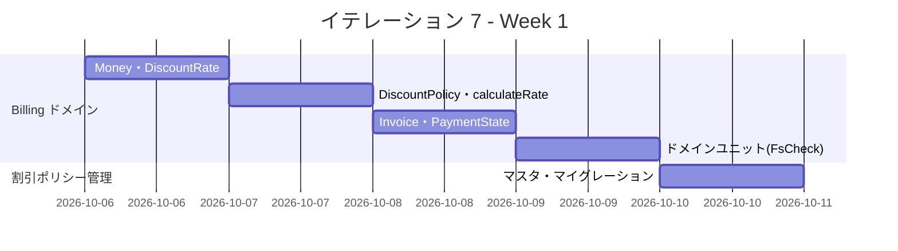
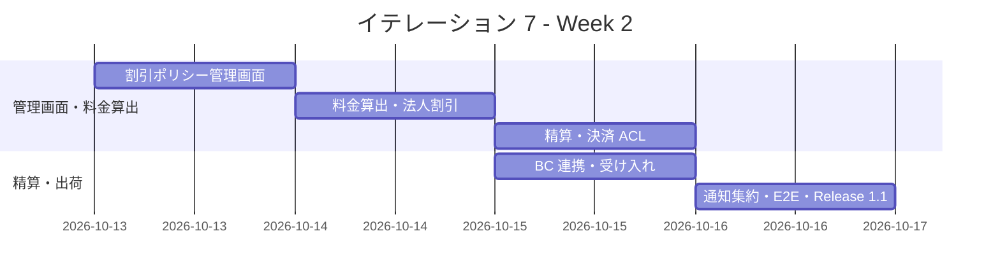
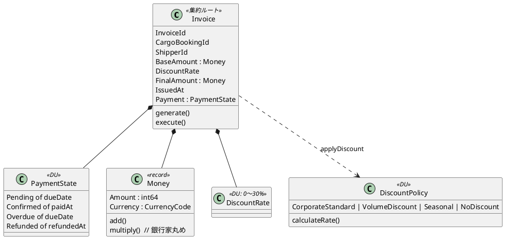
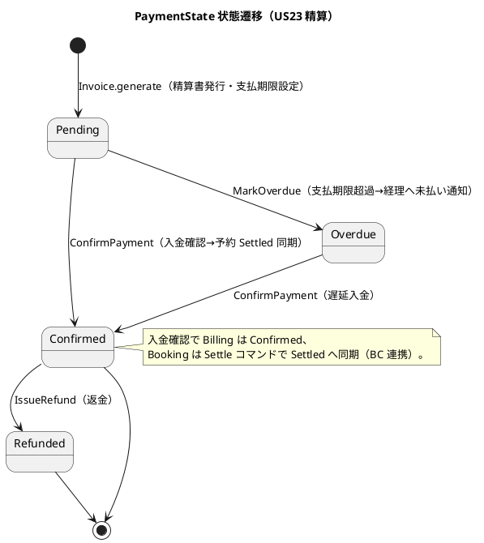
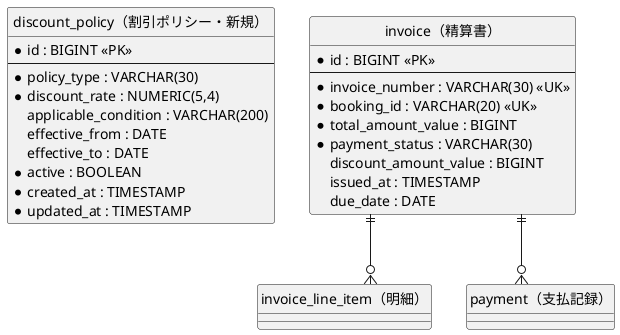
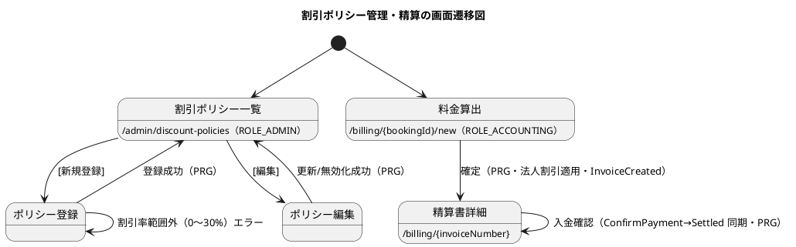

# イテレーション 7 計画

## 概要

| 項目 | 内容 |
|------|------|
| **イテレーション** | 7 |
| **期間** | Week 13-14（2 週間・2026-10-06 〜 2026-10-17 計画） |
| **ゴール** | 割引ポリシー管理・輸送料金算出・法人割引適用・精算処理を実装し、配送完了（引取済）から料金算出→精算書発行→入金確認→予約 Settled 同期までを一気通貫させる。Billing コンテキストを立ち上げ、Release 1.1 を出荷する。 |
| **目標 SP** | 16（US-ADM-01/US21/US22/US23） |

---

## ゴール

### イテレーション終了時の達成状態

1. **割引ポリシー管理（US-ADM-01）**: 運用管理者（ROLE_ADMIN）が割引ポリシー（割引率 0〜30%・適用条件・有効期限）を登録・変更・無効化でき、US22 が常に最新の有効ポリシーで割引計算する。
2. **輸送料金算出（US21）**: 経理担当者が「引取済（Claimed）」の予約に対し輸送実績（経路・重量・貨物種別・荷役実績）から基本料金を算出し、確定できる。例外（遅延・破損）発生時は料金調整（減額・補償費用）を明細として入力できる。
3. **法人割引適用（US22）**: 法人荷主（`ShipperKind.Corporate`）の場合、契約割引率が自動取得され基本料金に適用される。個人荷主は割引なし。割引根拠（割引率・基本料金・割引後金額）が精算書に記載される。
4. **精算処理（US23）**: 確定料金から精算書（請求番号・請求金額・支払期限）を発行し荷主へ通知、決済 ACL（`PaymentGatewayPort`）経由で入金確認すると精算状態が `Confirmed`／予約が `Settled` へ同期する。支払期限超過時は経理担当者へ未払い通知。
5. **Money の堅牢性**: `Money`（int64 + 通貨コード・銀行家丸め）と割引上限 30% の境界値をユニットで固め、金額計算の丸め誤差・不正割引を排除する。

### 成功基準

- [ ] `Invoice.generate`（割引適用・最終金額計算を ROP 合成）が `Money` の銀行家丸め・`DiscountRate` 0〜30% 制約を満たすことを FsCheck 含むユニットで検証する
- [ ] `DiscountPolicy.calculateRate`（法人/ボリューム/シーズン/なし）と `ShipperKind.Corporate` 連携がユニットで網羅検証される
- [ ] `Invoice.execute`（`ConfirmPayment`/`MarkOverdue`/`IssueRefund`・`PaymentState` DU 遷移）が不正遷移を拒否することを検証する
- [ ] 「料金算出→確定→精算書発行→荷主通知→入金確認→予約 Settled 同期」が受け入れテストで一気通貫する
- [ ] `InvoiceRequested`（Booking の Delivered/引取済 契機）→ Billing 料金算出開始、精算完了 → Booking `Settled` 同期が統合テストでパスする
- [ ] 割引ポリシー管理画面（`/admin/discount-policies`・ROLE_ADMIN）が CRUD・無効化で動作し、ナビゲーション整合性（navbar/dashboard/検証テスト）が緑
- [ ] 決済 ACL（`PaymentGatewayPort`）を関数レコードで結線し、契約を WireMock.Net で固定する
- [ ] ドメイン被覆 85%／全体 80% のカバレッジゲート・ArchUnit（Billing の BC 分離）が緑
- [ ] Release 1.1 出荷条件を充足（全テスト緑・カバレッジ維持・E2E 一気通貫）

> **アプローチ（終盤アウトサイドイン IT6-IT7・最終）**: [開発戦略](./development_strategy.md#終盤-アウトサイドインit6-it7)に従い、精算という業務シナリオ（精算書発行→入金確認→予約 Settled 同期）を受け入れテストで Red にし、Web → アプリ層 → ドメイン（`Invoice`・`DiscountPolicy`）の順に駆動する。Billing は新規ドメインのため、`Money`（銀行家丸め）・`DiscountRate`（0〜30%）・`PaymentState` DU をユニットで固めてから結線する。IT2-IT6 で確立した ACL＝関数レコード・NotificationPort・Clock/IdGenerator ポート・post-commit dispatch・カバレッジゲート・ArchUnit の規律を踏襲する。決済 ACL は `PaymentGatewayPort` を WireMock.Net で契約固定（外部連携の最初の実例）。IT7 完了で終盤を終え、Release 1.1 を出荷する。

### 過去ふりかえり・レビュー指摘の反映（IT6 由来）

IT6 レビュー保留・retro-6 Try のうち IT7 スコープに関わる項目を織り込む。

| 出典 | 指摘 | 反映先タスク | 対応方針 |
|------|------|-------------|----------|
| retro-6 Try#4 | 終盤パターン（集約拡張＋DU 写像永続化＋合成層 ACL＋受け入れ縦貫通）を Billing へ適用 | 全タスク | 本 IT の基本方針 |
| retro-6 Try#1 / IT6 レビュー中#3 | 通知を合成層ヘルパへ集約し方針統一 | 4.1 | 精算書通知の実装とセットで通知ヘルパを導入 |
| retro-6 Try#3 | ui_design の例外解決 state・例外種別コード統一（IT6 で反映済み。着手前に再確認） | 着手前チェック | validating-iteration-plan で確認 |
| IT6 レビュー中#3（DRY） | notification_log 書き込みの重複解消 | 4.1 | Billing 通知と共通ヘルパ化 |

---

## ユーザーストーリー

### 対象ストーリー

| ID | ユーザーストーリー | SP | 優先度 |
|----|-------------------|----|----|
| US-ADM-01 | 割引ポリシーを管理する | 3 | 中（US22 の前提マスタ・先行実装） |
| US21 | 輸送料金を算出する | 5 | 必須 |
| US22 | 法人割引を適用する | 3 | 必須 |
| US23 | 精算を処理する | 5 | 必須 |
| **合計** | | **16** | |

> US-ADM-01（割引ポリシー管理）は US22（法人割引）の前提マスタのため US22 より先行して実装する。

### ストーリー詳細

#### US-ADM-01: 割引ポリシーを管理する

**ストーリー**:
> 運用管理者として、法人割引ポリシー（割引率・適用条件・有効期限）の登録・変更・無効化を管理画面（`/admin/discount-policies`・ROLE_ADMIN）から行いたい。なぜなら、法人契約条件の変更を即座にシステムへ反映し、US22 が常に最新のポリシーに基づいて割引計算できるからだ。

**対応 UC**: UC17

**受入条件**:

1. ROLE_ADMIN のユーザーのみが割引ポリシー管理画面にアクセスできる
2. 割引ポリシー一覧（割引率・適用条件・有効期限）を表示し、有効期限でフィルタできる
3. 割引率（0〜30%）と適用条件を指定して新規ポリシーを登録できる
4. 既存ポリシーの割引率・適用条件・有効期限を変更できる
5. ポリシーを無効化でき、無効化されたポリシーは US22 の割引計算に使用されない
6. 割引率が範囲外（0% 未満または 30% 超）の場合、入力エラーが表示される

#### US21: 輸送料金を算出する

**ストーリー**:
> 経理担当者として、配送完了した予約に対して輸送実績（経路・重量・貨物種別・荷役実績）をもとに輸送料金を算出したい。なぜなら、実際の輸送内容に基づく正確な料金を算出し、精算に進めるからだ。

**対応 UC**: UC17

**受入条件**:

1. 「引取済」状態の予約に対して料金算出を開始できる
2. 輸送実績（経路・距離・重量・貨物種別・荷役作業実績）が表示される
3. 基本料金が自動計算される
4. 算出結果を確認して確定操作ができる
5. 確定後、輸送料金が「確定」状態で登録される
6. 例外（遅延・破損等）が発生している場合、料金調整（減額・補償費用）の入力ができる

#### US22: 法人割引を適用する

**ストーリー**:
> 経理担当者として、法人荷主の場合に契約割引率を基本料金に自動適用して割引後の請求金額を確定したい。なぜなら、法人契約条件に基づく正確な割引を自動化し、手計算ミスを防ぐからだ。

**対応 UC**: UC17

**受入条件**:

1. 荷主種別が「法人」の場合、料金算出時に契約割引率が自動的に取得・表示される
2. 割引率（0〜30%）が基本料金に適用され、割引後の金額が表示される
3. 個人荷主の場合は割引が適用されない
4. 割引計算の根拠（割引率・基本料金・割引後料金）が精算書に記載される

#### US23: 精算を処理する

**ストーリー**:
> 経理担当者として、確定した輸送料金をもとに精算書を発行し、荷主への通知・入金確認・精算完了処理を行いたい。なぜなら、精算業務を一元管理し、入金状況を追跡して確実に精算を完了できるからだ。

**対応 UC**: UC18

**受入条件**:

1. 「確定」状態の輸送料金をもとに精算書（請求番号・請求金額・支払い期限）を発行できる
2. 精算書が荷主にメール通知される
3. 決済機関との連携により入金確認ができる
4. 入金確認後、精算状態が「精算済」に更新され予約状態も「精算済」になる
5. 支払い期限超過時、経理担当者に未払い通知が送信される

---

## タスク

### 1. Billing ドメイン（Money・割引・精算・6 SP 相当）

| # | タスク | 見積もり | 担当 | 状態 |
|---|--------|---------|------|------|
| 1.1 | `Money`（int64 + `CurrencyCode`・`add`/`multiply` 銀行家丸め）・`DiscountRate`（0〜30% スマートコンストラクタ）を Billing ドメインに実装 + FsCheck | 3h | - | [ ] |
| 1.2 | `DiscountPolicy` DU・`calculateRate`（法人/ボリューム/シーズン/なし）と `BillingShipperId`（IsCorporate 判定）を実装 | 3h | - | [ ] |
| 1.3 | `Invoice` 集約・`generate`（割引適用・最終金額 ROP 合成）・`PaymentState` DU・`execute`（ConfirmPayment/MarkOverdue/IssueRefund の遷移ガード） | 4h | - | [ ] |
| 1.4 | ドメインユニット（FsCheck: Money 丸め・割引上限 30%・PaymentState 不正遷移拒否・法人/個人分岐） | 4h | - | [ ] |

**小計**: 14h（理想時間）

### 2. 割引ポリシー管理（US-ADM-01・3 SP）

| # | タスク | 見積もり | 担当 | 状態 |
|---|--------|---------|------|------|
| 2.1 | `DiscountPolicy` マスタのドメイン（有効期限・適用条件・無効化）とリポジトリポート | 2h | - | [ ] |
| 2.2 | マイグレーション `discount_policy`（新規・data-model へ追加）・Donald リポジトリ | 2h | - | [ ] |
| 2.3 | 管理画面（`/admin/discount-policies` 一覧/新規/編集/無効化・ROLE_ADMIN）・navbar/dashboard 整合・検証テスト | 3h | - | [ ] |
| 2.4 | 割引率範囲外（0〜30% 逸脱）のバリデーションと受け入れテスト | 2h | - | [ ] |

**小計**: 9h（理想時間）

### 3. 料金算出・精算・BC 連携（US21/US22/US23・7 SP）

| # | タスク | 見積もり | 担当 | 状態 |
|---|--------|---------|------|------|
| 3.1 | 料金算出ユースケース（引取済 Cargo の輸送実績→基本料金・例外時の料金調整明細）・アプリ層 | 3h | - | [ ] |
| 3.2 | 法人割引適用（Shipper の `Corporate` 割引率・有効な `DiscountPolicy` 解決を合成層 ACL で取得） | 3h | - | [ ] |
| 3.3 | 精算書発行→荷主通知・`PaymentGatewayPort`（決済 ACL）で入金確認・WireMock.Net で契約固定 | 3h | - | [ ] |
| 3.4 | BC 連携: `InvoiceRequested`（Booking Delivered/引取済 契機）→ 料金算出開始・精算完了→ Booking `Settle`（Settled 同期）を post-commit で結線 | 3h | - | [ ] |
| 3.5 | 期限超過の未払い通知（`MarkOverdue`→経理通知）・料金算出/精算の Web 画面 | 3h | - | [ ] |
| 3.6 | 受け入れテスト（料金算出→確定→精算書→通知→入金確認→Settled 同期の一気通貫・法人/個人分岐） | 3h | - | [ ] |

**小計**: 18h（理想時間）

### 4. 通知ヘルパ集約・Release 1.1 出荷（改善・retro-6 Try#1）

| # | タスク | 見積もり | 担当 | 状態 |
|---|--------|---------|------|------|
| 4.1 | notification_log 書き込みを合成層ヘルパへ集約し、精算通知・例外通知・追跡通知の方針を統一（retro-6 Try#1・IT6 レビュー中#3 DRY） | 3h | - | [ ] |
| 4.2 | Release 1.1 E2E に精算シナリオを追加（US13→…→US21→US23：予約確定〜精算完了の全体縦貫通） | 2h | - | [ ] |
| 4.3 | Release 1.1 出荷（`developing-release`: 品質ゲート→バージョンバンプ→CHANGELOG→tag）・リリース完了報告書 | 3h | - | [ ] |

**小計**: 8h（理想時間）

#### タスク合計

| カテゴリ | SP | 理想時間 | 状態 |
|---------|----|----|------|
| Billing ドメイン | 6 | 14h | [ ] |
| 割引ポリシー管理 | 3 | 9h | [ ] |
| 料金算出・精算・BC 連携 | 7 | 18h | [ ] |
| 通知集約・Release 1.1 出荷 | - | 8h | [ ] |
| **合計** | **16** | **49h** | |

**1 SP あたり**: 約 3.1h（改善・出荷タスク 8h を含む）
**進捗率**: 0% (0/16 SP)

---

## スケジュール

### Week 1（Day 1-5）

| 日 | タスク |
|----|--------|
| Day 1 | 1.1 Money・DiscountRate + FsCheck |
| Day 2 | 1.2 DiscountPolicy・calculateRate |
| Day 3 | 1.3 Invoice・PaymentState・execute |
| Day 4 | 1.4 ドメインユニット（境界値） |
| Day 5 | 2.1/2.2 割引ポリシーマスタ・マイグレーション |

### Week 2（Day 6-10）

| 日 | タスク |
|----|--------|
| Day 6 | 2.3/2.4 割引ポリシー管理画面・バリデーション |
| Day 7 | 3.1/3.2 料金算出・法人割引 |
| Day 8 | 3.3 精算書発行・決済 ACL（WireMock.Net） |
| Day 9 | 3.4/3.5 BC 連携（InvoiceRequested/Settled 同期）・料金/精算画面・期限超過通知 |
| Day 10 | 3.6/4.1/4.2 受け入れ・通知集約・E2E、4.3 Release 1.1 出荷、統合テスト、デモ準備 |

---

## 設計

### ドメインモデル

> 実装対象は [ドメインモデル設計](../design/domain-model.md#6-billing-context精算コンテキスト) の Billing Context（§6）に定義済み。`Money`（int64 + CurrencyCode・銀行家丸め）・`DiscountRate`（0〜30%）・`PaymentState` DU により「Confirmed なのに paidAt が null」等の不正状態を型排除する。割引ポリシーマスタ（US-ADM-01）は domain-model の `DiscountPolicy` DU を有効期限・適用条件付きのマスタへ拡張する（domain-model へ反映）。

### 状態遷移（PaymentState）

### データモデル

> `invoice`・`invoice_line_item`・`payment` は [データモデル設計](../design/data-model.md) に定義済み（マイグレーション新規）。`discount_policy` は US-ADM-01 用に新規追加する（data-model へ反映）。マイグレーション番号は 0011（tracking_exception）に続き 0012（discount_policy）・0013（invoice/invoice_line_item/payment）を予定。金額は `Money`（int64 最小通貨単位 + 通貨コード）を `*_value`／`*_currency` の 2 カラムへ写像する。

### インタラクション

### API 設計

| メソッド | エンドポイント | 説明 |
|---------|---------------|------|
| GET | /admin/discount-policies | 割引ポリシー一覧（ROLE_ADMIN） |
| POST | /admin/discount-policies | ポリシー登録 |
| POST | /admin/discount-policies/{id}/edit | ポリシー変更 |
| POST | /admin/discount-policies/{id}/deactivate | ポリシー無効化 |
| GET | /billing/{bookingId}/new | 料金算出フォーム（ROLE_ACCOUNTING） |
| POST | /billing | 料金確定・精算書発行 |
| GET | /billing/{invoiceNumber} | 精算書詳細 |
| POST | /billing/{invoiceNumber}/confirm | 入金確認（Settled 同期） |

### ADR

| ADR | タイトル | ステータス |
|-----|---------|-----------|
| ADR-0013（新規予定） | 料金算出と Billing↔Booking 連携（`InvoiceRequested` 消費・精算完了の Settled 同期・合成層 ACL） | 提案 |
| ADR-0014（新規予定・候補） | 決済 ACL（`PaymentGatewayPort`）と WireMock.Net による契約固定 | 提案 |

---

## リスクと対策

| リスク | 影響度 | 対策 |
|--------|--------|------|
| 金額計算の丸め誤差・割引上限逸脱 | 高 | `Money` は int64 最小通貨単位＋銀行家丸め、`DiscountRate` は 0〜30% スマートコンストラクタ。FsCheck で丸め・境界を性質テスト化 |
| Billing↔Booking の越境（料金算出は引取済契機・精算完了は Settled 同期） | 中 | IT4-IT6 の post-commit dispatch＋合成層 ACL を踏襲し、ArchUnit で BC 分離を維持。ADR-0013 で明文化 |
| 決済 ACL の外部連携（初の外部 HTTP 連携） | 中 | `PaymentGatewayPort` を関数レコードで抽象化し WireMock.Net で契約固定。実送信は将来 IT |
| 16 SP は終盤最大・新規ドメイン | 中 | Money/割引/PaymentState をドメインで先に固める。超過時はフィーチャバッファで US22（法人割引）を調整候補（release_plan バッファルール） |
| 割引ポリシーマスタ（US-ADM-01）が domain-model 未定義 | 低 | DiscountPolicy DU を有効期限・適用条件付きマスタへ拡張し domain-model/data-model へ反映（着手時に validating で確認） |

---

## 完了条件

### Definition of Done

- [ ] コードレビュー完了（self-review + developing-review／Release 前）
- [ ] ユニットテストがパス（FsCheck 含む・Money 銀行家丸め・割引上限・PaymentState 遷移・ドメイン被覆 85%）
- [ ] 受け入れ・統合・E2E テストがパス（料金算出→精算→Settled 同期の一気通貫）
- [ ] `dotnet build` 警告なし・ArchUnit（Billing の BC 分離）緑
- [ ] 割引ポリシー管理・料金算出・精算機能がローカル環境で動作確認済み（ナビゲーション整合性含む）
- [ ] ドキュメント更新完了（domain-model の Billing 実装状況・data-model の discount_policy・ADR-0013/0014・release_plan 進捗）
- [ ] Release 1.1 出荷（バージョンバンプ・CHANGELOG・tag・リリース完了報告書）

### デモ項目

1. 運用管理者が割引ポリシー（法人 10%）を登録 → US22 で法人荷主に自動適用
2. 経理担当者が引取済予約の料金を算出 → 法人割引適用 → 精算書発行 → 荷主通知
3. 入金確認 → 精算状態 Confirmed・予約 Settled へ同期。支払期限超過 → 未払い通知
4. Release 1.1 出荷（全 US01-US25 完了・E2E 一気通貫）

---

## 更新履歴

| 日付 | 更新内容 | 更新者 |
|------|---------|--------|
| 2026-07-17 | 初版作成（US-ADM-01/US21/US22/US23・16 SP・終盤アウトサイドイン最終・Release 1.1 出荷） | - |

---

## 関連ドキュメント

- [イテレーション 7 ふりかえり](./retrospective-7.md)
- [ドメインモデル設計 - Billing Context](../design/domain-model.md#6-billing-context精算コンテキスト)
- [開発戦略 - 終盤アウトサイドイン](./development_strategy.md)
- [リリース計画](./release_plan.md)
