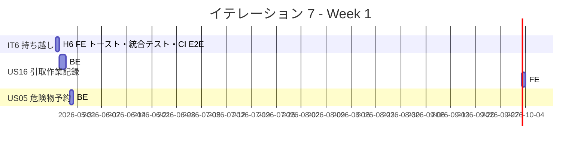
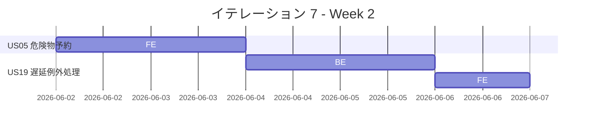
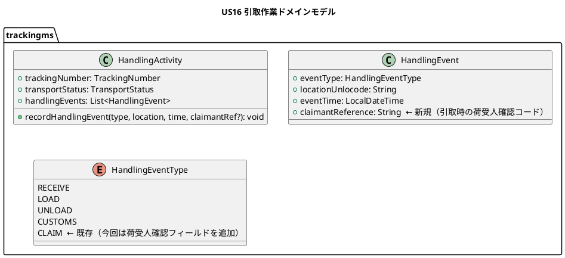
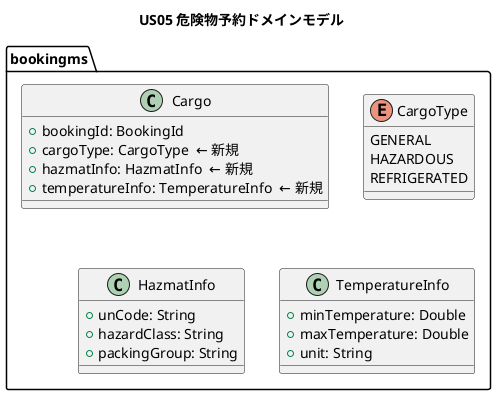
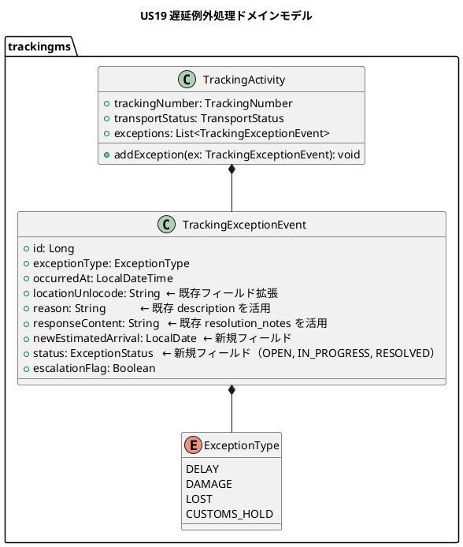
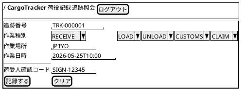
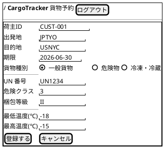
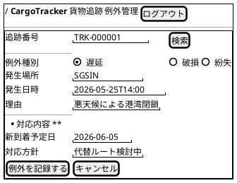
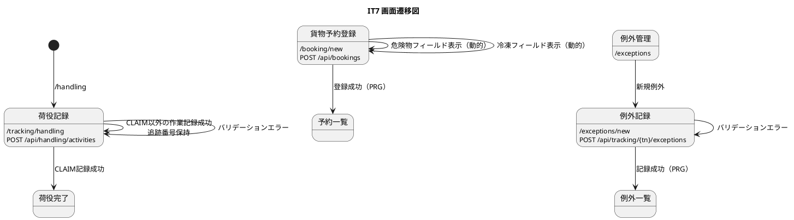

# イテレーション 7 計画

## 概要

| 項目 | 内容 |
|------|------|
| **イテレーション** | 7 |
| **期間** | Week 13-14（2026-05-25〜2026-06-07） |
| **ゴール** | IT6 未完了タスクの解消（H6 FE・RabbitMQ 統合テスト・CI E2E）と Phase 2 最初の US（US16/US05/US19）の BE + FE を実装し、荷役拡張と例外処理の基盤を確立する |
| **目標 SP** | 24（IT6 持ち越し 3 SP + US16 5 SP + US05 8 SP + US19 8 SP） |

---

## ゴール

### イテレーション終了時の達成状態

1. **IT6 持ち越しタスク完了**: H6 FE エラートースト・RabbitMQ 統合テスト・CI E2E 統合がすべて解消されている
2. **引取作業記録（US16）**: 荷役作業員が「引取」種別で荷受人確認フィールドを含む荷役記録を登録でき、貨物状態が「引取済」に更新される
3. **危険物・冷凍貨物の予約（US05）**: 営業担当者が貨物種別「危険物」または「冷凍・冷蔵」を選択すると追加情報入力フィールドが表示され、特別条件付き予約が登録できる
4. **遅延例外処理（US19）**: 追跡管理者が遅延例外を記録し、貨物状態が「例外発生」に更新され、対応内容を入力できる

### 成功基準

- [ ] IT6 持ち越し: H6 FE API エラーメッセージのトースト通知が表示される
- [ ] IT6 持ち越し: RabbitMQ イベント統合テスト（Testcontainers）がパスする
- [ ] IT6 持ち越し: CI パイプラインで Playwright E2E テストが自動実行される
- [ ] US16: 「引取」荷役種別で荷受人確認フィールドが表示される
- [ ] US16: 引取記録後に貨物状態が「引取済 (CLAIMED)」に更新される
- [ ] US05: 貨物種別「危険物」選択時に危険物申告情報フィールドが表示・必須入力となる
- [ ] US05: 貨物種別「冷凍・冷蔵」選択時に温度管理条件フィールドが表示・必須入力となる
- [ ] US19: 遅延例外（追跡番号・例外種別・発生日時・場所・理由）を記録できる
- [ ] US19: 例外記録後に貨物状態が「例外発生 (EXCEPTION)」に更新される
- [ ] US19: 対応内容（新到着予定日・対応方針）を入力して更新できる
- [ ] 全ユニットテスト（BE + FE）がパス
- [ ] BE テストカバレッジ 80% 以上（JaCoCo）

---

## ユーザーストーリー

### 対象ストーリー

| ID | ユーザーストーリー | BE | FE | SP | 優先度 |
|----|-------------------|----|----|-----|--------|
| TI-持越 | IT6 未完了タスク（H6 FE・統合テスト・CI E2E） | 1 | 2 | 3 | 必須 |
| US16 | 引取作業を記録する | 3 | 2 | 5 | 必須 |
| US05 | 危険物・冷凍貨物の予約を登録する | 5 | 3 | 8 | 必須 |
| US19 | 遅延例外を処理する | 5 | 3 | 8 | 必須 |
| **合計** | | **14** | **10** | **24** | |

### ストーリー詳細

#### US16: 引取作業を記録する

**ストーリー**:
> 荷役作業員として、荷受人が貨物を引き取る際に、荷受人の確認（署名または確認コード）を取得して引取作業を記録したい。なぜなら、荷受人への正式な引き渡しを証明し、配送完了を記録できるからだ。

**受入条件**:

- [ ] 作業種別「引取」を選択すると、荷受人確認フィールド（署名または確認コード）が表示される
- [ ] 荷受人確認が取得されると引取作業が記録される
- [ ] 記録後、貨物状態が「引取済 (CLAIMED)」に更新される
- [ ] 貨物状態「引取済」は配送完了を意味し、精算処理の開始条件となる

#### US05: 危険物・冷凍貨物の予約を登録する

**ストーリー**:
> 営業担当者として、危険物や冷凍・冷蔵貨物の場合に、特別な追加情報（危険物申告・温度管理条件）を含めて予約を登録したい。なぜなら、貨物種別に応じた法的要件と取扱い条件を正確に管理し、安全な輸送を保証できるからだ。

**受入条件**:

- [ ] 貨物種別「危険物」を選択すると、危険物申告情報の入力フィールドが表示され入力が必須となる
- [ ] 貨物種別「冷凍・冷蔵貨物」を選択すると、温度管理条件の入力フィールドが表示され入力が必須となる
- [ ] 特別情報が登録された予約は、経路設計時に対応可能な航海・ルートのみが候補として表示される

#### US19: 遅延例外を処理する

**ストーリー**:
> 追跡管理者として、輸送中に遅延が発生した場合、例外種別「遅延」として記録し、荷主への通知と対応内容を管理したい。なぜなら、遅延情報を速やかに荷主に伝え、対応策（代替ルート等）を迅速に提示できるからだ。

**受入条件**:

- [ ] 追跡番号と例外種別「遅延」・発生状況（場所・日時・理由）を記録できる
- [ ] 記録後、貨物状態が「例外発生 (EXCEPTION)」に更新される
- [ ] 荷主に遅延発生の通知が送信される（MVP: ログ出力で代替可）
- [ ] 対応内容（新しい到着予定日・対応方針）を入力して荷主に対応報告を送信できる
- [ ] 例外対応履歴が記録される

### タスク

#### 0. IT6 持ち越しタスク（3 SP）

| # | タスク | 見積もり | 担当 | 状態 |
|---|--------|---------|------|------|
| 0.1 | FE: API エラーレスポンスの具体メッセージをトースト通知に表示する（H6 FE） | 1h | - | [ ] |
| 0.2 | BE: RabbitMQ イベント連携の Testcontainers 統合テストを実装する（TI04 2.4） | 1h | - | [ ] |
| 0.3 | CI: GitHub Actions に Playwright E2E テストを統合する（TI03 1.7） | 1h | - | [ ] |
| 0.4 | ADR: bookingms/trackingms 間の `TrackingNumberIssuedEvent` 契約管理方針を ADR-005 として記録する（IT6 レビュー高優先度 #4） | 0.5h | - | [ ] |

**小計**: 3.5h（理想時間）

#### 1. US16: 引取作業を記録する（5 SP）

| # | タスク | 見積もり | 担当 | 状態 |
|---|--------|---------|------|------|
| 1.1 | **[TDD]** BE: `HandlingEvent.CLAIM` イベント種別のドメインモデル拡張（荷受人確認フィールド追加） | 1.5h | - | [ ] |
| 1.2 | **[TDD]** BE: 荷役作業 API で CLAIM 種別を受け付け、荷受人確認情報を保存する | 1.5h | - | [ ] |
| 1.3 | **[TDD]** BE: CLAIM 記録後に貨物状態を CLAIMED に更新するロジックを実装する | 1h | - | [ ] |
| 1.4 | **[TDD]** FE: 荷役記録フォームで「引取」選択時に荷受人確認フィールドを動的表示する | 1.5h | - | [ ] |
| 1.5 | FE: US16 の FE テストを追加する | 1h | - | [ ] |

**小計**: 6.5h（理想時間）

#### 2. US05: 危険物・冷凍貨物の予約を登録する（8 SP）

| # | タスク | 見積もり | 担当 | 状態 |
|---|--------|---------|------|------|
| 2.1 | **[TDD]** BE: Cargo ドメインモデルに `cargoType`（GENERAL/HAZMAT/REFRIGERATED）と特別情報フィールドを追加する | 2h | - | [ ] |
| 2.2 | **[TDD]** BE: 予約登録 API で `cargoType` を受け付け、HAZMAT/REFRIGERATED 時に追加情報を必須バリデーションする | 2h | - | [ ] |
| 2.3 | BE: DB マイグレーション（cargo テーブルに cargo_type・hazmat_info・temperature_info カラム追加） | 1h | - | [ ] |
| 2.4 | **[TDD]** FE: 予約フォームで貨物種別選択時に条件付きフィールドを動的表示する | 2h | - | [ ] |
| 2.5 | FE: US05 の FE テストを追加する | 1h | - | [ ] |

**小計**: 8h（理想時間）

#### 3. US19: 遅延例外を処理する（8 SP）

| # | タスク | 見積もり | 担当 | 状態 |
|---|--------|---------|------|------|
| 3.1 | **[TDD]** BE: `TrackingExceptionEvent` ドメインモデルを trackingms で拡張する（location・newEstimatedArrival・status フィールド追加） | 2h | - | [ ] |
| 3.2 | **[TDD]** BE: 遅延例外記録 API（POST /api/tracking/{trackingNumber}/exceptions）を実装する | 1.5h | - | [ ] |
| 3.3 | **[TDD]** BE: 例外記録後に貨物状態を EXCEPTION に更新する | 1h | - | [ ] |
| 3.4 | **[TDD]** BE: 対応内容更新 API（PUT /api/tracking/{trackingNumber}/exceptions/{id}/response）を実装する | 1.5h | - | [ ] |
| 3.5 | BE: DB マイグレーション（tracking_exception_event テーブルに location_unlocode・new_estimated_arrival・status カラムを追加） | 0.5h | - | [ ] |
| 3.6 | **[TDD]** FE: 遅延例外記録画面（追跡番号検索・例外情報入力・対応内容入力）を実装する | 2h | - | [ ] |
| 3.7 | FE: US19 の FE テストを追加する | 1h | - | [ ] |

**小計**: 9.5h（理想時間）

#### タスク合計

| カテゴリ | SP | 理想時間 | 状態 |
|---------|----|----|------|
| IT6 持ち越し | 3 | 3h | [ ] |
| US16: 引取作業記録 | 5 | 6.5h | [ ] |
| US05: 危険物・冷凍貨物予約 | 8 | 8h | [ ] |
| US19: 遅延例外処理 | 8 | 9.5h | [ ] |
| **合計** | **24** | **27h** | |

**1 SP あたり**: 約 1.1h
**進捗率**: 0% (0/24 SP)

---

## スケジュール

### Week 1（Day 1-5: 2026-05-25〜2026-05-29）



| 日 | タスク |
|----|--------|
| Day 1 | IT6 持ち越し（0.1 H6 FE / 0.2 統合テスト / 0.3 CI E2E） |
| Day 2 | US16: BE ドメイン拡張・API（1.1, 1.2） |
| Day 3 | US16: BE 状態更新ロジック・FE フォーム（1.3, 1.4） |
| Day 4 | US16: FE テスト追加（1.5）、US05: BE ドメイン開始（2.1） |
| Day 5 | US05: BE API・バリデーション（2.2, 2.3） |

### Week 2（Day 6-10: 2026-06-02〜2026-06-07）



| 日 | タスク |
|----|--------|
| Day 6 | US05: FE 動的フォーム実装（2.4） |
| Day 7 | US05: FE テスト追加（2.5） |
| Day 8 | US19: BE ドメイン・例外記録 API（3.1, 3.2, 3.3） |
| Day 9 | US19: BE 対応内容更新 API・DB マイグレーション（3.4, 3.5） |
| Day 10 | US19: FE 例外記録画面・テスト追加（3.6, 3.7）、統合確認 |

---

## 設計

### ドメインモデル

#### US16: 引取作業記録



#### US05: 危険物・冷凍貨物予約



#### US19: 遅延例外処理



> **注**: `TrackingExceptionEvent` は trackingms の既存エンティティ（`docs/design/domain-model.md` 準拠）。US19 では `location_unlocode`・`new_estimated_arrival`・`status` フィールドを追加拡張する。

### データモデル

#### US16: tracking_handling_event テーブル拡張

```prisma
model tracking_handling_event {
  id                 BigInt    @id @default(autoincrement())
  tracking_id        BigInt    // FK → tracking_activity.id
  event_type         String    // RECEIVE, LOAD, UNLOAD, CUSTOMS, CLAIM
  event_time         DateTime
  location_unlocode  String
  voyage_number      String?
  claimant_reference String?   // ← 新規追加（引取時の荷受人確認コード）
  created_at         DateTime  @default(now())
  updated_at         DateTime  @updatedAt
}
```

> **注**: データモデルの実テーブル名は `tracking_handling_event`（`docs/design/data-model.md` 準拠）。`handling_event` という名称は存在しない。

#### US05: cargo テーブル拡張

```prisma
model cargo {
  id               BigInt   @id @default(autoincrement())
  booking_id       String   @unique
  // ... 既存フィールド
  cargo_type       String   @default("GENERAL")  // ← 新規（GENERAL / HAZARDOUS / REFRIGERATED）
  hazmat_info      Json?    // ← 新規（危険物情報）
  temperature_info Json?    // ← 新規（温度管理情報）
  created_at       DateTime @default(now())
  updated_at       DateTime @updatedAt
}
```

> **注**: `CargoType` の値は `GENERAL / HAZARDOUS / REFRIGERATED`（`docs/design/domain-model.md` 準拠）。`HAZMAT` という値は存在しない。

#### US19: tracking_exception_event テーブル拡張

```prisma
model tracking_exception_event {
  id                    BigInt    @id @default(autoincrement())
  tracking_id           BigInt    // FK → tracking_activity.id（既存）
  exception_type        String    // DELAY, DAMAGE, LOST, CUSTOMS_HOLD（既存）
  occurred_at           DateTime  // 既存
  escalation_flag       Boolean   // 既存
  description           String?   // 既存（reason として利用）
  resolved_at           DateTime? // 既存
  resolution_notes      String?   // 既存（response_content として利用）
  location_unlocode     String?   // ← 新規追加（発生場所）
  new_estimated_arrival Date?     // ← 新規追加（新到着予定日）
  status                String    @default("OPEN")  // ← 新規追加（OPEN, IN_PROGRESS, RESOLVED）
  created_at            DateTime  @default(now())
  updated_at            DateTime  @updatedAt
}
```

> **注**: データモデルの実テーブル名は `tracking_exception_event`（`docs/design/data-model.md` 準拠）。`exception_record` という名称は存在しない。既存テーブルに `location_unlocode`・`new_estimated_arrival`・`status` カラムを追加拡張する。`reason` は既存 `description` を、`response_content` は既存 `resolution_notes` を活用する。

### ユーザーインターフェース

#### ビュー

**US16: 荷役記録フォーム拡張（/tracking/handling）**



**US05: 予約フォーム拡張**



**US19: 遅延例外記録画面（新規）**



#### インタラクション



### API 設計

#### US16 拡張 API（既存 API 拡張）

| メソッド | エンドポイント | 説明 |
|---------|---------------|------|
| POST | `/api/handling/activities` | 荷役記録（既存 US15）。`claimantReference` フィールドを追加 |

#### US05 拡張 API（既存 API 拡張）

| メソッド | エンドポイント | 説明 |
|---------|---------------|------|
| POST | `/api/bookings` | 予約登録（既存）。`cargoType`・`hazmatInfo`・`temperatureInfo` を追加 |

#### US19 新規 API

| メソッド | エンドポイント | 説明 |
|---------|---------------|------|
| POST | `/api/tracking/{trackingNumber}/exceptions` | 遅延例外を記録する |
| GET | `/api/tracking/{trackingNumber}/exceptions` | 例外一覧を取得する |
| PUT | `/api/tracking/{trackingNumber}/exceptions/{id}/response` | 対応内容を更新する |

### ADR

| ADR | タイトル | ステータス |
|-----|---------|--------------|
| - | IT7 での設計変更は既存 ADR の範囲内（追加 ADR は US05 の貨物種別拡張時に検討） | - |

---

## リスクと対策

| リスク | 影響度 | 対策 |
|--------|--------|------|
| US05: bookingms のドメインモデル変更が既存 US09/US11/US13 に影響する | 高 | cargo テーブルの拡張は既存カラムに追加のみ（破壊的変更なし）。既存テストが通過することを確認してから実装 |
| US19: trackingms への例外管理追加でマイクロサービスの複雑性が増す | 中 | ExceptionRecord を trackingms 内の新しい集約として独立させ、TrackingActivity への影響を最小化する |
| IT6 持ち越しタスクが予想より時間を要する | 低 | Day 1 に集中処理。最悪 CI E2E 統合（0.3）は次 IT へ再持ち越し |
| RabbitMQ 統合テスト（Testcontainers）がCI で不安定になる | 中 | IT2/IT4 で確立済みの Testcontainers パターンを踏襲。タイムアウト設定を十分に確保 |

---

## 完了条件

### Definition of Done

- [ ] IT6 持ち越し H6 FE トースト通知が動作する
- [ ] US16: 引取作業で荷受人確認コードが保存され、CLAIMED 状態に遷移する
- [ ] US05: 危険物・冷凍貨物の追加情報が保存された予約が登録できる
- [ ] US19: 遅延例外が記録され、EXCEPTION 状態に遷移する
- [ ] 全ユニットテスト・BE テストカバレッジ 80%+
- [ ] ESLint / SonarQube Quality Gate PASS
- [ ] ドキュメント更新完了

### デモ項目

1. 「引取」種別を選択すると荷受人確認コードフィールドが表示され、記録後に CLAIMED へ遷移することを確認する（US16）
2. 危険物・冷凍食品を選択すると追加情報フィールドが動的に表示され、特別条件付き予約が登録できることを確認する（US05）
3. 遅延例外を記録すると EXCEPTION 状態に遷移し、対応内容の入力・更新ができることを確認する（US19）

---

## 更新履歴

| 日付 | 更新内容 | 更新者 |
|------|---------|--------|
| 2026-05-09 | 初版作成（IT7 計画） | - |

---

## 関連ドキュメント

- [イテレーション 7 ふりかえり](./retrospective-7.md)
- [イテレーション 6 完了報告書](./iteration_report-6.md)
- [リリース計画](./release_plan.md)
- [ユーザーストーリー](../requirements/user_story.md)
- [IT6 コードレビュー結果](../review/it6_review_20260509.md)
