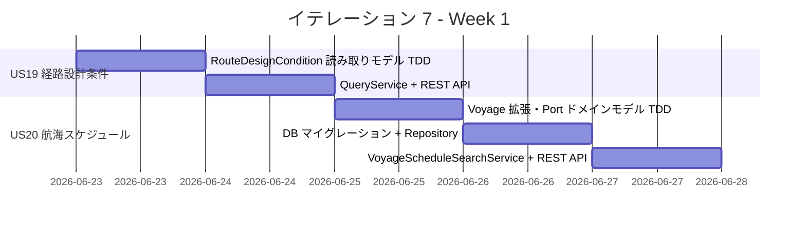
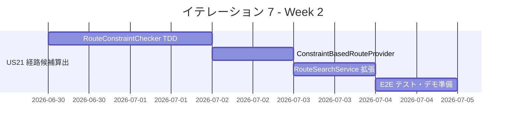
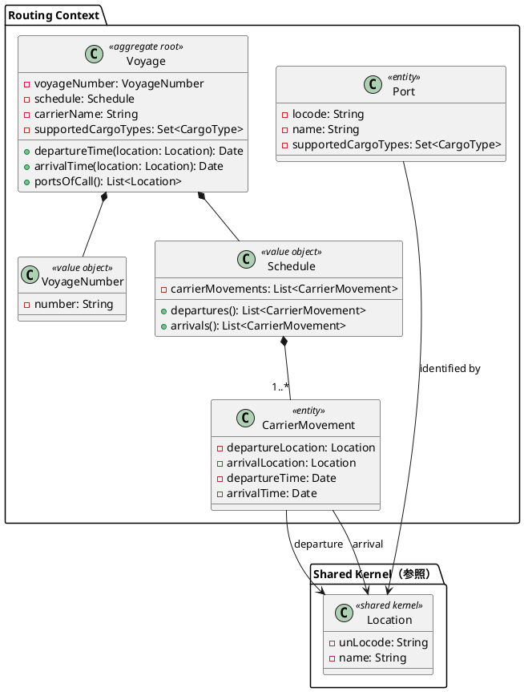
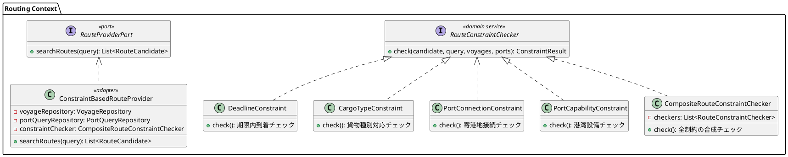
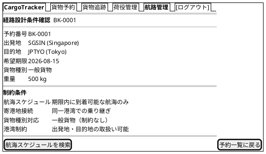
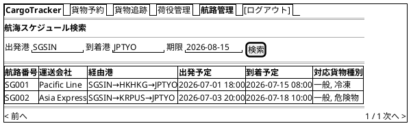
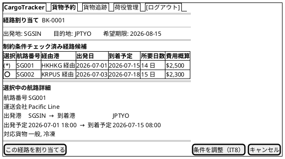
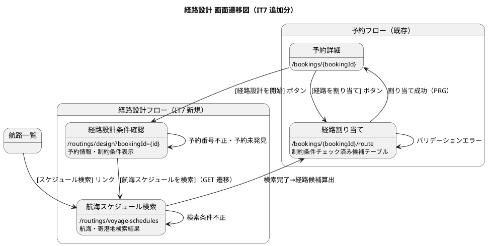

# イテレーション 7 計画

## 概要

| 項目 | 内容 |
|------|------|
| **イテレーション** | 7 |
| **期間** | Week 13-14（2026-06-23〜2026-07-06） |
| **ゴール** | 航海・港湾マスタデータを整備し、制約条件ベースの経路候補自動算出を完成させる |
| **目標 SP** | 10 |

---

## ゴール

### イテレーション終了時の達成状態

1. **経路設計条件確認（US19）**: 経路設計者が予約情報から経路設計条件（出発地・目的地・期限・貨物種別）を確認し、条件確認完了を記録できる
2. **航海スケジュール検索（US20）**: 経路設計者が出発地・目的地・期限を指定して利用可能な航海スケジュール・寄港地情報を検索できる。航海・港湾のマスタデータが DB に格納される
3. **経路候補自動算出（US21）**: 航海スケジュール・寄港地接続・港湾制約・貨物種別・期限の制約条件を考慮した経路候補が自動算出される。既存の `StubRouteProviderAdapter` を実データベースの `RouteProviderPort` 実装に置き換える

### 成功基準

- [ ] 予約番号から経路設計条件を一覧表示し、条件確認完了を記録できる
- [ ] 航海マスタ（`voyage` テーブルに `carrier_name`・`supported_cargo_types` 追加）・港湾マスタ（`location` テーブルに `supported_cargo_types` 追加）のマイグレーションが完了し、シードデータが格納される
- [ ] 出発地・目的地・期限を指定して航海スケジュールを検索し、該当する航海情報が一覧表示される
- [ ] 制約条件（航海スケジュール・寄港地接続・期限・貨物種別・港湾制約）を考慮した経路候補が自動算出される
- [ ] 危険物・冷凍貨物の場合、対応設備のある航海・港湾のみがフィルタリングされる
- [ ] 制約条件を満たす経路候補がない場合、「条件を満たす経路候補なし」が表示される
- [ ] backend テスト Green・カバレッジ 80% 以上
- [ ] E2E テスト（`US19E2ETest`・`US20E2ETest`・`US21E2ETest`）全件 GREEN

---

## ユーザーストーリー

### 対象ストーリー

| ID | ユーザーストーリー | SP | 優先度 |
|----|-------------------|----|--------|
| US19 | 経路設計条件を確認する | 2 | 必須 |
| US20 | 航海スケジュールを検索する | 3 | 必須 |
| US21 | 経路候補を算出する | 5 | 必須 |
| **合計** | | **10** | |

### ストーリー詳細

#### US19: 経路設計条件を確認する

**ストーリー**:
> 経路設計者として、営業担当者から引き渡された予約情報（出発地・目的地・期限・貨物仕様）を確認し、経路設計に必要な条件を整理したい。なぜなら、設計に必要な条件を漏れなく把握し、不備があれば早期に補完依頼できるからだ。

**受入条件**:

1. 予約番号を指定して予約情報（出発地・目的地・期限・貨物種別・重量・寸法）を一覧表示できる
2. 経路設計条件（出発地・目的地・期限・貨物種別制約）を確認・記録できる
3. 予約情報に不備がある場合、営業担当者に条件補完を依頼できる
4. 条件確認完了後、航海スケジュール検索（US20）に進める

#### US20: 航海スケジュールを検索する

**ストーリー**:
> 経路設計者として、経路設計条件に基づき利用可能な航海スケジュールと寄港地情報を検索したい。なぜなら、利用可能な航海・寄港地を把握し、経路候補の算出に必要な情報を揃えられるからだ。

**受入条件**:

1. 出発地・目的地・期限を検索条件として入力できる
2. 出発地・目的地は UN/LOCODE 形式で指定できる
3. 該当する航海情報（航海番号・運送会社・寄港地・出発日・到着日）が一覧表示される
4. 各寄港地の港湾情報（取扱可能貨物種別・設備）が表示される
5. 直行便がない場合、寄港地接続による経由ルートの航海候補も表示される

#### US21: 経路候補を算出する

**ストーリー**:
> 経路設計者として、航海スケジュール・寄港地接続・港湾制約・貨物種別・期限の制約条件を考慮した最適な経路候補を自動算出したい。なぜなら、属人的な経路設計作業を削減し、制約条件を漏れなく考慮した経路を迅速に得られるからだ。

**受入条件**:

1. 経路候補算出を実行すると、制約条件（航海スケジュール・寄港地接続・期限・貨物種別・港湾制約）が自動チェックされる
2. 期限内に到着可能な経路候補が優先度順に一覧表示される
3. 各候補に経由港・所要日数・航海番号・費用概算が表示される
4. 危険物・冷凍貨物の場合、対応設備のある航海・港湾のみがフィルタリングされる
5. 制約条件を満たす経路候補がない場合、「条件を満たす経路候補なし」が表示される

### タスク

#### 1. US19: 経路設計条件を確認する（2 SP）

| # | タスク | 見積もり | 担当 | 状態 |
|---|--------|---------|------|------|
| 1.1 | `RouteDesignCondition` 読み取りモデル + 単体テスト（TDD） | 2h | - | [ ] |
| 1.2 | `RouteDesignConditionQueryService`（Booking ACL 経由で予約情報取得） | 2h | - | [ ] |
| 1.3 | Web UI: 経路設計条件確認画面（`routing/design-condition.html`）+ 条件不備時の補完依頼リンク | 2h | - | [ ] |
| 1.4 | REST API: `GET /api/v1/routings/design-condition?bookingId={id}` | 2h | - | [ ] |

**小計**: 8h（理想時間）

#### 2. US20: 航海スケジュールを検索する（3 SP）

| # | タスク | 見積もり | 担当 | 状態 |
|---|--------|---------|------|------|
| 2.1 | `Voyage` 集約拡張（`carrierName`・`supportedCargoTypes` 追加）+ `Port` エンティティ + 単体テスト（TDD） | 4h | - | [ ] |
| 2.2 | DB マイグレーション: `voyage` に `carrier_name`・`supported_cargo_types` 追加、`location` に `supported_cargo_types` 追加 + シードデータ | 3h | - | [ ] |
| 2.3 | `VoyageRepository` + MyBatis マッパー実装 | 2h | - | [ ] |
| 2.4 | `VoyageScheduleSearchService`（出発地・目的地・期限で検索、寄港地接続の経由ルート候補含む。IT7 では 1 回乗り継ぎに限定） | 2h | - | [ ] |
| 2.5 | REST API: `GET /api/v1/routings/voyage-schedules?origin={}&dest={}&deadline={}` | 1h | - | [ ] |

**小計**: 12h（理想時間）

#### 3. US21: 経路候補を算出する（5 SP）

| # | タスク | 見積もり | 担当 | 状態 |
|---|--------|---------|------|------|
| 3.1 | `RouteConstraintChecker` ドメインサービス + 制約条件チェッカー群（TDD） | 6h | - | [ ] |
| 3.2 | `ConstraintBasedRouteProvider` — `RouteProviderPort` の DB ベース実装（`StubRouteProviderAdapter` 置き換え） | 4h | - | [ ] |
| 3.3 | `RouteSearchService` の拡張 — 制約条件ベースのフィルタリング・優先度ソート | 3h | - | [ ] |
| 3.4 | Web UI: 経路候補一覧画面の更新（制約条件表示・候補なしメッセージ） | 3h | - | [ ] |
| 3.5 | E2E テスト: `US19E2ETest`・`US20E2ETest`・`US21E2ETest` | 4h | - | [ ] |

**小計**: 20h（理想時間）

#### タスク合計

| カテゴリ | SP | 理想時間 | 状態 |
|---------|----|----|------|
| US19 経路設計条件確認 | 2 | 8h | [ ] |
| US20 航海スケジュール検索 | 3 | 12h | [ ] |
| US21 経路候補算出 | 5 | 20h | [ ] |
| **合計** | **10** | **40h** | |

**1 SP あたり**: 約 4.0h
**進捗率**: 0%（0/10 SP）

---

## スケジュール

### Week 1（Day 1-5）: US19 + US20



| 日 | タスク |
|----|--------|
| Day 1（6/23） | 1.1 `RouteDesignCondition` 読み取りモデル TDD |
| Day 2（6/24） | 1.2〜1.4 QueryService・REST API・Web UI（経路設計条件確認画面） |
| Day 3（6/25） | 2.1 `Voyage` 集約拡張（`carrierName`・`supportedCargoTypes`）・`Port` ドメインモデル TDD |
| Day 4（6/26） | 2.2〜2.3 DB マイグレーション（`voyage`・`location` カラム追加）・シードデータ・`VoyageRepository` |
| Day 5（6/27） | 2.4〜2.5 `VoyageScheduleSearchService`・REST API |

### Week 2（Day 6-10）: US21



| 日 | タスク |
|----|--------|
| Day 6（6/30） | 3.1 `RouteConstraintChecker` — 期限遵守・貨物種別対応チェッカー TDD |
| Day 7（7/1） | 3.1 続き — 寄港地接続・港湾制約チェッカー TDD |
| Day 8（7/2） | 3.2 `ConstraintBasedRouteProvider` 実装（Stub 置き換え） |
| Day 9（7/3） | 3.3〜3.4 `RouteSearchService` 拡張・Web UI 更新 |
| Day 10（7/4） | 3.5 E2E テスト全件確認・統合テスト・デモ準備 |

---

## 設計

### ドメインモデル

#### US20: Voyage 集約の拡張 + Port エンティティ追加

既存の Routing Context ドメインモデル（`domain-model.md`）を拡張する。`Voyage` 集約・`Schedule`・`CarrierMovement` の構造は維持し、`carrierName`・`supportedCargoTypes` のフィールドを追加する。`Port` エンティティは経路制約チェック用に新規追加する。



**domain-model.md からの変更点**:

| 変更 | 内容 |
|:---|:---|
| 追加 | `Voyage.carrierName: String` — 運送会社名 |
| 追加 | `Voyage.supportedCargoTypes: Set<CargoType>` — 対応貨物種別 |
| 追加 | `Voyage.portsOfCall(): List<Location>` — 寄港地一覧取得メソッド |
| 新規 | `Port` 読み取りモデル — `Location` 共有カーネルを拡張し、港湾の貨物種別対応情報を提供。DB は `location` テーブルを共用 |

> **注**: `domain-model.md` のドメインモデル図および `data-model.md` の `voyage`・`location` テーブル定義も IT7 完了時に上記変更を反映する必要がある。

#### US21: RouteConstraintChecker ドメインサービス



### データモデル

#### `voyage` テーブル（既存テーブルへのカラム追加）

data-model.md の既存 `voyage` テーブルに `carrier_name`・`supported_cargo_types` カラムを追加する。テーブル名・PK・監査カラムの規約は data-model.md に準拠。

```sql
-- 既存テーブルへのカラム追加（マイグレーション）
ALTER TABLE voyage
    ADD COLUMN carrier_name          VARCHAR(100) NOT NULL DEFAULT '',
    ADD COLUMN supported_cargo_types VARCHAR(200) NOT NULL DEFAULT 'GENERAL';
```

既存スキーマ（参考）:

```sql
-- data-model.md 準拠の既存構造
CREATE TABLE voyage (
    id            BIGSERIAL    PRIMARY KEY,
    voyage_number VARCHAR(20)  NOT NULL UNIQUE,
    carrier_name          VARCHAR(100) NOT NULL DEFAULT '',
    supported_cargo_types VARCHAR(200) NOT NULL DEFAULT 'GENERAL',
    created_at    TIMESTAMP    NOT NULL DEFAULT NOW(),
    updated_at    TIMESTAMP    NOT NULL DEFAULT NOW()
);
```

#### `carrier_movement` テーブル（既存・変更なし）

data-model.md 準拠の既存テーブル。IT7 での変更なし。

```sql
-- data-model.md 準拠の既存構造（参考）
CREATE TABLE carrier_movement (
    id                            BIGSERIAL    PRIMARY KEY,
    voyage_id                     BIGINT       NOT NULL REFERENCES voyage(id),
    departure_location_unlocode   VARCHAR(5)   NOT NULL,
    arrival_location_unlocode     VARCHAR(5)   NOT NULL,
    departure_date                TIMESTAMP    NOT NULL,
    arrival_date                  TIMESTAMP    NOT NULL,
    seq_number                    INTEGER      NOT NULL,
    created_at                    TIMESTAMP    NOT NULL DEFAULT NOW(),
    updated_at                    TIMESTAMP    NOT NULL DEFAULT NOW()
);
```

#### `location` テーブル（既存テーブルへのカラム追加）

data-model.md の既存 `location` テーブルに `supported_cargo_types` カラムを追加する。別途 `ports` テーブルを新規作成せず、既存の `location` を拡張する。

```sql
-- 既存テーブルへのカラム追加（マイグレーション）
ALTER TABLE location
    ADD COLUMN supported_cargo_types VARCHAR(200) NOT NULL DEFAULT 'GENERAL';
```

> **設計判断**: 港湾の貨物種別対応情報は `location` テーブルの属性として追加する。`Port` ドメインエンティティは `Location` 共有カーネルを拡張する読み取りモデルとして実装し、DB テーブルは `location` を共用する。

### ユーザーインターフェース

ui_design.md の共通レイアウト・ナビゲーション構成・ワイヤーフレーム規約に準拠する。

**新規画面一覧**（ui_design.md への追加対象）:

| 画面名 | URL パス | 説明 | 主要アクター | 対応 US |
| :--- | :--- | :--- | :--- | :--- |
| 経路設計条件確認 | `/routings/design?bookingId={id}` | 予約情報から経路設計条件を確認 | 経路設計者 | US19 |
| 航海スケジュール検索 | `/routings/voyage-schedules?origin={}&dest={}&deadline={}` | 航海スケジュール・寄港地検索 | 経路設計者 | US20 |

US21（経路候補算出）は既存の経路割り当て画面（`/bookings/{bookingId}/route`）を拡張して制約条件チェック済みの候補を表示する。

#### ビュー: 経路設計条件確認 (/routings/design)



#### ビュー: 航海スケジュール検索結果（航路一覧の拡張）

既存の航路一覧画面（`/voyages`）の検索フォーム・テーブル構成を踏襲し、`運送会社`・`対応貨物種別` カラムを追加する。



#### ビュー: 経路候補算出（経路割り当て画面の拡張）

既存の経路割り当て画面（`/bookings/{bookingId}/route`）を拡張し、制約条件チェック済みの候補と制約条件サマリーを表示する。



> **候補なしの場合**: テーブル部分に「条件を満たす経路候補が見つかりません。条件を調整してください。」メッセージを表示する。

#### インタラクション

ui_design.md の画面遷移図に以下のフローを追加する。遷移パターン・エラー処理は ui_design.md の規約（PRG パターン・htmx 部分更新・バリデーションエラー自己ループ）に準拠。



#### htmx パターン

ui_design.md の htmx 部分更新パターンに準拠。

| 画面 | htmx パターン | 説明 |
|:---|:---|:---|
| 航海スケジュール検索 | `hx-get="/routings/voyage-schedules" hx-target="#schedule-list" hx-swap="outerHTML"` | 検索フォーム送信で結果テーブルを部分更新 |
| 経路割り当て（拡張） | `hx-get="/api/v1/routings/search?bookingId={id}" hx-target="#route-candidates" hx-swap="innerHTML"` | 経路候補算出ボタンで候補一覧を部分更新 |
| 経路割り当て（既存） | `hx-get="/api/voyages/{voyageNumber}/detail" hx-target="#voyage-detail" hx-swap="innerHTML"` | ラジオ選択で航路詳細を部分更新（既存パターン踏襲） |

#### フィードバックメッセージ

ui_design.md の Flash Attribute フィードバック規約に準拠。

| 操作 | メッセージ | スタイル |
|:---|:---|:---|
| 経路設計条件確認完了 | 「経路設計条件を確認しました」 | `alert-info` |
| 航海スケジュール検索完了 | 「{n} 件の航海スケジュールが見つかりました」 | `alert-info` |
| 経路候補算出完了 | 「{n} 件の経路候補が算出されました」 | `alert-success` |
| 経路候補なし | 「条件を満たす経路候補が見つかりません。条件を調整してください。」 | `alert-warning` |
| 予約番号不正 | 「指定された予約番号が見つかりません」 | `alert-danger` |

> **注**: `ui_design.md` の画面一覧・画面遷移図・ナビゲーション構成・htmx パターン・フィードバックメッセージ一覧も IT7 完了時に上記を反映する必要がある。

### API 設計

| メソッド | エンドポイント | 説明 |
|---------|---------------|------|
| GET | `/api/v1/routings/design-condition?bookingId={id}` | 経路設計条件を取得する（US19） |
| GET | `/api/v1/routings/voyage-schedules?origin={}&dest={}&deadline={}` | 航海スケジュールを検索する（US20） |
| GET | `/api/v1/routings/search?bookingId={id}` | 経路候補を算出する（US21・既存 API の拡張） |

### ディレクトリ構成

```
apps/cargo-tracker/src/main/java/com/example/cargotracker/routing/
├── domain/model/
│   ├── RouteCandidate.java          (既存)
│   ├── RouteSearchQuery.java        (既存)
│   ├── CargoType.java               (既存)
│   ├── Voyage.java                  (既存: carrierName・supportedCargoTypes 追加)
│   ├── VoyageNumber.java            (既存)
│   ├── Schedule.java                (既存)
│   ├── CarrierMovement.java         (既存)
│   ├── Port.java                    (新規: エンティティ)
│   ├── RouteDesignCondition.java    (新規: 読み取りモデル)
│   └── constraint/                  (新規: 制約条件)
│       ├── RouteConstraintChecker.java
│       ├── DeadlineConstraint.java
│       ├── CargoTypeConstraint.java
│       ├── PortConnectionConstraint.java
│       ├── PortCapabilityConstraint.java
│       └── CompositeRouteConstraintChecker.java
├── application/internal/
│   ├── queryservices/
│   │   ├── RouteSearchService.java           (既存: 拡張)
│   │   ├── RouteDesignConditionQueryService.java  (新規)
│   │   └── VoyageScheduleSearchService.java  (新規)
│   └── outboundservices/
│       ├── RouteProviderPort.java            (既存)
│       └── BookingQueryPort.java             (既存)
├── infrastructure/
│   ├── adapters/
│   │   ├── StubRouteProviderAdapter.java     (既存: !prod プロファイル)
│   │   └── ConstraintBasedRouteProvider.java (新規: prod プロファイル)
│   └── repositories/
│       ├── VoyageRepository.java             (新規)
│       └── PortQueryRepository.java          (新規: location テーブルからの読み取り)
└── interfaces/
    ├── rest/
    │   └── RoutingRestController.java        (既存: エンドポイント追加)
    └── web/
        └── RoutingWebController.java         (既存: 画面追加)
```

---

## リスクと対策

| リスク | 影響度 | 対策 |
|--------|--------|------|
| 航海・港湾マスタデータの設計が経路算出ロジックに影響 | 高 | US20 のデータモデルを先に確定し、US21 は US20 のモデルに依存する順序で実装 |
| 寄港地接続による経由ルート検索のクエリ複雑化 | 中 | 初期実装は 1 回乗り継ぎ（2 航海接続）に限定。多段乗り継ぎは v1.2.0 以降に延期可 |
| `StubRouteProviderAdapter` 置き換えによる既存テスト破損 | 中 | Spring Profile で `stub`（テスト用）と `prod`（実 DB 用）を分離。既存テストは Stub を維持 |
| シードデータ量によるテスト実行速度低下 | 低 | テスト用シードは最小限（3 航海・5 港湾）にし、本番用は別ファイルで管理 |

---

## 完了条件

### Definition of Done

- [ ] `./gradlew test` 全件 GREEN
- [ ] テストカバレッジ 80% 以上（分岐カバレッジ含む）
- [ ] SonarQube Quality Gate PASS
- [ ] E2E テスト（`US19E2ETest`・`US20E2ETest`・`US21E2ETest`）全件 GREEN
- [ ] コードレビュー完了（`developing-review` スキル実行）
- [ ] ドキュメント更新完了（`release_plan.md` 進捗更新）

### デモ項目

1. 予約番号を指定して経路設計条件（出発地・目的地・期限・貨物種別）を確認する
2. 出発地・目的地・期限で航海スケジュールを検索し、航海情報・寄港地情報が表示される
3. 制約条件を考慮した経路候補が自動算出され、優先度順に一覧表示される
4. 危険物貨物の場合、対応設備のない航海がフィルタリングされる
5. 条件を満たす経路候補がない場合、適切なメッセージが表示される

---

## 更新履歴

| 日付 | 更新内容 | 更新者 |
|------|---------|--------|
| 2026-04-04 | 初版作成 | - |

---

## 関連ドキュメント

- [リリース計画](./release_plan.md)
- [イテレーション 6 計画](./iteration_plan-6.md)
- [ユーザーストーリー](../requirements/user_story.md)
- [システムユースケース](../requirements/system_usecase.md)
