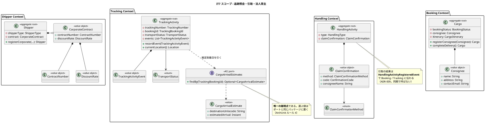
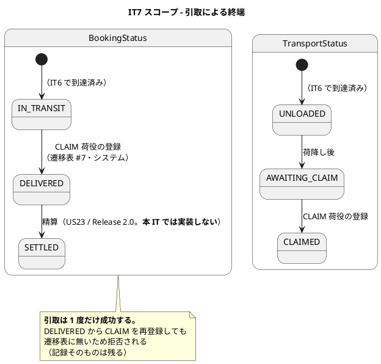
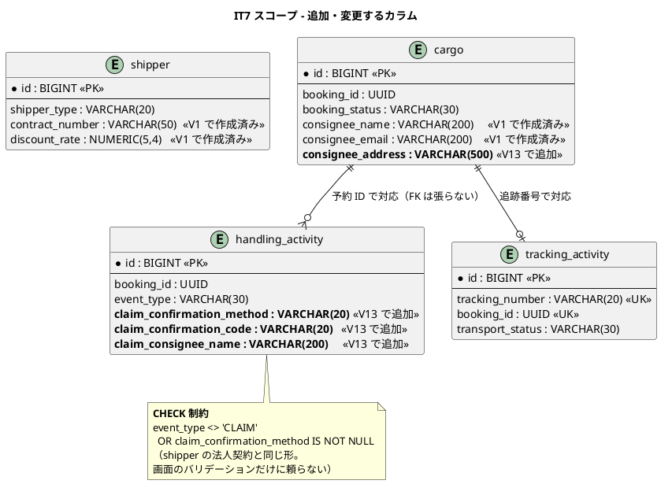
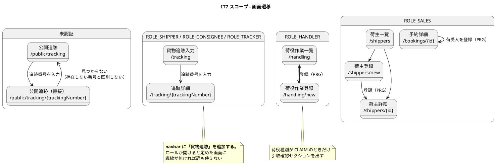

# イテレーション 7 計画

## ゴール

**追跡番号から貨物の現在状況を照会でき、引取で配送を完了させ、法人荷主を契約条件つきで登録できるようにする。**
IT6 で一本つながった線に、**荷主・荷受人が自分で見る入口**と**線の終点（引取）**を付ける。

| 項目 | 内容 |
| :--- | :--- |
| リリース | Release 1.1（実運用に必要な補完） |
| 局面 | **終盤（アウトサイドイン）** — `development_strategy.md` |
| 計画 SP | 8 |
| 完了 SP | （実装完了時に記入） |
| 前提 | IT6 完了（追跡番号の発行と荷役の記録。照会する中身が揃っている） |

**本 IT は「作った人以外が初めて使う」イテレーションである。** IT1〜IT6 で作った画面はすべて
社内ロール（営業・経路設計者・追跡管理者・荷役作業員・管理者）向けだった。US18 の公開追跡は
**認証を持たない相手に見せる最初の画面**であり、見せてよい情報の範囲がそのまま設計上の制約になる。

**Handling Context は ADR-010 により独立した BC である**（IT6 クローズ後に昇格）。
BC 間の状態伝播はドメインイベントによる結果整合である（ADR-009）。**本 IT で追加する
「引取 → 配送完了」も同じ経路に載せる。** ACL ポートで同期に呼ぶ形へ戻さない。

---

## 前イテレーションからの引き継ぎ

IT6 のふりかえり（[retrospective-6.md](retrospective-6.md)）の Try と持ち越しを、本計画の
タスク・成功基準・DoD に落とし込む。

### Try の反映

| Try | 本計画での扱い |
| :--- | :--- |
| T1 **「壊して赤」は入口と出口の両方で回す** | **DoD の安全装置に追加。** 本 IT の判定は 3 つ（引取確認の有無・荷受人氏名の相違・割引率の範囲）であり、**それぞれの結果が書かれる先**（`handling_activity` の列・`cargo.booking_status`・`shipper.discount_rate`）も壊す。P1 への直接の対策 |
| T2 **戻り値で結果を返す安全装置も `grep` で数える** | **タスク 0-1・DoD。** `grep -rn "Repository\.\(update\|save\)"` で `boolean` を返す呼び出し元を全部見る。本 IT は購読側（`ApplyHandlingResultCommandService`）に引取の分岐を足すため、**同じ形が 1 つ増える** |
| T3 **`@Transactional` の中で `return` でエラーを返さない** | **DoD。** 本 IT で新設する書き込みは引取の確認記録・荷受人の登録・法人契約の登録の 3 つ。**書き込みの後に失敗を返す経路を作らない** |
| T4 **設計ドキュメントは「触れた文書の一覧」で確認する** | **タスク 5-0。** `docs/design/*.md` を 1 つずつ開き、当該 IT の変更が影響するかを表にして残す。**IT6 は `architecture_backend.md` を忘れた**（P4） |
| T5 **章を追加したら、その章の索引規約を読み直してから同期する** | **タスク 5-3。** `docs/manual/index.md` の 3 点同期規約を**作業前に読む**。IT6 は `00-はじめに.md` が漏れた（P5） |
| T6 **E2E は「意図した道を通ったこと」を確かめる** | **タスク 4-1。** IT6 の E2E は航海番号を決め打ちして誤配経路を通っていた（P6）。**画面から読んだ値を使い、警告が出ていないことを確かめる**。本 IT で追加する引取まで含めて、クリティカルパスを 1 本に伸ばす |
| T7 依存の更新をイテレーション開始時に置く | **タスク 0-0**（先頭）。IT5・IT6 で有効だった |
| T8 返済枠を最初から時間で確保する | **タスク 0 として 8 時間確保** |
| T9 **設計判断がレビュー後に変わったら、扱いを最初に決める** | **DoD のドキュメント。** 「再レビューするか追補で足りるか」の基準を、本 IT のレビュー実施前に決めて計画に追記する（判断基準: **BC の構成・ポートの向き・トランザクション境界のいずれかが変わったら再レビュー**、それ以外は追補） |
| T10 **結果整合にした経路には、失敗を見る手段を必ず用意する** | **タスク 0-1**（返済枠）。C10 |

### 持ち越しの返済枠（上限 8 時間。T8）

| # | 内容 | 本計画での扱い |
| :--- | :--- | :--- |
| C1 | **追跡番号で予約を引き当てる**（一覧の検索と列） | **タスク 0-5。** 「番号を無くした」の電話に答えられない状態を解消する |
| C3 | 荷役一覧に追跡番号の列・スキャナ入力への対応・作業日時の初期値 | **タスク 0-4。** レビュー H14 が求めるのは**カメラスキャンではなく、バーコードスキャナがキーボードとして打ち込む文字列に耐えること**（オートフォーカス・前後の空白の除去・大文字化・末尾の改行で弾かれない）。**これは実装する。** カメラ入力の UI は端末依存であり実装しない（IT6 と同じ扱い） |
| C5 | `TrackingSequence` の置き場と H2 方言スモークへの追加 | **タスク 0-2** |
| C6 | 確定の `CONFLICTED` テスト・荷役種別ごとの結果状態の網羅テスト | **タスク 0-3** |
| C9 | 用語集への IT6 の語の追加 | **タスク 5-2**（本 IT の語と合わせて追加する） |
| C10 | **購読側の失敗を見る手段** | **タスク 0-1。** ログに出すだけでは「誰も見ない場所に置いた」のと同じ（T10） |
| C2 | 荷役記録の訂正・取り消し | **本 IT では対応しない。** レビュー H11 は「US 化して IT7 へ」としていたが、**US 化されておらず `release_scope.md` にも `release_plan.md` にも無い**。無記名のまま 8SP の枠に押し込むと US18・US16・US03 のいずれかが落ちる。**IT8 の開始準備で US を起票し、SP を与えたうえで割り当てる**（レビューの意図からの逸脱をここに記録する） |
| C4 | ADR-009 の起票 | **完了済み**（[ADR-009](../adr/009-domain-events-for-cross-context-propagation.md)・[ADR-010](../adr/010-handling-as-independent-context.md)。IT6 クローズ後に対応） |
| C7 | 確定した経路の差し戻し | 本 IT では対応しない。**IT8（US10）** |
| C8 | 誤配の追跡担当者への通知（一覧・印） | 本 IT では対応しない。**IT11（US28）** |
| C11 | イベントの取りこぼし（Outbox） | **本 IT では対応しない。** ADR-009 の次の改訂候補であり、**プロセス障害を再現する手段を持たないまま実装すると「入れたが働かない」形になる**（IT6 の安全装置 4 件と同型）。IT8 以降で ADR として判断する |

### IT6 レビュー指摘の扱い

[IT6 実装レビュー](../review/IT6実装_review_20260808.md)の高優先度 14 件のうち 8 件は IT 内で対応済み。
残りのうち、**ふりかえりの C1〜C11 に現れず本 IT で扱うべきもの**を以下に補う。
**ふりかえりだけを読むと落ちる指摘がある**（本検証で 3 件見つかった）。

| # | 指摘 | 本計画での扱い |
| :--- | :--- | :--- |
| H11 | 荷役記録の訂正・取り消し（「US 化して IT7 へ」） | **逸脱を記録して IT8 へ送る**（上表 C2 の理由） |
| H13 | 誤配が追跡担当者に届かない。**IT7 で警告文に「追跡担当者に連絡してください」を追加** | **タスク 3-6。** 一覧・印は US28（IT11）。**文言 1 行は本 IT で入れる** |
| H14 | 追跡番号欄がスキャナ入力に耐えない | **タスク 0-4**（上表 C3。カメラではなくキーボード入力への耐性） |
| M7 | 種別ごとの結果状態の網羅テスト（`@EnumSource` で 1 本にまとめる） | **タスク 0-3** |
| M8 | 作業日時に上限・下限が無く、未来日時が通る（「**IT7 で業務判断のうえ対応**」） | **タスク 1-4。** 判断: **未来日時は拒否せず警告する**（`ui_design.md` が「投機的な登録は許可」と定めている）。**下限は追跡番号の発行日時**とし、それ以前は拒否する（発行前に作業は起こりえない） |
| L1 | `CLAIM` は画面の選択肢に無いが POST すれば通る | **US16 で正式に開く**（タスク 3-6） |
| L2 | `CargoProgress` の不変条件が片側のみ | **US17（IT8）着手時に判断**（据え置き） |

**未対応の高優先度で本計画に現れないものは無い。**

---

## ユーザーストーリー

### 対象ストーリー

| ID | ユーザーストーリー | SP | 優先度 | Issue |
| :--- | :--- | :--- | :--- | :--- |
| US18 | 追跡情報を照会する | 3 | 必須 | [#494](https://github.com/k2works/case-study-cargo-tracker/issues/494) |
| US16 | 引取作業を記録する | 3 | 中 | [#495](https://github.com/k2works/case-study-cargo-tracker/issues/495) |
| US03 | 法人荷主を登録する | 2 | 中 | [#497](https://github.com/k2works/case-study-cargo-tracker/issues/497) |
| | **合計** | **8** | | |

> マイルストーンは 3 件とも `[java/take-6] Release 1.1 実運用補完`、ラベルは `it7` である。
> **java/take-6 には GitHub Project を作っていない**（take-1〜take-5 とは異なる）。
> イテレーションの割り当ては `it7` ラベルとマイルストーンで表す。

### 受入基準

受入基準の正典は [ユーザーストーリー](../requirements/user_story.md) である。**本計画に書き写さず引用する**（IT9 以降で正典が変わっても追随する）。

- US18: [US18 の受入基準](../requirements/user_story.md#us18-追跡情報を照会する)
- US16: [US16 の受入基準](../requirements/user_story.md#us16-引取作業を記録する)
- US03: [US03 の受入基準](../requirements/user_story.md#us03-法人荷主を登録する)

### 受入基準のうち本 IT で満たさないもの

| 内容 | 扱い | 理由 |
| :--- | :--- | :--- |
| US03「登録した法人情報は US22（法人割引を適用する）で参照される」 | **登録と表示までを実装する。** `ShipperDiscountPort` は作らない | **Billing Context は未実装である**（`billing/` は空パッケージ）。参照する側が無い状態でポートだけ作ると、**呼ばれない実装が「済み」として残る**。US22 で作る |
| US16「署名（タッチ入力の画像）」 | **確認コードのみ実装する。** 確認方法の選択肢に署名を置かない | 署名の取得はキャンバス入力と画像の永続化を伴い、**本 IT の 3SP に収まらない**。**押しても何も起きない選択肢を置かない**（IT4〜IT6 と同じ扱い）。ドメインの `ClaimConfirmation` は方式を持つ形にし、署名の追加でモデルを壊さないようにする |
| US16「精算処理の開始条件となる」 | **`DELIVERED` への遷移までを実装する。** 精算は起票しない | 精算は US21〜US23（Release 2.0）。遷移表 #8（`DELIVERED → SETTLED`）は既に定義済みであり、本 IT で触らない |
| US18「推定到着日」の**再計算** | **確定した旅程の最終区間の荷降予定日時を表示する。** 遅延を織り込んだ再計算はしない | 遅延の反映は US19（IT10）。**再計算の入力（遅延イベント）がまだ存在しない** |
| US18 の**荷主向け認証つき一覧**（自社の貨物を並べる） | **実装しない。** 認証つき画面は「追跡番号を入力して 1 件を開く」までとする | 利用者アカウントと荷主を結びつける手段がまだ無く、一覧を出すと**他社の貨物まで見える**。`SecurityConfig` が IT2 から一貫して守っている制約であり、**US34（IT9）で紐付けを作ってから開放する** |
| 分散環境でのレートリミット | **単一プロセス内の制限のみ実装する**（タスク 3-4） | 分散カウンタは基盤（Redis 等）を要し、`architecture_infrastructure.md` の判断が先に要る。**「入れたが 1 台分しか効かない」ことを明記して残す**ほうが、入れないより安全である |
| 追跡番号の**末尾 4 桁による部分一致検索**と候補一覧（`ui_design.md` 貨物追跡入力の仕様） | **実装しない。** 完全一致のみとする | **候補一覧は、番号を知らない利用者に他社の貨物を列挙させる。** 利用者アカウントと荷主の紐付けが無い IT7 時点では、絞り込みの根拠が「入力した 4 桁」しか無い。**US34（IT9）で紐付けを作ってから開放する**（認証つき一覧を出さない判断と同じ理由）。`ui_design.md` にこの前提条件を注記する（タスク 5-1） |

---

## 設計への反映が必要（当該 IT で対応）

計画作成時の突合で見つかった、**設計ドキュメント・スキーマ・シードデータ側の欠落**である。

| # | 内容 | 対応 |
| :--- | :--- | :--- |
| 1 | **`/tracking` の認可規則が設計と実装で食い違う。** `ui_design.md` の画面一覧・ナビゲーション構成は 貨物追跡入力 `/tracking` と 追跡詳細 `/tracking/{trackingNumber}` を `ROLE_SHIPPER, ROLE_CONSIGNEE, ROLE_TRACKER` と定めるのに、`SecurityConfig` は `/tracking`・`/tracking/**` を **ROLE_TRACKER 限定**にしている（IT6 で発行待ち一覧を `/tracking/queue` に置いたときの規則） | **タスク 3-3。** `/tracking/queue`・`/tracking/exceptions` を ROLE_TRACKER 限定として**先に**宣言し、`/tracking`・`/tracking/{trackingNumber}` を 3 ロールに開く。**規則の順序が要である**（後ろに書くと効かない。IT5 で一度当たっている） |
| 2 | **ROLE_SHIPPER・ROLE_CONSIGNEE の利用者が 1 人も存在しない。** `Role` 列挙子にはあるが `V800__seed_users.sql` に無く、**開いてよいと定めた画面を開ける人がいない** | **タスク 3-3・2-4。** シードに `shipper`・`consignee` を追加する。**IT5 は「実行できる人」、IT6 は「実行する人の入口」、本 IT は「その人自体が存在しない」** — 3 回とも「作ったが使えない」型である |
| 3 | **公開追跡の画面が IT6 のプレースホルダのままである。** `templates/public/tracking.html` は入力欄だけを持ち、「追跡機能は IT6 で実装します」と表示している。`HomeController` が返しており、Tracking Context の画面ではない | **タスク 3-1。** Tracking Context に公開追跡のコントローラを新設し、`HomeController` から当該処理を外す。**BC の画面が `shared` にあると、次に読む人は追跡の入口を探せない** |
| 4 | **公開追跡のパス変数名が文書内で割れている。** 画面一覧は `/public/tracking/{trackingId}`、仕様本文と htmx の例は `{trackingNumber}` と書いている | **タスク 5-1。** **`{trackingNumber}` を採る**（識別子の正典は `TrackingNumber` であり、`trackingId` という型はどこにも無い）。画面一覧を修正する |
| 5 | **`cargo.consignee_address` が存在しない。** `data-model.md` が「**V1 に無い。追加が必要**」と明記しており、US16 の担当と定めている | **タスク 2-1。** `V13` で追加する。`consignee_name`・`consignee_email` は V1 にあり NULL 許容のままでよい（**荷受人は予約時点では未確定でありうる**） |
| 6 | **引取確認を保存する列が無い。** `handling_activity` に確認方法・確認コード・荷受人氏名の列が無く、`data-model.md` の列定義にも無い。**引き渡し証明は事故時の唯一の防御線である**（`ui_design.md`）のに、記録先が定義されていない | **タスク 2-1・5-1。** `V13` で `claim_confirmation_method`・`claim_confirmation_code`・`claim_consignee_name` を追加し、`data-model.md` の列定義に載せる。**CHECK 制約で「CLAIM のときだけ必須」を DB 側にも置く**（`shipper` の法人契約と同じ形） |
| 7 | **Booking の `Consignee` 値オブジェクトが未実装である。** `domain-model.md` は `Cargo *-- Consignee` と定め、US16 の受入基準も「予約に荷受人を登録でき」と要求するが、`booking/domain/model/` に存在せず、登録する画面も無い | **タスク 1-1・3-2。** 値オブジェクト `Consignee` を新設し、**予約詳細に荷受人の登録・訂正を置く**（新規画面は作らない。予約登録フォームには戻さない — `ui_design.md` が US04 から外した判断を覆さない） |
| 8 | **`CorporateShipper`・`ContractNumber`・`DiscountRate` が未実装である。** `domain-model.md` に「未実装（US03 / IT7）」と明記されている。DB 列（`contract_number`・`discount_rate`）と CHECK 制約は V1 にある | **タスク 1-3・2-2・3-5。** ドメイン・マッパー・画面を実装する。**スキーマの追加は不要である**（V1 が先回りしている） |
| 9 | **推定到着日を Tracking が持たない。** US18 の受入基準は推定到着日の表示を求めるが、旅程を持つのは Booking の `CargoItinerary` であり、Tracking からの参照経路が **ACL ポート一覧（正典）に無い** | **タスク 1-2・2-3・5-1。** ACL ポート `CargoArrivalEstimates`（Tracking → Booking）を新設し、一覧に追加する。**運ぶ値はポートと同じパッケージに置く**（唯一の越境点。ArchUnit ルール 4）。名前は複数形、運ぶ値は単数形 `CargoArrivalEstimate`（IT6 で定めた規約） |
| 10 | **公開エンドポイントにレートリミットが無い。** `non_functional.md` は「荷受人: 100 RPS/IP」を定め、`ui_design.md` は 429 到達時の表示まで定めているのに、実装が存在しない（`grep -rn "RateLimit"` が 0 件）。**認証の無い列挙可能なエンドポイントである** | **タスク 3-4。** `/public/**` に単一プロセス内の per-IP 制限を入れる。**`/actuator/health` を必ず除外する**（一律適用すると過負荷時に liveness が落ちて再起動ループに入る。他 take で実測した故障モード）。分散対応は明記して残す |
| 12 | **法人荷主の形が実装できない。** `domain-model.md` は `CorporateShipper extends Shipper`（集約ルートのサブタイプ）と定めるが、実装の `Shipper` は `final` かつ `@Immutable` であり、継承すると**「法人なのに契約が無い」「個人なのに契約がある」組み合わせを型で防げなくなる** | **タスク 1-3・5-1。** **値オブジェクト `CorporateContract`（契約番号と割引率のひと組）を `Shipper` が持つ形に改める。** IT6 で `ProposedRoute.Path`・`CargoProgress` に適用したのと同じ判断（**別々に持つと不正な組み合わせを作れる値はまとめる**）であり、本プロジェクトの先例に揃う。`domain-model.md` の図・一覧・ビジネスルール 3 を修正する |
| 13 | **`/tracking/{trackingNumber}/status` が 2 つの意味を持つ。** `ui_design.md` の画面一覧は 貨物状態手動更新（ROLE_TRACKER・US17）とし、同じ文書の htmx パターンは追跡詳細の**30 秒自動更新の取得先**として同じパスを挙げている。**片方は更新、片方は参照であり、認可の対象が違う** | **タスク 5-1。** 自動更新の取得先を `/tracking/{trackingNumber}/status-fragment` に改める。**US17（IT8）で手動更新を実装する前に直す**（実装してからでは、どちらの規則が先に書かれているかで挙動が決まる） |
| 11 | **引取による配送完了が購読側に無い。** `BookingHandlingEventHandler` は `LOAD`（輸送開始）だけを見ており、遷移表 #7（`IN_TRANSIT → DELIVERED`、`CLAIM` 荷役により自動遷移）が実装されていない | **タスク 1-4。** 通常の実装作業であり文書の欠落ではないが、**ここが US16 の要である**ため明示する |

> **IT2 はカラム、IT3 はマスタデータ、IT4 は値の出どころ、IT5 は「実行できる人」、IT6 は
> 「実行する人の入口」、IT7 は「その人自体の不在」と「見せてよい範囲の未定義」**である。
> 6 回とも着手前の突合でしか見つからない型であり、**実装してからでは「動いているから良い」に見える。**

---

## 設計（IT7 スコープ）

### ドメインモデル図

**Handling は `Consignee` を参照しない。** 引取時に照合するのは画面に入力された荷受人氏名と
予約の荷受人氏名であり、**照合は Booking 側の購読で行う**。Handling が Booking の値オブジェクトを
読むと BC 分離に反する。

### 状態遷移図（IT7 スコープ）

> **`DELIVERED` 以降はキャンセルできない**（`BookingStatus` に実装済み）。引き渡し済み貨物の
> 取り消しは返送であり別業務である。本 IT で緩めない。

### ER 図（IT7 スコープ）

> **`V13` は共通マイグレーションに置く。** PostgreSQL 固有の関数・型を書かない
> （共通に方言を漏らすと、実 DB のテストが全緑でも H2 のローカル起動だけが落ちる）。

### 画面遷移図（IT7 スコープ）

### インタラクション（IT7 スコープ）

| 画面 | 操作 | 送信先 | 結果 |
| :--- | :--- | :--- | :--- |
| 公開追跡 | 追跡する | `GET /public/tracking?trackingNumber=...` | 同画面に結果を表示（PRG ではない。**照会に副作用が無い**） |
| 公開追跡（直接） | URL 直アクセス | `GET /public/tracking/{trackingNumber}` | 結果を表示。QR・共有 URL からの入口 |
| 貨物追跡入力 | 追跡する | `GET /tracking?trackingNumber=...` → `/tracking/{trackingNumber}` へリダイレクト | 追跡詳細 |
| 荷役作業登録 | 荷役種別を選ぶ | `hx-get /handling/claim-fields?type=...` | 引取確認セクションの表示切替（htmx 部分更新） |
| 荷役作業登録 | 登録する | `POST /handling` | PRG で `/handling` へ。登録した作業を先頭に表示 |
| 予約詳細 | 荷受人を登録する | `POST /bookings/{bookingId}/consignee` | PRG で同画面へ |
| 荷主登録 | 種別を選ぶ | `hx-get /shippers/contract-fields?type=...` | 法人契約セクションの表示切替（htmx 部分更新） |
| 荷主登録 | 登録する | `POST /shippers` | PRG で荷主詳細へ |

> **公開追跡だけ PRG を使わない。** 照会は副作用を持たず、**URL がそのまま共有可能である**
> ことが US18 の価値そのものである。リダイレクトで番号を URL から消すと、
> 荷主が取引先に転送できない。

---

## タスク分解

理想時間で見積もる。合計 **74.5 時間**（返済枠 8 時間を含む）。

### 0. 先に片付ける（上限 8 時間。T7・T8）

| # | 内容 | 見積 |
| :--- | :--- | :--- |
| 0-0 | 依存の更新（Gradle・npm・Trivy 0 件の確認）。**イテレーション開始時に置く**（T7） | 1.0h |
| 0-1 | **購読側の失敗を見る手段**（C10・T10）。`AFTER_COMMIT` の購読が `NOT_FOUND` / `CONFLICTED` で終わった件数を計測に出し、**ログを見る運用の手順を `operation.md` に書く**。あわせて `boolean` を返すリポジトリ操作の呼び出し元を `grep` で数える（T2） | 2.0h |
| 0-2 | `TrackingSequence` の置き場の是正と H2 方言スモークへの追加（C5） | 1.0h |
| 0-3 | 確定の `CONFLICTED` テストと、荷役種別ごとの結果状態の網羅テスト（C6。`@ParameterizedTest` で 5 種別） | 1.5h |
| 0-4 | 荷役一覧に追跡番号の列を追加し、作業日時の初期値を現在日時にする。追跡番号欄をスキャナ入力に耐えさせる（C3・H14: オートフォーカス・前後空白の除去・大文字化・末尾改行で弾かれない）。**カメラスキャンの UI は実装しない** | 1.5h |
| 0-5 | 予約一覧を追跡番号で検索できるようにし、一覧に列を出す（C1） | 1.0h |

### 1. ドメイン（US16・US03・US18 の不変条件）

| # | 内容 | 見積 |
| :--- | :--- | :--- |
| 1-1 | Booking に `Consignee`（`name` / `address` / `contactEmail`。**3 項目とも `String`**。`domain-model.md` の定義に従う。Shipper Context の `Email`・`Address` を参照しない — BC 分離）を新設し、`Cargo.registerConsignee` を実装する。**Setter を生やさない**（既存の `rename` / `relocate` と同じ命名の規律） | 3.0h |
| 1-2 | Tracking に ACL ポート `CargoArrivalEstimates` と値 `CargoArrivalEstimate` を定義する。**運ぶ値はポートと同じパッケージ**（設計反映 #9） | 1.5h |
| 1-3 | Shipper に `CorporateContract`（`ContractNumber` / `DiscountRate`）を新設し、`Shipper.registerCorporate` を実装する。**`Shipper` を継承しない**（設計反映 #12）。**割引率の上限 30% はドメインの不変条件**であり、画面に別の上限を書かない（設計反映 #8） | 3.0h |
| 1-4 | Handling に `ClaimConfirmation`（`ClaimConfirmationMethod` / `ConfirmationCode` / 荷受人氏名）を新設し、`HandlingType.CLAIM` のときだけ必須とする。**要否は種別自身が知る**（既存のデシジョンテーブルと同じ形。登録処理に対応表を書き写さない）。あわせて**作業日時の下限を追跡番号の発行日時とする**（レビュー M8。未来日時は拒否せず警告する） | 4.0h |
| 1-5 | `Cargo.completeDelivery()`（遷移表 #7）を実装し、`ApplyHandlingResultCommandService` に引取の分岐を足す（設計反映 #11） | 2.5h |
| 1-6 | `TrackingActivity.currentLocation()`（最新イベントの場所）を実装する。**イベントが無いときは「未受取」を意味する空を返す**（例外にしない） | 1.5h |

### 2. 永続化

| # | 内容 | 見積 |
| :--- | :--- | :--- |
| 2-1 | `V13__consignee_and_claim_confirmation.sql`（共通）。`cargo.consignee_address` と `handling_activity` の引取確認 3 列＋ CHECK 制約（設計反映 #5・#6） | 2.0h |
| 2-2 | `ShipperMapper` に契約番号・割引率を足す。**UUID / NUMERIC の型ハンドラを明示する**（IT5 P5・IT6 T5） | 2.0h |
| 2-3 | `CargoArrivalEstimates` の実装（Booking のクエリサービスへ委譲する薄い内部実装。HTTP は介在しない） | 2.0h |
| 2-4 | `CargoMapper`・`HandlingActivityMapper` の列追加。シードに `shipper`・`consignee` の利用者を追加する（設計反映 #2）。**シードを読む検査は `db/seed` 配下すべてを読む形のまま壊さない**（IT6 T3） | 2.5h |
| 2-5 | Testcontainers による Repository テスト（ADR-003。H2 では書かない）。**引取確認の CHECK 制約を DB レベルで壊して赤を見る**（T1 の「出口」） | 3.0h |

### 3. アプリケーションと画面（アウトサイドインの主戦場）

| # | 内容 | 見積 |
| :--- | :--- | :--- |
| 3-1 | Tracking Context に公開追跡のコントローラと画面を新設する（`GET /public/tracking`・`GET /public/tracking/{trackingNumber}`）。**個人情報を出さない**（荷主名・住所・連絡先・担当者名）。**存在しない番号と権限外を同一メッセージにする**（列挙攻撃対策）。`HomeController` から当該処理を外す（設計反映 #3） | 5.0h |
| 3-2 | 認証つき追跡（`GET /tracking`・`GET /tracking/{trackingNumber}`）。イベント履歴・現在地・推定到着日を表示する。予約詳細に荷受人の登録を追加する（設計反映 #7） | 5.0h |
| 3-3 | `SecurityConfig` の規則を分ける（設計反映 #1）。**`/tracking/queue`・`/tracking/exceptions` を先に宣言する**。navbar（`layout/nav.html`）とダッシュボード（`dashboard.html`）に「貨物追跡」をロール条件付きで追加し、**ナビ表示の検証テストを書く**（`ui_design.md` のナビゲーション構成表 → navbar → ダッシュボード → 検証テストの 4 点一致） | 3.0h |
| 3-4 | `/public/**` の per-IP レートリミット（設計反映 #10）。**`/actuator/health` を除外する**。429 の画面と再試行目安を出す。**分散環境では 1 プロセス分しか効かないことを画面ではなくドキュメントに明記する** | 3.5h |
| 3-5 | 荷主登録・荷主詳細・荷主一覧に法人契約を反映する（htmx で種別による表示切替。一覧の契約割引率は法人のみ表示し個人は `-`） | 4.0h |
| 3-6 | 荷役作業登録の選択肢に `CLAIM` を正式に加え（レビュー L1）、引取確認セクションを追加する（htmx で種別による表示切替）。**荷受人氏名が予約と異なる場合は警告を出し、メモへの記入を求める**（禁止はしない。代理受領は実務で頻繁に起きる）。**誤配の警告文に「追跡担当者に連絡してください」を加える**（レビュー H13） | 4.0h |

### 4. E2E とテスト

| # | 内容 | 見積 |
| :--- | :--- | :--- |
| 4-1 | クリティカルパスの E2E を**引取まで伸ばす**。**画面から読んだ航海番号を使い、誤配の警告が出ていないことを確かめる**（T6。IT6 の P6 への対策） | 3.0h |
| 4-2 | 公開追跡の E2E（未ログインで照会できること・存在しない番号で同一メッセージが出ること）。**終盤の完了条件「クリティカルパス 3 本（US13 / US15 / US18）」の 3 本目** | 2.0h |

### 5. ドキュメント

| # | 内容 | 見積 |
| :--- | :--- | :--- |
| 5-0 | **`docs/design/*.md` を 1 つずつ開き、本 IT の変更が影響するかを表にする**（T4）。11 文書すべてに ○ / × を付けて計画に残す | 1.0h |
| 5-1 | 設計ドキュメントの更新。**要素表への追加を漏らさない**（IT1〜IT3 で反復したドリフト）: `domain-model.md` の ACL ポート一覧に `CargoArrivalEstimates`、値オブジェクト一覧に `Consignee`（既載）・`ClaimConfirmation`・`CorporateContract`、**列挙型に `ClaimConfirmationMethod`**。`data-model.md` に `V13` の列。`ui_design.md` は パス変数名の統一（#4）・`/tracking/{trackingNumber}/status` の衝突解消（#13）・**予約詳細の salt ワイヤーフレームに荷受人を追加**（仕様には書かれているが図に無い）・部分一致検索の前提条件の注記。`architecture_backend.md`・`non_functional.md` にレートリミット | 4.0h |
| 5-2 | 用語集への IT6・IT7 の語の追加（C9）。JIG の `glossary.html` と `domain-model.md` の用語表を突き合わせる | 1.0h |
| 5-3 | ユーザーマニュアルの更新。**対象章の索引規約を作業前に読む**（T5）。公開追跡・認証つき追跡・引取確認・法人荷主登録の 4 節を追加し、**画面キャプチャを撮り直す**。`index.md`・`00-はじめに.md`・`mkdocs.yml` の 3 点を揃える | 4.0h |

---

## ADR

| # | 判断 | 起票 |
| :--- | :--- | :--- |
| ADR-011 | **公開エンドポイントの防御を単一プロセス内のレートリミットで行う。** 分散カウンタを持たないため、N 台構成では実効上限が N 倍になる。**この限界を記録したうえで採る**（入れないより安全であり、基盤を決めてから入れ直せる） | **タスク 3-4 と同じコミットで起票する。** IT6 の教訓（M4: 判断が ADR に無いまま採用されていた）への対策。**書こうとして初めて判断の誤りに気づく**ことが IT6 で起きている |

**ADR を要しない判断**（構造を変えないため）:

- `CorporateContract` を値オブジェクトとする（設計反映 #12）— `domain-model.md` の修正で足りる。BC の構成・ポートの向き・トランザクション境界のいずれも変えない
- `CargoArrivalEstimates` の新設 — ADR-009 が定めた「問い合わせは ACL ポート」の枠内である

---

## スケジュール

終盤（アウトサイドイン）であるため、**受け入れテストを先に置き、外側から内側へ実装する**。
ただしタスク 0（返済枠）だけは先頭に固定する（T7・T8）。

| 順 | 範囲 | 含むタスク | 累計 |
| :--- | :--- | :--- | :--- |
| 1 | 先に片付ける | 0-0 〜 0-5 | 8h |
| 2 | 受け入れテストを赤で置く | 4-1・4-2 の骨格（この時点では赤） | 11h |
| 3 | 画面と認可 | 3-3 → 3-1 → 3-2 | 24h |
| 4 | ドメイン | 1-1 → 1-4 → 1-5 → 1-6 → 1-2 → 1-3 | 39h |
| 5 | 永続化 | 2-1 → 2-2 → 2-4 → 2-3 → 2-5 | 50h |
| 6 | 画面の残りと防御 | 3-5 → 3-6 → 3-4 | 61h |
| 7 | E2E を緑にする・ドキュメント | 4-1・4-2 の完了、5-0 〜 5-3 | 74h |

> **`SecurityConfig`（3-3）を最初に置く。** 本 IT の設計反映 #1・#2 は認可規則とシードの
> 欠落であり、**これを直さないと以降の画面をどのロールでも確認できない**。

## 完了条件

### デモ項目（`development_strategy.md`「デモ項目を受け入れ基準とする」）

**以下をそのまま E2E / 受け入れテストの受入基準とする。**

1. 未ログインの状態で `/public/tracking` を開き、追跡番号を入力して状態・イベント履歴・推定到着日が見える
2. 存在しない追跡番号を入力すると、権限外のときと**同じ文言**が返る
3. `shipper` でログインし、navbar の「貨物追跡」から追跡詳細に到達できる。**`/tracking/queue` は 403 になる**
4. `handler` でログインし、引取確認（確認コード・荷受人氏名）を入力して引取を登録できる
5. 引取の登録後、予約詳細を開くと予約状態が「配送完了」になっている（結果整合のため反映に間があることを含めて確認する）
6. `sales` でログインし、種別「法人」を選んで契約番号と契約割引率つきで荷主を登録できる。**割引率 31% は弾かれる**
7. 荷主一覧で、法人の契約割引率が表示され、個人は `-` が表示される

---

## リスク

| リスク | 影響 | 対策 |
| :--- | :--- | :--- |
| **公開画面から個人情報が漏れる** | 高 | 表示項目を `TransportStatus`・イベント履歴（日時・種別・場所）・推定到着日に限定する。**テストで「荷主名・住所・連絡先・担当者名が本文に現れないこと」を検証する**（項目を足したときに落ちる形にする） |
| **追跡番号の列挙で貨物の存在が分かる** | 中 | 存在しない番号と権限外を同一メッセージにする。レートリミットを入れる（タスク 3-4）。**追跡番号は日付＋連番であり推測されうる**ことをリスクとして `non_functional.md` に残す |
| レートリミットが liveness を巻き込む | 高 | `/actuator/health` を除外する。**除外が効いていることをテストで確かめる**（他 take で再起動ループを実測した故障モード） |
| `SecurityConfig` の規則の順序を誤り、発行待ち一覧が荷主に見える | 高 | `/tracking/queue` を先に宣言する。**ROLE_SHIPPER で `/tracking/queue` に GET して 403 になることをテストで固定する**（T1 の「出口」） |
| 引取が二重登録され `DELIVERED` から再遷移する | 中 | 遷移表に無い遷移は拒否される（実装済み）。**購読側で拒否されたときにログと計測に残す**（タスク 0-1） |
| 荷受人が未登録の予約で引取を登録できない | 中 | **登録は拒否しない。** 照合できないことを警告として残す。**拒否すると実際に起きた作業がどこにも残らない**（Handling の既存方針と同じ） |
| SP 8 に対してタスクが 74.5 時間ある | 中 | 返済枠 8 時間を除くと 66.5 時間。IT6（8SP）を上回る。**超過したら US03（2SP・優先度中）を IT8 へ送る**ことを先に決めておく。US03 は他ストーリーへの依存が無く、単独で切り出せる |

---

## 完了の定義（DoD）

### 機能

- [ ] US18 の受入基準がすべて緑（[正典](../requirements/user_story.md#us18-追跡情報を照会する)を参照。本計画に書き写さない）
- [ ] US16 の受入基準がすべて緑（[正典](../requirements/user_story.md#us16-引取作業を記録する)。ただし「署名」を除く。除外理由は本計画に明記済み）
- [ ] US03 の受入基準がすべて緑（[正典](../requirements/user_story.md#us03-法人荷主を登録する)。ただし「US22 で参照される」を除く）

### 終盤の完了条件（`development_strategy.md`）

- [ ] 業務シナリオが通しで動作する（予約 → 経路 → 確定 → 追跡番号 → 受領 → 積込 → 荷降し → 引取 → 配送完了）
- [ ] **E2E のクリティカルパス 3 本（US13 / US15 / US18）が緑**
- [ ] ArchUnit の 6 ルールがすべて有効（無効化しない）

### 品質

- [ ] `./gradlew check` が緑（Checkstyle 0 件 / SpotBugs 0 件）
- [ ] SonarQube Quality Gate が PASS
- [ ] CI が緑
- [ ] **フルテストを実行した**（`./gradlew test`。ArchUnit・Testcontainers を含む。**ポートを追加したらレビューではなくフルテストで確かめる** — レビューは構造的検証を捕捉しない）
- [ ] H2 方言スモークが緑（`V13` を含む）

### 安全装置（T1: 入口と出口の両方）

| 装置 | 入口を壊す | 出口を壊す |
| :--- | :--- | :--- |
| 引取確認の必須判定 | [ ] ドメインで確認方法なしを弾く | [ ] DB の CHECK 制約で弾く |
| 荷受人氏名の相違 | [ ] 照合で相違を検出する | [ ] 警告が画面に出る |
| 割引率の上限 30% | [ ] ドメインで弾く | [ ] DB の CHECK 制約で弾く／画面に別の上限を書いていない |
| 引取による配送完了 | [ ] `CLAIM` を購読が拾う | [ ] `cargo.booking_status` が `DELIVERED` になる |
| 公開画面の情報制限 | [ ] 個人情報を渡していない | [ ] レスポンス本文に現れない |
| レートリミット | [ ] 上限超過で 429 | [ ] `/actuator/health` は対象外 |
| 認可の順序 | [ ] ROLE_SHIPPER で `/tracking/{n}` が開く | [ ] ROLE_SHIPPER で `/tracking/queue` が 403 |

- [ ] **上表のすべてを実際に壊して赤を確認した**（設定したことと働いていることは別である）

### 例外処理と戻り値（T2・T3）

- [ ] `boolean` を返すリポジトリ操作の呼び出し元を `grep` で数え、**戻り値を捨てている箇所が 0 件**
- [ ] `@Transactional` の中で `return` によりエラーを返す経路が 0 件

### 到達性（ロール別・状態別）

- [ ] ROLE_SHIPPER / ROLE_CONSIGNEE が navbar またはダッシュボードから `/tracking` に到達できる
- [ ] シードに `shipper`・`consignee` の利用者があり、**実際にログインして確認した**
- [ ] `IN_TRANSIT` の貨物から引取の登録に到達できる
- [ ] `DELIVERED` の予約を開いても壊れない（操作ボタンが集約の述語で出し分けられている）
- [ ] **状態を進める操作の直後に、同じ画面をもう一度開いた**（引取後の荷役一覧・予約詳細・追跡詳細）

### ドキュメント

- [ ] **`docs/design/*.md` の 11 文書すべてに影響の有無を付けた**（T4。タスク 5-0 の表を計画に残す）
- [ ] `domain-model.md` の ACL ポート一覧に `CargoArrivalEstimates` を追加した
- [ ] `data-model.md` に `V13` の列を反映した
- [ ] `ui_design.md` のパス変数名を `{trackingNumber}` に統一した
- [ ] マニュアルの 3 点同期（`index.md`・`00-はじめに.md`・`mkdocs.yml`）を**規約を読み直してから**実施した（T5）
- [ ] 新設パッケージの `package-info.java` を同じコミットで書いた（T6・IT6 から継続）
- [ ] **レビュー後に設計判断が変わった場合の扱いの基準**（BC 構成・ポートの向き・トランザクション境界のいずれかが変われば再レビュー、それ以外は追補）を、レビュー実施前に確認した（T9）

---

## 設計ドキュメントの影響確認（タスク 5-0 / T4）

**「実装した BC の数」ではなく「触れた文書の一覧」で確認する。** IT6 は
`architecture_backend.md` を忘れ、しかもそこには実装と**故障モードがまるで違う**
設計が書かれていた（P4）。`docs/design/` の 11 文書を 1 つずつ開いた結果である。

| # | 文書 | 影響 | 内容 |
| :--- | :--- | :--- | :--- |
| 1 | `domain-model.md` | ○ | ACL ポート一覧に `CargoArrivalEstimates`。Handling の要素表に `HandlingDetails`・`HandledCargo`・`ScannedTrackingNumber`・`ClaimConfirmation`・`ClaimConfirmationMethod`。Shipper の `CorporateShipper` サブタイプを `CorporateContract` 値オブジェクトへ改めた（設計反映 #12）。`Consignee` の型を明記 |
| 2 | `data-model.md` | ○ | `V13`（`handling_activity.tracking_number`）と `V14`（引取確認 3 列 + CHECK 制約、`cargo.consignee_address`） |
| 3 | `ui_design.md` | ○ | パス変数を `{trackingNumber}` に統一（#4）。`/status` の衝突を `status-fragment` で解消（#13）。予約詳細の salt に荷受人を追加（仕様にはあったが図に無かった）。部分一致検索を実装しない判断を明記 |
| 4 | `non_functional.md` | ○ | レートリミットの実装状況と残課題（1 プロセスのみ・ALB 背後の送信元 IP）。`ROLE_SHIPPER` の「将来」を実装済みに |
| 5 | `architecture_backend.md` | ○ | コンテキストマップに `CargoArrivalEstimates`。実装状況のスナップショット。`HandlingActivityRegisteredEvent` の購読先に配送完了 |
| 6 | `operation.md` | ○ | 結果整合の取りこぼしの監視項目と確認手順（C10） |
| 7 | `test_strategy.md` | ○ | ACL ポートの列挙をやめ `domain-model.md` を参照する形に（ポート名の正典を 1 つにする） |
| 8 | `architecture_frontend.md` | △ | テンプレート構成に `tracking/index.html`・`show.html`・`_result.html` が増えたが、**旧版の記述と矛盾しない**（`public/tracking.html` は既に記載済み）。`_status-timeline.html` は US17（IT8）で作る |
| 9 | `architecture_infrastructure.md` | △ | レートリミットの残課題（`ForwardedHeaderFilter`）が基盤側の課題として発生した。**ADR-011 に記録し、本文の更新は基盤を決める IT で行う** |
| 10 | `tech_stack.md` | × | 新しい技術を導入していない（Micrometer は Actuator に同梱済み） |
| 11 | `index.md` | × | 文書の増減が無い |

## 更新履歴

| 日付 | 内容 |
| :--- | :--- |
| 2026-08-08 | 初版作成（`opening-iteration` ステップ 2） |
| 2026-08-08 | `validating-design` の結果を反映。ADR 節（ADR-011 レートリミット）を追加。予約詳細の salt ワイヤーフレームと仕様の乖離、`domain-model.md` 要素表への新規列挙型の追加、ナビ表示の検証テストをタスクに明記。追跡番号の**末尾 4 桁による部分一致検索**を実装しない判断を追加 |
| 2026-08-08 | `validating-iteration-plan` の結果を反映。**ふりかえりだけを読むと落ちるレビュー指摘 3 件**（H13 誤配の警告文・H14 スキャナ入力・M8 作業日時の下限）を追加。`Consignee` の型を `domain-model.md` の定義（3 項目とも `String`）に合わせる。法人荷主の形（設計反映 #12）と `/tracking/{trackingNumber}/status` のパス衝突（設計反映 #13）を追加。テンプレートに沿って スケジュール・デモ項目・更新履歴 を追加 |

---

## 参照

- [リリース計画](release_plan.md) — IT 配分と SP の正典
- [開発戦略](development_strategy.md) — 局面（終盤・アウトサイドイン）
- [IT6 ふりかえり](retrospective-6.md) — Try と持ち越しの出典
- [IT6 計画](iteration_plan-6.md)
- [IT6 実装レビュー](../review/IT6実装_review_20260808.md)
- [ユーザーストーリー](../requirements/user_story.md) — 受入基準の正典
- [ドメインモデル設計](../design/domain-model.md) — ACL ポート一覧・状態遷移表の正典
- [データモデル設計](../design/data-model.md)
- [UI 設計](../design/ui_design.md) — 画面一覧・ナビゲーション構成の正典
- [非機能要件](../design/non_functional.md) — RBAC ロール定義・レートリミットの正典
- [ADR-003 データベース戦略](../adr/003-database-strategy.md)
- [ADR-005 共有カーネルの範囲](../adr/005-shared-kernel-scope.md)
- [ADR-006 外部連携は内部シミュレーション](../adr/006-external-integration-internal-simulation.md)
- [ADR-009 BC 間の状態伝播はドメインイベント](../adr/009-domain-events-for-cross-context-propagation.md)
- [ADR-010 Handling を独立した BC とする](../adr/010-handling-as-independent-context.md)
