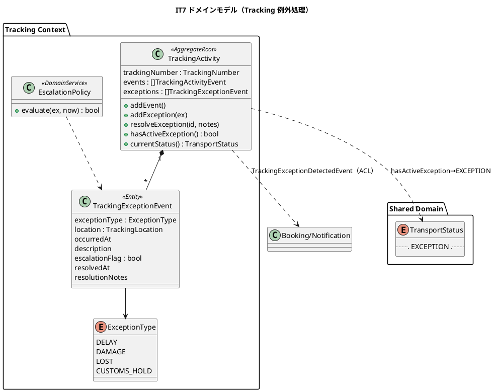
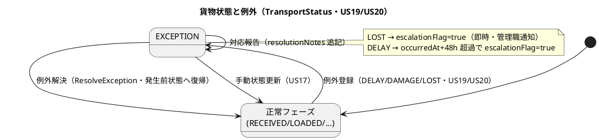
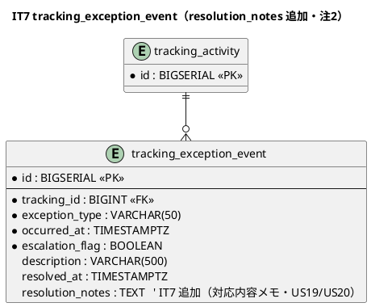
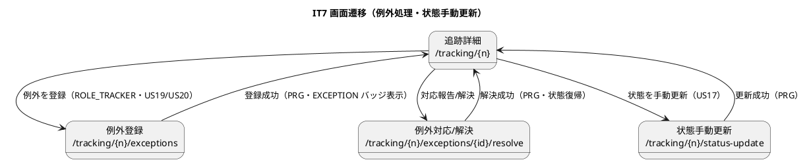

# イテレーション 7 計画

## 概要

本イテレーション（IT7）は、終盤局面（**アウトサイドイン**）の初回として、**貨物状態手動更新（US17・3SP）**・**遅延例外処理（US19・5SP）**・**破損/紛失例外処理（US20・5SP）** を実装する。IT6 で「枠のみ」（テーブル + sqlc 構造体）だった Tracking Context の**例外処理**（`TrackingExceptionEvent`・`ExceptionType`・エスカレーション判定・例外解決）を、追跡管理者の業務シナリオ起点で作り込む。例外発生で貨物状態が EXCEPTION に遷移し、荷主に通知され、紛失（LOST）は管理職へエスカレーションされる。Phase 3（精算・例外処理）の例外処理側を完成させる。

- **局面**: 終盤（IT7-8）／アプローチ: **アウトサイドイン**（例外登録/解決・状態手動更新の受入シナリオ・画面のニーズから application → domain へ実装。ただしエスカレーション判定など複雑ドメインは domain をテストファーストで固める）
- **対象 BC**: **Tracking Context**（例外イベント・状態手動更新・エスカレーション）中心。Notification（荷主・管理職通知は NotificationPort 再利用）
- **前提**: IT6 で `tracking_exception_event` テーブル + sqlcgen 構造体は生成済み（枠のみ）。ドメインの `TrackingExceptionEvent`/`ExceptionType`/`AddException`/`ResolveException`/`hasActiveException`/エスカレーションポリシー、例外 sqlc クエリ、application サービス、web handler、UI 画面はすべて新規実装。`TrackingActivity` 集約・`TransportStatus`（EXCEPTION 値含む）・追跡照会（US18）は実装済み。

---

## ゴール

### イテレーション終了時の達成状態

- 追跡管理者が、追跡番号を指定して**貨物状態を手動更新**でき（荷役記録で捕捉できない出港・入港等）、追跡イベントに記録され荷主に通知される（US17）。
- 追跡管理者が、**遅延例外**（場所・日時・理由）を記録でき、貨物状態が EXCEPTION に遷移し荷主に通知される。**対応内容（新到着予定日・対応方針）を入力して対応報告**でき、例外対応履歴が残る（US19）。
- 追跡管理者（または荷役作業員）が、**破損/紛失例外**を記録でき、貨物状態が EXCEPTION に遷移する。**紛失（LOST）は緊急フラグが立ち管理職へエスカレーション通知**され、荷主に通知される。補償方針等の対応報告ができる（US20）。

### 成功基準

- [ ] US17/US19/US20 の受け入れ基準を満たす（状態手動更新・例外登録・EXCEPTION 遷移・通知・エスカレーション・対応報告・履歴）。
- [ ] `TrackingExceptionEvent`・`ExceptionType`（DELAY/DAMAGE/LOST/CUSTOMS_HOLD）・`AddException`/`ResolveException`/`hasActiveException`・`EscalationPolicy`（LOST 即時 / DELAY 48h 超過）を domain 層ユニットテストで隔離検証（48 時間境界 47:59/48:00/48:01 をテーブル駆動・Clock 注入で決定的に）。
- [ ] 例外解決で TransportStatus が例外発生前の状態に復帰することを検証。
- [ ] Tracking ドメイン層カバレッジ 90% 以上・SonarQube Quality Gate PASS（new_coverage 80%+・violations 0・重複 3% 未満）。
- [ ] `make check`（build/test/lint/govulncheck/arch）green・`make arch` green。
- [ ] **フルフロー E2E とリポジトリ統合テストを開発フェーズ内で実施**（T5・クローズに回さない）。

### IT6 ふりかえり Try の反映（返済枠）

- [ ] **T1（IT6 由来・プロセス）検証結果フィードバックの DoD 化**: 例外/エスカレーションの検出結果が、関係ロール（荷主・管理職・追跡管理者）の画面/通知に届くことを確認してから完了とする。
- [ ] **T2（IT6 由来・プロセス）状態遷移副作用のテーブル駆動テスト**: エスカレーション 48 時間境界・EXCEPTION 遷移/復帰をテーブル駆動で網羅。
- [ ] **T3（IT6 由来・ADR-0008・高）BC 間同期の原子化（返済枠）**: 例外イベント登録・追跡番号採番を単一トランザクション境界で行う。追跡番号採番を DB シーケンス/採番テーブルによる原子採番へ移行し UNIQUE 衝突リトライを追加（例外書き込みで新パターンを確立）。
- [ ] **T4（IT6 由来・ADR-0008・高）荷役履歴リプレイ**: 追跡レコード作成時に既存荷役をリプレイして履歴を再構築（余力次第・超過時は IT8 へ明示繰越）。
- [ ] **T5（IT6 由来・高）フルフロー E2E・統合テストの開発フェーズ内実施**: 例外登録→EXCEPTION 遷移→解決→状態復帰の一連フロー E2E、tracking_exception_event リポジトリの testcontainers 統合テストを開発中に追加。
- [ ] **T6（IT5/IT6 由来・中）協議依頼/通知待ちワークリスト**: 余力次第。超過時は IT8 へ明示繰越。

---

## ユーザーストーリー

### 対象ストーリー

| ID | ユーザーストーリー | SP | 対応 UC | BC | 優先度 |
|----|-------------------|----|---------|----|--------|
| US17 | 貨物状態を手動更新する | 3 | UC14 | tracking | 中 |
| US19 | 遅延例外を処理する | 5 | UC16 | tracking | 必須 |
| US20 | 破損・紛失例外を処理する | 5 | UC16 | tracking | 必須 |
| **合計** | | **13** | | | |

> ベロシティ注記: IT1 15・IT2 8・IT3 17・IT4 11・IT5 7・IT6 14 SP（6 IT 平均 ≒ 12）。IT7 は 13 SP と平均並み。IT6 の tracking 基盤（TrackingActivity・TransportStatus・照会）を再利用し、例外処理の作り込みに集中する。ADR-0008 の返済枠（T3 採番原子化）を含むため、T4 履歴リプレイ・T6 ワークリストは余力次第の繰越枠とする。

### ストーリー詳細（受け入れ基準の要点）

#### US17: 貨物状態を手動更新する（追跡管理者 / UC14）

- 追跡番号を指定して現在の貨物情報を確認できる。
- 新しい状態・位置・日時を入力して追跡情報を更新できる。
- 更新後、追跡イベントが履歴に記録される。
- 状態変更の種類に応じて荷主への通知が送信される。

#### US19: 遅延例外を処理する（追跡管理者 / UC16）

- 追跡番号と例外種別「遅延（DELAY）」・発生状況（場所・日時・理由）を記録できる。
- 記録後、貨物状態が「例外発生（EXCEPTION）」に更新される。
- 荷主に遅延発生の通知が送信される。
- 対応内容（新しい到着予定日・対応方針）を入力して荷主に対応報告を送信できる。
- 例外対応履歴が記録される。

#### US20: 破損・紛失例外を処理する（追跡管理者・荷役作業員 / UC16）

- 追跡番号と例外種別「破損（DAMAGE）」または「紛失（LOST）」・発生状況を記録できる。
- 記録後、貨物状態が「例外発生（EXCEPTION）」に更新される。
- 例外種別「紛失」の場合、緊急フラグ（escalationFlag=true）が設定され管理職への escalation 通知が送信される。
- 荷主に破損・紛失発生の通知が送信される。
- 対応内容（補償方針等）を入力して荷主に報告を送信できる。

---

## タスク（アウトサイドイン順）

### 1. 例外処理の受入シナリオ・画面（US19/US20 の入口）

- **interfaces**: `/tracking/{trackingNumber}/exceptions`（例外登録フォーム・一覧）・`/tracking/{trackingNumber}/exceptions/{id}/resolve`（対応報告/解決）。ROLE_TRACKER（US20 の破損は ROLE_HANDLER も）。PRG で追跡詳細へ。追跡詳細に EXCEPTION 赤バッジ + 例外一覧を表示（UI 設計に反映が必要・注1）。
- **受入 E2E（T5）**: 例外登録 → EXCEPTION 遷移 → 対応報告 → 解決 → 状態復帰のフローを Playwright で検証。

### 2. Tracking 例外ドメイン（domain・テストファースト）

- `ExceptionType`（DELAY/DAMAGE/LOST/CUSTOMS_HOLD・日本語表示）。
- `TrackingExceptionEvent`（exceptionType・location・occurredAt・description・escalationFlag・resolvedAt・resolutionNotes）。
- `TrackingActivity.AddException`/`ResolveException`/`HasActiveException`。`CurrentStatus` は未解決例外があれば EXCEPTION、解決で発生前状態に復帰。
- `EscalationPolicy`（Clock 注入）: **LOST は即時 escalationFlag=true**、**DELAY は occurredAt から 48 時間超過で escalationFlag=true**（`>` 判定・48:00 ちょうどは不要）。48 時間境界（47:59/48:00/48:01）をテーブル駆動で決定的に検証（T2）。domain-model へ 2 系統エスカレーションを反映（注3）。

### 3. Tracking 状態手動更新ドメイン・サービス（US17）

- `TrackingActivity` に手動イベント追加（`AddTrackingEventCommand` 相当）。追跡管理者が状態・位置・日時を指定して `TrackingActivityEvent` を追記。
- **application**: `ManualUpdateStatusService`（US17）・`RegisterExceptionService`/`ResolveExceptionService`（US19/US20）。荷主通知・エスカレーション通知は NotificationPort 経由。`TrackingExceptionDetectedEvent` を発行（Booking/Notification へ・domain-model L1199）。

### 4. 永続化（data・T3 返済枠）

- migration: `tracking_exception_event` に `resolution_notes TEXT` を追加（data-model L849 と実マイグレーションの不整合解消・注2）。
- 例外 sqlc クエリ（InsertException/ListExceptions/ResolveException/UpdateException）を追加。
- **T3（ADR-0008）**: 追跡番号採番を DB 採番テーブル/シーケンスによる原子採番へ移行し、発行フロー・例外登録を単一トランザクション境界で行う。UNIQUE 衝突リトライを追加。
- **統合テスト（T5）**: `tracking_exception_event` リポジトリの testcontainers 統合テスト（登録・解決・時系列復元・採番一意性）を追加。

---

## スケジュール

アウトサイドインで受入シナリオ・画面から入り、ドメインの複雑ロジック（エスカレーション）はテストファーストで固める。

### Week 1（Day 1-5）

- Day 1: 例外処理の受入 E2E スケルトン・画面ルート/テンプレート（US19/US20 入口）。
- Day 2-3: ExceptionType・TrackingExceptionEvent・AddException/ResolveException・HasActiveException・EscalationPolicy（48h 境界）を domain テストファースト。
- Day 4-5: RegisterException/ResolveException サービス・NotificationPort 通知・エスカレーション通知。例外 sqlc クエリ + migration（resolution_notes・注2）。

### Week 2（Day 6-10）

- Day 6: US17 状態手動更新（ManualUpdateStatusService・画面）。
- Day 7: T3 採番原子化（DB 採番・単一 tx・衝突リトライ）+ 統合テスト（T5）。
- Day 8: 追跡詳細の EXCEPTION バッジ・例外一覧・対応報告表示。フルフロー E2E（T5）。
- Day 9: 設計ドキュメント是正（注1〜4）・カバレッジ補強。
- Day 10: 品質ゲート（make check / SonarQube）・ロール別到達性（T1）・余力あれば T4/T6。

---

## 設計判断（要 validating-design 確認）

1. **エスカレーション 2 系統**: LOST 即時 escalationFlag=true（domain-model L759）+ DELAY 48 時間超過 escalationFlag=true（test_strategy §8.2）。`EscalationPolicy`（Clock 注入）に集約。domain-model にエスカレーション判定の 2 系統を追記（注3）。
2. **例外解決の状態復帰**: `HasActiveException` が true の間 `CurrentStatus`=EXCEPTION、`ResolveException` で false になり発生前状態（最新の非 UNKNOWN イベント状態）に自然復帰（IT6 の CurrentStatus ロジックを踏襲）。
3. **BC 独立性（Tracking の例外通知）**: `TrackingExceptionDetectedEvent`（Tracking→Booking/Notification）は合成ルートで配線し、Tracking は Booking/Notification を直接 import しない（IT6 の合成ルート ACL パターン踏襲）。エスカレーション通知は NotificationPort 経由。
4. **T3 採番原子化**（ADR-0008）: 追跡番号採番を tx 外 count+1 から DB 採番（採番テーブル or シーケンス）へ移行。ADR-0008 の「後続 IT で強化」を IT7 で実施。

---

## 設計（IT7 スコープに絞って掲載）

### ドメインモデル

### 状態遷移図（例外発生と解決）

### データモデル（ER 図・IT7 追加/是正分）

### 画面遷移図

### API 設計

| メソッド | パス | 説明 | ロール |
|---------|------|------|--------|
| GET/POST | `/tracking/{n}/exceptions` | 例外登録・一覧（US19/US20） | 追跡管理者（破損は荷役作業員も） |
| GET/POST | `/tracking/{n}/exceptions/{id}/resolve` | 対応報告・解決（US19/US20） | 追跡管理者 |
| GET/POST | `/tracking/{n}/status-update` | 貨物状態手動更新（US17） | 追跡管理者 |

### ADR

- ADR-0008（BC 間同期の整合性境界）の「後続 IT で強化」を IT7 で実施（T3 採番原子化）。新規 ADR は必要に応じ `creating-adr` で起票。

---

## 検証結果（validating-iteration-plan / validating-design）

### 一致を確認した項目

- **ユーザーストーリー**（user_story.md）: US17→UC14・US19/US20→UC16、受入基準・アクター（追跡管理者/荷役作業員）が一致。
- **ドメインモデル**（domain-model.md）: `TrackingExceptionEvent`（exceptionType/location/occurredAt/description/escalationFlag/resolvedAt）・`ExceptionType`（DELAY/DAMAGE/LOST/CUSTOMS_HOLD）・`AddException`/`ResolveException`/`hasActiveException`・LOST→escalationFlag=true・解決で発生前状態復帰が一致。
- **データモデル**（data-model.md）: `tracking_exception_event` のカラム・型・FK が一致。`resolution_notes` は data-model にあり実マイグレーションに無い不整合を検出 → 注2 で是正。
- **開発戦略**（development_strategy.md L203）: 終盤・アウトサイドイン・US17/US19/US20・tracking が一致（軸 A）。
- **過去計画の連続性**（軸 C）: `TransportStatus`（EXCEPTION 値）・`TrackingActivity` 集約・追跡照会（US18・IT6）を再利用。`TrackingExceptionDetectedEvent` の BC 横断は IT6 の合成ルート ACL パターンを踏襲。共有カーネル・NotificationPort 再利用。

### 検証で検出した不整合（注として是正）

- **UI 未定義**（軸 B）: 例外登録/解決・状態手動更新画面が ui_design に未定義 → 注1 で IT7 追加。
- **resolution_notes カラム欠落**: 注2。
- **エスカレーション 2 系統の設計未統合**: domain-model は LOST ルールのみ、48h ルールは test_strategy のみ → 注3 で domain-model に統合。
- **test_strategy トレーサビリティの US 番号ずれ**（US14/US15 旧番号）→ 注4 で是正。
- **前 IT レビュー反映**（docs/review/it6_go_review_20260727.md）: T1/T2/T3/T5 を返済枠に、T4/T6 を余力次第の繰越として反映済み。

### 注（設計ドキュメントを IT7 で是正 / 実装と同時反映）

- **注1**: ui_design.md に例外登録/解決・貨物状態手動更新の画面（URL・遷移・ロール・PRG）を追加（現状未定義）。
- **注2**: migration に `tracking_exception_event.resolution_notes TEXT` を追加し、data-model.md（L849）と実マイグレーションの不整合を解消。
- **注3**: domain-model.md にエスカレーション判定の 2 系統（LOST 即時 / DELAY 48h 超過）と `EscalationPolicy` を追記（現状 LOST ルールのみ）。
- **注4**: test_strategy.md のトレーサビリティの US 番号ずれ（US14/US15 旧番号 → US19/US20）を是正。

---

## リスクと対策

| リスク | 影響度 | 対策 |
|--------|--------|------|
| エスカレーション 2 系統（LOST 即時 / DELAY 48h）の取り違え | 高 | EscalationPolicy に集約し 48h 境界をテーブル駆動（Clock 注入）で決定的検証（T2） |
| T3 採番原子化が US 実装を圧迫 | 中 | コア 3 ストーリー完了を優先。採番原子化は例外登録の tx 確立とセットで最小実装。T4 履歴リプレイは余力次第・IT8 繰越 |
| 例外解決の状態復帰ロジックの不整合 | 中 | HasActiveException と CurrentStatus の関係をユニットテストで隔離検証（発生前状態復帰） |
| UI 未定義画面の設計と実装の乖離 | 中 | 注1 で ui_design を実装と同時反映（先行乖離防止） |

---

## 完了条件

### Definition of Done

- [ ] US17/US19/US20 の受け入れ基準をすべて満たす。
- [ ] Tracking ドメイン層カバレッジ 90% 以上。
- [ ] `make check`（build/test/lint/govulncheck/arch）green・`make arch` green（BC 直接依存なし）。
- [ ] SonarQube Quality Gate PASS（new_coverage 80%+・violations 0・重複 3% 未満）。
- [ ] エスカレーション 48 時間境界・例外解決の状態復帰をテーブル駆動テストで検証（T2）。
- [ ] **フルフロー E2E（例外登録→EXCEPTION→解決→復帰）とリポジトリ統合テストを開発フェーズ内で実施**（T5）。
- [ ] **検証結果フィードバック到達**（T1）: 例外・エスカレーションが荷主/管理職/追跡管理者の画面/通知に届くことを確認。
- [ ] migration と data-model・domain-model・ui_design・test_strategy の是正（注1〜4）を実装と同時反映。
- [ ] ロール別到達性: 例外/状態更新画面が ROLE_TRACKER のナビ/追跡詳細から到達できる。

### デモ項目（E2E 受け入れ基準）

1. 追跡管理者が遅延例外を登録 → 貨物状態 EXCEPTION・荷主通知 → 対応報告 → 解決で発生前状態に復帰（US19）。
2. 追跡管理者が紛失例外を登録 → escalationFlag=true・管理職エスカレーション通知・荷主通知（US20）。
3. 追跡管理者が貨物状態を手動更新 → 追跡イベント記録・荷主通知（US17）。

---

## 更新履歴

| 日付 | 内容 |
|------|------|
| 2026-07-27 | 初版作成。IT7（US17/US19/US20・13SP）で Tracking Context の例外処理・状態手動更新を実装。終盤・アウトサイドイン。IT6 Try（T1 検証フィードバック DoD 化・T2 テーブル駆動・T3 採番原子化 ADR-0008・T5 フルフロー E2E/統合テスト開発フェーズ内）を返済枠に反映。設計ギャップ（例外/状態更新 UI 未定義・resolution_notes 欠落・エスカレーション 2 系統・トレーサビリティ US 番号ずれ）を注1〜4 として明記。 |

---

## 関連ドキュメント

- [リリース計画](release_plan.md)
- [開発戦略](development_strategy.md)
- [IT6 ふりかえり](retrospective-6.md)
- [ADR-0008 BC 間同期の整合性境界](../adr/0008-bc-sync-consistency-boundary.md)
- [ドメインモデル設計](../design/domain-model.md)
- [データモデル設計](../design/data-model.md)
- [UI 設計](../design/ui_design.md)
- [テスト戦略](../design/test_strategy.md)
- [ユーザーストーリー](../requirements/user_story.md)
- [システムユースケース](../requirements/system_usecase.md)
