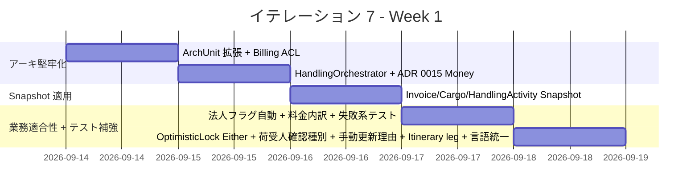
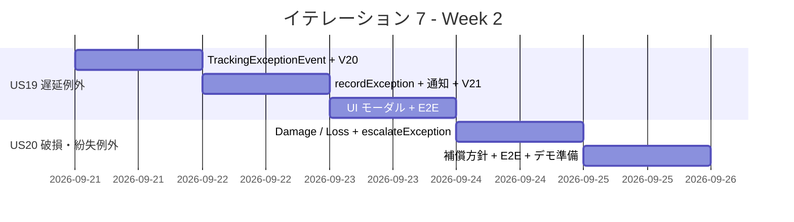
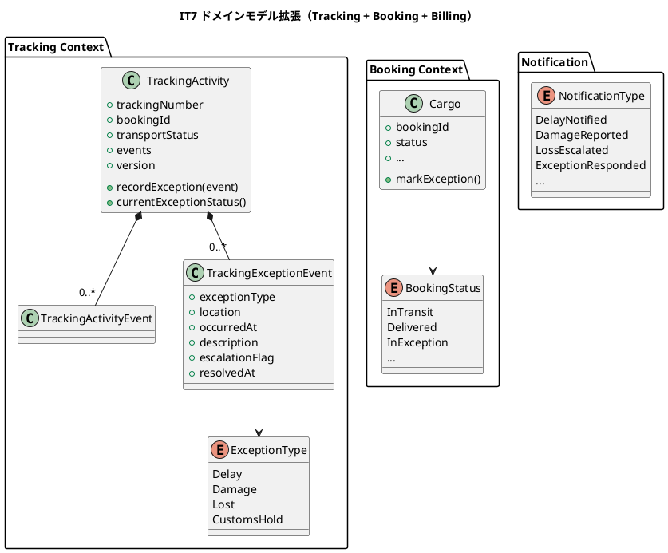
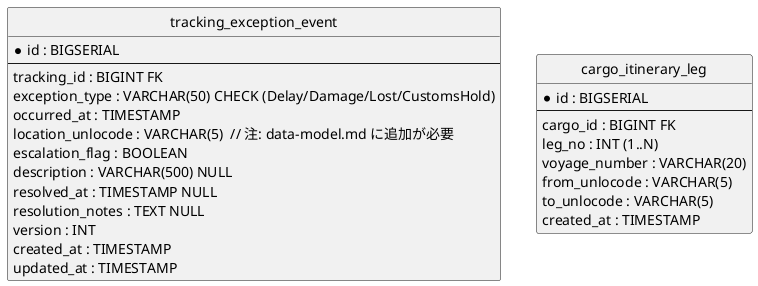
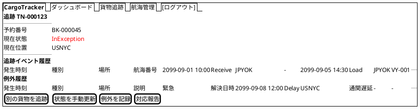
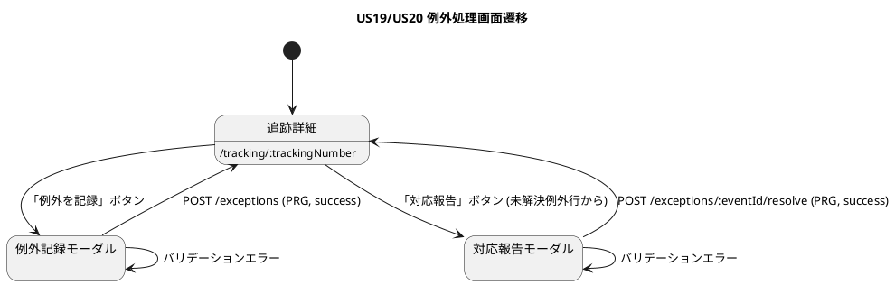

# イテレーション 7 計画

## 概要

| 項目 | 内容 |
|------|------|
| **イテレーション** | IT7 |
| **期間** | Week 13-14（2026-09-14 〜 2026-09-27、計画 2 週間 / AI ペアプロ実績は 1〜2 日想定） |
| **ゴール** | US19 遅延例外 + US20 破損・紛失例外 を実装し例外管理機能を完成、IT6 developing-review 高優先 8 件 + IT5 申し送り 3 件 + ADR 0014 Snapshot ADT 適用を冒頭で解消し Release 2.0 GA 基盤を整える |
| **目標 SP** | 12（US19: 6 + US20: 6） |

---

## ゴール

### イテレーション終了時の達成状態

1. **例外管理機能 (Phase 4 1/2)**: 遅延・破損・紛失の 3 種類例外を記録 → 貨物状態「例外発生」に遷移 → 荷主通知 → 対応報告まで一気通貫
2. **アーキテクチャ堅牢化**: ArchUnit が新規 4 コンテキスト (billing/handling/tracking/notification) を境界検査対象とし、Billing → Booking 直結を BillingCargoQueryPort 経由に分離、HandlingOrchestrator で単一 DB.localTx 境界化
3. **集約 reconstruct の Snapshot ADT 化 (ADR 0014)**: Invoice / Cargo / HandlingActivity の reconstruct を Snapshot 引数 1 個に統一し SonarQube MAJOR Code Smell 4 件解消
4. **業務適合性修正**: 請求書発行で法人フラグ自動判定、請求書詳細に料金内訳表示、荷受人確認を種別+値の 2 フィールド構成、手動更新に理由欄追加 + Tracker ロール限定

### 成功基準

- [ ] US19/US20 受け入れ基準を全て満たす
- [ ] IT6 developing-review 高優先 8 件全て解消（H1〜H8）
- [ ] IT5 未消化申し送り 3 件解消（0.2 H6 / 0.3 H3 / 0.10 O3）
- [ ] ADR 0014 Snapshot ADT を Invoice / Cargo / HandlingActivity に適用
- [ ] ArchUnit が 9 コンテキストすべてを検査対象とし 5/5 緑
- [ ] SonarQube MAJOR Code Smell 0 件、Coverage 80% 以上維持
- [ ] Playwright E2E 全件 PASS + US19/US20 E2E 追加（3 件以上）

---

## ユーザーストーリー

### 対象ストーリー

| ID | ユーザーストーリー | SP | 優先度 |
|----|-------------------|----|----|
| US19 | 遅延例外を処理する | 6 | 必須 |
| US20 | 破損・紛失例外を処理する | 6 | 必須 |
| **合計** | | **12** | |

### ストーリー詳細

#### US19: 遅延例外を処理する

> **追跡管理者として**、輸送中に遅延が発生した場合、例外種別「遅延」として記録し、荷主への通知と対応内容を管理したい。なぜなら、遅延情報を速やかに荷主に伝え、対応策（代替ルート等）を迅速に提示できるからだ。

**受入条件**:

1. 追跡番号と例外種別「遅延」・発生状況（場所・日時・理由）を記録できる
2. 記録後、貨物状態が「例外発生」(`InException`) に更新される
3. 荷主に遅延発生の通知が送信される
4. 対応内容（新しい到着予定日・対応方針）を入力して荷主に対応報告を送信できる
5. 例外対応履歴が記録される

#### US20: 破損・紛失例外を処理する

> **追跡管理者（または荷役作業員）として**、輸送中に破損または紛失が発生した場合、例外種別「破損」または「紛失」として記録し、関係者に緊急通知を送りたい。なぜなら、重大な例外は即座に全関係者に共有し、保険手続き・補償対応・代替措置を迅速に開始できるからだ。

**受入条件**:

1. 追跡番号と例外種別「破損」または「紛失」・発生状況を記録できる
2. 記録後、貨物状態が「例外発生」(`InException`) に更新される
3. 例外種別「紛失」の場合、緊急フラグが設定されて管理職への escalation 通知が送信される
4. 荷主に破損・紛失発生の通知が送信される
5. 対応内容（補償方針等）を入力して荷主に報告を送信できる

---

### タスク

#### 0. IT6 申し送り（developing-review 高優先 8 件 + IT5 未消化 3 件 + ADR 適用）

| # | タスク | 見積もり | 状態 |
|---|--------|---------|------|
| 0.1 | ArchUnit `contexts` に billing/handling/tracking/notification を追加し境界違反を可視化（H1） | 2h | [ ] |
| 0.2 | `BillingCargoQueryPort` (Billing 側 trait) + Booking 側 ACL アダプター実装、`BillingCommandService` の Cargo 直接結合を解消（H2 / IT5 申し送り 0.2 部分流用） | 5h | [ ] |
| 0.3 | `HandlingOrchestrator` (Application Service) を新設し、Handling 登録 + Tracking event 追記 + Booking 通知 + completeDelivery を単一 `DB.localTx` で実行（H3 / IT5 申し送り 0.3）。`HandlingController` の Claim 連結を Orchestrator 呼出に置換 | 6h | [ ] |
| 0.4 | ADR 0015 起票「Billing は単通貨 JPY、shared.domain.Money に一本化」+ `BillingMoney` 削除、`shared.domain.Money` に `multiplyByRate` extension を追加（H4） | 4h | [ ] |
| 0.5 | ADR 0014 Snapshot ADT 適用: `Invoice.Snapshot` 新設 → `ScalikeJdbcInvoiceRepository` リファクタ | 3h | [ ] |
| 0.6 | ADR 0014 Snapshot ADT 適用: `Cargo.Snapshot` 新設 → `ScalikeJdbcCargoRepository` + 関連テストリファクタ | 4h | [ ] |
| 0.7 | ADR 0014 Snapshot ADT 適用: `HandlingActivity.Snapshot` + `RegisterRequest` 新設 → Repository + CommandService リファクタ | 4h | [ ] |
| 0.8 | 請求書発行 UI から法人フラグ手入力欄を削除、`BillingShipperId` を Booking 経由で荷主属性 (`Shipper.shipperType`) から自動判定（H5） | 4h | [ ] |
| 0.9 | 請求書詳細画面に料金内訳（距離料金 / 重量料金 / 貨物種別料金）を表示、`PricingService.calculateActual` で `invoice_line_item` を生成しテーブル永続化（H6 / IT8 US22 前倒し候補） | 6h | [ ] |
| 0.10 | `PricingService.calculateActual` の失敗系テスト追加（無効ルート / 単価未登録 / 計算オーバーフロー）（H7） | 2h | [ ] |
| 0.11 | `TrackingCommandService.updateStatus` の `OptimisticLockException` を `Either[String, _]` に畳み込み、UI に「他のユーザーが更新したため再読込してください」を表示（H8） | 3h | [ ] |
| 0.12 | 荷役登録 UI: 荷受人確認を「種別 (署名 / 受領印 / 身分証 / コード) + 値」の 2 フィールド構成に変更、`HandlingActivity` に `recipientConfirmationType` 追加 + Flyway V18（M6） | 4h | [ ] |
| 0.13 | 追跡詳細の手動更新モーダルに「更新理由」必須フィールド追加 + `Role.Tracker / MasterAdmin` 限定でボタン表示制御（M7） | 3h | [ ] |
| 0.14 | `Itinerary` に leg 詳細（from/to UnLocode）追加し `HandlingCommandService.register` で routeDeviation を正式判定（O3 / IT5 申し送り 0.10）。Flyway V19 で `cargo_itinerary_leg` テーブル新設 | 5h | [ ] |
| 0.15 | ユビキタス言語統一: `DeliveryCompleted` (ドメイン) / 「引取作業」(UI) / 「配送完了」(通知) を「荷主視点 = 引取済」「社内視点 = 配送完了」で整理し view 文言を統一（M10） | 2h | [ ] |
| 0.16 | SonarQube 再スキャン + Quality Gate 確認、MAJOR Code Smell 0 件達成を ADR 0014 ステータス更新で記録 | 2h | [ ] |

**小計**: 59h

#### 1. US19 遅延例外処理（6 SP）

| # | タスク | 見積もり | 状態 |
|---|--------|---------|------|
| 1.1 | Tracking Context 拡張: `TrackingExceptionEvent` エンティティ新設（domain-model.md L 準拠: `exceptionType: ExceptionType` / `location: TrackingLocation` / `occurredAt` / `description: Option[String]` / `escalationFlag: Boolean` / `resolvedAt: Option[Instant]`）、`ExceptionType` enum (Delay / Damage / Lost / CustomsHold) + `TrackingActivity.addException` / `resolveException` / `hasActiveException` / `TrackingStatus.InException` 導出ロジック | 5h | [ ] |
| 1.2 | Flyway V20: `tracking_exception_event` テーブル（data-model.md 準拠: `tracking_id` FK / `exception_type VARCHAR(50)` CHECK / `occurred_at` / `escalation_flag BOOLEAN` / `description VARCHAR(500)` / `resolved_at` / `resolution_notes TEXT` / 監査）+ ※location は IT7 で `location_unlocode` カラム追加し data-model.md にも反映 | 2h | [ ] |
| 1.3 | `TrackingCommandService.recordException(RecordExceptionCommand)` 実装: 楽観ロック付き、TrackingStatus を `currentStatus()` 経由で `InException` 導出 | 4h | [ ] |
| 1.4 | `BookingCommandService.logDelayNotification` + `NotificationType.DelayNotified` + `NotificationPayload.DelayNotified` (新到着予定日 / 対応方針 / 理由) | 3h | [ ] |
| 1.5 | Flyway V21: `notification_log` CHECK 拡張（`DelayNotified` / `DamageReported` / `LossEscalated` / `ExceptionResponded` 4 種追加） | 1h | [ ] |
| 1.6 | 追跡詳細画面 (`/tracking/:trackingNumber`) に「例外を記録」ボタン + モーダル（例外種別 Delay/Damage/Lost/CustomsHold / 場所 / 日時 / description）+ 「対応報告」ボタン + モーダル（resolution_notes）+ POST `/tracking/:trackingNumber/exceptions` / POST `.../exceptions/:eventId/resolve` ルート追加 (CSRF formField 必須) | 5h | [ ] |
| 1.7 | E2E + ユニットテスト（遅延記録 → InException 遷移 → DelayNotified ログ → 対応報告 → ExceptionResponded ログ） | 4h | [ ] |

**小計**: 24h

#### 2. US20 破損・紛失例外処理（6 SP）

| # | タスク | 見積もり | 状態 |
|---|--------|---------|------|
| 2.1 | `ExceptionType.Damage` / `ExceptionType.Lost` (domain-model 命名準拠) を `TrackingExceptionEvent` シナリオに展開（US19 1.1 と統合済）、`Lost` 時の `escalationFlag = true` ロジック | 3h | [ ] |
| 2.2 | `BookingCommandService.escalateException` 実装: `Lost` 時に管理職 (`Role.MasterAdmin`) 向け escalation 通知 + `NotificationType.LossEscalated` ログ | 4h | [ ] |
| 2.3 | 追跡詳細画面の「例外を記録」モーダルで Damage / Lost を選択可能化、Lost 選択時に「緊急対応フラグ」表示 | 3h | [ ] |
| 2.4 | 補償方針入力フォーム（`resolution_notes` 永続化）+ `NotificationPayload.DamageReported` / `LossEscalated` 通知ペイロード | 4h | [ ] |
| 2.5 | E2E + ユニットテスト（破損記録 → InException 遷移 + DamageReported / 紛失記録 → escalationFlag + LossEscalated 管理職通知） | 4h | [ ] |

**小計**: 18h

#### タスク合計

| カテゴリ | SP | 理想時間 |
|---------|----|----|
| IT6 申し送り（0.x） | - | 59h |
| US19 遅延例外処理 | 6 | 24h |
| US20 破損・紛失例外処理 | 6 | 18h |
| **合計** | **12** | **101h** |

**1 SP あたり**: 約 8.4h（IT6 申し送り含む / 機能タスクのみなら 3.5h）
**進捗率**: 0% (0/12 SP)

> **IT7 スコープ外で IT8 / IT9 へ申し送り**:
>
> - US22 法人割引適用ロジック（割引内訳の請求書詳細表示は 0.9 で部分実装）
> - US23 支払い確認 + 精算処理
> - US10 経路条件再算出（IT9 予備）
> - SonarQube MAJOR 4 件以外の中長期コード品質改善（重複や複雑度）

---

## スケジュール

### Week 1（Day 1-5）

| 日 | タスク |
|----|--------|
| Day 1 | 0.1 ArchUnit 拡張 / 0.2 BillingCargoQueryPort + ACL |
| Day 2 | 0.3 HandlingOrchestrator + 単一 DB.localTx / 0.4 ADR 0015 Money 統一 |
| Day 3 | 0.5-0.7 Snapshot ADT 適用 (Invoice / Cargo / HandlingActivity) |
| Day 4 | 0.8 法人フラグ自動 / 0.9 料金内訳 + invoice_line_item / 0.10 PricingService 失敗系テスト |
| Day 5 | 0.11 OptimisticLock Either / 0.12 荷受人確認種別 + V18 / 0.13 手動更新理由 + Tracker 限定 / 0.14 Itinerary leg + V19 / 0.15 言語統一 / 0.16 SonarQube 再スキャン |

### Week 2（Day 6-10）

| 日 | タスク |
|----|--------|
| Day 6 | 1.1 TrackingExceptionEvent + ExceptionType / 1.2 V20 |
| Day 7 | 1.3 recordException 楽観ロック / 1.4 DelayNotified 通知 / 1.5 V21 CHECK 拡張 |
| Day 8 | 1.6 追跡詳細 UI モーダル / 1.7 US19 E2E + ユニットテスト |
| Day 9 | 2.1 Damage/Loss + 緊急フラグ / 2.2 escalateException / 2.3 UI 拡張 |
| Day 10 | 2.4 補償方針 + 通知 / 2.5 US20 E2E + 統合テスト + デモ準備 |

---

## 設計

### ドメインモデル（拡張）

### データモデル（追加分）

### ユーザーインターフェース（追加分）

#### ビュー: 追跡詳細画面 (`/tracking/:trackingNumber`) 拡張

#### インタラクション

- フィードバック: 成功 = `alert-success`, バリデーション失敗 = `alert-danger`, 警告 (Lost 緊急フラグ) = `alert-warning`
- htmx パターン: 例外履歴セクションは追跡タイムラインと同様に `hx-trigger="every 30s"` で部分更新
- ロール制御: Tracker / MasterAdmin のみ「例外を記録」「対応報告」ボタン表示 (`@if(roles.contains(Role.Tracker) || roles.contains(Role.MasterAdmin))`)

### 主要 API（追加分）

| メソッド | エンドポイント | 説明 |
|---------|---------------|------|
| POST | `/tracking/:trackingNumber/exceptions` | 例外記録（種別 / 場所 / 日時 / description）。ui_design.md L82 で「追跡詳細画面の管理者機能」として定義済みの動作の REST 表現 |
| POST | `/tracking/:trackingNumber/exceptions/:eventId/resolve` | 対応報告 + `resolved_at` / `resolution_notes` 永続化 |
| GET | `/tracking/:trackingNumber` | 詳細画面に例外履歴 + escalationFlag 表示 (ui_design.md L82 拡張) |

### ADR

| ADR | タイトル | ステータス |
|-----|---------|-----------|
| [ADR-0014](../adr/0014-aggregate-snapshot-adt.md) | 集約 Snapshot ADT 導入 | 提案 → IT7 で承認予定 |
| ADR-0015 | Billing 単通貨 JPY、`shared.domain.Money` 一本化 | 0.4 で起票 |
| ADR-0016（候補） | コンテキスト間 Orchestrator パターン | 0.3 の HandlingOrchestrator 実装と並行検討 |

---

## リスクと対策

| リスク | 影響度 | 対策 |
|--------|--------|------|
| Snapshot ADT 適用時に既存テストが大量破壊される | 中 | 各集約ごとに 1 コミット単位で進め、テスト更新→緑→次集約のリズム維持。`@deprecated` 旧 API を一時並存 |
| HandlingOrchestrator 抽出で Controller 経由フローが壊れる | 高 | E2E 36 件を回帰テストとして必ず実行、Orchestrator は既存 4 操作の順序を保ったまま単一 localTx に包む |
| `cargo_itinerary_leg` 追加で既存 cargo データの整合性問題 | 中 | NULL 許容で導入し、新規予約のみ leg を持つ。既存予約は `Itinerary.voyageNumbers` から best-effort で生成 |
| US19/US20 の例外処理が複雑化し SP 超過 | 高 | 受け入れ条件最小実装で着地、緊急フラグ詳細制御は IT8 へ申し送り可 |
| ArchUnit 拡張で既存違反が大量検出される | 中 | 0.1 で違反一覧を取得し、0.2/0.3 で構造修正、残りは ADR で許容範囲を明文化 |

---

## 完了条件

### Definition of Done

- [ ] コードレビュー完了（self-review）
- [ ] Unit テスト全件 PASS（261+ 件 + 例外関連 10 件以上追加）
- [ ] Playwright E2E 全件 PASS（36+ 件 + US19/US20 で 3 件以上追加）
- [ ] Testcontainers IT 全件 PASS（Invoice 楽観ロック IT 追加で 3 件以上）
- [ ] scalafmt / scalafix 緑
- [ ] ArchUnit 5/5 緑（新コンテキスト 4 つ追加後）
- [ ] SonarQube Quality Gate ✅ OK / MAJOR Code Smell 0 件 / Coverage 80% 以上
- [ ] Flyway V18-V21 適用済
- [ ] ADR 0014 承認 + ADR 0015 起票
- [ ] developing-review 正式実施（XP 5 エージェント並列）

### デモ項目

1. **アーキ堅牢化**: ArchUnit で 9 コンテキスト全てが境界検査対象、HandlingOrchestrator 経由で Claim 登録時の単一 DB.localTx 動作
2. **Snapshot ADT**: Invoice / Cargo / HandlingActivity の `reconstruct(snapshot)` API デモ、SonarQube MAJOR 0 件
3. **業務適合性**: 法人荷主の予約から請求書発行 → 自動で割引率反映 → 料金内訳 (基本料金 / 重量料金 / 距離料金 / 貨物種別料金) 表示
4. **US19 遅延例外**: 追跡詳細 → 例外記録 → InException 遷移 → 荷主通知 → 対応報告
5. **US20 破損・紛失例外**: 紛失記録 → 緊急フラグ → 管理職 escalation 通知 → 補償方針入力

---

## 関連ドキュメント

- [IT6 ふりかえり](./retrospective-6.md)
- [IT6 完了報告書](./iteration_report-6.md)
- [IT6 実装レビュー (developing-review)](../review/it6_implementation_review_20260623.md)
- [ADR 0014 集約 Snapshot ADT 導入](../adr/0014-aggregate-snapshot-adt.md)
- [リリース計画](./release_plan.md)

---

## 更新履歴

| 日付 | 更新内容 | 更新者 |
|------|---------|--------|
| 2026-06-23 | IT7 計画策定（US19 + US20 + IT6 申し送り 16 件、Phase 4 着手、Release 2.0 GA 基盤整備） | AI Agent |
