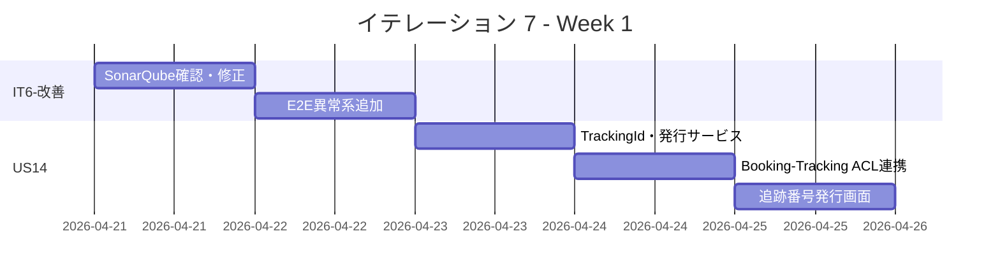
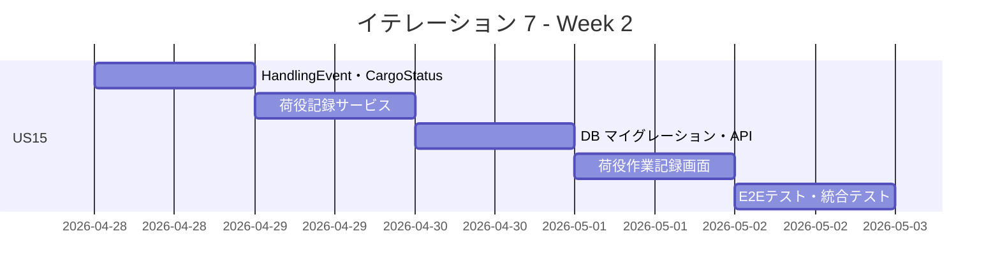
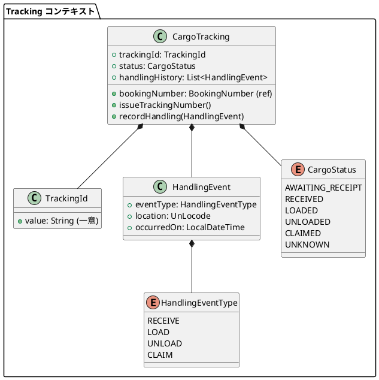
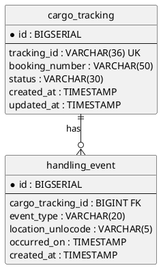
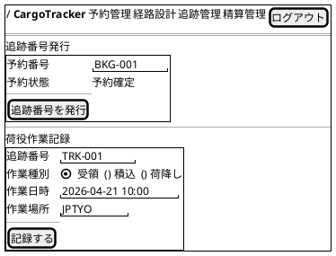
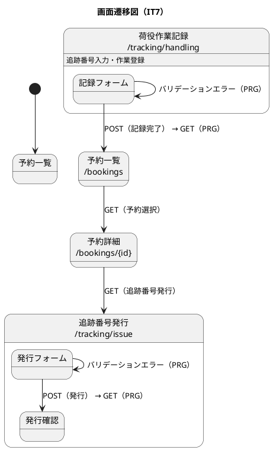

# イテレーション 7 計画

## 概要

| 項目 | 内容 |
|------|------|
| **イテレーション** | 7 |
| **期間** | Week 13-14（2026-04-21 〜 2026-05-04） |
| **ゴール** | IT6 申し送り事項を解消し、追跡番号発行と荷役作業記録の基盤を構築する |
| **目標 SP** | 10 |

---

## ゴール

### イテレーション終了時の達成状態

1. **IT6-改善完了**: SonarQube Quality Gate を確認し、E2E テストの異常系シナリオ（OVERDUE・バリデーションエラー）を追加する
2. **US14 完了**: 「予約確定」状態の予約に対して一意の追跡番号が発行され、貨物状態が「受領待ち」に設定される
3. **US15 完了**: 追跡番号で貨物を特定し、作業種別・日時・場所を登録すると貨物状態が自動更新される

### 成功基準

- [ ] SonarQube Quality Gate が PASS している
- [ ] E2E 異常系シナリオ（OVERDUE・バリデーションエラー）が追加されている
- [ ] 「予約確定」状態の予約に追跡番号を発行できる
- [ ] 追跡番号は一意に採番される
- [ ] 発行後、貨物状態が「受領待ち」に設定される
- [ ] 追跡番号で貨物を特定して作業を記録できる
- [ ] 記録後、貨物状態が対応する状態（受領済・積込済・荷降し済）に更新される
- [ ] テストカバレッジ 80% 以上

---

## ユーザーストーリー

### 対象ストーリー

| ID | ユーザーストーリー | SP | 優先度 |
|----|-------------------|----|--------|
| IT6-改善 | IT6 申し送り事項対応（SonarQube + E2E 異常系） | 2 | 必須 |
| US14 | 追跡番号を発行する | 3 | 必須 |
| US15 | 荷役作業を記録する | 5 | 必須 |
| **合計** | | **10** | |

### ストーリー詳細

#### IT6-改善: IT6 申し送り事項対応

**対応内容**:

- T1: SonarQube Quality Gate の確認・未解決イシューの対応
- T2: E2E テストの異常系シナリオ追加（OVERDUE・バリデーションエラー）
- T4: htmx フラグメントを `th:fragment` で実装（優先度中、時間があれば）

#### US14: 追跡番号を発行する

**ストーリー**:
> 経路設計者として、確定した予約に対して一意の追跡番号を発行し、荷主に通知したい。なぜなら、荷主が追跡番号を使って輸送状況をいつでも確認できるようになるからだ。

**受入条件**:

- [ ] 「予約確定」状態の予約に対して追跡番号を発行できる
- [ ] 追跡番号は一意に採番される
- [ ] 発行後、貨物状態が「受領待ち」に設定される
- [ ] 荷主に追跡番号と追跡方法をメール通知する

#### US15: 荷役作業を記録する

**ストーリー**:
> 荷役作業員として、追跡番号を入力して貨物を特定し、作業種別・日時・場所を登録したい。なぜなら、荷役作業完了が即座に貨物状態に反映され、荷主がリアルタイムで確認できるからだ。

**受入条件**:

- [ ] 追跡番号の入力で貨物を特定できる
- [ ] 作業種別（受領・積込・荷降し）を選択できる
- [ ] 作業日時と作業場所（UN/LOCODE 形式）を入力できる
- [ ] 記録後、貨物状態が対応する状態（受領済・積込済・荷降し済）に自動更新される
- [ ] 記録後、荷主に状態変更通知が送信される
- [ ] 追跡番号が存在しない場合、エラーメッセージが表示される
- [ ] 作業場所が予定ルートと異なる場合、警告が表示される

### タスク

#### 1. IT6-改善（2 SP）

| # | タスク | 見積もり | 担当 | 状態 |
|---|--------|---------|------|------|
| 1.1 | SonarQube スキャン実行・Quality Gate 確認 | 1h | - | [ ] |
| 1.2 | SonarQube 指摘事項の修正（Critical/Major） | 2h | - | [ ] |
| 1.3 | E2E 異常系シナリオ追加（billing.spec.ts の OVERDUE フロー） | 2h | - | [ ] |
| 1.4 | E2E バリデーションエラーシナリオ追加 | 1h | - | [ ] |

**小計**: 6h（理想時間）

#### 2. US14: 追跡番号を発行する（3 SP）

| # | タスク | 見積もり | 担当 | 状態 |
|---|--------|---------|------|------|
| 2.1 | Tracking コンテキスト: `TrackingId` 値オブジェクト実装（TDD） | 2h | - | [ ] |
| 2.2 | Tracking コンテキスト: `TrackingNumber` 発行サービス実装（TDD） | 2h | - | [ ] |
| 2.3 | Booking → Tracking: 追跡番号発行イベント連携（ACL ポート） | 2h | - | [ ] |
| 2.4 | Tracking コントローラ: 追跡番号発行 API エンドポイント実装 | 1h | - | [ ] |
| 2.5 | Thymeleaf: 追跡番号発行画面実装 | 1h | - | [ ] |
| 2.6 | E2E テスト: 追跡番号発行シナリオ作成 | 2h | - | [ ] |

**小計**: 10h（理想時間）

#### 3. US15: 荷役作業を記録する（5 SP）

| # | タスク | 見積もり | 担当 | 状態 |
|---|--------|---------|------|------|
| 3.1 | Tracking コンテキスト: `HandlingEvent`・`HandlingEventType` 値オブジェクト実装（TDD） | 2h | - | [ ] |
| 3.2 | Tracking コンテキスト: `CargoStatus` 集約（受領済・積込済・荷降し済）実装（TDD） | 2h | - | [ ] |
| 3.3 | Tracking コンテキスト: 荷役記録アプリケーションサービス実装（TDD） | 2h | - | [ ] |
| 3.4 | DB マイグレーション: `handling_event` テーブル作成（Flyway V11） | 1h | - | [ ] |
| 3.5 | 荷役作業記録 API エンドポイント実装 | 1h | - | [ ] |
| 3.6 | Thymeleaf: 荷役作業記録画面（作業種別選択・場所入力）実装 | 2h | - | [ ] |
| 3.7 | E2E テスト: 荷役作業記録シナリオ（受領・積込・荷降し）作成 | 2h | - | [ ] |
| 3.8 | E2E テスト: 異常系シナリオ（追跡番号不在・場所不一致警告）作成 | 1h | - | [ ] |

**小計**: 13h（理想時間）

#### タスク合計

| カテゴリ | SP | 理想時間 | 状態 |
|---------|----|----|------|
| IT6-改善 | 2 | 6h | [ ] |
| US14 追跡番号発行 | 3 | 10h | [ ] |
| US15 荷役作業記録 | 5 | 13h | [ ] |
| **合計** | **10** | **29h** | |

**1 SP あたり**: 約 2.9h
**進捗率**: 0% (0/10 SP)

---

## スケジュール

### Week 1（Day 1-5）



| 日 | タスク |
|----|--------|
| Day 1 | IT6-改善: SonarQube 確認・修正 |
| Day 2 | IT6-改善: E2E 異常系シナリオ追加 |
| Day 3 | US14: TrackingId・発行サービス実装（TDD） |
| Day 4 | US14: Booking → Tracking ACL 連携 |
| Day 5 | US14: 追跡番号発行画面・E2E テスト |

### Week 2（Day 6-10）



| 日 | タスク |
|----|--------|
| Day 6 | US15: HandlingEvent・CargoStatus 実装（TDD） |
| Day 7 | US15: 荷役記録アプリケーションサービス実装 |
| Day 8 | US15: DB マイグレーション・API エンドポイント実装 |
| Day 9 | US15: 荷役作業記録画面実装 |
| Day 10 | US15: E2E テスト作成・統合テスト・バグ修正・デモ準備 |

---

## 設計

### ドメインモデル



### データモデル



### ユーザーインターフェース

#### ビュー



#### インタラクション



### ディレクトリ構成

```
apps/backend/src/main/java/.../
├── tracking/
│   ├── domain/
│   │   ├── model/
│   │   │   ├── cargo/
│   │   │   │   ├── CargoTracking.java          (集約ルート)
│   │   │   │   ├── TrackingId.java             (値オブジェクト)
│   │   │   │   └── CargoStatus.java            (列挙型)
│   │   │   └── handling/
│   │   │       ├── HandlingEvent.java           (値オブジェクト)
│   │   │       └── HandlingEventType.java       (列挙型)
│   │   └── service/
│   │       └── TrackingNumberIssuer.java        (ドメインサービス)
│   ├── application/
│   │   └── TrackingApplicationService.java
│   └── infrastructure/
│       └── persistence/
│           └── JpaCargoTrackingRepository.java
```

### API 設計

| メソッド | エンドポイント | 説明 |
|---------|---------------|------|
| POST | /tracking/issue | 追跡番号を発行する |
| POST | /tracking/handling | 荷役作業を記録する |
| GET | /tracking/{trackingId} | 追跡情報を照会する（US18 で実装） |

---

## リスクと対策

| リスク | 影響度 | 対策 |
|--------|--------|------|
| Tracking コンテキストの新規作成による工数増 | 高 | IT6 の Billing コンテキスト作成の経験を活かす |
| Booking → Tracking の ACL 設計が複雑 | 中 | 既存の Routing ACL パターンを参考にする |
| 荷役作業と貨物状態の整合性 | 中 | ドメインイベントで状態遷移を管理する |

---

## 完了条件

### Definition of Done

- [ ] コードレビュー完了
- [ ] ユニットテストがパス（Java テスト数 > 272 件）
- [ ] E2E テストがパス（E2E テスト数 > 67 件）
- [ ] SonarQube Quality Gate PASS
- [ ] 機能がローカル環境で動作確認済み
- [ ] ドキュメント更新完了

### デモ項目

1. SonarQube Quality Gate PASS の確認
2. 「予約確定」状態の予約から追跡番号を発行
3. 追跡番号で貨物を特定して荷役作業（受領・積込・荷降し）を記録
4. 各作業後に貨物状態が正しく更新されることを確認

---

## 更新履歴

| 日付 | 更新内容 | 更新者 |
|------|---------|--------|
| 2026-04-10 | 初版作成 | - |

---

## 関連ドキュメント

- [イテレーション 7 ふりかえり](./retrospective-7.md)
- [イテレーション 7 完了報告書](./iteration_report-7.md)
- [イテレーション 6 計画](./iteration_plan-6.md)
- [イテレーション 6 ふりかえり](./retrospective-6.md)
- [リリース計画](./release_plan.md)
