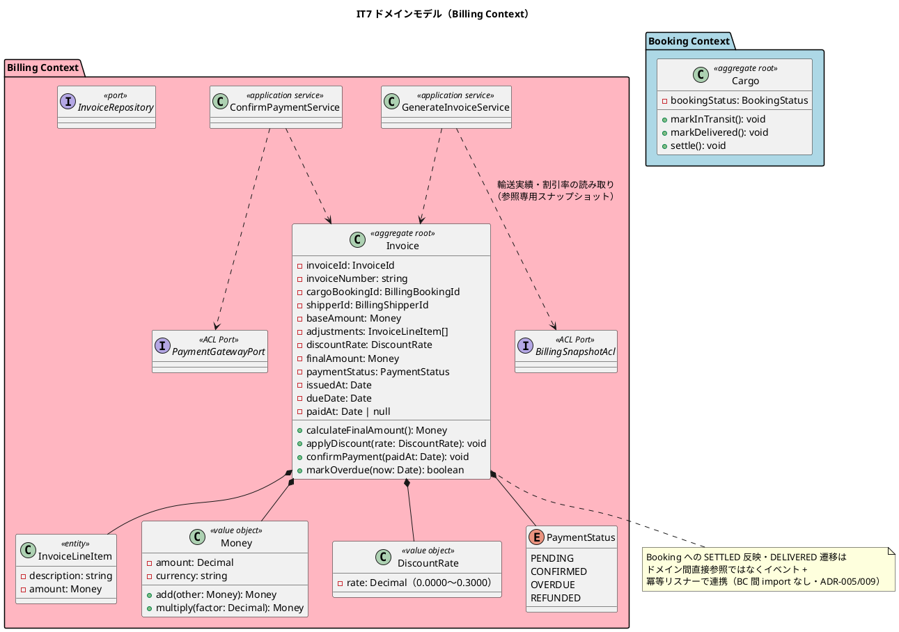
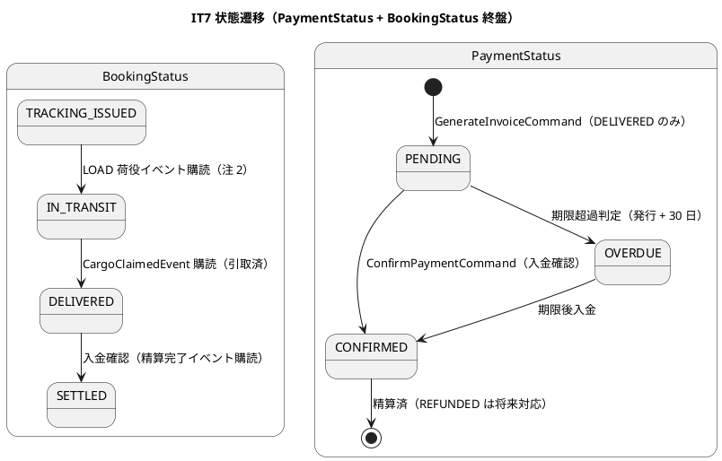
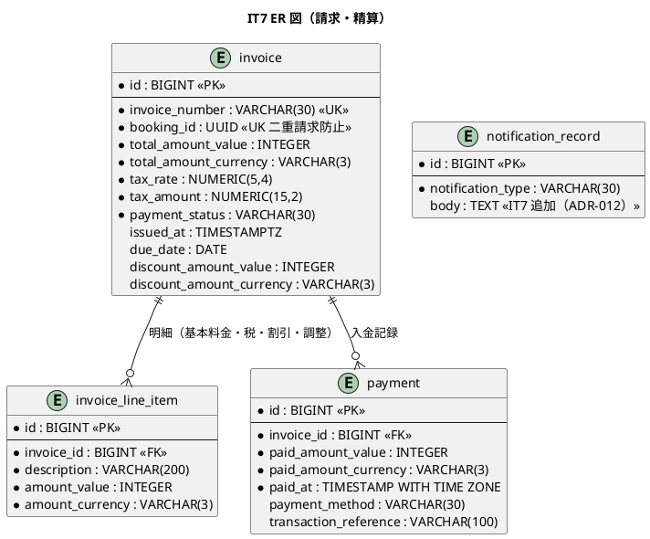
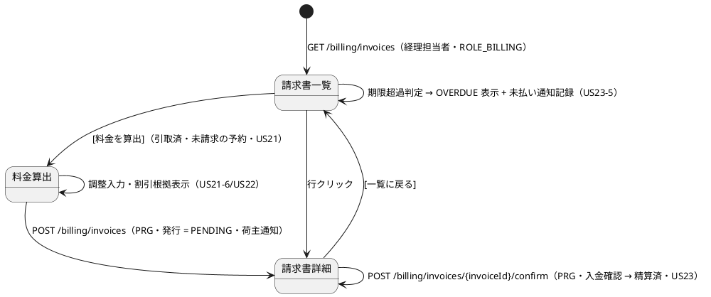

# イテレーション 7 計画

## 概要

| 項目 | 内容 |
|------|------|
| **イテレーション** | 7（最終） |
| **期間** | 2026-10-19 〜 2026-11-01（計画 Week 13-14） |
| **局面** | 終盤（アウトサイドイン）継続 |
| **ゴール** | 引取済の貨物に対する料金算出 → 法人割引 → 精算書発行 → 入金確認 → 精算完了までを完成させ、業務フロー全体（予約 → 経路 → 荷役 → 追跡 → 精算）が一気通貫で動作する Release 1.0 に到達する |
| **目標 SP** | 8 |
| **実績** | 8 SP（進捗率 100%）。単体・統合テスト 573 件 green、Playwright E2E 8 件 passed、受け入れ E2E（`invoice-generation` 7 件・`release-1-0-demo` 全業務フロー通し）green。CI・SonarQube Quality Gate はクローズ時確定 |

---

## ゴール

### イテレーション終了時の達成状態

1. **輸送料金算出（US21）**: 経理担当者が「引取済」の予約に対して輸送実績（経路・重量・貨物種別・荷役実績）を確認しながら基本料金を自動計算し、例外発生時は料金調整（減額・補償費用）を入力して確定できる。
2. **法人割引（US22）**: 法人荷主は契約割引率（0〜30%）が自動取得・適用され、割引根拠（割引率・基本料金・割引後料金）が精算書の明細に記載される。個人荷主は割引なし。
3. **精算処理（US23）**: 確定料金から精算書（請求番号・請求金額・支払期限 = 発行 + 30 日）を発行し荷主へメール通知。決済機関（`PaymentGatewayPort` スタブ）で入金確認すると精算状態が「精算済」になり、予約状態も SETTLED へ遷移する。期限超過は OVERDUE となり経理担当者へ未払い通知が記録される。
4. **予約ライフサイクル完結**: `CargoClaimedEvent`（IT5 の精算開始点）の購読で BookingStatus が DELIVERED へ遷移し、精算完了で SETTLED に到達（9 状態のライフサイクル完結）。
5. **IT6 Try 返済**: 認証境界の fail-closed 化（ADR-011）、通知の所有・本文設計（ADR-012・種別の型化・荷主に届く本文）、CUSTOMS_HOLD 冪等キーの業務判断を完了する。
6. **Release 1.0**: 業務フロー全体のデモ E2E が green で、リリース条件（全テスト・カバレッジ目標・セキュリティチェックリスト）を満たす。

### 成功基準

- [x] `US21` / `US22` / `US23` の受入基準をテストで 1:1 に確認する。
- [x] 終盤方針どおり、精算の業務シナリオ受け入れテスト（引取済 → 算出 → 割引 → 発行 → 入金 → 精算済）を先に書く（アウトサイドイン）。
- [x] 経路×コマンドマトリクスに**並行経路の状態合成列**を含めて設計節に明記する（IT6 Try T1。例: 未払い OVERDUE 中の入金確認、例外未解決中の料金算出）。
- [x] 割引率 0〜30% の境界値（0%・30%・30% 超）と金額計算（Decimal・端数）を test.each で網羅する（テスト戦略の境界値方針）。
- [x] 認証境界を fail-closed（グローバルガード + `@Public()`）へ反転し、公開ページの回帰がないことを E2E で確認する（IT6 Try T2・ADR-011）。
- [x] 通知種別を union 型化し、通知本文（金額・期限等）が荷主へ届く形で記録される（IT6 Try T3・ADR-012）。
- [x] `npm run verify`・CI・SonarQube Quality Gate が green / PASS である（クローズ時確定: 597 tests green・CI success・SonarQube PASS＝新規カバレッジ 92.1%・重複 0.44%・新規違反 0）。
- [x] Release 1.0 リリース条件: カバレッジ（ドメイン 85% / アプリケーション 80% / 全体 75%）とセキュリティチェックリスト（認可マトリクス・CSRF・情報露出・fail-closed）を DoD で確認する。

---

## ユーザーストーリー

### 対象ストーリー

| ID | ユーザーストーリー | SP | 優先度 | 対応 UC |
|----|-------------------|----|--------|---------|
| US21 | 輸送料金を算出する | 3 | 中 | UC17 |
| US22 | 法人割引を適用する | 2 | 中 | UC17 |
| US23 | 精算を処理する | 3 | 中 | UC18 |
| **合計** | | **8** | | |

### ストーリー詳細

#### US21: 輸送料金を算出する

**ストーリー**:
> 経理担当者として、配送完了した予約に対して輸送実績（経路・重量・貨物種別・荷役実績）をもとに輸送料金を算出したい。なぜなら、実際の輸送内容に基づく正確な料金を算出し、精算に進めるからだ。

**受入条件**:

1. 「引取済」状態の予約に対して料金算出を開始できる。
2. 輸送実績（経路・距離・重量・貨物種別・荷役作業実績）が表示される。
3. 基本料金が自動計算される。
4. 算出結果を確認して確定操作ができる。
5. 確定後、輸送料金が「確定」状態で登録される。
6. 例外（遅延・破損等）が発生している場合、料金調整（減額・補償費用）の入力ができる。

#### US22: 法人割引を適用する

**ストーリー**:
> 経理担当者として、法人荷主の場合に、契約割引率を基本料金に自動適用して割引後の請求金額を確定したい。なぜなら、法人契約条件に基づく正確な割引を自動化し、手計算ミスを防ぐからだ。

**受入条件**:

1. 荷主種別が「法人」の場合、料金算出時に契約割引率が自動的に取得・表示される。
2. 割引率（0〜30%）が基本料金に適用され、割引後の金額が表示される。
3. 個人荷主の場合は割引が適用されない。
4. 割引計算の根拠（割引率・基本料金・割引後料金）が精算書に記載される。

#### US23: 精算を処理する

**ストーリー**:
> 経理担当者として、確定した輸送料金をもとに精算書を発行し、荷主への通知・入金確認・精算完了処理を行いたい。なぜなら、精算業務を一元管理し、入金状況を追跡して確実に精算を完了できるからだ。

**受入条件**:

1. 「確定」状態の輸送料金をもとに精算書（請求番号・請求金額・支払い期限）を発行できる。
2. 精算書が荷主にメール通知される。
3. 決済機関との連携により入金確認ができる。
4. 入金確認後、精算状態が「精算済」に更新され予約状態も「精算済」になる。
5. 支払い期限超過時、経理担当者に未払い通知が送信される。

### タスク

#### 1. IT6 Try 返済・基盤調整（0 SP）

| # | タスク | 見積もり | 担当 | 状態 |
|---|--------|---------|------|------|
| 1.1 | 認証境界の fail-closed 化: ADR-011 起票のうえ、グローバル `APP_GUARD`（AuthenticatedGuard）+ `@Public()` デコレータによる明示公開へ反転。公開ページ・ヘルスチェック・ログインの回帰 E2E（IT6 Try T2） | 6h | - | [x] |
| 1.2 | 通知の所有・本文設計: ADR-012 起票（notification_record の所有 BC・通知種別の union 型化・本文カラム追加）。migration で `notification_record.body` を追加し、既存通知（例外・報告・エスカレーション）と精算通知に本文を載せる（IT6 Try T3） | 8h | - | [x] |
| 1.3 | CUSTOMS_HOLD 冪等キーと「2 件目の同種例外」の業務判断: ユーザー代表視点で判断を確定し、CUSTOMS_HOLD は（種別 + 申告番号）キーへ変更。同種例外の 2 件目破棄は「解決 → 再登録」の運用と合わせて ADR-012 に記録（IT6 Try T5・レビュー tester 3 / architect 3） | 4h | - | [x] |
| 1.4 | CustomsHeldEvent クラスの二重定義解消（契約 interface へ一本化）と発生日時の未来日ガード（荷役・例外・手動更新の入力に共通適用）（IT6 レビュー architect L8 / user L8） | 4h | - | [x] |

**小計**: 22h（理想時間）

#### 2. Billing ドメイン: Invoice 集約・料金計算・DB（US21/US22 の基盤、3 SP）

| # | タスク | 見積もり | 担当 | 状態 |
|---|--------|---------|------|------|
| 2.1 | `Money` 値オブジェクト（Decimal・通貨・add/multiply・端数処理）と `DiscountRate`（0〜30% 検証）の単体テスト（test.each 境界値: 0%・30%・30% 超・負額） | 6h | - | [x] |
| 2.2 | `Invoice` 集約（`InvoiceId`・`BillingBookingId`・`BillingShipperId.isCorporate()`・`PaymentStatus`・`calculateFinalAmount()`・`applyDiscount()`・`confirmPayment()`・`markOverdue()`）と遷移規則（PENDING → CONFIRMED / OVERDUE → CONFIRMED、REFUNDED は将来） | 8h | - | [x] |
| 2.3 | 料金計算: 基本料金 = 距離係数 × 重量(kg) × 貨物種別係数（GENERAL 1.0 / HAZARDOUS 1.8 / REFRIGERATED 1.5）。距離係数は旅程の所要日数から導出する（注 3）。**請求金額 = (基本料金 + 調整 − 割引) + 消費税（tax_rate 10%・tax_amount を invoice に保持）**。例外調整（減額・補償費用）・基本料金・税・割引根拠（割引率）は明細（invoice_line_item）で表現 | 6h | - | [x] |
| 2.4 | migration 010: `invoice`・`invoice_line_item`・`payment`（data-model 準拠）。`InvoiceRepository` ポート + Kysely 実装（pg-mem 統合テスト） | 6h | - | [x] |

**小計**: 26h（理想時間）

#### 3. 料金算出・割引（US21/US22、5 SP 相当のうち画面/フロー）

| # | タスク | 見積もり | 担当 | 状態 |
|---|--------|---------|------|------|
| 3.1 | 受け入れテスト先行: 引取済 → 料金算出（実績表示）→ 例外調整 → 法人割引 → 確定の業務シナリオを HTTP フローで記述 | 6h | - | [x] |
| 3.2 | Booking の状態遷移メソッド追加（`Cargo.markInTransit()` / `markDelivered()` / `settle()`・遷移規則の単体テスト）と購読リスナー: LOAD 荷役イベント購読で IN_TRANSIT、`CargoClaimedEvent` 購読で DELIVERED へ遷移する冪等リスナー（注 2） | 8h | - | [x] |
| 3.3 | `GenerateInvoiceCommand`: 輸送実績（経路・重量・種別・荷役実績・未解決/解決済み例外）を Billing 固有の読み取り ACL で取得し、基本料金 + 調整 + 法人割引（shipper の契約割引率を ACL 取得）で Invoice を PENDING 発行 | 8h | - | [x] |
| 3.4 | 請求書一覧 `/billing/invoices`（プレースホルダを実画面化。引取済で未請求の予約一覧 + 料金算出開始・ステータスフィルタ）・料金算出画面（実績表示・調整入力・割引根拠表示・確定 PRG）。ダッシュボードの「未払い請求」カード（ROLE_BILLING のみ・OVERDUE 件数）を実データで配線し、ロール別表示検証と既存 nav-items テストの green 維持を含める | 10h | - | [x] |

**小計**: 28h（理想時間）

#### 4. 精算処理（US23、3 SP）

| # | タスク | 見積もり | 担当 | 状態 |
|---|--------|---------|------|------|
| 4.1 | 精算書発行: 請求番号採番・支払期限（発行 + 30 日）・荷主へのメール通知（本文に請求金額・期限。ADR-012 の本文設計を利用） | 6h | - | [x] |
| 4.2 | 入金確認: `PaymentGatewayPort`（スタブ ACL・nock 契約テスト方針に従う）で入金照会 → `confirmPayment()` → `payment` レコード生成（金額・入金日時・決済手段・取引参照）+ 精算済 + `cargo.booking_status = SETTLED` 遷移（イベント経由・冪等） | 8h | - | [x] |
| 4.3 | 期限超過: 一覧表示・照会時に期限超過を判定して OVERDUE 更新 + 経理担当者へ未払い通知記録（判定タイミングは注 4）。請求書詳細 `/billing/invoices/{invoiceNumber}`（明細・割引根拠・支払確認・PRG） | 8h | - | [x] |
| 4.4 | Release 1.0 デモ E2E: 予約 → 経路 → 確定 → 追跡番号 → 荷役（受領・積込・通関・引取）→ 料金算出（割引・調整）→ 精算書発行 → 入金確認 → SETTLED の全業務フロー通し | 8h | - | [x] |

**小計**: 30h（理想時間）

#### タスク合計

| カテゴリ | SP | 理想時間 | 状態 |
|---------|----|----------|------|
| IT6 Try 返済・基盤調整 | 0 | 22h | [x] |
| Billing ドメイン・DB | 3 | 26h | [x] |
| 料金算出・割引（US21/US22） | 2 | 30h | [x] |
| 精算処理（US23） | 3 | 30h | [x] |
| **合計** | **8** | **108h** | [x] |

**1 SP あたり**: 約 13.5h（Try 返済 22h と Release 1.0 デモ E2E を含む。ストーリー分のみでは 84h ≒ 10.5h/SP。バッファ 2 週が控えるため最終 IT はやや厚めの計画とする）

---

## スケジュール

### Week 1（2026-10-19 〜 2026-10-25）

| 日 | タスク |
|----|--------|
| Day 1 | ADR-011 起票 + fail-closed 化（Try T2） |
| Day 2 | ADR-012 起票 + 通知本文・種別型化（Try T3）、CUSTOMS_HOLD 冪等キー（Try T5） |
| Day 3 | `Money` / `DiscountRate` / `Invoice` 集約の Red-Green |
| Day 4 | 料金計算・明細・migration 010・Repository |
| Day 5 | 受け入れテスト先行 → CargoClaimedEvent 購読（DELIVERED 遷移） |

### Week 2（2026-10-26 〜 2026-11-01）

| 日 | タスク |
|----|--------|
| Day 6 | `GenerateInvoiceCommand`・実績 ACL・法人割引（US21/US22） |
| Day 7 | 請求書一覧・料金算出画面 |
| Day 8 | 精算書発行・荷主通知・入金確認（US23） |
| Day 9 | 期限超過 OVERDUE・未払い通知・請求書詳細 |
| Day 10 | Release 1.0 デモ E2E、セキュリティチェックリスト、`npm run verify`・SonarQube、設計同期 |

---

## 設計

### 経路×コマンドマトリクス（並行経路の状態合成列付き・IT6 Try T1）

| 状態 | 変更経路 | 不変条件 / 冪等性 | 並行経路の状態合成 |
|------|---------|------------------|--------------------|
| BookingStatus = IN_TRANSIT | ①LOAD 荷役イベント購読 | TRACKING_ISSUED からのみ。重複配信は同値遷移で冪等 | 例外（EXCEPTION）中でも Booking 側遷移は独立に進む（Tracking の表示状態とは別軸） |
| BookingStatus = DELIVERED | ②CargoClaimedEvent 購読 | 引取済（CLAIM 登録成功）が唯一の発生源。重複配信は同値遷移で冪等 | 未解決例外が残っていても DELIVERED 遷移は可（料金調整で例外を扱う。注 5） |
| Invoice 発行（PENDING） | ③GenerateInvoiceCommand（画面） | DELIVERED の予約のみ・booking_id UNIQUE で二重請求を DB でも防止 | 発行後に例外が解決されても再計算しない（発行時点の実績で確定） |
| PaymentStatus = CONFIRMED / SETTLED | ④入金確認（POST /billing/invoices/{invoiceId}/confirm + PaymentGatewayPort） | PENDING / OVERDUE からのみ。SETTLED 遷移はイベント経由で冪等 | OVERDUE 判定（⑤）と入金確認（④）が並行しても、入金確認が常に優先（CONFIRMED は終端） |
| PaymentStatus = OVERDUE | ⑤期限超過判定（一覧・照会時） | PENDING かつ期限超過のみ。判定は何度実行しても同値（冪等）。未払い通知は初回遷移時のみ | 入金確認済み（CONFIRMED）には適用しない |

### ドメインモデル

出典: [domain-model.md](../design/domain-model.md) Billing Context（Invoice / Money / DiscountRate / PaymentStatus・ビジネスルール 1〜4・料金計算ロジック）、Booking Context（BookingStatus 9 値）、[development_strategy.md](development_strategy.md) 終盤方針。`InvoiceLineItem`・`markOverdue`・`BillingSnapshotAcl` は実装都合の追補（注 1）。

### 状態遷移図

出典: [domain-model.md](../design/domain-model.md) Billing ビジネスルール 1〜4・Booking ビジネスルール 4。REFUNDED（返金）は本 IT ではスコープ外（注 6）。

### データモデル

出典: [data-model.md](../design/data-model.md) `invoice`・`invoice_line_item` 定義（migration 010 で作成）。`notification_record.body` は ADR-012 の本文設計で追加する（注 1）。`booking_id` の BC 間参照は DB FK を張らない方針に従う。

### ユーザーインターフェース

#### 画面遷移図

出典: [ui_design.md](../design/ui_design.md) 請求書一覧・請求書詳細・精算フロー・ロール別到達性（請求管理 = ROLE_BILLING）・PRG パターン。料金算出画面（`/billing/invoices/new?bookingId=` 等）の URL は ui_design 未定義のため本 IT で追補する（注 1）。

---

## リスクと対策

| リスク | 影響 | 対策 |
| :--- | :--- | :--- |
| fail-closed 反転で既存の認証不要経路（公開追跡・ログイン・ヘルスチェック・静的アセット）が壊れる | 高 | `@Public()` の付与漏れを既存 E2E 全件（公開ページ・ログインフロー・skeleton）で回帰確認してから後続タスクに進む |
| 金額計算の浮動小数点誤差・端数処理の不整合 | 高 | `decimal.js` を使用し（domain-model 方針）、端数規則（切り捨て/四捨五入）を Money に一元化。境界値 test.each で網羅 |
| 二重請求 | 高 | `invoice.booking_id` UNIQUE（DB）+ 集約/サービスの事前チェックの二層防御。重複発行テスト |
| Billing が Booking / Shipper / Tracking のドメイン型へ依存し BC 独立性が崩れる | 高 | 輸送実績・割引率は `BillingSnapshotAcl`（参照専用スナップショット。ADR-008 方針）で取得し、SETTLED / DELIVERED 遷移はイベント + 冪等リスナーで連携。dependency-cruiser の allowlist 更新を同一コミットで行う |
| 期限超過判定のタイミング設計（バッチ不在）で OVERDUE が意図せず多重通知になる | 中 | 判定は照会時トリガー + 「PENDING → OVERDUE の初回遷移時のみ通知」を集約で保証（markOverdue の戻り値）。マトリクスの合成列でテスト |
| 距離係数の算出根拠が設計未定義 | 中 | 旅程の所要日数ベースの簡易係数を注 3 で確定し、精緻化は運用フェーズへ。算出根拠を明細に記録して監査可能にする |
| 最終 IT でスコープ超過（引き継ぎ 10 件を抱え込む） | 中 | クローズ内対応は Try T2/T3/T5 + 軽量 2 件に限定し、残り（横断例外一覧・AFTER_COMMIT・ACL 返済等）は注 6 でスコープ外を明示しバッファ期間の判断とする |

---

## 注（設計への反映が必要）

1. **設計追補**: `InvoiceLineItem`（調整・割引根拠の明細）・`Invoice.markOverdue()`・`invoiceNumber` / `dueDate` フィールド・`BillingSnapshotAcl`・`notification_record.body`・料金算出画面の URL は設計ドキュメント未定義のため、実装と同時に domain-model（集約図・ACL Ports 表）・data-model・ui_design へ追補する。ドメイン → DB のマッピングは「`finalAmount` → `invoice.total_amount_*`」「割引額 → `invoice.discount_amount_*`」「基本料金・消費税・例外調整・割引根拠（割引率を含む説明行）→ `invoice_line_item`」「入金（paidAt・金額・決済手段）→ `payment` テーブル」とし、US22-4 の割引根拠（割引率・基本料金・割引後料金）は明細行として永続化・精算書に表示する。消費税は domain-model の料金計算ロジックに未記載のため「請求金額 = 割引後料金 + 消費税」を domain-model へ追記する。issued_at 等の型表記は `TIMESTAMP WITH TIME ZONE` に統一する（data-model 内の PlantUML 表記揺れも同期時に是正）。
2. **IN_TRANSIT / DELIVERED / SETTLED 遷移の発生源**: domain-model の BookingStatus 遷移順（TRACKING_ISSUED → IN_TRANSIT → DELIVERED → SETTLED）に対し、発生源を「IN_TRANSIT = LOAD 荷役イベント購読」「DELIVERED = CargoClaimedEvent 購読」「SETTLED = 入金確認イベント購読」と定める。domain-model のコマンド一覧（UpdateBookingStatusCommand）へこの対応を追記する。
3. **距離係数**: domain-model の料金式「距離係数 × 重量 × 貨物種別係数」の距離係数は設計未定義。本 IT では「旅程の所要日数（最終 unload − 最初 load の日数）× 単価」で導出する簡易式とし、算出根拠を明細に記録する。精緻化（港間距離マスタ等）は運用フェーズの判断として domain-model に注記する。
4. **期限超過判定のタイミング**: バッチ基盤がないため、請求書一覧・詳細の照会時に判定して OVERDUE へ更新し、初回遷移時のみ未払い通知を記録する（`markOverdue` の戻り値で通知要否を制御）。運用要件（定期バッチ化）は operation.md へ注記する。
5. **例外未解決と精算の関係**: US21-6 は例外の料金調整を要求するが、「未解決例外があっても DELIVERED / 精算に進めるか」は要件上明示がない。引取（CLAIM）が通関 CLEARED を前提とすることから、本 IT では「引取済なら精算可。未解決例外は料金調整の入力材料として表示」とし、精算ブロックはしない。この判断を domain-model のビジネスルールへ追記する。
6. **スコープ外の明示**: REFUNDED（返金）・追跡管理者の未解決例外横断一覧・荷役作業員の追跡番号起点例外登録・AFTER_COMMIT の transaction() 構造化・ACL 直読の共有スナップショット単一ソース化・POST 認可マトリクスの表駆動化・サービス層認可の単体テスト拡充・US17 通知種別分岐は本 IT では扱わず、Release 1.0 後のバッファ期間（2 週）の判断事項として retrospective へ引き継ぐ。
7. **InvoiceRequestedEvent / InvoiceCreatedEvent の扱い**: domain-model のイベント一覧は「DELIVERED 後に Booking が InvoiceRequestedEvent で請求書発行を依頼し、Billing が InvoiceCreatedEvent で通知配信」を定めるが、US21 の受入基準は経理担当者の**手動の料金算出・確定**を要求する。本 IT は「DELIVERED への遷移はイベント購読で自動、請求書発行は経理担当者の手動コマンド（GenerateInvoiceCommand）、発行後の荷主通知は通知ポート直接記録」とし、InvoiceRequestedEvent は発行候補の抽出（請求書一覧の「未請求」判定）に置き換え、InvoiceCreatedEvent は通知ポート呼び出しに吸収する。この差異を domain-model のドメインイベント一覧へ反映（両イベントを「IT7 実装判断で置換」と注記）する。
8. **ADR-011（認証 fail-closed）/ ADR-012（通知の所有と本文）**: 構造変更のため ADR を起票し、domain-model・architecture_backend の該当記述を同期する。ADR-012 では notification_record の所有（当面は共有インフラとして shared 配下の書き込みアダプタに集約し、Notification Context 分割は将来判断）・種別 union・本文設計・管理職エスカレーションの実効化（宛先設定値化）を決定する。

---

## 完了条件

### Definition of Done

- [x] `US21` / `US22` / `US23` の受入基準が単体・統合・E2E のいずれかで確認されている。
- [x] Release 1.0 デモ E2E（予約 → 経路 → 荷役 → 追跡 → 精算の全業務フロー）が green である。
- [x] 割引・金額計算の境界値が test.each で網羅されている（0% / 30% / 30% 超・端数）。
- [x] 二重請求防止（DB UNIQUE + サービス検証）がテストされている。
- [x] 経路×コマンドマトリクス（状態合成列付き）の全経路で不変条件・冪等性がテストされている。
- [x] IT6 Try T2（fail-closed・ADR-011）・T3（通知 ADR-012）・T5（CUSTOMS_HOLD 業務判断）が返済されている。
- [x] `npm run verify`・CI・SonarQube Quality Gate が green / PASS である（クローズ時確定: 597 tests green・CI success・SonarQube PASS）。
- [x] カバレッジ: ドメイン 85% / アプリケーション 80% / 全体 75% 以上（Release 1.0 リリース条件）。
- [x] セキュリティチェックリスト: fail-closed 認証・ロール別認可（BILLING 含む）・CSRF・公開ページの情報露出・エラーメッセージの情報漏えいを確認済み。
- [x] dependency-cruiser が green で、Billing の BC 独立性（ACL・イベント境界）が保たれている（新 BC の allowlist 更新を含む）。
- [x] `data-model.md` / `domain-model.md` / `ui_design.md` の IT7 差分（注 1〜5・7・8）が実装と同期している。
- [x] GitHub Project の IT7 Issue が開発着手時に In Progress へ更新できる状態になっている。

### デモ項目

- [x] 経理担当者が請求書一覧から引取済の予約を選び、輸送実績（経路・重量・種別・荷役実績・例外）を確認して基本料金の自動計算結果を見られる。
- [x] 例外が発生した貨物には料金調整（減額・補償費用）を入力でき、明細に記録される。
- [x] 法人荷主には契約割引率が自動適用され、割引根拠（割引率・基本料金・割引後料金）が精算書に記載される。個人荷主は割引なし。
- [x] 精算書（請求番号・請求金額・支払期限）を発行すると荷主へ通知（本文に金額・期限）が記録される。
- [x] 入金確認で精算状態が「精算済」になり、予約状態も SETTLED になる。
- [x] 支払期限を超過した請求は OVERDUE と表示され、経理担当者への未払い通知が初回のみ記録される。
- [x] 上記を含む Release 1.0 全業務フロー E2E が green である。

---

## 更新履歴

| 日付 | 変更内容 | 作成者 |
|------|----------|--------|
| 2026-07-30 | IT7 開始準備として初版作成 | Claude |
| 2026-07-30 | 詳細・横断整合性検証の指摘を反映（payment テーブル・消費税・/confirm 統一・ドメイン/DB マッピング・Cargo 遷移メソッドと IN_TRANSIT のタスク化・ダッシュボード未払いカード・InvoiceRequested/Created の扱い＝注 7） | Claude |
| 2026-07-30 | IT7 実装完了に伴い実績反映（全タスク完了・進捗率 100%・573 tests green・Playwright 8 passed・受け入れ E2E green）。CI/SonarQube はクローズ時確定として未チェック維持 | Claude |

## 関連ドキュメント

- [リリース計画](release_plan.md)
- [開発戦略](development_strategy.md)
- [イテレーション 6 ふりかえり](retrospective-6.md)
- [ユーザーストーリー](../requirements/user_story.md)
- [ドメインモデル](../design/domain-model.md)
- [データモデル](../design/data-model.md)
- [UI 設計](../design/ui_design.md)
- [IT6 実装レビュー](../review/IT6実装_review_20260730.md)
- [ADR-009 コミット後副作用](../adr/009-post-commit-side-effects.md)
- [ADR-010 通関申告の独立集約化](../adr/010-customs-declaration-aggregate.md)
