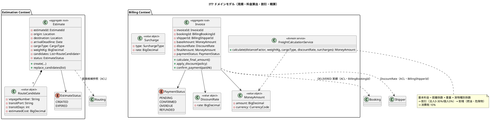
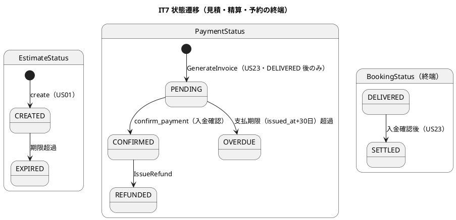
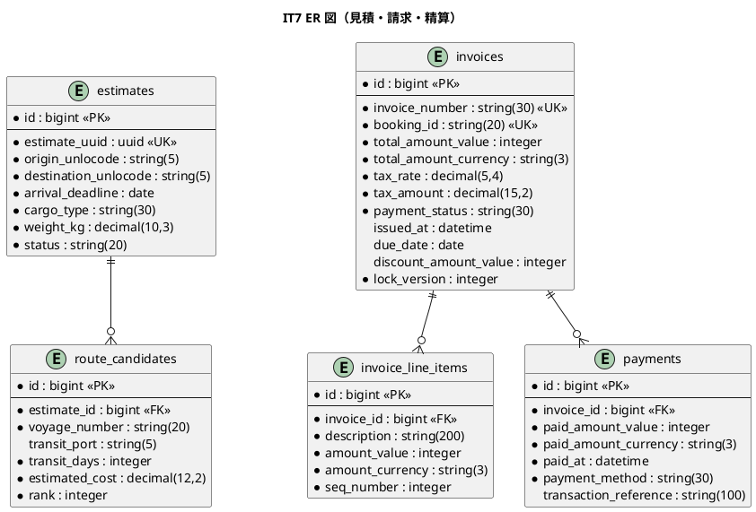
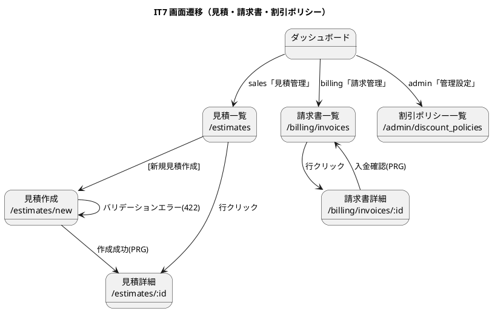

# イテレーション 7 計画 - 見積 + 料金算出 + 法人割引 + 精算

## ゴール

輸送見積作成（US01）から料金算出（US21）・法人割引（US22）・精算（US23）までの見積〜精算業務を終盤アウトサイドインで実装する。Estimation Context（`Estimate` 集約・`RouteCandidate` 永続化）と Billing Context（`Invoice` 集約・`FreightCalculationService`・`MoneyAmount`）を新設し、既存集約（Booking/Routing/Shipper）と業務シナリオ起点で結合する。Phase 4（見積・料金計算・精算）を完了して **Release 1.0** を発行する。

## 対象ストーリー

| US | 概要 | SP | BC | 対応 UC |
|:---|:-----|:--|:---|:--------|
| US01 | 輸送見積を作成する | 5 | Estimation | UC01 |
| US21 | 輸送料金を算出する | 5 | Billing | UC17 |
| US22 | 法人割引を適用する | 3 | Billing + Shipper | UC17 |
| US23 | 精算を処理する | 5 | Billing | UC18 |

（release_plan.md Phase 4 / IT7 と一致・計 18 SP。直近ベロシティ 14-15 SP を上回るため、リスクに緩和策を記載）

## 受入条件

[user_story.md](../requirements/user_story.md) の受け入れ基準に準拠（全文）。各基準はテストケースへ 1:1 マッピングする。通知送信を伴う基準は正・負の同値クラス（送る／送らない）を必ずテスト化する（IT6 Try T34）。

**US01 輸送見積を作成する**（として: 営業担当者）

- [ ] 出発地・目的地・希望期限・貨物種別・重量を入力できる
- [ ] 航海スケジュール情報をもとにルート概算候補が表示される
- [ ] ルート候補ごとに「経由港・所要日数・概算料金・航海番号」が表示される
- [ ] 見積情報が保存され、見積番号が発行される
- [ ] 希望期限に間に合うルートが存在しない場合、その旨が通知される
- [ ] 危険物が含まれる場合、危険物申告情報の入力フォームが表示される

**US21 輸送料金を算出する**（として: 経理担当者）

- [ ] 「引取済」（DELIVERED）状態の予約に対して料金算出を開始できる
- [ ] 輸送実績（経路・距離・重量・貨物種別・荷役作業実績）が表示される
- [ ] 基本料金が自動計算される（距離係数 × 重量 × 貨物種別係数 + 燃油サーチャージ + 消費税 10%）
- [ ] 算出結果を確認して確定操作ができる
- [ ] 確定後、輸送料金が「確定」状態で登録される
- [ ] 例外（遅延・破損等）発生時、料金調整（減額・補償費用）を入力できる

**US22 法人割引を適用する**（として: 経理担当者）

- [ ] 荷主種別「法人」の場合、料金算出時に契約割引率が自動取得・表示される
- [ ] 割引率（0〜30%）が基本料金に適用され割引後金額が表示される
- [ ] 個人荷主の場合は割引が適用されない
- [ ] 割引計算の根拠（割引率・基本料金・割引後料金）が精算書に記載される

**US23 精算を処理する**（として: 経理担当者）

- [ ] 「確定」状態の輸送料金をもとに精算書（請求番号・請求金額・支払い期限）を発行できる
- [ ] 精算書が荷主にメール通知される
- [ ] 決済機関との連携により入金確認ができる
- [ ] 入金確認後、精算状態が「精算済」（SETTLED）に更新され予約状態も「精算済」になる
- [ ] 支払い期限超過時、経理担当者に未払い通知が送信される

## タスク分解（アウトサイドイン）

終盤は業務シナリオ（見積→料金算出→割引→精算）を受け入れ／request spec で束ね、UI → アプリ → ドメイン → インフラの順で貫通する。ただし新設 2 BC はドメインの計算ロジックが複雑なため、`FreightCalculationService` など中核ドメインはユニットから固める（局面内の部分インサイドアウト）。

### 設計トピックの事前確定（IT6 Try・着手前に潰す）

> 実装着手前に以下の設計判断を確定し、実装と同一コミットで `docs/design/`・ADR へ反映する（[[feedback_scope-change-canon-sync]]）。

- [ ] 【命名統一】金額 VO を `MoneyAmount`（data-model・architecture 準拠）に一意化し domain-model の `Money` 表記を修正（ユビキタス言語の統一）
- [ ] 【ADR-0004 決定4】Routing の一時 `RouteCandidate`（IT3・非永続）と Estimation の永続 `RouteCandidate`（IT7）の統合方針を確定し ADR-0004 を更新（ACL 変換 or 共有の選択）
- [ ] 【T33】ドメイン集約の内部状態は永続化アダプタで再導出せず必ずカラムで永続化する設計ルールを開発ガイド／DoD に明文化（[[feedback_domain-state-no-rederivation]]）
- [ ] 【T36】例外解決のセマンティクス見直し（LOST は復帰でなく補償完了・CLAIMED 等終端での例外登録 precondition）を domain-model に反映（IT6 引き継ぎ・設計トピック）

### 負債返済枠（IT6 Try・序盤の独立コミット枠で先着手）

- [ ] 【T35】荷役冪等キー（`booking_id` + `event_type` + `event_completion_time` + `voyage_number`）に DB unique index を張り `RecordNotUnique` を捕捉（アプリ層 `duplicate?` は保険に残す・並行 POST の最終防衛）
- [ ] 【T37】遅延対応の新到着予定日を構造化し公開追跡の推定到着日へ反映（現状 `resolution_notes` 自由テキスト・[[feedback_scope-change-canon-sync]]）

### データ層（estimates・billing 系・5 テーブル新規）

- [ ] `estimates` migration（`estimate_uuid` UK・origin/destination_unlocode・arrival_deadline・cargo_type・weight_kg・status DEFAULT 'CREATED'）
- [ ] `route_candidates` migration（`estimate_id` FK CASCADE・voyage_number・transit_port・transit_days・estimated_cost・rank）
- [ ] `invoices` migration（`invoice_number` UK・`booking_id` UK（二重請求防止）・total_amount_value/currency・tax_rate DEFAULT 0.1・tax_amount・payment_status・issued_at・due_date・discount_amount_*・`lock_version` 楽観ロック）
- [ ] `invoice_line_items` migration（`invoice_id` FK・description・amount_value/currency・seq_number）
- [ ] `payments` migration（`invoice_id` FK・paid_amount_value/currency・paid_at・payment_method・transaction_reference）

### ドメイン層（Estimation Context・Billing Context）

- [ ] Estimation 値オブジェクト: `EstimateId`（UUID・`generate`）・`RouteCandidate`（voyage_number/transit_port/transit_days/estimated_cost・不変・妥当性検証）・`CargoType`（GENERAL/HAZARDOUS/REFRIGERATED・Booking と同値）・`EstimateStatus`（CREATED/EXPIRED）のユニット spec
- [ ] `Estimate`（集約ルート・`create`・`reconstruct`・`replace_candidates`・origin≠destination・weight_kg 正・候補妥当性のビジネスルール）のユニット spec
- [ ] Billing 値オブジェクト: `InvoiceId`・`BillingBookingId`・`BillingShipperId`（`corporate?`）・`MoneyAmount`（amount/currency・`add`/`multiply`）・`DiscountRate`（0〜30%・境界値 -1/0/30/31）・`DiscountPolicy`（`calculate_rate`）・`Surcharge`（HAZARDOUS_HANDLING/FUEL・`apply`）・`PaymentStatus`（PENDING/CONFIRMED/OVERDUE/REFUNDED）のユニット spec
- [ ] **`FreightCalculationService`**（ドメインサービス・中核・インサイドアウトで先に固める）: 基本料金＝距離係数 × 重量 × 貨物種別係数（GENERAL 1.0/HAZARDOUS 1.8/REFRIGERATED 1.5）→ 割引適用（法人 0〜30%・個人 0%）→ 割増加算（燃油・危険物）→ 消費税 10%。境界値・計算例（基本 100,000 → 法人 10% → 90,000・税 9,000・合計 99,000）をユニットで網羅
- [ ] `Invoice`（集約ルート・`calculate_final_amount`・`apply_discount`・`confirm_payment`（PENDING 以外は例外）・DELIVERED 後のみ発行・支払期限 issued_at+30 日超過で OVERDUE）のユニット spec

### アプリケーション（ユースケース・ACL・イベント）

- [ ] `CreateEstimate` ユースケース（US01・入力から Estimate 生成→ルート候補算出（Routing 参照・スタブ／ACL）→`route_candidates` 永続化→見積番号発行→期限内候補なしは通知）
- [ ] `CalculateFreight` ユースケース（US21/US22・DELIVERED 予約の輸送実績を Booking/Handling 公開 API（ACL）経由で取得→`FreightCalculationService` で算出→法人割引は Shipper の `DiscountRate` を ACL 取得→確定で Invoice を PENDING 登録）
- [ ] `SettleInvoice` ユースケース（US23・精算書発行→`invoice_created` 発行で荷主通知→`PaymentGatewayPort`（ACL・WebMock）で入金確認→CONFIRMED→BookingStatus SETTLED 同期→期限超過は経理へ未払い通知）
- [ ] ACL: Estimation→Routing（経路候補参照）・Billing→Booking（`CargoSnapshot` 相当・DELIVERED 実績）・Billing→Shipper（`DiscountRate`）。BC 独立性は ADR-0003 越境識別子・公開 API 経由（Packwerk privacy）
- [ ] `invoice_created` 購読ハンドラ（Billing→通知）: 荷主へ精算書発行通知・未払い通知（正負の同値をテスト・T34）

### UI（見積・請求書・割引ポリシー）

- [ ] 見積: `GET /estimates`（index）・`GET /estimates/new`（new・危険物時に申告フォーム動的表示 Stimulus）・`POST /estimates`（create・PRG）・`GET /estimates/:id`（show・ルート候補一覧）※routes に create 追加
- [ ] 請求書: `GET /billing/invoices`（index）・`GET /billing/invoices/:id`（show・料金明細・割引根拠）・`POST /billing/invoices/:id/confirm`（confirm・入金確認）※routes に confirm 追加。料金算出開始（US21）の導線
- [ ] 割引ポリシー（admin・US22 関連）: `admin/discount_policies` の index/new/create/edit/update/disable ※routes に admin 名前空間追加（ui_design L191）。※MVP はスコープ調整可（US22 は Shipper の discount_rate 参照で満たせるため、割引ポリシー管理画面は最小限）
- [ ] ナビゲーション整合・ロール別到達性 system spec: 営業（sales）→見積管理、経理（billing）→請求管理（ui_design ナビ・ダッシュボード・検証テストの 4 点一致・[[feedback_navigation-integrity-check]]・[[feedback_role-entry-navigation]]）
- [ ] 受入基準の UI 挙動（危険物申告動的表示・割引根拠表示・料金明細）を実装 DoD に含め、プレースホルダ残存を機械的に検出（T31 継続）

### E2E（終盤シナリオ結合）

- [ ] 業務シナリオ E2E（見積作成 → 料金算出 → 法人割引 → 精算完了）を Capybara + Playwright の system spec で束ねる（終盤アウトサイドインの受け入れ基準）

## スケジュール

| Week | 主な作業 |
|:-----|:---------|
| Week 13 | **設計トピック確定（命名・ADR-0004・T33/T36）＋負債返済（T35 unique index・T37 新到着予定日）を序盤の独立コミットで先着手** → estimates/route_candidates/invoices/invoice_line_items/payments migration → Estimation/Billing 値オブジェクト・`FreightCalculationService`（インサイドアウトで中核を固める）・Estimate/Invoice 集約のユニット spec → US01 見積作成（作成→候補算出→保存・PRG） |
| Week 14 | US21 料金算出（DELIVERED 実績 ACL・FreightCalculation・確定）→ US22 法人割引（Shipper DiscountRate ACL・個人は非適用）→ US23 精算（invoice_created 通知・PaymentGatewayPort WebMock・CONFIRMED→SETTLED・未払い通知）→ UI・ナビ導線 → 業務シナリオ E2E の green 化、品質ゲート（SonarQube 含む）→ **Release 1.0 発行**（Phase 4 完了） |

## 設計（IT7 スコープに絞った 4 図）

### ドメインモデル図（Estimation Context + Billing Context）

### 状態遷移図（EstimateStatus・PaymentStatus・BookingStatus SETTLED）

### ER 図（IT7 スコープ・5 テーブル新規）

### 画面遷移図（IT7 スコープ）

## リスク

| リスク | 対策 |
|--------|------|
| 18 SP は直近ベロシティ（14-15）を上回る | US22（法人割引・3SP）は Shipper の `discount_rate` 参照で満たせるため割引ポリシー管理画面（admin）を MVP スコープ調整。中核（US01/US21/US23）を優先し、超過分は明示的にスコープ調整として記録（ごまかさない） |
| 新設 2 BC をゼロから起こす複雑さ | `FreightCalculationService` など中核ドメインをインサイドアウトで先に固め、業務シナリオ E2E で上位結合。既存の packs 構成・ACL・イベントパターンを踏襲 |
| 金額計算の誤り（消費税・割引・割増の順序） | domain-model の計算手順（基本→割引→割増→税）をユニットで境界値網羅。`MoneyAmount` は最小通貨単位 integer で丸め誤差を排除 |
| BC 独立性（Billing が Booking/Shipper 内部に依存） | ACL（`BillingBookingId`/`BillingShipperId`・ADR-0003）と公開 API 経由に限定。Packwerk privacy で検証 |
| `PaymentGatewayPort` 外部連携の不確実性 | WebMock 契約テスト（正常 CONFIRMED・失敗 402）。OVERDUE 遷移はドメイン層が担当し外部応答に依存しない |
| Money/MoneyAmount 命名不整合 | 着手前に `MoneyAmount` へ一意化し domain-model を修正（設計トピック事前確定） |

## 設計への反映が必要（validating 検証で確定予定）

1. **金額 VO 命名統一**: domain-model `Money` → `MoneyAmount`（data-model・architecture 準拠）へ一意化。
2. **ADR-0004 決定4**: Routing 一時 `RouteCandidate` と Estimation 永続 `RouteCandidate` の統合方針を確定・ADR 更新。
3. **T33 状態再導出禁止ルール**の開発ガイド／DoD への明文化。
4. **T36 例外解決セマンティクス**（LOST 補償完了・終端での例外登録 precondition）の domain-model 反映。
5. **ルーティング追加**: `estimates#create`・`billing/invoices#confirm`・`admin/discount_policies`（現行 routes.rb 未定義・ui_design が要求）。
6. **invoice_created イベント**を「将来連携」から「IT7 実装」へ（domain-model・architecture_backend）。
7. **BookingStatus SETTLED 遷移**契機（US23 入金確認後）の domain-model 明記。

## Definition of Done

- [x] US01/US21/US22/US23 の受け入れ基準を満たす ※US23 受入基準5「支払期限超過の未払い通知」は OVERDUE 遷移（ドメイン）まで実装済みで駆動バッチが未実装・US21 受入基準6「料金調整（減額・補償）」は未実装 → IT8 引き継ぎ（正直に記録）
- [x] 業務シナリオ E2E（料金算出→法人割引→精算完了→予約 SETTLED 同期）が green
- [x] `FreightCalculationService`（貨物種別係数・割引・割増・消費税 10%・境界値）・`Estimate`/`Invoice` 集約・`DiscountRate` 境界値（-1/0/30/31）のユニット spec が green
- [x] 通知（invoice_created/invoice_settled）の正・負の同値クラスを検証（T34）
- [x] `bundle exec rspec`（397 examples）全 green / rubocop（0）/ brakeman（0）/ bundler-audit（0）/ packwerk（privacy 0）green・**CI success**
- [x] ドメイン層カバレッジ 85% 以上・全体 96.01%（新規 94.4%）
- [x] **SonarQube Quality Gate PASS**（違反 0・重複 0.0%・新規カバレッジ 94.4%）
- [x] BC 独立性: Estimation/Billing が Routing/Booking/Shipper の内部集約に依存せず ACL・ADR-0003 越境識別子・公開 API 経由のみ（Packwerk privacy）
- [x] ナビゲーション整合・ロール別到達性（sales→見積管理、billing→請求管理）の system spec green・4 点一致
- [x] 上記「設計への反映が必要」の 7 点を `docs/design/`・ADR に反映済み（Money→MoneyAmount 命名統一・invoice イベント・ADR-0004 決定4）
- [x] 負債返済枠 T35（荷役冪等 unique index）を消化 ※T37（新到着予定日構造化）は IT8 引き継ぎ
- [x] 設計トピック（命名統一・ADR-0004）を確定・反映済み ※T36（例外解決セマンティクス）は IT8
- [x] **Release 1.0 を発行**（Phase 4 完了・`ruby/take-1/v1.0.0`）→ 発行済み（CI success・タグ・GitHub Release）

## デモ項目（イテレーションレビュー）

1. 営業担当者が出発地・目的地・期限・貨物種別・重量を入力して見積を作成すると、ルート候補（経由港・所要日数・概算料金・航海番号）が表示され見積番号が発行される。
2. 危険物を含む見積では危険物申告フォームが動的表示される。期限内候補がない場合はその旨が通知される。
3. 経理担当者が引取済（DELIVERED）予約の料金を算出すると、基本料金＋燃油サーチャージ＋消費税 10% が自動計算され、確定で「確定」状態になる。
4. 法人荷主では契約割引率（0〜30%）が自動適用され割引後金額と割引根拠が表示される。個人荷主では割引されない。
5. 確定料金から精算書を発行すると荷主へ通知され、決済機関連携で入金確認すると精算済（SETTLED）になり予約も精算済になる。支払期限超過時は未払い通知が送られる。

## 更新履歴

| 日付 | 更新内容 | 更新者 |
|------|---------|--------|
| 2026-07-29 | 初版作成（IT7: 見積 US01・料金算出 US21・法人割引 US22・精算 US23・Estimation/Billing Context 新設・FreightCalculationService・Phase 4 完了で Release 1.0） | - |

## 関連ドキュメント

- [リリース計画](release_plan.md)
- [開発戦略](development_strategy.md)（終盤アウトサイドイン・IT7）
- [イテレーション 6 ふりかえり](retrospective-6.md)（Try T33-T37）
- [イテレーション 6 計画](iteration_plan-6.md)（例外処理・状態復帰の永続化）
- [ユーザーストーリー](../requirements/user_story.md)（US01・US21・US22・US23）
- [ドメインモデル](../design/domain-model.md)（Estimation / Billing Context・FreightCalculationService）
- [データモデル](../design/data-model.md)（estimates/route_candidates/invoices/invoice_line_items/payments）
- [UI 設計](../design/ui_design.md)（見積・請求書・割引ポリシー）
- [ADR-0002](../adr/0002-domain-events-and-notification.md)（ドメインイベント駆動通知）
- [ADR-0003](../adr/0003-cross-context-identifier-and-acl.md)（越境識別子・ACL）
- [ADR-0004](../adr/0004-us08-route-candidate-bc-placement.md)（US08 経路候補の BC 帰属・IT7 で統合方針確定）
