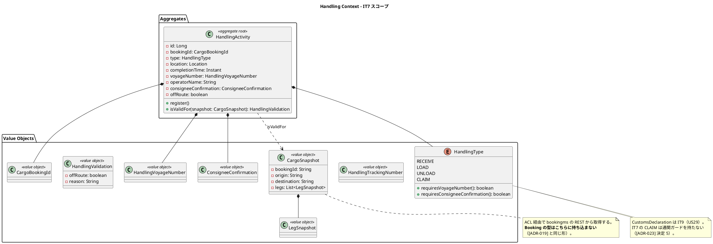
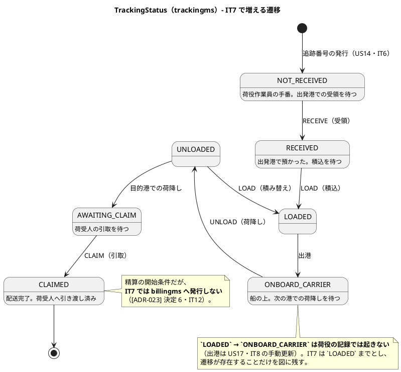
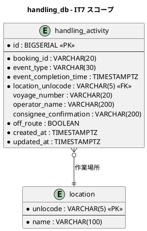
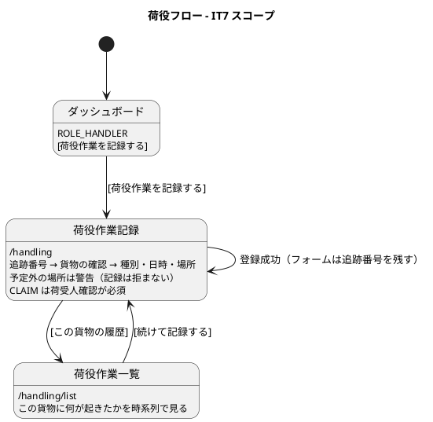

# イテレーション 7 計画

| 項目 | 内容 |
| :--- | :--- |
| イテレーション | IT7 |
| 期間 | 2026-08-23 〜 2026-09-05（2 週間） |
| 対象ストーリー | US15（荷役作業の記録）・US16（引取作業の記録） |
| 計画 SP | 10 |
| 局面 | **中盤（5 本目・最終）／インサイドアウト**（[開発戦略](development_strategy.md#中盤-インサイドアウトit3it7--release-0210-前半)） |
| 前提 | [IT6 完了報告書](iteration_report-6.md)・[IT6 ふりかえり](retrospective-6.md) |

## ゴール

**貨物が実際に動き出す。** 荷役作業員が追跡番号で貨物を特定し、受領・積込・荷降し・引取を記録すると、その結果が追跡の状態に反映される。IT6 までは追跡番号を発行しただけで、貨物はどこにも動いていなかった。

あわせて **handlingms を初実装**し、**サービス間の非同期連携を 2 本目**（handlingms → trackingms）として通す。

### 成功基準

> **荷主が追跡番号で照会する画面は IT7 のスコープに入りません**（US18・IT8）。IT7 で確かめるのは「荷役の記録が追跡の状態に反映されること」までで、荷主から見えるようになるのは IT8 です。

| # | 基準 | 測り方 |
| :--- | :--- | :--- |
| 1 | **荷役の記録が追跡に届く** | kind 統合環境で、追跡番号の入力 → 受領 → 積込 → 荷降し → 引取 を通し、**trackingms の追跡状態が対応して変わる**ことを確かめる |
| 2 | **予定と違う場所の作業が、記録に残る** | 予定ルート外の港で記録したとき、**警告が出て、かつ「予定外だった」ことが記録に残る**ことを固定する。警告を消す実装に変えると赤になること |
| 3 | **引取は荷受人の確認なしに記録できない** | 確認が空のまま引取を記録しようとすると断られることを、集約・API・画面の 3 層で固定する |
| 4 | **新しいサービスが、既存の規則すべてに掛かっている** | ArchUnit の**適用側を機械的に導く**（Try 1）。handlingms を配線し忘れると赤になること |
| 5 | ドメイン層のカバレッジ 90% 以上 | 5 サービス + shared |

## 局面とアプローチ

**中盤の最終イテレーション（インサイドアウト）。** [開発戦略](development_strategy.md)は中盤を「中核ドメイン（経路候補算出・**荷役**）とサービス間結合の基盤をドメイン層から堅牢に作り込む」と定めている。IT7 はその荷役にあたる。

**IT6 で作ったイベント契約の型（[ADR-022](../adr/022-domain-event-contract.md)）をそのまま写す。新しい結合方式を発明しない。** 発明が必要になったら ADR を起票してから実装する。

## 前イテレーションからの反映

### ふりかえりの Try（[retrospective-6.md](retrospective-6.md)）

| Try | 本 IT での落とし込み |
| :--- | :--- |
| 1. 規則を足したら、それを適用する側を機械的に導く | **成功基準 4 に据えた**。返済枠 0.2 で最初に行う。handlingms が新しく増えるこの IT は、**適用漏れが最も起きやすい** |
| 2. 契約の検査は「本番の呼び出し形」で組み立てる | タスク 2.3・3.2 の完了条件。テストが自前で `ObjectMapper` や受け皿クラスを用意した時点で疑う |
| 3. 実環境で確かめる前にイメージを作り直す | **DoD に追加**。デモ・実バックエンド E2E の手順の先頭に `dev:k8s:images` → `dev:k8s:rollout:restart` を置く |
| 4. 画面を割る基準を IT の冒頭で決める | タスク 0.8。**先に基準を決めてから** `booking-detail-page.tsx` を割る |
| 5. 遷移規則を集約の述語として持ち、応答に載せる | 返済枠 0.7。荷役でも同じ形（作業種別ごとの可否）が要るため、**IT7 の頭で一本化しておく** |
| 6. 発行に失敗したイベントを再実行する手段 | 返済枠 0.3・0.4 |
| 7. 権限で閉じられない品質ゲートは、クローズの冒頭で依頼する | **Day 1 に 0.1 を置いた**。IT6 はここで止まった |

### 引き継ぎ（返済枠・SP 対象外）

> **「余力次第」にしない。** 返済枠を余力の話にすると毎 IT 繰り越されて固定化する。**Day 1-2 を返済枠に充て、独立したコミットで先に済ませる。**

| # | 内容 | 見積 | 由来 | 結果 |
| :--- | :--- | :--- | :--- | :--- |
| 0.1 | **SonarQube のセキュリティホットスポット 1 件を利用者にレビューしてもらう**（依頼する） | 1h | IT5 から持ち越し・IT6 Try 7 | 完了（**依頼ではなく修正で閉じた**。指摘どおりの弱点があった——`EmailAddress` の正規表現。両プロジェクトの Quality Gate が PASS） |
| 0.2 | **ArchUnit の規則を「適用する側」から機械的に導く**。どのサービスがどの規則を呼ぶかを手書きの一覧で管理しない | 5h | IT6 Try 1 | 完了（`ServiceArchitectureTest` の継承へ。規則を束ねる側に足せば全サービスへ掛かる） |
| 0.3 | 発行に失敗したイベントの再実行手段（運用手順書の 1 タスク） | 4h | IT6 レビュー | 完了（`dev:k8s:events:redeliver`。運用手順書 7.6） |
| 0.4 | 取りこぼしが見える照会（発行済みだが追跡が無い予約） | 3h | 同上 | 完了（`dev:k8s:events:missing`。取りこぼしの番号まで出す） |
| 0.5 | 交換機に `alternate-exchange` を足す（[ADR-022](../adr/022-domain-event-contract.md) 決定 4 に一行足す） | 2h | 同上 | 完了（`alternate-exchange`。両側で宣言を揃えた） |
| 0.6 | 冪等を read-then-write からやめる | 2h | 同上 | 完了（`ON CONFLICT DO NOTHING`。判別するテストを足した） |
| 0.7 | **遷移の可否を集約の述語として持ち、応答に載せる。** 画面とモックが状態名を比較する形をやめる | 6h | IT6 Try 5 | 完了（集約の述語 → `availableActions`。画面とモックの比較をやめた） |
| 0.8 | **画面を割る基準を決め**、`booking-detail-page.tsx`（610 行）を割る | 5h | IT6 Try 4 | 完了（基準 400 行を `max-lines` で機械化。2 画面を責務で割った） |
| 0.9 | 所要日数の丸めを 1 か所に寄せる（いま 3 通り） | 2h | IT6 レビュー | 完了（`transitDaysBetween` に一本化） |
| 0.10 | `CONFIRMED` の表示名を「確定済」に揃える | 1h | 同上 | 完了（「確定済」に統一） |
| 0.11 | `ignoreFailures = true`（Checkstyle / SpotBugs）の方針を決める | 3h | 同上 | 完了（**SpotBugs はこれまで 1 クラスも解析していなかった**。ツール版を上げてゲートを有効化） |
| 0.12 | 契約の名簿・チャネル名を両側が読む共通定義にする | 3h | 同上 | 完了（`TrackingNumberIssuedContract` を両側が読む） |
| **小計** | | **37h** | | **12 / 12 完了** |

> **0.13（追跡番号の日次カウンタ）は IT7 でも行いません。** 通算 9999 で循環する形は UNIQUE 制約が重複を捕まえるところまで作ってあり、1 日 9,999 件は業務量から遠い。**落とすことをここに書く**——書かないと「忘れていた」と読まれる。

## 対象ストーリーと受入基準

### US15: 荷役作業を記録する（7 SP）

| # | 受入基準 | 本 IT での扱い |
| :--- | :--- | :--- |
| US15-1 | 追跡番号の入力で貨物を特定できる | 実装。**スキャンは行わない**（入力のみ。読取機の要件が決まっていない） |
| US15-2 | 作業種別（受領・積込・荷降し）を選択できる | 実装 |
| US15-3 | 作業日時と作業場所（UN/LOCODE）を入力できる | 実装。場所は地点マスタから選ぶ（自由入力にしない） |
| US15-4 | 記録後、貨物状態が対応する状態に自動更新される | 実装。**イベント経由**（handlingms → trackingms） |
| US15-5 | 記録後、荷主に状態変更通知が送信される | **代替**。通知基盤は US19（IT8）。IT7 は追跡の状態に反映されるところまでとし、その旨を画面とマニュアルに明記する |
| US15-6 | 追跡番号が存在しない場合、エラーメッセージが表示される | 実装 |
| US15-7 | 作業場所が予定ルートと異なる場合、警告が表示される | 実装。**警告は出すが記録は拒まない**（[ADR-023](../adr/023-handling-activity-validation.md) で決める）。`MISROUTED` への遷移は US28（IT10） |

### US16: 引取作業を記録する（3 SP）

| # | 受入基準 | 本 IT での扱い |
| :--- | :--- | :--- |
| US16-1 | 「引取」を選ぶと荷受人確認フィールドが出る | 実装 |
| US16-2 | 荷受人確認が取得されると引取作業が記録される | 実装。**確認が無ければ断る**（成功基準 3） |
| US16-3 | 記録後、貨物状態が「引取済」に更新される | 実装 |
| US16-4 | 「引取済」は配送完了を意味し、精算処理の開始条件となる | **範囲を狭める**。`CargoDeliveredEvent`（billingms へ）は **IT12** で発行する。IT7 は「引取済」までとし、**発行しないことを [ADR-023](../adr/023-handling-activity-validation.md) に明記する** |

> **通関ガード（[ドメインモデル](../design/domain-model.md) Handling Context のビジネスルール 2）は IT7 では働きません。** `CustomsDeclaration` は US29（IT9）です。ガードが無いまま引取を通すと「通関前の貨物を引き渡した」記録が残るため、**IT7 は荷役作業員の明示的な確認を記録する形で代替**します（[ADR-023](../adr/023-handling-activity-validation.md) 決定 5）。**代替であることを画面・マニュアル・完了報告書に明記します。**

## 設計

### ドメインモデル図（IT7 スコープ）

> **`CustomsDeclaration` / `CustomsStatus` / `HandlingActivityHistory` は IT7 では作りません。** 通関は US29（IT9）、荷役履歴の Read Model は一覧（US15 の `/handling/list`）で必要になった時点で判断します。

### 状態遷移図（IT7 スコープ・**誰の手番か**を明記）

> **`EXCEPTION` / `UNKNOWN` は IT7 では使いません。** 例外の起票は US20（IT8）、`UNKNOWN` は状態が読めない行のためのもので、新規には選べません。

> **`MISROUTED` はこの図に入りません。** 予定外の場所での作業は「記録に残す」までで、`RoutingStatus` を動かすのは US28（IT10）です（[ADR-023](../adr/023-handling-activity-validation.md) 決定 4）。

### ER 図（IT7 スコープ）

> **`off_route` は[データモデル](../design/data-model.md)に無い列です**（注 3）。予定外だったことを記録に残さないと、US28（IT10）で誤配を扱うときに過去の作業を判定し直すことになります。**同じ変更でデータモデルに反映します。**
>
> `customs_declaration` / `customs_status_history` は IT9（US29）で作ります。

### 画面遷移図（IT7 スコープ）

> **同じ貨物に連続して記録する**のが荷役の実際の使い方です。登録後にフォームを全部空にすると、作業員は追跡番号を毎回打ち直すことになります。

## タスク

### 0. 返済枠（SP 対象外）

上の「引き継ぎ」表のとおり（0.1〜0.12・37h）。**Day 1-2 に置き、独立したコミットにする。**

### 1. Phase 1: 荷役のドメイン（4 SP 相当・26h）

| # | 内容 | 見積 | 完了条件 |
| :--- | :--- | :--- | :--- |
| 1.1 | **[ADR-023](../adr/023-handling-activity-validation.md) を書く**（荷役の妥当性検証・予定外の扱い・通関ガードの代替・発行するイベント・発行しないイベント） | 5h | **決定の数だけ検査を用意する**表を持つ |
| 1.2 | `HandlingType` と、種別ごとの要件（航海番号・荷受人確認・照合する港） | 4h | デシジョンテーブルの 4 行すべてにテスト。**種別を 1 つ足したら赤になる**こと |
| 1.3 | `HandlingActivity` 集約（登録と検証） | 6h | 荷受人確認なしの CLAIM を断る。**断りを外すと赤** |
| 1.4 | `CargoSnapshot` / `LegSnapshot` と `isValidFor` | 6h | 予定ルート外の判定。**判定を本番と検査で共有する**（テスト側に書き直さない） |
| 1.5 | `ConsigneeConfirmation` / `CargoBookingId` / `HandlingVoyageNumber` | 5h | **BC 固有の型**。bookingms / routingms の同名型を再利用しない（名前は[ドメインモデル](../design/domain-model.md)に合わせる。注 8） |

### 2. Phase 2: ACL とイベント（3 SP 相当・22h）

| # | 内容 | 見積 | 完了条件 |
| :--- | :--- | :--- | :--- |
| 2.1 | bookingms に**追跡番号で貨物を引く**エンドポイントを足す（注 1） | 5h | 契約テスト（コンシューマ + プロバイダ）。**名簿は DTO から導く** |
| 2.2 | handlingms → bookingms の ACL（`CargoSnapshotFinder`）。**システム主体として名乗る**（[ADR-019](../adr/019-route-assignment-api.md) 後日談 3） | 5h | 名乗らないと 401 になることを検査で固定 |
| 2.3 | `HandlingActivityRegisteredEvent` の発行（[ADR-022](../adr/022-domain-event-contract.md) の型を写す） | 6h | **本番の呼び出し形**でトランザクション境界を確かめる（Try 2） |
| 2.4 | trackingms が購読し `TransportStatus` を進める。**実 RabbitMQ で 1 往復** | 6h | デッドレターへの到達も対で確かめる |

### 3. Phase 3: 永続化と API（1.5 SP 相当・14h）

| # | 内容 | 見積 | 完了条件 |
| :--- | :--- | :--- | :--- |
| 3.1 | `V1__init_handling.sql`（`location` / `handling_activity`）と MyBatis 配線 | 5h | 読み戻しで**全項目が戻る**ことを確かめる（IT6 の欠陥 5 と同じ形） |
| 3.2 | `POST /api/v1/handling` / `GET /api/v1/handling` | 6h | 認可は**入力検証より先**。`ROLE_HANDLER` と `ROLE_TRACKER`（参照のみ） |
| 3.3 | 方言スモーク（H2）と JIG / jig-erd の再生成 | 3h | 共通マイグレーションに方言を漏らさない |

### 4. Phase 4: 画面（1.5 SP 相当・16h）

| # | 内容 | 見積 | 完了条件 |
| :--- | :--- | :--- | :--- |
| 4.1 | `/handling`（記録フォーム。モバイル幅で操作できること） | 7h | 追跡番号 → 貨物の確認 → 種別・日時・場所。**登録後も追跡番号を残す** |
| 4.2 | `/handling/list`（この貨物に何が起きたか） | 4h | 時系列。予定外だった作業が分かる |
| 4.3 | **ナビゲーションの 4 点一致**。`ui_design.md` のナビ構成表・`navigation.ts`（`available: true` へ）・`dashboard-panels.ts`・`navigation.test.ts` | 3h | **ロール別・状態別の到達性**を確かめる |
| 4.4 | モックを足す変更で、本物の該当箇所を読み比べる | 2h | 差分をコミットメッセージに 1 行残す |

### 5. Phase 5: 結合の検査（10h）

| # | 内容 | 見積 | 完了条件 |
| :--- | :--- | :--- | :--- |
| 5.1 | **kind 統合環境で成功基準 1 を通す**（受領 → 積込 → 荷降し → 引取）。**先にイメージを作り直す**（Try 3） | 6h | `tracking_db` の追跡状態が対応して変わる |
| 5.2 | E2E（モック + 実バックエンド）。**「条件が揃わなければスキップ」を作らない** | 4h | 前提は種データで用意する |

### 6. ユーザーマニュアル（SP 対象外・10h）

| # | 内容 | 見積 |
| :--- | :--- | :--- |
| 6.1 | 第 8 章「荷役作業」を新設（記録・履歴・予定外の警告・引取の確認） | 5h |
| 6.2 | 画面キャプチャを**生成 spec 経由で**撮る | 3h |
| 6.3 | 索引（`manual/index.md`・全体構成表）を合わせる。**前 IT で「まだできません」と書いた箇所の棚卸し** | 2h |

### 7. レビュー手直しの枠（SP 対象外・12h）

IT3〜IT6 の実績（10・14・12・9 件）から、12h を見積もりに入れる。

### 見積もり合計

| 区分 | 見積 |
| :--- | :--- |
| 0. 返済枠 | 37h |
| 1. Phase 1 荷役のドメイン | 26h |
| 2. Phase 2 ACL とイベント | 22h |
| 3. Phase 3 永続化と API | 14h |
| 4. Phase 4 画面 | 16h |
| 5. Phase 5 結合の検査 | 10h |
| 6. マニュアル | 10h |
| 7. レビュー手直し | 12h |
| **合計** | **147h** |

> **IT6 は 155h の見積もりで 9 SP を達成しました。IT7 は 147h で 10 SP です。**
>
> SP は増えていますが見積もりは減っています。**IT6 でイベント基盤を通したぶん、2 本目は写すだけで済む**という読みです。この読みが外れたときに備えて、**落とす順序を先に決めます**。
>
> | 順 | 落とすもの | 見積 | 落としてよい理由 |
> | :--- | :--- | :--- | :--- |
> | 1 | 0.11 `ignoreFailures` の方針 | 3h | 方針を決めるだけで、いま壊れているものは無い。ただし**落とすと 2 IT 連続の繰越**になる |
> | 2 | 0.9 所要日数の丸め | 2h | 1 日のずれで、業務が止まる形ではない |
> | 3 | 4.2 `/handling/list` | 4h | 記録（4.1）が本体。履歴は予約詳細の荷役履歴（IT8）でも見られるようになる |
> | 4 | 0.8 の分割部分 | 3h | 割る基準を決める部分（2h）は残し、実際の分割だけ落とす |
>
> **Phase 2（ACL とイベント）・5.1（kind での往復）・0.2（規則の適用側）は削りません。** 0.2 を削ると、**新しいサービスが規則の網から外れたまま IT8 以降に入ります**——IT6 で実際に起きた形です。

## スケジュール

### Week 1（Day 1-5）

| 日 | 内容 | 区分 |
| :--- | :--- | :--- |
| Day 1 | **0.1 ホットスポットを利用者に依頼**、0.2 規則の適用側、0.5 `alternate-exchange`、0.6 冪等 | 返済枠 |
| Day 2 | 0.3 再実行手段、0.4 取りこぼしの照会、0.12 契約の共通定義、0.9 / 0.10 / 0.11 | 返済枠 |
| Day 3 | 0.7 遷移の述語を応答に載せる、0.8 割る基準と `booking-detail-page.tsx` の分割 | 返済枠 |
| Day 4 | 1.1 ADR-023（荷役の妥当性検証） | Phase 1 |
| Day 5 | 1.2 `HandlingType`、1.3 `HandlingActivity` | Phase 1 |

### Week 2（Day 6-10）

| 日 | 内容 | 区分 |
| :--- | :--- | :--- |
| Day 6 | 1.4 `CargoSnapshot` と検証、1.5 BC 固有の型 | Phase 1 |
| Day 7 | 2.1 bookingms の照会 API、2.2 ACL | Phase 2 |
| Day 8 | 2.3 発行、2.4 購読と往復 | Phase 2 |
| Day 9 | 3.1-3.3 永続化と API、4.1 記録フォーム | Phase 3・4 |
| Day 10 | 4.2-4.4 画面とナビ、5.1 kind、5.2 E2E、6.1-6.3 マニュアル | 仕上げ |

> **0.7（遷移の述語）を Day 3 に置いたのは、荷役でも同じ形（種別ごとの可否）が要るためです。** 後回しにすると、荷役側で 4 か所目を作ってから直すことになります。

## リスク

| # | リスク | 影響 | 対応 |
| :--- | :--- | :--- | :--- |
| 1 | **handlingms が初実装**（trackingms と同じ形） | ヘキサゴナル・Flyway・MyBatis の配線をゼロから作る | trackingms の形をそのまま写す。**新しい型を発明しない**。0.2 で規則の適用漏れを機械的に防ぐ |
| 2 | **通関ガードが無いまま引取を通す** | 「通関前の貨物を引き渡した」記録が残りうる | ADR-023 決定 5 で**荷役作業員の確認を記録する形**にし、代替であることを画面・マニュアル・報告書に明記。IT9 で本物に置き換える |
| 3 | **返済枠が 37h と大きい**（IT6 の 29h より増えた） | Phase 1 の着手が Day 4 になる | Day 1-3 に固めて置き、Day 3 終了時に進捗を確認する。遅れたら上の「落とす順序」に従う |
| 4 | **予定外の判定が、旅程の持ち方に依存する** | `CargoSnapshot` の形が決まらないと 1.4 が進まない | 2.1（bookingms 側の API）を先に決める。**判定は 1 か所に置く**（テスト側に書き直さない） |
| 5 | **US15-5（荷主への通知）を代替にする** | 受入基準が部分達成 | US19（IT8・通知基盤）で置き換える。**完了報告書に明記** |
| 6 | **US16-4（精算の開始条件）を範囲外にする** | 同上 | `CargoDeliveredEvent` は IT12。**発行しないことを ADR-023 に明記する**——書かないと「実装漏れ」と読まれる |
| 7 | イベントの購読者が 2 つになる（trackingms・bookingms） | 配信方式の判断が要る | **IT7 は trackingms だけが購読する**（bookingms の購読は US28・IT10）。ADR-023 決定 3 に明記し、交換機は将来 2 者が読める形にしておく |

## 設計への反映が必要な箇所（注）

| # | 箇所 | 内容 |
| :--- | :--- | :--- |
| 1 | `ui_design.md` / `domain-model.md` | **追跡番号から貨物を引く経路が設計に無い。** US15-1 は追跡番号で特定するが、`handling_activity` は `booking_id` を持ち、`CargoSnapshot` も `bookingId` から始まる。bookingms 側に追跡番号での照会を足し、設計に反映する |
| 2 | `domain-model.md` | `HandlingActivity` に**予定外だったこと**を持たせる（`offRoute`）。いまは `isValidFor(): boolean` で、真偽を返すだけで記録に残らない |
| 3 | `data-model.md` | `handling_activity` に `off_route` 列を足す |
| 4 | trackingms の実装 | **実装の enum 名が設計と違う。** [ドメインモデル](../design/domain-model.md)の Tracking Context は `TrackingStatus`（9 値）だが、IT6 の実装は `TransportStatus`（1 値）で作った。`TransportStatus` は設計では **Booking Context の `Delivery`** が持つ名前であり、このままだと BC をまたいで同じ名前が別物を指す。**`TrackingStatus` に改名し、設計の値集合に合わせる**（IT7 で使うのは `RECEIVED` / `LOADED` / `UNLOADED` / `AWAITING_CLAIM` / `CLAIMED`） |
| 5 | `domain-model.md` | `TrackingStatus` の**遷移**（どの荷役でどこへ動くか）を状態遷移として明記する。いまは値の一覧しかなく、遷移は書かれていない |
| 6 | `domain-model.md` のイベント一覧 | `HandlingActivityRegisteredEvent` の処理先を「trackingms（IT7）・bookingms（US28・IT10）」と時期つきで書く |
| 7 | `ui_design.md` | 荷役作業記録の画面項目表（追跡番号・種別・日時・場所・航海番号・作業員名・荷受人確認）を追加する |
| 8 | `test_strategy.md` | handlingms を対象サービスの一覧に追加する（カバレッジ目標・ArchUnit） |
| 9 | `domain-model.md` | **予約 ID の型名が BC 間でそろっていない。** Tracking は `TrackingBookingId`、Handling は `CargoBookingId` と書かれている。IT7 は設計どおり `CargoBookingId` で作り、**そろえるかどうかを [ADR-023](../adr/023-handling-activity-validation.md) で決める**（`Cargo` を名乗る型が Handling の中にあると、相手の型を持ち込んだように読める） |
| 10 | `domain-model.md` の追跡番号の表 | **Handling Context の追跡番号型が表に無い。** US15-1 は追跡番号を入力の起点にするため、`HandlingTrackingNumber` が要る。航海番号の表と同じ形（BC ごとに型を持つ）で追記する |

## デモ項目

イテレーションの終わりに、この順で動かして見せます。**デモの前にイメージを作り直します**（Try 3）。

| # | 見せるもの | 役割 | 対応 |
| :--- | :--- | :--- | :--- |
| 1 | 追跡番号を入力して貨物を特定し、**受領**を記録する | 荷役作業員 | US15-1〜4 |
| 2 | 存在しない追跡番号でエラーになる | 荷役作業員 | US15-6 |
| 3 | **積込**を記録する（航海番号が必須であること） | 荷役作業員 | US15-2・US15-3 |
| 4 | **予定ルート外の港で荷降し**を記録し、警告が出て記録に残ることを示す | 荷役作業員 | US15-7 |
| 5 | **荷受人確認なしの引取が断られる**ことを示す | 荷役作業員 | US16-1・US16-2 |
| 6 | 荷受人確認を入れて**引取**を記録し、状態が「引取済」になることを示す | 荷役作業員 | US16-3 |
| 7 | **trackingms の状態が一連の作業で変わっている**ことを示す | — | 成功基準 1 |

## DoD（完了の定義）

- [ ] 対象ストーリーの受入基準を満たす（**スコープ外にしたものは理由とともに完了報告書へ**）。US15-5 は代替、US16-4 は範囲外（[ADR-023](../adr/023-handling-activity-validation.md)）
- [ ] 成功基準 1〜5 を満たす（成功基準の表に達成の根拠を記載）
- [ ] 全テストが緑（単体・統合・契約・E2E）。**CI のジョブすべて success**
- [ ] **`TZ=UTC` でも緑**
- [ ] **ドメイン層のカバレッジが 90% 以上**（5 サービス + shared）
- [ ] SonarQube Quality Gate が PASS（**バックエンドは 0.1 のホットスポットが前提**）
- [ ] **決定の数だけ検査がある**（ADR-023 のコンプライアンス表）
- [ ] **壊して赤を確認した**（荷受人確認の必須・予定外の判定・種別ごとの要件・イベントの往復・デッドレター）
- [ ] **新しいサービスが既存の規則すべてに掛かっている**（0.2。handlingms を外すと赤）
- [ ] **サービス間の呼び出しを実際に 1 往復させた**。REST は kind、イベントは Testcontainers と kind の両方
- [ ] **契約の検査を「本番の呼び出し形」で組み立てた**（Try 2）
- [ ] **実環境で確かめる前にイメージを作り直した**（Try 3。Pod の `Started:` と修正コミットの時刻を突き合わせた）
- [ ] **画面を割る基準を決めてから割った**（Try 4）
- [ ] **モックを足した変更で、本物の該当箇所と読み比べた**（差分をコミットメッセージに記載）
- [ ] **前 IT で「まだできません」と書いた箇所を棚卸しした**
- [ ] **ナビゲーションの 4 点が一致している**。ロール別・状態別の到達性を確かめた
- [ ] **デモ項目 7 件をこの順で通した**
- [ ] **JIG / jig-erd の出力を再生成した**
- [ ] ユーザーマニュアルを更新し、**キャプチャを再生成して `manual:build` で目視した**
- [ ] **「設計への反映が必要な箇所（注）」10 件をすべて反映した**
- [ ] `docs/index.md` / `development/index.md` / `mkdocs.yml` を同期した

## 進捗

| 区分 | 状態 |
| :--- | :--- |
| 返済枠（0.1〜0.12） | **完了**（12 / 12） |
| Phase 1 荷役のドメイン | 完了（ADR-023・`HandlingType`・`HandlingActivity`・`CargoSnapshot`・BC 固有の型） |
| Phase 2 ACL とイベント | 未着手 |
| Phase 3 永続化と API | 未着手 |
| Phase 4 画面 | 未着手 |
| Phase 5 結合の検査 | 未着手 |
| ユーザーマニュアル | 未着手 |
| レビュー手直しの枠 | クローズ時（`developing-review`） |
