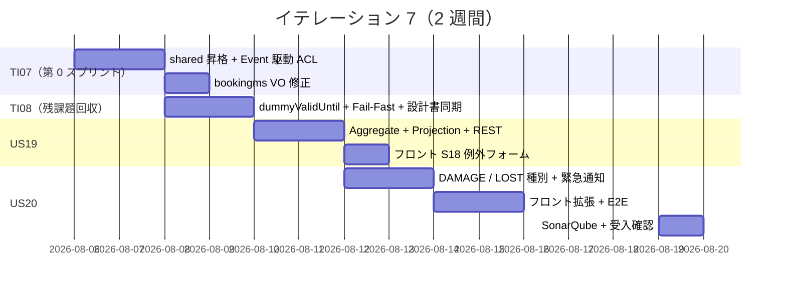
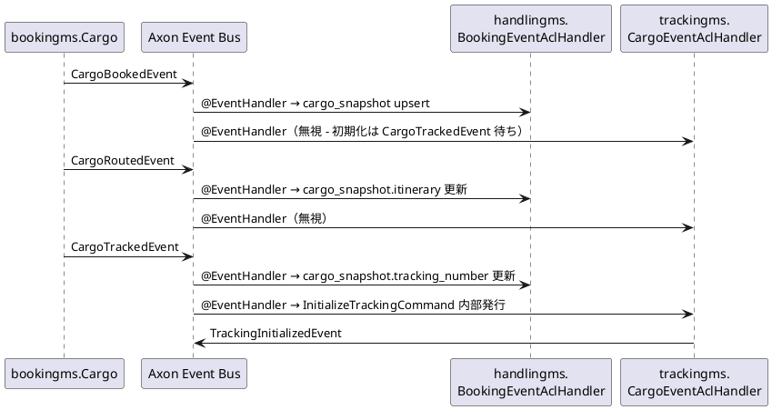
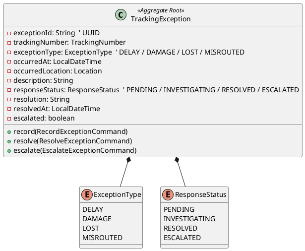

# イテレーション 7 計画

## 概要

| 項目 | 内容 |
|------|------|
| **イテレーション** | 7 / 8 |
| **期間** | Week 13-14（2026-08-06 〜 2026-08-19） |
| **ゴール** | 例外処理（US19/US20）を実装すると同時に、IT5/IT6 で持ち越した shared モジュール昇格 + Event 駆動 ACL を完成させ、IT4 由来の `bookingms.TrackingNumber` 値オブジェクト乖離負債を回収する |
| **目標 SP** | 11（新規 6 + 負債回収 5）|
| **基準ベロシティ** | 14.7 SP（IT1-IT6 平均）|

> **スコープ設定（IT6 完了後）**: 当初計画 6 SP（US19+US20）に対し、IT6 ふりかえりで「Event 駆動 ACL は shared モジュール昇格と束ねて IT7 で本実装」と決定したため、TI07 第 0 スプリント（3 SP）と IT4/IT6 負債回収（2 SP）を追加。合計 11 SP は IT1-IT6 平均 14.7 SP の 75% で、IT5 と同水準の持続可能ペース。

> **ADR-0012 方針の最終形を実装**: handlingms / trackingms の Event 駆動 ACL を本実装し、IT5 暫定の `POST /cargo-snapshots`（handlingms）と IT6 暫定のフロント自動 `initialize`（trackingms）を完全削除する。bookingms の Event クラスを `shared` モジュールに昇格して 3 サービスから共有参照する設計に切り替える。

---

## ゴール

### イテレーション終了時の達成状態

1. **shared モジュールが有効化されている**: bookingms.Event クラス 4 種（CargoBookedEvent / CargoRoutedEvent / CargoTrackedEvent / TrackingNumberIssuedEvent）が `shared/src/main/java/com/example/cargotracker/shared/events/` に移動し、3 サービス（bookingms / handlingms / trackingms）から参照される
2. **Event 駆動 ACL が本実装されている**: handlingms / trackingms が bookingms の Event を Axon Event Bus 経由で購読し、`POST /cargo-snapshots`（handlingms）・フロント自動 `initialize`（trackingms）の暫定処理が削除されている
3. **bookingms.TrackingNumber が正しい正規表現で検証される**: `^TRK-\d{8}-[0-9A-F]{8}$` に修正され、`Cargo` 内部状態が VO で保持される
4. **例外処理ストーリーが完成している**: US19（遅延例外）・US20（破損・紛失例外）が `trackingms` の `TrackingException` Aggregate として実装され、tracking_exception Read Model に反映される
5. **IT6 レビュー高優先度残課題が解消されている**: H-1 港名表示・H-5 問合せ先導線・H-7 dummyValidUntil・H-8 JWT secret 本番 Fail-Fast

### 完了条件（Definition of Done）

- [ ] shared モジュールが有効化され Gradle build / test 成功
- [ ] handlingms / trackingms から bookingms Event を購読する EventHandler 動作確認
- [ ] handlingms 旧 `POST /cargo-snapshots` 削除 / フロント自動 initialize 削除
- [ ] bookingms.TrackingNumber 修正後の全テスト PASS（既存 E2E への影響無し）
- [ ] US19 / US20 受入条件すべて達成
- [ ] data-model.md / domain-model.md に IT6 変更を反映
- [ ] ADR-0013 ステータスを「承認済み」へ昇格
- [ ] Playwright E2E（US19 / US20 含む）追加・全通過
- [ ] SonarQube Quality Gate PASS（new_coverage >= 80%・new_violations 0）

---

## 対象ストーリー

| ID | ストーリー / タスク | SP | 優先度 | 区分 |
|----|------------------|----|-------|------|
| TI07 | IT7 第 0 スプリント（shared 昇格 + Event 駆動 ACL + IT4 由来負債） | 3 | 必須 | 技術タスク |
| TI08 | IT6 レビュー高優先度残課題 + ADR-0013 承認 + 設計書同期 | 2 | 必須 | 技術タスク |
| US19 | 遅延例外を処理する | 3 | 必須 | 新規 |
| US20 | 破損・紛失例外を処理する | 3 | 必須 | 新規 |
| **合計** | | **11** | | |

> **フィーチャバッファ（任意）**: US19/US20 が先行完了した場合のみ実装。
>
> - M-2 BookingId VO 統一（0.5 SP）
> - M-5 `STATUS_LABEL` / `formatDateTime` 重複解消（0.5 SP）
> - M-6 `sendAndWaitWithTimeout` 共通化（0.5 SP）
> - M-15 TrackingController を Public / Internal に物理分離（0.5 SP）

---

## ストーリー詳細

### TI07: IT7 第 0 スプリント（shared 昇格 + Event 駆動 ACL + IT4 由来負債）

IT5（T5）/ IT6（T1）持ち越しの Event 駆動 ACL を完成させ、サービス境界をまたぐ Event 連携を正規化する。

**完了条件**:

1. `apps/backend/shared` Gradle モジュール有効化（`settings.gradle.kts` の include を有効化、`build.gradle.kts` を作成）
2. bookingms の Event クラス 4 種を `shared/.../events/` に移動（FQN: `com.example.cargotracker.shared.events.*`）
3. handlingms / trackingms に shared 依存追加 + `BookingEventAclHandler`（handlingms）・`CargoEventAclHandler`（trackingms）実装
4. handlingms の `POST /api/v1/handling/cargo-snapshots` を削除 + 関連 E2E シードロジックを Event 投入に切替
5. trackingms `BookingDetailPage` の useEffect 自動 initialize を削除 + `TrackingActivity` 未初期化フォールバック削除（`IllegalStateException` で拒否）
6. bookingms.TrackingNumber 正規表現を `^TRK-\d{8}-[0-9A-F]{8}$` に修正 + `Cargo` 内部状態を VO 化

**ADR 参照**: ADR-0004 / ADR-0005 / ADR-0012

### TI08: IT6 レビュー高優先度残課題 + 設計書同期

| # | 内容 | 出典 |
|---|------|------|
| TI08-1 | 公開画面で港名表示（UN/LOCODE + 港名併記）。`Location` 値オブジェクトに `portName` を必須化し、bookingms / routingms / handlingms / trackingms の Event ペイロードで `portName` を伝搬 | レビュー H-1 |
| TI08-2 | 期限切れエラーに問合せ先（環境変数 `SUPPORT_EMAIL` / `SUPPORT_PHONE` 経由）を表示 | レビュー H-5 |
| TI08-3 | `TrackingTokenService.verify` 戻り値を `VerifiedToken(TrackingNumber, expiresAt)` に拡張し、`TrackingController#getTracking` の `dummyValidUntil` を解消 | レビュー H-7 |
| TI08-4 | JWT secret 本番 Fail-Fast: `JwtTrackingTokenService` で `@PostConstruct` + `Environment#acceptsProfiles` で profile 判定 | レビュー H-8 |
| TI08-5 | ADR-0013 ステータスを「提案」→「承認済み」へ昇格 + index.md 同期 | レビュー M-10 |
| TI08-6 | data-model.md / domain-model.md に IT6 変更を反映（`delivered_at` / `source` / `TrackingTokenService` / `JwtToken` / `EventSource` / `tracking_number: VARCHAR(25)`） | レビュー M-9 |

### US19: 遅延例外を処理する（3 SP）

**として**: 追跡管理者

**したい**: 輸送中に遅延が発生した場合、例外種別「遅延」として記録し、荷主への通知と対応内容を管理したい

**なぜなら**: 遅延情報を速やかに荷主に伝え、対応策（代替ルート等）を迅速に提示できるからだ

**対応 UC**: UC16

**受入条件**:

- [ ] 追跡番号と例外種別「遅延」・発生状況（場所・日時・理由）を記録できる
- [ ] 記録後、貨物状態が「EXCEPTION」に更新される（`TransportStatusUpdatedEvent` 発行）
- [ ] 荷主に遅延発生の通知が記録される（IT7 ではメール送信実体はモック・ログ出力のみ）
- [ ] 対応内容（新しい到着予定日・対応方針）を入力して荷主に対応報告を送信できる（同上モック）
- [ ] 例外対応履歴が `tracking_exception` テーブルに記録される

### US20: 破損・紛失例外を処理する（3 SP）

**として**: 追跡管理者（または荷役作業員）

**したい**: 輸送中に破損または紛失が発生した場合、例外種別「破損」または「紛失」として記録し、関係者に緊急通知を送りたい

**なぜなら**: 重大な例外は即座に全関係者に共有し、保険手続き・補償対応・代替措置を迅速に開始できるからだ

**対応 UC**: UC16

**受入条件**:

- [ ] 追跡番号と例外種別「破損」または「紛失」・発生状況を記録できる
- [ ] 記録後、貨物状態が「EXCEPTION」に更新される
- [ ] 例外種別「紛失」の場合、緊急フラグ（`escalated=true`）が設定される
- [ ] 荷主に通知が記録される（IT7 ではモック）
- [ ] 対応内容（補償方針等）を入力して荷主に報告を送信できる（同上モック）

---

## タスク

### 1. TI07: IT7 第 0 スプリント（3 SP・約 15h）

| # | タスク | 見積もり | 状態 |
|---|--------|---------|------|
| 1.1 | shared モジュール有効化 / build.gradle.kts 作成 | 1h | [ ] |
| 1.2 | bookingms.Event 4 種を shared に移動（旧 import 修正） | 2h | [ ] |
| 1.3 | handlingms に shared 依存追加 + `BookingEventAclHandler`（CargoBookedEvent / CargoRoutedEvent → cargo_snapshot upsert） | 2h | [ ] |
| 1.4 | trackingms に shared 依存追加 + `CargoEventAclHandler`（CargoTrackedEvent → InitializeTrackingCommand 内部発行） | 2h | [ ] |
| 1.5 | handlingms 旧 `POST /cargo-snapshots` 削除 + E2E シード切替 | 1.5h | [ ] |
| 1.6 | フロント `BookingDetailPage` 自動 initialize 削除 + 関連テスト更新 | 1h | [ ] |
| 1.7 | TrackingActivity 未初期化フォールバック削除 + `IllegalStateException` 化 + テスト更新 | 1h | [ ] |
| 1.8 | bookingms.TrackingNumber 正規表現修正 + Cargo 内部 VO 化 + 既存テスト更新 | 2h | [ ] |
| 1.9 | trackingms.TrackingNumber 検証を厳密化（IT6 で緩めたものを再度厳密に） | 0.5h | [ ] |
| 1.10 | E2E `login-tracking.spec.ts` / `login-handling.spec.ts` の暫定処理削除 + 全通過確認 | 2h | [ ] |

### 2. TI08: レビュー高優先度残課題 + 設計書同期（2 SP・約 9h）

| # | タスク | 見積もり | 状態 |
|---|--------|---------|------|
| 2.1 | TI08-3: `TrackingTokenService.verify` 戻り値を `VerifiedToken` に拡張 + dummyValidUntil 解消 | 1.5h | [ ] |
| 2.2 | TI08-4: JWT secret 本番 Fail-Fast（@PostConstruct + profile 判定） | 1h | [ ] |
| 2.3 | TI08-1: `Location` 値オブジェクトに `portName` 必須化 + Event ペイロード伝搬 | 2h | [ ] |
| 2.4 | TI08-2: `SUPPORT_EMAIL` / `SUPPORT_PHONE` 環境変数導入 + 公開画面の期限切れエラーに表示 | 1h | [ ] |
| 2.5 | TI08-5: ADR-0013 ステータス昇格（提案 → 承認済み） + index 同期 | 0.5h | [ ] |
| 2.6 | TI08-6: data-model.md / domain-model.md に IT6 変更を反映 | 2h | [ ] |
| 2.7 | docs/operation/Deprecation 一覧.md 新設 + handlingms 旧 PUT を登録 | 1h | [ ] |

### 3. US19: 遅延例外を処理する（3 SP・約 14h）

| # | タスク | 見積もり | 状態 |
|---|--------|---------|------|
| 3.1 | trackingms に `TrackingException` Aggregate + `RecordExceptionCommand` + `ResolveExceptionCommand` | 3h | [ ] |
| 3.2 | `ExceptionRecordedEvent` / `ExceptionResolvedEvent` 定義 + Projection EH（`tracking_exception` 更新） | 2h | [ ] |
| 3.3 | `TrackingExceptionMapper` + XML + Read Model 拡張 | 2h | [ ] |
| 3.4 | trackingms に `POST /api/v1/tracking/{tn}/exceptions` + `PATCH /exceptions/{id}/resolve` REST | 2h | [ ] |
| 3.5 | ユニットテスト（Aggregate + Projection + Controller 統合） | 2h | [ ] |
| 3.6 | フロントエンド S18 例外記録フォーム + 例外対応画面（遅延フロー） | 3h | [ ] |

### 4. US20: 破損・紛失例外を処理する（3 SP・約 14h）

| # | タスク | 見積もり | 状態 |
|---|--------|---------|------|
| 4.1 | US19 の `TrackingException` に DAMAGE / LOST 種別を追加 + escalated フラグ | 1h | [ ] |
| 4.2 | LOST 種別時の自動 escalation ロジック（`ExceptionEscalatedEvent` 発行） | 2h | [ ] |
| 4.3 | 緊急通知モックの実装（ログ出力 + tracking_exception.escalated 反映） | 1.5h | [ ] |
| 4.4 | フロント S18 拡張: 破損・紛失選択時に緊急フラグ表示 + 補償方針入力欄 | 3h | [ ] |
| 4.5 | ユニットテスト追加 | 2h | [ ] |
| 4.6 | Playwright E2E: 例外記録 → 対応 → 解決フルフロー | 3h | [ ] |
| 4.7 | SonarQube スキャン + violations 修正 | 1.5h | [ ] |

### タスク合計

| カテゴリ | SP | 理想時間 | 状態 |
|---------|----|----|------|
| TI07 第 0 スプリント | 3 | 15h | [ ] |
| TI08 レビュー残課題 + 同期 | 2 | 9h | [ ] |
| US19 遅延例外 | 3 | 14h | [ ] |
| US20 破損・紛失例外 | 3 | 14h | [ ] |
| **合計** | **11** | **52h** | |

**1 SP あたり**: 約 4.7h（実装 + テスト）
**進捗率**: 0%（0/11 SP）

---

## スケジュール



| 日 | タスク |
|----|--------|
| Day 1-2 | TI07: shared 昇格 + Event 駆動 ACL（handlingms / trackingms） |
| Day 3 | TI07: bookingms.TrackingNumber 修正 + フロント暫定削除 |
| Day 4-5 | TI08: dummyValidUntil / Fail-Fast / 設計書同期 / ADR 承認 |
| Day 6-7 | US19: TrackingException Aggregate + Projection + REST + フロント |
| Day 8-9 | US20: DAMAGE/LOST 種別追加 + escalation + フロント拡張 |
| Day 10 | E2E 全通過 + SonarQube + 受入確認 |

---

## 設計

### shared モジュール構成（IT7 で確立）

```
apps/backend/shared/
├── build.gradle.kts          (IT7 で新規)
├── src/main/java/com/example/cargotracker/shared/
│   ├── events/
│   │   ├── CargoBookedEvent.java         (bookingms から移動)
│   │   ├── CargoRoutedEvent.java         (同上)
│   │   ├── CargoTrackedEvent.java        (同上)
│   │   └── TrackingNumberIssuedEvent.java (同上)
│   └── valueobjects/
│       ├── Location.java                 (IT8 候補・現状は各 MS 独自定義)
│       └── UnLocode.java                 (同上)
└── README.md                 (IT7 で新規・「共有カーネルの最小化」方針を明記)
```

### Event 駆動 ACL 完成形



### TrackingException Aggregate（US19/US20）



---

## リスクと対策

| リスク | 影響度 | 対策 |
|--------|--------|------|
| shared モジュール導入で既存サービスのビルドが破壊される | 高 | TI07-1.1 で空 shared を一旦組み込み build 通過確認 → 1.2 で Event 移動を 1 ファイルずつ実施 |
| Event クラス FQN 変更で Axon Event Store の既存ペイロードが読み込めない | 高 | Event Store は in-memory（H2 + Axon ローカルバス）なので再起動でクリアされる。本番運用時は upcaster 実装 |
| bookingms.TrackingNumber 正規表現変更で既存テストが壊れる | 中 | 既存テストの `TRK-` リテラルを全件 grep して新フォーマットに置換 |
| 例外処理 UI（S18）が複雑化して US19/US20 SP を超過 | 中 | フィーチャバッファ M-2/M-5/M-6/M-15 を後回しにできる構造 |
| `Location.portName` 必須化で既存 Event ペイロードの破壊変更 | 中 | bookingms 内部での生成時に CargoSnapshot から portName を引く経路を確立 |

---

## 完了条件

### Definition of Done

- [ ] 全タスク（11 SP / 52h）完了
- [ ] shared モジュールビルド成功 + handlingms / trackingms / bookingms から参照
- [ ] handlingms / trackingms の Event 駆動 ACL が動作（暫定 REST / 自動 initialize 削除済み）
- [ ] bookingms.TrackingNumber 正規表現修正 + 既存 E2E 全通過
- [ ] US19 / US20 受入条件すべて達成
- [ ] バックエンドユニットテスト + 統合テスト全 PASS
- [ ] Playwright E2E（US19/US20 含む 13 シナリオ）全 PASS
- [ ] SonarQube Quality Gate PASS（new_coverage >= 80%・new_violations 0）
- [ ] data-model.md / domain-model.md 同期
- [ ] ADR-0013 ステータス「承認済み」へ更新

### デモ項目

1. shared モジュール経由で Axon Event を受け取る Event 駆動 ACL（handlingms / trackingms）
2. 予約 → 経路設計 → 追跡番号発行 → S16 一覧表示（Event 駆動で自動初期化）
3. 遅延例外の記録 → 荷主通知（モック）→ 対応報告 → 解決
4. 破損・紛失例外の記録 → 紛失時の escalated フラグ自動付与 → 緊急通知（モック）
5. 公開画面（S15）で港名表示 + 期限切れ時の問合せ先表示
6. JWT secret 本番プロファイル未設定時の起動失敗

---

## ADR

| ADR | タイトル | ステータス |
|-----|---------|-----------|
| ADR-0013 | Tracking Number JWT 時限トークン設計 | IT7 で「提案」→「承認済み」へ昇格 |
| ADR-0014（候補） | shared モジュールの責務範囲（Event 共有 vs VO 共有） | IT7 で起票検討 |

---

## 関連ドキュメント

- [iteration_plan-6.md](./iteration_plan-6.md): 前イテレーション計画
- [retrospective-6.md](./retrospective-6.md): IT6 ふりかえり
- [iteration_report-6.md](./iteration_report-6.md): IT6 完了報告書
- [IT6_implementation_review_20260518.md](../review/IT6_implementation_review_20260518.md): IT6 マルチパースペクティブレビュー
- [ADR-0004 マイクロサービス分割方針](../adr/0004-microservice-decomposition.md)
- [ADR-0005 shared モジュールの役割](../adr/0005-shared-module-role.md)
- [ADR-0012 handlingms と trackingms の責務分離](../adr/0012-handlingms-trackingms-responsibility-separation.md)
- [ADR-0013 Tracking Number JWT 時限トークン設計](../adr/0013-tracking-number-jwt-time-limited-token.md)
- [user_story.md](../requirements/user_story.md): US19 / US20

---

## 更新履歴

| 日付 | 内容 | 担当 |
|------|------|------|
| 2026-05-18 | IT7 計画策定（11 SP・shared 昇格 + Event 駆動 ACL + IT4 由来負債回収 + IT6 レビュー高優先度 + US19 + US20） | AI Agent（XP PM） |
