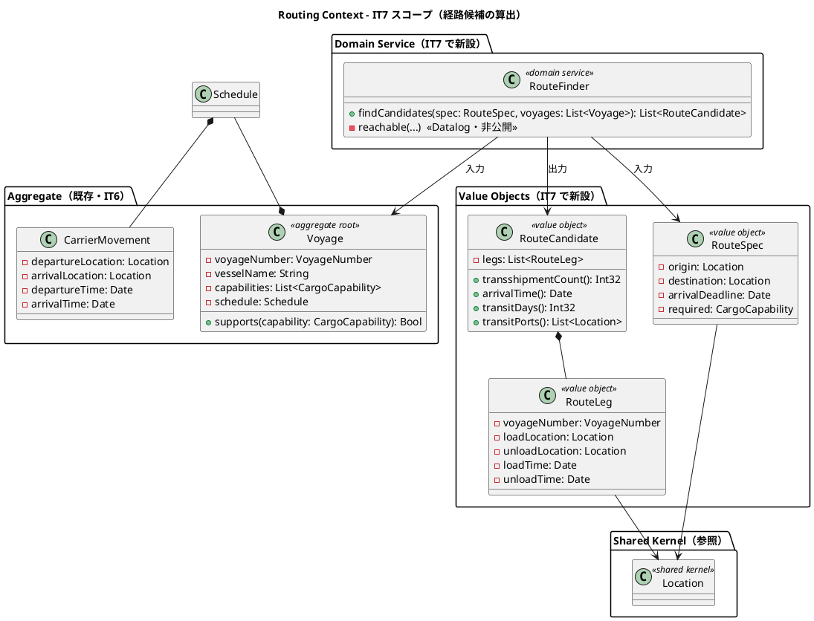
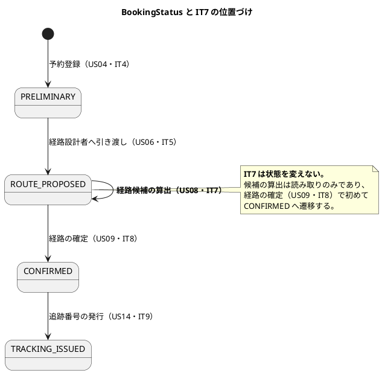
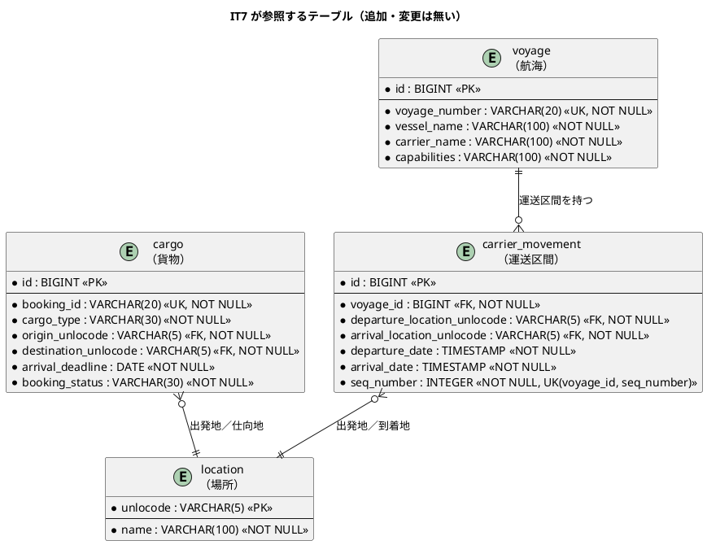
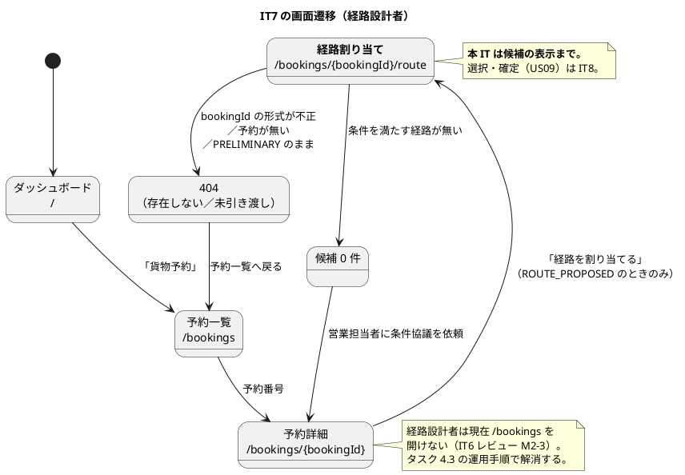

# イテレーション 7 計画

## 概要

| 項目 | 内容 |
| :--- | :--- |
| イテレーション | IT7（Week 13-14） |
| 期間 | 2026-08-04 〜 2026-08-17（2 週間） |
| 局面 | **中盤**（[開発戦略](development_strategy.md) 1 章。IT4-IT7） |
| TDD アプローチ | **インサイドアウト**（ドメイン層 → ポート → 永続化 → 画面） |
| 対象ストーリー | US08・TS12・TS13 |
| 計画 SP | **11** |
| 直近 3 IT の実効ベロシティ | 11.3 SP（IT4:12 / IT5:11 / IT6:11） |

---

## ゴール

### イテレーション終了時の達成状態

**経路設計者が、引き渡された予約に対して「期限内に運べる経路の候補」を画面で得られる。**
候補は Datalog による到達可能性判定から自動算出され、直行便を最優先に推奨順で並ぶ。
併せて、HTTP ランタイムが**過負荷で青天井に劣化しない**状態（同時実行上限・バックプレッシャ・タイムアウト）を作る。

これにより IT8 の「経路の選択・確定（US09）」と「輸送見積（US01）」が入力を得られる状態になる。

### 成功基準（IT7 クローズ時の評価）

| # | 基準 | 測り方 |
|:--:|------|-------|
| 1 | 経路設計者が `/bookings/{bookingId}/route` で候補を得られる | HTTP 統合テスト（直行 1 件・1 回積み替え 1 件・候補 0 件の 3 経路） |
| 2 | 到達可能性判定が Datalog で表現され、Routing Context の外へ漏れていない | `arch-lint` + `RouteFinder` の公開シグネチャに Datalog 型が現れない |
| 3 | 積み替えの時間整合（前区間の到着 ≤ 次区間の出発）が検証されている | 単体テスト。**逆転する組み合わせが候補に出ない**ことを示す |
| 4 | 到着期限の境界で候補を誤って刈らない | **期限当日に時刻付きで着く航海が候補に残る**ことをテストで固定 |
| 5 | 同時実行上限に達したとき `503` + `Retry-After` が返る | 上限を 2 に落とした構成で同時到達させ、`503` を観測する |
| 6 | タイムアウトで `504` が返り、スレッドと接続が解放される | 意図的に遅延させたハンドラで `504` を観測し、後続リクエストが成功する |
| 7 | navbar に行き止まりのリンクが 1 件も無い | `navItems()` の全 href に対しルート登録の有無を機械検査するテスト |
| 8 | 全ロール × 全画面の到達性が表として固定されている（誰がどこへ行けるかが読める） | ロール × 画面の到達性テスト（Try T3） |
| 9 | レビュー高優先度の指摘が 0 件、または全件を本 IT 内で対応 | `docs/review/` の集計 |
| 10 | 縮退 0 件 | 実績表 |

> **成功基準に時間（レイテンシ値）を置かない**。IT5 の学びどおり、測る手段が無い基準は評価できない。
> スループット目標の検証は負荷試験（TS12b・IT8）で扱う。

### 前イテレーションの Try の反映

| Try | 反映先 |
| :--- | :--- |
| T1 新しい安全装置を入れたら**それを破ろうとするテスト**を同じコミットで書く | 成功基準 5・6。TS12 の DoD。セマフォとタイムアウトは「入れた」ではなく「働く」を示す |
| T2 既に作った検証手段の一覧を着手前に読む | タスク 0.1。`postConcurrently` / `probeConcurrently` / `assertInstance` / 観点表を読み、本 IT で使う手段を先に決める |
| T3 画面を追加したらそのロール以外で開いたときに何が見えるかを 1 つずつ確認 | タスク 0.2（ロール × 画面の表）・タスク 1・成功基準 7・8 |
| T4 運用手順を書いたらその担当ロールで実際に実行できるかを確かめる | タスク 4.3。IT6 で `operation.md` に書いた暫定運用が実行できなかった（P2-3）ため、本 IT で実行可能にする |
| T5 外部から来る値が SQL の型変換へ届く経路を、入力を足すたびに数える | タスク 2.6。本 IT で追加する入力（`bookingId` パス変数）を数え、`CAST` へ届く経路を表にする |
| T6 アサートを書いたら「この式が偽になる入力は何か」を 1 つ挙げる | 全実装タスクの DoD。テスト追加時にコメントで 1 行残す |
| T7 新しい BC を立ち上げるとき既存 BC のテスト構成を写す | タスク 0.3。**新 BC ではないが新画面**のため、`test/web/` の描画テスト（エスケープ検証を含む）を最初から作る |
| T8 設計ドキュメントに定義がある DB オブジェクトは着手前に実物の有無を確認 | タスク 0.4。`route_candidate` は本 IT で使わない判断を先に確定させる（後述） |

> **T1-T8 はいずれもタスク 0（着手前）または実装タスクの DoD に置いた**。
> IT6 のふりかえりが指摘したとおり、レビューでしか効かない Try は「作ってから直す」ループを固定する。

---

## ユーザーストーリー

### 対象ストーリー

| ID | ストーリー | SP | 優先度 | 状態 |
| :--- | :--- | :--: | :--- | :--- |
| TS13 | IT6 レビューの返済（navbar の行き止まり・設計の可否表の同期） | 1 | 高 | 未着手 |
| US08 | 経路候補を算出する（Datalog 到達可能性判定） | 8 | 高 | 未着手 |
| TS12 | HTTP ランタイムの防御（同時実行上限・バックプレッシャ・タイムアウト） | 2 | 高 | 未着手 |
| **合計** | | **11** | | |

### スコープの判断（着手前に確定させた 4 件）

#### 1. TS12 を分割した（3 SP → 2 SP + 1 SP）

[リリース計画](release_plan.md) の TS12 は「セマフォ・タイムアウト・**追跡 API の負荷試験**」で 3 SP だった。
本 IT では**ランタイムの実装（2 SP）だけ**を扱い、**負荷試験を TS12b（1 SP）として IT8 へ送る**。

理由は 2 つある。

1. 負荷試験は「実装が入った後の実測」であり、同じ IT に入れると**実装が遅れた場合に測定が形骸化する**。
   IT6 の P1（安全装置を入れたが働いていない）は、まさに検証が実装と同じ枠に押し込まれた結果である
2. [バックエンドアーキテクチャ](../design/architecture_backend.md) は追跡 API 1,000 RPS を「要検証」としており、
   結果次第で**非機能要件の改訂（ADR）**が要る。判断を伴う作業を 11 SP の枠の末尾に置くべきではない

#### 2. IT6 レビューの返済を TS13（1 SP）として計上した

IT6 から 14 件の指摘が引き継がれている。**「余力があれば返す」と書くと返済されない**（ADR-0008 が IT6 まで
繰り越された前例がある）。よって**独立した枠として SP を計上し、Week 1 の先頭に置く**。

ただし 14 件すべては入らない。**利用者に見える欠陥（M3）と設計ドキュメントのドリフトだけを本 IT に入れ、
残りは IT8 へ明示的に送る**（[引き継ぎ](#前イテレーションからの引き継ぎ)の仕分け表を参照）。
M2 は着手前の確認で誤指摘と判明したため対応しない（[TS13](#ts13-it6-レビューの返済1-sp)）。

#### 3. 経路候補を**永続化しない**

[データモデル](../design/data-model.md) の `route_candidate` テーブルは `estimate_id` を親に持つ。
つまり**見積（US01・IT8）に紐づくルート候補**であり、経路設計者が経路割り当て画面で見る候補とは別の関心である。

本 IT では候補を**算出して画面に返すだけ**とし、テーブルを作らない。
`route_candidate` の導入は US01 / US09（IT8）で行う。

> **これは Try T8（設計にある DB オブジェクトの実物確認）の適用結果である。**
> IT6 の P6 は「設計にあるものが実装にあると考えていた」だったが、その逆
> ——「設計にあるから今作る」——も同じ誤りである。**誰が親か**を確認して初めて、
> 本 IT の対象外だと分かった。

#### 4. 費用（コスト）は本 IT の対象外とする

US08 の受入基準に「経路候補ごとに所要日数・経由港・**費用**・航海番号が表示される」がある。
しかし費用モデル（運賃・料率）は US01「輸送見積を作成する」（IT8）で定義される。
**費用の無い状態で数値を出せば、それは嘘の数値になる。**

本 IT では**費用列を出さず、受入基準の部分未充足として記録する**（充足予定は IT8）。

---

### ストーリー詳細

#### TS13: IT6 レビューの返済（1 SP）

**壊れ方の観点**（観点表の 6 軸のうち軸 6「可視範囲」と軸 3「表示経路」）:

| 軸 | 想定する壊れ方 | 対応 |
|----|--------------|------|
| 軸 3（表示経路） | navbar に未実装画面へのリンクが並び、押すと 404。荷受人・荷役担当者・経理は**項目が全滅** | 未実装のリンクを navbar から外し、そのロールのダッシュボードに「準備中」を明示する |
| 軸 3（表示経路） | 設計の**ルート × ロール可否表が IT4 時点のまま**で、IT5・IT6 で追加したルートが載っていない | 表を現在のルートまで同期し、本 IT の新規ルートも追加する |

**管理者ロールの扱い（M2）は、検証の結果 `対応不要` と判定した**（IT6 引き継ぎの判断事項 2）:

IT6 レビュー M2 は「管理者ロールが navbar の全項目を押せるが、ルート側の `RoleAnyOf` に `Admin` が
無いため**どの業務画面も 403**」としていた。着手前に実物を確認したところ、**この指摘は事実と異なる**。

| 確認先 | 内容 |
| :--- | :--- |
| `shared/infrastructure/http/Auth.flix:38` | `case (_, Some(user)) if role(user) == Role.Admin => Decision.Allow`。**`RoleAnyOf` の列挙とは別に、判定の規則として `Admin` を常に通している** |
| [バックエンドアーキテクチャ](../design/architecture_backend.md)「判定の規則」 | 「`Admin` は常に通す（ルート定義への書き漏らしで管理者が締め出されるのを防ぐ）」と設計されている |
| `test/web/AuthorizationTest.flix:66` | `testAdminPassesEveryRoute` が全ルートで `Admin` の通過を固定している |
| `booking/application/commandservices/BookCargo.flix:174` | 可視範囲は `Shipper` のみ `Owned`。`Admin` は `All` であり、一覧が 0 件になることもない |

**よって ADR は起票しない。** 判断が要るという前提そのものが誤りだった。

> **これは Try T8 の適用結果である。** IT6 の P6 は「設計にあるものが実装にあると考えていた」だった。
> 今回はその鏡像——**レビューが「無い」と言ったものが実際にはあった**——を、着手前の確認で捕まえた。
> 指摘も実物で確かめる。**そのまま計画に載せていれば、存在しない欠陥に 1 SP を使っていた。**
>
> 残るのは M3（navbar の行き止まり）のみだが、**`navItems()` の各項目とルート登録・必要ロールが
> 一致していることを機械検査するテスト**は入れる（成功基準 7・8）。
> この検査があれば M2 は起票された時点で真偽が分かった。

#### US08: 経路候補を算出する（8 SP）

**として**: 経路設計者

**したい**: 航海スケジュール検索結果をもとに、制約条件を考慮した経路候補を自動算出してほしい

**なぜなら**: 手作業の属人化を解消し、制約条件を漏れなく考慮した最適経路を効率的に見つけられるからだ

**対応 UC**: UC06

**受入基準と本 IT での扱い**:

| # | 受入基準（[ユーザーストーリー](../requirements/user_story.md) 原文） | 本 IT |
|:--:|---------|------|
| 1 | 航海スケジュール検索結果と出発地・目的地・期限を入力として経路候補が自動算出される | ✅ |
| 2 | 寄港地の接続可能性が評価される | ✅（到達可能性 + 時間整合） |
| 3 | 経路候補ごとに所要日数・経由港・**費用**・航海番号が表示される | ⚠️ **費用を除いて充足**（費用は US01・IT8） |
| 4 | 経路候補が推奨順に並べられて提示される | ✅ |
| 5 | 直行便がある場合、最優先候補として提示される | ✅ |
| 6 | 期限内に到達可能な経路がない場合、その旨が通知され条件調整が促される | ✅（条件調整の導線は US10 が将来リリースのため、**営業への協議依頼のみ**） |

**併せて充足する US07 の未充足分**（IT6 引き継ぎ M1・M5）:

| # | US07 受入基準 | 本 IT |
|:--:|---------|------|
| 1 | 予約番号を指定して出発地・目的地・期限・貨物仕様を確認できる | ✅（経路割り当て画面の上部に予約条件を表示） |
| 3 の一部 | 寄港地接続に基づく検索（現在は端点のみ一致） | ✅（到達可能性判定が寄港地を経由する組み合わせを返す） |
| 3 の一部 | 港湾制約（危険物を扱えない港） | ❌ **v1.0.0 の範囲外**（IT6 で確定済み） |

**壊れ方の観点**（観点表の 6 軸）:

| 軸 | 想定する壊れ方 | 対応 |
|----|--------------|------|
| 軸 1（境界） | **到着期限当日に時刻付きで着く航海を刈ってしまう**。期限は `DATE`（00:00）、到着は `TIMESTAMP` | **日付単位で比較する**。テストに「期限当日 18:00 着」を必ず入れる |
| 軸 1（境界） | 積み替えの接続が同時刻（到着 = 出発）のとき成立するかしないか | 同時刻は**成立とする**（`Voyage` のルール 6 と同じ扱い）。最低接続時間は設けないことを明記 |
| 軸 2（外部） | `bookingId` がパス変数として SQL の `CAST` へ届く | タスク 2.6 で経路を数える。形式検証を通してから SQL へ渡す（Try T5） |
| 軸 3（表示経路） | 候補 0 件のとき「航海が未登録」と「条件に合う経路が無い」を区別できない | 文言を分ける（IT6 の検索と同じ扱い） |
| 軸 4（並行） | 算出中に航海が更新される | 読み取り専用トランザクション内で一貫して読む |
| 軸 5（探索） | 積み替えの組み合わせが爆発し、応答が返らない | **最大 2 回積み替え（3 レグ）まで**に制限する。TS12 のタイムアウトが最後の防壁 |
| 軸 6（可視範囲） | 経路設計者が他人の予約の条件を見られる | 経路割り当ては経路設計者の専門業務であり全予約が対象。**ただし予約が引き渡し済み（ROUTE_PROPOSED）でなければ 404** |

**推奨順の定義**（受入基準 4・5。設計判断として記録する）:

1. **積み替え回数の少ない順**（直行便が最優先。受入基準 5 をこれで満たす）
2. 同数なら**到着日時の早い順**
3. さらに同じなら航海番号の昇順（表示順を決定的にし、テストを安定させる）

> **「直行便が最優先」を到着順より上に置く**。到着が遅くても直行便は積み替えの失敗リスクが無く、
> 経路設計者が最初に検討する対象である。到着順を上に置くと、直行便が 2 番目以降に沈む組み合わせが作れてしまい、
> 受入基準 5 を満たさない。

#### TS12: HTTP ランタイムの防御（2 SP）

[バックエンドアーキテクチャ](../design/architecture_backend.md)「構成方針」の**未実装 3 項目**を実装する。

| 項目 | 決定（設計どおり） | 本 IT |
| :--- | :--- | :---: |
| 同時実行の上限 | セマフォでリクエスト同時実行数を制限（既定 200） | ✅ |
| バックプレッシャ | 上限に達したら `503` + `Retry-After` | ✅ |
| タイムアウト | リクエスト処理 30 秒で中断し `504` | ✅ |
| 追跡 API の負荷試験 | 1,000 RPS 目標の検証 | ❌ **TS12b・IT8** |

**壊れ方の観点**:

| 軸 | 想定する壊れ方 | 対応 |
|----|--------------|------|
| 軸 4（並行） | **セマフォを取得したまま解放しない経路がある**（例外・タイムアウト時） | 解放を確実に行い、**503 を観測した後に後続が成功する**ことをテストで示す |
| 軸 4（並行） | 逐次テストでは上限に到達せず、テストが常に緑になる | `postConcurrently` で**同時到達**させる。上限を 2 に落とした構成を用意する（Try T1） |
| 軸 3（表示経路） | `503` / `504` が HTML ではなくスタックトレースを返す | 既存のエラーページ経路に載せる |
| 軸 6（可視範囲） | `Retry-After` や `504` の本文が内部情報を漏らす | 定型文のみ。値は設定から出す |

> **IT6 の P1 を繰り返さない。** 楽観的ロックも `X-App-Instance` も「入れたこと」しか検証していなかった。
> セマフォとタイムアウトは、**それを破ろうとするテスト**（同時到達・意図的な遅延）を同じコミットで書く。

---

## タスク

### 0. 着手前の準備（返済枠・0 SP）

| # | タスク | 見積 |
|:--:|-------|:---:|
| 0.1 | **既に作った検証手段の一覧を読み、本 IT で使う手段を先に決める**（`postConcurrently` / `probeConcurrently` / `assertInstance` / 観点表 6 軸）。Try T2 | 1h |
| 0.2 | **ロール × 画面の到達性の表を作る**（8 ロール × 全画面。navbar に出るか・ルートが許可するか・ダッシュボードに入口があるか）。Try T3 | 1h |
| 0.3 | 新画面のテスト構成を既存 BC から写す（`test/web/RoutePagesTest.flix` の骨組みを `VoyagePagesTest` に倣って先に作る。**エスケープ検証を含む**）。Try T7 | 1h |
| 0.4 | **引き継ぎ 14 件を「本 IT / IT8 / 対応しない」に仕分け、本 IT 分がタスク表に 1:1 で存在することを数える**。Try T2 | 1h |

#### 0.4 の仕分け（引き継ぎ 14 件）

| # | 内容 | 区分 | タスク行 |
|:--:|------|:---:|:---:|
| M1 | 寄港地から積む貨物を探せない（US07 受入基準 3） | 本 IT | 2.2 |
| M2 | 管理者が navbar から押した先で全て 403 | **対応不要**（誤指摘。実物で確認） | — |
| M3 | navbar の未実装リンク 5 件が行き止まり | 本 IT | 1.1・1.2 |
| M5 | US07 受入基準 1（予約番号から確認）が未充足 | 本 IT | 2.5 |
| M11 | 統合テストの比率 35%（推奨 15%） | 本 IT（**判断のみ**） | 4.2 |
| M4 | 予約一覧が荷主名で絞れない | IT8 | — |
| M6 | `escapeLike` が 2 箇所に複製 | IT8 | — |
| M7 | 対応貨物種別の表示が 2 箇所に重複 | IT8 | — |
| M8 | `versionOf` が application 層にある・航海番号を版に含めていない | IT8 | — |
| M9 | `testSearchByDestination` の識別力がゼロ | IT8 | — |
| M10 | 予約一覧のフィクスチャが荷主名を全件同一にしている | IT8 | — |
| L1 | `fieldOf(view, "vesselName")` の文字列キーアクセサ | IT8 | — |
| L3 | `testCapabilitiesRoundTrip` が件数しか見ていない | IT8 | — |
| L4 | `assertTrue(... or ...)` が検証を緩めている | IT8 | — |
| L6 | 航海の削除・欠航、到着期限での検索が無い | 対応しない（v1.0.0 範囲外） | — |

> **「別のタスクに統合」は 1:1 ではない**（IT6 の学び）。上表の「本 IT」5 件はすべて独立したタスク行を持つ。
> M9・M10（識別力のないテスト）は**本 IT で新しく書くテストが同じ罠を踏まないこと**を DoD で防ぎ、
> 既存テストの修正は IT8 に送る。

### 1. TS13: IT6 レビューの返済（1 SP）

| # | タスク | 見積 |
|:--:|-------|:---:|
| 1.1 | navbar から未実装画面のリンクを外す。荷受人・荷役担当者・経理はダッシュボードに「準備中」を明示（行き止まりにしない）。`ui_design.md` のナビゲーション構成表に**実装 IT の列**を足して同期する | 2h |
| 1.2 | **`navItems()` の全項目とルートの登録・必要ロールが一致することを機械検査するテスト**を追加する。href にルート登録が無ければ落ちる | 3h |
| 1.3 | [バックエンドアーキテクチャ](../design/architecture_backend.md) の**ルート × ロール可否表を現在のルートまで同期**する（IT5 の `/bookings/{bookingId}` 系・IT6 の `/voyages` 系が未反映） | 1h |

> **1.2 が本タスクの本体である。** 1.1・1.3 は今のずれを直すだけで、次に画面を足せば再発する。
> IT4・IT6 で 2 回起きた形（ロール別の作業入口の欠落）を止めるには機械検査が要る。
>
> **1.3 は `AppRoutesTest.testRouteRolesMatchDesignTable` の盲点への対処である。**
> このテストは「設計の可否表（IT4 時点）」と称する**テストファイル内のリテラル**とルート定義を突合しており、
> 設計ドキュメントとは突合していない。**コードとコードを比べているため、設計ドキュメントは静かに古びる。**

### 2. US08: 経路候補を算出する（8 SP）

インサイドアウト。ドメイン層（Datalog）→ ポート → 永続化の読み取り → ACL → 画面の順に進める。

| # | タスク | 見積 |
|:--:|-------|:---:|
| 2.1 | **`RouteSpec` の新設**（出発地・仕向地・到着期限・必要 `CargoCapability`）。Booking の `RouteSpecification` を参照しない（BC 独立性・`arch-lint` 規約 4） | 3h |
| 2.2 | **`RouteFinder` の実装（Datalog）**。`Edge` / `Reachable` の推移閉包で到達可能性を判定し、寄港地を経由する組み合わせを列挙する。最大 2 回積み替え | 8h |
| 2.3 | **接続の妥当性検証**。前区間の到着 ≤ 次区間の出発（同時刻は成立）。`CargoCapability` の適合。到着期限は**日付単位**で比較 | 5h |
| 2.4 | `RouteCandidate` / `RouteLeg` の値オブジェクトと**推奨順の整列**（積み替え回数 → 到着日時 → 航海番号） | 4h |
| 2.5 | **`BookingRouteRequestPort`（Routing → Booking の ACL）**。予約から出発地・仕向地・期限・貨物種別を読む。引き渡し済み（`ROUTE_PROPOSED`）でなければ `None` | 5h |
| 2.6 | **`bookingId` が SQL の型変換へ届く経路を数え、表にする**。形式検証を通してから SQL へ渡す。Try T5 | 2h |
| 2.7 | `RoutePages` / `RouteRoutes`（`GET /bookings/{bookingId}/route`）。候補一覧・予約条件の表示・0 件の文言分け・営業への協議依頼の導線 | 6h |
| 2.8 | 予約詳細（経路設計者）から経路割り当てへの導線。ロール × 画面の表（0.2）と突合する | 3h |

> **2.2 が本 IT の中心であり、最も不確実性が高い。** Flix の Datalog は
> [バックエンドアーキテクチャ](../design/architecture_backend.md) にスケッチがあるだけで、実装実績が無い。
> Day 3-5 に置き、**Day 5 終了時に成立していなければ縮退順序を発動する**。

### 3. TS12: HTTP ランタイムの防御（2 SP）

| # | タスク | 見積 |
|:--:|-------|:---:|
| 3.1 | セマフォによる同時実行上限（既定 200。設定から読む）。**解放が確実に行われる経路**を作る | 3h |
| 3.2 | 上限到達時に `503` + `Retry-After`。既存のエラーページ経路に載せる | 2h |
| 3.3 | リクエスト処理のタイムアウト（30 秒）と `504` | 3h |
| 3.4 | **破ろうとするテスト**（Try T1）。上限 2 の構成で同時到達させ `503` を観測 → **その後に後続が成功する**ことまで示す。遅延ハンドラで `504` を観測 | 2h |

### 4. 観測・規律・ドキュメント（0 SP・返済枠）

| # | タスク | 見積 |
|:--:|-------|:---:|
| 4.1 | 設計ドキュメントの同期（`domain-model.md` の**要素表**に `RouteSpec` / `RouteCandidate` / `RouteLeg` / **ドメインサービス `RouteFinder`** を追加、`architecture_backend.md` の実装状況表を「済（IT7）」へ、`ui_design.md` の経路割り当て画面の本 IT 範囲と salt ワイヤーフレームの同期、`business_rule_traceability.md` に本 IT のルール行） | 3h |
| 4.2 | **統合テスト比率の方針を決める**（M11）。Datalog の判定はドメイン単体で示し、HTTP 統合は経路ごとに 1 本に絞る方針を `test_strategy.md` に記す | 1h |
| 4.3 | **`operation.md` の暫定運用を、担当ロールで実際に実行できるか確かめて直す**（Try T4。IT6 の P2-3） | 2h |

### タスク合計

| ストーリー | SP | 理想時間 |
|-----------|:--:|:---:|
| 0. 着手前の準備 | 0 | 4h |
| 1. TS13（IT6 レビューの返済） | 1 | 6h |
| 2. US08（経路候補算出） | 8 | 36h |
| 3. TS12（HTTP ランタイムの防御） | 2 | 10h |
| 4. 観測・規律・ドキュメント | 0 | 6h |
| **合計** | **11** | **62h** |

> IT6 は 11 SP / 63h で縮退 0 件だった。**同じ密度に収める**（K3「収まるように計画するほうが確実」）。

### 実績（クローズ時に記入）

| ストーリー | 計画 SP | 実績 SP | 状態 |
|-----------|:--:|:--:|------|
| TS13（IT6 レビューの返済） | 1 | 1 | 完了 |
| US08（経路候補算出） | 8 | 8 | **部分完了**（費用は US01・IT8） |
| TS12（HTTP ランタイムの防御） | 2 | 2 | 完了 |
| **合計** | **11** | **11** | |

テスト件数 577 → **631 件**（+54）。**縮退は 1 件も行わなかった**。

#### 計画になかった対応

| 内容 | きっかけ |
|------|---------|
| 引き継ぎ M2（管理者ロールの 403）が**誤指摘**と判明 | 着手前に実物を確認した。`Auth.decide` が `Admin` を常に通し、`AuthorizationTest.testAdminPassesEveryRoute` が固定していた。ADR-0009 の起票を取りやめた |
| `/bookings`・`/bookings/{bookingId}` を経路設計者へ開放 | 経路割り当ての入口が予約詳細であり、開けなければ導線が成立しない。IT6 の `operation.md` に書いた手順が実行できなかった原因でもある（M2-3） |
| navbar の「貨物追跡」の遷移先を `/public/tracking` へ変更 | 認証版（US17・IT9）は未実装だが公開追跡は動いており、荷受人にとって唯一の押せる入口になる |
| `SharedCalendarText` に `dateOf` / `toEpochDay` / `daysBetween` を追加 | 期限（`DATE`）と到着（`TIMESTAMP`）の比較、および所要日数の算出に要る。暦法を 1 箇所へ閉じた |
| テストクライアントが `Retry-After` を収集していなかった | `RuntimeGuardTest` が「503 に `Retry-After` が付いていない」と落ちた。**サーバは送っていた**が、テストクライアントが 4 種のヘッダしか写し取っていなかった。列挙から漏れたヘッダは「送っていない」と区別が付かない |
| `architecture_backend.md` の可否表を IT7 時点まで同期 | IT4 時点のままで IT5・IT6 の 9 ルートを欠いていた（TS13 で対応） |

### ロール × 画面の到達性（Try T3・タスク 0.2）

**画面を追加したら、そのロール以外で開いたときに何が見えるかを 1 つずつ確認する**。
IT4 と IT6 で 2 回、「画面単体は正しいがロールをまたぐと切れる」欠陥が出た。

凡例: ✅ 到達できる（navbar / ダッシュボードに入口がある） / 🔗 URL では開けるが入口が無い /
⏳ 準備中（表示するが押せない） / ❌ 403 / — 該当なし

| 画面 | 荷主 | 荷受人 | 営業 | 経路設計者 | 荷役 | 追跡 | 経理 | 管理者 |
| :--- | :-: | :-: | :-: | :-: | :-: | :-: | :-: | :-: |
| ダッシュボード `/` | ✅ | ✅ | ✅ | ✅ | ✅ | ✅ | ✅ | ✅ |
| 荷主一覧 `/shippers` | ❌ | ❌ | ✅ | ❌ | ❌ | ❌ | ❌ | ✅ |
| 予約一覧 `/bookings` | ✅（自分の分のみ） | ❌ | ✅ | **✅（IT7 で開放）** | ❌ | ❌ | ❌ | ✅ |
| 予約詳細 `/bookings/{id}` | ✅（自分の分のみ） | ❌ | ✅ | **✅（IT7 で開放）** | ❌ | ❌ | ❌ | ✅ |
| **経路割り当て `/bookings/{id}/route`** | ❌ | ❌ | ❌ | **✅（本 IT で新設）** | ❌ | ❌ | ❌ | ✅ |
| 航路管理 `/voyages` | ❌ | ❌ | ✅ | ✅ | ❌ | ❌ | ❌ | ✅ |
| 航路登録・更新 `/voyages/**` | ❌ | ❌ | ❌ | ✅ | ❌ | ❌ | ❌ | ✅ |
| 公開追跡 `/public/tracking` | ✅ | ✅ | ✅ | ✅ | ✅ | ✅ | ✅ | ✅ |
| 見積 `/estimates` | ⏳ | — | ⏳ | — | — | — | — | ⏳ |
| 荷役管理 `/handling` | — | — | — | — | ⏳ | ⏳ | — | ⏳ |
| 請求管理 `/billing/invoices` | — | — | — | — | — | — | ⏳ | ⏳ |
| 管理設定 `/admin/*` | — | — | — | — | — | — | — | ⏳ |

**この表から読み取れること**:

1. **押せる入口を 1 つも持たないロールは荷役作業員・経理担当者の 2 つ**である
   （IT6 時点は荷受人・追跡管理者を含む 4 つだった）。荷受人と追跡管理者は
   公開追跡を入口に出したことで解消した。残る 2 つは IT9・将来リリースで解消する
2. **🔗（URL では開けるが入口が無い）は 0 件**である。IT6 の `/voyages`（営業）が
   この状態だった（レビュー H8）
3. 経路設計者は本 IT で予約一覧・詳細・経路割り当ての 3 画面を得た。
   **予約の登録・引き渡しはできない**（`canBook()` が営業だけにボタンを出す）

**表は `NavigationReachabilityTest` が機械検査する**。凡例の ⏳ と ✅ の取り違え
（実装したのに準備中のまま・準備中なのにリンクのまま）は、いずれもテストが落ちる。

### 外部入力が SQL の型変換へ届く経路（Try T5）

**入力を足すたびに数える**。IT4（`2026-02-30`）と IT6（`?departureFrom=abc`）は、
いずれも検証を通さない値が型変換へ届いて**応答が返らなくなった**。
`<input type="date">` はブラウザ経由の入力しか守らず、URL は誰でも書ける。

本 IT で追加した外部入力は **2 件**である。

| # | 入力 | 経路 | 型変換に届くか | 防御 |
|:--:|------|------|:---:|------|
| 1 | `bookingId`（パス変数） | `GET /bookings/{bookingId}/route` → ACL の `WHERE booking_id = ?` | **文字列比較のみ**（`VARCHAR`。`CAST` なし） | `RouteRoutes.assignPage` が `isUpperAlnumCode(20, ...)` を通してから照会する。`RouteAssignHttpTest.testMalformedBookingIdDoesNotBreak` が SQL 断片・非 ASCII を含む 3 種で 404 を固定 |
| 2 | `ms`（クエリ。診断ルート） | `GET /health/slow` → **DB に届かない** | 届かない | `Int32.fromString` で解釈できなければ 0。上限 5,000ms で頭打ち。**本番の表には載せない** |

**候補算出の入力（出発地・仕向地・期限・貨物種別）は DB から読んだ値**であり、
外部入力ではない。それでも `RoutingRouteSpec.routeSpec` で形式検証を通す。
IT6 で `voyage` テーブルが設計にあって実物に無かったように、**想定と実態はずれる**。

### 縮退順序（着手前に確定させる）

| 順 | 落とすもの | 理由 |
|:--:|-----------|------|
| 1 | タスク 2.8（予約詳細からの導線） | 経路割り当て画面は URL で到達できる。導線は IT8 の US09 で必ず作る |
| 2 | タスク 2.3 の `CargoCapability` 適合 | 到達可能性と時間整合が本体。危険物の絞り込みは IT6 の検索で既に効いている |
| 3 | 積み替え 2 回（3 レグ）の探索 | **直行 + 1 回積み替え**まで。受入基準 5（直行最優先）と 2（接続評価）は成立する |
| 4 | タスク 3.3（タイムアウト） | セマフォとバックプレッシャだけでも青天井の劣化は止まる。ただし**探索の暴走に対する最後の防壁が消える**ため、落とすなら 3 と同時に落とす |

**タスク 1.3（navbar とルートの機械検査）と 3.4（破ろうとするテスト）は落とさない**。
前者は 2 回再発した欠陥を止める唯一の手段であり、後者を落とすと IT6 の P1 をそのまま繰り返す。

---

## スケジュール

### Week 1（Day 1-5）

| Day | 内容 |
|:---:|------|
| 1 | タスク 0（検証手段の確認・ロール × 画面の表・テスト骨組み・引き継ぎの突合） |
| 2 | 1.1-1.3（navbar の行き止まり解消・機械検査テスト・可否表の同期） |
| 3 | 2.1（`RouteSpec`）、2.2 着手（Datalog の到達可能性） |
| 4 | 2.2（Datalog の組み合わせ列挙） |
| 5 | 2.3（接続の妥当性・期限の境界）。**Day 5 終了時に 2.2 が成立していなければ縮退順序 3 を発動** |

### Week 2（Day 6-10）

| Day | 内容 |
|:---:|------|
| 6 | 2.4（`RouteCandidate` と推奨順）、2.5 着手（ACL） |
| 7 | 2.5-2.6（ACL・型変換経路の突合） |
| 8 | 2.7-2.8（経路割り当て画面・導線） |
| 9 | 3.1-3.4（セマフォ・バックプレッシャ・タイムアウトと破るテスト） |
| 10 | 4.1-4.3（ドキュメント同期・テスト方針・運用手順の実行確認）、クローズ準備 |

---

## 設計

### ドメインモデル（Routing Context の IT7 スコープ）



**設計上の判断**:

| # | 判断 | 根拠 |
|:--:|------|------|
| 1 | **`RouteSpec` を Routing Context に新設する**。Booking の `RouteSpecification` を参照しない | BC 独立性（`arch-lint` 規約 4）。IT6 で `CargoCapability` を `CargoType` と分けたのと同じ理由。「予約の要求仕様」と「経路探索の入力」は語が近いが文脈が違う |
| 2 | **Datalog は `RouteFinder` の内部に閉じる**。公開シグネチャに Datalog の型（`#{ ... }`）を出さない | [バックエンドアーキテクチャ](../design/architecture_backend.md)「Datalog の利用は Routing Context 内に閉じる」 |
| 3 | **積み替えは最大 2 回（3 レグ）** | 推移閉包は経路数が指数的に増える。業務上も 3 回以上の積み替えは実運用で採らない |
| 4 | **接続の同時刻（到着 = 出発）は成立とする**。最低接続時間を設けない | `Voyage` のビジネスルール 6（出発時刻は到着時刻以前。同一時刻を許す）と一貫させる。最低接続時間は業務ルールとして未定義であり、勝手に決めない |
| 5 | **到着期限は日付単位で比較する** | 期限は `DATE`（00:00）、到着は `TIMESTAMP`。素朴に比較すると**期限当日に着く航海をすべて刈る** |
| 6 | **費用を持たせない** | 費用モデルは US01（IT8）。値の無い列を出さない |

> **注（設計への反映が必要）**: `RouteSpec` / `RouteCandidate` / `RouteLeg` / `RouteFinder` は
> [ドメインモデル](../design/domain-model.md) 3 章（Routing Context）に未記載である。
> **タスク 4.1 で実装と同じ IT に反映する**（IT6 の K4 を継続する）。

### 状態遷移（IT7 の範囲）



> **本 IT は集約の状態を一切変更しない**（読み取り専用トランザクション）。
> 状態遷移図は「変えないこと」を示すために掲載している。

### ER 図（本 IT で参照するテーブル）



**本 IT でテーブルの追加・変更は行わない**。

| テーブル | 本 IT での扱い | 理由 |
| :--- | :--- | :--- |
| `route_candidate` | **作らない** | 親が `estimate`（US01・IT8）であり、経路割り当ての候補とは別の関心 |
| `leg` | **書かない** | 旅程の永続化は経路の確定（US09・IT8） |

> **`cargo.arrival_deadline` が `DATE`、`carrier_movement.arrival_date` が `TIMESTAMP` である**点が
> 本 IT の境界リスクである（設計判断 5・成功基準 4）。ER 図に型を明示したのはそのためである。
>
> **`voyage.capabilities` は区切り文字で囲んだ集合**（例 `,GENERAL,REFRIGERATED,`）である。
> 対応貨物種別の絞り込みは **`LIKE '%GENERAL%'` ではなく `,GENERAL,` の完全一致**で行う
> （V8 のコメントどおり。`GENERAL_CARGO` のような値が増えたときの誤一致を防ぐ）。

### 画面遷移図（本 IT スコープ）



**画面仕様（[UI 設計](../design/ui_design.md)「経路割り当て」の本 IT 範囲）**:

| 要素 | 本 IT | 備考 |
| :--- | :---: | :--- |
| 予約条件の表示（出発地・目的地・希望期限・貨物仕様） | ✅ | US07 受入基準 1 の充足（M5） |
| 航路候補の一覧（航路番号・経由港・出発日・到着予定・所要日数） | ✅ | |
| 費用の列 | ❌ | US01（IT8） |
| 希望期限超過の `⚠` | ✅ | 期限内のみ返すため、**警告は「期限当日着」の注記**として出す |
| ラジオ選択と選択中の航路詳細（htmx `hx-get`） | ❌ | 選択は US09（IT8） |
| [この経路を割り当てる] | ❌ | US09（IT8） |
| 候補 0 件の文言と導線 | ✅ | 「航海が未登録」と「条件に合う経路が無い」を**区別する**。導線は営業への協議依頼のみ（US10 は将来リリース） |
| アクセス制御 | ✅ | `Role.Router`（`Admin` は判定の規則で常に通る） |

### インタラクション（htmx・PRG・フィードバック）

本 IT の画面は**読み取りのみ**である。書き込みが無いため PRG パターンは適用しない。
htmx による部分更新も本 IT では使わない（候補の選択が IT8 のため）。
フォームが無いため**バリデーションエラーの自己ループ遷移も持たない**。
**使わない判断を明記する**のは、既存画面との一貫性の欠落と誤認されないためである。

**フィードバックメッセージ**（既存画面と同じ `alert-*` の規約に従う）:

| 状況 | スタイル | 文言 |
| :--- | :--- | :--- |
| 候補あり・期限当日着を含む | `alert-warning` | 「到着予定日が希望期限と同じ候補があります」 |
| 航海が 1 件も登録されていない | `alert-info` | 「航海スケジュールが登録されていません」＋航路管理への導線 |
| 航海はあるが条件に合う経路が無い | `alert-warning` | 「条件を満たす経路がありません」＋営業への協議依頼の導線 |
| 同時実行の上限に達した（TS12） | `alert-danger` | 「混み合っています。しばらくしてからお試しください」＋`Retry-After` |
| 処理がタイムアウトした（TS12） | `alert-danger` | 「処理に時間がかかりすぎました。条件を絞ってお試しください」 |

> **「航海が未登録」と「条件に合う経路が無い」を分ける**（軸 3）。同じ文言にすると、
> 経路設計者は「航海を登録すべきか」「条件を緩めるべきか」を判断できない。

### API 設計

**本 IT で JSON API は追加しない。** [バックエンドアーキテクチャ](../design/architecture_backend.md) の
主要エンドポイント表に経路候補算出の JSON API は無く、経路割り当ては HTML 画面（htmx）で完結する。

| メソッド | パス | 説明 | 必要ロール |
| :--- | :--- | :--- | :--- |
| `GET` | `/bookings/{bookingId}/route` | 経路候補の一覧（HTML） | `Router`（`Admin` は常に通る） |

### データベーススキーマ

**本 IT でマイグレーションを追加しない**（[ER 図](#er-図本-it-で参照するテーブル)の表を参照）。
`voyage` / `carrier_movement` は V8（IT6）で作成済みであり、`cargo` は V5・V7 で必要な列が揃っている。

### ディレクトリ構成（本 IT で追加するモジュール）

```
apps/cargo-tracker/
├── src/routing/
│   ├── domain/model/RouteSpec.flix          # 新規（2.1）
│   ├── domain/model/RouteCandidate.flix     # 新規（2.4）
│   ├── domain/model/RouteFinder.flix        # 新規（2.2・2.3。Datalog はここに閉じる）
│   ├── domain/port/BookingRouteRequestPort.flix  # 新規（2.5）
│   ├── application/queryservices/FindRouteCandidates.flix  # 新規
│   ├── infrastructure/acl/JdbcBookingRouteRequestAcl.flix  # 新規（2.5）
│   └── interfaces/web/RoutePages.flix / RouteRoutes.flix   # 新規（2.7）
├── src/shared/infrastructure/http/
│   └── Server.flix                          # 変更（3.1-3.3）
└── test/
    ├── routing/RouteFinderTest.flix         # 新規（Datalog の判定・境界）
    ├── web/RoutePagesTest.flix              # 新規（描画・エスケープ。0.3 で骨組み）
    ├── web/NavigationReachabilityTest.flix  # 新規（1.3。navbar × ルートの機械検査）
    └── integration/RuntimeGuardTest.flix    # 新規（3.4。503・504 を破って観測）
```

> **`routing/**` から他 BC への参照は 0 件を維持する**（IT6 の K2）。
> Booking の情報は `BookingRouteRequestPort`（Routing 側で定義したポート）越しに読み、
> 実装 ACL が `cargo` テーブルを読む。**ドメイン層は Booking の型を知らない。**
> IT6 で `describeShipper` ACL を使ったのと対称の構造である。

### ADR

**本 IT で ADR は起票しない。**

当初は管理者ロールの権限範囲を ADR-0009 として起票する予定だったが、着手前の確認で
**判断が要るという前提そのものが誤りだった**ことが分かった（[TS13](#ts13-it6-レビューの返済1-sp)）。
設計・実装・テストの 3 つが既に一致しており、決めるべきことが無い。

経路候補の算出方式（Datalog・積み替え上限・推奨順）は
[バックエンドアーキテクチャ](../design/architecture_backend.md) の既定方針の具体化であり、
新しい構造上の判断を含まないため ADR ではなく本計画の「設計上の判断」に記す。

---

## リスクと対策

| # | リスク | 影響 | 対策 |
|:--:|-------|------|------|
| 1 | **Flix の Datalog に実装実績が無い**（設計はスケッチのみ） | 高 | Day 3-5 に置き、**Day 5 終了時の判断点**を設ける。成立しなければ縮退順序 3（積み替え 1 回まで）を発動 |
| 2 | **到着期限の境界で候補を誤って刈る**（`DATE` と `TIMESTAMP`） | 高 | 設計判断 5。**「期限当日 18:00 着」をテストの必須ケースにする**（成功基準 4） |
| 3 | 積み替えの組み合わせが爆発する | 中 | 最大 2 回に制限。TS12 のタイムアウトが最後の防壁（縮退時は 3 と 4 を同時に落とす） |
| 4 | **セマフォを解放しない経路が残る** | 高 | Try T1。503 を観測した**後に後続が成功する**ところまでテストする |
| 5 | navbar から項目を外すと、そのロールが**別の到達手段を持たない**ことに気付けない | 中 | タスク 0.2 のロール × 画面の表を先に作り、1.2 の機械検査で固定する |
| 6 | 間欠異常（新仮説 H7・実行環境の資源） | 中 | 本 IT は**観測を続けるのみ**で対策を打たない。TS12 のセマフォ導入で発生頻度が変わるかを記録する（対策と仮説の対応を先に確認する。IT5 の T5） |
| 7 | 統合テスト比率が Datalog の導入でさらに増える（M11） | 中 | タスク 4.2 で方針を決める。**Datalog の判定はドメイン単体で示し、HTTP 統合は経路ごとに 1 本**に絞る |

---

## 完了条件

### Definition of Done

**全タスク共通**:

- [ ] `sbt test`（フルテスト）が緑。Port を追加したため**部分実行で済ませない**
- [ ] `arch-lint` の全規約に違反しない（特に規約 4: BC 独立性。`routing/**` から他 BC への参照 0 件）
- [ ] 新しいアサートごとに「**この式が偽になる入力**」をコメントで 1 行残す（Try T6）
- [ ] 画面を追加・変更したら**全ロールで開いたときに何が見えるか**を確認し、0.2 の表を更新する（Try T3）
- [ ] 外部から来る値が SQL の型変換へ届く経路を数え直す（Try T5）
- [ ] 新しい安全装置は**それを破ろうとするテスト**を同じコミットに含める（Try T1）
- [ ] 実装と同じ IT で設計ドキュメントを同期する（`domain-model.md` / `architecture_backend.md` / `ui_design.md` / `business_rule_traceability.md`）
- [ ] 運用手順を書いたら**その担当ロールで実行できるか**を確かめる（Try T4）
- [ ] コミットは Conventional Commits 準拠。返済枠（TS13）は US08 と分けた独立コミットにする

**ストーリー個別**:

- [x] US08: 受入基準 1・2・4・5・6 を充足。3 は費用を除いて充足（未充足を下記に明記）
- [x] US07: 受入基準 1 と 3 の一部（寄港地接続）を充足
- [x] TS12: `503` + `Retry-After` と `504` を**同時到達・遅延ハンドラで観測**
- [x] TS13: navbar の行き止まり 0 件。ルート × ロール可否表が現在のルートと一致

### 未充足の受入基準（クローズ時に報告書へ引き継ぐ）

| ストーリー | 受入基準 | 充足予定 |
| :--- | :--- | :--- |
| US08 | 3 の一部（**費用**の表示） | IT8（US01 で運賃モデルを定義する） |
| US07 | 3 の一部（港湾制約。危険物を扱えない港） | **v1.0.0 の範囲外**（IT6 で確定済み） |

### デモ項目

[開発戦略](development_strategy.md) 4 章のとおり、**中盤のデモはユースケース単体テスト + HTTP 統合テスト**で示す。

| # | デモ | 受け入れ手段 | 結果 |
|:--:|------|------------|:---:|
| 1 | 引き渡し済みの予約に対し、直行便が最優先の候補として提示される | `RouteAssignHttpTest.testDirectVoyageIsOffered`<br>`RoutePagesTest.testDirectCandidateAppearsFirst` | ✅ |
| 2 | 寄港地を経由する 1 回積み替えの候補が提示される | `RouteAssignHttpTest.testTransshipmentIsOffered` | ✅ |
| 3 | **期限当日に着く航海が候補に残る** | `RouteFinderTest.testArrivalOnDeadlineDayIsAccepted` | ✅ |
| 4 | 接続時刻が逆転する組み合わせは候補に出ない | `RouteFinderTest.testInvertedConnectionIsRejected` | ✅ |
| 5 | 条件を満たす経路が無いとき、その旨と協議依頼の導線が出る | `RouteAssignHttpTest.testNoMatchingRouteGuidesToConsultation`<br>`RouteAssignHttpTest.testNoVoyagesGuidesToVoyageManagement` | ✅ |
| 6 | 同時実行が上限に達すると `503` + `Retry-After` が返り、**その後に後続が成功する** | `RuntimeGuardTest.testRejectsWhenConcurrencyLimitReached`<br>`RuntimeGuardTest.testRejectionCarriesRetryAfter`<br>`RuntimeGuardTest.testPermitsAreReleasedAfterRejection` | ✅ |
| 7 | navbar のどのリンクも行き止まりにならない | `NavigationReachabilityTest`（7 件） | ✅ |
| 8 | 経路設計者がダッシュボードから予約詳細を経て経路割り当てへ辿り着ける | `RouteAssignHttpTest.testRouterReachesAssignmentFromBookingDetail` | ✅ |

---

## 前イテレーションからの引き継ぎ

### 本 IT で対応する（5 件）

| # | 内容 | タスク行 |
|:--:|------|:---:|
| M1 | 寄港地から積む貨物を探せない | 2.2 |
| M3 | navbar の未実装リンク 5 件が行き止まり | 1.1・1.2 |
| M5 | US07 受入基準 1（予約番号から確認）が未充足 | 2.5 |
| M11 | 統合テストの比率（**判断のみ**） | 4.2 |

### IT8 へ送る（8 件 + 本 IT で新たに生じた 3 件）

M4・M6・M7・M8・M9・M10・L1・L3・L4。いずれもコード品質の返済であり、
**利用者に見える欠陥ではない**。IT8 の返済枠（TS14 として計上する）で扱う。

> **「余力があれば」と書かない。** ADR-0008 が IT6 まで繰り越された前例があるため、
> IT8 の計画時に SP を計上した独立の枠として起こす。

**本 IT で新たに生じ、IT8 へ送るもの**:

| # | 内容 | 理由 |
|:--:|------|------|
| N1 | **TS12b: 追跡 API の負荷試験**（1 SP） | 本 IT で分割した。ランタイムの防御は入ったが、スループット目標（追跡 API 1,000 RPS）は依然として未検証である |
| N2 | 予約一覧に**状態での絞り込み**が無い | 経路設計者へ `/bookings` を開いたが、経路設計済の予約だけを抽出できない。件数が増えると `operation.md` の日次手順が成立しなくなる |
| N3 | 経路候補の**費用**（US08 受入基準 3 の残り） | 運賃モデルは US01（IT8）で定義される。US01 と同時に列を足す |
| N4 | 一覧テーブルが**狭い画面で横に溢れる**（`table-responsive` を使っていない） | 経路候補は 6 列あり既存の一覧より広い。ただし荷主・予約・航路の 4 画面も同じ状態であり、**ここだけ直すと不揃いになる**。横断的な UI の変更として IT8 でまとめて判断する |

### 対応しない（1 件）

L6（航海の削除・欠航、到着期限での検索）。v1.0.0 の範囲外として [リリース計画](release_plan.md) に記す。

### 判断が要る事項

| # | 事項 | 本 IT での扱い |
|:--:|------|------|
| 1 | 間欠異常の新仮説 H7（実行環境の資源） | **対策を打たない**。TS12 のセマフォ導入前後で発生頻度を記録する（リスク 6） |
| 2 | 管理者ロールの扱い | **判断不要と結論した**。指摘 M2 は事実と異なる（[TS13](#ts13-it6-レビューの返済1-sp)） |
| 3 | 統合テストの比率 | **タスク 4.2 で方針を決める**（Datalog が入る前に決める、が IT6 の引き継ぎ条件） |
| 4 | URL の語彙 = 永続化語彙とするか | **本 IT では扱わない**。3 BC 同時の変更であり、US08 と混ぜると差分が読めなくなる。IT8 以降 |

---

## 更新履歴

| 日付 | 内容 |
| :--- | :--- |
| 2026-08-04 | 初版作成。TS12 を分割（負荷試験を IT8 へ）、TS13（IT6 レビューの返済）を新設 |

---

## 関連ドキュメント

- [リリース計画](release_plan.md)
- [開発戦略](development_strategy.md)
- [IT6 計画](iteration_plan-6.md)・[IT6 完了報告書](iteration_report-6.md)・[IT6 ふりかえり](retrospective-6.md)
- [IT6 実装レビュー](../review/IT6実装_review_20260803.md)
- [ドメインモデル](../design/domain-model.md)・[データモデル](../design/data-model.md)・[UI 設計](../design/ui_design.md)
- [バックエンドアーキテクチャ](../design/architecture_backend.md)（Datalog の活用・構成方針）
- [ADR-0007](../adr/ADR-0007-defer-external-acl-and-scope-v1.md)（v1.0.0 のスコープ）
