# イテレーション 7 計画

## 概要

| 項目 | 内容 |
|------|------|
| **イテレーション** | 7 |
| **期間** | 2026-09-28 〜 2026-10-11 (2 週間、計画上。実運用は 2026-07-03 以降) |
| **ゴール** | 例外処理 (遅延・破損・紛失) と手動状態更新・法人割引を実装し Release 2.0 GA へ橋渡しする。同時に IT6 繰越の Release 1.0 MVP クロージング (v1.0.0-mvp tag / 上流ドキュメント同期 / E2E 統合ハッピーパス) を完了する。 |
| **目標 SP** | 22 (本体 10 + IT6 繰越 6 + プロセス/保証 4 + 上流補完 2) |
| **ベロシティ基準** | 平均 24.8 SP (IT1-IT6 単純平均)。本体×全レイヤ実装 + 保証系タスクの構成で 20-25 SP を計画レンジとする |
| **設計** | 詳細設計は `docs/design/` を参照 (T5-17)。本計画には ADR / モデル差分の要点のみ記載 |
| **前提** | IT6 完了 (docs/development/iteration_report-6.md / retrospective-6.md)。ADR-0010 採用、ADR-0012 採用、641 tests 緑、Pricing/Notification BC 稼働済 |

---

## ゴール

### イテレーション終了時の達成状態

1. **例外処理 BC 稼働**: US19 (遅延) / US20 (破損・紛失) の例外検知 → Handling / Tracking 状態遷移 → 通知配信の一連が Domain / Application / Infrastructure (Postgres) / Interfaces / Views / Wire で緑
2. **手動状態更新 (US17)**: 追跡担当者が Tracking 状態を手動で修正できる (監査ログ付き)。Role-based 権限 (Tracker/Admin) と連動
3. **法人割引 (US22)**: Shipper.discount_rate を Pricing BC の CalculateShippingCostCommand に連携し、契約割引を適用できる
4. **Release 1.0 MVP クロージング**: v1.0.0-mvp git tag + CHANGELOG セクション切出し + 統合 E2E ハッピーパス 1 本を完了
5. **上流ドキュメント同期**: domain-model / data-model / ui_design に Pricing / Notification / Exception を反映
6. **保証系強化**: Testcontainers 統合テスト (Pricing/Currency/Notification) と k6 スモークを CI 化、katip 移行を完了

### 成功基準

- [ ] US17 / US19 / US20 / US22 の全受入基準を満たし GitHub Issue Close (#249 / #251 / #252 / #254)
- [ ] IT6 繰越 T6-01 (統合 E2E ハッピーパス)、T6-03 (v1.0.0-mvp tag)、T6-04 (上流反映)、T6-09 (AuthProtect 適用拡張) が完了
- [ ] Testcontainers 統合テストが Pricing / CurrencyRate / Notification / Exception の 4 Repository で緑
- [ ] k6 スモーク (P95 < 500ms) が CI で緑
- [ ] katip 正式化 (T6-07 = T5-18) 完了、自作 JSON Lines 廃止
- [ ] ArchUnit / arch-check 全 Rule 違反 0 件を維持
- [ ] テストカバレッジ (HPC) 75% ゲート維持、想定 641 → 780+ tests

---

## ユーザーストーリー

### 対象ストーリー (本体 10 SP)

| ID | ユーザーストーリー | SP | 優先度 | GitHub |
|----|-------------------|----|--------|--------|
| US17 | 貨物状態を手動更新する | 2 | 中 | #249 |
| US19 | 遅延例外を処理する | 3 | 必須 | #251 |
| US20 | 破損・紛失例外を処理する | 3 | 必須 | #252 |
| US22 | 法人割引を適用する | 2 | 中 | #254 |
| **本体合計** | | **10** | | |

### IT6 繰越 (T6-01/T6-03/T6-04/T6-09 = 6 SP)

| ID | タスク | SP | 優先度 |
|----|-------|----|-------|
| T6-01 | Playwright E2E 統合ハッピーパス「予約→経路→追跡→荷役→引取→料金」1 本 | 2 | 進行中 (Stage 1-4 と 7 有効化、Stage 5-6 は先行タスク T7-01 が必要) |
| T6-03 | v1.0.0-mvp git tag + CHANGELOG `[Unreleased]` → `[1.0.0-mvp]` セクション切出し | 0.5 | 一部完了 (CHANGELOG 切出し `c9b5e025`、tag は T6-01 後に延期) |
| T6-04 | domain-model.md / data-model.md / ui_design.md へ Pricing / Notification 追記 | 1.5 | 完了 (IT6 内、commit `c463c36e`) |
| T6-09 | AuthProtect 適用範囲拡張 (Confirm/Cancel/Link/Unlink/EvaluateRoute) + Role-based 権限 IT7 段階 | 2 | 高 |

### IT7 内で新規発見 (T7-XX、Ralph Loop iteration 3 発掘)

| ID | タスク | SP | 優先度 |
|----|-------|----|-------|
| T7-01 | `IssueConfirmationCodeCommand` を Handling ワークフロー (UNLOAD 完了時) に接続 + 平文コードのテスト用取得手段 (テストヘルパー API または DB fixture) の確立 | 1 | 高 (T6-01 Stage 5-6 前提) |

### プロセス/保証 (T6-05/T6-06/T6-07/T6-08 = 4 SP)

| ID | タスク | SP |
|----|-------|----|
| T6-05 | PostgresPricingRule / CurrencyRate / Notification / Exception Repository Testcontainers 統合テスト | 1.5 |
| T6-06 | k6 スモーク負荷テスト CI 統合 (P95 < 500ms) | 1 |
| T6-07 | katip 正式化 (自作 JSON Lines → katip 移行、correlation_id 伝搬) | 1 |
| T6-08 | ADR-0013 起票 (Notification updateNotification 主キー設計 → id サロゲート or 複合キー正式化) | 0.5 |

### 上流補完 + レビュー消化 (2 SP)

- domain-model / data-model / ui_design に Exception BC (遅延/破損/紛失) を追記
- ADR-0014 起票候補: 例外処理の状態遷移ポリシー
- IT6 developing-review 中低優先 #2〜#12 の消化 (docs/review/it6_nav_e2e_review_20260702.md)

---

## タスク

### 1. Release 1.0 MVP クロージング (Week 1 冒頭、T6-01/T6-03/T6-04、4 SP)

| # | タスク | 見積 | 状態 |
|---|-------|------|------|
| 1.1 | Playwright E2E 統合ハッピーパス 1 本 (予約→経路→追跡→荷役→引取→料金) | 6h | [-] `e06ff933` Stage 1-3/7、`63ab3070` Stage 4 (submit/handover/route/confirm)、Stage 5-6 は `IssueConfirmationCodeCommand` の Interfaces 未接続を要解消 |
| 1.2 | v1.0.0-mvp git tag 作成 + CHANGELOG セクション切出し | 2h | [-] CHANGELOG 切出し `c9b5e025` 完了、tag は 1.1 (T6-01) 後 |
| 1.3 | domain-model.md へ Pricing (Cost/PricingRule/CurrencyRate/Discount) 追記 | 2h | [x] IT6 内 `c463c36e` |
| 1.4 | domain-model.md へ Notification (Notification 集約/Channel/Content) 追記 | 2h | [x] IT6 内 `c463c36e` |
| 1.5 | data-model.md へ pricing_rule / currency_rate / notification テーブル追記 | 1h | [x] IT6 内 `c463c36e` |
| 1.6 | ui_design.md へ CostCalculationView / NotificationListView 画面遷移追記 | 1h | [x] IT6 内 `c463c36e` |

### 2. AuthProtect 適用拡張と権限モデル (Week 1 前半、T6-09、2 SP)

| # | タスク | 見積 | 状態 |
|---|-------|------|------|
| 2.1 | AuthProtect middleware を Confirm/Cancel/Link/Unlink/EvaluateRoute に適用 | 3h | [ ] |
| 2.2 | Role-based 権限 (Shipper/Sales/Handler/Tracker/Admin) の判定ヘルパ + hspec-wai 403 テスト | 4h | [ ] |
| 2.3 | ADR-0010 段階移行 IT7 節を追記 (Role-based の適用範囲) | 1h | [ ] |

### 3. US19 遅延例外処理 (Week 1 後半、3 SP)

| # | タスク | 見積 | 状態 |
|---|-------|------|------|
| 3.1 | Exception BC 新設 (DelayException / ExceptionType / ExceptionSeverity VO) | 3h | [ ] |
| 3.2 | RecordDelayExceptionCommand + Handling → Tracking 状態遷移 (Delayed) の Cross-BC helper | 3h | [ ] |
| 3.3 | Notification BC 連携 (荷主/セールスへの遅延通知配信) | 2h | [ ] |
| 3.4 | PostgresExceptionRepository + migration (delay_exception) | 3h | [ ] |
| 3.5 | ExceptionListPageApi + ExceptionListView / DelayExceptionFormView (htmx) | 3h | [ ] |
| 3.6 | hspec-wai 3 本 (記録・遷移・通知) + hedgehog property (Severity の順序性) | 2h | [ ] |

### 4. US20 破損・紛失例外処理 (Week 2 前半、3 SP)

| # | タスク | 見積 | 状態 |
|---|-------|------|------|
| 4.1 | DamageException / LossException VO + PhotoEvidence / Amount VO 定義 | 3h | [ ] |
| 4.2 | RecordDamageExceptionCommand / RecordLossExceptionCommand + Tracking 状態遷移 (Damaged/Lost) | 3h | [ ] |
| 4.3 | Postgres 拡張 (damage_exception / loss_exception 追加、共通テーブル正規化検討) | 3h | [ ] |
| 4.4 | ExceptionListView へ Damage/Loss 種別フィルタと詳細ページ追加 | 3h | [ ] |
| 4.5 | 通知配信 (荷主/セールス/保険担当) + 損害額集計サービス | 2h | [ ] |
| 4.6 | hspec-wai 4 本 + hedgehog (Amount 非負性 / 状態遷移不可逆性) | 2h | [ ] |

### 5. US17 手動状態更新 (Week 2 中盤、2 SP)

| # | タスク | 見積 | 状態 |
|---|-------|------|------|
| 5.1 | Tracking 集約に `updateStateManually` メソッド + TrackingStateAudit VO 追加 | 2h | [x] `a22d7c9f` (5 テスト追加、651→656 全緑) |
| 5.2 | ManualStateUpdateCommand (Role: Tracker/Admin 限定、監査ログ書込み) | 2h | [x] `a558957d` (6 テスト、656→662 全緑、Role 判定は Interfaces 層に委譲) |
| 5.3 | Postgres 拡張 (tracking_state_audit) + Repository 更新 | 2h | [x] `e39f5a10` migration + PostgresTrackingStateAuditRepository (統合テストは T6-05 で追加) |
| 5.4 | TrackingDetailView に手動更新フォーム (htmx) + 監査履歴タブ | 2h | [ ] |
| 5.5 | hspec-wai 3 本 (Tracker OK / Handler 403 / 監査記録) | 2h | [ ] |

### 6. US22 法人割引 (Week 2 中盤、2 SP)

| # | タスク | 見積 | 状態 |
|---|-------|------|------|
| 6.1 | Shipper 集約に `discountPercentage :: Shipper -> Integer` を追加 (Individual=0/Bronze=5/Silver=10/Gold=15) | 2h | [x] `b71d434e` (4 テスト追加、641→645 全緑) |
| 6.2 | CalculateShippingCostCommand を拡張し discountRate を PricingRule.calculate に注入 | 2h | [-] Cross-BC helper `3f635748` 追加 (`resolveDiscountPercentageByShipperId`)、Interfaces 層への統合は次反復 |
| 6.3 | Postgres migration (shipper.discount_rate カラム追加) + fixture | 2h | [不要] ADR-0015 で contract_rank 由来設計を採用、migration 不要 |
| 6.4 | CostCalculationView に割引適用表示 (元価格 / 割引額 / 最終価格) | 2h | [ ] |
| 6.5 | hspec-wai 2 本 (割引適用 / 割引なし) + hedgehog (割引後 ≤ 元価格) | 2h | [ ] |

### 7. 保証系: Testcontainers / k6 / katip (Week 2 後半、T6-05/T6-06/T6-07、3.5 SP)

| # | タスク | 見積 | 状態 |
|---|-------|------|------|
| 7.1 | Testcontainers 導入 (Postgres 16 image) + Support.Testcontainers モジュール | 3h | [ ] |
| 7.2 | PostgresPricingRule / CurrencyRate Repository 統合テスト | 2h | [ ] |
| 7.3 | PostgresNotification / Exception Repository 統合テスト | 2h | [ ] |
| 7.4 | k6 smoke script + CI job (P95 < 500ms、5 rps × 30s) | 3h | [ ] |
| 7.5 | katip 導入と Cargotracker.Shared.Infrastructure.Logging 移行 | 3h | [ ] |
| 7.6 | correlation_id を Servant middleware で伝搬 + テスト | 2h | [ ] |

### 8. 上流補完 + IT6 レビュー消化 (Week 2 末、2 SP)

| # | タスク | 見積 | 状態 |
|---|-------|------|------|
| 8.1 | domain-model / data-model / ui_design に Exception BC 追記 | 2h | [ ] |
| 8.2 | ADR-0013 (Notification 主キー) + ADR-0014 (例外状態遷移) 起票 | 2h | [ ] |
| 8.3 | IT6 developing-review 中優先 #2〜#8 消化 (H-02〜H-04 相当) | 3h | [ ] |
| 8.4 | IT6 developing-review 低優先 #9〜#12 消化 | 2h | [ ] |

### タスク合計

| カテゴリ | SP | 状態 |
|---------|----|------|
| 1. Release 1.0 MVP クロージング | 4 | [ ] |
| 2. AuthProtect 拡張 (T6-09) | 2 | [ ] |
| 3. US19 遅延例外 | 3 | [ ] |
| 4. US20 破損・紛失例外 | 3 | [ ] |
| 5. US17 手動状態更新 | 2 | [ ] |
| 6. US22 法人割引 | 2 | [ ] |
| 7. 保証系 (T6-05/06/07) | 3.5 | [ ] |
| 8. 上流補完 + レビュー消化 | 2.5 | [ ] |
| **合計** | **22** | |

**進捗率**: 0% (0/22 SP)

---

## スケジュール

### Week 1 (Day 1-5): クロージング + 認可 + US19

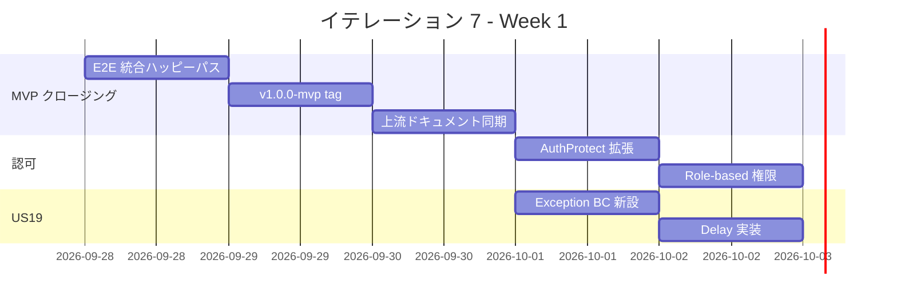

| 日 | タスク |
|----|--------|
| Day 1 (09-28) | 1.1 E2E 統合、1.2 v1.0.0-mvp tag |
| Day 2 (09-29) | 1.3-1.6 上流ドキュメント同期 |
| Day 3 (09-30) | 2.1-2.3 AuthProtect 拡張 + Role-based |
| Day 4 (10-01) | 3.1-3.2 Exception BC + Delay Command |
| Day 5 (10-02) | 3.3-3.6 Delay Postgres/View/テスト |

### Week 2 (Day 6-10): US20 / US17 / US22 / 保証系

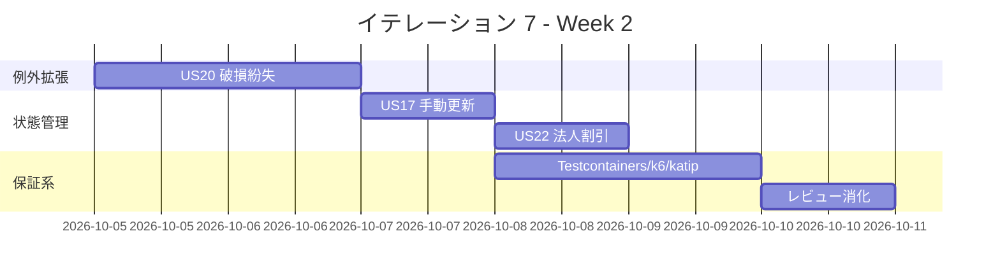

| 日 | タスク |
|----|--------|
| Day 6 (10-05) | 4.1-4.3 US20 Domain/App/Postgres |
| Day 7 (10-06) | 4.4-4.6 US20 View/通知/テスト |
| Day 8 (10-07) | 5.1-5.5 US17 手動更新一巡、6.1-6.5 US22 割引一巡 |
| Day 9 (10-08) | 7.1-7.3 Testcontainers、7.5-7.6 katip 移行 |
| Day 10 (10-11) | 7.4 k6 CI、8.1-8.4 上流補完 + レビュー消化、統合テスト、デモ準備 |

---

## 設計

### ドメインモデル (IT7 追加分)

> 注: BC 配置は `docs/design/domain-model.md` に準拠する。IT7 では **Exception BC (US19/US20)** を新規追加し、既存 **Tracking BC** に手動状態更新 (US17)、既存 **Shipper (Booking BC)** / **Pricing BC** に法人割引 (US22) を拡張する。Cross-BC 連携は **Text-based DTO による Cross-BC helper パターン** (ADR-0004 Rule 4 準拠、ADR-0012) で実装する。

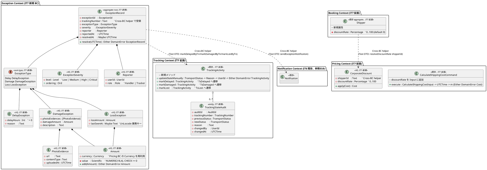

**Haskell 型定義 (主要)**:

```haskell
-- Exception/Domain/Model/ExceptionRecord.hs (T-03 純粋)
data ExceptionType
  = Delay  !DelayException
  | Damage !DamageException
  | Loss   !LossException
  deriving stock (Eq, Show)

data DelayException = DelayException
  { deDelayHours :: !Int         -- CHECK > 0
  , deReason     :: !Text
  } deriving stock (Eq, Show)

data DamageException = DamageException
  { daPhotos       :: ![PhotoEvidence]
  , daDamageAmount :: !Amount
  , daDescription  :: !Text
  } deriving stock (Eq, Show)

data LossException = LossException
  { loLossAmount :: !Amount
  , loLastSeenAt :: !(Maybe Text)   -- UnLocode 業務キー、Text で保持 (Rule 4)
  } deriving stock (Eq, Show)

data Level = Low | Medium | High | Critical
  deriving stock (Eq, Show, Ord, Enum, Bounded)

newtype ExceptionSeverity = ExceptionSeverity { unSeverity :: Level }
  deriving newtype (Eq, Show, Ord)

data Amount = Amount
  { amValue    :: !Scientific    -- NUMERIC(18,4)
  , amCurrency :: !Currency
  } deriving stock (Eq, Show)

addAmount :: Amount -> Amount -> Either DomainError Amount
addAmount a b
  | amCurrency a /= amCurrency b = Left (CurrencyMismatch (amCurrency a) (amCurrency b))
  | amValue a < 0 || amValue b < 0 = Left (InvalidAmount (amValue a) (amValue b))
  | otherwise = Right (Amount (amValue a + amValue b) (amCurrency a))

data ExceptionRecord = ExceptionRecord
  { erId             :: !ExceptionId
  , erTrackingNumber :: !Text           -- Cross-BC helper (Rule 4)
  , erType           :: !ExceptionType
  , erSeverity       :: !ExceptionSeverity
  , erReporter       :: !Reporter
  , erReportedAt     :: !UTCTime
  , erResolvedAt     :: !(Maybe UTCTime)
  } deriving stock (Eq, Show)

resolveException :: UTCTime -> ExceptionRecord -> Either DomainError ExceptionRecord
resolveException now er
  | isJust (erResolvedAt er) = Left ExceptionAlreadyResolved
  | otherwise = Right (er { erResolvedAt = Just now })

-- Exception/Application/RecordDelayExceptionCommand.hs
data RecordDelayExceptionInput = RecordDelayExceptionInput
  { rdeTrackingNumber :: !Text
  , rdeDelayHours     :: !Int
  , rdeReason         :: !Text
  , rdeSeverity       :: !Level
  , rdeReporter       :: !Reporter
  } deriving stock (Eq, Show)

execute
  :: ExceptionRepository m
  => TrackingCrossBcPort m         -- markDelayedByTn (Text DTO)
  => NotificationCrossBcPort m     -- sendExceptionNotification (Text DTO)
  => TxRunner m
  => RecordDelayExceptionInput -> UTCTime -> m (Either DomainError ExceptionId)
-- 単一 Tx: INSERT exception_record + Tracking 状態遷移 (TsDelayed) を統合。
-- 通知配信は Tx 完了後 (ADR-0012 副作用外出しポリシー)。

-- Tracking/Domain/Model/TrackingActivity.hs (IT7 追加メソッド)
updateStateManually
  :: TransportStatus  -- newStatus
  -> Text             -- reason
  -> UserId           -- changedBy
  -> UTCTime          -- now
  -> TrackingActivity
  -> Either DomainError (TrackingActivity, TrackingStateAudit)
updateStateManually newSt reason uid now ta
  | taTransportStatus ta == newSt = Left StateAlreadyMatches
  | Text.null reason              = Left ManualUpdateReasonRequired
  | otherwise =
      let updated = ta { taTransportStatus = newSt }
          audit   = TrackingStateAudit (mkAuditId now) (taTrackingNumber ta)
                                       (taTransportStatus ta) newSt reason uid now
      in Right (updated, audit)

-- Tracking (状態遷移追加)
markDelayed :: TrackingActivity -> Either DomainError TrackingActivity
markDelayed ta = case taTransportStatus ta of
  TsUnloaded -> Right (ta { taTransportStatus = TsDelayed })
  TsInPort   -> Right (ta { taTransportStatus = TsDelayed })
  _          -> Left (InvalidTrackingTransition (taTransportStatus ta) TsDelayed)
-- markDamaged / markLost も同様

-- Pricing/Domain/Model/Discount.hs (IT7 拡張)
data CorporateDiscount = CorporateDiscount
  { cdShipperId    :: !Text         -- Cross-BC helper で受領
  , cdDiscountRate :: !Percentage
  } deriving stock (Eq, Show)

applyCorporateDiscount :: CorporateDiscount -> Cost -> Cost
applyCorporateDiscount cd c =
  let p = unPercentage (cdDiscountRate cd)
  in c { costAmount = costAmount c * (100 - p) / 100 }

-- Pricing/Application/CalculateShippingCostCommand.hs (IT7 拡張)
data CalculateShippingCostInput = CalculateShippingCostInput
  { csciCargoType   :: !CargoType
  , csciWeight      :: !Scientific
  , csciDistance    :: !Scientific
  , csciOptions     :: ![OptionCode]
  , csciCurrency    :: !Currency
  , csciShipperId   :: !(Maybe Text)   -- IT7 追加: 割引適用対象
  } deriving stock (Eq, Show)
-- Shipper.discount_rate を CrossBc port で解決し applyCorporateDiscount を適用
```

### データモデル (IT7 追加分)

> IT7 では **`exception_record` / `tracking_state_audit` の 2 テーブル新規追加** + **`shipper.discount_rate` カラム追加** を行う。DelayException / DamageException / LossException は共通 `exception_record` に `exception_type` 判別 + JSONB `detail` で保持する (垂直分割よりも単一テーブル + 判別列を採用、ADR-0014 で検討)。

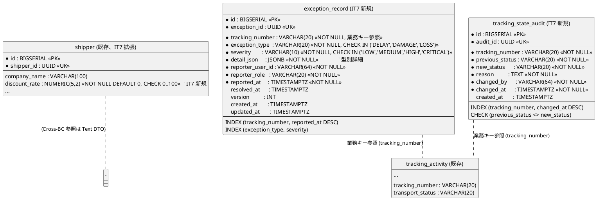

**規約準拠**:

- PK: `BIGSERIAL` サロゲート、業務キーは UUID + UK (data-model.md §1)
- FK: Cross-BC (Tracking BC) は業務キー (`tracking_number`) 参照、DB FK 制約は張らず Application 層で整合性確保 (Rule 4)
- 監査: `created_at` / `updated_at` 必須、`version` は楽観ロック用
- 精度: 金額 NUMERIC(18,4)、割引率 NUMERIC(5,2)、遅延時間 INT
- `exception_record.detail_json` は型別詳細 (DelayException / DamageException / LossException) を JSONB 保持、hedgehog property でスキーマ検証

**DDL (IT7 マイグレーション、3 本)**: 「DB マイグレーション順序」節に掲載。

### モジュール構造 (IT7 追加)

```text
apps/cargo-tracker/src/
  Cargotracker/
    Exception/                                   -- IT7 新規 BC (US19/US20)
      Domain/
        Model/
          ExceptionRecord.hs                     -- Aggregate root
          ExceptionType.hs                       -- sum type (Delay/Damage/Loss)
          ExceptionSeverity.hs                   -- VO
          PhotoEvidence.hs                       -- VO
          Amount.hs                              -- VO (Pricing.Currency 再利用)
          Reporter.hs                            -- VO
        Error.hs                                 -- ExceptionError
      Application/
        RecordDelayExceptionCommand.hs           -- US19
        RecordDamageExceptionCommand.hs          -- US20a
        RecordLossExceptionCommand.hs            -- US20b
        ResolveExceptionCommand.hs               -- 解決記録
        Port/
          ExceptionRepository.hs
          TrackingCrossBcPort.hs                 -- markDelayed/Damaged/Lost ByTn
          NotificationCrossBcPort.hs             -- sendExceptionNotification
      Infrastructure/
        Repository/
          PostgresExceptionRepository.hs
      Interfaces/
        Http/
          ExceptionListHandler.hs                -- GET /exceptions
          RecordExceptionHandler.hs              -- POST /exceptions/{type}
          ExceptionDetailHandler.hs              -- GET /exceptions/{id}

    Tracking/                                    -- 既存 (IT7 拡張)
      Domain/
        Model/
          TrackingActivity.hs                    -- updateStateManually + markDelayed/Damaged/Lost 追加
          TrackingStateAudit.hs                  -- IT7 新規 Entity
      Application/
        ManualStateUpdateCommand.hs              -- US17
        Port/
          TrackingStateAuditRepository.hs
      Infrastructure/
        Repository/
          PostgresTrackingStateAuditRepository.hs

    Pricing/                                     -- 既存 (IT7 拡張)
      Domain/
        Model/
          Discount.hs                            -- CorporateDiscount VO 追加
      Application/
        CalculateShippingCostCommand.hs          -- shipperId + discountRate 拡張
        Port/
          ShipperCrossBcPort.hs                  -- resolveDiscountRate (Text DTO)

    Booking/                                     -- 既存 (IT7 拡張)
      Domain/
        Model/
          Shipper.hs                             -- discountRate 属性追加
      Infrastructure/
        Repository/
          PostgresShipperRepository.hs           -- discount_rate カラム対応

    Shared/
      Auth/
        AuthProtect.hs                           -- IT6 既存
        Roles.hs                                 -- IT7 追加: Shipper/Sales/Handler/Tracker/Admin
        RolePolicy.hs                            -- IT7 追加: エンドポイント × Role マトリクス
      CrossBc/
        ExceptionToTrackingHelper.hs             -- Exception → Tracking
        ExceptionToNotificationHelper.hs         -- Exception → Notification
        ShipperToPricingHelper.hs                -- Shipper.discountRate → Pricing
      Infrastructure/
        Logging.hs                               -- IT7: katip 移行 (T6-07)
        Testcontainers.hs                        -- IT7 新規 (T6-05)

db/migrations/
  20260928100000_add_shipper_discount_rate.sql
  20260928100100_create_exception_record.sql
  20260928100200_create_tracking_state_audit.sql

test/
  Integration/
    RecordDelayExceptionSpec.hs                  -- US19
    RecordDamageExceptionSpec.hs                 -- US20a
    RecordLossExceptionSpec.hs                   -- US20b
    ManualStateUpdateSpec.hs                     -- US17 (Role 403 含む)
    CalculateShippingCostWithDiscountSpec.hs     -- US22
    RolePolicySpec.hs                            -- T6-09 認可マトリクス
  Testcontainers/
    PostgresPricingRuleContainerSpec.hs          -- T6-05
    PostgresCurrencyRateContainerSpec.hs
    PostgresNotificationContainerSpec.hs
    PostgresExceptionContainerSpec.hs
e2e/
  it7-exception-happy-path.spec.ts               -- 遅延登録→通知→解決
  it7-manual-state-update.spec.ts                -- US17 権限テスト
  it7-corporate-discount.spec.ts                 -- US22 割引適用

ops/scripts/
  k6-smoke.js                                    -- T6-06 CI スモーク負荷
```

### URL 設計 (IT7 追加)

| メソッド | パス | 認可 | 用途 |
| :--- | :--- | :--- | :--- |
| GET  | `/exceptions` | AuthProtect (Handler/Tracker/Admin) | US19/US20: 例外一覧 (フィルタ: 種別/重要度/状態) |
| GET  | `/exceptions/:id` | AuthProtect (Handler/Tracker/Admin) | US19/US20: 例外詳細 |
| POST | `/exceptions/delay` | AuthProtect (Handler/Tracker) | US19: 遅延例外登録 (htmx PRG 303) |
| POST | `/exceptions/damage` | AuthProtect (Handler/Tracker) | US20: 破損例外登録 |
| POST | `/exceptions/loss` | AuthProtect (Handler/Tracker) | US20: 紛失例外登録 |
| POST | `/exceptions/:id/resolve` | AuthProtect (Tracker/Admin) | 例外解決記録 |
| GET  | `/tracking/:tn/manual-update` | AuthProtect (Tracker/Admin) | US17: 手動更新フォーム (htmx フラグメント) |
| POST | `/tracking/:tn/manual-update` | AuthProtect (Tracker/Admin) | US17: 手動状態更新 + 監査ログ (PRG 303) |
| GET  | `/tracking/:tn/audit-history` | AuthProtect (Tracker/Admin) | US17: 監査履歴タブ |

**AuthProtect 適用範囲拡張 (T6-09)**:

- 追加適用: `/exceptions/*` / `/tracking/*/manual-update` / `/tracking/*/audit-history`
- 追加適用 (IT6 積み残し): `/bookings/:id/confirm` / `/bookings/:id/cancel` / `/bookings/:id/link-itinerary` / `/bookings/:id/unlink-itinerary` / `/itineraries/evaluate`
- Role 判定: `Shared.Auth.RolePolicy.requireOneOf [Handler, Tracker, Admin]` を Servant `AuthProtect` に組み込み、Servant Handler 内で `checkRole` を呼ぶ 2 段構え
- Role 不足 → 403、Cookie なし → 401 (JSON) / 303 (HTML) (IT6 既定)

### ユーザーインターフェース

#### ビュー

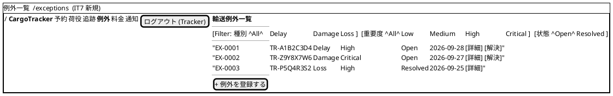

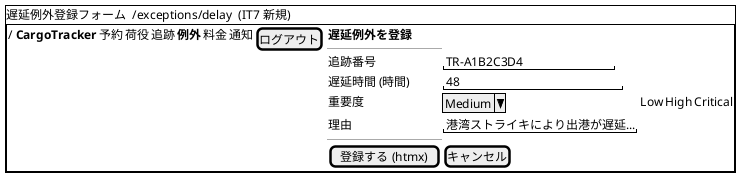

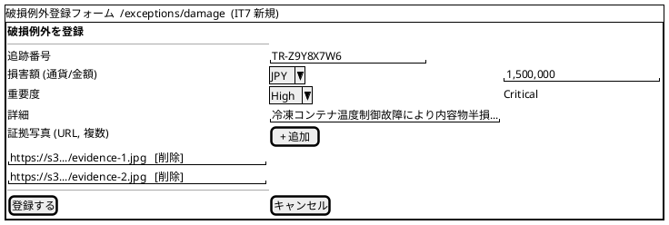

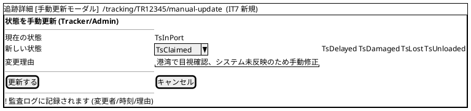

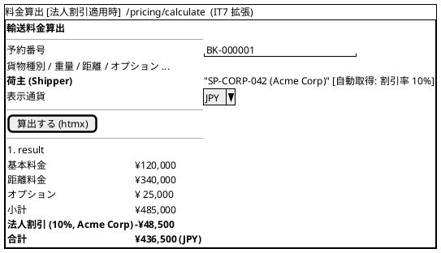

#### インタラクション

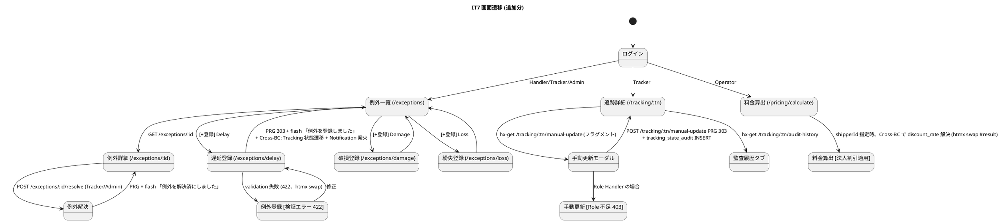

**htmx パターン (IT7 適用箇所)**:

| 画面 | パターン | エンドポイント |
| :--- | :--- | :--- |
| 例外登録フォーム | フォーム送信 → 検証エラーは swap で表示 | `hx-post="/exceptions/delay"` → `hx-target="#form-error"` → `hx-swap="outerHTML"` (422 時) / 303 (成功時) |
| 例外一覧 (フィルタ) | セレクト変更で再描画 | `hx-get="/exceptions?type=delay&severity=high"` → `hx-target="#exception-list"` |
| 例外解決 | ボタン + 確認 | `hx-post="/exceptions/:id/resolve"` → PRG (303) |
| 手動更新モーダル | ボタン → フラグメント取得 | `hx-get="/tracking/:tn/manual-update"` → `hx-target="#modal-slot"` → `hx-swap="innerHTML"` |
| 監査履歴タブ | タブクリックで遅延取得 | `hx-get="/tracking/:tn/audit-history"` → `hx-target="#audit-panel"` |
| 料金算出 (割引適用) | shipperId 変更で再算出 | `hx-post="/pricing/calculate"` → `hx-target="#result"` (割引明細を含む部分 HTML) |

**フィードバック規約 (IT7 追加)**:

- 成功 (`alert-success`): 「例外を登録しました (追跡番号: <tn>, 種別: <type>)」/「状態を手動更新しました (前: <prev> → 新: <new>)」/「法人割引 <rate>% を適用しました」
- 警告 (`alert-warning`): 「重要度が Critical です。関係者へ通知が発火されました」
- エラー (`alert-danger`): 「遅延時間は正の整数である必要があります」/「損害額に負の値は指定できません」/「この操作を行う権限がありません (要求: Tracker/Admin)」/「変更理由は必須です」

### API 設計

**Servant Endpoint 型定義 (Haskell)**:

```haskell
-- Exception/Interfaces/Http/ExceptionApi.hs (IT7 新規)
type ExceptionApi
  =    "exceptions"
       :> AuthProtect "session"
       :> QueryParam "type" ExceptionTypeFilter
       :> QueryParam "severity" Level
       :> QueryParam "state" ExceptionState
       :> Get '[HTML] (Html ())
  :<|> "exceptions" :> Capture "id" ExceptionId
       :> AuthProtect "session"
       :> Get '[HTML] (Html ())
  :<|> "exceptions" :> "delay"
       :> AuthProtect "session"
       :> ReqBody '[FormUrlEncoded] RecordDelayExceptionForm
       :> Post '[HTML] (Html ())
  :<|> "exceptions" :> "damage"
       :> AuthProtect "session"
       :> ReqBody '[FormUrlEncoded] RecordDamageExceptionForm
       :> Post '[HTML] (Html ())
  :<|> "exceptions" :> "loss"
       :> AuthProtect "session"
       :> ReqBody '[FormUrlEncoded] RecordLossExceptionForm
       :> Post '[HTML] (Html ())
  :<|> "exceptions" :> Capture "id" ExceptionId :> "resolve"
       :> AuthProtect "session"
       :> PostNoContent

-- Tracking/Interfaces/Http/ManualUpdateApi.hs (IT7 新規)
type ManualUpdateApi
  =    "tracking" :> Capture "tn" TrackingNumber :> "manual-update"
       :> AuthProtect "session"
       :> Header "HX-Request" Text
       :> Get '[HTML] (Html ())
  :<|> "tracking" :> Capture "tn" TrackingNumber :> "manual-update"
       :> AuthProtect "session"
       :> ReqBody '[FormUrlEncoded] ManualStateUpdateForm
       :> Post '[HTML] (Html ())
  :<|> "tracking" :> Capture "tn" TrackingNumber :> "audit-history"
       :> AuthProtect "session"
       :> Get '[HTML] (Html ())

-- Role-based 認可 (Shared.Auth.RolePolicy)
type RolePolicy = Map (Method, PathTemplate) (NonEmpty Role)

requireOneOf :: NonEmpty Role -> AuthenticatedUser -> Handler ()
requireOneOf allowed user
  | userRole user `elem` allowed = pure ()
  | otherwise = throwError err403 { errBody = "insufficient role" }
```

### アプリケーション層シーケンス

#### RecordDelayExceptionCommand (US19)

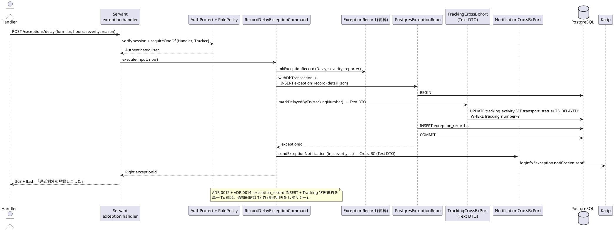

#### ManualStateUpdateCommand (US17)

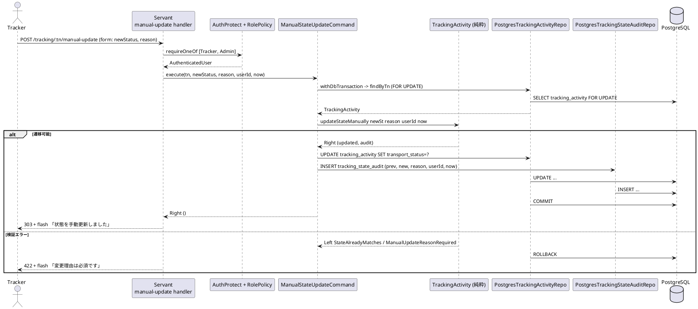

#### CalculateShippingCostCommand (US22 割引適用フロー)

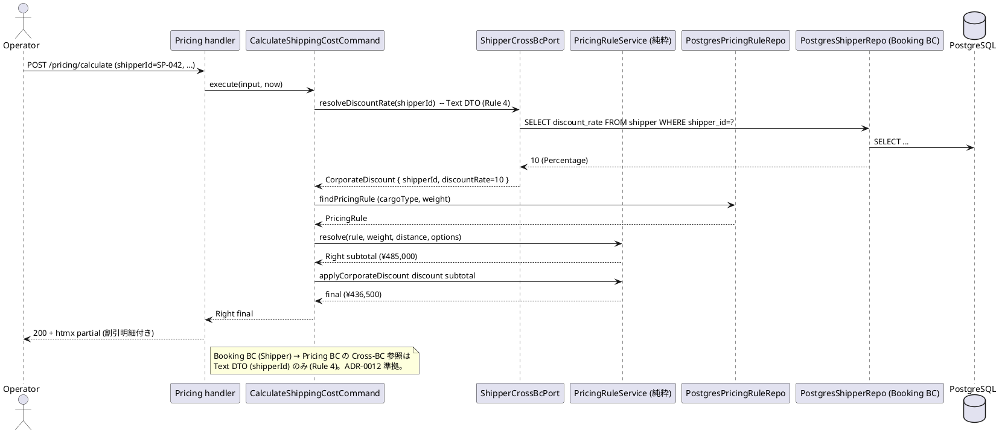

### トランザクション境界

ADR-0012 (IT6 採用) を継承し、IT7 で **ADR-0014 (例外処理の状態遷移ポリシー)** を新規策定する。

| ルール | 適用 |
| :--- | :--- |
| **T-01 (Application で `withDbTransaction`)** | `RecordDelayExceptionCommand` (exception_record + tracking_activity 単一 Tx) / `RecordDamageExceptionCommand` (同) / `RecordLossExceptionCommand` (同) / `ManualStateUpdateCommand` (tracking_activity + tracking_state_audit 単一 Tx) / `CalculateShippingCostCommand` は Tx 不要 (読み取り + 純粋計算のみ) |
| **T-02 (Repository は IO のみ)** | `PostgresExceptionRepository` / `PostgresTrackingStateAuditRepository` は `Connection -> IO ()` のみ、Tx 開始禁止 |
| **T-03 (Domain は IO 完全排除)** | `ExceptionRecord.resolveException` / `TrackingActivity.updateStateManually` / `TrackingActivity.markDelayed` / `applyCorporateDiscount` は純粋 `Either DomainError a` |
| **ADR-0012 継承: Cross-BC 参照は Text DTO のみ** | `ExceptionToTrackingHelper` (`markDelayedByTn`) は `trackingNumber :: Text` を受領。Exception BC が `Cargotracker.Tracking.Domain.*` を直接 import しない (Rule 4) |
| **ADR-0012 継承: 副作用は Tx 外** | Exception 登録時の Notification 通知配信は exception_record + tracking_activity Tx 完了後に実行 (ADR-0012) |
| **ADR-0014 新規: Exception → Tracking 状態遷移ポリシー** | (1) DelayException → `TsDelayed` (元 TsUnloaded/TsInPort/TsClaimed のみ)、(2) DamageException → `TsDamaged` (どの状態からも遷移可)、(3) LossException → `TsLost` (どの状態からも遷移可)、(4) `TsDelivered` からは遷移不可 |
| **ADR-0014 新規: exception_record + tracking_activity は単一 Tx** | 例外の記録と Tracking 状態遷移は不可分。Tx 中断時は例外未登録 + 状態未変更 (整合性を強制) |
| **ADR-0014 新規: Cargo.status (Booking BC) 波及は US23 精算 (IT8) に持ち越し** | Exception 発生時の Booking BC 側 (例: 予約自動キャンセル、精算保留) は IT8 で対応。IT7 では Tracking のみ更新 |

### エラー処理戦略

IT6 の `PricingError` / `NotificationError` / `AuthError` に加え、IT7 で `ExceptionError` を新規追加、`TrackingError` に手動更新関連エラーを追加、`AuthError` に `InsufficientRole` の詳細化を行う。

```haskell
-- Exception/Domain/Error.hs (IT7 新規)
data ExceptionError
  = ExceptionNotFound !ExceptionId                       -- US19/20: 404
  | ExceptionAlreadyResolved                             -- US19/20: 409
  | InvalidDelayHours !Int                               -- US19: 422 (<=0)
  | InvalidAmount !Scientific !Scientific                -- US20: 422 (負値)
  | InvalidPhotoEvidenceUrl !Text                        -- US20: 422
  | InvalidTrackingTransition !TransportStatus !TransportStatus  -- ADR-0014: 422
  | ExceptionDetailJsonInvalid !Text                     -- US19/20: 422
  deriving stock (Eq, Show)

-- Tracking/Domain/Error.hs (IT7 追加)
data TrackingError
  = ...
  | StateAlreadyMatches                                  -- US17: 422
  | ManualUpdateReasonRequired                           -- US17: 422
  | InvalidTrackingTransition !TransportStatus !TransportStatus  -- US17: 422
  | InsufficientRoleForManualUpdate !Role                -- US17: 403 (Handler → 403)

-- Shared/Auth/Error.hs (IT7 追加)
data AuthError
  = MissingSessionCookie                                 -- 既存
  | InvalidSession !SessionId                            -- 既存
  | InsufficientRole { requiredAny :: !(NonEmpty Role)
                     , actual :: !Role
                     , path :: !Text }                   -- IT7 拡張: 詳細化
```

**HTTP マッピング (IT7 追加)**:

| Error | HTTP | フラッシュメッセージ例 |
| :--- | :--- | :--- |
| `ExceptionNotFound` | 404 | 「該当する例外が見つかりません」 |
| `ExceptionAlreadyResolved` | 409 | 「この例外は既に解決済です」 |
| `InvalidDelayHours` | 422 | 「遅延時間は正の整数である必要があります」 |
| `InvalidAmount` | 422 | 「損害額に負の値は指定できません」 |
| `InvalidPhotoEvidenceUrl` | 422 | 「証拠写真の URL が正しくありません」 |
| `InvalidTrackingTransition` (Exception) | 422 | 「配達完了 (TsDelivered) から <target> へは遷移できません」 |
| `StateAlreadyMatches` (US17) | 422 | 「同一状態への変更はできません」 |
| `ManualUpdateReasonRequired` (US17) | 422 | 「変更理由は必須です」 |
| `InsufficientRoleForManualUpdate` (US17) | 403 | 「手動状態更新には Tracker または Admin 権限が必要です」 |
| `InsufficientRole` (詳細版) | 403 | 「この操作には <required> 権限が必要です (現在: <actual>)」 |

### DB マイグレーション順序 (IT7)

IT6 の 017 を前提に、IT7 では **3 マイグレーション** を投入する。

| 順序 | ファイル | 内容 | 依存 |
| :--- | :--- | :--- | :--- |
| 018 | `20260928100000_add_shipper_discount_rate.sql` | `shipper.discount_rate NUMERIC(5,2) NOT NULL DEFAULT 0` カラム追加 | 独立 (既存 shipper) |
| 019 | `20260928100100_create_exception_record.sql` | `exception_record` 新規作成 (JSONB detail、tracking_number 業務キー参照) | 独立 |
| 020 | `20260928100200_create_tracking_state_audit.sql` | `tracking_state_audit` 新規作成 (tracking_number 業務キー参照) | 独立 |

> **既存 `tracking_activity` の変更なし**: 状態遷移は `transport_status` カラム (IT5 既存) の値集合拡張のみ (`TS_DELAYED` / `TS_DAMAGED` / `TS_LOST` を追加)。CHECK 制約が存在する場合は ALTER で追加。

**DDL 例 (018)**:

```sql
-- db/migrations/20260928100000_add_shipper_discount_rate.sql
-- migrate:up
ALTER TABLE shipper
  ADD COLUMN discount_rate NUMERIC(5,2) NOT NULL DEFAULT 0
    CHECK (discount_rate >= 0 AND discount_rate <= 100);
CREATE INDEX idx_shipper_discount_rate ON shipper (discount_rate) WHERE discount_rate > 0;
-- migrate:down
ALTER TABLE shipper DROP COLUMN discount_rate;
```

**DDL 例 (019)**:

```sql
-- db/migrations/20260928100100_create_exception_record.sql
-- migrate:up
CREATE TABLE exception_record (
    id                BIGSERIAL PRIMARY KEY,
    exception_id      UUID NOT NULL UNIQUE,
    tracking_number   VARCHAR(20) NOT NULL,
    exception_type    VARCHAR(20) NOT NULL CHECK (exception_type IN ('DELAY','DAMAGE','LOSS')),
    severity          VARCHAR(10) NOT NULL CHECK (severity IN ('LOW','MEDIUM','HIGH','CRITICAL')),
    detail_json       JSONB NOT NULL,
    reporter_user_id  VARCHAR(64) NOT NULL,
    reporter_role     VARCHAR(20) NOT NULL,
    reported_at       TIMESTAMPTZ NOT NULL,
    resolved_at       TIMESTAMPTZ,
    version           INTEGER NOT NULL DEFAULT 0,
    created_at        TIMESTAMPTZ NOT NULL DEFAULT NOW(),
    updated_at        TIMESTAMPTZ NOT NULL DEFAULT NOW()
);
CREATE INDEX idx_exception_by_tn ON exception_record (tracking_number, reported_at DESC);
CREATE INDEX idx_exception_by_type_severity ON exception_record (exception_type, severity);
-- migrate:down
DROP TABLE exception_record;
```

### テスト戦略

| 層 | テスト種別 | 追加件数 (目標) |
| :--- | :--- | ---: |
| Domain | hspec | `ExceptionRecord.resolve` 状態遷移 (4) / `Amount.add` 通貨不一致・負値 (4) / `TrackingActivity.updateStateManually` (5) / `TrackingActivity.markDelayed/Damaged/Lost` 遷移可否 (6) / `applyCorporateDiscount` (3) |
| Domain | hedgehog (property) | 割引後 ≤ 元価格 / Severity の順序性 (Low < Medium < High < Critical) / Amount の非負性 / 状態遷移の冪等性 (同じ status への遷移は Left) |
| Application | hspec | `RecordDelayExceptionCommand` (5: 通常/Tx ロールバック/Tracking 遷移不可/通知失敗許容/検証エラー) / `RecordDamageExceptionCommand` (4) / `RecordLossExceptionCommand` (3) / `ManualStateUpdateCommand` (5: Tracker OK / Admin OK / Handler 403 / 同一状態 422 / 理由なし 422) / `CalculateShippingCostCommand` 拡張 (3: shipperId なし / 割引率 0 / 割引率 10) |
| Infrastructure | hspec (testcontainers, T6-05) | `PostgresPricingRuleRepository` CRUD + weight range 検索 (3) / `PostgresCurrencyRateRepository` valid_at 検索 (3) / `PostgresNotificationRepository` status 遷移 (3) / `PostgresExceptionRepository` JSONB detail 検索 (3) |
| Interfaces (HTTP) | hspec-wai | **T6-09 RolePolicy**: エンドポイント × Role マトリクス自動生成 (20+) / `ExceptionApi` (POST delay/damage/loss + list/detail/resolve、8) / `ManualUpdateApi` (Tracker OK / Handler 403 / Reason 422、3) / `CalculateShippingCost + discount` (2) |
| Interfaces | hspec-wai (Cross-BC 検証) | ExceptionToTrackingHelper が Tracking BC の Text DTO のみ使用することを import 検査 (arch-check Rule 4 で自動化) |
| E2E | Playwright | `it7-exception-happy-path.spec.ts` (Handler が遅延登録 → Tracking 状態変更 → 通知配信) / `it7-manual-state-update.spec.ts` (Tracker OK / Handler 403) / `it7-corporate-discount.spec.ts` (割引明細表示) / IT6 統合ハッピーパス 1 本 (T6-01) |
| 負荷 | k6 (T6-06) | スモーク: `POST /pricing/calculate` × 5 rps × 30s、P95 < 500ms |
| Contract | 既存継続 | 通関 / 料金 ACL Circuit Breaker |
| アーキテクチャ | arch-check Rule 1-6 | **Rule 4 違反 0**: `Exception.*` が `Cargotracker.Tracking.Domain.*` を import しない検証 / Cross-BC helper が `Shared/CrossBc/` にのみ配置 |
| カバレッジ | HPC | Domain ≥ 95% / 全体 ≥ 75% (継続) |

**property テスト例 (US22 割引の単調性)**:

```haskell
prop_discountReducesCost :: Property
prop_discountReducesCost = property $ do
  base    <- forAll genCost
  rate    <- forAll (Percentage <$> Gen.scientific (Range.linear 0 100))
  let discount = CorporateDiscount "SP-TEST" rate
      final    = applyCorporateDiscount discount base
  costAmount final <= costAmount base === True
  when (rate > Percentage 0) $
    costAmount final < costAmount base === True
```

**hspec-wai 統合テスト例 (US17 権限マトリクス)**:

```haskell
spec :: Spec
spec = withApp $ do
  describe "POST /tracking/:tn/manual-update" $ do
    it "returns 303 for Tracker" $ do
      cookie <- loginAs "tracker@example.com" Tracker
      request "POST" "/tracking/TR-A1B2/manual-update"
              [("Cookie", cookie)] "newStatus=TS_CLAIMED&reason=fix"
        `shouldRespondWith` 303
    it "returns 403 for Handler" $ do
      cookie <- loginAs "handler@example.com" Handler
      request "POST" "/tracking/TR-A1B2/manual-update"
              [("Cookie", cookie)] "newStatus=TS_CLAIMED&reason=fix"
        `shouldRespondWith` 403
    it "returns 422 without reason" $ do
      cookie <- loginAs "tracker@example.com" Tracker
      request "POST" "/tracking/TR-A1B2/manual-update"
              [("Cookie", cookie)] "newStatus=TS_CLAIMED&reason="
        `shouldRespondWith` 422 { matchBody = bodyContainsText "変更理由は必須です" }
```

### CI 統合

`.github/workflows/ci.yml` に IT7 で追加/更新するステップ:

```yaml
- name: hspec-wai 統合テスト (IT7 追加分)
  working-directory: apps/cargo-tracker
  run: nix-shell ../../$NIX_SHELL --run \
       "stack test --test-arguments='--match \"Exception|ManualStateUpdate|RolePolicy|CalculateShippingCostWithDiscount\"'"

- name: arch-check Rule 4 (Exception BC の Cross-BC 検証、T-01/T-02/T-03 継続)
  run: |
    ! grep -rE "^import (qualified )?Cargotracker\.(Tracking|Handling|Booking|Notification|Pricing)\.Domain" \
        apps/cargo-tracker/src/Cargotracker/Exception/
    # Cross-BC helper 配置検証
    for f in ExceptionToTrackingHelper ExceptionToNotificationHelper ShipperToPricingHelper; do
      test -f apps/cargo-tracker/src/Cargotracker/Shared/CrossBc/${f}.hs \
        || (echo "Cross-BC helper 未配置: ${f}" && exit 1)
    done

- name: RolePolicy 適用検出 (T6-09)
  run: |
    for path in "exceptions" "tracking.*manual-update" "tracking.*audit-history"; do
      grep -l "\"${path%/*}\"" apps/cargo-tracker/src/Cargotracker/*/Interfaces/Http/*.hs \
        | xargs grep -L "requireOneOf\|AuthProtect \"session\"" \
        && (echo "RolePolicy 未適用: /${path}/*" && exit 1)
    done

- name: Testcontainers 統合テスト (T6-05)
  working-directory: apps/cargo-tracker
  run: nix-shell ../../$NIX_SHELL --run \
       "stack test cargo-tracker:testcontainers --test-arguments='+RTS -N2'"

- name: k6 smoke (T6-06、P95 < 500ms)
  run: |
    docker compose -f ops/compose.ci.yml up -d
    k6 run --summary-export=k6-summary.json ops/scripts/k6-smoke.js
    p95=$(jq '.metrics.http_req_duration.values["p(95)"]' k6-summary.json)
    awk -v p=$p95 'BEGIN { exit (p >= 500) }' \
      || (echo "P95 SLA 違反: ${p95}ms" && exit 1)

- name: katip 移行検証 (T6-07)
  working-directory: apps/cargo-tracker
  run: |
    grep -qE "^import Katip" src/Cargotracker/Shared/Infrastructure/Logging.hs \
      || (echo "katip が Logging に統合されていません" && exit 1)
    # 自作 JSON Lines 廃止
    ! grep -rE "aeson-pretty|Data\.Aeson\.Encode\.Pretty" src/Cargotracker/Shared/Infrastructure/Logging.hs

- name: HPC ゲート 75% (継続)
  working-directory: apps/cargo-tracker
  run: |
    nix-shell ../../$NIX_SHELL --run "stack test --coverage"
    total=$(nix-shell ../../$NIX_SHELL --run "stack hpc report" \
            | awk '/expressions used/ {gsub("%",""); print $4}')
    [ "$total" -ge 75 ] || (echo "全体カバレッジ不足: ${total}%" && exit 1)

- name: Playwright E2E (IT7 + IT6 統合)
  working-directory: e2e
  run: npx playwright test --grep '@it6-mvp|@it7|@us17|@us19|@us20|@us22'
```

- リリースタグ `v1.0.0-mvp` を IT7 冒頭で作成 (T6-03)
- CHANGELOG `[Unreleased]` → `[1.0.0-mvp]` セクション切出し (T6-03)、次期 `[Unreleased]` を IT7 用に開放

### ADR

| ADR | タイトル | ステータス |
|-----|---------|-----------|
| [ADR-0004](../adr/0004-arch-check-rules.md) | arch-check 4 ルール (Rule 4: BC 間 Domain 直接参照禁止) | 採用済、IT7 で Exception BC に継続適用 |
| [ADR-0010](../adr/0010-session-cookie-auth.md) | セッション認証方式 | 採用、**IT7 で Role-based 拡張節を追記** (T6-09、Shipper/Sales/Handler/Tracker/Admin マトリクス) |
| [ADR-0012](../adr/0012-tx-boundary-and-cross-bc.md) | Tx 境界と Cross-BC 参照ポリシー | 採用済 (IT6)、IT7 で Exception BC に継続適用 |
| **ADR-0013** (IT7 新規起票) | **Notification updateNotification 主キー設計** | 提案 (T6-08): 現状 `booking_id + created_at` 複合キーの衝突リスク解消。`id` サロゲート追加 or 明示的な複合 UNIQUE 制約の 2 案を比較 |
| **ADR-0014** (IT7 新規起票) | **例外処理の状態遷移ポリシー (Exception → Tracking)** | 提案 → IT7 で採用: (1) exception_record + tracking_activity 単一 Tx、(2) DelayException → TsDelayed の遷移元制限、(3) TsDelivered からは遷移不可、(4) Cargo.status 波及は US23 精算 (IT8) に持ち越し、(5) exception_record を単一テーブル + JSONB detail_json で保持 (垂直分割回避) |

**ADR-0014 骨子 (起票時のテンプレ)**:

```markdown
# ADR-0014: 例外処理の状態遷移ポリシー (Exception → Tracking)

## Status
Proposed (2026-09-28, IT7)

## Context
US19 (遅延) / US20 (破損・紛失) の実装で、例外の記録 (exception_record) と
Tracking 状態遷移 (tracking_activity.transport_status) をどう連携するかが論点。
- Tx 境界 (単一 Tx vs 分離)
- 状態遷移の可否 (TsDelivered から Delayed に戻れるか)
- BC 間参照方針 (Rule 4 遵守)

## Decision
1. exception_record + tracking_activity は単一 Tx 統合 (整合性強制)
2. DelayException → TsDelayed は TsUnloaded/TsInPort/TsClaimed からのみ
3. DamageException / LossException はどの状態からも遷移可 (ただし TsDelivered を除く)
4. Cross-BC 参照は Text DTO (`markDelayedByTn trackingNumber :: Text`)
5. Cargo.status (Booking BC) 波及は US23 精算 (IT8) に持ち越し
6. exception_record は単一テーブル + JSONB detail (垂直分割回避、検索性維持)

## Consequences
- 良: 整合性強制、Rule 4 遵守、JSONB で型別詳細を柔軟保持
- 悪: JSONB スキーマ検証は Application 層に依存 (hedgehog property で担保)
- 補: Cargo.status 波及の遅延は US23 で精算ロジックと合わせて実装
```

---

## リスクと対策

| リスク | 影響度 | 対策 |
|--------|--------|------|
| 22 SP は IT6 平均 30 SP より控えめだが本体 4 ストーリー + 保証系は密度が高い | 中 | US22 (2 SP) / US17 (2 SP) は Domain/View が軽い。US19/US20 の共通抽象化で工数削減 |
| Testcontainers 導入で CI 時間が伸びる | 中 | 統合テストは専用 sbt / stack test スイート化し PR checks はスモーク限定 |
| katip 移行で既存 641 tests に影響 | 中 | Logging インターフェースを一段挟み、段階移行 (interface → katip 実装差替え) |
| Exception BC が Handling / Tracking / Notification に多方面連携 | 高 | Text-based Cross-BC helper で Rule 4 違反を予防、ADR-0012 準拠 |
| Role-based 権限の適用漏れ (403 vs 200 の実装差) | 高 | hspec-wai で各エンドポイント × 各 Role の網羅テストを Support.RoleMatrix で自動生成 |

---

## 完了条件

### Definition of Done

- [ ] コードレビュー完了 (developing-review を IT 末尾で実施)
- [ ] hspec / hspec-wai / hedgehog 全緑 (想定 641 → 780+ tests)
- [ ] Playwright E2E 統合ハッピーパス緑
- [ ] fourmolu / hlint / arch-check (Rule 1-6 + T-01) 違反 0 件
- [ ] Testcontainers 統合テスト 4 Repository 緑
- [ ] k6 スモーク (P95 < 500ms) が CI で緑
- [ ] HPC カバレッジ 75% ゲート維持
- [ ] domain-model / data-model / ui_design が実装と同期
- [ ] CHANGELOG `[Unreleased]` に IT7 差分を記載
- [ ] v1.0.0-mvp git tag 作成 (Week 1)

### デモ項目

1. E2E ハッピーパス: 予約 → 経路 → 追跡 → 荷役 → 引取 → 料金 → 引取通知の一連
2. 遅延例外: Handler が RecordDelayException → Tracking が Delayed に遷移 → 荷主/セールスへ通知
3. 破損例外: PhotoEvidence + 損害額付きで登録 → Tracking が Damaged に遷移 → 損害額集計表示
4. 手動状態更新: Tracker が Tracking 状態を手動修正 → 監査ログに記録 → Handler は 403
5. 法人割引: Shipper.discountRate = 10% で CalculateShippingCost → 元価格 - 割引額 = 最終価格

---

## 更新履歴

| 日付 | 更新内容 | 更新者 |
|------|---------|--------|
| 2026-07-03 | 初版作成 (IT6 完了報告書 / retrospective-6 の Try を反映) | AI Agent |

---

## 関連ドキュメント

- [IT6 完了報告書](./iteration_report-6.md)
- [IT6 ふりかえり](./retrospective-6.md)
- [リリース計画](./release_plan.md)
- ADR-0012 (Tx 境界と Cross-BC 参照ポリシー、IT6 採用)
- ADR-0010 (Session Cookie 認証、IT7 Role-based 節追記)
- docs/review/it6_nav_e2e_review_20260702.md (IT6 developing-review レポート)
