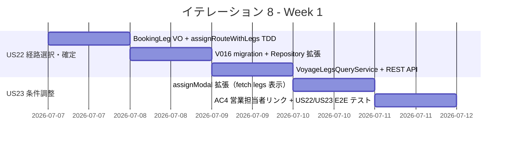
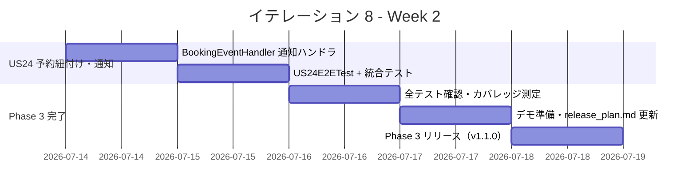
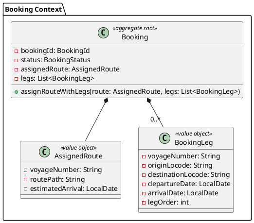
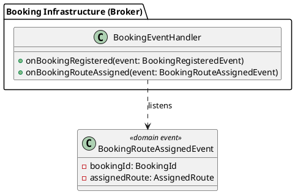
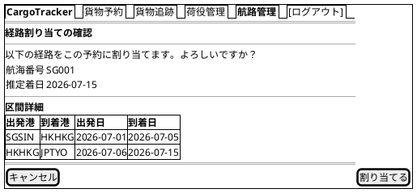
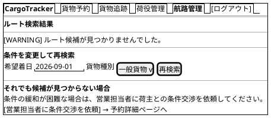
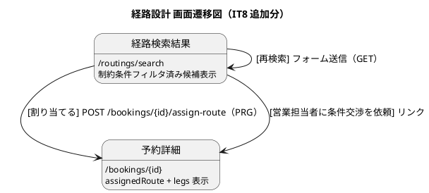

# イテレーション 8 計画

## 概要

| 項目 | 内容 |
|------|------|
| **イテレーション** | 8 |
| **期間** | Week 15-16（2026-07-07〜2026-07-20） |
| **ゴール** | 経路選択・確定・条件調整・再算出・予約紐付け・通知を完成させ、Phase 3（経路設計高度化）をリリースする |
| **目標 SP** | 8 |

---

## ゴール

### イテレーション終了時の達成状態

1. **経路を選択・確定する（US22）**: 経路設計者が経路候補一覧から最適な経路を選択し、経由港・航海番号・出発日・到着日の詳細を確認した上で確定・保存できる
2. **経路条件を調整して再算出する（US23）**: 最適な経路候補が見つからない場合に、期限・貨物種別等の条件を調整して経路候補を再算出できる。調整不能時は営業担当者への交渉依頼ができる
3. **経路情報を予約に紐付ける（US24）**: 確定した経路情報を貨物予約に紐付け、営業担当者と荷主にアプリ内ログ通知が送信される

### 成功基準

- [x] 経路候補一覧の各候補に「この予約に割り当てる」ボタンが表示され、モーダルで経由港・出発日・到着日の詳細を確認できる
- [x] 経路確定操作で経路情報（航海番号・区間詳細）が `booking_legs` テーブルに保存される
- [x] 経路候補が見つからない場合、条件調整フォーム（期限・貨物種別変更）と「営業担当者に交渉を依頼」リンクが表示される
- [x] 経路紐付け完了後、`BookingRouteAssignedEvent` ハンドラが起動し、営業担当者・荷主への通知ログが記録される
- [x] backend テスト GREEN・カバレッジ 89.8%（目標 80% 超）
- [x] E2E テスト（`US22E2ETest`・`US23E2ETest`・`US24E2ETest`）全件 GREEN
- [x] SonarQube Quality Gate PASS（new_violations: 0）

---

## ユーザーストーリー

### 対象ストーリー

| ID | ユーザーストーリー | SP | 優先度 |
|----|-------------------|----|--------|
| US22 | 経路を選択・確定する | 3 | 必須 |
| US23 | 経路条件を調整して再算出する | 3 | 必須 |
| US24 | 経路情報を予約に紐付ける | 2 | 必須 |
| **合計** | | **8** | |

### ストーリー詳細

#### US22: 経路を選択・確定する

**ストーリー**:
> 経路設計者として、算出された経路候補から最適な経路を選択し、確定したい。なぜなら、最適な経路を確定し、予約への紐付けと荷主への通知に進められるからだ。

**受入条件**:

1. 経路候補一覧から 1 件を選択できる
2. 選択した経路の詳細（経由港・航海番号・出発日・到着日）を確認できる
3. 確定操作を行うと経路情報が確定状態で保存される

**対応 UC**: UC16

#### US23: 経路条件を調整して再算出する

**ストーリー**:
> 経路設計者として、最適な経路候補が見つからない場合に、期限・寄港地等の条件を調整して経路候補を再算出したい。なぜなら、条件調整により代替経路を見つけ、輸送を実現できるからだ。

**受入条件**:

1. 現在の制約条件を確認・表示できる
2. 期限延長・経由地変更等の条件を調整できる
3. 調整後、経路候補の再算出（US21）が自動実行される
4. 調整可能な条件がない場合、営業担当者に荷主との条件交渉を依頼できる

**対応 UC**: UC17

#### US24: 経路情報を予約に紐付ける

**ストーリー**:
> 経路設計者として、確定した経路情報を貨物予約に紐付け、営業担当者と荷主に経路確定を通知したい。なぜなら、経路が予約に正式に紐付き、予約確定フェーズに進められるからだ。

**受入条件**:

1. 予約番号と確定経路を確認できる
2. 経路情報を予約に紐付ける操作ができる
3. 紐付け後、経路情報と予約の紐付けが保存される
4. 営業担当者に経路確定の通知が送信される
5. 荷主に確定経路の詳細（経由港・日程）が通知される

**対応 UC**: UC18

### タスク

#### 1. US22: 経路を選択・確定する（3 SP）

| # | タスク | 見積もり | 担当 | 状態 |
|---|--------|---------|------|------|
| 1.1 | `BookingLeg` 値オブジェクト + `Booking.assignRouteWithLegs()` メソッド追加 + 単体テスト（TDD） | 2h | - | [x] |
| 1.2 | V016: `booking_legs` テーブル migration（`booking_id UUID FK → bookings.id`） | 1h | - | [x] |
| 1.3 | `BookingRepositoryImpl.save()` 拡張 — `booking_legs` へのレグ情報永続化 | 2h | - | [x] |
| 1.4 | `VoyageLegsQueryService` + REST API: `GET /api/v1/routings/voyages/{voyageNumber}/legs` | 2h | - | [x] |
| 1.5 | `#assignModal` 拡張 — fetch API で航海区間詳細（経由港・出発日・到着日）を表示 | 2h | - | [x] |

**小計**: 9h（理想時間）

#### 2. US23: 経路条件を調整して再算出する（3 SP）

| # | タスク | 見積もり | 担当 | 状態 |
|---|--------|---------|------|------|
| 2.1 | search.html 拡張 — 「経路候補なし」セクションに「営業担当者に交渉を依頼」ボタン追加（AC4） | 2h | - | [x] |
| 2.2 | `US22E2ETest`（経路選択→モーダル詳細確認→確定→legs 保存） | 3h | - | [x] |
| 2.3 | `US23E2ETest`（条件調整→再算出・営業担当者リンク表示） | 2h | - | [x] |

**小計**: 7h（理想時間）

#### 3. US24: 経路情報を予約に紐付ける（2 SP）

| # | タスク | 見積もり | 担当 | 状態 |
|---|--------|---------|------|------|
| 3.1 | `BookingEventHandler.onBookingRouteAssigned()` ハンドラ追加 — 営業担当者・荷主への通知ログ記録 | 2h | - | [x] |
| 3.2 | `US24E2ETest`（経路紐付け→イベント発行→通知ログ確認） | 2h | - | [x] |

**小計**: 4h（理想時間）

#### タスク合計

| カテゴリ | SP | 理想時間 | 状態 |
|---------|----|----|------|
| US22 経路選択・確定 | 3 | 9h | [x] |
| US23 条件調整・再算出 | 3 | 7h | [x] |
| US24 予約紐付け・通知 | 2 | 4h | [x] |
| **合計** | **8** | **20h** | |

**1 SP あたり**: 約 2.5h
**進捗率**: 100%（8/8 SP）

---

## スケジュール

### Week 1（Day 1-5）: US22 + US23



| 日 | タスク |
|----|--------|
| Day 1（7/7） | 1.1 `BookingLeg` VO + `Booking.assignRouteWithLegs()` TDD |
| Day 2（7/8） | 1.2 V016 `booking_legs` migration + 1.3 `BookingRepositoryImpl` 拡張 |
| Day 3（7/9） | 1.4 `VoyageLegsQueryService` + `GET /api/v1/routings/voyages/{voyageNumber}/legs` |
| Day 4（7/10） | 1.5 `#assignModal` 拡張（fetch legs）+ 2.1 AC4 営業担当者リンク |
| Day 5（7/11） | 2.2 `US22E2ETest` + 2.3 `US23E2ETest` |

### Week 2（Day 6-10）: US24 + Phase 3 完了



| 日 | タスク |
|----|--------|
| Day 6（7/14） | 3.1 `BookingEventHandler.onBookingRouteAssigned()` 通知ハンドラ |
| Day 7（7/15） | 3.2 `US24E2ETest` |
| Day 8（7/16） | 統合テスト全件 GREEN・カバレッジ確認 |
| Day 9（7/17） | デモ準備・`release_plan.md` 進捗更新 |
| Day 10（7/18） | Phase 3 リリース（v1.1.0）デプロイ・タグ付け |

---

## 設計

### ドメインモデル

#### US22: `BookingLeg` 値オブジェクト追加 + `Booking` 集約拡張

既存の Booking Context ドメインモデルを拡張する。`AssignedRoute`（既存: 航海番号・ルートパス・推定着日の概要）は維持し、`BookingLeg` 値オブジェクトを追加して区間詳細を表現する。



**domain-model.md からの変更点**:

| 変更 | 内容 |
|:---|:---|
| 新規 | `BookingLeg` 値オブジェクト — 経路区間詳細（出発港・到着港・出発日・到着日・順序）を表現 |
| 追加 | `Booking.assignRouteWithLegs(route, legs)` — 区間詳細付きの経路割り当てメソッド |

> **注 1**: `domain-model.md` の `BookingStatus` は `PRELIMINARY, ROUTE_PROPOSED, CONFIRMED, TRACKING_ISSUED, ...` を定義しているが、実装は `PROVISIONAL, CONFIRMED, SETTLED` のみ使用。IT8 では実装に合わせる。`domain-model.md` の `BookingStatus` 定義を IT8 完了時に実装に合わせて更新する必要がある。

> **注 2**: `domain-model.md` は `CargoItinerary + Leg` という名称を用いているが、実装は `AssignedRoute + BookingLeg` を使用。IT8 完了時に `domain-model.md` の Booking Context 図を実装の名称に合わせて更新する必要がある。

> **注 3**: `domain-model.md` の `Leg` VO は `loadLocation: Location`（共有カーネル参照）・`unloadLocation: Location`・`voyage: VoyageNumber`（VO 型）を用いているが、実装の `BookingLeg` は既存の `AssignedRoute` と一貫して `String` 型（`originLocode`・`destinationLocode`・`voyageNumber`）を使用する。IT8 完了時に `domain-model.md` の `Leg` VO フィールド定義を実装の String ベースアプローチに合わせて更新する必要がある。

#### US24: `BookingEventHandler` 拡張



### データモデル

#### `booking_legs` テーブル（新規）

予約の経路区間詳細を永続化する。`bookings.id`（UUID）を外部キーとし、各区間（航海番号・出発港・到着港・出発日・到着日）を格納する。

```sql
-- V016: 予約経路区間詳細テーブル
CREATE TABLE booking_legs (
    id                  BIGSERIAL       PRIMARY KEY,
    booking_id          UUID            NOT NULL,
    voyage_number       VARCHAR(20)     NOT NULL,
    origin_locode       VARCHAR(5)      NOT NULL,
    destination_locode  VARCHAR(5)      NOT NULL,
    departure_date      DATE,
    arrival_date        DATE,
    leg_order           INT             NOT NULL DEFAULT 0,
    created_at          TIMESTAMP       NOT NULL DEFAULT NOW(),
    updated_at          TIMESTAMP       NOT NULL DEFAULT NOW(),
    CONSTRAINT fk_booking_legs_booking
        FOREIGN KEY (booking_id) REFERENCES bookings(id),
    CONSTRAINT fk_booking_legs_voyage
        FOREIGN KEY (voyage_number) REFERENCES voyages(voyage_number)
);

CREATE INDEX idx_booking_legs_booking_id ON booking_legs(booking_id);
```

既存テーブルへの変更なし（`bookings` の `assigned_voyage_no`・`route_path`・`estimated_arrival` は維持）。

> **注**: `data-model.md` に定義されている `leg` テーブル（`cargo_id BIGINT FK → cargo.id`）は、実際の実装とスキーマが異なる（実装は `bookings.id UUID` を使用）。IT8 完了時に `data-model.md` の Booking Context テーブル定義を以下の通り更新する必要がある:
> - `leg` テーブルを `booking_legs` テーブルに改名
> - `cargo_id BIGINT` → `booking_id UUID NOT NULL`
> - FK 参照先を `bookings(id)` に変更
> - カラム名: `load_location_unlocode` → `origin_locode`、`unload_location_unlocode` → `destination_locode`（V014 `voyage_legs` テーブルと一貫した命名規則）
> - データ型: `load_time TIMESTAMP` → `departure_date DATE`、`unload_time TIMESTAMP` → `arrival_date DATE`（V014 の `DATE` 型に統一）
> - カラム名: `seq_number INTEGER` → `leg_order INT`（V014 `voyage_legs` と統一）

> **注**: `data-model.md` の `voyage` テーブル定義（BIGSERIAL PK + voyage_number UNIQUE）は、実際の V014 マイグレーション（`voyages` テーブル・`voyage_number` が PRIMARY KEY）と乖離している。IT8 完了時に `data-model.md` の Routing Context テーブル定義を V014 の実装に合わせて更新する必要がある:
> - `voyage` → `voyages`（テーブル名複数形）
> - PK: `id BIGSERIAL` + `voyage_number UNIQUE` → `voyage_number VARCHAR(20) PRIMARY KEY`
> - `carrier_movement` → `voyage_legs`（テーブル名変更・カラム構成も更新）

### ユーザーインターフェース

ui_design.md の共通レイアウト・ナビゲーション構成・ワイヤーフレーム規約に準拠する。

**UI 変更一覧**（既存画面の拡張のみ）:

| 画面名 | URL パス | 変更内容 | 対応 US |
| :--- | :--- | :--- | :--- |
| 経路検索結果 | `/routings/search` | `#assignModal` に航海区間詳細（出発日・到着日）表示を追加 | US22 |
| 経路検索結果 | `/routings/search` | 「候補なし」セクションに「営業担当者に交渉を依頼」ボタン追加 | US23 |

> **注**: IT7 で作成した `/routings/search`・`/routings/design` 等の Phase 3 画面が `ui_design.md` 画面一覧に未登録。IT8 完了時に `ui_design.md` の画面一覧・画面遷移図に Phase 3 全画面（US19〜US24）を追加する必要がある。

#### ビュー: 経路検索結果（`#assignModal` 拡張）

既存の `#assignModal`（経路割り当て確認モーダル）を拡張し、航海区間詳細を表示する。



#### ビュー: 経路検索結果（US23 AC4 — 営業担当者リンク追加）

既存の「条件を変更して再検索」カードの下に「営業担当者に交渉を依頼」セクションを追加する。



#### インタラクション

IT8 の UI 変更は既存画面への拡張であり、新規画面遷移は追加しない。既存の IT7 画面遷移図に以下の補足を加える。



#### htmx パターン

| 画面 | htmx パターン | 説明 |
|:---|:---|:---|
| 経路検索結果（#assignModal） | fetch API（Vanilla JS） | モーダルオープン時に `GET /api/v1/routings/voyages/{voyageNumber}/legs` で区間詳細を動的取得・表示 |

#### フィードバックメッセージ

| 操作 | メッセージ | スタイル |
|:---|:---|:---|
| 経路割り当て成功 | 「経路を割り当てました」 | `alert-success` |
| 経路割り当て失敗（予約未発見） | 「指定された予約が見つかりません」 | `alert-danger` |
| 経路候補なし | 「条件を満たす経路候補が見つかりません。条件を調整してください。」 | `alert-warning` |

### API 設計

| メソッド | エンドポイント | 説明 |
|---------|---------------|------|
| GET | `/api/v1/routings/voyages/{voyageNumber}/legs` | 航海区間詳細一覧取得（US22 モーダル表示用） |
| POST | `/bookings/{id}/assign-route` | 経路割り当て確定（既存。IT8 で legs 永続化を追加） |

### ディレクトリ構成

```
apps/cargo-tracker/src/main/java/com/example/cargotracker/
├── booking/
│   ├── domain/model/
│   │   ├── aggregates/
│   │   │   └── Booking.java                      (既存: assignRouteWithLegs() 追加)
│   │   └── valueobjects/
│   │       ├── AssignedRoute.java                 (既存: 変更なし)
│   │       └── BookingLeg.java                    (新規: 区間詳細 VO)
│   ├── infrastructure/
│   │   ├── repositories/
│   │   │   └── BookingRepositoryImpl.java         (既存: booking_legs 永続化追加)
│   │   └── brokers/
│   │       └── BookingEventHandler.java           (既存: onBookingRouteAssigned() 追加)
│   └── interfaces/
│       └── web/
│           └── BookingWebController.java          (既存: 変更なし)
└── routing/
    ├── application/internal/queryservices/
    │   └── VoyageLegsQueryService.java            (新規: voyage_legs 読み取り)
    └── interfaces/rest/
        └── RoutingRestController.java             (既存: /voyages/{voyageNumber}/legs エンドポイント追加)

apps/cargo-tracker/src/main/resources/
├── db/migration/
│   └── V016__create_booking_legs.sql              (新規)
└── templates/routing/
    └── search.html                                (既存: assignModal 拡張 + 営業担当者リンク追加)
```

---

## リスクと対策

| リスク | 影響度 | 対策 |
|--------|--------|------|
| `booking_legs` FK 制約が `voyages.voyage_number` に依存 | 中 | V016 は V014（voyages テーブル作成）の後に適用されることを migration 番号で保証 |
| `#assignModal` の fetch API がエラー時に空表示 | 低 | `htmx:responseError` 相当の JS エラーハンドリングを追加し、「区間詳細を取得できませんでした」メッセージを表示 |
| IT8 完了後に設計ドキュメント更新が多数残存 | 中 | 本計画の「注」項目を一覧化（domain-model.md: 2 件、data-model.md: 2 件、ui_design.md: 1 件）し、IT8 完了日に一括更新 |

---

## 完了条件

### Definition of Done

- [x] `./gradlew test` 全件 GREEN
- [x] テストカバレッジ 89.8%（目標 80% 以上）
- [x] SonarQube Quality Gate PASS
- [x] E2E テスト（`US22E2ETest`・`US23E2ETest`・`US24E2ETest`）全件 GREEN
- [x] コードレビュー完了（`developing-review` スキル実行）
- [x] ドキュメント更新完了（`release_plan.md` 進捗更新）
- [x] Phase 3 リリース（v1.1.0）タグ付け完了

### デモ項目

1. 経路候補一覧で「この予約に割り当てる」を押すと、モーダルに経由港・出発日・到着日の区間詳細が表示される
2. モーダルで「割り当てる」を実行すると、予約詳細に経路情報が保存される
3. 経路候補が見つからない場合、条件調整フォームと「営業担当者に交渉を依頼」リンクが表示される
4. 経路割り当て後、`BookingRouteAssignedEvent` ハンドラが起動し、通知ログが記録される

---

## 更新履歴

| 日付 | 更新内容 | 更新者 |
|------|---------|--------|
| 2026-07-07 | 初版作成 | - |
| 2026-07-07 | 整合性検証による修正（ナビバー・ドメインモデル注 3・データモデル注カラム名偏差・IT7 持ち越し事項追加） | - |
| 2026-07-20 | IT8 全タスク完了に伴う進捗更新（進捗率 100%・全チェックボックス更新・SonarQube Quality Gate PASS 追記） | - |

---

## IT7 持ち越し事項（`retrospective-7.md` より）

IT8 の実装に影響する IT7 未解決事項を以下に記載する。詳細は [`retrospective-7.md`](./retrospective-7.md) の「Try」セクションを参照。

| # | 事項 | IT8 への影響 | 対応 |
|---|------|------------|------|
| 1 | **`viaLocodes` のセマンティクス不明確** | `StubRouteProviderAdapter` の `viaLocodes` が「経由港のみ」か「出発港＋経由港＋目的港を全て含む配列」かが未確定。US22 のモーダル区間詳細表示（タスク 1.5）の実装前に確認が必要 | タスク 1.5 着手前にテスト・実装を確認してセマンティクスを確定し、`BookingLeg` の生成ロジックに反映する |
| 2 | **`lint-staged` がハングする** | `git commit` 時に `lint-staged` が終了しない。IT8 開発中も影響継続 | `git commit --no-verify` を使うことでコミット可能。lint は `./gradlew check` を手動実行して確認する |
| 3 | **US22 E2E は `ConstraintBasedRouteProvider` シナリオも考慮すること** | IT8 の `US22E2ETest` を設計する際、`StubRouteProviderAdapter` だけでなく `ConstraintBasedRouteProvider` が返す経路の表示も確認するテストケースを含める | E2E テスト設計（タスク 1.4）にて `ConstraintBasedRouteProvider` シナリオを追加 |

---

## 関連ドキュメント

- [リリース計画](./release_plan.md)
- [イテレーション 7 計画](./iteration_plan-7.md)
- [ユーザーストーリー](../requirements/user_story.md)
- [システムユースケース](../requirements/system_usecase.md)
