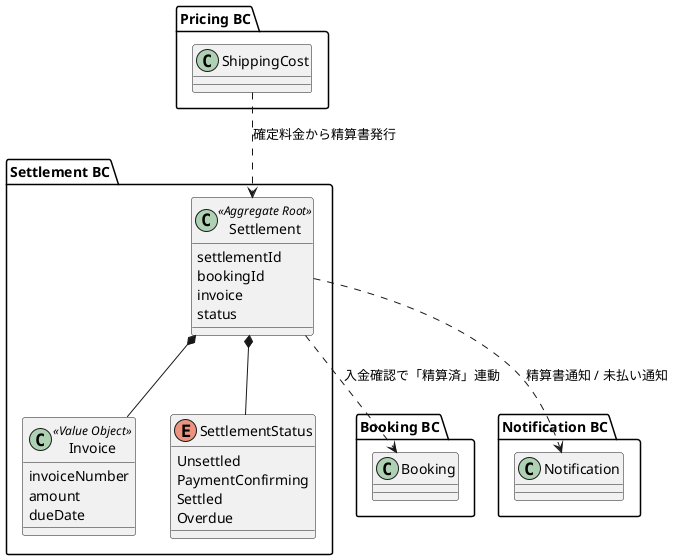
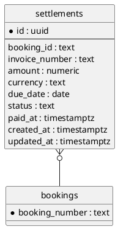

# イテレーション 8 計画

## 概要

| 項目 | 内容 |
|------|------|
| **イテレーション** | 8 |
| **期間** | 2026-10-12 〜 2026-10-25 (2 週間、計画上。実運用は 2026-07-07 以降) |
| **ゴール** | 精算処理 (US23) を完成させ Release 2.0 GA (v2.0.0 tag) をリリースする。同時に IT7 繰越の保証系タスク (RolePolicy 配線・Testcontainers・katip 完全移行・E2E 統合ハッピーパス) を消化し、ストレッチとして US10 (経路条件調整) / US12 (確定経路通知) に着手する。 |
| **目標 SP** | 22 (本体 3 + IT7 繰越高優先 5 + 保証系中優先 7 + GA クロージング 2 + ストレッチ 5) |
| **ベロシティ基準** | 平均 25.6 SP (IT1-IT7 単純平均)。retrospective-7 の示唆に基づき 20-25 SP を計画レンジとする |
| **設計** | 詳細設計は `docs/design/` を参照。本計画には ADR / モデル差分の要点のみ記載 |
| **前提** | IT7 完了 (docs/development/iteration_report-7.md / retrospective-7.md)。ADR-0013〜0015 採用、776 tests 緑、Exception BC 稼働済 |

---

## ゴール

### イテレーション終了時の達成状態

1. **精算処理 (US23) 稼働**: 「確定」状態の輸送料金 → 精算書発行 (請求番号・請求金額・支払い期限) → 荷主通知 → 入金確認 → 精算完了 (予約状態「精算済」連動) の一連が Domain / Application / Infrastructure (Postgres) / Interfaces / Views / Wire で緑
2. **セキュリティ保証**: RolePolicy / RoleGate を US17 手動更新 API に配線し (T7-A)、ADR-0016 (Role ベース認可の Domain/Interfaces 分離設計) を起票 (T7-D)
3. **保証系完了**: Testcontainers 統合テスト 4 Repository (T7-G = T6-05)、katip 完全移行 (T7-H = T6-07)、E2E 統合ハッピーパス再有効化 (T6-01) が緑
4. **Release 2.0 GA クロージング**: v1.0.0-mvp tag (T6-03 残) + v2.0.0 tag + CHANGELOG 切出し + GA Milestone Close (#255 / #242 / #244 の完了または IT9 移送判断)
5. **ストレッチ**: US10 (経路条件調整・再算出) / US12 (確定経路通知) の Domain + Application 層着手。消化困難なら IT9 へ移送 (リリース計画バッファ消費ルール第 2 優先)

### 成功基準

- [ ] US23 の全受入基準を満たし GitHub Issue Close (#255)
- [ ] T7-A〜T7-D (IT7 繰越高優先) が完了
- [ ] Testcontainers 統合テストが Pricing / CurrencyRate / Notification / Exception の 4 Repository で緑 (Docker 環境はユーザー確認後)
- [ ] katip 移行完了、自作 JSON Lines Logging 廃止、correlation_id が katip context で伝搬
- [ ] E2E 統合ハッピーパス「予約→経路→追跡→荷役→引取→料金」がフル Stage で緑
- [ ] v1.0.0-mvp / v2.0.0 tag 付与、CHANGELOG `[2.0.0]` セクション切出し
- [ ] ArchUnit / arch-check 全 Rule 違反 0 件を維持
- [ ] テストカバレッジ (HPC) 75% ゲート維持、想定 776 → 850+ tests

---

## ユーザーストーリー

### 対象ストーリー (本体 3 SP + ストレッチ 5 SP)

| ID | ユーザーストーリー | SP | 優先度 | GitHub |
|----|-------------------|----|--------|--------|
| US23 | 精算を処理する | 3 | 必須 | #255 |
| US10 | 経路条件を調整して再算出する | 3 | 低 (ストレッチ) | #242 |
| US12 | 確定経路を荷主に通知する | 2 | 低 (ストレッチ) | #244 |
| **合計** | | **8** (確定 3 + ストレッチ 5) | | |

### ストーリー詳細

#### US23: 精算を処理する

**ストーリー**:
> 経理担当者として、確定した輸送料金をもとに精算書を発行し、荷主への通知・入金確認・精算完了処理を行いたい。なぜなら、精算業務を一元管理し、入金状況を追跡して確実に精算を完了できるからだ。

**受入条件**:

1. 「確定」状態の輸送料金をもとに精算書 (請求番号・請求金額・支払い期限) を発行できる
2. 精算書が荷主にメール通知される (Notification BC 経由。メール実配信はスタブ可、通知レコード記録を必須とする)
3. 決済機関との連携により入金確認ができる (決済機関 IF はポート定義 + fake 実装)
4. 入金確認後、精算状態が「精算済」に更新され予約状態も「精算済」になる (Cross-BC: Settlement → Booking)
5. 支払い期限超過時、経理担当者に未払い通知が送信される

#### US10: 経路条件を調整して再算出する (ストレッチ)

**ストーリー**:
> 経路設計者として、経路候補に最適なものがない場合に条件 (期限・経由地等) を調整して経路候補を再算出したい。なぜなら、条件を柔軟に調整することで実現可能な経路を見つけ、輸送を実現できるからだ。

**受入条件**: 制約条件の確認 / 条件調整 (期限延長・経由地追加・貨物種別変更) と再算出 / 調整後候補の提示 / 候補なし時の条件協議依頼

#### US12: 確定経路を荷主に通知する (ストレッチ)

**ストーリー**:
> 営業担当者として、経路が予約に紐付けられた後、確定経路の詳細 (経由港・所要日数・到着予定日) を荷主に通知したい。なぜなら、荷主が確定経路の内容を確認し、承認または変更依頼を行えるようにするからだ。

**受入条件**: 紐付け経路情報の確認 / 通知内容の確認 / 荷主への通知送信 / 通知送信記録の登録 (Notification BC 再利用)

---

## タスク

### 1. IT7 繰越: 高優先 Try (T7-A〜T7-D、5 SP) — IT8 冒頭で必達

| # | タスク | 見積もり | 状態 |
|---|--------|---------|------|
| 1.1 | T7-A: RolePolicy を US17 手動更新 API に先行配線 (Servant `Header "Cookie"` + SessionRepository + Policy 述語 DI、T6-09 Servant 配線の残作業) | 4h | [ ] |
| 1.2 | T7-B: `generateSixDigitCodeText` hedgehog プロパティ (常に長さ 6 かつ全て数字、0/5/99999/999999 境界値) | 1h | [ ] |
| 1.3 | T7-C: `handlerPost` UNLOAD 分岐の副作用テスト (fake `ConfirmationCodeRepository` spy 化、UNLOAD のみ発火・冪等性検証) | 2h | [ ] |
| 1.4 | T7-D: ADR-0016 起票 (Role ベース認可の Domain/Interfaces 分離設計) | 1h | [ ] |

**小計**: 8h (理想時間)

### 2. 本体: US23 精算処理 (3 SP)

| # | タスク | 見積もり | 状態 |
|---|--------|---------|------|
| 2.1 | Domain: Settlement 集約 (Invoice 値オブジェクト: 請求番号・請求金額・支払い期限、SettlementStatus sum type: 未精算/入金確認中/精算済/期限超過) + 状態遷移純粋関数 + hspec/hedgehog | 4h | [ ] |
| 2.2 | Application: IssueInvoiceCommand / ConfirmPaymentCommand / OverdueCheckCommand + SettlementRepository / PaymentGateway ポート (型クラス) + fake でユースケーステスト | 4h | [ ] |
| 2.3 | Infrastructure: dbmate migration (settlements テーブル) + PostgresSettlementRepository (FromRow/ToRow) | 3h | [ ] |
| 2.4 | Cross-BC: 入金確認 → Booking 状態「精算済」連動 + 精算書発行 → Notification BC 通知レコード + 期限超過 → 未払い通知 | 3h | [ ] |
| 2.5 | Interfaces/Views: 精算一覧・精算詳細・入金確認操作の Servant API + Lucid ページ + RoleGate (Accounting/Admin) | 4h | [ ] |
| 2.6 | Wire: Main.hs DI 配線 + hspec-wai 結合テスト + arch-check 緑 | 2h | [ ] |

**小計**: 20h (理想時間)

### 3. 保証系: IT7 繰越中優先 (T7-E〜T7-I、7 SP)

| # | タスク | 見積もり | 状態 |
|---|--------|---------|------|
| 3.1 | T7-E: US26 通知チャネル接続 (UNLOAD 時のコード配信を画面表示 or メール送信に接続) | 3h | [ ] |
| 3.2 | T7-F: `handlingPageApp` の DI 引数 8 個を `AppDeps` レコードに集約 (`IO Text` 2 種の取り違え防止) | 2h | [ ] |
| 3.3 | T7-G (= T6-05): Testcontainers 統合テスト (Postgres Repository 4 種)。Docker 環境前提のためユーザー確認後に着手 | 4h | [ ] |
| 3.4 | T7-H (= T6-07): katip 依存追加 + 自作 JSON Lines Logging の置換 + correlation_id 伝搬 (Warp Middleware 入口配線含む) | 4h | [ ] |
| 3.5 | T7-I: ADR-0002 に「Application Input record は Text-only を維持」を追記 | 1h | [ ] |
| 3.6 | T6-01 残: Playwright E2E 統合ハッピーパス Stage 5-6 再有効化 (T7-01 完了で前提充足済) | 2h | [ ] |

**小計**: 16h (理想時間)

### 4. Release 2.0 GA クロージング (2 SP)

| # | タスク | 見積もり | 状態 |
|---|--------|---------|------|
| 4.1 | T6-03 残: v1.0.0-mvp git tag (E2E ハッピーパス緑を条件に付与) | 0.5h | [ ] |
| 4.2 | CHANGELOG `[Unreleased]` → `[2.0.0]` セクション切出し + v2.0.0 tag (developing-release スキル) | 1h | [ ] |
| 4.3 | 上流ドキュメント同期: domain-model / data-model / ui_design に Settlement を追記 | 2h | [ ] |
| 4.4 | GitHub: #255 Close、#242/#244 の完了 or IT9 移送判断、Release 2.0 GA Milestone Close | 0.5h | [ ] |
| 4.5 | dbmate status 確認 (T4-13: 開発 DB / staging DB の未適用 migration ゼロを保証) | 0.5h | [ ] |

**小計**: 4.5h (理想時間)

### 5. ストレッチ: US10 / US12 (5 SP) — バッファ消費ルール第 2 優先 (消化困難なら IT9 へ)

| # | タスク | 見積もり | 状態 |
|---|--------|---------|------|
| 5.1 | US10: RouteSpecification 条件調整 (期限延長・経由地・貨物種別) + 再算出 Application コマンド + UI | 8h | [ ] |
| 5.2 | US12: 確定経路通知 (Notification BC 再利用、通知内容組立 + 送信記録) + UI | 5h | [ ] |

**小計**: 13h (理想時間)

### 低優先 (余力があれば / T7-J〜T7-N)

- T7-J: ADR-0013 Phase 4 (`nId :: Maybe` → 非 Maybe 化)
- T7-K: ADR-0014 3 種例外詳細化 (`TsDelayed` / `TsDamaged` / `TsLost`)
- T7-M: ExceptionListView に Damage/Loss フィルタと詳細ページ UI
- T7-N: RoleGate JSON エラー body の `Aeson.encode` 型安全構築

### タスク合計

| カテゴリ | SP | 理想時間 | 状態 |
|---------|----|---------|------|
| IT7 繰越高優先 (T7-A〜T7-D) | 5 | 8h | [ ] |
| US23 精算処理 | 3 | 20h | [ ] |
| 保証系中優先 (T7-E〜T7-I + T6-01) | 7 | 16h | [ ] |
| GA クロージング | 2 | 4.5h | [ ] |
| ストレッチ (US10/US12) | 5 | 13h | [ ] |
| **合計** | **22** | **61.5h** | |

**1 SP あたり**: 約 2.8h
**進捗率**: 0% (0/22 SP)

---

## スケジュール

### Week 1 (Day 1-5): 繰越必達 + US23 本体

| 日 | タスク |
|----|--------|
| Day 1 | T7-A (RolePolicy 配線) + T7-B (hedgehog) + T7-D (ADR-0016) |
| Day 2 | T7-C (UNLOAD 副作用テスト) + US23 Domain (2.1) |
| Day 3 | US23 Application (2.2) |
| Day 4 | US23 Infrastructure (2.3) + Cross-BC (2.4) |
| Day 5 | US23 Interfaces/Views (2.5) + Wire (2.6) |

### Week 2 (Day 6-10): 保証系 + GA クロージング + ストレッチ

| 日 | タスク |
|----|--------|
| Day 6 | T7-H (katip 移行) + T7-F (AppDeps 集約) |
| Day 7 | T7-E (US26 通知チャネル) + T7-I (ADR-0002 追記) + T6-01 (E2E Stage 5-6) |
| Day 8 | T7-G (Testcontainers、Docker 環境確認後) + 4.1 (v1.0.0-mvp tag) |
| Day 9 | ストレッチ US10 / US12 着手 |
| Day 10 | 上流ドキュメント同期 + CHANGELOG/v2.0.0 tag + GitHub 同期 + ふりかえり |

> Ralph Loop 運用時は retrospective-7 の学びに従い、1 週目「本体 + 繰越必達」/ 2 週目「保証系 + クロージング」でスコープを分け、Docker / DB / セキュリティ設計を伴うタスク (T7-G) に到達したら end-of-life を早期判定する。

---

## 設計

### ドメインモデル (Settlement BC 差分)

### データモデル (settlements テーブル差分)

### API 設計

| メソッド | エンドポイント | 説明 |
|---------|---------------|------|
| GET | /settlements | 精算一覧 (Accounting/Admin、RoleGate) |
| GET | /settlements/:id | 精算詳細 |
| POST | /settlements | 精算書発行 (確定料金から) |
| POST | /settlements/:id/confirm-payment | 入金確認 → 精算済 |

### ADR

| ADR | タイトル | ステータス |
|-----|---------|-----------|
| ADR-0016 (新規) | Role ベース認可の Domain/Interfaces 分離設計 | 起票予定 (T7-D) |
| [ADR-0002](../adr/0002-arch-check-implementation.md) | arch-check (「Application Input record は Text-only を維持」追記) | 採用 (追記予定 T7-I) |
| [ADR-0013](../adr/0013-notification-primary-key-design.md) | Notification 主キー移行 (Phase 4 は低優先) | 採用 |

---

## リスクと対策

| リスク | 影響度 | 対策 |
|--------|--------|------|
| 決済機関連携の IF が未確定 (US23 受入条件 3) | 中 | PaymentGateway ポート + fake 実装で受入基準を満たし、実連携は Release 2.0 スコープ外と明記 |
| T7-G Testcontainers が Docker 環境依存で AI 単独完結困難 | 中 | ユーザー確認後に着手。ブロック時は IT9 へ移送し、fake ベーステストでカバレッジ維持 |
| ストレッチ (US10/US12) によるスコープ膨張 | 中 | バッファ消費ルール第 2 優先に従い、Week 2 Day 9 時点で未着手なら IT9 へ移送 |
| katip 移行で既存 Logging テストが広範囲に壊れる | 低 | correlation_id 伝搬テストを先に固定し、置換をモジュール単位で段階コミット |

---

## 完了条件

### Definition of Done

- [ ] コードレビュー完了 (self-review + developing-review)
- [ ] ユニットテストがパス (想定 850+ tests)
- [ ] E2E テストがパス (統合ハッピーパス フル Stage)
- [ ] HLint 警告 0 件 / arch-check 違反 0 件
- [ ] 機能がローカル環境で動作確認済み
- [ ] dbmate status で未適用 migration ゼロ
- [ ] ドキュメント更新完了 (domain-model / data-model / ui_design / index / mkdocs)

### デモ項目

1. 確定した輸送料金から精算書を発行し、荷主への通知レコードが記録される
2. 入金確認操作で精算状態「精算済」と予約状態「精算済」が連動更新される
3. US17 手動状態更新 API が Role 権限 (Tracker/Admin) でガードされる
4. E2E 統合ハッピーパス「予約→経路→追跡→荷役→引取→料金」がフル Stage で緑

---

## 更新履歴

| 日付 | 更新内容 | 更新者 |
|------|---------|--------|
| 2026-07-07 | 初版作成 (retrospective-7 Try + リリース計画 IT8 スコープ + IT7 繰越を反映) | AI Agent |

---

## 関連ドキュメント

- [リリース計画](./release_plan.md)
- [IT7 完了報告書](./iteration_report-7.md)
- [IT7 ふりかえり](./retrospective-7.md)
