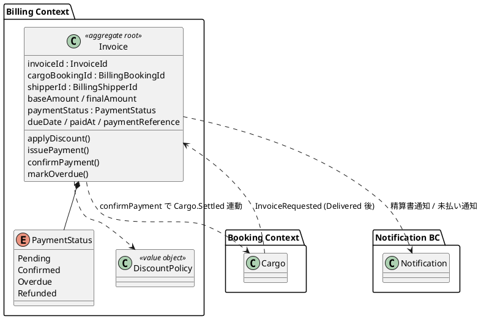
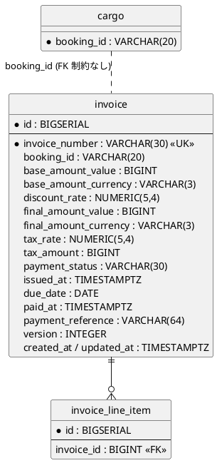
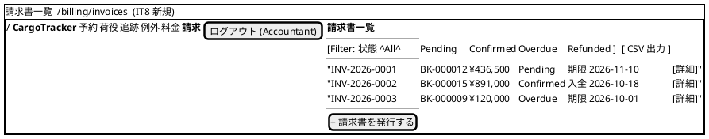
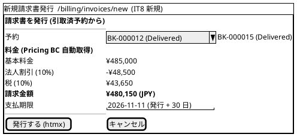
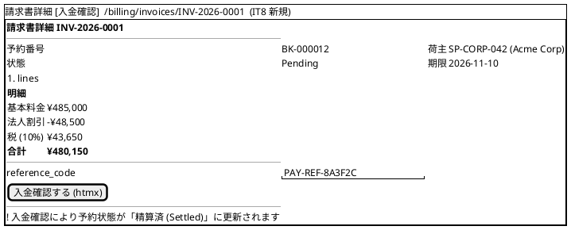
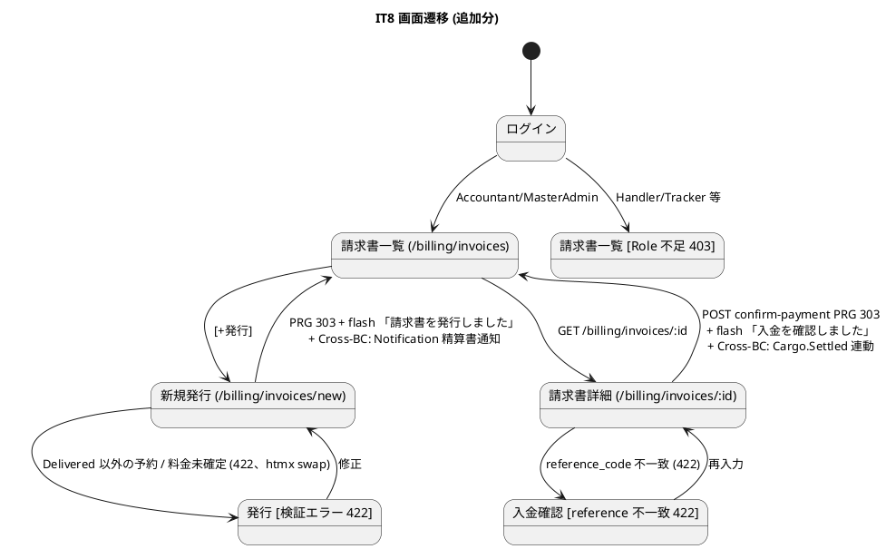
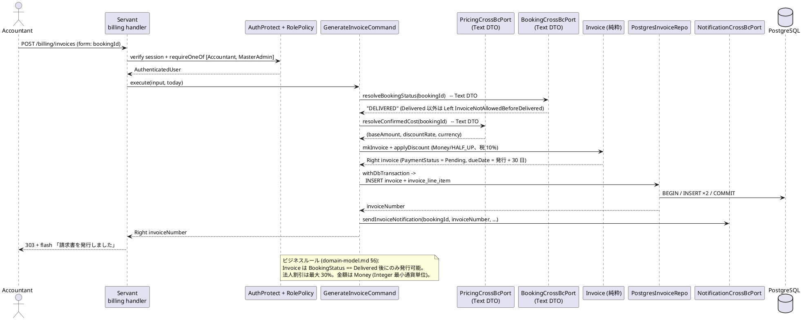
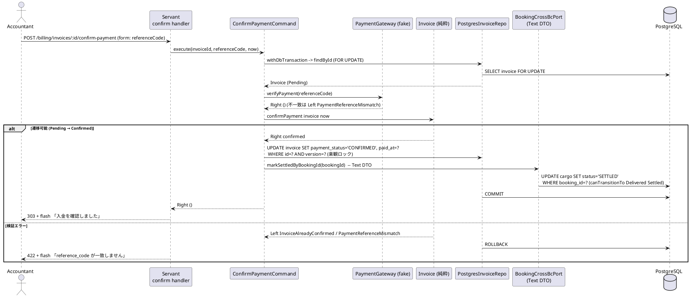

# イテレーション 8 計画

## 概要

| 項目 | 内容 |
|------|------|
| **イテレーション** | 8 |
| **期間** | 2026-10-12 〜 2026-10-25 (2 週間、計画上。実運用は 2026-07-07 以降) |
| **ゴール** | 精算処理 (US23) を完成させ Release 2.0 GA (v2.0.0 tag) をリリースする。同時に IT7 繰越の保証系タスク (RolePolicy 配線・Testcontainers・katip 完全移行・E2E 統合ハッピーパス) を消化し、ストレッチとして US10 (経路条件調整) / US12 (確定経路通知) に着手する。 |
| **目標 SP** | 22 (本体 3 + IT7 繰越高優先 5 + 保証系中優先 7 + GA クロージング 2 + ストレッチ 5) |
| **ベロシティ基準** | 平均 25.6 SP (IT1-IT7 単純平均)。retrospective-7 の示唆に基づき 20-25 SP を計画レンジとする |
| **設計** | 詳細設計は `docs/design/` を参照。本計画には ADR / モデル差分の要点のみ記載 |
| **前提** | IT7 完了 (docs/development/iteration_report-7.md / retrospective-7.md)。ADR-0013〜0015 採用、776 tests 緑、Exception BC 稼働済 |

---

## ゴール

### イテレーション終了時の達成状態

1. **精算処理 (US23) 稼働**: 既存設計の **Billing Context (Invoice 集約)** に基づき、「確定」状態の輸送料金 → 精算書発行 (請求番号・請求金額・支払い期限) → 荷主通知 → 入金確認 → 精算完了 (Cargo.Settled 連動) の一連が Domain / Application / Infrastructure (Postgres) / Interfaces / Views / Wire で緑
2. **セキュリティ保証**: RolePolicy / RoleGate を US17 手動更新 API に配線し (T7-A)、ADR-0016 (Role ベース認可の Domain/Interfaces 分離設計) を起票 (T7-D)
3. **保証系完了**: Testcontainers 統合テスト 4 Repository (T7-G = T6-05)、katip 完全移行 (T7-H = T6-07)、E2E 統合ハッピーパス再有効化 (T6-01) が緑
4. **Release 2.0 GA クロージング**: v1.0.0-mvp tag (T6-03 残) + v2.0.0 tag + CHANGELOG 切出し + GA Milestone Close (#255 / #242 / #244 の完了または IT9 移送判断)
5. **ストレッチ**: US10 (経路条件調整・再算出) / US12 (確定経路通知) の Domain + Application 層着手。消化困難なら IT9 へ移送 (リリース計画バッファ消費ルール第 2 優先)

### 成功基準

- [ ] US23 の全受入基準を満たし GitHub Issue Close (#255)
- [ ] T7-A〜T7-D (IT7 繰越高優先) が完了
- [ ] Testcontainers 統合テストが Pricing / CurrencyRate / Notification / Exception の 4 Repository で緑 (Docker 環境はユーザー確認後)
- [ ] katip 移行完了、自作 JSON Lines Logging 廃止、correlation_id が katip context で伝搬
- [ ] E2E 統合ハッピーパス「予約→経路→追跡→荷役→引取→料金」がフル Stage で緑
- [ ] v1.0.0-mvp / v2.0.0 tag 付与、CHANGELOG `[2.0.0]` セクション切出し
- [ ] ArchUnit / arch-check 全 Rule 違反 0 件を維持
- [ ] テストカバレッジ (HPC) 75% ゲート維持、想定 776 → 850+ tests

---

## ユーザーストーリー

### 対象ストーリー (本体 3 SP + ストレッチ 5 SP)

| ID | ユーザーストーリー | SP | 優先度 | GitHub |
|----|-------------------|----|--------|--------|
| US23 | 精算を処理する | 3 | 必須 | #255 |
| US10 | 経路条件を調整して再算出する | 3 | 低 (ストレッチ) | #242 |
| US12 | 確定経路を荷主に通知する | 2 | 低 (ストレッチ) | #244 |
| **合計** | | **8** (確定 3 + ストレッチ 5) | | |

### ストーリー詳細

#### US23: 精算を処理する (対応 UC: UC18)

**ストーリー**:
> 経理担当者として、確定した輸送料金をもとに精算書を発行し、荷主への通知・入金確認・精算完了処理を行いたい。なぜなら、精算業務を一元管理し、入金状況を追跡して確実に精算を完了できるからだ。

**受入条件**:

1. 「確定」状態の輸送料金をもとに精算書 (請求番号・請求金額・支払い期限) を発行できる
2. 精算書が荷主にメール通知される (Notification BC 経由。メール実配信はスタブ可、通知レコード記録を必須とする)
3. 決済機関との連携により入金確認ができる (`payment_reference` 照合。決済機関 IF はポート定義 + fake 実装)
4. 入金確認後、精算状態が「精算済 (Confirmed)」に更新され予約状態も「精算済 (Cargo.Settled)」になる (Cross-BC: Billing → Booking、状態遷移 `canTransitionTo Delivered Settled` は定義済)
5. 支払い期限超過時、経理担当者に未払い通知が送信される (`markOverdue`)

#### US10: 経路条件を調整して再算出する (ストレッチ、対応 UC: UC08)

**ストーリー**:
> 経路設計者として、経路候補に最適なものがない場合に条件 (期限・経由地等) を調整して経路候補を再算出したい。なぜなら、条件を柔軟に調整することで実現可能な経路を見つけ、輸送を実現できるからだ。

**受入条件**: 制約条件の確認 / 条件調整 (期限延長・経由地追加・貨物種別変更) と再算出 / 調整後候補の提示 / 候補なし時の条件協議依頼

#### US12: 確定経路を荷主に通知する (ストレッチ、対応 UC: UC10)

**ストーリー**:
> 営業担当者として、経路が予約に紐付けられた後、確定経路の詳細 (経由港・所要日数・到着予定日) を荷主に通知したい。なぜなら、荷主が確定経路の内容を確認し、承認または変更依頼を行えるようにするからだ。

**受入条件**: 紐付け経路情報の確認 / 通知内容 (経由港・所要日数・到着予定日・**料金概算**) の確認 / 荷主への通知送信 / 通知送信記録の登録 (Notification BC 再利用)

---

## タスク

### 1. IT7 繰越: 高優先 Try (T7-A〜T7-D、5 SP) — IT8 冒頭で必達

| # | タスク | 見積もり | 状態 |
|---|--------|---------|------|
| 1.1 | T7-A: RolePolicy を US17 手動更新 API に先行配線 (Servant `Header "Cookie"` + SessionRepository + Policy 述語 DI、T6-09 Servant 配線の残作業) | 4h | [ ] 着手中 |
| 1.2 | T7-B: `generateSixDigitCodeText` hedgehog プロパティ (常に長さ 6 かつ全て数字、0/5/99999/999999 境界値) | 1h | [x] 完了 (`8f680725`、sixDigitCodeFromInt 純粋抽出 + プロパティ 2 本 + 境界値 4 + IO スモーク) |
| 1.3 | T7-C: `handlerPost` UNLOAD 分岐の副作用テスト (fake `ConfirmationCodeRepository` spy 化、UNLOAD のみ発火・冪等性検証) | 2h | [x] 完了 (`e6e09345`、Network.Wai.Test + IORef spy で 4 ケース緑) |
| 1.4 | T7-D: ADR-0016 起票 (Role ベース認可の Domain/Interfaces 分離設計) | 1h | [x] 完了 (`0d4e2cb0`、docs/adr/0016-role-based-authorization-design.md 提案) |

**小計**: 8h (理想時間)

### 2. 本体: US23 精算処理 (3 SP)

| # | タスク | 見積もり | 状態 |
|---|--------|---------|------|
| 2.1 | Domain: **Billing Context の Invoice 集約** (domain-model.md §6 準拠: `PaymentStatus` = Pending/Confirmed/Overdue/Refunded、`applyDiscount`/`issuePayment`/`confirmPayment`/`markOverdue` 純粋関数) + hspec/hedgehog | 4h | [ ] |
| 2.2 | Application: GenerateInvoiceCommand / ConfirmPaymentCommand / OverdueCheckCommand + InvoiceRepository / PaymentGateway ポート (型クラス) + fake でユースケーステスト | 4h | [ ] |
| 2.3 | Infrastructure: dbmate migration (`invoice` + `invoice_line_item` テーブル、data-model.md §invoice 準拠: BIGSERIAL PK + `invoice_number` UK + `*_amount_value BIGINT` + `version` 楽観ロック) + PostgresInvoiceRepository (FromRow/ToRow) | 3h | [ ] |
| 2.4 | Cross-BC: 入金確認 → Cargo.Settled 連動 (FK 制約なし、`booking_id` TEXT 照合を Application 層で実施) + 精算書発行 → Notification BC 通知レコード + 期限超過 → 未払い通知 | 3h | [ ] |
| 2.5 | Interfaces/Views: 請求書一覧・詳細・入金発行・入金確認の Servant API (ui_design.md `/billing/invoices` 系パス準拠) + Lucid ページ + RoleGate (Accountant/MasterAdmin) | 4h | [ ] |
| 2.6 | Wire: Main.hs DI 配線 + hspec-wai 結合テスト + arch-check 緑 | 2h | [ ] |

**小計**: 20h (理想時間)

### 3. 保証系: IT7 繰越中優先 (T7-E〜T7-I、7 SP)

| # | タスク | 見積もり | 状態 |
|---|--------|---------|------|
| 3.1 | T7-E: US26 通知チャネル接続 (UNLOAD 時のコード配信を画面表示 or メール送信に接続) | 3h | [ ] |
| 3.2 | T7-F: `handlingPageApp` の DI 引数 8 個を `AppDeps` レコードに集約 (`IO Text` 2 種の取り違え防止) | 2h | [ ] |
| 3.3 | T7-G (= T6-05): Testcontainers 統合テスト (Postgres Repository 4 種)。Docker 環境前提のためユーザー確認後に着手 | 4h | [ ] |
| 3.4 | T7-H (= T6-07): katip 依存追加 + 自作 JSON Lines Logging の置換 + correlation_id 伝搬 (Warp Middleware 入口配線含む) | 4h | [ ] |
| 3.5 | T7-I: ADR-0002 に「Application Input record は Text-only を維持」を追記 | 1h | [ ] |
| 3.6 | T6-01 残: Playwright E2E 統合ハッピーパス Stage 5-6 再有効化 (T7-01 完了で前提充足済) | 2h | [ ] |

**小計**: 16h (理想時間)

### 4. Release 2.0 GA クロージング (2 SP)

| # | タスク | 見積もり | 状態 |
|---|--------|---------|------|
| 4.1 | T6-03 残: v1.0.0-mvp git tag (E2E ハッピーパス緑を条件に付与) | 0.5h | [ ] |
| 4.2 | CHANGELOG `[Unreleased]` → `[2.0.0]` セクション切出し + v2.0.0 tag (developing-release スキル) | 1h | [ ] |
| 4.3 | 上流ドキュメント同期: domain-model.md §6 (Billing) / data-model.md §invoice は定義済のため実装差分のみ反映。ui_design.md に請求書一覧・詳細・入金確認の salt ワイヤーフレーム 3 種 + 画面遷移図の精算フロー統合を追記 (IT6/IT7 慣行踏襲) | 3h | [ ] |
| 4.4 | GitHub: #255 Close、#242/#244 の完了 or IT9 移送判断、Release 2.0 GA Milestone Close | 0.5h | [ ] |
| 4.5 | dbmate status 確認 (T4-13: 開発 DB / staging DB の未適用 migration ゼロを保証) | 0.5h | [ ] |

**小計**: 5.5h (理想時間)

### 5. ストレッチ: US10 / US12 (5 SP) — バッファ消費ルール第 2 優先 (消化困難なら IT9 へ)

| # | タスク | 見積もり | 状態 |
|---|--------|---------|------|
| 5.1 | US10: RouteSpecification 条件調整 (期限延長・経由地・貨物種別) + 再算出 Application コマンド + UI | 8h | [ ] |
| 5.2 | US12: 確定経路通知 (Notification BC 再利用、通知内容組立 + 送信記録) + UI | 5h | [ ] |

**小計**: 13h (理想時間)

### 低優先 (余力があれば / T7-J〜T7-N)

- T7-J: ADR-0013 Phase 4 (`nId :: Maybe` → 非 Maybe 化)
- T7-K: ADR-0014 3 種例外詳細化 (`TsDelayed` / `TsDamaged` / `TsLost`)
- T7-M: ExceptionListView に Damage/Loss フィルタと詳細ページ UI
- T7-N: RoleGate JSON エラー body の `Aeson.encode` 型安全構築

### タスク合計

| カテゴリ | SP | 理想時間 | 状態 |
|---------|----|---------|------|
| IT7 繰越高優先 (T7-A〜T7-D) | 5 | 8h | [ ] |
| US23 精算処理 | 3 | 20h | [ ] |
| 保証系中優先 (T7-E〜T7-I + T6-01) | 7 | 16h | [ ] |
| GA クロージング | 2 | 5.5h | [ ] |
| ストレッチ (US10/US12) | 5 | 13h | [ ] |
| **合計** | **22** | **62.5h** | |

**1 SP あたり**: 約 2.8h
**進捗率**: 約 9% (2/22 SP 相当、T7-B/T7-C/T7-D 完了 = タスク 1 の 4h/8h。2026-07-07 Ralph Loop 反復 1)

---

## スケジュール

### Week 1 (Day 1-5): 繰越必達 + US23 本体

| 日 | タスク |
|----|--------|
| Day 1 | T7-A (RolePolicy 配線) + T7-B (hedgehog) + T7-D (ADR-0016) |
| Day 2 | T7-C (UNLOAD 副作用テスト) + US23 Domain (2.1) |
| Day 3 | US23 Application (2.2) |
| Day 4 | US23 Infrastructure (2.3) + Cross-BC (2.4) |
| Day 5 | US23 Interfaces/Views (2.5) + Wire (2.6) |

### Week 2 (Day 6-10): 保証系 + GA クロージング + ストレッチ

| 日 | タスク |
|----|--------|
| Day 6 | T7-H (katip 移行) + T7-F (AppDeps 集約) |
| Day 7 | T7-E (US26 通知チャネル) + T7-I (ADR-0002 追記) + T6-01 (E2E Stage 5-6) |
| Day 8 | T7-G (Testcontainers、Docker 環境確認後) + 4.1 (v1.0.0-mvp tag) |
| Day 9 | ストレッチ US10 / US12 着手 |
| Day 10 | 上流ドキュメント同期 + CHANGELOG/v2.0.0 tag + GitHub 同期 + ふりかえり |

> Ralph Loop 運用時は retrospective-7 の学びに従い、1 週目「本体 + 繰越必達」/ 2 週目「保証系 + クロージング」でスコープを分け、Docker / DB / セキュリティ設計を伴うタスク (T7-G) に到達したら end-of-life を早期判定する。

---

## 設計

### ドメインモデル (Billing Context、domain-model.md §6 定義済)

> **注**: US23 の実装対象は既存設計の **Billing Context (精算コンテキスト)** であり、新 BC は作らない。Payment は独立集約とせず Invoice 集約内のステータス + 純粋関数として表現する (Scala 版 ADR 0019 と同方針)。



### データモデル (invoice / invoice_line_item、data-model.md §invoice 定義済)

> **注**: data-model.md の既存定義に従う。単数形テーブル名・BIGSERIAL サロゲート PK・金額は最小通貨単位の BIGINT・`version` 楽観ロック・BC 間 FK 制約なし (`booking_id` TEXT 照合は Application 層)。



### モジュール構造 (IT8 追加)

```text
apps/cargo-tracker/src/
  Cargotracker/
    Billing/                                     -- IT8 新規 BC (US23)
      Domain/
        Model/
          Invoice.hs                             -- Aggregate root (applyDiscount/issuePayment/confirmPayment/markOverdue)
          InvoiceId.hs                           -- VO (newtype Text)
          BillingBookingId.hs                    -- VO (newtype Text、Cargo との関連)
          BillingShipperId.hs                    -- VO (isCorporate 内包)
          Money.hs                               -- VO (Integer 最小通貨単位、HALF_UP)
          DiscountRate.hs                        -- VO (0〜30%)
          DiscountPolicy.hs                      -- VO (CorporateStandard/VolumeDiscount/Seasonal/NoDiscount)
          PaymentStatus.hs                       -- sum type (Pending/Confirmed/Overdue/Refunded)
          InvoiceLineItem.hs                     -- Entity (精算明細)
        Error.hs                                 -- BillingError
      Application/
        GenerateInvoiceCommand.hs                -- US23: 精算書発行
        ConfirmPaymentCommand.hs                 -- US23: 入金確認
        IssuePaymentCommand.hs                   -- US23: 入金発行 (支払期日 + reference)
        OverdueCheckCommand.hs                   -- US23: 期限超過検知 → 未払い通知
        Port/
          InvoiceRepository.hs
          PaymentGateway.hs                      -- 決済機関 IF (fake 実装で受入基準充足)
          BookingCrossBcPort.hs                  -- markSettledByBookingId (Text DTO)
          PricingCrossBcPort.hs                  -- resolveConfirmedCost (Text DTO)
          NotificationCrossBcPort.hs             -- sendInvoiceNotification / sendOverdueNotification
      Infrastructure/
        Repository/
          PostgresInvoiceRepository.hs
        Gateway/
          FakePaymentGateway.hs                  -- reference_code 照合の fake
      Interfaces/
        Http/
          InvoiceListHandler.hs                  -- GET /billing/invoices
          InvoiceNewHandler.hs                   -- GET /billing/invoices/new
          InvoiceDetailHandler.hs                -- GET /billing/invoices/:invoiceId
          IssuePaymentHandler.hs                 -- POST /billing/invoices/:id/issue-payment
          ConfirmPaymentHandler.hs               -- POST /billing/invoices/:id/confirm-payment

    Booking/                                     -- 既存 (IT8 拡張)
      Domain/
        Model/
          Cargo.hs                               -- markSettled 追加 (canTransitionTo Delivered Settled は定義済)

    Shared/
      Auth/
        RolePolicy.hs                            -- IT8 拡張: /billing/* × Accountant/MasterAdmin
      CrossBc/
        BillingToBookingHelper.hs                -- Billing → Booking (Cargo.Settled)
        BillingToNotificationHelper.hs           -- Billing → Notification
        PricingToBillingHelper.hs                -- Pricing 確定料金 → Billing
      Infrastructure/
        Logging.hs                               -- T7-H: katip 完全移行

apps/cargo-tracker/db/migrations/
  20261012100000_create_invoice.sql
  20261012100100_create_invoice_line_item.sql

test/
  Integration/
    GenerateInvoiceSpec.hs                       -- US23: 発行 (Delivered 前提)
    ConfirmPaymentSpec.hs                        -- US23: 入金確認 + Cargo.Settled 連動
    OverdueCheckSpec.hs                          -- US23: 期限超過 → 未払い通知
    InvoiceRolePolicySpec.hs                     -- Accountant OK / Handler 403
  Testcontainers/
    PostgresInvoiceContainerSpec.hs              -- T7-G と併せて 5 Repository 目
e2e/
  it8-invoice-happy-path.spec.ts                 -- 引取済予約→請求書発行→入金確認→Settled
```

### URL 設計 (IT8 追加、ui_design.md 画面一覧定義済)

| メソッド | パス | 認可 | 用途 |
| :--- | :--- | :--- | :--- |
| GET  | `/billing/invoices` | AuthProtect (Accountant/MasterAdmin) | US23: 請求書一覧・ステータス管理 (フィルタ: payment_status) |
| GET  | `/billing/invoices/new` | AuthProtect (Accountant/MasterAdmin) | US23: 新規請求書発行 (引取済予約の選択・料金自動算出) |
| GET  | `/billing/invoices/:invoiceId` | AuthProtect (Accountant/MasterAdmin) | US23: 請求書詳細・割引内訳・支払い確認 |
| POST | `/billing/invoices` | AuthProtect (Accountant/MasterAdmin) | US23: 請求書発行 (htmx PRG 303) |
| POST | `/billing/invoices/:id/issue-payment` | AuthProtect (Accountant/MasterAdmin) | US23: 入金発行 (支払期日 + reference_code 設定 → Pending) |
| POST | `/billing/invoices/:id/confirm-payment` | AuthProtect (Accountant/MasterAdmin) | US23: 入金確認 (reference_code 照合 → Confirmed + Cargo.Settled) |

**RolePolicy 適用 (T7-A の延長)**:

- `/billing/*` は `requireOneOf [Accountant, MasterAdmin]`。Role 不足 → 403、Cookie なし → 401 (JSON) / 303 (HTML) (IT6 既定)
- US17 手動更新 API への RoleGate 先行配線 (T7-A) と同一パターンを適用し、IT8 で配線済 API を 2 系統に拡大する

### ユーザーインターフェース

> **注**: ui_design.md の画面一覧には `/billing/invoices` 系 5 画面が定義済だが salt ワイヤーフレームは未収載。以下を実装の正とし、タスク 4.3 で ui_design.md に反映する。

#### ビュー







#### インタラクション



**htmx パターン (IT8 適用箇所)**:

| 画面 | パターン | エンドポイント |
| :--- | :--- | :--- |
| 請求書一覧 (フィルタ) | セレクト変更で再描画 | `hx-get="/billing/invoices?status=pending"` → `hx-target="#invoice-list"` |
| 新規発行 (予約選択) | 予約変更で料金再取得 | `hx-get="/billing/invoices/new?bookingId=BK-000012"` → `hx-target="#amount-panel"` |
| 発行フォーム | 送信 → 検証エラーは swap | `hx-post="/billing/invoices"` → `hx-target="#form-error"` (422 時) / 303 (成功時) |
| 入金確認 | ボタン + 確認 | `hx-post="/billing/invoices/:id/confirm-payment"` → PRG (303) |

**フィードバック規約 (IT8 追加)**:

- 成功 (`alert-success`): 「請求書を発行しました (請求番号: <invoiceNumber>)」/「入金を確認しました。予約 <bookingId> は精算済になりました」
- 警告 (`alert-warning`): 「支払期限を超過した請求書が <n> 件あります」
- エラー (`alert-danger`): 「引取完了 (Delivered) 前の予約には請求書を発行できません」/「reference_code が一致しません」/「この操作には Accountant または MasterAdmin 権限が必要です」

### API 設計

**Servant Endpoint 型定義 (Haskell)**:

```haskell
-- Billing/Interfaces/Http/BillingApi.hs (IT8 新規)
type BillingApi
  =    "billing" :> "invoices"
       :> AuthProtect "session"
       :> QueryParam "status" PaymentStatusFilter
       :> Get '[HTML] (Html ())
  :<|> "billing" :> "invoices" :> "new"
       :> AuthProtect "session"
       :> QueryParam "bookingId" Text
       :> Get '[HTML] (Html ())
  :<|> "billing" :> "invoices"
       :> AuthProtect "session"
       :> ReqBody '[FormUrlEncoded] GenerateInvoiceForm
       :> Post '[HTML] (Html ())
  :<|> "billing" :> "invoices" :> Capture "invoiceId" InvoiceId
       :> AuthProtect "session"
       :> Get '[HTML] (Html ())
  :<|> "billing" :> "invoices" :> Capture "invoiceId" InvoiceId :> "issue-payment"
       :> AuthProtect "session"
       :> ReqBody '[FormUrlEncoded] IssuePaymentForm
       :> Post '[HTML] (Html ())
  :<|> "billing" :> "invoices" :> Capture "invoiceId" InvoiceId :> "confirm-payment"
       :> AuthProtect "session"
       :> ReqBody '[FormUrlEncoded] ConfirmPaymentForm
       :> Post '[HTML] (Html ())

-- RolePolicy 適用 (Shared.Auth.RolePolicy、T7-A と同一パターン)
billingHandlers = requireOneOf (Accountant :| [MasterAdmin])
```

### アプリケーション層シーケンス

#### GenerateInvoiceCommand (US23 発行)



#### ConfirmPaymentCommand (US23 入金確認 + Cargo.Settled 連動)



### トランザクション境界

ADR-0012 (IT6 採用) を継承する。

| ルール | 適用 |
| :--- | :--- |
| **T-01 (Application で `withDbTransaction`)** | `GenerateInvoiceCommand` (invoice + invoice_line_item 単一 Tx) / `ConfirmPaymentCommand` (invoice + cargo 状態遷移を単一 Tx) / `OverdueCheckCommand` (invoice 状態更新のみ) |
| **T-02 (Repository は IO のみ)** | `PostgresInvoiceRepository` は `Connection -> IO ()` のみ、Tx 開始禁止 |
| **T-03 (Domain は IO 完全排除)** | `applyDiscount` / `issuePayment` / `confirmPayment` / `markOverdue` は純粋 `Either DomainError Invoice` |
| **ADR-0012 継承: Cross-BC 参照は Text DTO のみ** | `BillingToBookingHelper` (`markSettledByBookingId`) / `PricingToBillingHelper` (`resolveConfirmedCost`) は `bookingId :: Text` を受領。Billing BC が `Cargotracker.Booking.Domain.*` を直接 import しない (Rule 4) |
| **ADR-0012 継承: 副作用は Tx 外** | 精算書通知・未払い通知の Notification 配信は invoice Tx 完了後に実行 |
| **IT8 判断: invoice + cargo は単一 Tx** | 「入金確認 → 精算済」の受入基準 4 は不可分 (ADR-0014 の exception + tracking 単一 Tx と同パターン)。Tx 中断時は入金未確認 + 予約状態未変更 |
| **IT8 判断: 楽観ロック** | `invoice.version` 比較更新。更新行数 0 は `ConcurrentModification` (data-model.md 設計判断準拠) |

### エラー処理戦略

```haskell
-- Billing/Domain/Error.hs (IT8 新規)
data BillingError
  = InvoiceNotFound !InvoiceId                          -- US23: 404
  | InvoiceNotAllowedBeforeDelivered !Text              -- US23: 422 (BookingStatus /= Delivered)
  | InvoiceAlreadyExists !Text                          -- US23: 409 (1 予約 1 請求、booking_id UK)
  | InvoiceAlreadyConfirmed                             -- US23: 409
  | PaymentReferenceMismatch                            -- US23: 422
  | DiscountRateOutOfRange !Scientific                  -- US23: 422 (0〜30% 超過)
  | CurrencyMismatch !Text !Text                        -- US23: 422 (Money 加算時)
  | InvoiceConcurrentModification !InvoiceId            -- US23: 409 (version 競合)
  deriving stock (Eq, Show)
```

**HTTP マッピング (IT8 追加)**:

| Error | HTTP | フラッシュメッセージ例 |
| :--- | :--- | :--- |
| `InvoiceNotFound` | 404 | 「該当する請求書が見つかりません」 |
| `InvoiceNotAllowedBeforeDelivered` | 422 | 「引取完了 (Delivered) 前の予約には請求書を発行できません」 |
| `InvoiceAlreadyExists` | 409 | 「この予約の請求書は既に発行済です」 |
| `InvoiceAlreadyConfirmed` | 409 | 「この請求書は既に入金確認済です」 |
| `PaymentReferenceMismatch` | 422 | 「reference_code が一致しません」 |
| `DiscountRateOutOfRange` | 422 | 「割引率は 0〜30% の範囲で指定してください」 |
| `InvoiceConcurrentModification` | 409 | 「他の操作と競合しました。再読み込みしてください」 |
| `InsufficientRole` (T7-A 拡張) | 403 | 「この操作には Accountant または MasterAdmin 権限が必要です」 |

### DB マイグレーション順序 (IT8)

IT7 の 20260928100400 を前提に、IT8 では **2 マイグレーション** を投入する。

| 順序 | ファイル | 内容 | 依存 |
| :--- | :--- | :--- | :--- |
| 021 | `20261012100000_create_invoice.sql` | `invoice` 新規作成 (data-model.md §invoice 準拠) | 独立 |
| 022 | `20261012100100_create_invoice_line_item.sql` | `invoice_line_item` 新規作成 (`invoice_id` FK) | 021 |

**DDL (021、data-model.md §invoice 準拠)**:

```sql
-- apps/cargo-tracker/db/migrations/20261012100000_create_invoice.sql
-- migrate:up
CREATE TABLE invoice (
    id                     BIGSERIAL PRIMARY KEY,
    invoice_number         VARCHAR(30)  NOT NULL UNIQUE,
    booking_id             VARCHAR(20)  NOT NULL UNIQUE,  -- 1 予約 1 請求
    base_amount_value      BIGINT       NOT NULL,          -- 最小通貨単位
    base_amount_currency   VARCHAR(3)   NOT NULL,
    discount_rate          NUMERIC(5,4) DEFAULT 0,
    final_amount_value     BIGINT       NOT NULL,
    final_amount_currency  VARCHAR(3)   NOT NULL,
    tax_rate               NUMERIC(5,4) NOT NULL DEFAULT 0.1000,
    tax_amount             BIGINT       NOT NULL DEFAULT 0,
    payment_status         VARCHAR(30)  NOT NULL
      CHECK (payment_status IN ('PENDING','CONFIRMED','OVERDUE','REFUNDED')),
    issued_at              TIMESTAMPTZ,
    due_date               DATE,
    paid_at                TIMESTAMPTZ,
    payment_reference      VARCHAR(64),
    version                INTEGER      NOT NULL DEFAULT 0,
    created_at             TIMESTAMPTZ  NOT NULL DEFAULT NOW(),
    updated_at             TIMESTAMPTZ  NOT NULL DEFAULT NOW()
);
CREATE INDEX idx_invoice_by_status ON invoice (payment_status, due_date);
-- BC 間 FK 制約なし: booking_id は cargo.booking_id と Application 層で照合 (data-model.md 設計判断 §5)
-- migrate:down
DROP TABLE invoice;
```

### テスト戦略

| 層 | テスト種別 | 追加件数 (目標) |
| :--- | :--- | ---: |
| Domain | hspec | `applyDiscount` (法人 0〜30% / 個人 0% / 範囲超過 Left、4) / `issuePayment` (Pending 遷移 + dueDate、3) / `confirmPayment` (Pending→Confirmed / 二重確認 409 / Refunded から不可、4) / `markOverdue` (期限超過判定、3) / `Money` 加算・通貨不一致・HALF_UP 丸め (4) |
| Domain | hedgehog (property) | 割引後 ≤ 元価格 (T7-B と同資産) / `Money` の非負性 / 税額 = final × rate の丸め整合 / PaymentStatus 遷移の冪等性 (同一遷移は Left) |
| Application | hspec | `GenerateInvoiceCommand` (5: 通常 / Delivered 前 422 / 二重発行 409 / Pricing 未確定 / 通知失敗許容) / `ConfirmPaymentCommand` (5: 通常 + Cargo.Settled / reference 不一致 / 二重確認 / version 競合 / Tx ロールバック) / `OverdueCheckCommand` (3) |
| Application | hspec (T7-C 同型) | fake `InvoiceRepository` / `BookingCrossBcPort` を spy 化し、confirmPayment 成功時のみ `markSettledByBookingId` が発火することを検証 |
| Infrastructure | hspec (testcontainers, T7-G) | `PostgresInvoiceRepository` CRUD + payment_status 遷移 + version 楽観ロック (3)。T7-G の 4 Repository と併せて実施 |
| Interfaces (HTTP) | hspec-wai | `BillingApi` 6 エンドポイント × (Accountant 200/303 / Handler 403 / 未認証 401) マトリクス (18+) / 422 系 (Delivered 前・reference 不一致、4) |
| E2E | Playwright | `it8-invoice-happy-path.spec.ts` (引取済予約 → 発行 → 入金確認 → Cargo.Settled 表示) / T6-01 統合ハッピーパスに Stage 8 (精算) を追加 |
| アーキテクチャ | arch-check Rule 1-6 | **Rule 4 違反 0**: `Billing.*` が他 BC の `Domain.*` を import しない / Cross-BC helper が `Shared/CrossBc/` にのみ配置 |
| カバレッジ | HPC | Domain ≥ 95% / 全体 ≥ 75% (継続)、想定 776 → 850+ tests |

### CI 統合

`.github/workflows/ci.yml` に IT8 で追加/更新するステップ:

```yaml
- name: hspec-wai 統合テスト (IT8 追加分)
  working-directory: apps/cargo-tracker
  run: nix-shell ../../$NIX_SHELL --run \
       "stack test --test-arguments='--match \"GenerateInvoice|ConfirmPayment|OverdueCheck|InvoiceRolePolicy\"'"

- name: arch-check Rule 4 (Billing BC の Cross-BC 検証)
  run: |
    ! grep -rE "^import (qualified )?Cargotracker\.(Tracking|Handling|Booking|Notification|Pricing|Exception)\.Domain" \
        apps/cargo-tracker/src/Cargotracker/Billing/
    for f in BillingToBookingHelper BillingToNotificationHelper PricingToBillingHelper; do
      test -f apps/cargo-tracker/src/Cargotracker/Shared/CrossBc/${f}.hs \
        || (echo "Cross-BC helper 未配置: ${f}" && exit 1)
    done

- name: Playwright E2E (IT8 + 統合ハッピーパス)
  working-directory: e2e
  run: npx playwright test --grep '@it6-mvp|@it8|@us23'
```

- T7-G (Testcontainers) / T7-H (katip 移行検証) の CI ステップは IT7 計画の定義を踏襲して有効化する
- リリースタグ: `v1.0.0-mvp` (T6-03 残、E2E ハッピーパス緑後) → IT8 末に `v2.0.0` + CHANGELOG `[2.0.0]` 切出し

### ADR

| ADR | タイトル | ステータス |
|-----|---------|-----------|
| **ADR-0016** (IT8 新規起票、T7-D) | **Role ベース認可の Domain/Interfaces 分離設計** | 提案: RolePolicy (Domain 純粋関数) / RoleGate (Interfaces 統合ヘルパー) の分離根拠と `/billing/*` への適用パターンを明文化 |
| [ADR-0002](../adr/0002-arch-check-implementation.md) | arch-check | 採用、**IT8 で「Application Input record は Text-only を維持」を追記** (T7-I) |
| [ADR-0012](../adr/0012-tx-boundary-and-cross-bc.md) | Tx 境界と Cross-BC 参照ポリシー | 採用済、IT8 で Billing BC に継続適用 (invoice + cargo 単一 Tx) |
| [ADR-0013](../adr/0013-notification-primary-key-design.md) | Notification 主キー移行 | 採用済、Phase 4 (`nId` 非 Maybe 化) は低優先 (T7-J) |
| [ADR-0014](../adr/0014-exception-state-transition-policy.md) | 例外処理の状態遷移ポリシー | 採用済、「Cargo.status 波及は US23 (IT8) に持ち越し」の宿題を本 IT で回収 (Settled 連動) |

**ADR-0016 骨子 (起票時のテンプレ)**:

```markdown
# ADR-0016: Role ベース認可の Domain/Interfaces 分離設計

## Status
Proposed (2026-10-12, IT8)

## Context
IT7 で RolePolicy (Domain 純粋関数、10 テスト) と RoleGate (Cookie 認証 + Policy 統合
ヘルパー) を導入したが、設計判断 (なぜ Servant Combinator ではなくヘルパー関数か、
なぜ Policy を Domain に置くか) が未文書化。IT8 で /billing/* に適用範囲を拡大する
にあたり、次期 BC 追加時の判断根拠を明文化する。

## Decision
(1) 認可判定は Domain 純粋関数 (RolePolicy) に置き hspec で網羅する
(2) HTTP 結線は Interfaces の RoleGate に集約し、Servant handler 冒頭で呼ぶ
(3) `IO Text` 等の DI は AppDeps レコード (T7-F) 経由で渡す
```

---

## リスクと対策

| リスク | 影響度 | 対策 |
|--------|--------|------|
| 決済機関連携の IF が未確定 (US23 受入条件 3) | 中 | PaymentGateway ポート + fake 実装で受入基準を満たし、実連携は Release 2.0 スコープ外と明記 |
| T7-G Testcontainers が Docker 環境依存で AI 単独完結困難 | 中 | ユーザー確認後に着手。ブロック時は IT9 へ移送し、fake ベーステストでカバレッジ維持 |
| ストレッチ (US10/US12) によるスコープ膨張 | 中 | バッファ消費ルール第 2 優先に従い、Week 2 Day 9 時点で未着手なら IT9 へ移送 |
| katip 移行で既存 Logging テストが広範囲に壊れる | 低 | correlation_id 伝搬テストを先に固定し、置換をモジュール単位で段階コミット |

---

## 完了条件

### Definition of Done

- [ ] コードレビュー完了 (self-review + developing-review)
- [ ] ユニットテストがパス (想定 850+ tests)
- [ ] E2E テストがパス (統合ハッピーパス フル Stage)
- [ ] HLint 警告 0 件 / arch-check 違反 0 件
- [ ] 機能がローカル環境で動作確認済み
- [ ] dbmate status で未適用 migration ゼロ
- [ ] ドキュメント更新完了 (domain-model / data-model / ui_design / index / mkdocs)

### デモ項目

1. 確定した輸送料金から精算書を発行し、荷主への通知レコードが記録される
2. 入金確認操作で精算状態「精算済」と予約状態「精算済」が連動更新される
3. US17 手動状態更新 API が Role 権限 (Tracker/Admin) でガードされる
4. E2E 統合ハッピーパス「予約→経路→追跡→荷役→引取→料金」がフル Stage で緑

---

## 更新履歴

| 日付 | 更新内容 | 更新者 |
|------|---------|--------|
| 2026-07-07 | 初版作成 (retrospective-7 Try + リリース計画 IT8 スコープ + IT7 繰越を反映) | AI Agent |
| 2026-07-07 | 整合性検証 (validating-iteration-plan) 反映: Settlement BC 新設案を既存 Billing Context (Invoice 集約) に統一、invoice/invoice_line_item テーブル定義を data-model.md 準拠に修正、API パスを ui_design.md の /billing/invoices 系に統一、対応 UC 番号 (UC18/UC08/UC10) と US12「料金概算」を追記、タスク 4.3 に ui_design.md ワイヤーフレーム追記を明記 | AI Agent |
| 2026-07-07 | 設計セクションを iteration_plan-7 と同レベルに拡充: モジュール構造 / URL 設計 / salt ワイヤーフレーム 3 種 / 画面遷移・htmx・フィードバック規約 / Servant API 型定義 / アプリケーション層シーケンス 2 本 / Tx 境界 / エラー処理戦略 (BillingError + HTTP マッピング) / DB マイグレーション DDL / テスト戦略 / CI 統合 / ADR-0016 骨子を追加 | AI Agent |

---

## 関連ドキュメント

- [リリース計画](./release_plan.md)
- [IT7 完了報告書](./iteration_report-7.md)
- [IT7 ふりかえり](./retrospective-7.md)
